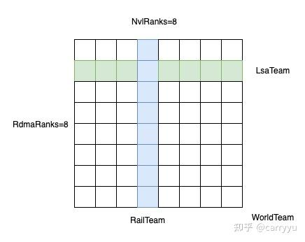
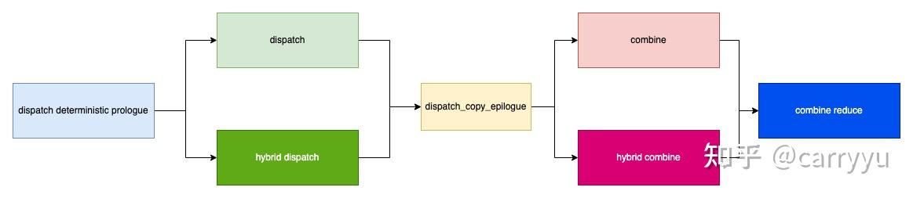

## 1. 背景

首先感谢 DeepSeek 团队的开源，DeepEP 发布以后，已基本成为业内 EP 并行 [AllToAll 通信](https://zhida.zhihu.com/search?content_id=274936799&content_type=Article&match_order=1&q=AllToAll+%E9%80%9A%E4%BF%A1&zhida_source=entity)的标配；

自 EP 并行大规模使用以来，业界也根据各自的场景对 AllToAll 通信部分进行了一些适配修改，其中让笔者印象比较深刻的是 [HybridEP](https://zhida.zhihu.com/search?content_id=274936799&content_type=Article&match_order=1&q=HybridEP&zhida_source=entity) 和低时延下的两阶段通信；

[DeepEP v2](https://zhida.zhihu.com/search?content_id=274936799&content_type=Article&match_order=1&q=DeepEP+v2&zhida_source=entity) 的发布在笔者看来进一步**完善**了对各种场景的适配，本文会按照总-分-总的结构对 DeepEP v2 进行分析，**以下内容仅为个人基于当前认知的观点，受经验与学识所限，难免有不足，仅作抛砖引玉。**

## 2. 三种 Team



如上图所示，v2 的实现中存在三种 Team，分别是 World、Rail 以及 Lsa；

-   WorldTeam：包含全局所有卡；
-   RailTeam：包含所有 [ScaleOut 节点](https://zhida.zhihu.com/search?content_id=274936799&content_type=Article&match_order=1&q=ScaleOut+%E8%8A%82%E7%82%B9&zhida_source=entity)的相同 ScaleUpRank 的卡，比如多机的相同机内 rank 节点；
-   LsaTeam：包含同一 ScaleOut 节点的所有 ScaleUpRank 的卡，比如单机内；

v2 中实现了两套通信，分别是 [dispatch/combine](https://zhida.zhihu.com/search?content_id=274936799&content_type=Article&match_order=1&q=dispatch%2Fcombine&zhida_source=entity) 和 hybrid\_dispatch/hyhbrid\_combine；

-   dispatch/combine 面向”一跳”场景，所有节点均视为同一 ScaleUp 网络内，通过 kIsScaleupNVLink 判断是否通过 NVLink 互联；
-   hybrid\_dispatch/hybrid\_combint 面向”两跳场景”，比如上图的 8 机 64 卡通信；

考虑到 hybrid 场景较复杂，所以本文主要针对 hybrid 场景进行分析，在这个基础上自行分析非 hybrid 场景也比较简单；

由于个人表述习惯，后续 ScaleOut 通过 [RdmaRank](https://zhida.zhihu.com/search?content_id=274936799&content_type=Article&match_order=1&q=RdmaRank&zhida_source=entity) 表达，ScaleUp 通过 NvlRank 表达；

## 3. 大致思路

在仔细分析代码之前，最好先对整个通信框架的设计思路有一个大概的认识，便于理解；

### 3.1 整体流程



整个调用流程如上：

1.  dispatch\_deterministic\_prologue 用于确定性推理，通过 deterministic 判断是否开启；
2.  dispatch\_copy\_epilogue 负责将通信 layout 转换为矩阵 layout；
3.  combine\_reduce 用于进行最后的规约，hybrid 场景下为 Rdma 收到结果的 reduce，否则为 Nvlink 收到结果的 reduce；

### 3.2 主要 Diff 点

v2 与 v1 最大的区别在于[通信 buffer](https://zhida.zhihu.com/search?content_id=274936799&content_type=Article&match_order=1&q=%E9%80%9A%E4%BF%A1+buffer&zhida_source=entity) 的设计，v1 中通信 buffer 是 expert 主导的 layout，v2 中通信 buffer 是 token 主导的 layout；

最坏场景下的通信 buffer 大小：

1.  v1 的通信 buffer 大小为(num\_local\_experts, num\_ranks, num\_max\_tokens\_per\_rank, hidden\_size)；
2.  v2 的通信 buffer 大小为(num\_ranks, num\_max\_tokens\_per\_rank, hidden\_size)，与 v1 相比缩小 num\_local\_experts 倍；

因此，v2 中不再需要像 v1 高吞吐的实现那样，申请一片较小的通信 buffer，重复使用这块通信 buffer，而是可以直接按照最坏情况申请，消除大量的同步等待；

### 3.3 通信大致流程

#### 3.3.1 hybrid\_dispatch

1.  机间传输：通过 RailTeam 将 token 发送到目标 RdmaRank 的同 NvlRank 下；
2.  机内转发：通过 LsaTeam 将 token 从当前 NvlRank 发送到目标 NvlRank 下；
3.  layout 变换：从通信 layout 转换成矩阵 layout；

其中，第 1、2 步包含在 hybrid\_dispatch kernel 中，第 3 步包含在 dispatch\_copy\_epl kernel 中；

#### 3.3.2 hybrid\_combine

1.  本地规约：token 命中本地多个 expert 时，先进行本地规约，即 local reduce；
2.  Nvl 规约：token 命中当前 RdmaRank 的多个 NvlRank 时，对多个 NvlRank 的结果进行规约，即 nvl reduce；
3.  Rdma 规约：token 命中了多个 RdmaRank，对多个 RdmaRank 的结果进行规约，即 rdma reduce；

其中，第 1、2 步包含在 hybrid\_combine kernel 中，第 3 步包含在 combine\_reduce kernel 中；

通信实现的关键点就在于数据在多次转发过程中，怎么保存 meta 信息，并根据相关信息进行 dispatch 和 combine；

DeepEP v2 的核心思路与 HybridEP 类似，但实现上更加完善，支持了前后处理以及确定性推理相关的逻辑；

## 4. 实现细节

本文的分析限定在非 deterministic、kAllowMultipleReduction=True、kUseExpandedLayout=True 的场景下（其余场景核心思路差别不大）；

### 4.1 HybridDispatch

hybrid\_dispatch 中划分出了三类 warp，分别是 notify、scaleout、forward，接下来分别介绍；

### 4.2 Dispatch Notify

主要目的是产出 psum\_num\_recv\_tokens\_per\_scaleup\_rank 和 psum\_num\_recv\_tokens\_per\_expert，用于在 dispatch\_copy\_epl 中将 tensor 从通信 layout 转换成矩阵 layout，大概流程是首先本地统计，Rail 之间互传数据后统计 Rdma 节点级别的数据，再通过 Lsa 互传后统计 NVLink 节点级别的数据；

```cpp
__device__ __forceinline__ int get_master_lane_idx(const unsigned& mask) {
    // Equivalent to `31 - __clz(mask)`
    int highest_idx;
    asm volatile(「bfind.u32 %0, %1;」 : 「=r」(highest_idx) : 「r」(mask));
    return highest_idx;
}

__device__ __forceinline__ bool deduplicate(const int& value, const int& lane_idx) {
    return get_master_lane_idx(match(value)) == lane_idx;
}

for (int i = global_warp_idx; i < num_tokens; i += kNumNotifyWarps * kNumSMs) {
    // Expert choice can not be redundant
    // NOTES: no assertions here as they are expensive
    const auto dst_expert_idx = lane_idx < kNumTopk ?
        static_cast<int>(__ldg(topk_idx + i * kNumTopk + lane_idx)) : -1;
    if (dst_expert_idx >= 0)
        atomicAdd_block(expert_count + dst_expert_idx, 1);

    // Rank choice should do deduplication here
    const auto dst_rank_idx = dst_expert_idx >= 0 ? dst_expert_idx / kNumExpertsPerRank : -1;
    if (ptx::deduplicate(dst_rank_idx, lane_idx) and dst_rank_idx >= 0)
        atomicAdd_block(rank_count + dst_rank_idx, 1);
}
ptx::named_barrier<kNumNotifyThreads>(kNotifyBarrierIndex);
```

首先统计本地发送到每专家，每 rank 的 token 个数；deduplicate 作用是当 value 相同时，选取其中最高位的 lane\_idx；

```cpp
#pragma unroll
for (int i = thread_idx; i < kNumRanks + kNumExperts; i += kNumNotifyThreads) {
    const int64_t counter = (1ll << 32ll) | rank_expert_count[i];
    ptx::red_add(workspace_layout.get_notify_reduction_workspace_ptr() + i, counter);
}
```

统计到的值，将第 32 位设置为 1，之后累加到目标位置，目的是后续进行 grid 级别的同步；

```cpp
template <typename dtype_t>
__forceinline__ __device__ __host__ dtype_t encode_decode_positive(const dtype_t& value) {
    return -value - static_cast<dtype_t>(1);
}

#pragma unroll
for (int i = thread_idx; i < kNumRanks + kNumExperts; i += kNumNotifyThreads) {
    comm::timeout_while<kNumTimeoutCycles>([=](const bool& is_last_check) {
        const auto status = ptx::ld_volatile<int64_t>(workspace_layout.get_notify_reduction_workspace_ptr() + i);
        if ((status >> 32) == kNumSMs) {
            // Encode and write into the send buffer
            workspace_layout.get_scaleout_rank_expert_count_ptr<true>()[i] =
                math::encode_decode_positive<int>(status & 0xffffffffll);

            // Clean for the next usage
            workspace_layout.get_notify_reduction_workspace_ptr()[i] = 0;
            return true;
        }

        if (is_last_check) {
            printf(「DeepEP hybrid notify (GPU reduction) timeout, scale-out: %d/%d, scale-up: %d/%d, 」
                    「thread: %d, status: %d | %d, expected: %d\n」,
                    scaleout_rank_idx, kNumScaleoutRanks, scaleup_rank_idx, kNumScaleupRanks, thread_idx,
                    static_cast<int>(status >> 32), static_cast<int>(status & 0xffffffff), kNumSMs);
        }
        return false;
    });
}
ptx::named_barrier<kNumNotifyThreads>(kNotifyBarrierIndex);
```

紧接上文，通过判断第 32 位的值是不是 kNumSMs，进行 grid 级别的同步；

确认所有 cta 完成后将 scaleout 的 gmem 设置为统计值，用于后续 RdmaRanks 之间的交互；

这里的 encode\_decode\_positive 用于进行有效值正负映射；

```cpp
if (thread_idx < kNumScaleoutRanks) {
    const auto dst_scaleout_rank_idx = thread_idx;
    // 发到对端 rdma rank 上各 nvl rank 的 token 数
    gin.put<ncclTeamTagRail>(
        workspace_layout.get_scaleout_rank_count_ptr<false>(scaleout_rank_idx),
        workspace_layout.get_scaleout_rank_count_ptr<true>(dst_scaleout_rank_idx),
        kNumScaleupRanks * sizeof(int), dst_scaleout_rank_idx,
        ncclGinOptFlagsAggregateRequests);
    // 发到对端 rdma rank 上各 local expert 的 token 数
    gin.put<ncclTeamTagRail>(
        workspace_layout.get_scaleout_expert_count_ptr<false>(scaleout_rank_idx),
        workspace_layout.get_scaleout_expert_count_ptr<true>(dst_scaleout_rank_idx),
        kNumExpertsPerScaleout * sizeof(int), dst_scaleout_rank_idx);
}
__syncwarp();
```

通过 Rail 将上述统计到的数据发送到其余 RdmaRanks 的对应位置上；

```cpp
// Util functions to get metadata from scale-out peers
// NOTES: this is correct as RDMA operations has a minimum write granularity of 1024 bytes (a whole integer write is atomic)
const auto recv_and_reduce = [=](const auto& get_ptr_func, const bool& is_expert_reduction = false) -> int {
    int count = 0;
    #pragma unroll
    for (int j = 0; j < kNumScaleoutRanks; ++ j) {
        // 从 scaleout rank 收到的 token 数据
        const auto ptr = get_ptr_func(j);
        int decoded;
        comm::timeout_while<kNumTimeoutCycles>([&](const bool& is_last_check){
            decoded = math::encode_decode_positive(ptx::ld_acquire_sys<int>(ptr));
            if (math::is_decoded_positive_ready(decoded))
                return true;

            if (is_last_check) {
                printf(「DeepEP hybrid notify (scale-out %s reduction) timeout, 」
                        「scale-out: %d, scale-up: %d, 」
                        「thread: %d, wait scale-out: %d, decoded: %d\n」,
                        is_expert_reduction ? 「expert」 : 「rank」,
                        scaleout_rank_idx, scaleup_rank_idx, thread_idx, j,
                        decoded);
            }
            return false;
        });

        // Add and clean for next usages
        count += decoded, *ptr = 0;
    }
    return count;
};

// rdma recv and nvlink send
// Write into all scale-up peers『 rank-level counters
#pragma unroll
for (int i = thread_idx; i < kNumScaleupRanks; i += kNumNotifyThreads) {
    // Wait scale-out arrival and reduce
    // 某个 scaleup rank 从所有 scaleout rank 收到的 token 数量
    const auto count = recv_and_reduce([=](const int& scaleout_peer_idx) {
        return workspace_layout.get_scaleout_rank_count_ptr<false>(scaleout_peer_idx, i);
    });

    // Write into the remote scale-up peer
    // 前 32 位用来同步
    const int64_t counter = (static_cast<int64_t>(kNumScaleupRanks) << 32ll) | count;
    // 每个位置的 flag 就是 kNumScaleupRanks，根据下面的逻辑定的，为了 check 时候的逻辑统一
    gin.put_value<ncclTeamTagLsa>(
        workspace_layout.get_scaleup_rank_count_ptr<false>() + scaleup_rank_idx,
        counter, i);
}
__syncwarp();

// Atomic add into all scale-up peers』 expert-level counters
#pragma unroll
for (int i = thread_idx; i < kNumExpertsPerScaleout; i += kNumNotifyThreads) {
    // Wait scale-out arrival and reduce
    // 某个 expert 从所有 scaleout rank 收到的 token 数量
    const auto count = recv_and_reduce([=](const int& scaleout_peer_idx) {
        return workspace_layout.get_scaleout_expert_count_ptr<false>(scaleout_peer_idx, i);
    }, true);

    // Write into the remote scale-up peer
    const int64_t counter = (1ll << 32ll) | count;
    const auto dst_scaleup_rank_idx = i / kNumExpertsPerRank;
    const auto expert_idx_in_dst_rank = i % kNumExpertsPerRank;
    // 累加结果
    // 每个位置的 flag 最后累加起来就是 kNumScaleupRanks
    // expert reduce here
    gin.red_add_rel<ncclTeamTagLsa>(
        workspace_layout.get_scaleup_expert_count_ptr<false>() + expert_idx_in_dst_rank,
        counter, dst_scaleup_rank_idx);
}
// There are shared memory reads above, a barrier is necessary
ptx::named_barrier<kNumNotifyThreads>(kNotifyBarrierIndex);
```

根据 RdmaRanks 之间收到的数据，进行统计：

1.  统计当前节点上的所有 NvlRanks 从该 RailTeam 的所有 RdmaRanks 收到的 token 个数；
2.  统计当前节点上的所有 experts 从该 RailTeam 的所有 RdmaRanks 收到的 token 个数；

同样，前 32 位用来同步，为了逻辑统一 rank\_count 的前 32 位直接放 kNumScaleupRanks；

统计完成后就发送到对应的 NvlRank；

```cpp
// Wait local counters to be ready
// NOTES: here we only care the prefix sum by scale-up peers (used for later epilogue), not all ranks
EP_STATIC_ASSERT(kNumNotifyWarps == 0 or kNumScaleupRanks + kNumExpertsPerRank <= kNumNotifyWarps * 32,
                    「Insufficient notify threads」);
comm::timeout_while<kNumTimeoutCycles>(thread_idx < kNumScaleupRanks + kNumExpertsPerRank,
    [&](const bool& is_last_check) {
    const auto status = ptx::ld_volatile<int64_t>(workspace_layout.get_scaleup_rank_expert_count_ptr<false>() + thread_idx);
    if ((status >> 32ull) == kNumScaleupRanks) {
        // Clean GPU workspace and write into host workspace
        const auto count = static_cast<int>(status & 0xffffffffll);
        const auto aligned_count = math::align<int>(
            count, thread_idx < kNumScaleupRanks ? 1 : kExpertAlignment);

        workspace_layout.get_scaleup_rank_expert_count_ptr<false>()[thread_idx] = 0;
        if constexpr (kDoCPUSync) {
            host_workspace_layout.get_scaleup_rank_expert_count_ptr<false>()[thread_idx] =
                math::encode_decode_positive(aligned_count);
        }

        // Update statistics counters
        if (cumulative_local_expert_recv_stats != nullptr and thread_idx >= kNumScaleupRanks)
            atomicAdd(cumulative_local_expert_recv_stats + (thread_idx - kNumScaleupRanks), count);

        // Save for later prefix sum calculation
        rank_expert_count[thread_idx] = aligned_count;
        return true;
    }

    if (is_last_check) {
        printf(「DeepEP hybrid notify (scale-up reduction) timeout,」
                「scale-out: %d/%d, scale-up: %d/%d, 」
                「thread: %d, status: %d | %d, expected: %d\n」,
                scaleout_rank_idx, kNumScaleoutRanks, scaleup_rank_idx, kNumScaleupRanks, thread_idx,
                static_cast<int>(status >> 32), static_cast<int>(status & 0xffffffff), kNumScaleupRanks);
    }
    return false;
});
ptx::named_barrier<kNumNotifyThreads>(kNotifyBarrierIndex);
```

各 NvlRank 等待上一步统计完成；

```cpp
// local compute
// Do prefix sum by the warps of the first SM
// NOTES: we may have fast implementation with `cub::BlockScan`, but it is too heavy to use
const auto do_psum = [=](const int* count, int* out, const int n, const int is_exclusive) {
    int psum = 0;
    #pragma unroll
    for (int i = 0; i < math::ceil_div(n + is_exclusive, 32); ++ i) {
        const auto idx = i * 32 + lane_idx;
        const auto mem_idx = idx - is_exclusive;
        const auto value = (0 <= mem_idx and mem_idx < n) ? count[mem_idx] : 0;
        const auto sum = psum + ptx::warp_inclusive_sum(value, lane_idx);

        // Store into global memory
        if (idx < n + is_exclusive)
            out[idx] = sum;

        // Update `psum` by using the last lane『s value
        psum = ptx::exchange(sum, 31);
    }
};
if (warp_idx == 0) {
    // Inclusive prefix sum
    do_psum(rank_count, psum_num_recv_tokens_per_scaleup_rank, kNumScaleupRanks, 0);
} else if (warp_idx == 1) {
    // Exclusive prefix sum for later expanding
    do_psum(expert_count, psum_num_recv_tokens_per_expert, kNumExpertsPerRank, 1);
}
```

根据收到的统计结果进行最后一次 prefix sum 计算，psum\_num\_recv\_tokens\_per\_expert 是计算的 Exclusive prefix sum；

这里计算出的两个 psum meta 数据，主要是用来确定后续 dispatch\_copy\_epl 中的 token 搬运下标；

### 4.3 Dispatch ScaleOut

该部分的作用是通过 RailTeam 进行 RdmaRanks 之间相同 NvlRank 的数据传输；

```cpp
// Channel metadata maintenance
EP_STATIC_ASSERT(kNumScaleoutRanks <= 32, 「Invalid number of scale-out ranks」);
int stored_scaleout_tail = 0, stored_old_scaleout_tail = 0;
const auto update_scaleout_tail = [&](const bool& finish_flag = false) {
    if (lane_idx < kNumScaleoutRanks and
        (stored_scaleout_tail >= stored_old_scaleout_tail + kScaleoutUpdateInterval or finish_flag)) {
        const auto signaled_tail = math::pack2<int, int64_t>(finish_flag, stored_scaleout_tail);
        const auto ptr = workspace_layout.get_scaleout_channel_signaled_tail_ptr(channel_idx, scaleout_rank_idx);
        const auto old_signaled_tail = math::pack2<int, int64_t>(0, stored_old_scaleout_tail);

        // NOTES: the 「release」 scope will be `sys` for the local rank (we may involve NVLink so not `gpu`)
        // For RDMA requests, 「release」 is ensured by 「atomic」
        gin.red_add_rel<ncclTeamTagRail>(ptr, signaled_tail - old_signaled_tail, lane_idx);
        stored_old_scaleout_tail = stored_scaleout_tail;
    }
    __syncwarp();
};
```

为了与 Forward Warp 形成流水线，会维护一个 tail，表明当前处理到的位置；

可以看到，当 ScaleOut Warp 每处理 kScaleoutUpdateInterval（默认为 3）个 token，或者处理结束时，会进行 tail 的更新，即唤醒 Forward Warp；

```cpp
// Preload next token
const auto preload_next_token = [&](const int& token_idx) {
    if (token_idx >= num_tokens)
        return;

    // Issue TMA load
    const auto token_i64_idx = static_cast<int64_t>(token_idx);
    if (ptx::elect_one_sync()) {
        ptx::tma_load_1d(tma_buffer.get_hidden_ptr(), math::advance_ptr(x, token_i64_idx * kNumHiddenBytes),
                            mbarrier_ptr, kNumHiddenBytes);
    }
    __syncwarp();

    // Issue SF `cp.async`
    if constexpr (kNumSFPacks > 0) {
        EP_STATIC_ASSERT(sizeof(sf_pack_t) % 4 == 0, 「Unaligned SF element type」);
        const auto gmem_src_ptr = math::advance_ptr<sf_pack_t>(sf, token_i64_idx * sf_token_stride * sizeof(sf_pack_t));
        const auto smem_dst_ptr = tma_buffer.get_sf_ptr();

        constexpr auto kNumFullIters = kNumSFPacks / 32;
        #pragma unroll
        for (int k = 0; k < kNumFullIters; ++ k) {
            ptx::cp_async_ca(gmem_src_ptr + (k * 32 + lane_idx) * sf_hidden_stride,
                                smem_dst_ptr + k * 32 + lane_idx);
        }
        if (kNumFullIters * 32 + lane_idx < kNumSFPacks) {
            ptx::cp_async_ca(gmem_src_ptr + (kNumFullIters * 32 + lane_idx) * sf_hidden_stride,
                                smem_dst_ptr + kNumFullIters * 32 + lane_idx);
        }
        ptx::cp_async_mbarrier_arrive(mbarrier_ptr);
        __syncwarp();
    }
};
```

这部分即加载一个 token 的 input 和 scale 到 tma\_buffer（smem）中；

```cpp
// Iterate all tokens
preload_next_token(channel_idx);
for (int token_idx = channel_idx; token_idx < num_tokens; token_idx += kNumChannels) {
    // Load top-k indices and weights
    EP_STATIC_ASSERT(kNumTopk <= 32, 「Insufficient lanes for loading top-k indices」);
    int stored_dst_scaleout_rank_idx = -1;
    if (lane_idx < kNumTopk) {
        const auto uncasted_dst_expert_idx = __ldg(topk_idx + token_idx * kNumTopk + lane_idx);
        const auto dst_expert_idx = static_cast<int>(uncasted_dst_expert_idx);
        stored_dst_scaleout_rank_idx = dst_expert_idx >= 0 ? dst_expert_idx / kNumExpertsPerScaleout : -1;
        tma_buffer.get_topk_idx_ptr()[lane_idx] = dst_expert_idx;
        if (topk_weights != nullptr)
            tma_buffer.get_topk_weights_ptr()[lane_idx] = __ldg(topk_weights + token_idx * kNumTopk + lane_idx);
        if (copied_topk_idx != nullptr)
            copied_topk_idx[token_idx * kNumTopk + lane_idx] = uncasted_dst_expert_idx;
    }
    __syncwarp();

    // Add source metadata (rank index and token index)
    if (ptx::elect_one_sync())
        *tma_buffer.get_src_token_global_idx_ptr() = rank_idx * kNumMaxTokensPerRank + token_idx;
    ptx::tma_store_fence();
    __syncwarp();
    ...
}
```

将 token 搬运到 tma\_buffer 中，这里在每个 token 的尾部，将对应的 topk 信息也写入，并记录了源 token 地址；

写 topk 信息的目的是指导后续进一步发送到哪个 NvlRank，记录源 token 地址是为了 combine 阶段逆向；

```cpp
for (int token_idx = channel_idx; token_idx < num_tokens; token_idx += kNumChannels) {
    // Deduplicate ranks and assign slots
    int stored_dst_slot_idx = -1;
    // stored_scaleout_tail 前 kNumScaleoutRanks 个 thread 拿着对应的写入 token 个数
    // 读取到目标 rank 的当前 tail，结合下面看
    const auto stored_old_slot_idx = ptx::exchange(
        stored_scaleout_tail, stored_dst_scaleout_rank_idx >= 0 ? stored_dst_scaleout_rank_idx : 0);
    // 去重，到同一 stored_dst_scaleout_rank_idx 的只选择一个 lane
    if (ptx::deduplicate(stored_dst_scaleout_rank_idx, lane_idx) and stored_dst_scaleout_rank_idx >= 0)
        stored_dst_slot_idx = stored_old_slot_idx;

    // Update scale-out tail
    // 32 位，stored_dst_scaleout_rank_idx 大于 0 则对应 bit 位置为 1，对应上面要求 scaleout ranks 小于 32
    const auto scaleout_rank_mask = ptx::reduce_or(stored_dst_scaleout_rank_idx >= 0 ? (1u << stored_dst_scaleout_rank_idx) : 0u);
    // 到每个 rank 的 tail 是否加 1, lane_idx 对应 scaleout_rank
    stored_scaleout_tail += (scaleout_rank_mask >> lane_idx) & 1;

    // Wait TMA arrival and issue the TMA store into send buffer
    if (ptx::elect_one_sync()) {
        ptx::mbarrier_arrive_and_set_tx(mbarrier_ptr, kNumHiddenBytes);
        ptx::mbarrier_wait_and_flip_phase(mbarrier_ptr, phase);

        // So if no ranks will Go by RDMA, we skip the send buffer stores
        // (1 << scaleout_rank_idx)表示只发到本地的 mask
        // 当 scaleout_rank_mask 同样只发到本地时，异或结果为 0
        if (scaleout_rank_mask ^ (1 << scaleout_rank_idx)) {
            ptx::tma_store_1d(scaleout_send_buffer.get_token_buffer(token_idx).get_base_ptr(),
                                tma_buffer.get_base_ptr(), tma_buffer.get_num_bytes<false>());
        }
    }
    __syncwarp();
    // Local rank can be bypassed
    // 发到本地
    if (stored_dst_slot_idx >= 0 and stored_dst_scaleout_rank_idx == scaleout_rank_idx) {
        ptx::tma_store_1d(scaleout_recv_buffer.get_token_buffer(stored_dst_slot_idx).get_base_ptr(),
                            tma_buffer.get_base_ptr(), tma_buffer.get_num_bytes<false>());
    }
    ptx::tma_store_commit();
    ptx::tma_store_wait();
    __syncwarp();
}
```

根据每个 token 的 expert 信息，找到需要发送到哪个 RdmaRank；

前 RdmaRanks 个 lane 保存着到目标 RdmaRank 的 token 下标；

如果该 token 只需要发到本地，则跳过从 tma\_buffer 存储到 rdma\_send\_buffer，直接存储到 rdma\_recv\_buffer 中；

```cpp
for (int token_idx = channel_idx; token_idx < num_tokens; token_idx += kNumChannels) {
    // Preload the next token (overlapping with the IBGDA issues)
    preload_next_token(token_idx + kNumChannels);

    // Issue IBGDA requests
    if (stored_dst_slot_idx >= 0 and stored_dst_scaleout_rank_idx != scaleout_rank_idx) {
        gin.put<ncclTeamTagRail>(
                scaleout_recv_buffer.get_token_buffer(stored_dst_slot_idx).get_base_ptr(),
                scaleout_send_buffer.get_token_buffer(token_idx).get_base_ptr(),
                tma_buffer.get_num_bytes<false>(),
                stored_dst_scaleout_rank_idx,
                ncclGinOptFlagsAggregateRequests);
    }
    __syncwarp();

    // Issue scale-out tail update
    update_scaleout_tail();
}
// Flush unflushed tails
update_scaleout_tail(true);
```

加载下一个 token，通过 RailTeam 将 token 发送到对应 RdmaRank 上，并更新 tail，唤醒 Forward 节点；

### 4.4 Dispatch Forward

该部分的作用是将 Rdma 节点间收到的 token，转发到不同的 NvlRank 上；

```cpp
// Shape of `token_metadata_at_forward`: `[kNumChannels, kNumScaleoutRanks * kNumMaxTokensPerChannel + 1, kNumForwardMetadataDims]`
// 这里+1 是为了结束哨兵
// 源 token idx + 末尾标记 + 每个 topk 的目标 scale-up rank 与 slot）, 实际是 kNumScaleoutRanks * kNumMaxTokensPerRank * ~
constexpr int kNumForwardMetadataDims = 2 + kNumTopk * 2;
token_metadata_at_forward += channel_idx * ((kNumScaleoutRanks * kNumMaxTokensPerChannel + 1) * kNumForwardMetadataDims);

// Shape of `dst_buffer_slot_idx`: `[kNumChannels, kNumScaleoutRanks, kNumMaxTokensPerChannel, kNumTopk]`
dst_buffer_slot_idx += channel_idx * (kNumScaleoutRanks * kNumMaxTokensPerChannel * kNumTopk);

// Transform linked list index
// (channel_idx, idx（stored_scaleup_send_counters）, scaleup_rank_idx) -> linear_idx
// [kNumChannel, kNumMaxTokensPerChannel * kNumScaleoutRanks + 1, kNumScaleupRanks]
const auto transform_linked_list_idx = [=](const int& idx) {
    constexpr int kNumTokensInLinkedList = kNumMaxTokensPerChannel * kNumScaleoutRanks + 1;
    return channel_idx * (kNumTokensInLinkedList * kNumScaleupRanks) +
        idx * kNumScaleupRanks + scaleup_rank_idx; // 自 scaleup_rank_idx 发送，来自哪个 channel 的哪个位置
};

// Forward tokens from scale-out ranks
EP_STATIC_ASSERT(kNumScaleoutRanks <= 32, 「Too many scale-out ranks」);
int num_tokens_processed = 0;
int stored_scaleout_old_tail_idx = 0;
// 每个 lane 上的 stored_scaleup_send_counters 表示发给 lane_idx scaleup rank 的累计计数
int stored_scaleup_send_counters[kNumScaleupRanksPerLane] = {};
int stored_finish_flag = lane_idx >= kNumScaleoutRanks;
int stored_scaleout_tail_idx = 0;
int recv_scaleout_rank_idx = channel_idx % kNumScaleoutRanks;
uint32_t wip_mask;
```

一些前置工作，token\_metadata\_at\_forward 用于 combine 阶段的逆向；

kNumForwardMetadataDims 中的 2 + kNumTopk \* 2，分别代表：

1.  源 token 下标；
2.  是否末尾的标记；
3.  每个 topk 对应的 nvl rank 和存放下标；

kNumScaleoutRanks \* kNumMaxTokensPerChannel + 1 的目的是，最后位置放结束哨兵，combine 中靠这个跳出循环；

transform\_linked\_list\_idx 的目的是将(channel\_idx, idx, nvl\_rank)的三元组转换成线性形式，表示是从哪个 nvl\_rank 的哪个 channel\_idx 的哪个位置发送过来的，同样用于 combine 阶段溯源；

```cpp
// 聚合所有 scaleout rank 的 tail 状态和结束标志
// 循环处理来自所有 scaleout rank 的 token，轮询
while ((wip_mask = ptx::gather(stored_scaleout_tail_idx > stored_scaleout_old_tail_idx or stored_finish_flag == 0))) {
    // Pick next rank in round-robin
    const auto offset = (recv_scaleout_rank_idx + 1) % kNumScaleoutRanks;
    const auto hi_mask = (wip_mask >> offset) << offset;
    recv_scaleout_rank_idx = hi_mask ? ptx::ffs(hi_mask) : ptx::ffs(wip_mask);

    // Wait for this rank to have data (or finish)
    comm::timeout_while<kNumTimeoutCycles>([&](const bool& is_last_check) {
        const uint32_t arrived_or_finished =
            stored_scaleout_tail_idx > stored_scaleout_old_tail_idx or stored_finish_flag > 0;
        // 本次处理轮询到的 recv_scaleout_rank_idx
        // 即从 recv_scaleout_rank_idx 收到的 stored_scaleout_old_tail_idx 到 stored_scaleout_tail_idx 的 token
        if (ptx::exchange(arrived_or_finished, recv_scaleout_rank_idx))
            return true;

        // Timeout
        if (is_last_check) {
            if (lane_idx < kNumScaleoutRanks) {
                printf(「DeepEP hybrid dispatch (forwarding) timeout, scale-out: %d, scale-up: %d, 」
                        「channel: %d, lane: %d, old scale-out tail: %d, scale-out tail: (%d, %d)\n」,
                        scaleout_rank_idx, scaleup_rank_idx,
                        channel_idx, lane_idx, stored_scaleout_old_tail_idx,
                        stored_finish_flag, stored_scaleout_tail_idx);
            }
            return false;
        }

        // Read new signaled tails
        if (lane_idx < kNumScaleoutRanks) {
            const auto signaled_tail = ptx::ld_acquire_sys<int64_t>(
                workspace_layout.get_scaleout_channel_signaled_tail_ptr(channel_idx, lane_idx));
            // 这里更新了每个 lane 的 stored_finish_flag 和 stored_scaleout_tail_idx
            math::unpack2<int, int64_t>(signaled_tail, stored_finish_flag, stored_scaleout_tail_idx);
        }
        __syncwarp();
        return false;
    });
}
```

第一段是轮询处理不同的 RdmaRank 发来的数据；

而后前 RdmaRanks 个 lane 更新对应位置的 tail 信息，判断是否有新数据送达，如果有则进行后续处理；

```cpp
while ((wip_mask = ptx::gather(stored_scaleout_tail_idx > stored_scaleout_old_tail_idx or stored_finish_flag == 0))) {
    // Process one chunk from the current rank
    // 这里不会覆盖每个 lane 自身的 stored_scaleout_old_tail_idx 和 stored_scaleout_tail_idx
    const auto start_slot_idx = ptx::exchange(stored_scaleout_old_tail_idx, recv_scaleout_rank_idx);
    const auto end_slot_idx = std::min(
        ptx::exchange(stored_scaleout_tail_idx, recv_scaleout_rank_idx),
        start_slot_idx + kNumSlotsPerForwardChunk
    );
    // 本身的 lane 要更新 stored_scaleout_old_tail_idx
    if (lane_idx == recv_scaleout_rank_idx)
        stored_scaleout_old_tail_idx = end_slot_idx;
    
    // 从 recv_scaleout_rank_idx 发来的 token
    const auto recv_buffer = scaleout_recv_buffer.get_rank_buffer(recv_scaleout_rank_idx);
    for (int slot_idx = start_slot_idx; slot_idx < end_slot_idx; ++ slot_idx) {
        const auto token_buffer = recv_buffer.get_token_buffer(slot_idx);

        // Wait TMA arrival
        ptx::tma_store_wait();
        __syncwarp();

        // TMA load into shared memory
        if (ptx::elect_one_sync()) {
            ptx::tma_load_1d(tma_buffer.get_base_ptr(), token_buffer.get_base_ptr(),
                                mbarrier_ptr, token_layout.get_num_bytes<false>());
            ptx::mbarrier_arrive_and_set_tx(mbarrier_ptr, token_layout.get_num_bytes<false>());
            ptx::mbarrier_wait_and_flip_phase(mbarrier_ptr, phase);
        }
        __syncwarp();

        // Read top-k indices
        EP_STATIC_ASSERT(kNumTopk <= 32, 「Too many top-k selections」);
        int stored_dst_scaleup_rank_idx = -1;
        auto dst_expert_idx = lane_idx < kNumTopk ? tma_buffer.get_topk_idx_ptr()[lane_idx] : -1;
        dst_expert_idx -= scaleout_rank_idx * kNumExpertsPerScaleout;
        stored_dst_scaleup_rank_idx = 0 <= dst_expert_idx and dst_expert_idx < kNumExpertsPerScaleout ?
            dst_expert_idx / kNumExpertsPerRank : -1; // 当前 lane 代表的 topk 写到哪个 scaleup rank

        // Write the per-scaleup channel index for this token
        int linked_list_idx = -1;
        #pragma unroll
        for (int j = 0; j < kNumScaleupRanksPerLane; ++ j) {
            const auto src_lane_idx = stored_dst_scaleup_rank_idx - j * 32;
            const bool valid = 0 <= src_lane_idx and src_lane_idx < 32;
            // 获取对应的累计下标
            const auto exchanged = ptx::exchange(
                stored_scaleup_send_counters[j], valid ? src_lane_idx : 0);
            linked_list_idx = valid ? exchanged : linked_list_idx;
        }
        if (not kReuseSlotIndices and lane_idx < kNumTopk) {
            // 记录 是从 当前 scaleup rank 的 channel_idx 通道中第 linked_list_idx 个 token 位置处 发出的
            tma_buffer.get_linked_list_idx_ptr()[lane_idx] = transform_linked_list_idx(linked_list_idx);
            ptx::tma_store_fence();
        }
        __syncwarp();
    }
}
```

首先对本次收到数据的范围进行更新，即 start\_slot\_idx 到 end\_slot\_idx，默认是每 3 个处理一次；

将收到的 token 数据加载到 tma\_buffer（smem），根据 topk 信息计算要发送到哪个 NvlRank；

stored\_scaleup\_send\_counters 中记录了当前是发到这个 NvlRank 的第几个 token，更新到 linked\_list 中，用于后续溯源；

```cpp
while ((wip_mask = ptx::gather(stored_scaleout_tail_idx > stored_scaleout_old_tail_idx or stored_finish_flag == 0))) {
    for (int slot_idx = start_slot_idx; slot_idx < end_slot_idx; ++ slot_idx) {
        // Deduplicate for scale-up ranks
        int stored_dst_slot_idx = -1;
        const auto dst_slot_idx_ptr = dst_buffer_slot_idx +
            recv_scaleout_rank_idx * (kNumMaxTokensPerChannel * kNumTopk) + slot_idx * kNumTopk;
        if constexpr (kReuseSlotIndices) {
            if (lane_idx < kNumTopk)
                stored_dst_slot_idx = __ldg(dst_slot_idx_ptr + lane_idx);
        } else {
            // Deduplicate for NVLink ranks
            // 多个 topk 写到同一个 scaleup rank 中，选一个 lane(最大的那个)
            if (ptx::deduplicate(stored_dst_scaleup_rank_idx, lane_idx) and stored_dst_scaleup_rank_idx >= 0)
                stored_dst_slot_idx = atomicAdd(workspace_layout.get_scaleup_atomic_sender_counter() + stored_dst_scaleup_rank_idx, 1);
        }
        __syncwarp();

        // Issue TMAs
        if (stored_dst_slot_idx >= 0) {
            // 发到 stored_dst_scaleup_rank_idx 对端的 scaleup_rank_idx 对应空间的 stored_dst_slot_idx 位置上
            const auto dst_ptr = gin.get_sym_ptr<ncclTeamTagLsa>(
                scaleup_buffer.get_token_buffer(stored_dst_slot_idx).get_base_ptr(),
                stored_dst_scaleup_rank_idx);
            ptx::tma_store_1d(dst_ptr, tma_buffer.get_base_ptr(), tma_buffer.get_num_bytes<false>());
            ptx::tma_store_commit();
        }
        __syncwarp();

        // Add per-scale-up counter
        EP_STATIC_ASSERT(kNumScaleupRanks <= 64, 「Invalid number of scale-up peers」);
        using mask_t = std::conditional_t<kNumScaleupRanks <= 32, unsigned, unsigned long long>;
        // 命中的所有 scaleup rank 掩码
        const auto scaleup_send_mask = ptx::reduce_or(
            stored_dst_scaleup_rank_idx >= 0 ?
            (mask_t(1) << stored_dst_scaleup_rank_idx) : mask_t(0));
        // 累计发送计数，这里 kNumScaleupRanksPerLane 就按 1 看，主要是为了涵盖超节点的实现
        // 每个 lane 维护的是发送给 lane_idx scaleup rank 的累计下标
        #pragma unroll
        for (int j = 0; j < kNumScaleupRanksPerLane; ++ j)
            stored_scaleup_send_counters[j] += (scaleup_send_mask >> (j * 32 + lane_idx)) & 1;

        // Record metadata at forward
        if constexpr (not kReuseSlotIndices) {
            EP_STATIC_ASSERT(kNumTopk <= 32, 「Invalid number of selections」);
            const auto metadata_ptr = token_metadata_at_forward +
                num_tokens_processed * kNumForwardMetadataDims;

            // Source token index and last token index flag
            if (ptx::elect_one_sync()) {
                // 源 token idx
                metadata_ptr[0] = tma_buffer.get_src_token_global_idx_ptr()[0];
                // 是否是当前批次要处理的最后一个 token
                metadata_ptr[1] = slot_idx == (end_slot_idx - 1);
            }

            // Second, original top-k indices and destination slots
            if (lane_idx < kNumTopk) {
                // 当前 token 写到哪个 scaleup rank
                metadata_ptr[2 + lane_idx] = stored_dst_scaleup_rank_idx;
                // 当前 token 写到 scaleup rank 的哪个槽位
                metadata_ptr[2 + kNumTopk + lane_idx] = stored_dst_slot_idx;
                dst_slot_idx_ptr[lane_idx] = stored_dst_slot_idx;
            }
        }
        num_tokens_processed += 1;
        __syncwarp();
    }
}
```

计算发到目标 NvlRank 的下标，如果发到统一 NvlRank 的不同 expert，则通过 deduplicate 去重；

然后使用 tma\_store 指令发起 NVLink 传输，并更新前 NvlRanks 个 lane 维护的 stored\_scaleup\_send\_counters 信息；

最后更新 metadata 信息，用于 combine 阶段；

```cpp
// Assign the source token index part of the metadata into `-1` as an ending mark
if (not kReuseSlotIndices and ptx::elect_one_sync())
    // 为了 combine 的 scaleup reduce 阶段能退出
    token_metadata_at_forward[num_tokens_processed * kNumForwardMetadataDims] = -1;
__syncwarp();

// Update linked list『s ending position
// stored_scaleup_send_counters 本身就是每个 lane 负责一个 scaleup rank 的
// 所以 stored_scaleup_send_counters[0]对于不同 lane 本身就对应了不同的 scaleup rank
// 在对端更新 linked_list 结束位置
// 其余 linked_list 位置都随着 tma_buffer 发过去了
if constexpr (not kReuseSlotIndices) {
    const auto tail_ptr = workspace_layout.get_channel_scaleup_tail_ptr(channel_idx, scaleup_rank_idx);
    #pragma unroll
    for (int i = 0; i < kNumScaleupRanksPerLane; ++ i) {
        if (const auto j = i * 32 + lane_idx; i < (kNumScaleupRanksPerLane - 1) or j < kNumScaleupRanks) {
            ptx::st_relaxed_sys(
                gin.get_sym_ptr<ncclTeamTagLsa>(tail_ptr, j),
                transform_linked_list_idx(stored_scaleup_send_counters[i]));
        }
    }
}
__syncwarp();

// Clean tails for next usages
if (lane_idx < kNumScaleoutRanks)
    *workspace_layout.get_scaleout_channel_signaled_tail_ptr(channel_idx, lane_idx) = 0;
__syncwarp();
```

token\_metadata\_at\_forward 的最后位置置为-1，用作 combine 阶段跳出循环的结束哨兵；

同样设置 linked\_list 的结束哨兵，均用于 combine 阶段；

### 4.5 Dispatch CopyEpl

这个 kernel 的作用是将通信 layout 转换成矩阵 layout，并更新一下 meta 信息用于 combine 阶段；

```cpp
// Current rank indices should be maintained
int current_rank_idx = -1, stored_psum_num_recv_tokens;
int current_rank_start = 0, current_rank_end = 0;
#pragma unroll
for (int i = global_warp_idx; i < num_recv_tokens; i += kNumWarps * kNumSMs) {
    // Calculate token index in the buffer
    while (i >= current_rank_end) {
        current_rank_idx += 1;
        EP_DEVICE_ASSERT(current_rank_idx < kNumScaleupRanks);
        // 每个线程每 32 个迭代取一次数，32 个数取 32 个 rank 的结束位置
        const auto stored_lane_idx = current_rank_idx % 32;
        if (stored_lane_idx == 0 and current_rank_idx + lane_idx < kNumScaleupRanks)
            stored_psum_num_recv_tokens = psum_num_recv_tokens_per_scaleup_rank[current_rank_idx + lane_idx];
        current_rank_start = current_rank_end;
        current_rank_end = ptx::exchange(stored_psum_num_recv_tokens, stored_lane_idx); // 同步到下一个 rank 的结束位置
    }
    // 从 recv buffer 里面拿到当前 current_rank_idx 发来的第 i 个 token
    const auto buffer_token = scaleup_buffer.get_rank_buffer(current_rank_idx).get_token_buffer(i - current_rank_start);

    // Wait buffer releases
    ptx::tma_store_wait();
    __syncwarp();

    // Issue TMA loads
    // Including all stuffs: data, SF, top-k metadata
    if (ptx::elect_one_sync()) {
        ptx::tma_load_1d(tma_buffer.get_base_ptr(), buffer_token.get_base_ptr(),
                            mbarrier_ptr, tma_buffer.get_num_bytes<false>());
        ptx::mbarrier_arrive_and_set_tx(mbarrier_ptr, tma_buffer.get_num_bytes<false>());
    }
    __syncwarp();
}
```

找到本次要处理的从 current\_rank\_idx 发来的第 i 个数据，加载到 tma\_buffer 中；

根据 psum\_num\_recv\_tokens\_per\_scaleup\_rank 得到从当前 current\_rank\_idx 收到的数据的起始和结束偏移；

```cpp
for (int i = global_warp_idx; i < num_recv_tokens; i += kNumWarps * kNumSMs) {
    // Load target expert indices separately to tolerate TMA load latency
    EP_STATIC_ASSERT(kNumTopk <= 32, 「Too many top-k selections」);
    int dst_expert_idx = -1;
    if (lane_idx < kNumTopk)
        dst_expert_idx = buffer_token.get_topk_idx_ptr()[lane_idx];
    __syncwarp();

    // Validate target expert indices and store for non-expand mode
    const auto in_range = expert_start_idx <= dst_expert_idx and dst_expert_idx < expert_end_idx;
    // last valid topk slot，比如 num_topk=8，这里表示命中当前 rank 上专家的最后一个 topk 槽位的下标
    // 挑一个代表 lane，多个 lane 对应的 topk 命中同一 rank 的值也相同。
    const auto master_src_topk_idx = ptx::get_master_lane_idx(ptx::gather(in_range));
    dst_expert_idx = in_range ? dst_expert_idx - expert_start_idx : -1;
    EP_DEVICE_ASSERT(ptx::deduplicate(dst_expert_idx, lane_idx) or dst_expert_idx == -1);
    if (not kDoExpand and lane_idx < kNumTopk)
        recv_topk_idx[i * kNumTopk + lane_idx] = static_cast<topk_idx_t>(dst_expert_idx);
    __syncwarp();

    // Calculate target indices in the tensor
    int dst_tensor_idx = -1;
    if (not kDoExpand and ptx::elect_one_sync()) {
        dst_tensor_idx = i;
    } else if (kDoExpand and dst_expert_idx >= 0) {
        dst_tensor_idx = atomicAdd(psum_num_recv_tokens_per_expert + dst_expert_idx, 1);
    }
    __syncwarp();

    // Wait for TMA arrival
    if (ptx::elect_one_sync())
        ptx::mbarrier_wait_and_flip_phase(mbarrier_ptr, phase);
    __syncwarp();
}
```

获取其 topk 信息，注意这里是从 gmem 中获取而非 smem，目的是与上面 tma\_load 的加载作 overlap；

判断需要的 expert 是否在当前 rank 上，如果在，则拿到 命中当前 rank 上 expert 的最后一个 topk 槽位下标，用于后续算 linked\_list，这里的目的是挑一个代表 lane，因为此时命中的 lane 对应的 linked\_list 均相同，**原因是命中同一 rank 上不同专家的 token，只会存放一次**；

然后根据 psum\_num\_recv\_tokens\_per\_expert 计算在对应 expert 上要放置的 token 下标，并等到 tma\_load 结束；

```cpp
for (int i = global_warp_idx; i < num_recv_tokens; i += kNumWarps * kNumSMs) {
    // Maintain linked list
    if constexpr (kDoCreateLinkedList) {
        if (ptx::elect_one_sync())
            // 记录 dispatch 时是哪个位置收到的？
            // 从哪个 scaleup rank 的哪个 channel 的哪个位置收到的，发到了这边 i 的位置；
            channel_linked_list[tma_buffer.get_linked_list_idx_ptr()[master_src_topk_idx]] = i;
        __syncwarp();
    }

    // Issue TMA stores for data
    if (kDoExpand ? (dst_tensor_idx >= 0) : ptx::elect_one_sync()) {
        ptx::tma_store_1d(math::advance_ptr(recv_x, static_cast<int64_t>(dst_tensor_idx) * kNumHiddenBytes),
                            tma_buffer.get_hidden_ptr(), kNumHiddenBytes);
        ptx::tma_store_commit();
    }
    __syncwarp();

    // Store SF
    if constexpr (kNumSFPacks > 0) {
        constexpr auto kNumFullIters = kNumSFPacks / 32;
        const bool do_last_iter = (kNumSFPacks % 32 != 0) and (kNumFullIters * 32 + lane_idx < kNumSFPacks);
        EP_STATIC_ASSERT(sizeof(sf_pack_t) % 4 == 0, 「Unaligned SF element type」);

        // Load into registers
        const auto smem_src_ptr = tma_buffer.get_sf_ptr();
        sf_pack_t reg_src[kNumFullIters + 1];
        #pragma unroll
        for (int k = 0; k < kNumFullIters; ++ k)
            reg_src[k] = smem_src_ptr[k * 32 + lane_idx];
        if (do_last_iter)
            reg_src[kNumFullIters] = smem_src_ptr[kNumFullIters * 32 + lane_idx];

        // Prepare strides
        const auto recv_sf_token_stride_i64 = static_cast<int64_t>(recv_sf_token_stride);
        const auto recv_sf_hidden_stride_i64 = static_cast<int64_t>(recv_sf_hidden_stride);

        // Iterate through all valid indices and store into output buffer
        auto mask = kDoExpand ? ptx::gather(dst_tensor_idx >= 0) : 1;
        while (mask) {
            const int valid_lane_idx = __ffs(mask) - 1;
            const auto gmem_dst = math::advance_ptr<sf_pack_t>(recv_sf,
                ptx::exchange(dst_tensor_idx, valid_lane_idx) * (recv_sf_token_stride_i64 * sizeof(sf_pack_t)));
            #pragma unroll
            for (int k = 0; k < kNumFullIters; ++ k)
                gmem_dst[(k * 32 + lane_idx) * recv_sf_hidden_stride_i64] = reg_src[k];
            if (do_last_iter)
                gmem_dst[(kNumFullIters * 32 + lane_idx) * recv_sf_hidden_stride_i64] = reg_src[kNumFullIters];
            mask ^= 1 << valid_lane_idx; // 1 -> 0，反转 mask
        }
    }

    // Store the top-k weights
    if (kDoExpand and recv_topk_weights != nullptr and dst_tensor_idx >= 0) {
        recv_topk_weights[dst_tensor_idx] = tma_buffer.get_topk_weights_ptr()[lane_idx];
    } else if (not kDoExpand and recv_topk_weights != nullptr and lane_idx < kNumTopk) {
        // For backward, weights are optional
        recv_topk_weights[i * kNumTopk + lane_idx] = tma_buffer.get_topk_weights_ptr()[lane_idx];
    }
    __syncwarp();
}
```

在多机场景下维护 channel\_linked\_list，记录是从哪个 NvlRank 的哪个 channel\_idx 的哪个位置收到的，放在了这边的 i 的位置，用于 combine；

将 token 存储到对应 expert 空间的对应位置上；

```cpp
for (int i = global_warp_idx; i < num_recv_tokens; i += kNumWarps * kNumSMs) {
    // Write source token index
    // And:
    //   - Non-hybrid mode: the source scaleup peer rank index and master top-k lane index
    //   - Hybrid mode: the slot index and master top-k lane index
    constexpr int kMetadataStride = 2 + kNumTopk;
    if (ptx::elect_one_sync()) {
        recv_src_metadata[i * kMetadataStride + 0] = *tma_buffer.get_src_token_global_idx_ptr();
        if constexpr (kNumScaleoutRanks == 1) {
            recv_src_metadata[i * kMetadataStride + 1] = current_rank_idx * kNumTopk + master_src_topk_idx;
        } else {
            recv_src_metadata[i * kMetadataStride + 1] = (i - current_rank_start) * kNumTopk + master_src_topk_idx;
        }
    }
    __syncwarp();

    // Write reduction source indices
    if (kDoExpand and lane_idx < kNumTopk)
        recv_src_metadata[i * kMetadataStride + 2 + lane_idx] = dst_tensor_idx;
    __syncwarp();
}
```

维护 recv\_src\_metadata，大小为 2 + kNumTopk，分别存放：

1.  源 token 下标；
2.  layout 转换前的当前位置 以及 上文说明的主 topk 槽位；
3.  发到每个 expert 的 token 下标；

```cpp
// Maintain linked list『s ending
// Or you can understand it as writing the tail at once
if constexpr (kDoCreateLinkedList) {
    constexpr int kNumScaleupRanksPerLane = math::constexpr_ceil_div(kNumScaleupRanks, 32);
    const auto workspace_layout = layout::WorkspaceLayout(workspace, kNumScaleoutRanks, kNumScaleupRanks, kNumExperts);
    for (int i = global_warp_idx; i < kNumChannels; i += kNumSMs * kNumWarps) {
        #pragma unroll
        for (int j = 0; j < kNumScaleupRanksPerLane; ++ j) {
            if (const auto k = j * 32 + lane_idx; j < (kNumScaleupRanksPerLane - 1) or k < kNumScaleupRanks) {
                // 写-1 是为了 combine 时候退出循环
                channel_linked_list[
                    *workspace_layout.get_channel_scaleup_tail_ptr(i, k)
                ] = -1;

                // Clean for combine usages
                *workspace_layout.get_channel_scaleup_tail_ptr(i, k) = 0;
            }
        }
        __syncwarp();
    }
}
```

更新结束哨兵，用于 combine 阶段退出循环；这里根据 get\_channel\_scaleup\_tail\_ptr 将对应位置设置为-1，与 hybrid\_dispatch kernel 中 Forward Warp 尾部更新 get\_channel\_scaleup\_tail\_ptr 的值相对应；

### 4.6 HybridCombine

hybrid\_combine 中划分出了两类 warp，分别是 scaleup、forward，接下来分别介绍；

### 4.7 Combine ScaleUp

该部分的作用是进行 local reduce，并将结果发回当前 RdmaRank 的不同 NvlRank；

```cpp
// Tail issuer
// `st.release.sys` is pretty slow, so do it by an interval
int update_counter = 0;
int stored_num_tokens_sent[kNumScaleupRanksPerLane] = {};
int stored_old_num_tokens_sent[kNumScaleupRanksPerLane] = {};
const auto tail_ptr = workspace_layout.get_channel_scaleup_tail_ptr(channel_idx, scaleup_rank_idx);
const auto update_tails = [&](const bool& finish = false) {
    ++ update_counter;
    if (finish or update_counter == kNumScaleupUpdateInterval) {
        // Wait all TMA stores to finish
        ptx::tma_store_wait();
        __syncwarp();

        // Issue
        #pragma unroll
        for (int i = 0; i < kNumScaleupRanksPerLane; ++ i) {
            if (const auto j = i * 32 + lane_idx; i < (kNumScaleupRanksPerLane - 1) or j < kNumScaleupRanks) {
                // NOTES: save some traffic with `stored_old_num_tokens_sent`
                // Also, we cannot rewrite a finished slot, if the peer is going to clean it
                if (stored_num_tokens_sent[i] != stored_old_num_tokens_sent[i])
                    ptx::st_release_sys(gin.get_sym_ptr<ncclTeamTagLsa>(tail_ptr, j), stored_num_tokens_sent[i]);
                stored_old_num_tokens_sent[i] = stored_num_tokens_sent[i];
            }
        }
        update_counter = 0;
    }
    __syncwarp();
};

// Shape of `channel_linked_list`: `[kNumChannels, kNumMaxTokensPerChannel + 1, kNumScaleupRanks]`
// Iterate until all scale-up peers finish
int dst_scaleup_rank_idx = channel_idx;
// stored_ll_idx 初始为 0
int stored_ll_idx[kNumScaleupRanksPerLane] = {}, stored_token_idx[kNumScaleupRanksPerLane] = {};
#pragma unroll
for (int i = 0; i < kNumScaleupRanksPerLane; ++ i)
    stored_token_idx[i] = -1;
```

同样的流水线设计，local reduce 完成后通过 NVLink 发回 token，每 kNumScaleupUpdateInterval（默认为 3）触发一下 tail 更新，唤醒 Forward Warp；

通过 stored\_ll\_idx 记录当前发送的 token 计数，stored\_token\_idx 记录要发回的 token 下标；

这两个变量主要是用于从 channel\_linked\_list 中取数，接收端这里的含义是从某个 NvlRank 的某个 channel\_idx 通道收到的第 stored\_ll\_idx 个 token，在当前 rank 上的位置，保存到 stored\_token\_idx 中；

```cpp
while (true) {
    // Load token indices in the list
    #pragma unroll
    for (int i = 0; i < kNumScaleupRanksPerLane; ++ i) {
        const auto j = i * 32 + lane_idx;
        // 从其他 scaleup rank 收到的，放在当前 rank 上的位置，要发回去
        stored_token_idx[i] = i < (kNumScaleupRanksPerLane - 1) or j < kNumScaleupRanks ?
            __ldg(channel_linked_list +
                    channel_idx * (kNumScaleoutRanks * kNumMaxTokensPerChannel + 1) * kNumScaleupRanks +
                    stored_ll_idx[i] * kNumScaleupRanks + j) : -1;
    }
    __syncwarp();

    // Check whether all ranks are finished
    bool exited = true;
    #pragma unroll
    for (int i = 0; i < kNumScaleupRanksPerLane; ++ i)
        exited &= ptx::all(stored_token_idx[i] < 0);
    if (exited)
        break;

    // Process tokens for all ranks together using bitmask to skip inactive ranks
    EP_STATIC_ASSERT(kNumScaleupRanks <= 64, 「Too many scale-up ranks for 64-bit mask」);
    using mask_t = std::conditional_t<(kNumScaleupRanks <= 32), uint32_t, uint64_t>;
    mask_t wip_mask = 0;
    #pragma unroll
    for (int j = 0; j < kNumScaleupRanksPerLane; ++ j)
        wip_mask |= static_cast<mask_t>(ptx::gather(stored_token_idx[j] >= 0)) << (j * 32);
    // 轮询发回不同 scaleup rank
    while (wip_mask) {
        // Find next active rank after `dst_scaleup_rank_idx` (round-robin)
        const auto start = (dst_scaleup_rank_idx + 1) % kNumScaleupRanks;
        const auto hi_mask = (wip_mask >> start) << start;
        dst_scaleup_rank_idx = hi_mask ? ptx::ffs(hi_mask) : ptx::ffs(wip_mask);
        wip_mask ^= static_cast<mask_t>(1) << dst_scaleup_rank_idx;
        
        // Exchange token index from the owning lane using static partition iteration
        int token_idx = -1;
        #pragma unroll
        for (int j = 0; j < kNumScaleupRanksPerLane; ++ j) {
            const auto src_lane_idx = dst_scaleup_rank_idx - j * 32;
            token_idx = src_lane_idx == lane_idx ? stored_token_idx[j] : token_idx;
        }
        // 这个 token idx 需要发回
        token_idx = ptx::exchange(token_idx, dst_scaleup_rank_idx % 32);

        // Get source metadata and decide the destination buffer
        // 知道了要发回哪个 token_idx，那么这个 token_idx 在当前 rnak 上命中的 expert 信息、发过来的源地址等都是可以查到的
        // 根据这些进行 local reduce 并发回
        constexpr int kMetadataStride = 2 + kNumTopk;
        const auto src_global_token_idx = __ldg(src_metadata + token_idx * kMetadataStride + 0);
        const auto src_token_idx = src_global_token_idx % kNumMaxTokensPerRank;
        const auto src_scaleout_rank_idx = src_global_token_idx / (kNumMaxTokensPerRank * kNumScaleupRanks);
        auto token_buffer = [&]() {
            if constexpr (kUseScaleupRankLayout) {
                const auto src_slot_idx = __ldg(src_metadata + token_idx * kMetadataStride + 1) / kNumTopk;
                // scaleup_buffer.get_rank_buffer(scaleup_rank_idx).get_token_buffer(src_slot_idx)
                return scaleup_buffer.get_token_buffer(src_slot_idx);
            } else {
                const auto master_topk_idx = __ldg(src_metadata + token_idx * kMetadataStride + 1) % kNumTopk;
                return scaleup_buffer
                    .get_rank_buffer(master_topk_idx)
                    .get_token_buffer(src_scaleout_rank_idx * kNumMaxTokensPerRank + src_token_idx);
            }
        }();
        // recv 端
        token_buffer.set_base_ptr(gin.get_sym_ptr<ncclTeamTagLsa>(token_buffer.get_base_ptr(), dst_scaleup_rank_idx));

        // Some checks
        EP_STATIC_ASSERT(kHidden % (32 * sizeof(int4) / sizeof(nv_bfloat16)) == 0, 「Invalid hidden」);

        // Read source indices for expand mode
        // 这个 token 在当前 rank 上对应的 topk 个 expert 下标，判断是否需要 local reduce
        int stored_topk_slot_idx = -1;
        if constexpr (kUseExpandedLayout) {
            if (lane_idx < kNumTopk)
                stored_topk_slot_idx = __ldg(src_metadata + token_idx * kMetadataStride + (2 + lane_idx));
            __syncwarp();
        }
    }
}
```

获取第 i 个 NvlRank 发来的 token 的下标，当全部为-1 时跳出循环，这里的-1 对应着 dispatch 阶段设置的结束哨兵；

wip\_mask 的目的是轮询所有的 NvlRanks，本次处理的为 dst\_scaleup\_rank\_idx，对应 lane 的 stored\_token\_idx 表示要发回该 NvlRank 的 token 在当前 rank 上的下标；

然后根据 dispatch\_copy\_epl 中记录的 src\_metadata 找到该 token 对应的源 token 下标（目的是定位接收端位置），以及命中的 topk expert 槽位，需要根据命中的当前 rank 上的 expert 进行 local reduce；

```cpp
template <int kNumValidTopk, typename fetch_func_t>
__device__ __forceinline__
void compute_topk_slots(int (&topk_slot_idx)[kNumValidTopk], uint32_t mask,
                        const fetch_func_t& fetch_func) {
    #pragma unroll
    for (int k = 0; k < kNumValidTopk; ++ k) {
        const int lowest_idx = __ffs(mask) - 1;
        // Here we perform the exchange unconditionally to avoid `BRA.DIV`
        const auto fetched = fetch_func(lowest_idx);
        mask &= mask - 1; // 等价 mask ^= 1 << lowest_idx
        topk_slot_idx[k] = lowest_idx >= 0 ? fetched : -1;
    }
}

template <int kHiddenVec, int kUnrollFactor, int kNumExpectedTopk, int kNumValidTopk,
          typename vec_t, typename get_src_buffer_ptr_func_t, typename wait_buffer_func_t>
__device__ __forceinline__
void combine_reduce(const int& lane_idx, int (&topk_slot_idx)[kNumValidTopk],
                    vec_t* dst_buffer_ptr,
                    const get_src_buffer_ptr_func_t& get_src_buffer_ptr_func,
                    const wait_buffer_func_t& wait_buffer_func,
                    vec_t* bias_0 = nullptr, vec_t* bias_1 = nullptr) {
    constexpr int kNumElemsPerVec = sizeof(vec_t) / sizeof(nv_bfloat16);
    EP_STATIC_ASSERT(kNumElemsPerVec % 2 == 0, 「Invalid number of elements」);
    EP_STATIC_ASSERT(kHiddenVec % (kUnrollFactor * 32) == 0, 「Invalid unrolling」);

    // We use BF16 add as much as possible, as casting is slow
    const bool enable_hadd_bypass =
        (bias_0 == nullptr and bias_1 == nullptr) and
        (kNumValidTopk <= 2 or topk_slot_idx[2] < 0);
    EP_STATIC_ASSERT(kNumValidTopk > 0, 「Invalid top-k」);

    if (enable_hadd_bypass) {
        #pragma unroll 1
        for (int i = 0; i < kHiddenVec / (kUnrollFactor * 32); ++ i) {
            // Read values 0
            const auto slot_0 = topk_slot_idx[0];
            const auto src_base_ptr_0 = get_src_buffer_ptr_func(slot_0);
            vec_t values_0[kUnrollFactor] = {};
            #pragma unroll
            for (int j = 0; j < kUnrollFactor; ++ j) {
                values_0[j] = ptx::ldg_with_gez_pred(
                    src_base_ptr_0 + (i * (kUnrollFactor * 32) + j * 32 + lane_idx), slot_0);
            }

            // Read values 1
            vec_t values_1[kUnrollFactor] = {};
            const auto slot_1 = kNumValidTopk == 1 ? -1 : topk_slot_idx[1];
            const auto src_base_ptr_1 = get_src_buffer_ptr_func(slot_1);
            #pragma unroll
            for (int j = 0; j < kUnrollFactor; ++ j) {
                values_1[j] = ptx::ldg_with_gez_pred(
                    src_base_ptr_1 + (i * (kUnrollFactor * 32) + j * 32 + lane_idx), slot_1);
            }

            // Wait buffer releases for the first write
            if (i == 0)
                wait_buffer_func();

            // Reduce into shared memory
            const auto bf162_view_0 = reinterpret_cast<nv_bfloat162*>(values_0);
            const auto bf162_view_1 = reinterpret_cast<nv_bfloat162*>(values_1);
            #pragma unroll
            for (int j = 0; j < kUnrollFactor; ++ j) {
                #pragma unroll
                for (int l = 0; l < kNumElemsPerVec / 2; ++ l)
                    bf162_view_0[j * (kNumElemsPerVec / 2) + l] += bf162_view_1[j * (kNumElemsPerVec / 2) + l];
                dst_buffer_ptr[i * (kUnrollFactor * 32) + j * 32 + lane_idx] = values_0[j];
            }
        }
    } else {
        #pragma unroll 1
        for (int i = 0; i < kHiddenVec / (kUnrollFactor * 32); ++ i) {
            // Add bias
            float2 reduced[kUnrollFactor * kNumElemsPerVec / 2] = {};
            const auto add_bias = [&](const vec_t* base_ptr) {
                // Read
                vec_t values[kUnrollFactor];
                #pragma unroll
                for (int j = 0; j < kUnrollFactor; ++ j)
                    values[j] = ptx::ldg(base_ptr + i * (kUnrollFactor * 32) + j * 32 + lane_idx);

                // Reduce
                const auto bf162_view = reinterpret_cast<nv_bfloat162*>(values);
                #pragma unroll
                for (int j = 0; j < kUnrollFactor * kNumElemsPerVec / 2; ++ j)
                    ptx::accumulate(reduced[j], bf162_view[j]);
            };
            bias_0 != nullptr ? add_bias(bias_0) : void();
            bias_1 != nullptr ? add_bias(bias_1) : void();

            #pragma unroll
            for (int k = 0; k < kNumValidTopk; ++ k) {
                // We have a limitation on `k` to reduce the branch instruction count
                if (k >= kNumExpectedTopk and topk_slot_idx[k] < 0)
                    break;

                // Read values
                const auto src_base_ptr = get_src_buffer_ptr_func(topk_slot_idx[k]);
                vec_t values[kUnrollFactor] = {};
                #pragma unroll
                for (int j = 0; j < kUnrollFactor; ++ j) {
                    values[j] = ptx::ldg_with_gez_pred(
                        src_base_ptr + (i * (kUnrollFactor * 32) + j * 32 + lane_idx), topk_slot_idx[k]);
                }

                // Reduce
                const auto bf162_view = reinterpret_cast<nv_bfloat162*>(values);
                #pragma unroll
                for (int j = 0; j < kUnrollFactor * kNumElemsPerVec / 2; ++ j)
                    ptx::accumulate(reduced[j], bf162_view[j]);
            }

            // Wait buffer releases for the first write
            if (i == 0)
                wait_buffer_func();

            // Cast into shared memory
            #pragma unroll
            for (int j = 0; j < kUnrollFactor; ++ j) {
                vec_t casted_value;
                auto bf162_view = reinterpret_cast<nv_bfloat162*>(&casted_value);
                #pragma unroll
                for (int l = 0; l < kNumElemsPerVec / 2; ++ l)
                    bf162_view[l] = __float22bfloat162_rn(reduced[j * (kNumElemsPerVec / 2) + l]);
                dst_buffer_ptr[i * (kUnrollFactor * 32) + j * 32 + lane_idx] = casted_value;
            }
        }
    }
}
```

这两个函数在 combine 阶段很常用;

1.  compute\_topk\_slots，对传入的 topk\_slot\_idx 数组，进行前移（消除无效值），这里的 topk\_slot\_idx 含义根据 fetch\_func 确定；
2.  combine\_reduce，根据 get\_src\_buffer\_ptr\_func 获取位置，并进行 reduce，并可自行设置等待方式，即 wait\_buffer\_func；

两者通常成对出现，后文会在不同场景下解释其功能；

```cpp
while (true) {
    while (wip_mask) {
        // 3 cases:
        //  - no-expand, expand + no-reduce
        //  - expand + reduce
        //  - expand + send all
        auto reduce_valid_mask = ptx::gather(stored_topk_slot_idx >= 0);
        auto no_local_reduce = not kUseExpandedLayout or (kAllowMultipleReduction and __popc(reduce_valid_mask) == 1);
        if (no_local_reduce) {
            // 当前 rank 上该 token 只跑了一个 expert
            int token_idx_in_tensor = token_idx;
            if constexpr (kUseExpandedLayout)
                token_idx_in_tensor = ptx::exchange(stored_topk_slot_idx, ptx::get_master_lane_idx(reduce_valid_mask));

            // Directly load
            if (ptx::elect_one_sync()) {
                const auto load_ptr =
                    math::advance_ptr(x, static_cast<int64_t>(token_idx_in_tensor) * kNumHiddenBytes);
                ptx::tma_store_wait();
                ptx::tma_load_1d(tma_buffer.get_base_ptr(), load_ptr, mbarrier_ptr, kNumHiddenBytes);
            }
            __syncwarp();
        } else if constexpr (kAllowMultipleReduction) {
            // Do local reduction
            // Sort valid top-k indices to front
            int topk_slot_idx[kNumTopk];
            compute_topk_slots(
                topk_slot_idx, reduce_valid_mask,
                [=](const int& idx) {
                    return ptx::exchange(stored_topk_slot_idx, idx);
                }
            );

            // Reduce into shared memory
            // gmem -> smem
            constexpr int kUnrollFactor = get_max_unroll_factor<kHiddenVec, 4>();
            combine_reduce<kHiddenVec, kUnrollFactor, math::constexpr_ceil_div(kNumTopk, kNumRanks)>(
                lane_idx, topk_slot_idx, static_cast<combine_vec_t*>(tma_buffer.get_base_ptr()),
                /* Get source base */ [=](const int& slot_idx) {
                    return math::advance_ptr<combine_vec_t>(
                        x, slot_idx * static_cast<int64_t>(kNumHiddenBytes));
                },
                /* Wait buffer release */ [=]() {
                    ptx::tma_store_wait();
                    __syncwarp();
                }
            );
            ptx::tma_store_fence();
            __syncwarp();
        } else {
            // No local reduction, send all data (expanded send)
            #pragma unroll
            for (int k = 0; k < kNumTopk; ++ k) {
                int topk_slot_idx = ptx::exchange(stored_topk_slot_idx, k);
                if (topk_slot_idx < 0)
                    continue;

                if (ptx::elect_one_sync()) {
                    // Load
                    const auto load_ptr = math::advance_ptr(x, static_cast<int64_t>(kDoExpandedSend ? topk_slot_idx : token_idx) * kNumHiddenBytes);
                    ptx::tma_store_wait();
                    ptx::tma_load_1d(tma_buffer.get_base_ptr(), load_ptr, mbarrier_ptr, kNumHiddenBytes);
                    ptx::mbarrier_arrive_and_set_tx(mbarrier_ptr, kNumHiddenBytes);
                    ptx::mbarrier_wait_and_flip_phase(mbarrier_ptr, phase);
                    // NOTES: We don『t need to care about `topk_weights` since we are in expand mode

                    // Store
                    const auto dst_token_buffer = scaleup_buffer
                        .get_rank_buffer(k)
                        .get_token_buffer(src_scaleout_rank_idx * kNumMaxTokensPerRank + src_token_idx);
                    ptx::tma_store_1d(
                        gin.get_sym_ptr<ncclTeamTagLsa>(dst_token_buffer.get_base_ptr(), dst_scaleup_rank_idx),
                        tma_buffer.get_base_ptr(), token_layout.get_num_bytes<false>());
                    ptx::tma_store_commit();
                }
                __syncwarp();
            }
        }
    }
}
```

这里分了三种情况进行 local reduce（分析背景是 kAllowMultipleReduction 为 true，即不考虑确定性）：

1.  只命中了一个 expert，则不需要进行 local reduce，直接加载到 tma\_buffer 即可；
2.  否则进行 local reduce，这里成对出现了 compute\_topk\_slots 与 combine\_reduce 两个函数，含义是根据每个 expert 的 token 下标 stored\_topk\_slot\_idx 进行 local reduce；
3.  非 kAllowMultipleReduction 场景，不在本文讨论范围；

```cpp
while (true) {
    while (wip_mask) {
        // Issue TMA stores into remote scale-up buffer
        // NOTES: `kDoExpandedSend` mode has already issued
        if (not kDoExpandedSend and ptx::elect_one_sync()) {
            // Wait TMA arrival (only for non-reduced cases)
            if (no_local_reduce) {
                ptx::mbarrier_arrive_and_set_tx(mbarrier_ptr, kNumHiddenBytes);
                ptx::mbarrier_wait_and_flip_phase(mbarrier_ptr, phase);
            }

            // Issue stores
            ptx::tma_store_1d(
                token_buffer.get_base_ptr(), tma_buffer.get_base_ptr(),
                token_layout.get_num_bytes<false>());
            ptx::tma_store_commit();
        }
        #pragma unroll
        for (int j = 0; j < kNumScaleupRanksPerLane; ++ j)
            stored_num_tokens_sent[j] += (j * 32 + lane_idx) == dst_scaleup_rank_idx;
        __syncwarp();
    }
    // Update the tails together
    // NOTES: TMA wait is inside
    update_tails();

    // Move linked list
    #pragma unroll
    for (int i = 0; i < kNumScaleupRanksPerLane; ++ i)
        stored_ll_idx[i] += (stored_token_idx[i] >= 0);
}
// Update for the unissued ones
update_tails(true);
```

local reduce 后，将结果发到本次轮询到的 NvlRank，并

1.  更新对应 lane 维护的 stored\_ll\_idx 用于取后续的 stored\_token\_idx；
2.  更新 stored\_num\_tokens\_sent，用于更新对端 tail，唤醒 Forward Warp；

### 4.8 Combine Forward

该部分的作用是接收 ScaleUp Warp 中 local reduce 发来的结果，并进行 NvlRank 级别的 reduce，并将结果发回对应的 RdmaRank；

```cpp
// Shape of `token_metadata_at_forward`: `[kNumChannels, kNumScaleoutRanks * kNumMaxTokensPerChannel + 1, kNumForwardMetadataDims]`
constexpr int kNumForwardMetadataDims = 2 + kNumTopk * 2;
token_metadata_at_forward += channel_idx * ((kNumScaleoutRanks * kNumMaxTokensPerChannel + 1) * kNumForwardMetadataDims);

// Overlap TMA stores and reduction
int last_src_scaleout_rank_idx = -1;
int last_is_token_last_in_chunk = 0;
void* last_recv_token_buffer_ptr = nullptr;
void* last_send_token_buffer_ptr = nullptr;
// 发上次的
const auto flush_last_tma_and_issue_rdma = [&]() {
    if (last_src_scaleout_rank_idx >= 0 and ptx::elect_one_sync()) {
        ptx::tma_store_wait();

        // Issue only if not local rank
        if (last_src_scaleout_rank_idx != scaleout_rank_idx) {
            gin.put<ncclTeamTagRail>(
                last_recv_token_buffer_ptr,
                last_send_token_buffer_ptr,
                token_layout.get_num_bytes<false>(),
                last_src_scaleout_rank_idx,
                last_is_token_last_in_chunk ? 0 : ncclGinOptFlagsAggregateRequests
            );
        }
    }
    __syncwarp();
};
```

首先对 token\_metadata\_at\_forward 根据 channel\_idx 进行偏移，注意 token\_metadata\_at\_forward 与 src\_metadata 是两个不同的元信息；

封装了一个 flush\_last\_tma\_and\_issue\_rdma，这个函数的作用是等待上一次 tma\_buffer 到 scaleout\_send\_buffer 的 tma store 操作并发起 Rdma 传输，目的是 tma\_store 和 nvl reduce 两个操作的 overlap；

```cpp
// Replay the dispatch
int stored_num_tokens_recv[kNumScaleupRanksPerLane] = {}, stored_cached_scaleup_tail[kNumScaleupRanksPerLane] = {};
for (int i = 0; ; ++ i) {
    const auto src_token_global_idx = __ldg(token_metadata_at_forward + i * kNumForwardMetadataDims);
    const auto is_token_last_in_chunk = __ldg(token_metadata_at_forward + i * kNumForwardMetadataDims + 1);
    const auto src_rank_idx = src_token_global_idx / kNumMaxTokensPerRank;
    const auto src_scaleout_rank_idx = src_rank_idx / kNumScaleupRanks;
    const auto src_token_idx = src_token_global_idx % kNumMaxTokensPerRank;
    auto stored_src_scaleup_rank_idx = lane_idx < kNumTopk ?
        __ldg(token_metadata_at_forward + i * kNumForwardMetadataDims + 2 + lane_idx) : -1;
    auto stored_src_slot_idx = lane_idx < kNumTopk ?
        __ldg(token_metadata_at_forward + i * kNumForwardMetadataDims + 2 + kNumTopk + lane_idx) : -1;
    if (src_token_global_idx < 0)
        break;

    // Scaleup rank mask
    EP_STATIC_ASSERT(kNumScaleupRanks <= 64, 「Too many scale-up peers」);
    using mask_t = std::conditional_t<kNumScaleupRanks <= 32, unsigned, unsigned long long>;
    const auto scaleup_mask = ptx::reduce_or(
        stored_src_scaleup_rank_idx >= 0 ?
        (mask_t(1) << stored_src_scaleup_rank_idx) : mask_t(0));
    bool stored_is_scaleup_rank_needed[kNumScaleupRanksPerLane];
    #pragma unroll
    for (int j = 0; j < kNumScaleupRanksPerLane; ++ j)
        stored_is_scaleup_rank_needed[j] = (scaleup_mask >> (j * 32 + lane_idx)) & 1;

    // Wait all tails to arrive
    comm::timeout_while<kNumTimeoutCycles>([&](const bool& is_last_check) {
        bool arrived = true;
        #pragma unroll
        for (int j = 0; j < kNumScaleupRanksPerLane; ++ j)
            arrived &= not stored_is_scaleup_rank_needed[j] or stored_num_tokens_recv[j] < stored_cached_scaleup_tail[j];
        // all，所以是不同 nvl ranks 上的数据都要发过来，才会开始 reduce
        // 不需要的已经通过 stored_is_scaleup_rank_needed 过滤了
        if (ptx::all(arrived))
            return true;

        // Reload cached
        #pragma unroll
        for (int j = 0; j < kNumScaleupRanksPerLane; ++ j) {
            const auto k = j * 32 + lane_idx;
            stored_cached_scaleup_tail[j] = j < (kNumScaleupRanksPerLane - 1) or k < kNumScaleupRanks ?
                ptx::ld_acquire_sys(workspace_layout.get_channel_scaleup_tail_ptr(channel_idx, k)) : -1;
        }

        // Timeout
        if (is_last_check) {
            #pragma unroll
            for (int j = 0; j < kNumScaleupRanksPerLane; ++ j) {
                printf(「DeepEP combine (scale-up wait) timeout, scale-out: %d/%d, scale-up: %d/%d, 」
                        「channel: %d, lane: %d, recv: %d, tail: %d (wait=%d)\n」,
                        scaleout_rank_idx, kNumScaleoutRanks, scaleup_rank_idx, kNumScaleupRanks,
                        channel_idx, j * 32 + lane_idx,
                        stored_num_tokens_recv[j],
                        stored_cached_scaleup_tail[j],
                        stored_is_scaleup_rank_needed[j]);
            }
        }
        return false;
    });
    // Increase received count
    #pragma unroll
    for (int j = 0; j < kNumScaleupRanksPerLane; ++ j)
        stored_num_tokens_recv[j] += static_cast<int>(stored_is_scaleup_rank_needed[j]);
}
```

1.  注意这里是从前往后逐个处理 dispatch 阶段不同 RdmaRank 通过 RailTeam 发过来的 token，这些 token 后续又被转发到不同的 NvlRank 上，与 combine 阶段 ScaleUp Warp 处理的 token 是对应的，因为 ScaleUp Warp 在发回 token 时也是根据 stored\_ll\_idx 递增发送的；
2.  stored\_num\_tokens\_recv 和 stored\_cached\_scaleup\_tail 用于记录当前处理到的位置，以及判断是否有新 token 需要处理，同样是前 NvlRanks 个 lane 维护对应 NvlRank 处理到的 token 下标；
3.  跳出循环的判断条件是 token\_metadata\_at\_forward 为-1，与 dispatch 阶段设置的结束哨兵相关联；
4.  这里会等待所有 NvlRank 都把结果发回来，才会进行下一步的 nvl reduce；

```cpp
for (int i = 0; ; ++ i) {
    if constexpr (not kAllowMultipleReduction) {
        ...
    } else {
        // NOTES: we must do deduplicate and only add once from one rank
        // 因为本地已经 local reduce 过了
        auto reduce_valid_mask = ptx::gather(
            ptx::deduplicate(stored_src_scaleup_rank_idx, lane_idx) and stored_src_scaleup_rank_idx >= 0);
    
        // Calculate the source buffer index
        // 当时怎么发出去，在 kNumScaleupWarps 里就会被怎么写回来，这里等待信号到达后，就去对应位置读即可
        int stored_src_buffer_idx = 0;
        if constexpr (kUseScaleupRankLayout) {
            stored_src_buffer_idx =
                stored_src_scaleup_rank_idx * scaleup_buffer.num_max_tokens_per_rank + stored_src_slot_idx;
        } else {
            const auto src_slot_idx = src_scaleout_rank_idx * kNumMaxTokensPerRank + src_token_idx;
            stored_src_buffer_idx = stored_src_slot_idx == -1 ? -1 :
                lane_idx * scaleup_buffer.num_max_tokens_per_rank + src_slot_idx;
        }
        
        // Preprocess top-k indices
        int topk_slot_idx[kNumTokensInScaleupLayout];
        compute_topk_slots(
            topk_slot_idx, reduce_valid_mask,
            [=](const int& idx) {
                return ptx::exchange(stored_src_buffer_idx, idx);
            }
        );
    
        // Do reduce
        // scaleup reduce
        constexpr int kUnrollFactor = get_max_unroll_factor<kHiddenVec, kAdjustRegisters ? 8 : 4>();
        combine_reduce<kHiddenVec, kUnrollFactor, math::constexpr_ceil_div(kNumTopk, kNumScaleoutRanks)>(
            lane_idx, topk_slot_idx, static_cast<combine_vec_t*>(tma_buffer.get_base_ptr()),
            /* Get source base */ [=](const int& slot_idx) {
                return static_cast<combine_vec_t*>(scaleup_buffer.get_token_buffer(slot_idx, true).get_base_ptr());
            },
            /* Wait buffer release */ [=]() {
                flush_last_tma_and_issue_rdma();
            }
        );
    
        // Merge topk weights
        // NOTES: the slot indices must follow the master lane
        stored_src_buffer_idx = ptx::exchange(
            stored_src_buffer_idx, ptx::get_master_lane_idx(ptx::match(stored_src_scaleup_rank_idx)));
        if (not kUseExpandedLayout and stored_src_scaleup_rank_idx >= 0) {
            tma_buffer.get_topk_weights_ptr()[lane_idx] =
                scaleup_buffer.get_token_buffer(stored_src_buffer_idx, true)
                            .get_topk_weights_ptr()[lane_idx];
        }
        ptx::tma_store_fence();
        __syncwarp(); // Necessary to let the leader lane see the writes
    
        // Assign send and receive buffers
        // NOTES: as we only have 1 destination, we will use 「send」 as 「recv」 for local transfer
        int scaleout_recv_buffer_rank_idx;
        if constexpr (kUseScaleoutRankLayout) {
            scaleout_recv_buffer_rank_idx = scaleout_rank_idx;
        } else {
            const int src_topk_idx = ptx::get_master_lane_idx(ptx::gather(stored_src_scaleup_rank_idx >= 0));
            scaleout_recv_buffer_rank_idx = src_topk_idx;
        }
        const auto recv_token_buffer = scaleout_recv_buffer.get_rank_buffer(scaleout_recv_buffer_rank_idx).get_token_buffer(src_token_idx);
        const auto send_token_buffer = src_scaleout_rank_idx == scaleout_rank_idx ?
            recv_token_buffer :
            scaleout_send_buffer.get_token_buffer(i);
    
        // Write into scale-out send buffer or local rank recv buffer bypass
        if (ptx::elect_one_sync()) {
            ptx::tma_store_1d(send_token_buffer.get_base_ptr(), tma_buffer.get_base_ptr(),
                            token_layout.get_num_bytes<false>());
            ptx::tma_store_commit();
        }
        __syncwarp();
    
        // Record RDMA info to issue later
        last_src_scaleout_rank_idx = src_scaleout_rank_idx;
        last_is_token_last_in_chunk = is_token_last_in_chunk;
        last_recv_token_buffer_ptr = recv_token_buffer.get_base_ptr();
        last_send_token_buffer_ptr = send_token_buffer.get_base_ptr();
    }
}
```

这里直接看 kAllowMultipleReduction=true 的逻辑；

1.  首先，对来源同一 NvlRank 的数据去重，因为 local reduce 已经算过一遍了；
2.  这里的 stored\_src\_slot\_idx 是 dispatch 时记录在 token\_metadata\_at\_forward 中的，表示该 token 发送到了对端 NvlRank 的哪个位置，现在要从对应的 NvlRank 发回来，同样会发到当前 rank 对应对端 NvlRank buffer 的对应下标位置；
3.  然后成对出现了 compute\_topk\_slots 和 combine\_reduce，这里的目的是从不同 NvlRank 的 stored\_src\_buffer\_idx 位置取数据进行 nvl reduce；
4.  combine\_reduce 中的 wait\_buffer\_func 为 flush\_last\_tma\_and\_issue\_rdma，即上一次的 tma\_store 操作与本次的 nvl reduce 操作进行 overlap；
5.  注意这里发回了 recv buffer 的 src\_token\_idx 位置，这就是 dispatch 阶段记录的源 token 下标；

```cpp
// Issue the last RDMA
if constexpr (kAllowMultipleReduction)
    flush_last_tma_and_issue_rdma();

// Clean scaleup tails
#pragma unroll
for (int j = 0; j < kNumScaleupRanksPerLane; ++ j) {
    const auto k = j * 32 + lane_idx;
    if (j < (kNumScaleupRanksPerLane - 1) or k < kNumScaleupRanks)
        *workspace_layout.get_channel_scaleup_tail_ptr(channel_idx, k) = 0;
}
__syncwarp();

// Update, wait and clean
EP_STATIC_ASSERT(kNumScaleoutRanks <= 32, 「Invalid ranks」);
// rail 级别的同步，同步后置 0
if (lane_idx < kNumScaleoutRanks) {
    // Update remote tails
    const auto expected_signal = math::pack2<int, int64_t>(1, 0);
    gin.red_add_rel<ncclTeamTagRail>(
        workspace_layout.get_scaleout_channel_signaled_tail_ptr(channel_idx, scaleout_rank_idx),
        expected_signal, lane_idx);

    // Wait tail arrival
    const auto wait_ptr = workspace_layout.get_scaleout_channel_signaled_tail_ptr(channel_idx, lane_idx);
    comm::timeout_while<kNumTimeoutCycles>([=](const bool& is_last_check) {
        const auto signal = ptx::ld_acquire_sys<int64_t>(wait_ptr);
        if (signal == expected_signal) {
            // Clean for next usages
            *wait_ptr = 0;
            return true;
        }

        if (is_last_check) {
            printf("DeepEP combine (scale-out wait all) timeout, scale-out: %d/%d, scale-up: %d/%d, "
                    "channel: %d, lane: %d, signal: %lld, expected: %lld\n",
                    scaleout_rank_idx, kNumScaleoutRanks, scaleup_rank_idx, kNumScaleupRanks,
                    channel_idx, lane_idx,
                    signal, expected_signal);
        }
        return false;
    });
}
__syncwarp();
```

1.  发起最后一次 tma store 和 Rdma 传输；
2.  清空 scaleup tail；
3.  进行一次 RailTeam 的同步，然后清空 scaleout tail；

### 4.9 Combine Reduce

该部分的作用是，当前 rank 收到各 RdmaRank 传回来的数据后，进行 rdma reduce（多机场景下）；

```cpp
// Read from buffers and do reduction
for (int token_idx = global_warp_idx; token_idx < num_combined_tokens; token_idx += kNumWarps * kNumSMs) {
    // Preprocess all indices
    int stored_dst_rank_idx = -1, stored_dst_expert_idx = -1;
    EP_STATIC_ASSERT(kNumTopk <= 32, 「Too many top-k selections」);
    // scaleout 场景下这里是做 scaleout reduce，否则是 scaleup reduce
    if (lane_idx < kNumTopk) {
        stored_dst_expert_idx = static_cast<int>(combined_topk_idx[token_idx * kNumTopk + lane_idx]);
        stored_dst_rank_idx = stored_dst_expert_idx >= 0 ?
            stored_dst_expert_idx / (kNumScaleoutRanks == 1 ? kNumExpertsPerRank : kNumExpertsPerScaleout) : -1;
    }
    __syncwarp();

    // Sort valid top-k indices to front
    const auto [should_deduplicate, deduplicate_key] = [&]() -> std::pair<bool, int> {
        if constexpr (kUseExpandedLayout and not kAllowMultipleReduction) {
            // Activations are never reduced before
            return {false, 0};
        } else if constexpr (kNumScaleoutRanks != 1 and not kUseExpandedLayout and not kAllowMultipleReduction) {
            // Hybrid mode without expanded layout and multiple reduction. Should deduplicate on a per-rank basis
            return {true, stored_dst_expert_idx >= 0 ? stored_dst_expert_idx / kNumExpertsPerRank : -1};
        } else {
            // 这个分支，kAllowMultipleReduction = true，不要重复 reduce，所以要去重
            // Should deduplicate on a per-rank (for non-hybrid mode) or a per-scale-rank (for hybrid mode) basis
            return {true, stored_dst_rank_idx};
        }
    }();
    auto reduce_valid_mask = should_deduplicate ?
        ptx::gather(ptx::deduplicate(deduplicate_key, lane_idx) and stored_dst_rank_idx >= 0) :
        ptx::gather(stored_dst_rank_idx >= 0);
    int topk_slot_idx[kNumTokensInLayout]; // 存的是 stored_dst_rank_idx
    compute_topk_slots(
        topk_slot_idx, reduce_valid_mask,
        [=](const int& idx) {
            // 发到 stored_dst_rank_idx，写回来也是在 stored_dst_rank_idx 对应的 buffer 中
            return kUseRankLayout ? ptx::exchange(stored_dst_rank_idx, idx) : idx;
        }
    );

    // Iterate over per-hidden-chunk stage
    // 从 comm_buffer 读，reduce 到 tma_buffer 中
    using combine_vec_t = typename CombineVecTraits<kHidden * sizeof(nv_bfloat16)>::vec_t;
    constexpr int kHiddenVec = kHidden * sizeof(nv_bfloat16) / sizeof(combine_vec_t);
    constexpr int kUnrollFactor = get_max_unroll_factor<kHiddenVec, 4>();
    combine_reduce<kHiddenVec, kUnrollFactor, kNumTokensInLayout>(
        lane_idx, topk_slot_idx, static_cast<combine_vec_t*>(tma_buffer.get_base_ptr()),
        /* Get source base */ [=](const int& slot_idx) {
            return static_cast<combine_vec_t*>(
                comm_buffer.get_rank_buffer(slot_idx).get_token_buffer(token_idx).get_base_ptr());
        },
        /* Wait buffer release */ [=]() {
            ptx::tma_store_wait();
            __syncwarp();
        },
        /* Bias 0 */ bias_0 == nullptr ?
            nullptr : static_cast<combine_vec_t*>(bias_0_buffer.get_token_buffer(token_idx).get_base_ptr()),
        /* Bias 1 */ bias_1 == nullptr ?
            nullptr : static_cast<combine_vec_t*>(bias_1_buffer.get_token_buffer(token_idx).get_base_ptr())
    );
    ptx::tma_store_fence();
    __syncwarp();

    // Issue TMA copy
    // 从 tma buffer 写回 output_buffer
    if (ptx::elect_one_sync()) {
        ptx::tma_store_1d(output_buffer.get_token_buffer(token_idx).get_base_ptr(),
                            tma_buffer.get_base_ptr(), kNumHiddenBytes);
        ptx::tma_store_commit();
    }
    __syncwarp();

    // Write top-k weights
    if (combined_topk_weights != nullptr) {
        const auto master_lane_idx = ptx::get_master_lane_idx(ptx::match(stored_dst_rank_idx));
        if (lane_idx < kNumTopk) {
            float value = 0;
            if (stored_dst_rank_idx >= 0) {
                const auto dst_ptr = comm_buffer
                    .get_rank_buffer(kUseRankLayout ? stored_dst_rank_idx : master_lane_idx)
                    .get_token_buffer(token_idx).get_topk_weights_ptr() + lane_idx;
                value = *dst_ptr;
            }
            combined_topk_weights[token_idx * kNumTopk + lane_idx] = value;
        }
        __syncwarp();
    }
}
```

1.  循环遍历 combine 阶段的 token，根据 topk 信息判断会从哪些 Rdma Rank 收到数据；
2.  对 Rdma Rank 进行去重，因为 kAllowMultipleReduction=true，做过 nvl reduce；
3.  compute\_topk\_slots 与 combine\_reduce 又一次成对出现，但本次 compute\_topk\_slots 处理的是不同的 Rdma Rank，combine\_reduce 从对应 buffer 里的 token\_idx 位置取数据进行 rdma reduce；注意 combine 阶段的 Forward Warp 最终发回了 src\_token\_idx 的位置，与这里使用的 token\_idx 对应；
4.  rdma reduce 后将结果写出；

### 4.10 总结

1.  DeepEP v2 的实现中存在大量的 warp 级别 shuffle 操作，详见 ptx.cuh，弄懂各操作含义对全局代码理解非常重要，同样因为大量操作限制在一个 warp 内，所以代码中存在较多对 32 的判断；
2.  metadata 信息链主要通过以下几个部分控制，逻辑上个人感觉会有些绕，可能存在冗余信息；

1.  每 token 发送时，会记录源 token\_idx，topk 信息；
2.  psum\_num\_recv\_tokens\_per\_scaleup\_rank，psum\_num\_recv\_tokens\_per\_expert，recv\_src\_metadata，token\_metadata\_at\_forward，channel\_linked\_list；

4.  是一个完善的通信库，包含了前后处理、确定性推理等模块；

## 5. 横向对比

### 5.1 与 HybridEP 相比

个人看来 DeepEP v2 与 HybridEP 的核心思路趋同，实现细节有区别；

1.  metadata 统计：HybridEP 通过全局 all\_gather 与一个单独 kernel 进行 metadata 统计，DeepEP v2 则将 metadata 的统计融合在通信 kernel 中；因此 HybridEP 通信流程较清晰，DeepEP v2 的通信流程有些绕但实现更极致；
2.  完成度：DeepEP v2 的完成度更高，包含了前后处理，考虑了确定性推理；

### 5.2 与 DeepEP v1 相比

1.  高吞吐场景下，个人认为是 v2 的方式更优：

1.  大幅度降低了通信 buffer 大小；
2.  消除机内 NVLink 冗余传输；

3.  低时延场景下，个人认为 v2 不一定优于 v1 的 ll 实现：

1.  单机低时延场景（NVLink）下通常不是通信带宽瓶颈，而是时延瓶颈，v2 将 dispatch 数据的量化操作解耦出去，并增加了后处理中 layout 的转换；
2.  多机低时延场景下，两阶段低时延通信可能优于 v2，理由同上；
3.  在多机低时延场景下，笔者曾支持过机间 CX7（单向 50GB/s）、机内 NVLink（单向 450GB/s）的两阶段低时延通信，且实测相较于单阶段低时延通信获得了较大提升；个人认为原因是在多机低时延场景下，当 token 数较可观时，机间通信为通信带宽瓶颈；

### 5.3 矩阵乘相关

DeepEP 对 scale 的处理，在使用 DeepGemm 进行矩阵计算时是无缝衔接的（DeepGemm 针对 B 卡在 kernel 内部对 SF 进行重排）；

一些别的 B 卡 Gemm 实现可能要求输入的 scale 是重排之后的，这时候可把对 scale 的重排融合到 dispatch\_copy\_epl kernel 里；

