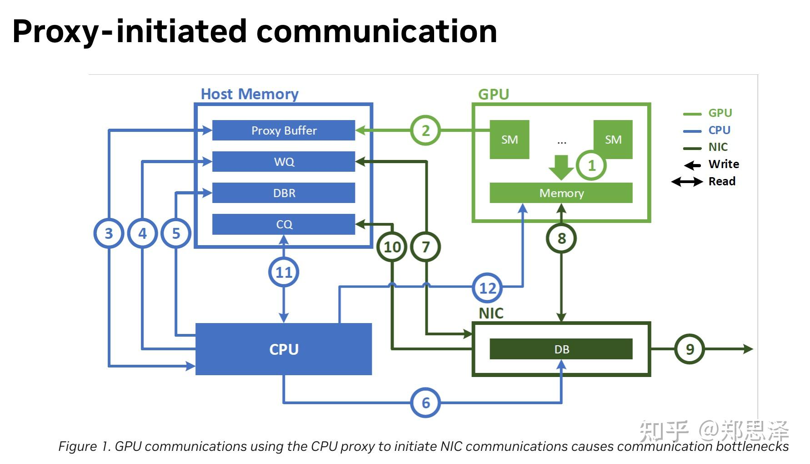

[上一份笔记](https://zhuanlan.zhihu.com/p/1982525738998588869)记录了[RDMA](https://zhida.zhihu.com/search?content_id=267646430&content_type=Article&match_order=1&q=RDMA&zhida_source=entity)的基础知识，继续学习下去，就到了NVSHMEM的具体实现。这篇笔记，我们先学习最常用的NVSHMEM [IBRC](https://zhida.zhihu.com/search?content_id=267646430&content_type=Article&match_order=1&q=IBRC&zhida_source=entity)实现。默认情况下，[Triton-distributed](https://link.zhihu.com/?target=https%3A//github.com/ByteDance-Seed/Triton-distributed)用的就是IBRC（因为NVSHMEM官方的bitcode lib不带IBGDA支持，只有source code编译才支持）。

## NVSHMEM的架构

```text
┌─────────────────────────────────────────────────────────────┐
│                     Application Layer                        │
│              (shmem_put, shmem_get, shmem_barrier, ...)      │
├─────────────────────────────────────────────────────────────┤
│                      Host API Layer                          │
│    ┌─────────────┐  ┌─────────────┐  ┌─────────────┐        │
│    │    Init     │  │    Comm     │  │    Sync     │        │
│    └─────────────┘  └─────────────┘  └─────────────┘        │
├─────────────────────────────────────────────────────────────┤
│                     Transport Layer                          │
│    ┌─────────┐  ┌─────────┐  ┌─────────┐  ┌─────────┐       │
│    │   P2P   │  │  IBRC   │  │  IBGDA  │  │   UCX   │       │
│    │(NVLink) │  │ (IB RC) │  │(IB DevX)│  │         │       │
│    └─────────┘  └─────────┘  └─────────┘  └─────────┘       │
├─────────────────────────────────────────────────────────────┤
│                     Device API Layer                         │
│              (GPU Kernel 可调用的 API)                       │
├─────────────────────────────────────────────────────────────┤
│                    Hardware Layer                            │
│    ┌─────────────┐  ┌─────────────┐  ┌─────────────┐        │
│    │   NVLink    │  │ InfiniBand  │  │   PCIe      │        │
│    └─────────────┘  └─────────────┘  └─────────────┘        │
└─────────────────────────────────────────────────────────────┘
```

NVSHMEM可以分成三层架构：[应用层](https://zhida.zhihu.com/search?content_id=267646430&content_type=Article&match_order=1&q=%E5%BA%94%E7%94%A8%E5%B1%82&zhida_source=entity)，传输（Transport）层，硬件层。每两层之间靠API交互。NVSHMEM旨在把不同的通信硬件后端封装成统一的接口，这一点主要靠Transport层实现。

Transport 是 NVSHMEM 的核心抽象，每个 transport 实现特定的硬件通信方式：

| Transport | 硬件 | 特点 |
| ----- | ----- | ----- |
| P2P | NVLink/PCIe | GPU直接内存访问 |
| IBRC | InfiniBand | CPU发起RDMA，可靠连接 |
| IBGDA | InfiniBand DevX | GPU发起RDMA |
| UCX | 多种网络 | 统一通信框架 |

每个 transport 必须实现 \`nvshmem\_transport\_host\_ops\` 接口：

```cpp
struct nvshmem_transport_host_ops {
    // 检查是否可以到达对端 PE
    int (*can_reach_peer)(int *access, nvshmem_transport_pe_info_t *peer_info,
                          struct nvshmem_transport *transport);
    
    // 建立端点连接
    int (*connect_endpoints)(struct nvshmem_transport *tcurr, int *selected_dev_ids,
                             int num_selected_devs, int *out_qp_indices, int num_qps);
    
    // 获取内存句柄 (用于远程访问)
    int (*get_mem_handle)(nvshmem_mem_handle_t *mem_handle, void *buf, size_t size,
                          struct nvshmem_transport *transport, bool local_only);
    
    // 释放内存句柄
    int (*release_mem_handle)(nvshmem_mem_handle_t *mem_handle,
                              struct nvshmem_transport *transport);
    
    // 清理 transport
    int (*finalize)(struct nvshmem_transport *transport);
    
    // 进度推进
    int (*progress)(struct nvshmem_transport *transport);
    
    // RMA 操作 (put/get)
    rma_handle rma;
    
    // 原子操作
    amo_handle amo;
    
    // 同步操作
    fence_handle fence;
    quiet_handle quiet;
    
    // 带信号的 put
    put_signal_handle put_signal;
};
```

Transport的抽象结构如下：

```text
nvshmem_transport
├── state (nvshmemt_ib_common_state)
│   ├── devices[]           # IB 设备数组
│   │   └── ibrc_device
│   │       ├── common_device
│   │       │   ├── dev          # ibv_device*
│   │       │   ├── context      # ibv_context*
│   │       │   ├── pd           # ibv_pd*
│   │       │   └── port_attr[]  # 端口属性
│   │       ├── srq              # 共享接收队列
│   │       ├── send_cq          # 发送完成队列
│   │       └── recv_cq          # 接收完成队列
│   ├── ep[]                # 端点数组 (每个 PE 一个)
│   │   └── ibrc_ep
│   │       ├── common_ep
│   │       │   ├── head_op_id   # 已提交的操作 ID
│   │       │   ├── tail_op_id   # 已完成的操作 ID
│   │       │   └── transport    # 回指 transport
│   │       ├── qp               # ibv_qp*
│   │       └── req[]            # 请求缓冲区
│   └── cache               # 内存句柄缓存
└── host_ops               # 回调函数表
```

使用IBRC的完整调用链条如下：

```text
用户调用 nvshmem_init() 或 nvshmemx_init_attr()
    ↓
nvshmemi_common_init() (init.cu:995)
    ↓
nvshmemi_transport_init() (init.cu:1118)
    ↓
transport.cpp:nvshmemi_transport_init() (transport.cpp:50)
    ↓
根据 NVSHMEM_REMOTE_TRANSPORT 环境变量选择传输层
    ↓
如果是 "ibrc":
    dlopen("nvshmem_transport_ibrc.so.X")   // 加载共享库
    dlsym("nvshmemt_init")                   // 获取函数指针
    init_fn(&transports[index], ...)         // 调用 nvshmemt_init
```

NVSHMEM并不是通过常规的[头文件](https://zhida.zhihu.com/search?content_id=267646430&content_type=Article&match_order=1&q=%E5%A4%B4%E6%96%87%E4%BB%B6&zhida_source=entity)include方式去调用符号，而是直接打开IBRC的动态库去找symbol然后调用。对于NVSHMEM的init的详细解读先不放在这个笔记里，我们专注于IBRC的init逻辑。

## IBRC init逻辑

```text
┌─────────────────────────────────────────────────────────────────────────┐
│                        nvshmemt_init() 初始化流程                         │
└─────────────────────────────────────────────────────────────────────────┘
                                    │
    ┌───────────────────────────────┼───────────────────────────────┐
    ▼                               ▼                               ▼
┌─────────┐                   ┌─────────┐                     ┌─────────┐
│ Phase 1 │                   │ Phase 2 │                     │ Phase 3 │
│ 版本检查 │                   │ 状态分配 │                     │ 加载库  │
│ API兼容  │                   │ 选项初始 │                     │ ftable  │
└─────────┘                   └─────────┘                     └─────────┘
    │                               │                               │
    └───────────────────────────────┼───────────────────────────────┘
                                    ▼
┌─────────────────────────────────────────────────────────────────────────┐
│                     Phase 4: 枚举 IB 设备 (核心循环)                      │
│  ┌──────────────────────────────────────────────────────────────────┐   │
│  │ for each device:                                                  │   │
│  │   open_device → query_device → for each port:                    │   │
│  │     query_port → 检查状态 → query_gid → alloc_pd                  │   │
│  └──────────────────────────────────────────────────────────────────┘   │
└─────────────────────────────────────────────────────────────────────────┘
                                    │
    ┌───────────────────────────────┼───────────────────────────────┐
    ▼                               ▼                               ▼
┌─────────┐                   ┌─────────┐                     ┌─────────┐
│ Phase 5 │                   │ Phase 6 │                     │ Phase 7 │
│ PCI路径 │                   │ 缓冲池  │                     │ 注册回调│
│ 获取    │                   │ 分配    │                     │ 函数    │
└─────────┘                   └─────────┘                     └─────────┘
                                    │
                                    ▼
                            ┌─────────────┐
                            │   Phase 8   │
                            │ DMA-BUF检测 │
                            │ 完成初始化    │
                            └─────────────┘
```

其中的[注册回调函数](https://zhida.zhihu.com/search?content_id=267646430&content_type=Article&match_order=1&q=%E6%B3%A8%E5%86%8C%E5%9B%9E%E8%B0%83%E5%87%BD%E6%95%B0&zhida_source=entity)逻辑，就是把IBRC的transport功能注册到host\_ops，供应用层调用

```cpp
    transport->host_ops.can_reach_peer = nvshmemt_ibrc_can_reach_peer;
    transport->host_ops.connect_endpoints = nvshmemt_ib_common_connect_endpoints;
    transport->host_ops.get_mem_handle = nvshmemt_ibrc_get_mem_handle;
    transport->host_ops.release_mem_handle = nvshmemt_ibrc_release_mem_handle;
    transport->host_ops.rma = nvshmemt_ibrc_rma;
    transport->host_ops.amo = nvshmemt_ibrc_amo;
    transport->host_ops.fence = nvshmemt_ib_common_fence;
    transport->host_ops.quiet = nvshmemt_ib_common_quiet;
    transport->host_ops.finalize = nvshmemt_ibrc_finalize;
    transport->host_ops.show_info = nvshmemt_ibrc_show_info;
    transport->host_ops.progress = nvshmemt_ibrc_progress;
    transport->host_ops.put_signal = nvshmemt_put_signal;
```

下面逐个理解每个函数的作用

## nvshmemt\_ibrc\_can\_reach\_peer

这个函数的功能在IBRC里是锁死的，标注PE之间的传输能力映射为CPU\_READ+CPU\_WRITE+CPU\_ATOMIC

因为IRBC本身就是借助CPU proxy thread来做通信的方式，在[NV的博客](https://link.zhihu.com/?target=https%3A//developer.nvidia.com/blog/improving-network-performance-of-hpc-systems-using-nvidia-magnum-io-nvshmem-and-gpudirect-async/)中有介绍：



这个函数被注册到host\_ops的can\_reach\_peer接口，该接口主要用在topo.cpp里nvshmemi\_build\_transport\_map()使用：

```cpp
for (int i = 0; i < state->npes; i++) {
        int reach_any = 0;

        for (int j = 0; j < state->num_initialized_transports; j++) {
            int reach = 0;

            if (!state->transports[j]) {
                continue;
            }

            // 调用每个传输层的 can_reach_peer
            status = state->transports[j]->host_ops.can_reach_peer(&reach, &state->pe_info[i],
                                                                   state->transports[j]);
            
            // 记录该传输层对该 PE 的访问能力
            state->transports[j]->cap[i] = reach;
            reach_any |= reach;

            if (reach) {
                int m = 1 << j;
                local_map[i] |= m;  // 位图标记哪些传输层可达
                state->transport_bitmap |= m;
            }
        }

        // 如果没有任何传输层能到达该 PE，报错退出
        if ((!reach_any) && (!nvshmemi_options.BYPASS_ACCESSIBILITY_CHECK)) {
            fprintf(stderr, "Peer GPU %d is not accessible, exiting ... \n", i);
            goto out;
        }
    }
```

## nvshmemt\_ib\_common\_connect\_endpoints

这是 IB 传输层的核心连接建立函数，负责在所有 PE 之间创建 RC (Reliable Connection) QP 连接。

```text
┌─────────────────────────────────────────────────────────────────────────────┐
│              nvshmemt_ib_common_connect_endpoints() 流程                     │
└─────────────────────────────────────────────────────────────────────────────┘

┌─────────────────────────────────────────────────────────────────────────────┐
│  Phase 1: 计算 EP 数量并分配内存                                              │
│                                                                              │
│  if (首次调用) {                                                              │
│      ep_count = IB_NUM_RC_PER_DEVICE + 1   // +1 for host EP                │
│      total_eps = n_pes × ep_count                                           │
│      ib_state->ep = calloc(total_eps, ...)                                  │
│  } else {                                                                    │
│      // 动态增加 QP                                                          │
│      realloc(ib_state->ep, new_size)                                        │
│  }                                                                           │
└─────────────────────────────────────────────────────────────────────────────┘
                                      │
                                      ▼
┌─────────────────────────────────────────────────────────────────────────────┐
│  Phase 2: 创建本地端点 (EP/QP)                                               │
│                                                                              │
│  for (每个 QP 组) {                                                          │
│      for (每个远程 PE) {                                                     │
│          ep_create()    →  创建 QP (INIT 状态)                              │
│          ep_get_handle()→  获取 QPN, LID, GID 等连接信息                    │
│      }                                                                       │
│  }                                                                           │
│                                                                              │
│  local_ep_handles[] = { qpn=0x1234, lid=1, gid=... }                        │
└─────────────────────────────────────────────────────────────────────────────┘
                                      │
                                      ▼
┌─────────────────────────────────────────────────────────────────────────────┐
│  Phase 3: 交换端点句柄 (All-to-All)                                          │
│                                                                              │
│  alltoall(local_ep_handles, ep_handles)                                     │
│                                                                              │
│       PE0                PE1                PE2                             │
│    ┌────────┐         ┌────────┐         ┌────────┐                         │
│    │ my_qpn │ ──────► │        │         │        │                         │
│    │ my_lid │ ──────► │ pe0_qpn│ ──────► │ pe0_qpn│                         │
│    │ my_gid │         │ pe0_lid│         │ pe0_lid│                         │
│    └────────┘         └────────┘         └────────┘                         │
│                                                                              │
│  每个 PE 现在知道所有其他 PE 的 QP 信息                                       │
└─────────────────────────────────────────────────────────────────────────────┘
                                      │
                                      ▼
┌─────────────────────────────────────────────────────────────────────────────┐
│  Phase 4: 连接端点 (QP 状态转换)                                              │
│                                                                              │
│  for (每个 QP 组) {                                                          │
│      for (每个远程 PE) {                                                     │
│          ep_connect(local_ep, remote_handle)                                │
│                                                                              │
│          QP 状态: INIT → RTR → RTS                                          │
│                                                                              │
│          设置: dest_qp_num, ah_attr, path_mtu, etc.                         │
│      }                                                                       │
│  }                                                                           │
└─────────────────────────────────────────────────────────────────────────────┘
                                      │
                                      ▼
┌─────────────────────────────────────────────────────────────────────────────┐
│  完成! 所有 PE 之间建立了全连接的 RC QP 网络                                   │
│                                                                              │
│          PE0 ◄───────────► PE1                                              │
│           │ ╲             ╱ │                                               │
│           │   ╲         ╱   │                                               │
│           │     ╲     ╱     │                                               │
│           │       ╲ ╱       │                                               │
│           │       ╱ ╲       │                                               │
│           │     ╱     ╲     │                                               │
│           │   ╱         ╲   │                                               │
│           ▼ ╱             ╲ ▼                                               │
│          PE2 ◄───────────► PE3                                              │
└─────────────────────────────────────────────────────────────────────────────┘
```

这个函数被注册到connect\_endpoints，用于在init时候建立连接

## nvshmemt\_ibrc\_get\_mem\_handle

这个函数用于注册GPU内存到InfiniBand网卡，使其可以被RDMA 操作访问。

```text
┌─────────────────────────────────────────────────────────────────────────────┐
│                    get_mem_handle() 工作流程                                 │
└─────────────────────────────────────────────────────────────────────────────┘

  输入: GPU 缓冲区 (void *buf)
           │
           ▼
┌─────────────────────────────────────────┐
│  Step 1: 调用 ibv_reg_mr()              │
│                                          │
│  • 将 GPU 内存注册到 IB 网卡             │
│  • 使用 DMA-BUF 或 nv_peer_mem          │
│  • 获取 lkey/rkey                        │
└─────────────────────────────────────────┘
           │
           ▼
┌─────────────────────────────────────────┐
│  Step 2: (可选) GDRCopy 映射             │
│                                          │
│  • pin_buffer() - 锁定 GPU 内存         │
│  • map() - 映射到 CPU 可访问地址         │
│  • 用于 CPU 端原子操作                   │
└─────────────────────────────────────────┘
           │
           ▼
┌─────────────────────────────────────────┐
│  Step 3: 缓存句柄信息                    │
│                                          │
│  • 保存 mr, ptr, size 到 handle_info    │
│  • 添加到 mem_handle_cache              │
│  • 便于后续快速查找                      │
└─────────────────────────────────────────┘
           │
           ▼
  输出: mem_handle (包含 lkey, rkey)
```

用处主要是在init时候完成内存注册

```text
nvshmem_init()
    ↓
nvshmemi_setup_symmetric_heap()
    ↓
对每块对称堆内存调用:
    transport->host_ops.get_mem_handle()
    ↓
nvshmemt_ibrc_get_mem_handle()
    ↓
返回的 rkey 通过 bootstrap 广播给所有 PE
```

## nvshmemt\_ibrc\_release\_mem\_handle

用于释放mem\_handle，在nvshmem\_finalize时候被用到

```text
get_mem_handle():                     release_mem_handle():
                                      
┌─────────────┐                       ┌─────────────┐
│ GPU Memory  │                       │ GPU Memory  │
│  (普通)     │                       │  (普通)     │
└─────────────┘                       └─────────────┘
      │                                     ▲
      ▼ ibv_reg_mr()                        │ ibv_dereg_mr()
┌─────────────┐                       ┌─────────────┐
│ GPU Memory  │                       │ GPU Memory  │
│  (已注册)   │ ─────使用期间──────► │  (已注册)   │
│  lkey/rkey  │   可进行 RDMA 操作    │  lkey/rkey  │
└─────────────┘                       └─────────────┘
```

## nvshmemt\_ibrc\_rma

访问[远端内存](https://zhida.zhihu.com/search?content_id=267646430&content_type=Article&match_order=1&q=%E8%BF%9C%E7%AB%AF%E5%86%85%E5%AD%98&zhida_source=entity)的函数，具体完成的步骤如下：

```text
┌─────────────────────────────────────────────────────────────────────────────┐
│                     nvshmemt_ibrc_rma() 工作流程                             │
└─────────────────────────────────────────────────────────────────────────────┘

  输入: verb=PUT, local=src, remote=dest, pe=目标PE
           │
           ▼
┌─────────────────────────────────────────┐
│  Step 1: 获取与目标 PE 的 QP (EP)        │
│                                          │
│  ep = get_ep_from_qp_index(qp_index, pe) │
└─────────────────────────────────────────┘
           │
           ▼
┌─────────────────────────────────────────┐
│  Step 2: 检查 QP 是否有空闲槽位          │
│                                          │
│  check_poll_avail() - 确保发送队列不满   │
│  可能需要轮询完成队列                    │
└─────────────────────────────────────────┘
           │
           ▼
┌─────────────────────────────────────────┐
│  Step 3: 构造 Send Work Request         │
│                                          │
│  sr->opcode = RDMA_WRITE / RDMA_READ    │
│  sr->wr.rdma.remote_addr = 远程地址      │
│  sr->wr.rdma.rkey = 远程内存密钥         │
│  sge->addr = 本地地址                    │
│  sge->lkey = 本地内存密钥                │
│  sge->length = 传输长度                  │
└─────────────────────────────────────────┘
           │
           ▼
┌─────────────────────────────────────────┐
│  Step 4: 提交到 IB 硬件                  │
│                                          │
│  ibv_post_send(ep->qp, sr, bad_sr)      │
└─────────────────────────────────────────┘
           │
           ▼
┌─────────────────────────────────────────┐
│  Step 5: 更新操作计数                    │
│                                          │
│  ep->common_ep.head_op_id++             │
│                                          │
│  如果是阻塞操作 (!is_nbi):               │
│      等待操作完成                        │
└─────────────────────────────────────────┘
```

这里面，构造WR时候支持的操作类型和IB操作类型映射关系如下：

| verb.desc | IB op_code | 说明 |
| ----- | ----- | ----- |
| NVSHMEMI_OP_PUT | IBV_WR_RDMA_WRITE | 批量写入远程内存 |
| NVSHMEMI_OP_P | IBV_WR_RDMA_WRITE + INLINE | 单元素写入 (内联) |
| NVSHMEMI_OP_GET | IBV_WR_RDMA_READ | 批量读取远程内存 |
| NVSHMEMI_OP_G | IBV_WR_RDMA_READ | 单元素读取 |

## nvshmemt\_ibrc\_amo

这个是执行远端原子操作的函数，有三种实现路径

```text
┌─────────────────────────────────────────────────────────────────────────────┐
│                    AMO 实现路径选择                                          │
└─────────────────────────────────────────────────────────────────────────────┘

                        nvshmemt_ibrc_amo()
                              │
                              ▼
              ┌───────────────┼───────────────┐
              │               │               │
              ▼               ▼               ▼
       ┌────────────┐  ┌────────────┐  ┌────────────┐
       │ Path 1:    │  │ Path 2:    │  │ Path 3:    │
       │ IB Native  │  │ GDRCopy    │  │ IB Native  │
       │ (优先)     │  │ (软件模拟) │  │ (fallback) │
       └────────────┘  └────────────┘  └────────────┘
            │               │               │
            ▼               ▼               ▼
    64-bit ADD/SIGNAL   所有类型 AMO    ADD/SIGNAL/SET
    IBV_WR_ATOMIC_*     IBV_WR_SEND    IBV_WR_* 
```

对于IB Native，只支持64bit的累加和set操作，对于有GDRCopy的时候，可以使用软件模拟任意原子操作，工作流程如下：

```text
┌─────────────────────────────────────────────────────────────────────────────┐
│                      GDRCopy AMO 流程                                        │
└─────────────────────────────────────────────────────────────────────────────┘

   发起方 PE0                              目标方 PE1
  ┌──────────┐                           ┌──────────┐
  │ 构造 op  │                           │          │
  │ 描述符   │                           │ GPU Mem  │
  └────┬─────┘                           └────▲─────┘
       │                                       │
       │ IBV_WR_SEND                          │ GDRCopy
       ▼                                       │ 读-改-写
  ┌──────────┐                           ┌────┴─────┐
  │  NIC     │ ────────────────────────► │ progress │
  └──────────┘       SRQ 接收             │ _recv()  │
                                          └────┬─────┘
                                               │
                                               ▼
                                          ┌──────────┐
                                          │ CPU 执行 │
                                          │ 原子操作 │
                                          │ 通过     │
                                          │ cpu_ptr  │
                                          └────┬─────┘
                                               │
       ┌───────────────────────────────────────┘
       │ 如果是 fetch 操作，返回旧值
       ▼
  ┌──────────┐
  │ 结果写回 │
  │ PE0 内存 │
  └──────────┘
```

## nvshmemt\_ib\_common\_fence/quiet

这个对应了nvshmem fence和quiet实现

```text
┌─────────────────────────────────────────────────────────────────────────────┐
│                    Fence 和 Quiet 的区别                                     │
└─────────────────────────────────────────────────────────────────────────────┘

【Fence】- 顺序保证
┌──────────────────────────────────────────────────────────────────┐
│  PUT A                                                           │
│  PUT B     ──── fence() ────    后续的操作会在 A,B 之后到达      │
│  PUT C                                                           │
│                                                                   │
│  fence 不一定等待完成，只保证顺序                                 │
└──────────────────────────────────────────────────────────────────┘

【Quiet】- 完成等待
┌──────────────────────────────────────────────────────────────────┐
│  PUT A                                                           │
│  PUT B     ──── quiet() ────    等待 A,B 都完成后才返回          │
│  PUT C                                                           │
│                                                                   │
│  quiet 阻塞直到所有之前的操作完成                                 │
└──────────────────────────────────────────────────────────────────┘
```

根据QP数量，fence的行为也有所区别，只有多QP的时候，fence才有操作，等价于quiet：

```text
┌─────────────────────────────────────────────────────────────────────────────┐
│                    单 QP vs 多 QP 的 Fence 处理                              │
└─────────────────────────────────────────────────────────────────────────────┘

【单 QP 场景】
  RC QP 保证 FIFO 顺序，无需额外操作
  
  PUT A ──┐
  PUT B ──┼──► 同一 QP ──► 保证 A 先于 B 到达
  PUT C ──┘
  
  fence() 在单 QP 时是 NO-OP (空操作)

【多 QP 场景】
  不同 QP 之间没有顺序保证
  
  PUT A ──► QP1 ──┐
  PUT B ──► QP2 ──┼──► 可能乱序到达!
  PUT C ──► QP1 ──┘
  
  fence() 需要调用 quiet() 等待所有 QP 完成
```

QP数量可以由环境变量NVSHMEM\_IB\_NUM\_RC\_PER\_DEVICE控制，默认是1，NVSHMEM提供接口nvshmemx\_put\_on\_qp来指定用哪个qp进行通信，多QP的排布如下：

```text
┌─────────────────────────────────────────────────────────────────────────────┐
│           QP 布局 (假设 4 个 PE, IB_NUM_RC_PER_DEVICE=2)                     │
└─────────────────────────────────────────────────────────────────────────────┘

ib_state->ep[] 数组:

                PE0       PE1       PE2       PE3
              ┌───────┬───────┬───────┬───────┐
  Host QP     │ ep[0] │ ep[1] │ ep[2] │ ep[3] │   QP组 0 (index=0)
              ├───────┼───────┼───────┼───────┤
  Default QP1 │ ep[4] │ ep[5] │ ep[6] │ ep[7] │   QP组 1 (index=1)
              ├───────┼───────┼───────┼───────┤
  Default QP2 │ ep[8] │ ep[9] │ep[10] │ep[11] │   QP组 2 (index=2)
              └───────┴───────┴───────┴───────┘

每个 PE 与其他每个 PE 之间有 3 个 QP:
- 1 个 Host QP (用于 CPU 发起的操作)
- 2 个 Default QP (轮询使用，增加带宽)
```

多QP可以潜在地提升性能：

```text
┌─────────────────────────────────────────────────────────────────────────────┐
│                    单 QP vs 多 QP 性能对比                                   │
└─────────────────────────────────────────────────────────────────────────────┘

【单 QP】
                      ┌─────┐
  操作 1 ────────────►│     │
  操作 2 ────────────►│ QP  │────► NIC ────► 网络
  操作 3 ────────────►│     │
                      └─────┘
  
  瓶颈: QP 发送队列深度有限，串行处理

【多 QP】
                      ┌─────┐
  操作 1 ────────────►│ QP1 │──┐
                      └─────┘  │
                      ┌─────┐  ├──► NIC ────► 网络 (更高带宽)
  操作 2 ────────────►│ QP2 │──┤
                      └─────┘  │
                      ┌─────┐  │
  操作 3 ────────────►│ QP3 │──┘
                      └─────┘
  
  优势: 并行处理，充分利用 NIC 带宽
```

有多QP的时候，发送会轮询QP实现均衡。注意到指定一个QP的时候，实际上有两个QP在工作，一个是host QP，一个是default QP。其中host QP主要是给CPU用的，default QP用来GPU调用proxy thread来使用。

```text
┌─────────────────────────────────────────────────────────────────────────────┐
│                    Host QP vs Default QP                                     │
└─────────────────────────────────────────────────────────────────────────────┘

【Host QP (索引 0)】
┌─────────────────────────────────────────────────────────────────────────────┐
│                                                                              │
│   CPU 线程 (Host)                                                            │
│       │                                                                      │
│       ▼ 直接调用                                                              │
│   nvshmem_put() / nvshmem_get()                                             │
│       │                                                                      │
│       ▼                                                                      │
│   ┌─────────┐                                                                │
│   │ Host QP │ ───────────────────────────────────► 远程 PE                  │
│   └─────────┘                                                                │
│                                                                              │
│   用途: CPU 直接发起的 RMA/AMO 操作                                          │
│   特点: 专用于 CPU 侧 API 调用                                               │
└─────────────────────────────────────────────────────────────────────────────┘

【Default QP (索引 1, 2, 3, ...)】
┌─────────────────────────────────────────────────────────────────────────────┐
│                                                                              │
│   GPU Kernel                                                                 │
│       │                                                                      │
│       ▼ 请求                                                                 │
│   Proxy Thread (代理线程)                                                    │
│       │                                                                      │
│       ▼                                                                      │
│   ┌───────────┐  ┌───────────┐  ┌───────────┐                               │
│   │Default QP1│  │Default QP2│  │Default QP3│  ───► 远程 PE                 │
│   └───────────┘  └───────────┘  └───────────┘                               │
│        ▲              ▲              ▲                                       │
│        └──────────────┴──────────────┘                                       │
│                   轮询选择                                                    │
│                                                                              │
│   用途: GPU 通过 Proxy 发起的 RMA/AMO 操作                                   │
│   特点: 可以有多个，轮询使用以提高带宽                                        │
└─────────────────────────────────────────────────────────────────────────────┘
```

## nvshmemt\_ibrc\_finalize

主要做清理工作，暂不关注

## nvshmemt\_ibrc\_show\_info

没有实现

## nvshmemt\_ibrc\_progress

proxy线程用来轮询CQ，更新操作完成状态

## nvshmemt\_put\_signal

用来完成多次put+fence+set\_signal的操作

```text
┌─────────────────────────────────────────────────────────────────────────────┐
│                      put_signal 操作序列                                     │
└─────────────────────────────────────────────────────────────────────────────┘

   发起方 (PE 0)                                目标方 (PE 1)
  ┌──────────────┐                            ┌──────────────┐
  │              │                            │              │
  │   data_src   │                            │   data_dst   │
  │              │                            │              │
  └──────────────┘                            └──────────────┘
         │                                           ▲
         │ Step 1: PUT data                          │
         │ (可能多次)                                 │
         └───────────────────────────────────────────┘
                            │
                            ▼
                    ┌───────────────┐
                    │   fence()     │  ← Step 2: 确保所有 PUT 完成
                    └───────────────┘
                            │
                            ▼
  ┌──────────────┐                            ┌──────────────┐
  │              │     Step 3: SIGNAL         │    signal    │
  │              │ ────────────────────────►  │  (flag=1)    │
  │              │     (AMO SET/ADD)          │              │
  └──────────────┘                            └──────────────┘
```

## GPU侧device function的实现

因为GPU是通过proxy thread和IBRC的代码交互，需要了解device侧是怎么实现的。

```text
┌─────────────────────────────────────────────────────────────────────────────┐
│                    GPU RMA 操作的两条路径                                     │
└─────────────────────────────────────────────────────────────────────────────┘

                         GPU Kernel 调用 nvshmem_put()
                                    │
                                    ▼
                    ┌───────────────────────────────┐
                    │ 检查 peer_heap_base_p2p[pe]   │
                    │ 是否有 P2P 直接映射地址?       │
                    └───────────────┬───────────────┘
                                    │
                    ┌───────────────┴───────────────┐
                    │                               │
                    ▼ 有 (单机 P2P)                  ▼ 没有 (跨机 IBRC)
           ┌─────────────────┐             ┌─────────────────┐
           │  直接内存写入    │             │  Proxy 通道     │
           │  GPU → GPU      │             │  GPU → CPU →    │
           │  (NVLink/PCIe)  │             │  RDMA → 远程    │
           └─────────────────┘             └─────────────────┘
```

其中，单机的实现，和proxy thread没有关系，或者说在NVLink域，不会用到IBRC。单机部分的内部实现代码实现在nvshmem/src/include/non\_abi/device/common/nvshmemi\_common\_device.cuh。用户使用的API定义在nvshmem/src/include/device/nvshmem\_defines.h

其中内部实现的API(前缀是nvshmemi)如下

```text
# ============== Team Utility ==============
nvshmemi_team_translate_pe
nvshmemi_team_get_psync
nvshmemi_team_get_sync_counter

# ============== Test / Wait ==============
nvshmemi_test

# ============== Multicast Store ==============
nvshmemi_mcast16_store_threadgroup
nvshmemi_mcast8_store_threadgroup
nvshmemi_mcast4_store_threadgroup
nvshmemi_mcast_memcpy_threadgroup

# ============== Memcpy ==============
nvshmemi_memcpy_threadgroup

# ============== Synchronization ==============
nvshmemi_quiet
nvshmemi_fence

# ============== RMA (Put/Get) ==============
nvshmemi_g
nvshmemi_get_nbi
nvshmemi_get
nvshmemi_p
nvshmemii_put_nbi
nvshmemi_put_nbi
nvshmemi_put

# ============== Signaling ==============
nvshmemi_signal_op
nvshmemii_put_signal
nvshmemi_put_signal

# ============== Pointer ==============
nvshmemi_mc_ptr
nvshmemi_ptr

# ============== LL128 Protocol (Low-Latency 128-byte) ==============
nvshmemi_store_128b_register
nvshmemi_store_varlen_register
nvshmemi_packLL128
nvshmemi_ll128_load_psync
nvshmemi_recvLL128

# ============== LL Protocol (Low-Latency) ==============
nvshmemi_mcast_recvLL
nvshmemi_mcast_packLL
nvshmemi_recvLL
nvshmemi_packLL_naive
nvshmemi_packLL
```

这次学习才注意到NVSHMEM有自己实现的LL协议，之前我们还在Triton-distributed里自己捏了一遍，如果当时知道有这些API就可以直接用了。

内部实现的API用来实现用户API，比如常用的nvshmem\_putmem\_signal\_nbi的实现如下：

```cpp
/*__device__ nvshmem_putmem_signal_nbi*/
NVSHMEMI_DEVICE_PREFIX NVSHMEMI_DEVICE_ALWAYS_INLINE void nvshmem_putmem_signal_nbi(
    void *dest, const void *source, size_t bytes, uint64_t *sig_addr, uint64_t signal, int sig_op,
    int pe) {
    nvshmemi_put_signal<char, NVSHMEMI_THREADGROUP_THREAD>((char *)dest, (const char *)source,
                                                           bytes, sig_addr, signal, sig_op, pe, 1);
}
```

走到内部API就是

```cpp
template <typename T, threadgroup_t SCOPE>
__device__ NVSHMEMI_DEVICE_ALWAYS_INLINE void nvshmemi_put_signal(
    T *dest, const T *source, size_t nelems, uint64_t *sig_addr, uint64_t signal, int sig_op,
    int pe, bool is_nbi, nvshmemx_qp_handle_t qp_index = NVSHMEMX_QP_DEFAULT) {
    nvshmemi_threadgroup_sync<SCOPE>();
    nvshmemii_put_signal<T, SCOPE>(dest, source, nelems, sig_addr, signal, sig_op, pe, is_nbi,
                                   qp_index);
    nvshmemi_threadgroup_sync<SCOPE>();
}
```

再追踪下去

```cpp
template <typename T, threadgroup_t SCOPE>
__device__ NVSHMEMI_DEVICE_ALWAYS_INLINE void nvshmemii_put_signal(
    T *dest, const T *source, size_t nelems, uint64_t *sig_addr, uint64_t signal, int sig_op,
    int pe, bool is_nbi, nvshmemx_qp_handle_t qp_index = NVSHMEMX_QP_DEFAULT) {
    int myIdx = nvshmemi_thread_id_in_threadgroup<SCOPE>();
    void *peer_base_addr =
        (void *)__ldg((const long long unsigned *)nvshmemi_device_state_d.peer_heap_base_p2p + pe);
    if (peer_base_addr) {
        char *dest_actual =
            (char *)(peer_base_addr) + ((char *)dest - (char *)(nvshmemi_device_state_d.heap_base));
        nvshmemi_memcpy_threadgroup<SCOPE>((void *)dest_actual, (const void *)source,
                                           nelems * sizeof(T));
        nvshmemi_threadgroup_sync<SCOPE>();
        if (!myIdx) {
            __threadfence_system();
            nvshmemi_signal_op(sig_addr, signal, sig_op, pe, qp_index);
        }
    } else {
        nvshmemi_transfer_put_signal<SCOPE>((void *)dest, (void *)source, nelems * sizeof(T),
                                            (void *)sig_addr, signal, (nvshmemi_amo_t)sig_op, pe,
                                            is_nbi, qp_index);
    }
}
```

这里面就可以看到分机内和跨机的逻辑了。判断是否是机内要看symmetric heap上的peer地址是否存在。那这个地址是怎么搞出来的呢？

## IBRC的机内nvshmemi\_device\_state\_d

这是一个GPU\_\_constant\_\_内存中的全局状态结构，类型是nvshmemi\_device\_host\_state\_t

```cpp
typedef struct {
    int version;
    int mype;
    int npes;
    int node_mype;
    int node_npes;
    nvshmemi_pe_dist_t pe_dist;
    int proxy;
    int atomics_sync;
    int job_connectivity;
    bool proxy_ops_are_ordered;
    bool atomics_complete_on_quiet;
    void *heap_base;
    size_t heap_size;
    void **peer_heap_base_p2p;
    void **peer_heap_base_remote;
    bool symmetric_heap_kind;
    bool enable_rail_opt;
    uint32_t atomics_le_min_size;

    nvshmemi_timeout_t *timeout;
    unsigned long long *test_wait_any_start_idx_ptr;

    nvshmemi_team_t **team_pool;
    long *psync_pool;
    long *sync_counter;
    gpu_coll_env_params_t gpu_coll_env_params_var;

    /* channel */
    void *proxy_channels_buf; /* requests are written in this buffer */
    char *proxy_channel_g_buf;
    char *proxy_channel_g_coalescing_buf;
    uint64_t *proxy_channel_g_buf_head_ptr; /* next location to be assigned to a thread */
    uint64_t proxy_channel_g_buf_size;      /* Total size of g_buf in bytes */
    uint64_t proxy_channel_g_buf_log_size;  /* Total size of g_buf in bytes */
    uint64_t *proxy_channels_issue;         /* last byte of the last request */
    uint64_t *
        proxy_channels_complete; /* shared betwen CPU and GPU threads - only write by CPU thread and
                                      read by GPU threads. This is allocated on the system memory */
    uint64_t *proxy_channels_complete_local_ptr; /* shared only between GPU threads */
    uint64_t *proxy_channels_quiet_issue;
    uint64_t *proxy_channels_quiet_ack;
    uint64_t *proxy_channels_cst_issue;
    uint64_t *proxy_channels_cst_ack;
    uint64_t proxy_channel_buf_size; /* Maximum number of inflight requests in bytes OR
                                                   maximum channel length */
    uint32_t proxy_channel_buf_logsize;
    int *global_exit_request_state;
    int *global_exit_code;

    bool ibgda_is_initialized;
    bool nvshmemi_is_nvshmem_initialized;
    bool nvshmemi_is_nvshmem_bootstrapped;
} nvshmemi_device_host_state_v1
```

在init symmetric heap时候，本地的memory会被export(cudaIpcGetMemHandle)出handle，通过外带通信allgather之后获取所有机内PE的handle，然后再import memory(cudaIpcOpenMemHandle)来打开其他PE的handle

整体流程如下：

```text
PE 0 (GPU 0)                              PE 1 (GPU 1)
━━━━━━━━━━━━━━━━━━━━━━━━━━━━━━━━━━━━━━━━━━━━━━━━━━━━━━━━━━━━━━━━━━
Step 1: 各自分配本地 heap
┌──────────────────┐                    ┌──────────────────┐
│ cudaMalloc()     │                    │ cudaMalloc()     │
│ heap_base=0xA000 │                    │ heap_base=0xB000 │
└──────────────────┘                    └──────────────────┘
         │                                       │
Step 2: allgather 交换 heap_base
         │                                       │
         ▼                                       ▼
┌────────────────────────────────────────────────────────────┐
│        peer_heap_base_remote_[] (Host 端)                   │
│  PE0: [0xA000, 0xB000]                                     │
│  PE1: [0xA000, 0xB000]                                     │
└────────────────────────────────────────────────────────────┘
         │                                       │
Step 3: 交换 IPC Handle
         │                                       │
┌──────────────────┐  cudaIpcGetMemHandle  ┌──────────────────┐
│ ipc_handle_A     │◄─────────────────────►│ ipc_handle_B     │
└──────────────────┘                       └──────────────────┘
         │                                       │
Step 4: 用 IPC Handle 建立 P2P 映射
         │                                       │
         ▼                                       ▼
cudaIpcOpenMemHandle(                   cudaIpcOpenMemHandle(
  &peer_heap_base_p2p_[1],                &peer_heap_base_p2p_[0],
  ipc_handle_B)                           ipc_handle_A)
  → 0xC000 (PE1的heap在PE0的映射)          → 0xD000 (PE0的heap在PE1的映射)
         │                                       │
         ▼                                       ▼
┌────────────────────────────────────────────────────────────┐
│           peer_heap_base_p2p_[] (最终结果)                   │
│  PE0: [0xA000(自己), 0xC000(PE1的映射)]                      │
│  PE1: [0xD000(PE0的映射), 0xB000(自己)]                      │
└────────────────────────────────────────────────────────────┘
         │                                       │
Step 5: 复制到 GPU constant memory
         │                                       │
         ▼                                       ▼
┌──────────────────┐                    ┌──────────────────┐
│nvshmemi_device_  │                    │nvshmemi_device_  │
│state_d:          │                    │state_d:          │
│.peer_heap_base   │                    │.peer_heap_base   │
│_p2p=[0xA,0xC]    │                    │_p2p=[0xD,0xB]    │
└──────────────────┘                    └──────────────────┘
```

理解了单机内的实现，跨机的实现则需要理解proxy thread和[GPU kernel](https://zhida.zhihu.com/search?content_id=267646430&content_type=Article&match_order=1&q=GPU+kernel&zhida_source=entity)的交互

## IBRC proxy thread实现

代码实现在nvshmem/src/include/non\_abi/device/pt-to-pt/proxy\_device.cuh里

这里实现的功能包括：

```text
# ============== Flow Control ==============
check_channel_availability          # 检查 channel 是否有足够空间

# ============== Quiet / Fence (同步) ==============
proxy_quiet                         # 全局 quiet（等待所有操作完成）
proxy_qp_quiet                      # 指定 QP 的 quiet
nvshmemi_proxy_quiet                # quiet 入口（选择全局或 QP 级别）
proxy_fence                         # 全局 fence（保序）
proxy_fence_qp                      # 指定 QP 的 fence
nvshmemi_proxy_fence                # fence 入口
nvshmemi_proxy_enforce_consistency_at_target  # 强制目标端一致性

# ============== Data Transfer (数据传输) ==============
copy_to_channel                     # 通用数据拷贝到 channel
transfer_dma                        # DMA 传输（PUT/GET）写入 channel
transfer_inline                     # Inline 传输（小数据直接嵌入 channel）

# ============== RMA (Remote Memory Access) ==============
nvshmemi_proxy_rma                  # RMA 模板（未实现，保留）
nvshmemi_proxy_rma_nbi              # 非阻塞 RMA（PUT/GET）
nvshmemi_proxy_rma_g                # 阻塞 GET（单元素，支持 warp 合并优化）
nvshmemi_proxy_rma_p                # PUT 单元素

# ============== Put with Signal ==============
nvshmemi_proxy_put_signal_nbi       # PUT + Signal 复合操作

# ============== AMO (Atomic Memory Operations) ==============
convert_val_to_uint64               # 辅助：将值转换为 uint64
amo                                 # 原子操作核心（写入 channel）
nvshmemi_proxy_amo_nonfetch         # 非 fetch 类原子操作（如 ADD, SET）
nvshmemi_proxy_amo_fetch            # fetch 类原子操作（如 FADD, FCAS）

# ============== Global Exit ==============
nvshmemi_proxy_global_exit          # 请求全局退出
```

以我们上面讨论的putmem\_signal\_nbi为例子继续看，跨机用到的nvshmemi\_transfer\_put\_signal在nvshmem/src/include/non\_abi/device/pt-to-pt/[http://transfer\_device.cuh.in](https://link.zhihu.com/?target=http%3A//transfer_device.cuh.in)里

```cpp
template <threadgroup_t SCOPE>
NVSHMEMI_TRANSFER_STATIC NVSHMEMI_TRANSFER_INLINE __device__ void nvshmemi_transfer_put_signal(
    void *rptr, void *lptr, size_t bytes, void *sig_addr, uint64_t signal, nvshmemi_amo_t sig_op,
    int pe, bool is_nbi, nvshmemx_qp_handle_t qp_index) {
#ifdef NVSHMEM_IBGDA_SUPPORT
    if (nvshmemi_device_state_d.ibgda_is_initialized) {
        nvshmemi_ibgda_put_signal<SCOPE>(rptr, lptr, bytes, sig_addr, signal, sig_op, pe, is_nbi,
                                         qp_index);
    } else
#endif
    {
        int myIdx = nvshmemi_thread_id_in_threadgroup<SCOPE>();
        if (!myIdx) {
            nvshmemi_proxy_put_signal_nbi(rptr, lptr, bytes, pe, NVSHMEMI_OP_PUT_SIGNAL, sig_addr,
                                          signal, sig_op, qp_index);
            if (is_nbi == 0) {
                nvshmemi_proxy_quiet(false, pe, &qp_index, 1);
                if (SCOPE == nvshmemi_threadgroup_thread)
                    __threadfence_block(); /* to prevent reuse of src buffer before quiet completion
                                        for warp/block scope, following sync op will accomplish that
                                      */
            }
        }
    }
}
```

其中IBGDA部分之后再学习，如果不是IBGDA，就会走到IBRC的nvshmem\_proxy\_put\_signal\_nbi，它的代码实现如下

```cpp
NVSHMEMI_STATIC __device__ NVSHMEMI_DEVICE_ALWAYS_FORCE_INLINE void nvshmemi_proxy_put_signal_nbi(
    void *rwrite_ptr, void *lwrite_ptr, size_t write_bytes, int pe, nvshmemi_op_t channel_op,
    void *sig_addr, uint64_t sig_val, nvshmemi_amo_t sig_op,
    nvshmemx_qp_handle_t qp_index = NVSHMEMX_QP_DEFAULT) {
    uint64_t idx, tail_idx, *req;
    int size = PROXY_PUT_WITH_SIG_REQ_BYTES;
    int group_size = 1;
    void *buf_ptr = nvshmemi_device_state_d.proxy_channels_buf;
    void *base_ptr = nvshmemi_device_state_d.heap_base;
    const uint64_t mask_lowest_byte = 0xFFFFFFFFFFFFFF00u;
    const uint64_t mask_upper_7_bytes = 0x00000000000000FFu;

    if (qp_index != NVSHMEMX_QP_DEFAULT) {
        channel_op =
            static_cast<nvshmemi_op_t>(static_cast<int>(channel_op) + NVSHMEMI_OP_QP_OP_OFFSET);
    }

    __threadfence();

    /* idx is an ever increasing counter. Since it is 64 bit integer, practically
    it will not overflow */
    idx = atomicAdd((unsigned long long int *)nvshmemi_device_state_d.proxy_channels_issue, size);
    tail_idx = idx + (size - 1);

    // flow-control
    check_channel_availability(tail_idx);

    req = (uint64_t *)((uint8_t *)buf_ptr + (idx & (CHANNEL_BUF_SIZE - 1)));
    uint64_t curr_flag = !((idx >> nvshmemi_device_state_d.proxy_channel_buf_logsize) & 1);
    /* curr_flag is either 0 or 1. Starting at idx = 0 to idx =
     * nvshmemi_device_state_d.proxy_channel_buf_size - 1, it will be 1, then for next
     * nvshmemi_device_state_d.proxy_channel_buf_size idx values it will be 0, and so
     * on.
     */
    uint64_t rwrite_offset = (uint64_t)((char *)rwrite_ptr - (char *)base_ptr);
    uint64_t lwrite_addr = (uint64_t)lwrite_ptr;
    uint64_t op = channel_op;
    uint16_t pe_u16 = pe;
    uint64_t write_size_u64 = write_bytes;

    /* base_request_t
     * 32                 | 8                 | 8  | 8          | 8
     * rwrite_offset_high | rwrite_offset_low | op | group_size | flag */
    *((volatile uint64_t *)req) =
        (uint64_t)((rwrite_offset << 24) | (op << 16) | (group_size << 8) | curr_flag);

    /* put_signal_request_0
     * 56               | 8
     * laddr_write_high | flag */
    idx += CHANNEL_ENTRY_BYTES;
    req = (uint64_t *)((uint8_t *)buf_ptr + (idx & (CHANNEL_BUF_SIZE - 1)));
    curr_flag = !((idx >> nvshmemi_device_state_d.proxy_channel_buf_logsize) & 1);
    uint64_t laddr_write_high = lwrite_addr & mask_lowest_byte;

    *((volatile uint64_t *)req) = laddr_write_high | curr_flag;

    /* put_signal_request_1
     * 32              | 16             | 8               | 8
     * write_size_high | write_size_low | lwrite_addr_low | flag */
    idx += CHANNEL_ENTRY_BYTES;
    req = (uint64_t *)((uint8_t *)buf_ptr + (idx & (CHANNEL_BUF_SIZE - 1)));
    curr_flag = !((idx >> nvshmemi_device_state_d.proxy_channel_buf_logsize) & 1);
    uint64_t lwrite_addr_low = lwrite_addr & mask_upper_7_bytes;
    *((volatile uint64_t *)req) =
        (uint64_t)(write_size_u64 << 16 | lwrite_addr_low << 8 | curr_flag);

    /* put_signal_request_2
     * 32    | 16 | 8     | 8
     * qp_index | pe | resv1 | flag */
    idx += CHANNEL_ENTRY_BYTES;
    req = (uint64_t *)((uint8_t *)buf_ptr + (idx & (CHANNEL_BUF_SIZE - 1)));
    curr_flag = !((idx >> nvshmemi_device_state_d.proxy_channel_buf_logsize) & 1);
    *((volatile uint64_t *)req) =
        (uint64_t)((static_cast<uint64_t>(qp_index) << 32) | (pe_u16 << 16) | curr_flag);

    /* put_signal_request_3
     * 32              | 8              | 8      | 8          | 8
     * rsigoffset_high | rsigoffset_low | sig_op | sigval_low | flag */
    idx += CHANNEL_ENTRY_BYTES;
    req = (uint64_t *)((uint8_t *)buf_ptr + (idx & (CHANNEL_BUF_SIZE - 1)));
    curr_flag = !((idx >> nvshmemi_device_state_d.proxy_channel_buf_logsize) & 1);
    uint64_t rsigoffset = (uint64_t)((char *)sig_addr - (char *)base_ptr);
    uint64_t sigval_low = sig_val & mask_upper_7_bytes;
    *((volatile uint64_t *)req) =
        (uint64_t)((rsigoffset << 24) | (sig_op << 16) | (sigval_low << 8) | curr_flag);

    /* put_signal_request_4
     * 56          | 8
     * sigval_high | flag */
    idx += CHANNEL_ENTRY_BYTES;
    req = (uint64_t *)((uint8_t *)buf_ptr + (idx & (CHANNEL_BUF_SIZE - 1)));
    curr_flag = !((idx >> nvshmemi_device_state_d.proxy_channel_buf_logsize) & 1);
    uint64_t sigval_high = sig_val & mask_lowest_byte;
    *((volatile uint64_t *)req) = sigval_high | curr_flag;
}
```

其中proxy\_channels\_buf是一块pinned memory，大小默认是4MB，每次向其中放的[数据结构](https://zhida.zhihu.com/search?content_id=267646430&content_type=Article&match_order=1&q=%E6%95%B0%E6%8D%AE%E7%BB%93%E6%9E%84&zhida_source=entity)是proxy channel：

```cpp
typedef struct proxy_channel {
    char *buf;               // ★ 环形缓冲区（GPU 写，CPU 读）
    uint64_t *issue;         // GPU 端写入计数（在 device memory）
    uint64_t *complete;      // CPU 端完成计数（GPU 读）
    uint64_t *quiet_issue;   // quiet 请求计数
    uint64_t *quiet_ack;     // quiet 完成确认
    uint64_t last_quiet_issue;
    uint64_t *cst_issue;     // consistency 请求计数
    uint64_t *cst_ack;       // consistency 完成确认
    uint64_t last_cst_issue;
    uint64_t processed;      // CPU 已处理字节数
    uint64_t last_sync;
} proxy_channel_t;
```

利用这块pinned memory的工作流程如下：

```text
┌─────────────────────────────────────────────────────────────────────────────┐
│                   Proxy Channel 内存布局和通信机制                           │
└─────────────────────────────────────────────────────────────────────────────┘

                     Pinned Memory (Zero-Copy)
                  ┌───────────────────────────────┐
                  │                               │
    GPU 端        │     proxy_channels_buf        │        CPU 端
    (写入)        │        (4MB 环形缓冲区)         │        (读取)
                  │                               │
        ┌─────────┴───────────────────────────────┴─────────┐
        │                                                    │
        ▼                                                    ▼
  cudaHostGetDevicePointer()                          原始 Host 指针
  → temp_buf_dptr                                     → channels[0].buf
        │                                                    │
        │                                                    │
        ▼                                                    ▼
┌─────────────────┐                                ┌─────────────────┐
│ GPU Kernel      │                                │ Proxy Thread    │
│                 │  ─────── write ───────►        │                 │
│ atomicAdd(issue)│                                │ read buf[idx]   │
│ buf[idx] = req  │                                │ process_request │
│                 │  ◄────── read ─────────        │ *complete = idx │
│ wait(complete)  │                                │                 │
└─────────────────┘                                └─────────────────┘

内存类型:
  • buf, complete, quiet_*, cst_*  → cudaMallocHost (Pinned)
  • issue                          → cudaMalloc (Device Memory)
  • proxy_channels_complete_local_ptr → cudaMalloc (GPU 本地缓存)
```

注意到这个nvshmemi\_proxy\_put\_signal\_nbi的实现放了6次request entry。每个 Entry 只有8字节，但 put\_signal需要传递很多信息：

```text
┌─────────────────────────────────────────────────────────────────────────┐
│                   put_signal 需要携带的信息                              │
├─────────────────────────────────────────────────────────────────────────┤
│  字段                    │  大小        │  说明                         │
├─────────────────────────────────────────────────────────────────────────┤
│  rwrite_offset           │  ~40 bit     │  远程写入地址 (heap 偏移)      │
│  lwrite_addr             │  64 bit      │  本地数据地址                  │
│  write_size              │  ~48 bit     │  传输数据大小                  │
│  pe                      │  16 bit      │  目标 PE 编号                  │
│  qp_index                │  32 bit      │  QP 索引                       │
│  op                      │  8 bit       │  操作类型                      │
│  rsig_offset             │  ~40 bit     │  远程 signal 地址              │
│  sig_op                  │  8 bit       │  signal 操作 (ADD/SET)         │
│  sig_val                 │  64 bit      │  signal 值                     │
│  flag                    │  1 bit       │  同步标志                      │
├─────────────────────────────────────────────────────────────────────────┤
│  总计                    │  ~320+ bits  │  远超 64 bit！                 │
└─────────────────────────────────────────────────────────────────────────┘
```

每个8 字节Entry 的低8 位用于flag（同步标志，用于CPU端判断该Entry 是否有效），剩余 56 位用于数据：

```text
单个 Entry 格式 (8 字节 = 64 bits):
┌────────────────────────────────────────────────────────────────┐
│  63                              8 │ 7        1 │      0       │
│         数据 (56 bits)              │   保留     │   flag       │
└────────────────────────────────────────────────────────────────┘
```

至此，就可以算对NVSHMEM的IBRC有一个大致的了解了。