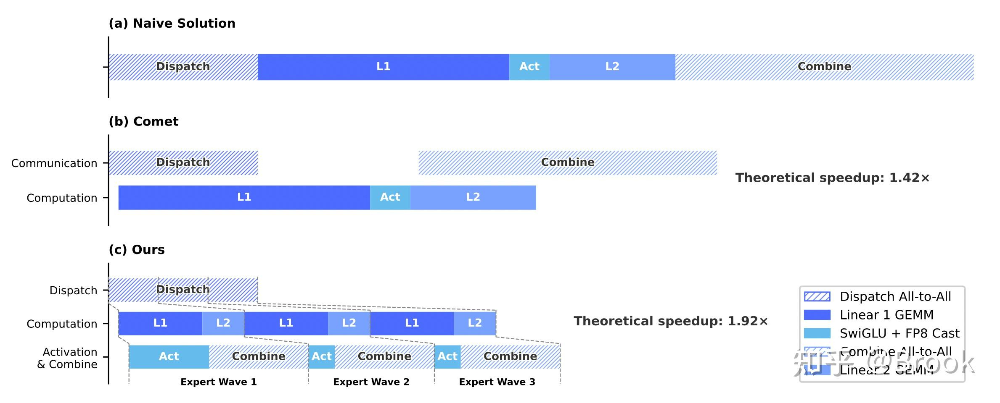
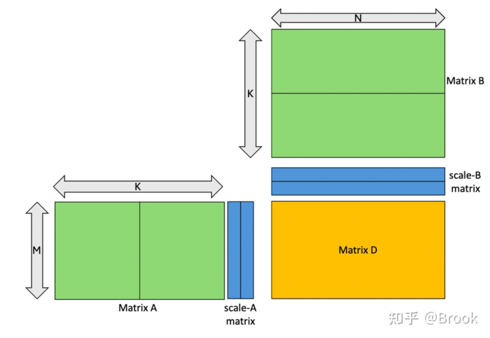
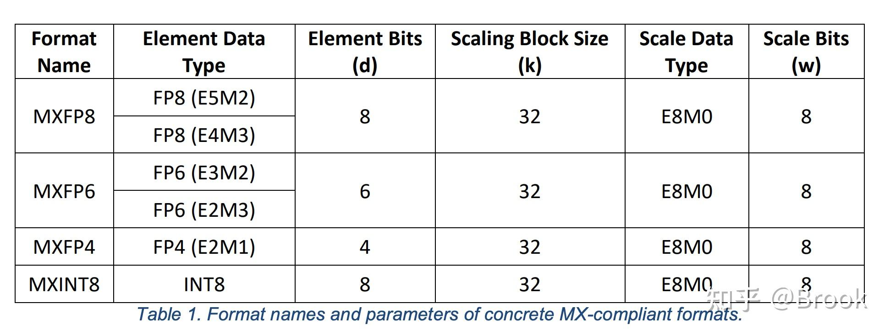
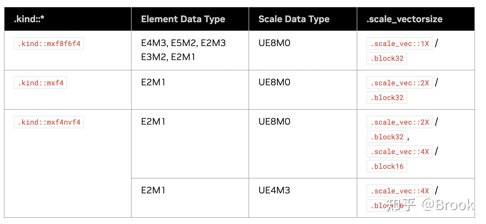
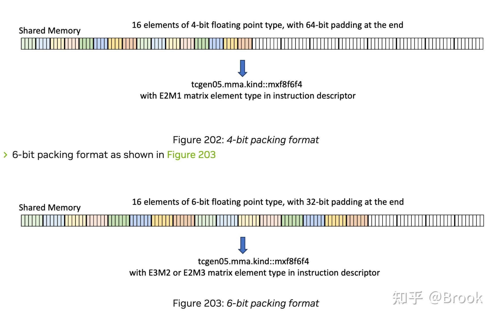
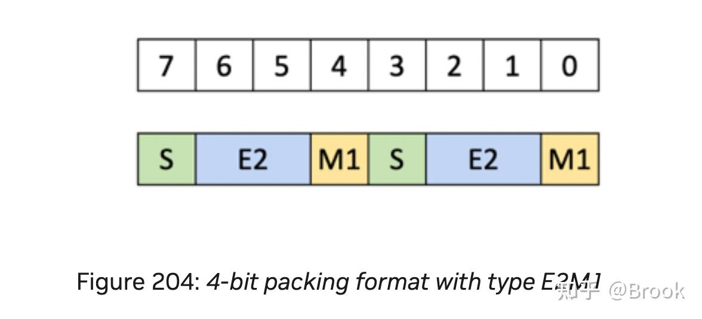
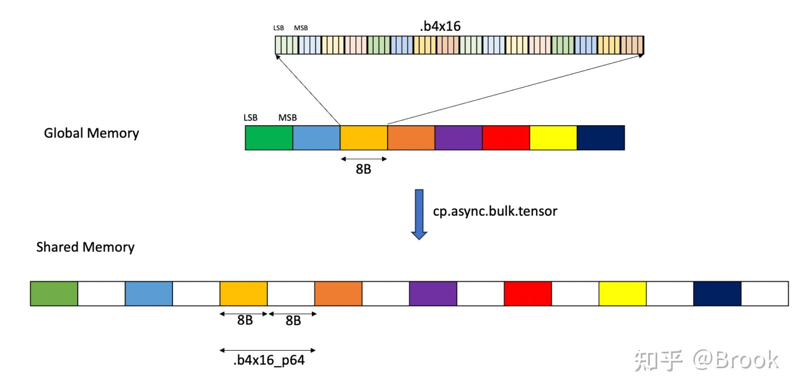
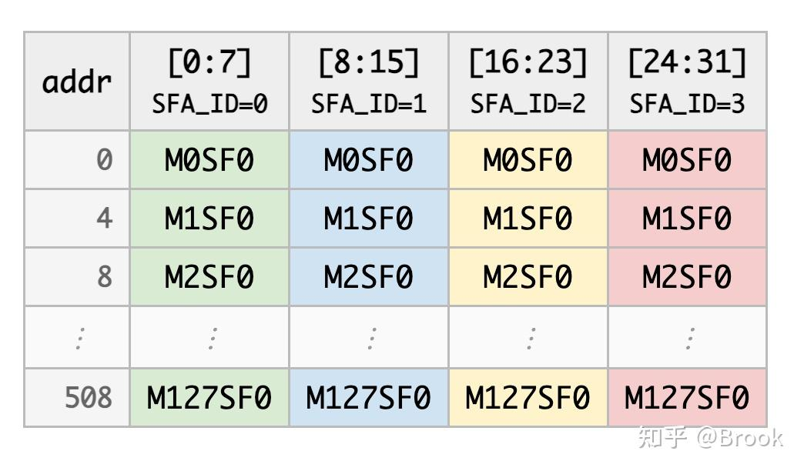
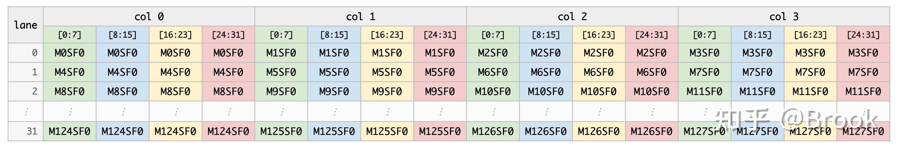
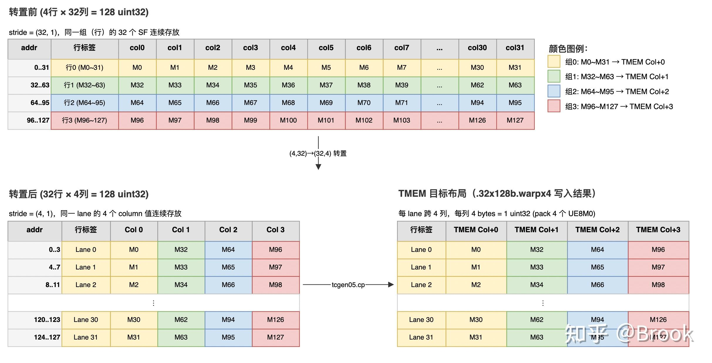

DeepSeek V4在DeepGEMM中引入了Mega MoE大算子，融合了dispatch/linear 1/SwiGLU/linear 2/combine，本节主要介绍一下整体流程和Blackwell的block scaling。



1.  DeepSeek发现在MoE的过程中瓶颈主要是计算，因此通信可以被隐藏到MoE的计算中，Mega MoE在推理中可以提速1.50∼1.73倍，在延迟敏感的场景可以提速1.96倍
2.  只支持Blackwell，MoE中weight为fp4，act为fp8
3.  通信暂时只支持nvlink，即单机或者超节点，dispatch使用了nvlink的read，combine使用的是write，技术报告中表明read可以避免write的flag额外延迟
4.  dispatch和combine的通信量相对DeepEP变多，DeepEP中一个src rank的token\[i\]如果命中dst rank多个local\_expert，那么从src\_rank到dst\_rank只会发送一次，但是MegaMoE会按照expert粒度进行传输
5.  使用了DeepEP v2作为基线进行对比

本节我们主要以test\_mega\_moe.py为例看下整体的流程。下节会具体介绍代码实现。

## 1. 用法

| num_max_tokens_per_rank | 8192 | 一个rank最多可以有多少token |
| ----- | ----- | ----- |
| hidden | 7168 | 用户输入的x的k维度 |
| intermediate_hidden | 3072 | MoE的中间层维度 |
| num_experts | 384 | 全局expert总数 |
| num_topk | 6 | 每个token选几个expert |

 申请一个buffer，group为torch的dist group，其他变量名如上所示。

```python
buffer = deep_gemm.get_symm_buffer_for_mega_moe(
    group, num_experts,
    num_max_tokens_per_rank, num_topk,
    hidden, intermediate_hidden
)
```

```python
def run_fused():
    buffer.x[:num_tokens].copy_(x[0])
    buffer.x_sf[:num_tokens].copy_(x[1])
    buffer.topk_idx[:num_tokens].copy_(topk_idx)
    buffer.topk_weights[:num_tokens].copy_(topk_weights)

    y = torch.empty((num_tokens, hidden), dtype=torch.bfloat16, device='cuda')
    deep_gemm.fp8_fp4_mega_moe(
        y,
        transformed_l1_weights, transformed_l2_weights,
        buffer,
        activation_clamp=args.activation_clamp,
        fast_math=bool(args.fast_math)
    )
    return y
```

这段代码中，输入activation会先量化为FP8，格式为E4M3，对应MXFP8体系：

- `x[0]`：量化后的FP8 hidden，shape为`[num_tokens, hidden]`。
- `x[1]`：对应的scale factor。它是per-token、per-32-hidden-element粒度的scale，scale格式为UE8M0。

也就是说，每个token的hidden向量会按32个元素一组共享一个scale：

```text
hidden[0:32]    -> scale 0
hidden[32:64]   -> scale 1
hidden[64:96]   -> scale 2
...
```

权重也会提前量化和变换布局：

- `transformed_l1_weights`：L1 expert权重。
- `transformed_l2_weights`：L2 expert权重。

二者均为MXFP4格式：

- 数据部分是E2M1 FP4。
- scale为UE8M0。
- 每32个权重元素共享一个scale。

这里的`transformed`表示权重不仅已经量化，而且已经转成Mega MoE kernel需要的内存布局。

## 2. 超参

注意BLOCK\_x并不是UMMA的shape。

| 参数 | 值 | 说明 |
| ----- | ----- | ----- |
| BLOCK_M | 192 | 用户输入token维度的分块 |
| BLOCK_N | 128 | Gemm的D矩阵中N方向分块 |
| BLOCK_K | 128 | K维度 |

## 3. 整体流程

### 3.1 SymmBuffer

Mega MoE的`SymmBuffer`不是多个独立Tensor，而是一整块连续的symmetric memory。源码中先申请`SymmBuffer.buffer`，然后通过固定offset切成`workspace`、输入区、shared expert区、L1/L2 ring buffer和combine buffer。

相关源码：

- `deep_gemm/mega/__init__.py`：申请`sym_buffer.buffer`，并把切出来的view挂到`buffer.x`、`buffer.x_sf`等属性上。
- `csrc/apis/mega.hpp`：`slice_input_buffers`通过`torch::from_blob`创建Python侧可见的Tensor view。
- `deep_gemm/include/deep_gemm/layout/mega_moe.cuh`：定义`Workspace`、`Buffer`和`MegaMoEBuffer`的真实内存布局。

下面用FP8 × FP4路径说明。记号如下：

| 记号 | 含义 |
| ----- | ----- |
| `R` | `num_ranks`，参与Mega MoE的rank数 |
| `E` | `num_experts`，全局expert数量 |
| `E_r` | `num_experts_per_rank = E / R` |
| `T` | `num_max_tokens_per_rank`，每个rank最多输入token数 |
| `K` | `num_topk`，每个token选择的expert数量 |
| `H` | `hidden` |
| `I` | `intermediate_hidden` |
| `S` | `num_shared_experts` |
| `SI` | `shared_intermediate_hidden = I × S` |
| `N_ring` | `num_ring_tokens`，L1/L2 ring buffer中的token槽位数 |
| `N_sf_ring` | `num_sf_ring_tokens`，scale ring buffer中的槽位数 |
| `N_shared_sf` | `ceil(T / 8) × 128`，shared expert scale区的最大行数 |
| `P` | `num_max_pool_tokens`，完整pool metadata容量 |

`P`的计算逻辑是：

```text
P = align(
      R × T × min(K, E_r) + E_r × (192 - 1),
      384
    )
```

其中`192`是最大候选`BLOCK_M`，`384`是候选`BLOCK_M`集合的LCM。

#### 3.1.1 SymmBuffer整体视图

```text
SymmBuffer.buffer
│
├── 0. Workspace，CUDA内部控制区，不挂到Python属性
│   ├── barrier / scheduler counters
│   │   shape: 128B固定区
│   │   dtype: uint32 / int
│   │   作用: grid sync、NVLink barrier、L1/L2/shared task counter
│   │
│   ├── expert_send_count
│   │   shape: [E]
│   │   dtype: uint64
│   │   作用: 当前rank发往每个全局expert的token数量
│   │
│   ├── expert_recv_count
│   │   shape: [R, E_r]
│   │   dtype: uint64
│   │   作用: 当前rank的local expert从每个src rank接收多少token
│   │
│   ├── expert_recv_count_sum
│   │   shape: [E_r]
│   │   dtype: uint64
│   │   作用: 当前rank每个local expert总接收token数量
│   │
│   ├── l1_full_count / l1_empty_count
│   │   shape: [N_ring / 8]
│   │   dtype: uint32
│   │   作用: dispatch和L1之间的ring block生产/消费同步
│   │
│   ├── l2_full_count / l2_empty_count
│   │   shape: [N_ring / 8]
│   │   dtype: uint32
│   │   作用: L1 epilogue和L2之间的ring block生产/消费同步
│   │
│   ├── shared_l2_full_count
│   │   shape: [ceil(T / 8)]
│   │   dtype: uint32
│   │   作用: shared expert L2输入就绪计数
│   │
│   ├── src_token_topk_idx
│   │   shape: [E_r, R, R × T]
│   │   dtype: uint32
│   │   作用: 目标expert记录每个接收slot对应源端哪个token-topk
│   │
│   └── token_src_metadata
│       shape: [P]
│       dtype: TokenSrcMetadata {rank_idx, token_idx, topk_idx}
│       作用: combine阶段把输出写回源rank和源token位置
│
├── 1. Input buffers，Python每次调用前需要填充
│   ├── input_token_buffer
│   │   └── buffer.x
│   │       shape: [T, H]
│   │       dtype: FP8 E4M3 / BF16
│   │       作用: 输入token hidden
│   │
│   ├── input_sf_buffer
│   │   └── buffer.x_sf
│   │       shape: [T, H / 128]
│   │       dtype: int32
│   │       作用: packed UE8M0 scale，逻辑上每32个hidden元素一个scale
│   │
│   ├── input_topk_idx_buffer
│   │   └── buffer.topk_idx
│   │       shape: [T, K]
│   │       dtype: int64
│   │       作用: 每个token选择的K个expert id
│   │
│   └── input_topk_weights_buffer
│       └── buffer.topk_weights
│           shape: [T, K]
│           dtype: float32
│           作用: combine阶段的TopK加权系数
│
├── 2. Shared expert buffers，可选
│   ├── shared_l1_token_buffer
│   │   └── buffer.shared_l1_acts
│   │       shape: [T, H]
│   │       dtype: FP8 E4M3 / BF16
│   │       作用: shared expert的L1输入；源码中复用input_token_buffer
│   │
│   ├── shared_l1_sf_buffer
│   │   └── buffer.shared_l1_acts_sf
│   │       shape: [N_shared_sf, H / 128]
│   │       dtype: int32
│   │       作用: shared expert L1输入scale
│   │
│   ├── shared_l2_token_buffer
│   │   └── buffer.shared_l2_acts
│   │       shape: [T, SI]
│   │       dtype: FP8 E4M3 / BF16
│   │       作用: shared expert L1/SwiGLU后的L2输入
│   │
│   └── shared_l2_sf_buffer
│       └── buffer.shared_l2_acts_sf
│           shape: [N_shared_sf, SI / 128]
│           dtype: int32
│           作用: shared expert L2输入scale
│
├── 3. Routed expert L1 ring buffers，CUDA内部流水线使用
│   ├── l1_token_buffer
│   │   └── buffer.l1_acts
│   │       shape: [N_ring, H]
│   │       dtype: FP8 E4M3 / BF16
│   │       作用: dispatch按expert聚合后的L1输入token ring
│   │
│   ├── l1_sf_buffer
│   │   └── buffer.l1_acts_sf
│   │       shape: [N_sf_ring, H / 128]
│   │       dtype: int32
│   │       作用: L1输入scale ring
│   │
│   └── l1_topk_weights_buffer
│       └── Python侧不单独挂属性
│           shape: [N_ring]
│           dtype: float32
│           作用: 每个routed token对应的TopK权重
│
├── 4. Routed expert L2 ring buffers，CUDA内部流水线使用
│   ├── l2_token_buffer
│   │   └── buffer.l2_acts
│   │       shape: [N_ring, I]
│   │       dtype: FP8 E4M3 / BF16
│   │       作用: L1 GEMM + SwiGLU后的L2输入token ring
│   │
│   └── l2_sf_buffer
│       └── buffer.l2_acts_sf
│           shape: [N_sf_ring, I / 128]
│           dtype: int32
│           作用: L2输入scale ring
│
└── 5. Combine buffer，CUDA内部使用，不挂到Python属性
    └── combine_token_buffer
        shape: [K + extra_shared, T, H]
        dtype: BF16
        作用: L2输出回写/本地combine暂存区，最终结果写入外部传入的y
```

#### 3.1.2 Python可见输入区

这些view由`slice_input_buffers`创建，是每次调用`fp8_fp4_mega_moe`前需要填进去的输入。

| Python view | 底层buffer | dtype | shape | 说明 |
| ----- | ----- | ----- | ----- | ----- |
| `buffer.x` | `input_token_buffer` | `FP8 E4M3` | `[T, H]` | 输入token hidden |
| `buffer.x_sf` | `input_sf_buffer` | `int32` | `[T, H / 128]` | 输入token的packed UE8M0 scale；逻辑上每32个hidden元素一个scale |
| `buffer.topk_idx` | `input_topk_idx_buffer` | `int64` | `[T, K]` | `topk_idx[token][k]`表示第`token`个token的第`k`个expert |
| `buffer.topk_weights` | `input_topk_weights_buffer` | `float32` | `[T, K]` | combine阶段使用的TopK权重 |

注意`buffer.x_sf`的shape不是`[T, H / 32]`，因为4个UE8M0 scale会打包到一个`int32`里：

```text
逻辑scale数量 = H / 32
物理int32数量 = H / 128
```

#### 3.1.3 Kernel内部ring buffer与combine区

下面这些区域主要由CUDA kernel内部读写，其中`l1_acts`、`l1_acts_sf`、`l2_acts`、`l2_acts_sf`也会在Python侧被切成view，但正常使用时不需要手动填。

| 区域 | dtype | shape | 作用 |
| ----- | ----- | ----- | ----- |
| `shared_l1_token_buffer` | `FP8 E4M3` | `[T, H]` | shared expert的L1输入；源码中直接复用`input_token_buffer` |
| `shared_l1_sf_buffer` | `int32` | `[N_shared_sf, H / 128]` | shared expert L1输入scale，使用TMA友好的布局 |
| `shared_l2_token_buffer` | `FP8 E4M3` | `[T, SI]` | shared expert L1 epilogue后的L2输入 |
| `shared_l2_sf_buffer` | `int32` | `[N_shared_sf, SI / 128]` | shared expert L2输入scale |
| `l1_token_buffer` | `FP8 E4M3` | `[N_ring, H]` | dispatch按expert聚合后的L1输入token ring |
| `l1_sf_buffer` | `int32` | `[N_sf_ring, H / 128]` | L1输入scale ring，TMA友好布局 |
| `l1_topk_weights_buffer` | `float32` | `[N_ring]` | 每个routed token对应的TopK权重 |
| `l2_token_buffer` | `FP8 E4M3` | `[N_ring, I]` | L1 + SwiGLU后的L2输入token ring |
| `l2_sf_buffer` | `int32` | `[N_sf_ring, I / 128]` | L2输入scale ring，TMA友好布局 |
| `combine_token_buffer` | `BF16` | `[K + extra_shared, T, H]` | L2输出回写/本地combine暂存区，`extra_shared = 1`表示存在shared expert输出 |

权重不在`SymmBuffer`里。`transformed_l1_weights`和`transformed_l2_weights`是`fp8_fp4_mega_moe`的独立参数，格式是`FP4 E2M1 + packed UE8M0 scale`，并且已经转成kernel需要的布局。

### 3.2 workspace

`workspace`是`SymmBuffer`最前面的一段内存，主要保存同步计数、expert收发统计和combine需要的源token元信息。它不保存真正的hidden向量。

| 变量 | 类型 | shape | 作用 |
| ----- | ----- | ----- | ----- |
| `grid_sync_count` | `uint32` | `[4]` | kernel内部grid级同步计数 |
| `nvl_barrier_counter` | `uint32` | `[1]` | NVLink barrier计数 |
| `nvl_barrier_signal` | `int` | `[2]` | NVLink barrier双phase信号 |
| `l1_task_count` | `uint32` | `[1]` | L1任务分配计数 |
| `l2_task_count` | `uint32` | `[1]` | L2任务分配计数 |
| `shared_l1_task_count` | `uint32` | `[1]` | shared expert L1任务分配计数 |
| `shared_l2_task_count` | `uint32` | `[1]` | shared expert L2任务分配计数 |
| `expert_send_count` | `uint64` | `[E]` | 当前rank发往每个全局expert的token数量 |
| `expert_recv_count` | `uint64` | `[R, E_r]` | 当前rank的local expert从每个src rank接收多少token |
| `expert_recv_count_sum` | `uint64` | `[E_r]` | 当前rank每个local expert总接收token数量 |
| `l1_full_count` | `uint32` | `[N_ring / 8]` | dispatch写满L1 ring block后通知L1消费 |
| `l1_empty_count` | `uint32` | `[N_ring / 8]` | L1消费完ring block后通知dispatch复用 |
| `l2_full_count` | `uint32` | `[N_ring / 8]` | L1 epilogue写满L2 ring block后通知L2消费 |
| `l2_empty_count` | `uint32` | `[N_ring / 8]` | L2消费完ring block后通知L1 epilogue复用 |
| `shared_l2_full_count` | `uint32` | `[ceil(T / 8)]` | shared expert L2输入就绪计数 |
| `src_token_topk_idx` | `uint32` | `[E_r, R, R × T]` | dispatch阶段写入，告诉目标expert应该从哪个src rank的哪个`token × topk`读取输入 |
| `token_src_metadata` | `TokenSrcMetadata` | `[P]` | combine阶段回写需要的`src_rank`、`src_token_idx`、`src_topk_idx` |

### 3.3 buffer

源码里有两个小结构：

```text
Data   = 一条token/一条metadata占多少字节，是否需要TMA对齐
Buffer = Data + rank维度 + token槽位数 + base指针
```

所以`Buffer`本身不是一块新内存，而是对`SymmBuffer`中某一段区域的描述器。

```cuda
struct Data {
    uint32_t num_bytes;
    bool require_tma_alignment;
    void* base;
};

struct Buffer {
    Data data_layout;
    uint32_t num_ranks;
    uint32_t num_max_tokens_per_rank;
    void* base;
};
```

`num_max_pool_tokens`表示完整metadata池的容量，用于保存combine回写需要的源信息。真正的L1/L2 token数据不是按完整pool一次性分配，而是放进`num_ring_tokens`大小的ring buffer里循环复用。

```cuda
CUTLASS_HOST_DEVICE constexpr T get_num_max_pool_tokens(
    T num_ranks,
    T num_max_tokens_per_rank,
    T num_topk,
    T num_experts_per_rank
) {
    const auto num_max_recv_tokens = num_ranks * num_max_tokens_per_rank;
    const auto num_max_experts_per_token = math::constexpr_min(num_topk, num_experts_per_rank);
    return math::constexpr_align(
        num_max_recv_tokens * num_max_experts_per_token + num_experts_per_rank * (kMaxCandidateBlockM - 1),
        kLCMCandidateBlockM);
}
```

核心buffer如下，完整shape见3.1。

| 变量 | layout大小 | 槽位数 | 作用 |
| ----- | ----- | ----- | ----- |
| `input_token_buffer` | `H`字节 | `T` | 输入FP8 token |
| `input_sf_buffer` | `H / 32`字节 | `T` | 输入token的packed scale |
| `input_topk_idx_buffer` | `K × 8`字节 | `T` | TopK expert index |
| `input_topk_weights_buffer` | `K × 4`字节 | `T` | TopK combine权重 |
| `shared_l1_token_buffer` | `H`字节 | `T` | shared expert L1输入，复用`input_token_buffer` |
| `shared_l1_sf_buffer` | `H / 32`字节 | `N_shared_sf` | shared expert L1 scale |
| `shared_l2_token_buffer` | `SI`字节 | `T` | shared expert L2输入 |
| `shared_l2_sf_buffer` | `SI / 32`字节 | `N_shared_sf` | shared expert L2 scale |
| `l1_token_buffer` | `H`字节 | `N_ring` | routed expert L1输入ring |
| `l1_sf_buffer` | `H / 32`字节 | `N_sf_ring` | routed expert L1 scale ring |
| `l1_topk_weights_buffer` | `4`字节 | `N_ring` | routed token对应的TopK权重 |
| `l2_token_buffer` | `I`字节 | `N_ring` | routed expert L2输入ring |
| `l2_sf_buffer` | `I / 32`字节 | `N_sf_ring` | routed expert L2 scale ring |
| `combine_token_buffer` | `H × 2`字节 | `(K + extra_shared) × T` | BF16 combine暂存区 |

### 3.4 每个SM内的warp角色总览

后面的元数据准备、scheduler、dispatch pull、L1/L2 GEMM和epilogue，都是同一个persistent multi-role kernel里的不同warp角色在做。因此需要先看清楚每个SM内部的分工。

kernel launch时，grid规模等于当前GPU可用SM数量：

```text
gridDim.x = num_sms
```

每个SM上常驻一个CTA/block。每个block内部再按warp做角色分工。

launch时还会设置`cluster_dim = 2`，也就是两个CTA组成一个cluster，服务2-CTA UMMA协作。从单个SM视角看，仍然可以理解为一个常驻CTA占住一个SM。

当前源码中的线程配置来自`get_mega_moe_config`：

| 角色组 | 线程数 | warp数 | 说明 |
| ----- | -----: | -----: | ----- |
| Dispatch | 128 | 4 | 元数据准备、token pull、写L1 ring |
| Non-epilogue | 128 | 4 | TMA A、TMA B、MMA issue、scheduler |
| Epilogue | 128或256 | 4或8 | L1/L2结果后处理、写回、combine；具体数量由expected tokens per expert决定 |

Epilogue warp数量不是手写固定值，而是由`get_block_config_for_mega_moe()`按如下公式选择：

```text
expected_tokens_per_expert = num_tokens * num_ranks * num_topk / num_experts
```

当前源码的规则是：

| expected_tokens_per_expert | epilogue warpgroups | epilogue warps | epilogue threads |
| -----: | -----: | -----: | -----: |
| <= 8.5 | 2 | 8 | 256 |
| <= 16.5 | 2 | 8 | 256 |
| <= 32.5 | 1 | 4 | 128 |
| <= 64.5 | 2 | 8 | 256 |
| <= 96.5 | 2 | 8 | 256 |
| > 96.5 | 2 | 8 | 256 |

也就是说：只有`16.5 < expected_tokens_per_expert <= 32.5`这一档是4个epilogue warp，其余当前分支都是8个epilogue warp。

因此一个block的总线程数有两种：

```text
4 dispatch warps + 4 non-epilogue warps + 4 epilogue warps
= 12 warps = 384 threads

4 dispatch warps + 4 non-epilogue warps + 8 epilogue warps
= 16 warps = 512 threads
```

从单个SM看，主链路和warp归属如下：

```text
SM i / persistent CTA(block i)

Data prepare branch: [Dispatch warps x4]

┌──────────────────────────────────────────────┐
│ 1. metadata准备                               │
│    遍历topk_idx，统计expert_send_count        │
│    写远端src_token_topk_idx / recv_count      │
└──────────────────────┬───────────────────────┘
                       │
                       v
┌──────────────────────────────────────────────┐
│ 2. 远端token pull                             │
│    从远端symmetric input buffer拉token         │
└──────────────────────┬───────────────────────┘
                       │
                       v
┌──────────────────────────────────────────────┐
│ 3. 写L1输入ring buffer                        │
│    l1_token_buffer / l1_sf_buffer             │
│    l1_topk_weights_buffer / l1_full_count     │
└──────────────────────┬───────────────────────┘
                       │
                       │ 生产L1输入
                       v

Task pipeline:

┌──────────────────────────────────────────────┐       [Scheduler warp x1]
│ 4. 生成并发布TaskInfo                         │
│    L1/L2、expert、m block、pool block、slot     │
└──────────────────────┬───────────────────────┘
                       │
                       v
┌──────────────────────────────────────────────┐       [TMA A warp x1]
│ 5A. 搬activation / input                       │
│     L1读l1_token_buffer，L2读l2_token_buffer   │
└──────────────────────┬───────────────────────┘
                       │
                       v
┌──────────────────────────────────────────────┐       [TMA B warp x1]
│ 5B. 搬weight / weight scale                    │
│     L1读L1 weight，L2读L2 weight               │
└──────────────────────┬───────────────────────┘
                       │
                       v
┌──────────────────────────────────────────────┐       [MMA issue warp x1]
│ 6. 发UMMA / Tensor Core GEMM指令               │
│    结果进入TMEM accumulator                   │
└──────────────────────┬───────────────────────┘
                       │
                       v
┌──────────────────────────────────────────────┐
│ 7. 根据TaskInfo区分L1 / L2                    │
└──────────────┬───────────────────┬───────────┘
               │                   │
               │ L1 Task           │ L2 Task
               v                   v

Epilogue section: [Epilogue warps x4/x8]

L1 path:

┌──────────────────────────────────────────────┐
│ 8A. L1 epilogue                               │
│     SwiGLU、topk weight、FP8量化               │
│     写l2_token_buffer / l2_sf_buffer          │
│     更新l2_full_count                         │
└──────────────────────┬───────────────────────┘
                       │
                       v
┌──────────────────────────────────────────────┐
│ L1 -> L2 handoff                              │
│ l2_token_buffer / l2_sf_buffer成为L2输入       │
│ 后续L2 TaskInfo再回到步骤4-6                  │
└──────────────────────────────────────────────┘

L2 path:

┌──────────────────────────────────────────────┐
│ 8B. L2 epilogue                               │
│     BF16 cast                                 │
│     写combine_token_buffer                    │
│     更新l2_empty_count                        │
└──────────────────────┬───────────────────────┘
                       │
                       v
┌──────────────────────────────────────────────┐
│ 9. Combine reduce                             │
│    累加TopK / Shared输出                       │
│    写最终y                                    │
└──────────────────────────────────────────────┘

Pipeline overlap:

时间 →
TaskInfo 0:  TMA -> MMA -> Epilogue
TaskInfo 1:        TMA -> MMA -> Epilogue
TaskInfo 2:              TMA -> MMA -> Epilogue
TaskInfo 3:                    TMA -> MMA -> Epilogue
```

也可以按阶段反查warp：

| 阶段 | 主要warp角色 | 输出/通知 |
| ----- | ----- | ----- |
| 元数据准备 | Dispatch warps | `src_token_topk_idx`、`expert_recv_count`、`expert_recv_count_sum` |
| TaskInfo调度 | Scheduler warp | `task_infos[0/1]`、`task_info_full_barriers` |
| Dispatch pull | Dispatch warps | `l1_token_buffer`、`l1_sf_buffer`、`l1_topk_weights_buffer`、`l1_full_count` |
| Activation TMA | TMA A warp | `smem_a`、`smem_sfa` |
| Weight TMA | TMA B warp | `smem_b`、`smem_sfb` |
| GEMM主计算 | MMA issue warp | TMEM accumulator |
| L1后处理 | Epilogue warps | `l2_token_buffer`、`l2_sf_buffer`、`l2_full_count`、`l1_empty_count` |
| L2后处理 | Epilogue warps | combine buffer、`l2_empty_count` |
| Combine reduce | Epilogue warps | 最终输出`y` |

全GPU视角就是：

```text
num_sms个SM
  -> num_sms个persistent blocks
  -> 每个block内部都有同样的warp角色分工
```

所以这里不是“几个SM专门做metadata，几个SM专门做GEMM”。Mega MoE是每个SM内部用warp specialization拆角色。

### 3.5 元数据准备阶段

元数据准备阶段的作用是：先生成“每个expert应该从哪些rank拉哪些token”的清单。真正的hidden数据不在这个阶段搬运，只写计数和索引。

第一步，所有SM上的dispatch warp遍历本rank的`topk_idx`矩阵：

```text
topk_idx[token_idx][topk_idx] = ep_id
```

其中`ep_id`是全局expert编号。kernel会统计：

```text
expert_send_count[ep_id]
```

它表示当前rank有多少个token分支需要发送给全局expert `ep_id`。

第二步，把发送计数写到目标rank的workspace里：

```cpp
dst_rank = ep_id / num_experts_per_rank
local_ep = ep_id % num_experts_per_rank

expert_recv_count[src_rank][local_ep] = expert_send_count[ep_id]
atomic_add_sys(expert_recv_count_sum[local_ep], expert_send_count[ep_id])
```

这样目标rank就知道：

```text
local_ep这个本地expert一共要接收多少token；
这些token分别来自哪些src_rank；
每个src_rank贡献多少token。
```

第三步，写token来源索引。对于每个命中的`topk_idx[token_idx][topk_idx] = ep_id`，源rank会在目标rank的数组里抢一个slot：

```text
src_token_topk_idx[local_ep][src_rank][slot]
```

slot通过atomic获得，保证同一个`local_ep`、同一个`src_rank`下的多个token分支不会互相覆盖。

写入的值是：

```text
src_token_topk_idx = token_idx * num_topk + topk_idx
```

目标rank之后可以反解出：

```text
src_token_idx = src_token_topk_idx / num_topk
src_topk_idx  = src_token_topk_idx % num_topk
```

然后目标rank就能通过`sym_buffer.map(ptr, src_rank)`去源rank的对称内存里pull：

```text
input_token_buffer[src_token_idx]
input_sf_buffer[src_token_idx]
input_topk_weights_buffer[src_token_idx][src_topk_idx]
```

所以元数据准备阶段本质上不是搬token，而是建立远端pull所需的路由表。

### 3.6 scheduler

`scheduler`是fused MegaMoE kernel内部的GEMM tile任务调度器。它不负责生成路由元数据，也不负责搬token；它只根据元数据阶段得到的每个local expert的token数量，生成L1/L2/Shared expert的计算任务。

当前源码里的核心实现是：

```text
deep_gemm/include/deep_gemm/scheduler/mega_moe.cuh
  MegaMoEScheduler
```

kernel侧使用位置是：

```text
deep_gemm/include/deep_gemm/impls/sm100_fp8_fp4_mega_moe.cuh
  scheduler.fetch_expert_recv_count()
  scheduler.get_next_task()
```

#### 3.6.1 scheduler输入

```text
expert_recv_count_sum[local_ep]
```

这是当前rank上每个local expert最终要处理的token分支数量。

注意它只调度当前rank自己的local experts，不调度全局所有expert：

```text
num_experts_per_rank = num_experts / num_ranks
当前rank只处理自己的 num_experts_per_rank 个local experts
```

`fetch_expert_recv_count()`会把这些数量缓存进：

```text
stored_num_tokens_per_expert
```

源码里每个lane缓存一组expert：

```text
stored_num_tokens_per_expert[i]
  -> expert(i * 32 + lane_idx) 的token数量
```

这样后续生成任务时，不需要反复从workspace读计数。

#### 3.6.2 pool block

每个expert收到的token数量不同，scheduler先按`BLOCK_M`切token维度：

```text
expert e收到900个token
BLOCK_M = 192
num_m_blocks = ceil(900 / 192) = 5
```

所有local experts的M blocks会按expert顺序拼成一个逻辑pool：

```text
expert0 blocks
expert1 blocks
expert2 blocks
...
```

`pool_block_idx`表示这个block在整个local expert pool里的编号。

这个编号很关键，因为后面的ring buffer复用会用：

```text
ring_block_idx = pool_block_idx % kNumRingBlocks
```

所以：

```text
pool_block_idx 是逻辑上的完整任务编号
ring_block_idx 是实际落到L1/L2 ring buffer里的槽位
```

#### 3.6.3 Tile任务

对一个Linear来说，GEMM输出tile可以理解为：

```text
C_tile = [BLOCK_M, BLOCK_N]
```

也就是：

```text
一组token × 一段输出维度
```

源码中每个任务不是单个`BLOCK_N`，而是一个N方向的cluster：

```text
kNumL1Clusters = L1_SHAPE_N / BLOCK_N / 2
kNumL2Clusters = L2_SHAPE_N / BLOCK_N / 2
```

这里除以2，是因为源码使用2-CTA cluster，两个相邻CTA处理同一个M block下相邻的N block。源码也要求：

```text
L1_SHAPE_N % (BLOCK_N * 2) == 0
L2_SHAPE_N % (BLOCK_N * 2) == 0
```

#### 3.6.4 TaskInfo

源码里用`TaskInfo`描述一个被调度出来的任务：

```cuda
struct TaskInfo {
    BlockPhase block_phase;
    uint32_t local_expert_idx;
    uint32_t m_block_idx;
    uint32_t n_cluster_idx;
    uint32_t pool_block_idx;
    uint32_t valid_m;
    uint32_t shape_n;
    uint32_t shape_k;
};
```

这些字段含义如下：

| 字段 | 含义 |
| ----- | ----- |
| `block_phase` | 当前任务属于L1、L2、Shared L1还是Shared L2 |
| `local_expert_idx` | 当前任务对应哪个本地expert |
| `m_block_idx` | 当前expert内部第几个token block |
| `n_cluster_idx` | 当前输出N方向第几个block group |
| `pool_block_idx` | 当前token block在完整pool中的编号，用于定位ring buffer和metadata |
| `valid_m` | 当前M block里真实有效token数，最后一块可能小于`BLOCK_M` |
| `shape_n` | 当前Linear的输出维度 |
| `shape_k` | 当前Linear的K维度 |

其中`block_phase`表示任务类型：

```cuda
enum class BlockPhase : uint32_t {
    None = 0,
    Linear1 = 1,
    Linear2 = 2,
    SharedLinear1 = 3,
    SharedLinear2 = 4
};
```

MoE专家计算包含两层Linear：

```text
L1: hidden -> 2 × intermediate_hidden
SwiGLU
L2: intermediate_hidden -> hidden
```

因此scheduler需要生成两类主要任务：

```text
Linear1任务：消费l1_token_buffer，计算L1输出
Linear2任务：消费l2_token_buffer，计算L2输出
```

这两类任务分别来自两个全局task counter：

```cpp
l1_task_idx = atomic_add(l1_task_count, 1)
l2_task_idx = atomic_add(l2_task_count, 1)
```

含义是：

```text
l1_task_idx：当前GPU上第几个Linear1 tile任务
l2_task_idx：当前GPU上第几个Linear2 tile任务
```

所有SM上的scheduler warp都会通过`atomic_add`抢任务编号。抢到的编号唯一，因此不同SM不会重复处理同一个tile。

随后scheduler把这个线性编号交给`create_task()`：

```cpp
create_task(BlockPhase::Linear1, l1_task_idx, kNumL1Clusters, L1_SHAPE_N, L1_SHAPE_K)
create_task(BlockPhase::Linear2, l2_task_idx, kNumL2Clusters, L2_SHAPE_N, L2_SHAPE_K)
```

`create_task()`再把`l1_task_idx`或`l2_task_idx`翻译成具体的`TaskInfo`字段。

如果存在shared expert，还会额外生成：

```text
SharedLinear1任务
SharedLinear2任务
```

#### 3.6.5 create_task

`create_task()`的输入是一个线性的`task_idx`，它先拆成：

```text
m_block_idx   = task_idx / num_clusters
n_cluster_idx = task_idx % num_clusters
```

然后通过每个expert的`num_m_blocks`做prefix sum，判断这个`m_block_idx`属于哪个local expert。

最后填出：

```text
local_expert_idx
m_block_idx
pool_block_idx
valid_m
n_cluster_idx
shape_n / shape_k
```

所以scheduler并不提前建立一个大任务数组；它是用计数和原子task counter动态生成任务。

#### 3.6.6 L1/L2动态调度

Scheduler的核心逻辑是：先发一小段L1任务作为warmup，让后面的L2有输入；随后L1和L2动态穿插执行。

1. 计算L1 warmup任务量：

   ```text
   num_total_m_blocks = get_num_total_pool_blocks()
   num_total_l1_tasks = num_total_m_blocks * kNumL1Clusters
   num_total_l1_waves = ceil_div(num_total_l1_tasks, kNumSMs / 2)
   num_sched_l1_waves = min_l1_warmup_waves
   ```

2. 先发布L1 warmup任务：

   ```text
   if num_sched_l1_waves > 0:
       l1_task_idx = atomic_add(l1_task_count, 1)
       return Linear1 task
   ```

3. warmup之后优先发布L2任务：

   ```text
   l2_task_idx = atomic_add(l2_task_count, 1)
   return Linear2 task
   ```

4. L2任务依赖对应的L1任务计数：

   ```text
   num_required_l1_tasks = (pool_block_idx + 1) * kNumL1Clusters
   while l1_task_count < num_required_l1_tasks:
       wait
   ```

这里的`l1_task_count`只表示L1任务已经被取走；L2真正读数据前，还要等`l2_full_count`确认L1 epilogue已经把L2输入写好。

整体顺序：

```text
先发一段L1 warmup
随后L1/L2动态穿插
L2遇到依赖时等待对应L1任务和L1产出
```

#### 3.6.7 TaskInfo发布

调度线程和计算线程之间通过两个`TaskInfo`槽位传递任务：

```text
kNumScheduleStages = 2
task_infos[2]
task_info_full_barriers[2]
task_info_empty_barriers[2]
```

这就是一个很小的双缓冲任务队列：

```text
producer:
  等empty
  写TaskInfo
  arrive full

consumer:
  等full
  读取TaskInfo
  release empty
```

它的目的不是存很多任务，而是让任务生成和任务消费可以轻量流水化。

#### 3.6.8 任务消费者

从消费者视角看，scheduler发布的`TaskInfo`会被多个warp角色共同使用：

| 消费者 | 根据`TaskInfo`做什么 |
| ----- | ----- |
| TMA A warp | 加载activation和activation scale |
| TMA B warp | 加载weight和weight scale |
| MMA warp group | 执行当前tile的矩阵乘 |
| epilogue warp | 做SwiGLU、cast、store或combine写回 |

这一节的核心是：scheduler把当前rank的local expert负载切成M/N方向的GEMM tile，用原子counter动态分发L1/L2任务，并用很小的双缓冲`TaskInfo`队列把任务喂给TMA、MMA和epilogue角色。

### 3.7 dispatch与L1

`dispatch与L1`这一节讲的是：元数据准备完成后，当前rank如何把远端rank上的输入token pull到本地`l1_token_buffer`，并让L1 GEMM开始消费。

源码位置：

```text
deep_gemm/include/deep_gemm/impls/sm100_fp8_fp4_mega_moe.cuh
  Pull token data and SF from remote ranks into local L1 buffer
```

#### 3.7.1 dispatch pull之前的同步

元数据准备阶段会写：

```text
src_token_topk_idx
expert_recv_count
expert_recv_count_sum
```

这些数据可能写到远端rank的symmetric memory中。因此真正pull token之前，源码有一个NVLink barrier：

```cpp
comm::nvlink_barrier(...)
```

它的作用是保证所有rank的路由元数据都已经写完。否则当前rank可能还没看到完整的`src_token_topk_idx`和expert计数。

#### 3.7.2 当前rank按local expert遍历token pool

dispatch warp会先调用：

```cpp
scheduler.fetch_expert_recv_count()
```

拿到每个local expert的token数量。然后所有dispatch warp一起遍历一个扁平化的token pool：

```text
token_idx = sm_idx * kNumDispatchWarps + warp_idx
token_idx += kNumSMs * kNumDispatchWarps
```

这个`token_idx`不是原始输入token编号，而是当前rank按local expert聚合后的逻辑pool编号。

源码会根据每个expert的token数量维护：

```text
current_expert_idx
expert_start_idx
expert_end_idx
expert_pool_block_offset
```

含义是：

```text
当前token_idx属于哪个local expert；
它是这个expert里的第几个token；
它在完整pool里的pool_token_idx是多少。
```

#### 3.7.3 不按rank顺序拉，而是交错拉

当处理某个`current_expert_idx`时，源码会读取：

```text
expert_recv_count[src_rank][current_expert_idx]
```

这表示这个local expert从每个源rank接收多少token。

源码注释里写的是：

```text
Round-robin rank selection via iterative min-peeling
```

意思是：同一个expert下，不是先把rank0的token全部拉完，再拉rank1，而是把还有剩余token的rank交错起来拉。

这样做的目的，是尽量让多个源rank的NVLink路径都参与进来，避免dispatch pull阶段集中打某一条链路。

这个交错只改变本地`l1_token_buffer`里的排列顺序，不改变token属于哪个expert，也不改变最终combine语义。

#### 3.7.4 反解源token位置

确定`src_rank`和`token_idx_in_rank`之后，当前rank从本地workspace读取：

```text
src_token_topk_idx =
  src_token_topk_idx[local_expert][src_rank][token_idx_in_rank]
```

然后反解：

```text
src_token_idx = src_token_topk_idx / kNumTopk
src_topk_idx  = src_token_topk_idx % kNumTopk
```

这一步得到真正的源端输入位置：

```text
源rank的第src_token_idx个token
这个token的第src_topk_idx个TopK分支
```

#### 3.7.5 写入L1 ring buffer

当前rank会先计算本地pool位置：

```text
pool_token_idx = expert_pool_block_offset * BLOCK_M + token_idx_in_expert
pool_block_idx = pool_token_idx / BLOCK_M
ring_block_idx = pool_block_idx % kNumRingBlocks
```

写入L1 ring buffer之前，需要确认这个ring slot已经被上一次循环使用完：

```text
l1_empty_count_target = (pool_block_idx / kNumRingBlocks) * kNumL1BlockNs
while l1_empty_count < l1_empty_count_target:
    wait
```

这就是ring buffer复用保护：生产者不能覆盖还没被L1 GEMM消费完的旧数据。

#### 3.7.6 token hidden的搬运路径

源token地址通过symmetric memory映射得到：

```text
src_base_ptr =
  sym_buffer.map(input_token_buffer[src_token_idx], src_rank)
```

目标地址是本地L1 ring buffer：

```text
dst_base_ptr =
  l1_token_buffer[pool_token_idx % kNumRingTokens]
```

hidden会按`kNumBytesPerPull`切成多个chunk：

```text
kNumChunks = kHidden / kNumBytesPerPull
```

每个chunk的路径是：

```text
remote input_token_buffer
  -> 当前SM的pull_buffer
  -> local l1_token_buffer
```

源码使用：

```cpp
ptx::tma_load_1d(...)
ptx::tma_store_1d(...)
```

所以这里不是普通线程逐元素搬运，而是用TMA完成大块数据搬运。

#### 3.7.7 scale、topk weight和combine metadata

除了hidden本体，dispatch pull还要处理三类附加信息。

第一，输入scale：

```text
remote input_sf_buffer[src_token_idx]
  -> local l1_sf_buffer
```

第二，TopK weight：

```text
remote input_topk_weights_buffer[src_token_idx, src_topk_idx]
  -> local l1_topk_weights_buffer[pool_token_idx]
```

这个weight后面combine需要用。

第三，combine回写所需metadata：

```text
token_src_metadata[pool_token_idx] =
  {src_rank, src_token_idx, src_topk_idx}
```

L2算完之后，需要根据这份metadata把结果写回对应源token的combine位置。

#### 3.7.8 用l1_full_count通知L1 GEMM

当一个token写入`l1_token_buffer`完成后，dispatch warp会更新：

```text
l1_full_count[ring_block_idx]
```

如果是某个expert最后一个token，并且最后一个`BLOCK_M`没有填满，源码会一次性补齐计数：

```text
BLOCK_M - (token_idx_in_expert % BLOCK_M)
```

这样L1侧可以始终按`BLOCK_M`作为一个完整block来等待，不需要为最后一个不满block写复杂判断。

L1 TMA load warp在取到`Linear1 TaskInfo`之后，会等待：

```text
while l1_full_count[ring_block_idx] != expected_tokens:
    wait
```

等这一块token都到齐之后，它才会从`l1_token_buffer`和`l1_sf_buffer`发起TMA load，进入后面的L1 GEMM。

所以`dispatch与L1`的完整关系是：

```text
远端input buffer
  -> dispatch pull
  -> 本地l1_token_buffer / l1_sf_buffer / l1_topk_weights_buffer
  -> l1_full_count通知
  -> L1 TMA load
  -> L1 GEMM
```

### 3.8 Lx计算流水线与epilogue

`Lx`表示`Linear1`或`Linear2`：

```text
Linear1:
  hidden -> 2 * intermediate_hidden
  后接SwiGLU

Linear2:
  intermediate_hidden -> hidden
  后接combine写回
```

`scheduler`发布的`TaskInfo`会被TMA A、TMA B、MMA issue和epilogue这些warp共同消费。它们不是各自独立做不同tile，而是围绕同一个GEMM tile形成流水线。

#### 3.8.1 TaskInfo驱动的角色协作

```text
TaskInfo
  |
  |-- TMA A warp
  |     └── 根据block_phase选择activation来源
  |         Linear1 -> l1_token_buffer / l1_sf_buffer
  |         Linear2 -> l2_token_buffer / l2_sf_buffer
  |
  |-- TMA B warp
  |     └── 根据block_phase选择weight来源
  |         Linear1 -> l1_weights / l1_weights_sf
  |         Linear2 -> l2_weights / l2_weights_sf
  |
  |-- MMA issue warp
  |     └── 等TMA A/B完成后发UMMA
  |
  └── Epilogue warps
        └── 等UMMA完成后处理结果
```

#### 3.8.2 activation TMA

TMA A warp负责搬activation。

如果当前任务是`Linear1`，activation来自：

```text
l1_token_buffer
l1_sf_buffer
```

如果当前任务是`Linear2`，activation来自：

```text
l2_token_buffer
l2_sf_buffer
```

在真正TMA之前，源码会先等数据到齐：

```text
Linear1:
  wait l1_full_count

Linear2:
  wait l2_full_count
```

然后按`BLOCK_K`切K维度，把activation和scale搬到shared memory：

```text
activation -> smem_a
scale      -> smem_sfa
```

#### 3.8.3 weight TMA

TMA B warp负责搬weight。

如果当前任务是`Linear1`，weight来自：

```text
l1_weights
l1_weights_sf
```

如果当前任务是`Linear2`，weight来自：

```text
l2_weights
l2_weights_sf
```

目标shared memory是：

```text
weight -> smem_b
scale  -> smem_sfb
```

TMA A和TMA B使用同一组`full_barriers`通知MMA：

```text
full_barriers[stage_idx]
```

只有activation和weight都搬完后，MMA才能消费这一stage。

#### 3.8.4 UMMA计算

MMA issue warp负责发UMMA指令。

它的等待条件是：

```text
full_barriers[stage_idx].wait(...)
```

等TMA A和TMA B都完成后，MMA issue warp会：

```text
smem_sfa / smem_sfb -> TMEM中的scale区域
smem_a × smem_b     -> UMMA
UMMA accumulator    -> TMEM
```

这里的主计算不由普通CUDA core完成，而是由Tensor Core执行。

计算完成后，MMA issue warp会通知epilogue：

```text
tmem_full_barriers[accum_stage_idx]
```

同时释放当前TMA stage：

```text
empty_barriers[stage_idx]
```

这样TMA A/B可以继续搬下一块K tile。

#### 3.8.5 epilogue

Epilogue warp等待：

```text
tmem_full_barriers[accum_stage_idx]
```

然后从TMEM读取GEMM accumulator。

如果是`Linear1`，epilogue做：

```text
TMEM accumulator
  -> 取出gate/up
  -> SwiGLU: silu(gate) * up
  -> 乘topk_weight
  -> amax reduction
  -> 计算FP8 scale
  -> cast成FP8
  -> 写l2_token_buffer
  -> 写l2_sf_buffer
```

如果是`Linear2`，epilogue做：

```text
TMEM accumulator
  -> cast成BF16
  -> 根据token_src_metadata找到原始src token
  -> 写combine buffer
```

所有L2写回完成后，源码会做一次NVLink barrier，然后继续复用epilogue warps执行combine reduce：

```text
combine_token_buffer[topk slot][token]
  -> 读取该token所有TopK/Shared贡献
  -> 在寄存器中累加
  -> 写最终输出y[token]
```

所以当前实现没有单独的`combine warp`分支。combine是epilogue warps在L2写回之后继续做的一个阶段。

#### 3.8.6 整体流水线视图

```text
TaskInfo
  |
  v
┌──────────────────────────────────────────────────────────────┐
│ persistent CTA / block                                       │
│                                                              │
│  TMA A warp        remote/local activation -> smem_a/smem_sfa│
│       │                                                      │
│       ├── full_barriers[stage]                               │
│       │                                                      │
│  TMA B warp        weight -> smem_b/smem_sfb                 │
│       │                                                      │
│       ├── full_barriers[stage]                               │
│       v                                                      │
│  MMA issue warp     smem_a × smem_b -> TMEM accumulator       │
│       │                                                      │
│       ├── tmem_full_barriers[accum_stage]                    │
│       v                                                      │
│  Epilogue warps     TMEM -> activation/quant/writeback        │
│                                                              │
└──────────────────────────────────────────────────────────────┘
```

所以`3.8`的重点是：`TaskInfo`不是只给某一个warp看，而是驱动TMA、UMMA和epilogue整条计算流水线。

### 3.9 L1与L2的生产消费关系

`Linear1`和`Linear2`之间通过`l2_token_buffer`和`l2_sf_buffer`衔接。

#### 3.9.1 L1生产L2输入

L1 epilogue完成SwiGLU和FP8量化后，会把结果写入：

```text
l2_token_buffer
l2_sf_buffer
```

然后更新：

```text
l2_full_count[ring_block_idx]
```

这表示：

```text
这个L2 ring block中的一段输入已经ready
```

#### 3.9.2 L2消费L2输入

L2的TMA A warp在执行`Linear2 TaskInfo`之前，会等待：

```text
l2_full_count[ring_block_idx]
```

等对应L2输入块到齐后，才会把`l2_token_buffer / l2_sf_buffer`搬到shared memory，进入L2 GEMM。

#### 3.9.3 ring buffer复用

L1/L2的中间activation不是无限开新buffer，而是复用ring buffer。

因此有两类计数器：

```text
full_count:
  生产者写完，用来通知消费者可以读

empty_count:
  消费者读完，用来通知生产者可以覆盖复用
```

对应到L1/L2：

```text
dispatch pull写完l1_token_buffer
  -> 更新l1_full_count
  -> L1 TMA可以读

L1 epilogue读完l1_token_buffer
  -> 更新l1_empty_count
  -> dispatch pull可以复用这个L1 ring slot

L1 epilogue写完l2_token_buffer
  -> 更新l2_full_count
  -> L2 TMA可以读

L2 epilogue读完l2_token_buffer
  -> 更新l2_empty_count
  -> L1 epilogue可以复用这个L2 ring slot
```

整体可以记成：

```text
input_token_buffer
  -> dispatch pull
  -> l1_token_buffer
  -> L1 GEMM
  -> L1 epilogue / SwiGLU / FP8 quant
  -> l2_token_buffer
  -> L2 GEMM
  -> L2 epilogue / BF16 cast
  -> combine buffer
  -> combine reduce
  -> y
```

## 4. Blackwell block scaling

在之前介绍Hopper的DeepGEMM的过程中，我们看到输入被量化为fp8 + scale factor(后续简称sf)，然后在执行完wgmma之后通过sf将wgmma的输出反量化回去，Blackwell直接在硬件层面支持了block scaling，操作如下：

$$
(A \times \mathrm{scale}_A) \times (B \times \mathrm{scale}_B) + D
$$

流程如下图所示：



比如A矩阵为Mx64，按照32个元素对应一个sf，那么sf\_a的shape为Mx2，A的每一块对应了一个量化系数，那么在做矩阵乘的时候，每个分块都会乘上自己对应的sf。

### 4.1 数据类型

  



首先看下数据类型，mx数据类型的定义如图6，mx可以理解为原始低精度类型 + scale，scale的类型均为E8M0，只有指数位，没有尾数位。 在这些原始定义之外，nv还定义了nvf4，和原始的mxf4的区别是nvf4的scaling block size由32变成了16，sf类型为UE4M3。

### 4.2 PTX

umma的指令支持了mx数据类型，umma block scale指令如下：

```ptx
// 2. Floating-point type with block scaling:

tcgen05.mma.cta_group.kind.block_scale{.scale_vectorsize}
                                        [d-tmem],  a-desc,  b-desc, idesc,
                                        [scale-A-tmem], [scale-B-tmem], enable-input-d;

tcgen05.mma.cta_group.kind.block_scale{.scale_vectorsize}
                                        [d-tmem], [a-tmem], b-desc, idesc,
                                        [scale-A-tmem], [scale-B-tmem], enable-input-d;

.kind = { .kind::mxf8f6f4, .kind::mxf4, .kind::mxf4nvf4 }
.cta_group      = { .cta_group::1,   .cta_group::2 }
.scale_vectorsize = { .scale_vec::1X, .scale_vec::2X, .scale_vec::4X, .block16, .block32 }
```

sfa和sfb都位于TMEM，通过scale-B-tmem和scale-B-tmem指定，指定的地址均为基地址，即元素\[0, 0\]对应的TMEM地址。 umma通过kind指定操作类型，其中mxf8f6f4为混合精度，支持8位，6位，4位的混合输入类型，但是mxf8f6f4不管实际数据类型是哪种，每个元素都需要占用一个字节，具体后续会介绍。 一个umma要求K维度必须是32B。对于scale\_vectorsize，scale\_vec::1X，scale\_vec::2X这些表示一个umma中一个K方向需要多少个sf，比如scale\_vec::2X表示一个umma中一个K方向需要2个sf，即图5所示的场景。block16，block32表示一个sf对应umma中一个K方向上多少个元素，所以可以发现blockx和scale\_vec::xX其实是可以互相转换的，如图7所示，以mxf8f6f4为例，无论一个元素是多少位，都占用一个字节，因此一个umma中K方向有32个元素，因此只需要一个sf，所以mxf8f6f4唯一对应了scale\_vec::1X或者block32。



### 4.3 低精度数据存储格式

我们主要介绍A位于SMEM，D为fp32的场景。 对于A位于TMEM的场景，类型mxf8f6f4都要padding到1字节，但是mxf4和mxf4nvf4都是紧密排布的，即两个f4打包到一个字节。 D矩阵位于TMEM，如果D的类型小于4字节，那么他会padding到4字节，比如一个16位的数据，会占用TMEM一个32位的低16位。

### 4.4 SMEM

对于mxf8f6f4类型，在SMEM中需要padding对齐到16B，如下图所示，16个连续的4位或者6位元素紧密排列，并对齐到16B。

  



对于mxf4nvf4或者mxf4类型，在SMEM中无需padding，两个元素存到一个8位空间，如下图所示。



因此整理下来如下所示

| 矩阵 | 存储位置 | kind | 规则 |
| ----- | ----- | ----- | ----- |
| A | TMEM | mxf8f6f4 | f4/f6每个元素padding到1B |
| A | TMEM | mxf4/mxf4nvf4 | 两个f4 pack成1B |
| A/B | SMEM | mxf8f6f4 | 16个元素一组，padding到16B |
| A/B | SMEM | mxf4/mxf4nvf4 | 两个f4 pack 成 1B |
| D | TMEM | 所有 kind | 元素 < 32bit 时，pad 到32bit |

### 4.5 GMEM

从GMEM搬数据到SMEM中的时候需要转成上述格式，TMA正好支持这种格式转换，在GMEM中我们可以紧密的存储，通过TMA转成padding格式，如图10，将GMEM中紧密存储的fp4 TMA到SMEM，对齐到16B，对应了host创建TensorMap时候的CU\_TENSOR\_MAP\_DATA\_TYPE\_16U4\_ALIGN16B参数。 如果使用mxf4/mxf4nvf4，那么使用CU\_TENSOR\_MAP\_DATA\_TYPE\_16U4\_ALIGN8B参数，表示不需要padding，紧密存储。



### 4.6 TMEM存储SF

umma要求sf存储在TMEM，我们以Mega MoE中的mxf8f6f4为例介绍，这个场景中sf在TMEM中存储格式如图11所示。


如上所述，每个umma的sf的shape为Mx1，这个sf在TMEM中只占用32 lane，图中展示的M为128，因此占用32x4col，图中每个col的4字节存储了4个sf，对应了4次umma，每次umma使用的sf对应图中一个颜色，通过instr中的sfa\_id表示使用哪个颜色对应的sf，比如第0次umma使用sfa\_id=00的绿色部分，第二次使用sfa\_id=01的蓝色部分。另外虽然只使用了32 lane，但是其他96 lane也被占用。

但是这引入了一个问题，可以看图11，lane0的col0是M0，col1是M32，而在GMEM原始的sf中，M0和M1是连续的。具体的，以MxK的A为例，在GMEM中为K major，所以sfa为M x (K / 32)，Mega MoE中sfa会用一个int存储连续的4个sf，因此一列int正好对应了4次umma，所以为了TMA每次load一列，sfa的存储为M major，那么在GMEM中sfa存储如图12所示（只展示了一列），即M0和M1是连续存储的。



那么TMA到SMEM，再通过32x128b粒度的tcgen5.cp到TMEM，会如图13所示，不符合要求，因此需要对原始矩阵进行转置，将GMEM中的\[row0, row1, …, row127\]调整成\[row0, row32, row64, row96, row1, row33, row65, row97, …\]。



  

转置过程如下图所示，注意图14的颜色和之前图的颜色没有关系。



  

## 5. 参考

[https://huggingface.co/deepseek\-ai/DeepSeek-V4-Pro/blob/main/DeepSeek\_V4.pdf](https://link.zhihu.com/?target=https%3A//huggingface.co/deepseek-ai/DeepSeek-V4-Pro/blob/main/DeepSeek_V4.pdf)

[https://github.com/deepseek-ai/DeepGEMM/pull/304](https://link.zhihu.com/?target=https%3A//github.com/deepseek-ai/DeepGEMM/pull/304)

[https://docs.nvidia.com/cuda/parallel-thread-execution/index.html](https://link.zhihu.com/?target=https%3A//docs.nvidia.com/cuda/parallel-thread-execution/index.html)
