上一节中介绍了Mega MoE的整体流程以及Blackwell如何做block scaling，本节继续以test\_mega\_moe.py中的用法介绍具体的实现。

## 1. 输入数据

首先按照上节超参中的config生成用户输入的x，l1\_weights和l2\_weights，L1除了l1\_moe之外还同时计算了swiglu的gate，因此可以看到L1的N维度是2个intermediate\_hidden，分别对应moe的w和gate的w。

然后对x进行fp8量化，返回的x包含了fp8的tensor和对应的sf，sf会打包成int。

```python
x = torch.randn((num_tokens, hidden), dtype=torch.bfloat16, device='cuda')
l1_weights = torch.randn(
    (num_experts_per_rank, intermediate_hidden * 2, hidden), dtype=torch.bfloat16, device='cuda')
l2_weights = torch.randn(
    (num_experts_per_rank, hidden, intermediate_hidden), dtype=torch.bfloat16, device='cuda')
x = per_token_cast_to_fp8(x, use_ue8m0=True, gran_k=32, use_packed_ue8m0=True)
```

类似的对w量化成fp4，sf pack成int，后面会UMMA中要求每次TMA一列的数据，因此transform\_sf\_into\_required\_layout会将sf转成MN major。

```python
def cast_grouped_weights_to_fp4(bf16_weights: torch.Tensor) -> Tuple[torch.Tensor, torch.Tensor]:
    num_groups, n, k = bf16_weights.shape
    w = torch.empty((num_groups, n, k // 2), device='cuda', dtype=torch.int8)
    w_sf = torch.empty((num_groups, n, k // 32), device='cuda', dtype=torch.float)
    for i in range(num_groups):
        w[i], w_sf[i] = per_token_cast_to_fp4(bf16_weights[i], use_ue8m0=True, gran_k=32)
    w_sf = deep_gemm.transform_sf_into_required_layout(w_sf, n, k, (1, 32), num_groups)
    return w, w_sf
l1_weights = cast_grouped_weights_to_fp4(l1_weights)
l2_weights = cast_grouped_weights_to_fp4(l2_weights)
transformed_l1_weights, transformed_l2_weights = deep_gemm.transform_weights_for_mega_moe(l1_weights, l2_weights)
```

然后对开始w执行transform\_weights\_for\_mega\_moe。

```python
def _interleave_l1_weights(l1_weights: Tuple[torch.Tensor, torch.Tensor]) -> Tuple[torch.Tensor, torch.Tensor]:
    # [gate: 0..7, up: 0..7, gate: 8..15, up: 8..15, ...] instead of [gate | up]
    def interleave(t, gran: int = 8) -> torch.Tensor:
        g, n, *rest = t.shape
        half = n // 2
        gate = t[:, :half].reshape(g, half // gran, gran, *rest)
        up = t[:, half:].reshape(g, half // gran, gran, *rest)
        return torch.empty_like(t).copy_(torch.stack([gate, up], dim=2).reshape(g, n, *rest))

    return interleave(l1_weights[0]), interleave(l1_weights[1])

def _transpose_sf_for_utccp(sf: torch.Tensor) -> torch.Tensor:
    num_groups, mn, packed_sf_k = sf.shape
    assert sf.dtype == torch.int and mn % 128 == 0
    result = (sf.reshape(num_groups, -1, 4, 32, packed_sf_k)
                .transpose(2, 3)
                .reshape(num_groups, mn, packed_sf_k))
    return torch.empty_like(sf).copy_(result)

def transform_weights_for_mega_moe(
    l1_weights: Tuple[torch.Tensor, torch.Tensor],
    l2_weights: Tuple[torch.Tensor, torch.Tensor]
) -> Tuple[Tuple[torch.Tensor, torch.Tensor], Tuple[torch.Tensor, torch.Tensor]]:
    # L1: interleave gate/up, then transpose SF for UTCCP
    l1_interleaved = _interleave_l1_weights(l1_weights)
    l1_weights = (l1_interleaved[0], _transpose_sf_for_utccp(l1_interleaved[1]))
    # L2: only transpose SF for UTCCP
    l2_weights = (l2_weights[0], _transpose_sf_for_utccp(l2_weights[1]))
    return l1_weights, l2_weights
```

由上节可知TMEM对sf存储格式需求，因此需要对sf做转置，称为UTCCP转置，UTCCP的转置就是将原始矩阵中一行看成一个元素，然后将4x32转成32x4，后续具体会看到。 对L1的w还有一个interleave的额外操作，后续具体会看到，因为L1w包含gate和up两个w，因此输出包含了两部分，为了对gate和up的输出做swiglu，这里会按照8对gate和up做interleave，这样同一个元素的gate和up正好会在mma输出中落在同一个线程的寄存器中，可以直接做swiglu，避免重复方寸。

另外前面有说到，Mega MoE使用了buffer描述内存区域，shape为\[num\_ranks, num\_max\_tokens\_per\_rank\]，这个shape中每一个元素通过data\_layout解释，data\_layout就是ptr + 长度。

```cuda
struct Buffer {
    Data data_layout;
    uint32_t num_ranks;
    uint32_t num_max_tokens_per_rank;
    void* base;
    Buffer(const Data& data_layout,
           const uint32_t& num_ranks,
           const uint32_t& max_num_tokens_per_rank,
           void* base = nullptr) :
        data_layout(data_layout),
        num_ranks(num_ranks), num_max_tokens_per_rank(max_num_tokens_per_rank),
        base(base) {}
    uint64_t get_num_bytes_per_rank() const {
        return num_max_tokens_per_rank * data_layout.get_num_bytes<uint64_t>();
    }
}
struct Data {
    uint32_t num_bytes;
    bool require_tma_alignment;
    void* base;
}
```

## 2. 创建TensorMap

然后看下为了TMA创建的TensorMap。首先看下make\_tma\_2d\_desc，对sf和非sf都会使用到这个api。

```cuda
// constexpr auto kPackedFP4 = torch::kInt8;
static CUtensorMap make_tma_2d_desc(const torch::Tensor& t,
                                    int gmem_inner_dim, int gmem_outer_dim,
                                    int smem_inner_dim, int smem_outer_dim,
                                    const int& gmem_outer_stride,
                                    const int& swizzle_mode, const int& swizzle_base = 0,
                                    const bool& allow_tf32 = false,
                                    const bool& fp4_unpacked_smem = true) {
    const auto elem_size = static_cast<int>(t.element_size());
    if (swizzle_mode != 0)
        smem_inner_dim = swizzle_mode / elem_size;
    if (t.scalar_type() == kPackedFP4) {
        // Inner dim must be a multiple of 64B for .b4x16_p64
        DG_HOST_ASSERT(not fp4_unpacked_smem or gmem_inner_dim % 128 == 0);
        // Fix FP4 packed smem
        if (not fp4_unpacked_smem and swizzle_mode != 0)
            smem_inner_dim = swizzle_mode * 2;
    }
}
```

对于上一章中的数据类型b4x16\_p64（对应CU\_TENSOR\_MAP\_DATA\_TYPE\_16U4\_ALIGN16B）和b6x16\_p32（对应CU\_TENSOR\_MAP\_DATA\_TYPE\_16U6\_ALIGN16B），TMA还有额外的要求：

1.  TMA的基地址需要对齐到32B（而不是之前的16B）
2.  globalDim\[0\]，即tensor的连续方向，必须是128元素的整数倍
3.  boxDim\[0\]必须为128（而不是之前的swizzle xxB的模式，要求最内层不能超过xxB）
4.  只支持128B swizzle或者不swizzle 对于用户传进来的smem\_inner\_dim，按照swizzle\_mode重新计算，对应要求3，同时满足16U4\_ALIGN16B和fp8。 对于weight，用的是16U4\_ALIGN16B，torch.tensor的类型为kInt8，因此w会进入kPackedFP4的分支，这里会检查如果是fp4\_unpacked\_smem的情况，需要gmem\_inner\_dim是128的倍数，如上述要求2。

如果不是unpack的fp4，并且开启了swizzle，这里会有个问题，smem\_inner\_dim在一开始被覆盖为了swizzle\_mode对应的元素，比如swizzle\_128B，smem\_inner\_dim会被设置为128，由于是pack的模式，这128个fp4在smem上只占用了64B，但是swizzle要求的是128B，因此这里会乘上2。

```cuda
static CUtensorMap make_tma_2d_desc(...) {
    ...
    CUtensorMap tensor_map;
    const cuuint64_t gmem_dims[2] = {static_cast<cuuint64_t>(gmem_inner_dim), static_cast<cuuint64_t>(gmem_outer_dim)};
    const cuuint32_t smem_dims[2] = {static_cast<cuuint32_t>(smem_inner_dim), static_cast<cuuint32_t>(smem_outer_dim)};
    const cuuint64_t gmem_strides[1] = {static_cast<cuuint64_t>(gmem_outer_stride * elem_size), };
    const cuuint32_t elem_strides[2] = {1, 1};
    DG_CUDA_DRIVER_CHECK(lazy_cuTensorMapEncodeTiled(
        &tensor_map, aten_dtype_to_tensor_map_dtype(t.scalar_type(), allow_tf32, fp4_unpacked_smem),
        2, t.data_ptr(), gmem_dims, gmem_strides, smem_dims, elem_strides,
        CU_TENSOR_MAP_INTERLEAVE_NONE, mode_into_tensor_map_swizzle(swizzle_mode, swizzle_base),
        CU_TENSOR_MAP_L2_PROMOTION_L2_256B, CU_TENSOR_MAP_FLOAT_OOB_FILL_NONE));
    return tensor_map;
}
static CUtensorMapDataType aten_dtype_to_tensor_map_dtype(const at::ScalarType& dtype,
                                                          const bool& allow_tf32,
                                                          const bool& fp4_unpacked_smem) {
    switch (dtype) {
        case torch::kInt:           return CU_TENSOR_MAP_DATA_TYPE_INT32;
        case torch::kFloat:         return CU_TENSOR_MAP_DATA_TYPE_FLOAT32;
        case torch::kBFloat16:      return CU_TENSOR_MAP_DATA_TYPE_BFLOAT16;
        case torch::kFloat8_e4m3fn: return CU_TENSOR_MAP_DATA_TYPE_UINT8;
        case kPackedFP4:            return fp4_unpacked_smem ? CU_TENSOR_MAP_DATA_TYPE_16U4_ALIGN16B
                                                             : CU_TENSOR_MAP_DATA_TYPE_16U4_ALIGN8B;
        default: DG_HOST_UNREACHABLE("Unsupported dtype");
    }
}
```

然后开始通过cuTensorMapEncodeTiled创建TensorMap，aten\_dtype\_to\_tensor\_map\_dtype中会设置dtype，如果是fp8，会设置为CU\_TENSOR\_MAP\_DATA\_TYPE\_UINT8，在fp4的场景，如果是pack，那么对应CU\_TENSOR\_MAP\_DATA\_TYPE\_16U4\_ALIGN8B，如果是unpack，那么对应CU\_TENSOR\_MAP\_DATA\_TYPE\_16U4\_ALIGN16B。

对于sf会使用make\_tma\_sf\_desc

```cuda
static CUtensorMap make_tma_sf_desc(const cute::UMMA::Major& major,
                                    const torch::Tensor& t,
                                    int shape_mn, int shape_k,
                                    const int& block_mn, const int& gran_k,
                                    const int& num_groups,
                                    const int& swizzle_mode, const int& swizzle_base = 0,
                                    const bool& allow_tf32 = false) {
    DG_HOST_ASSERT(major == cute::UMMA::Major::MN);

    // TODO: maybe swizzle SF as well
    DG_HOST_ASSERT(swizzle_mode == 0);

    shape_mn = get_tma_aligned_size(shape_mn, static_cast<int>(t.element_size()));
    return make_tma_2d_desc(t,
                            shape_mn, ceil_div(shape_k, gran_k * (t.scalar_type() == torch::kFloat ? 1 : 4)) * num_groups,
                            block_mn, 1,
                            shape_mn,
                            swizzle_mode, swizzle_base,
                            allow_tf32);
}
```

可以看到会使用make\_tma\_2d\_desc，因为一次是TMA load一列，所以对sf要求是MN major，smem\_outer\_dim为1。不用swizzle，sf\_k通过shape\_k和gran\_k计算出来。

然后看下上层使用。

```cuda
// const int load_block_m = block_m / 2;
const auto tensor_map_l1_acts = make_tma_2d_desc(l1_acts,
                                                 hidden, config.num_max_pool_tokens,
                                                 config.block_k, config.load_block_m,
                                                 static_cast<int>(l1_acts.stride(-2)),
                                                 config.swizzle_acts_mode);
const auto tensor_map_l1_acts_sf = make_tma_sf_desc(cute::UMMA::Major::MN, l1_acts_sf,
                                                    config.num_padded_sf_pool_tokens, hidden,
                                                    config.sf_block_m, kGranK,
                                                    1, 0);
```

对于l1\_act，由上一章可知，num\_max\_pool\_tokens是当前rank所有local\_ep最多一共收到多少个token，并且每个local\_ep对BLOCK\_M对齐，因此l1\_act的gmem\_outer\_dim为num\_max\_pool\_tokens。 对于smem\_outer\_dim，这里使用的是load\_block\_m，为BLOCK\_M的一半，即96，这个后续会具体介绍。

Mega MoE使用SM100\_UTCCP\_4x32dp128bit\_2cta对sf进行load，就是32lane x 128bit，对应sf矩阵中连续的128个int32，因此需要对一个BLOCK\_M中对应的sf对齐到128，即sf\_block\_m。

```cuda
CUTLASS_HOST_DEVICE constexpr T get_num_padded_sf_pool_tokens(T num_max_pool_tokens, T block_m) {
    return (num_max_pool_tokens / block_m) * math::constexpr_align(block_m, static_cast<T>(128));
}
const int num_padded_sf_pool_tokens = layout::get_num_padded_sf_pool_tokens(num_max_pool_tokens, block_m);
```

到这里host端流程基本清楚了，然后开始看kernel的执行，为了做2-SM的UMMA，launch kernel的时候设置cluster\_dim为2。

接下来分角色看看各个warp的流程。

## 3. dispatch warp

### 3.1 meta

首先看下topk矩阵，如图1所示的topk矩阵，矩形中为slot的idx，后续简称topk\_slot\_idx，

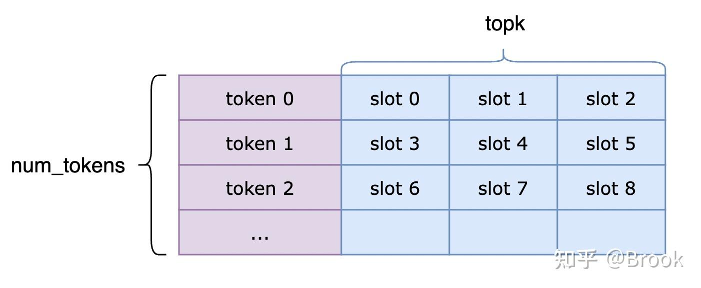

meta的过程就是统计当前rank的topk。

  

1.  计算出expert\_send\_count，expert\_send\_count\[ep\_idx\]表示自己向expert\[ep\_idx\]发送的token数
2.  填充其他rank的expert\_recv\_count，dst\_rank上的expert\_recv\_count\[src\_rank\]\[local\_ep\_idx\]表示自己要向dst\_rank的local\_ep\_idx发送多少token，然后将这个值atomic\_add到expert\_recv\_count\_sum\[local\_ep\_idx\]
3.  最后填充dst\_rank的src\_token\_topk\_idx，src\_token\_topk\_idx\[local\_ep\_idx\]\[src\_rank\]\[token\_idx\]表示dst\_rank的local\_ep\_idx中，从src\_rank（src\_rank就是当前rank），发送过来的所有token中，第token\_idx个token对应src\_rank的topk矩阵中topk\_slot\_idx。

然后看下read\_topk\_idx，后续会用这个函数对topk矩阵进行多次处理。 所有sm的dispatch warp用这个函数遍历topk矩阵，一个线程一次处理一个topk矩阵中的元素，即一个slot，所以kNumTopk个线程对应一个token，那么一个warp一次处理的token数就是32线程除以kNumTopk。

i为当前warp处理的第一个token，加上自己lane\_idx就可以得到当前线程对应的topk\_slot\_idx，即i \* kNumTopk + lane\_idx，然后将topk\_slot\_idx和这个topk\_slot\_idx对应值，即expert\_idx传给process函数。

```cuda
// kNumTokensPerWarp = 32 / kNumTopk
const auto read_topk_idx = [&](const auto& process) {
    for (uint32_t i = (sm_idx * kNumDispatchWarps + warp_idx) * kNumTokensPerWarp;
         i < num_tokens;
         i += kNumSMs * kNumDispatchWarps * kNumTokensPerWarp) {
        int expert_idx = -1;
        if (i + (lane_idx / kNumTopk) < num_tokens and lane_idx < kNumActivateLanes) {
            expert_idx = static_cast<int>(
                __ldg(input_topk_idx_buffer.get_base_ptr<int64_t>() + i * kNumTopk + lane_idx));
            if (expert_idx >= 0)
                process(i * kNumTopk + lane_idx, expert_idx);
        }
        __syncwarp();
    }
};
```

首先每个sm独立统计自己负责的token的topk，累加到smem\_expert\_count。

```cuda
// int smem[kNumExperts];
read_topk_idx([&](const uint32_t& token_topk_idx, const int& expert_idx) {
   atomicAdd_block(smem_expert_count + expert_idx, 1);
});
```

然后每个sm的num\_eps个thread将smem\_expert\_count\[tid\] atomic\_add到workspace的expert\_send\_count\[tid\]，atomic\_add的返回值记录到smem\_expert\_count\[tid\]。

```cuda
for (uint32_t i = thread_idx; i < kNumExperts; i += kNumDispatchThreads) {
    const uint64_t send_value = (1ull << 32) | static_cast<uint64_t>(smem_expert_count[i]);
    smem_expert_count[i] = static_cast<uint32_t>(
        ptx::atomic_add(workspace.get_expert_send_count_ptr(i), send_value));
}
```

此时smem\_expert\_count\[i\]存的就是当前sm对应的token序列最后写到src\_token\_topk\_idx\[local\_ep\_idx\]\[src\_rank\]中的区间位置，比如sm0写到绿色区域。另外这里send\_value的高32位中写入了1，下边会介绍原因。

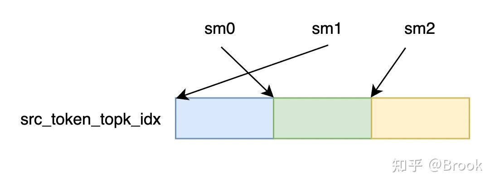

  

然后开始写入所有rank的src\_token\_topk\_idx，每个线程再次遍历自己负责的token，smem\_expert\_count已经存储了当前sm对应的起始位置，然后每个线程通过atomic\_add\_block获取自己写入位置dst\_slot\_idx，将topk\_slot\_idx写入dst\_rank的src\_token\_topk\_idx\[local\_ep\_idx\]\[src\_rank\]\[dst\_slot\_idx\]。

```cuda
read_topk_idx([&](const uint32_t& token_topk_idx, const int& expert_idx) {
    const auto dst_rank_idx = expert_idx / kNumExpertsPerRank;
    const auto dst_slot_idx = atomicAdd_block(smem_expert_count + expert_idx, 1);
    const auto dst_ptr = workspace.get_src_token_topk_idx_ptr(
        expert_idx % kNumExpertsPerRank, sym_buffer.rank_idx, dst_slot_idx);
    *sym_buffer.map(dst_ptr, dst_rank_idx) = token_topk_idx;
});
```

然后所有sm都工作完成之后，sm0开始写入其他rank的expert\_recv\_count和expert\_recv\_count\_sum，expert\_recv\_count直接写入即可，expert\_recv\_count\_sum需要atomic\_add\_sys。

```cuda
// grid sync
if (sm_idx == 0) {
    #pragma unroll
    for (uint32_t i = thread_idx; i < kNumExperts; i += kNumDispatchThreads) {
        const auto dst_rank_idx = i / kNumExpertsPerRank;
        const auto dst_local_expert_idx = i % kNumExpertsPerRank;
        const auto expert_status = *workspace.get_expert_send_count_ptr(i);
        *sym_buffer.map(
            workspace.get_expert_recv_count_ptr(sym_buffer.rank_idx, dst_local_expert_idx),
            dst_rank_idx) = expert_status & 0xffffffff;
        ptx::atomic_add_sys(
            sym_buffer.map(workspace.get_expert_recv_count_sum_ptr(dst_local_expert_idx), dst_rank_idx),
            expert_status);
    }
}
```

### 3.2 dispatch pull

做完meta之后所有卡通过nvlink\_barrier执行全局同步，然后开始dispatch pull，即根据src\_token\_topk\_idx通过TMA从其他rank读取对应的token到当前sm的smem\_send\_buffers。 smem\_send\_buffers的shape为\[kNumDispatchWarps, 1\]，slot大小为fp8\_token\_layout，即一个warp对应一个token大小的空间。

```cuda
// fp8_token_layout = layout::Data(kHidden);
const auto smem_send_buffers = layout::Buffer(
        fp8_token_layout, kNumDispatchWarps, 1,
        math::advance_ptr(smem_buffer, SMEM_EXPERT_COUNT_SIZE));
```

由于一个rank有多个local\_expert，每个local\_expert有所有rank的数据，因此这里通过scheduler进行调度，即每次从哪里获取token。为了均衡各个nvlink的带宽，会选择轮询的方式处理，轮询的逻辑如下图所示，下图表示的是如何遍历src\_token\_topk\_idx，矩形中的数字表示对src\_token\_topk\_idx中所有token的编号。 一个warp一次处理一个token，所有warp先处理完local\_ep0，再处理local\_ep1。对于一个local\_ep内部，在rank之间进行轮询，比如warp0第一次需要处理token\[0\]，那么他会按照编号的顺序进行查找，发现token\[0\]是rank0的第0个token，那么就会对这个token进行处理，同理warp1会找到rank1的第0个token，即标号1的位置。直到有一个rank的token处理完成，即蓝色区域被处理完，然后处理绿色部分，以此类推完成local\_ep0的处理，假设local\_ep0会收到100个token，那么local\_ep1会从100开始标号。

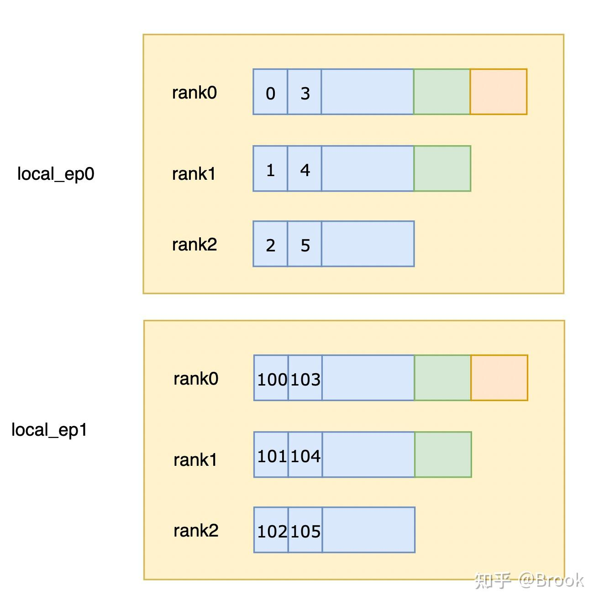

然后具体看一下，每个warp找到自己对应的smem和mbarrier，然后初始化scheduler。current\_expert\_idx表示当前在处理哪个local\_ep，expert\_start\_idx和expert\_end\_idx表示这个local\_ep的token标号范围，如图3中local\_ep0就是0-100，expert\_pool\_block\_offset当前正在处理的token对应第几个BLOCK\_M，stored\_rank\_count记录一个local\_ep中每个rank的token数。

```cuda
uint32_t pull_mbarrier_phase = 0;
const auto pull_buffer = smem_send_buffers.get_rank_buffer(warp_idx).get_data_buffer(0);
const auto pull_mbarrier = dispatch_barriers[warp_idx];
scheduler.fetch_expert_recv_count();
int current_expert_idx = -1;
uint32_t stored_rank_count[kNumRanksPerLane] = {};
uint32_t expert_start_idx = 0, expert_end_idx = 0;
uint32_t expert_pool_block_offset = 0;
CUTLASS_DEVICE explicit MegaMoEScheduler(const layout::Workspace& workspace): workspace(workspace) {
    block_idx = blockIdx.x;
}
// kNumExpertsPerLane = math::constexpr_ceil_div(kNumExpertsPerRank, 32u)
CUTLASS_DEVICE void fetch_expert_recv_count() {
    for (uint32_t i = 0; i < kNumExpertsPerLane; ++ i) {
        const auto expert_idx = i * 32 + ptx::get_lane_idx();
        uint64_t value = 0;
        if (expert_idx < kNumExpertsPerRank) {
            do {
                value = ptx::ld_volatile(workspace.get_expert_recv_count_sum_ptr(expert_idx));
            } while (static_cast<uint32_t>(value >> 32) != kNumSMs * kNumRanks);
        }
        stored_num_tokens_per_expert[i] = static_cast<uint32_t>(value);
    }
    __syncwarp();
}
```

block\_idx为cta\_id，kNumExpertsPerRank即local\_ep\_num，fetch\_expert\_recv\_count会将expert\_recv\_count\_sum分布式的存到warp中的stored\_num\_tokens\_per\_expert，即lane\[0\]存local\_ep\[0\]，local\_ep\[32\]…。这里可以看到meta的处理中为什么要对高位置1，接收端就是通过轮询高32位是否为kNumSMs \* kNumRanks判断是不是所有sm都已经完成发送。

```cuda
for (uint32_t token_idx = sm_idx * kNumDispatchWarps + warp_idx; ; token_idx += kNumGlobalWarps) {
		int old_expert_idx = current_expert_idx;
		while (token_idx >= expert_end_idx) {
		    if (++ current_expert_idx >= kNumExpertsPerRank)
		        break;
		    expert_pool_block_offset += math::ceil_div(expert_end_idx - expert_start_idx, BLOCK_M);
		    expert_start_idx = expert_end_idx;
		    expert_end_idx += scheduler.get_num_tokens(current_expert_idx);
		}
		if (current_expert_idx >= kNumExpertsPerRank)
		    break;
		if (old_expert_idx != current_expert_idx) {
		    old_expert_idx = current_expert_idx;
		    for (uint32_t i = 0; i < kNumRanksPerLane; ++ i) {
		        const uint32_t j = i * 32 + lane_idx;
		        stored_rank_count[i] = j < kNumRanks ?
		            static_cast<uint32_t>(*workspace.get_expert_recv_count_ptr(j, current_expert_idx)) : 0;
		    }
		}
		...
}
```

然后每个warp开始循环处理自己对应的token\_idx，对于一个给定的token\_idx，当前warp需要找token\_idx对应src\_token\_topk\_idx的哪个位置，首先通过token\_idx定位是哪个local\_ep，如果token\_idx大于等于当前local\_ep对应的expert\_end\_idx，那么就需要找下一个local\_ep，直到所有local\_ep完成处理。 找到对应的local\_ep之后，如果发现和上次处理的不一样，即切换了local\_ep，那么需要更新stored\_rank\_count，stored\_rank\_count和stored\_num\_tokens\_per\_expert类似，都是分布式存在一个warp的不同lane中。

```cuda
for (uint32_t token_idx = sm_idx * kNumDispatchWarps + warp_idx; ; token_idx += kNumGlobalWarps) {
	for (uint32_t i = 0; i < kNumRanksPerLane; ++ i)
	    remaining[i] = stored_rank_count[i];
	uint32_t offset = 0;
	uint32_t token_idx_in_expert = token_idx - expert_start_idx;
	uint32_t slot_idx = token_idx_in_expert;
	uint32_t token_idx_in_rank;
	while (true) {
	    uint32_t num_actives_in_lane = 0;
	    uint32_t min_in_lane = 0xffffffff;
	    for (uint32_t i = 0; i < kNumRanksPerLane; ++ i) {
	        num_actives_in_lane += remaining[i] > 0;
	        if (remaining[i] > 0)
	            min_in_lane = cute::min(min_in_lane, remaining[i]);
	    }
	    ...
	}
	...
}
```

然后开始在local\_ep中找token\_idx的位置，remaining\[i\]表示rank\[i\]中剩余的token数，token\_idx\_in\_expert都是将token\_idx转成local\_ep内部的偏移。 如图3，在一个local\_ep内部也分为多次，称为round，一个round的长度就是当前还有token的rank中的最小值，如local\_ep0中蓝色为一个round，绿色为第二个round，黄色为第三个round，所以在一个local\_ep中找位置的时候先要确定是哪个round。 所以这里首先确定当前round的长度，即找remaining的最小值，首先找当前lane维护的的rank的remain的最小值，即min\_in\_lane。

```cuda
for (uint32_t token_idx = sm_idx * kNumDispatchWarps + warp_idx; ; token_idx += kNumGlobalWarps) {
	while (true) {
      ...
	    const uint32_t num_active_ranks = __reduce_add_sync(0xffffffff, num_actives_in_lane);
	    const uint32_t length = __reduce_min_sync(0xffffffff, min_in_lane);
	    const uint32_t num_round_tokens = length * num_active_ranks;
	    if (slot_idx < num_round_tokens) {
	        const uint32_t slot_idx_in_round = slot_idx % num_active_ranks;
	        uint32_t num_seen_ranks = 0;
	        current_rank_in_expert_idx = 0;
	        for (uint32_t i = 0; i < kNumRanksPerLane; ++ i) {
	            const uint32_t mask = __ballot_sync(0xffffffff, remaining[i] > 0);
	            const uint32_t num_active_lanes = __popc(mask);
	            if (slot_idx_in_round >= num_seen_ranks and slot_idx_in_round < num_seen_ranks + num_active_lanes)
	                current_rank_in_expert_idx = i * 32 + __fns(mask, 0, slot_idx_in_round - num_seen_ranks + 1);
	            num_seen_ranks += num_active_lanes;
	        }
	        token_idx_in_rank = offset + (slot_idx / num_active_ranks);
	        break;
	    }
	
	    slot_idx -= num_round_tokens;
	    offset += length;
	    for (uint32_t i = 0; i < kNumRanksPerLane; ++ i)
	        remaining[i] -= cute::min(remaining[i], length);
	}
	...
}
```

然后通过reduce\_min获取所有rank的最小值，即length，num\_active\_ranks表示还剩余多少rank有token，按照图3中的话，第一次会找到图3中蓝色区间的长度，一共还剩3个rank，那么第一个round一共有num\_round\_tokens，即3 x length个token。

1.  如果slot\_idx小于num\_round\_tokens，说明要找的token\_idx就在这个round，位于active\_rank\[slot\_idx\_in\_round\]中，那么接下来就是从rank0开始统计，直到找到第slot\_idx\_in\_round个还有token的rank。由于remaining是分布式存储在warp中，所以先看rank0 - rank31，通过\_\_ballot\_sync获取到rank0 - rank31中还有token的rank的mask，直到找到第slot\_idx\_in\_round个active\_rank。
2.  如果slot\_idx大于num\_round\_tokens，说明不在这个round，那么需要切换到下一个round，对offset加上蓝色区间长度，表示已跳过的round的总长度，num\_round\_tokens调到下一个round，对slot\_idx减去num\_round\_tokens转换成下一个round的偏移，更新remain。

直到找到token\_idx对应的local\_ep，src\_rank和rank内部的偏移，即current\_expert\_idx，current\_rank\_in\_expert\_idx，token\_idx\_in\_rank。

```cuda
for (uint32_t token_idx = sm_idx * kNumDispatchWarps + warp_idx; ; token_idx += kNumGlobalWarps) {
    const uint32_t src_token_topk_idx = *workspace.get_src_token_topk_idx_ptr(
        current_expert_idx, current_rank_in_expert_idx, token_idx_in_rank);
    const uint32_t src_token_idx = src_token_topk_idx / kNumTopk;
    const uint32_t src_topk_idx = src_token_topk_idx % kNumTopk;

    if (cute::elect_one_sync()) {
        ptx::tma_load_1d(
            pull_buffer.get_base_ptr(),
            sym_buffer.map(input_token_buffer.get_data_buffer().get_base_ptr(),
                           current_rank_in_expert_idx),
            pull_mbarrier, kHidden);
    }
}
```

然后读取src\_token\_topk\_idx中token\_idx的位置，得到topk\_slot\_idx，即src\_token\_topk\_idx，转为src\_token\_idx和src\_topk\_idx。然后通过TMA load到pull\_buffer。

```cuda
for (uint32_t token_idx = sm_idx * kNumDispatchWarps + warp_idx; ; token_idx += kNumGlobalWarps) {
    const uint32_t pool_token_idx = expert_pool_block_offset * BLOCK_M + token_idx_in_expert;
    if (cute::elect_one_sync()) {
        // Load weights
        const auto weight = *sym_buffer.map(
            input_topk_weights_buffer.get_base_ptr<float>() + src_token_topk_idx,
            current_rank_in_expert_idx);
        *l1_topk_weights_buffer.get_data_buffer(pool_token_idx).get_base_ptr<float>() = weight;

        // Wait for TMA token load to complete
        ptx::mbarrier_arrive_and_set_tx(pull_mbarrier, kHidden);
        ptx::mbarrier_wait_and_flip_phase(pull_mbarrier, pull_mbarrier_phase);

        // Store token to local L1 buffer via TMA
        ptx::tma_store_1d(
            l1_token_buffer.get_data_buffer(pool_token_idx).get_base_ptr(),
            pull_buffer.get_base_ptr(), pull_buffer.get_num_bytes());

        // Write source metadata for combine write-back
        *workspace.get_token_src_metadata_ptr(pool_token_idx) =
            {current_rank_in_expert_idx, src_token_idx, src_topk_idx};
        cute::tma_store_arrive();
        ptx::tma_store_wait<0>();
        ptx::red_add_rel(
            workspace.get_l1_arrival_count_ptr(expert_pool_block_offset + token_idx_in_expert / BLOCK_M), 1);
    }
    __syncwarp();
}
```

pool\_token\_idx为token\_idx对应pool中第几行，load topk\_weight写入到l1\_topk\_weights\_buffer的pool\_token\_idx位置，通过tma将token写入到l1\_token\_buffer的pool\_token\_idx位置，将meta信息，即{current\_rank\_in\_expert\_idx, src\_token\_idx, src\_topk\_idx}写入到token\_src\_metadata的pool\_token\_idx位置。最后通过red\_add\_rel对l1\_arrival\_count\_ptr中对应的block的flag原子加一。

刚刚没有介绍对sf的load，在TMA load token的同时会执行对sf的load，这里load token的sf时候还要完成对sf的UTCCP转置。

```cuda
const auto remote_sf_ptr = sym_buffer.map(
    input_sf_buffer.get_data_buffer(src_token_idx).get_base_ptr<uint32_t>(),
    current_rank_in_expert_idx);
const auto local_sf_ptr = l1_sf_buffer.get_base_ptr<uint32_t>();
const auto sf_pool_token_idx = expert_pool_block_offset * SF_BLOCK_M +
    transform_sf_token_idx(token_idx_in_expert);
for (uint32_t i = 0; i < math::constexpr_ceil_div(kNumSFUint32, 32u); ++ i) {
    const uint32_t j = i * 32 + lane_idx;
    if (j < kNumSFUint32)
        local_sf_ptr[j * kNumPaddedSFPoolTokens + sf_pool_token_idx] = remote_sf_ptr[j];
}
```

remote\_sf\_ptr是该token对应的sf地址，local\_sf\_ptr是当前rank的l1\_sf\_buffer，然后当前warp会从remote\_sf\_ptr中load数据到l1\_sf\_buffer，sf\_pool\_token\_idx表示应该写入到l1\_sf\_buffer的哪一行，即转置到哪一行。由于转置发生在4x32的粒度，即128行内部，因此外部的计算都是不变的。先通过expert\_pool\_block\_offset x SF\_BLOCK\_M算出当前expert对应的sf在哪行开始。

```cuda
const auto transform_sf_token_idx = [](const uint32_t& token_idx_in_expert) {
        const uint32_t idx = token_idx_in_expert % BLOCK_M;
        return token_idx_in_expert / BLOCK_M * SF_BLOCK_M +
               (idx & ~127u) + (idx & 31u) * 4 + ((idx >> 5) & 3u);
};
```

然后看下transform\_sf\_token\_idx，token\_idx\_in\_expert是转置前的行号，token\_idx\_in\_expert / BLOCK\_M x SF\_BLOCK\_M用于找到token\_idx\_in\_expert位于哪个SF\_BLOCK，一个SF\_BLOCK虽然有256行，但只有192个行是有效的，所以idx = token\_idx\_in\_expert % BLOCK\_M，算出来转置前token\_idx\_in\_expert他的SF\_BLOCK中位于第几行，idx & ~127u表示位于哪个128 block，因为转置的粒度是在128行内，idx & 31u和((idx >> 5) & 3u算的是在转置前矩阵中，即4x32中的位置，然后按照新的stride算出在转置后矩阵中的位置，注意这里4x32的说法，是指的4x32行，将一行看做了一个元素。

最后拿上一章中的图总结一下整个过程：

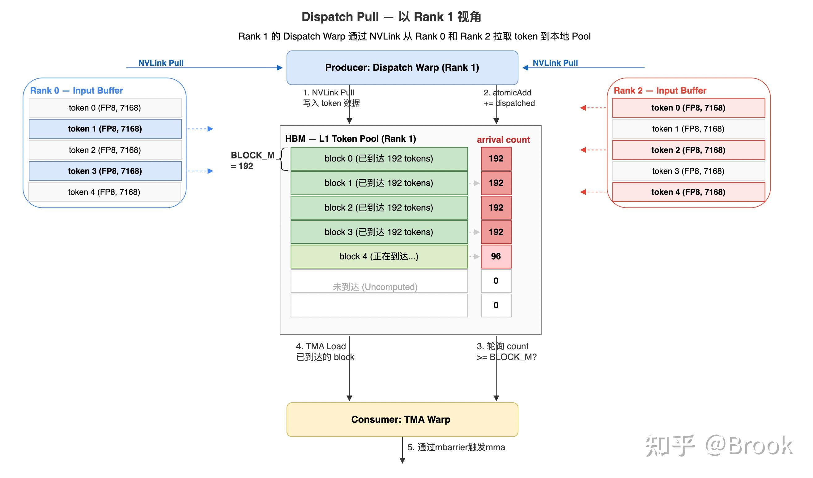

## 4. scheduler

这里先介绍一下scheduler，后续TMA，Lx和Lx epilogue都是同样的遍历顺序。

```cuda
CUTLASS_DEVICE void for_each_block(Func&& func) {
    fetch_expert_recv_count();
    set_expert_idx(0);
    ...
}
CUTLASS_DEVICE void set_expert_idx(const uint32_t& expert_idx) {
    current_local_expert_idx = expert_idx;
    current_num_tokens = get_num_tokens(expert_idx);
    current_pool_block_offset = get_pool_block_offset(expert_idx);
}
```

前面提到fetch\_expert\_recv\_count会等到其他所有rank完成meta信息，然后将expert\_recv\_count\_sum分布式存储到寄存器stored\_num\_tokens\_per\_expert中。 然后设置当前正在处理哪个local\_ep，即current\_local\_expert\_idx，初始化是0，get\_num\_tokens获取current\_local\_expert\_idx一共收到多少token，get\_pool\_block\_offset获取在pool\_block中，current\_local\_expert\_idx开始的token将会从哪个block开始存储。

```cuda
CUTLASS_DEVICE void for_each_block(Func&& func) {
        ...
        while (true) {
            CUTE_TIE_DECL(get_next_block(), block_phase, current_local_expert_idx, m_block_idx, n_block_idx);
            if (block_phase == BlockPhase::None)
                break;

            func(block_phase, current_local_expert_idx,
                 block_phase == BlockPhase::Linear2 ? kNumL2BlockKs : kNumL1BlockKs,
                 m_block_idx, n_block_idx);
        }
    }
```

然后不断循环执行get\_next\_block得到block\_phase，即当前是L1还是L2，current\_local\_expert\_idx为当前处理的是哪个local\_ep，m\_block\_idx和n\_block\_idx表示在处理D矩阵中的哪个block。

```cuda
CUTLASS_DEVICE bool fetch_next_l1_block() {
		// get_wave_expert_end_idx: math::align(current_local_expert_idx + 1, kNumExpertsPerWave);
    const auto wave_end_expert_idx = get_wave_expert_end_idx();
    while (current_local_expert_idx < wave_end_expert_idx) {
    		  // get_current_num_m_blocks: math::ceil_div(current_num_tokens, BLOCK_M);
        const auto num_m_blocks = get_current_num_m_blocks();
        m_block_idx = block_idx / kNumL1BlockNs;
        if (m_block_idx < num_m_blocks)
            return true;
        block_idx -= num_m_blocks * kNumL1BlockNs;
        advance_expert_idx();
    }
    return false;
}
```

先看下get\_next\_block依赖的fetch\_next\_l1\_block，首先通过获取current\_local\_expert\_idx获取到当前wave的最后一个local\_ep\_idx，即wave\_end\_expert\_idx，如果超过了wave\_end\_expert\_idx，那么直接返回false。 num\_m\_blocks表示M方向一共有多少block，kNumL1BlockNs为N方向的block数，通过block\_idx计算出当前sm这一轮应该处理哪个M block，即m\_block\_idx，如果超过了num\_m\_blocks，那么切换到下一个local\_ep，将block\_idx转成从下一个local\_ep开始的block计数。

```cuda
CUTLASS_DEVICE cute::tuple<BlockPhase, uint32_t, uint32_t, uint32_t> get_next_block() {
    while (true) {
        if (current_local_expert_idx >= kNumExpertsPerRank)
            break;
        if (next_phase == BlockPhase::Linear1) {
            if (fetch_next_l1_block()) {
                n_block_idx = block_idx - m_block_idx * kNumL1BlockNs;
                block_idx += kNumSMs;
                return {BlockPhase::Linear1, current_local_expert_idx, m_block_idx, n_block_idx};
            } else {
                next_phase = BlockPhase::Linear2;
                set_expert_idx(math::align<uint32_t, false>(current_local_expert_idx - 1, kNumExpertsPerWave));
            }
        } else {
            ...
        }
    }
    return {BlockPhase::None, 0, 0, 0};
}
```

最后看下get\_next\_block，如果current\_local\_expert\_idx大于kNumExpertsPerRank，说明所有local\_ep都完成了处理。next\_phase初始化为L1。 如果fetch\_next\_l1\_block返回false，说明当前phase执行完成，那么设置phase为L2，将current\_local\_expert\_idx设置为这个wave开始的local\_ep 否则fetch\_next\_l1\_block得到了m\_block\_idx，通过block\_idx可以计算得到n\_block\_idx，更新block\_idx并返回。

还是拿上一章的图总结一下这个遍历过程：

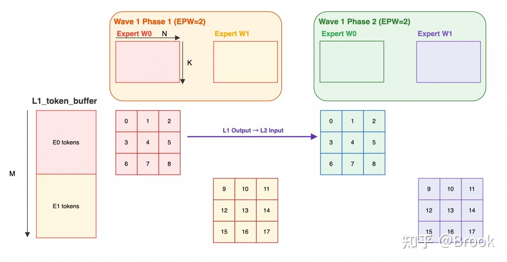

## 5. TMA warp

一共有两个TMA warp，一个对A TMA，一个对B TMA，我们以A为例。

```cuda
scheduler.for_each_block([&](const sched::BlockPhase& block_phase,
                             const uint32_t& local_expert_idx,
                             const uint32_t& num_k_blocks,
                             const uint32_t& m_block_idx, const uint32_t& n_block_idx) {
    ...
    const uint32_t pool_block_idx = scheduler.get_current_pool_block_offset() + m_block_idx;
    if (block_phase == sched::BlockPhase::Linear1) {
        const auto ptr = workspace.get_l1_arrival_count_ptr(pool_block_idx);
        const auto expected = scheduler.template get_valid_m<false>();
        while (ptx::ld_acq(ptr) != expected);
    }
}
```

首先通过scheduler获取phase，m\_block\_idx，n\_block\_idx等信息。然后根据phase是L1还是L2选择不同的TensorMap和shape。pool\_block\_idx为当前处于哪个BLOCK\_M。 如果phase为L1，get\_valid\_m得到当前选择的block在m方向实际有多少行，那么就轮询对应的l1\_arrival\_count，直到这个block中所有的token都完成了dispatch pull。

```cuda
for_each_block() {
    uint64_t cached_l2_arrival_mask = 0;
    for (uint32_t k_block_idx = 0; k_block_idx < num_k_blocks; advance_pipeline(k_block_idx)) {
        if (block_phase == sched::BlockPhase::Linear2) {
            DG_STATIC_ASSERT(BLOCK_K == BLOCK_N, "Invalid block sizes");
            const uint64_t needed = 3ull << (k_block_idx * 2);
            if ((cached_l2_arrival_mask & needed) != needed) {
                const auto ptr = workspace.get_l2_arrival_mask_ptr(pool_block_idx);
                do {
                    cached_l2_arrival_mask = ptx::ld_acq_gpu(ptr);
                } while ((cached_l2_arrival_mask & needed) != needed);
            }
        }
        empty_barriers[stage_idx]->wait(phase ^ 1);
        uint32_t m_idx = pool_block_idx * BLOCK_M;
        uint32_t k_idx = k_block_idx * BLOCK_K;
        uint32_t sfa_m_idx = pool_block_idx * SF_BLOCK_M;
        uint32_t sfa_k_idx = k_block_idx;
    }
}
```

然后开始循环当前block对应A矩阵中的K方向。

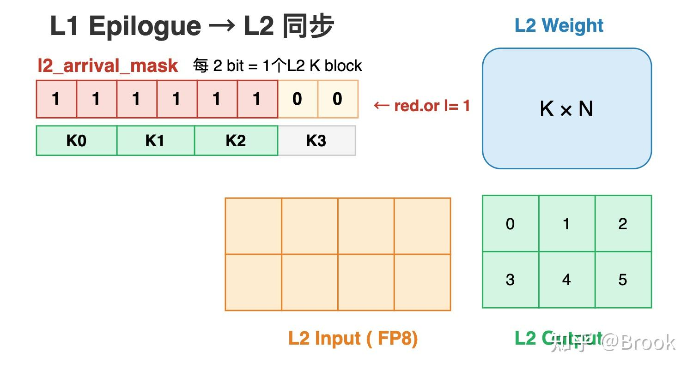

  

如果是L2，如上图所示，那么还需要等待L1 epilogue在k\_block\_idx的产出，因为L2中D矩阵（即图中L2 Output）的一个k\_block\_idx对应了L1 D矩阵（即图中L2 Input）的两个N block，因此这里需要用3ull << (k\_block\_idx \* 2)判断。

```cuda
for_each_block() {
    uint64_t cached_l2_arrival_mask = 0;
    for (uint32_t k_block_idx = 0; k_block_idx < num_k_blocks; advance_pipeline(k_block_idx)) {
        empty_barriers[stage_idx]->wait(phase ^ 1);
        uint32_t m_idx = pool_block_idx * BLOCK_M;
        uint32_t k_idx = k_block_idx * BLOCK_K;
        uint32_t sfa_m_idx = pool_block_idx * SF_BLOCK_M;
        uint32_t sfa_k_idx = k_block_idx;
        if (not is_leader_cta)
            m_idx += scheduler.template get_valid_m<true>() / 2;
        ...
    }
}
```

然后通过wait empty\_barrier等待当前stage可用，然后将block粒度的index转成行列粒度的idx，即m\_idx和k\_idx。 之前有说到创建TensorMap的时候smem\_outer\_dim为96，Mega MoE使用的是2-SM UMMA，因此一个对于BLOCK\_M=192的token方向，一个cta只需要load一半，即96，不过值得注意的是，这里的BLOCK\_M在执行UMMA的时候其实对应了B矩阵，这里先有个印象，后续具体介绍。 然后看数据的TMA，2-SM的UMMA如下图所示

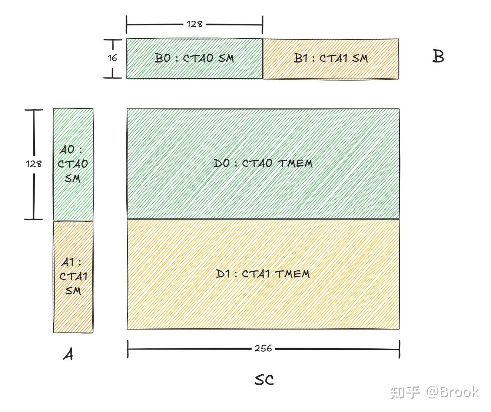

CTA0 TMA load A0和B0然后通知CTA0的full\_barrier，CTA1 TMA load A1和B1然后通知CTA0的full\_barrier，因此full\_barrier初始化arrive\_count为4，然后看下TMA的过程。

  

```cuda
for_each_block() {
    for (uint32_t k_block_idx = 0; k_block_idx < num_k_blocks; advance_pipeline(k_block_idx)) {
        if (cute::elect_one_sync()) {
            tma::copy<BLOCK_K, LOAD_BLOCK_M, kSwizzleAMode, a_dtype_t>(
                tensor_map_a_ptr, full_barriers[stage_idx], smem_a[stage_idx], k_idx, m_idx, 2);
            tma::copy<SF_BLOCK_M, 1, 0>(
                tensor_map_sfa_ptr, full_barriers[stage_idx], smem_sfa[stage_idx], sfa_m_idx, sfa_k_idx, 2);
            if (is_leader_cta) {
                full_barriers[stage_idx]->arrive_and_expect_tx(SMEM_A_SIZE_PER_STAGE * 2 + SF_BLOCK_M * sizeof(uint32_t) * 2);
            } else {
                full_barriers[stage_idx]->arrive(0u);
            }
        }
        __syncwarp();
    }
}
```

leader CTA除了arrive之外还需要设置tx count为总的数据量，即图7中的A0，A1，B0，B1。

```cuda
template <uint32_t BLOCK_INNER, uint32_t BLOCK_OUTER,
          uint32_t kSwizzleMode,
          typename dtype_t, bool kIs3DTMA = false>
CUTLASS_DEVICE void
copy(void const* desc_ptr, cutlass::arch::ClusterTransactionBarrier* barrier_ptr,
     dtype_t* smem_ptr, const uint32_t& inner_idx, const uint32_t& outer_idx,
     const uint32_t& num_tma_multicast = 1, const uint32_t& batch_idx = 0) {
    constexpr uint32_t BLOCK_INNER_ATOM = get_inner_block_atom_size<BLOCK_INNER, kSwizzleMode, dtype_t>();

    if constexpr (not kIs3DTMA) {
        } else {
                // 2-CTA function will send signals to the leader CTA only
                #pragma unroll
                for (uint32_t i = 0; i < BLOCK_INNER / BLOCK_INNER_ATOM; ++ i) {
                    cute::SM100_TMA_2SM_LOAD_2D::copy(desc_ptr, reinterpret_cast<uint64_t*>(barrier_ptr),
                                                      static_cast<uint64_t>(cute::TMA::CacheHintSm100::EVICT_NORMAL),
                                                      smem_ptr + i * BLOCK_OUTER * BLOCK_INNER_ATOM,
                                                      inner_idx + i * BLOCK_INNER_ATOM, outer_idx);
                }
        }
    }
```

copy的时候设置了num\_tma\_multicast=2，因此会执行SM100\_TMA\_2SM\_LOAD\_2D，这里其实没有对数据做multicast，只是multicast了arrive信号。

```cuda
// constexpr uint32_t Sm100MmaPeerBitMask = 0xFEFFFFFF;
struct SM100_TMA_2SM_LOAD_2D
{
  CUTE_HOST_DEVICE static void
  copy([[maybe_unused]] void const* desc_ptr, [[maybe_unused]] uint64_t* mbar_ptr, [[maybe_unused]] uint64_t cache_hint,
       [[maybe_unused]] void      * smem_ptr,
       [[maybe_unused]] int32_t const& crd0, int32_t const& crd1)
  {
    uint64_t gmem_int_desc = reinterpret_cast<uint64_t>(desc_ptr);
    // Executed by both CTAs. Set peer bit to 0 so that the
    // transaction bytes will update CTA0's barrier.
    uint32_t smem_int_mbar = cast_smem_ptr_to_uint(mbar_ptr) & Sm100MmaPeerBitMask;
    uint32_t smem_int_ptr  = cast_smem_ptr_to_uint(smem_ptr);
    asm volatile (
      "cp.async.bulk.tensor.2d.cta_group::2.shared::cluster.global.mbarrier::complete_tx::bytes.L2::cache_hint"
      " [%0], [%1, {%3, %4}], [%2], %5;"
      :
      : "r"(smem_int_ptr), "l"(gmem_int_desc), "r"(smem_int_mbar),
        "r"(crd0), "r"(crd1), "l"(cache_hint)
      : "memory");
  }
};
```

之前在介绍Blackwell架构的时候介绍过这里，因为指定了cta\_group::2，所以就会根据mbar的地址，将mbarrier的信号广播到ctaMask指定的dst CTA所在的CTA pairs中对应的奇偶CTA，因为没开启multicast，所以dst CTA就是自己，所以CTA pairs就是自己和peer CTA，这里就会根据mbar位于哪里决定将mbar信号发送给哪里，mbar\_ptr会对Sm100MmaPeerBitMask做与运算，将第24位设置为0，因此mbar被指定为leader CTA的mbar，因此所有mbar信号都会传播到leader CTA。

```cuda
CUTLASS_HOST_DEVICE
  static void arrive(ValueType const* smem_ptr, uint32_t cta_id, uint32_t pred) {
#if CUDA_BARRIER_ENABLED
    uint32_t smem_addr = cute::cast_smem_ptr_to_uint(smem_ptr);
    if (pred) {
      asm volatile(
          "{\n\t"
          ".reg .b32 remAddr32;\n\t"
          "mapa.shared::cluster.u32  remAddr32, %0, %1;\n\t"
          "mbarrier.arrive.shared::cluster.b64  _, [remAddr32];\n\t"
          "}"
          :
          : "r"(smem_addr), "r"(cta_id));
    }

    cutlass::arch::synclog_emit_cluster_barrier_arrive_cluster(__LINE__, smem_addr, cta_id, pred);
#elif defined(__CUDA_ARCH__)
    asm volatile ("brkpt;\n" ::);
#endif
  }
```

TMA之后的arrive也是类似的，leader CTA arrive自己的mbar，非leader CTA执行arrive(0)，表示arrive cluster\_rank0的CTA的mbar，不过这里用的是标准的mapa实现。

## 6. UMMA warp

首先看下UMMA相关的参数。

```cuda
constexpr uint32_t LAYOUT_AD_M = 128;
constexpr uint32_t UMMA_M = LAYOUT_AD_M * 2;
constexpr uint32_t UMMA_N = BLOCK_M;  // Swap AB
constexpr uint32_t UMMA_K = 32;

constexpr uint32_t kNumEpilogueStages = 2;
constexpr uint32_t kNumAccumTmemCols = UMMA_N * kNumEpilogueStages;
constexpr uint32_t kNumSFATmemCols = SF_BLOCK_M / 32;
constexpr uint32_t kNumSFBTmemCols = SF_BLOCK_N / 32;
constexpr uint32_t kNumTmemCols = utils::get_num_aligned_tmem_cols<kNumAccumTmemCols + kNumSFATmemCols + kNumSFBTmemCols>();
if (warp_idx == 3) {
    // Allocate tensor memory
    Allocator().allocate(kNumTmemCols, tmem_ptr_in_smem);
}
```

2-SM UMMA用的是m256n192k32的shape。然后看下TMEM，TMEM用于存储D，sfa和sfb，一个D占用N列，即192列，分配了2块空间用于存储D。由上可知SF\_BLOCK\_M为256，SF\_BLOCK\_N为128，然后除以32 lane得到需要多少col。三个区域加起来就是总的TMEM用量，通过tcgen05.alloc.cta\_group::2分配TMEM。

```cuda
if (is_leader_cta) {
    // Make instruction descriptor with block scaling
    // NOTES: always swap A/B
    auto instr_desc = cute::UMMA::make_instr_desc_block_scaled<
        b_dtype_t, a_dtype_t, float, cutlass::float_ue8m0_t,
        UMMA_M, UMMA_N,
        cute::UMMA::Major::K, cute::UMMA::Major::K
    >();
    auto sf_desc = mma::sm100::make_sf_desc(nullptr);
    auto a_desc = mma::sm100::make_umma_desc<cute::UMMA::Major::K, LOAD_BLOCK_M, BLOCK_K, kSwizzleAMode>(smem_a[0], 0, 0);
    auto b_desc = mma::sm100::make_umma_desc<cute::UMMA::Major::K, LOAD_BLOCK_N, BLOCK_K, kSwizzleBMode>(smem_b[0], 0, 0);
```

由于为2-SM UMMA，如图7所示，只有leader CTA会执行umma指令。 创建instr\_desc指定各种元信息，比如ab的type等，可以看到交换了A和B，也就是说weight为A矩阵，token为B矩阵，猜测可能是为了方便调整BLOCK\_M，因为2-SM场景的UMMA\_M只能是128或者256，但是UMMA\_N的调整范围较大。另外在block scaling场景不需要配置Dtype，猜测可能只支持输出为f32。

```cuda
CUTLASS_DEVICE
cute::UMMA::SmemDescriptor make_sf_desc(void* smem_ptr) {
    // NOTES: the UTCCP layout is K-major by default
    // Atom size: 8 x 128 bits
    // {SBO, LBO} means the byte stride between atoms on {MN, K}
    // Since the UTCCP we used is 128b-wide (only 1 atom on K), so LBO can be zero
    return make_smem_desc(cute::UMMA::LayoutType::SWIZZLE_NONE, smem_ptr, 8 * 16, 0);
}
```

然后创建sf的smem desc，没有使用swizzle，由于K方向只有16B，所以K方向只有一个atom，LBO设置为0，SBO为8x16B。 然后通过make\_umma\_desc创建smem\_a和smem\_b的初始desc。

```cuda
uint32_t current_iter_idx = 0;
scheduler.for_each_block() {
		mma::sm100::update_instr_desc_with_umma_n(instr_desc, scheduler.template get_valid_m<true>());
	  const auto accum_stage_idx = current_iter_idx % kNumEpilogueStages;
	  const auto accum_phase = (current_iter_idx ++ / kNumEpilogueStages) & 1;
	  tmem_empty_barriers[accum_stage_idx]->wait(accum_phase ^ 1);
	  ptx::tcgen05_after_thread_sync();
	  for (uint32_t k_block_idx = 0; k_block_idx < num_k_blocks; advance_pipeline(k_block_idx)) {
        full_barriers[stage_idx]->wait(phase);
        ptx::tcgen05_after_thread_sync();
        const auto a_desc_base_lo = ptx::exchange(a_desc_lo, stage_idx);
        const auto b_desc_base_lo = ptx::exchange(b_desc_lo, stage_idx);
        if (cute::elect_one_sync()) {
            // UTCCP copy SFA and SFB to TMEM
            using cute_utccp_t = cute::SM100_UTCCP_4x32dp128bit_2cta;
            for (uint32_t i = 0; i < SF_BLOCK_M / kNumUTCCPAlignedElems; ++ i) {
                auto smem_ptr = smem_sfa[stage_idx] + i * kNumUTCCPAlignedElems;
                mma::sm100::replace_smem_desc_addr(sf_desc, smem_ptr);
                cute_utccp_t::copy(sf_desc, kTmemStartColOfSFA + i * 4);
            }
            ...
}
```

通过for\_each\_block遍历所有D的block，首先通过wait tmem\_barrier等待当前stage的TMEM可用，然后使用tcgen05\_after\_thread\_sync建立barrier和之后的tcgen05的order。 对于一个D block的每个K方向的block，同样wait full\_barrier等待TMA完成，同样使用tcgen05\_after\_thread\_sync建立barrier和之后的tcgen05的order。 然后开始使用SM100\_UTCCP\_4x32dp128bit\_2cta拷贝sf，以sfa为例，一次拷贝128个int32，循环直到拷贝完成SF\_BLOCK\_M。

```cuda
// 4x32 data path lanes (broadcast), 128-bit pattern, 2cta mode
struct SM100_UTCCP_4x32dp128bit_2cta {
  using SRegisters = uint64_t[1];
  using DRegisters = uint32_t[1];

  CUTE_HOST_DEVICE static void
  copy(uint64_t const& src_addr, uint32_t const& dst_addr) {
    asm volatile ("tcgen05.cp.cta_group::2.32x128b.warpx4 [%0], %1;"
    :
    : "r"(dst_addr)  "l"(src_addr));
  }
};
```

32x128b拷贝完成之后会在32lane中得到如下存储。由于sf需要被复制到所有的32lane，因此使用warpx4广播到当前sm的所有32lane。由于为2-SM UMMA，因此需要cta\_group::2广播到peer CTA的TMEM。

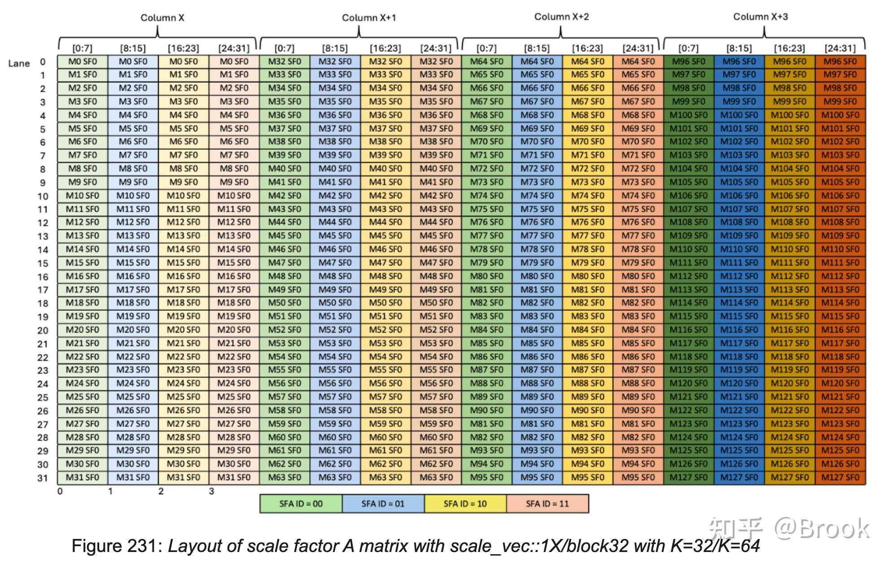

```cuda
scheduler.for_each_block() {
  	for (uint32_t k_block_idx = 0; k_block_idx < num_k_blocks; advance_pipeline(k_block_idx)) {
        if (cute::elect_one_sync()) {
            for (uint32_t k = 0; k < BLOCK_K / UMMA_K; ++ k) {
               const auto runtime_instr_desc =
                   mma::sm100::make_runtime_instr_desc_with_sf_id(instr_desc, k, k);
               a_desc.lo = mma::sm100::advance_umma_desc_lo<
                   cute::UMMA::Major::K, LOAD_BLOCK_M, kSwizzleAMode, a_dtype_t>(a_desc_base_lo, 0, k * UMMA_K);
               b_desc.lo = mma::sm100::advance_umma_desc_lo<
                   cute::UMMA::Major::K, LOAD_BLOCK_N, kSwizzleBMode, b_dtype_t>(b_desc_base_lo, 0, k * UMMA_K);
               ptx::SM100_MMA_MXF8F6F4_2x1SM_SS::fma(
                   b_desc, a_desc, accum_stage_idx * UMMA_N,
                   k_block_idx > 0 or k > 0, runtime_instr_desc,
                   kTmemStartColOfSFB, kTmemStartColOfSFA);
            }
        }
            
}
```

通过当前K block更新instr\_desc，a\_desc和b\_desc，然后开始执行mma指令，由于tcgen05.cp和tcgen05.mma为pipeline，因此不需要同步即可下发mma，mma指令如下所示：

```cuda
fma(uint64_t const& desc_a,
        uint64_t const& desc_b,
        uint32_t const& tmem_c,
        uint32_t const& scale_c,
        uint64_t const& desc,
        uint32_t const& tmem_sfa,
        uint32_t const& tmem_sfb) {
        asm volatile(
          "{\n\t"
          ".reg .pred p;\n\t"
          "setp.ne.b32 p, %4, 0;\n\t"
          "tcgen05.mma.cta_group::2.kind::mxf8f6f4.block_scale [%0], %1, %2, %3, [%5], [%6], p; \n\t"
          "}\n"
          :
          : "r"(tmem_c), "l"(desc_a), "l"(desc_b), "r"(static_cast<uint32_t>(desc >> 32)), "r"(scale_c),
            "r"(tmem_sfa), "r"(tmem_sfb));
    }
```

umma\_arrive\_multicast\_2x1SM封装了tcgen05.commit，cta\_group::2用于trace之前的cta\_group::2异步指令，关联到mbarrier，当之前的异步指令完成后，会触发一个arrive one的操作，multicast表示会广播到cluster中cta\_mask对应的CTA。 下发mma指令之后，通过empty\_barrier\_arrive trace mma的完成，每个K block都要关联到empty\_barrier，这样当mma完成之后，这个stage的smem可以被TMA使用，当所有K完成之后，这个block就完成了，此时还需要关联到tmem\_full\_barriers，这样eplogue可以trace mma的完成。

```cuda
CUTLASS_HOST_DEVICE
void umma_arrive_multicast_2x1SM(uint64_t const* smem_ptr, uint16_t cta_mask) {
  uint32_t bar_intptr = cute::cast_smem_ptr_to_uint(smem_ptr);
  if (cute::elect_one_sync()) {
    asm volatile(
      "{\n\t"
      "tcgen05.commit.cta_group::2.mbarrier::arrive::one.shared::cluster.multicast::cluster.b64 [%0], %1; \n\t"
      "}"
      :
      :"r"(bar_intptr), "h"(cta_mask));
  }
}
auto empty_barrier_arrive = [&](const bool& do_tmem_full_arrive) {
    auto umma_arrive = [](const uint64_t* barrier) {
        constexpr uint16_t kCTAMask = (1 << 2) - 1;
        cutlass::arch::umma_arrive_multicast_2x1SM(barrier, kCTAMask);
    };
    umma_arrive(reinterpret_cast<uint64_t*>(empty_barriers[stage_idx]));

    // NOTES: the tensor memory accumulator pipeline has nothing to do with multicasting
    if (do_tmem_full_arrive)
        umma_arrive(reinterpret_cast<uint64_t*>(tmem_full_barriers[accum_stage_idx]));
    __syncwarp();
};
scheduler.for_each_block() {
  	for (uint32_t k_block_idx = 0; k_block_idx < num_k_blocks; advance_pipeline(k_block_idx)) {
     		// do mma
     		empty_barrier_arrive(k_block_idx == num_k_blocks - 1);
     }
}
```

## 7. epilogue warp

然后看下epilogue的过程，epilogue warp有8个，即2个warpgroup，UMMA的输出shape为256x192，因为swap A/B，其中192是token矩阵，即BLOCK\_M，256是weight矩阵，即BLOCK\_N。

```cuda
// kNumEpilogueWarpgroups = 2
// STORE_BLOCK_M = 32
constexpr uint32_t WG_BLOCK_M = BLOCK_M / kNumEpilogueWarpgroups;
constexpr uint32_t ATOM_M = 8;
constexpr uint32_t kNumBankGroupBytes = 16u;
constexpr uint32_t kNumAtomsPerStore = STORE_BLOCK_M / ATOM_M;
uint32_t current_iter_idx = 0;
scheduler.for_each_block([&](...) {
    tmem_full_barriers[accum_stage_idx]->wait(accum_phase);
    ptx::tcgen05_after_thread_sync();
    const uint32_t valid_m = ptx::exchange(scheduler.template get_valid_m<false>(), 0);
    const uint32_t pool_block_idx = scheduler.get_current_pool_block_offset() + m_block_idx;
    uint32_t m_idx = pool_block_idx * BLOCK_M;
    uint32_t n_idx = n_block_idx * BLOCK_N;
}
```

首先通过wait tmem\_full\_barrier等待mma的完成，然后获取valid\_m，即TMEM中有效的col，pool\_block\_idx为当前TMEM中对应的是全局哪个block，然后转成m\_idx和n\_idx。

### 7.1 L1 epilogue

```cuda
uint32_t kNumTMAStoreStages = 2;
uint32_t L1_OUT_BLOCK_N = BLOCK_N / 2;  // 128 / 2 = 64
constexpr uint32_t SMEM_CD_L1_SIZE =
    kNumEpilogueWarpgroups * STORE_BLOCK_M * L1_OUT_BLOCK_N * sizeof(cutlass::float_e4m3_t) * kNumTMAStoreStages;
```

SMEM\_CD\_L1用于存储swiglu的结果。因为L1的输出中按照8对up和gate做了interleave，所以做完swiglu之后在N方向维度成为一半，即64，stage为2。

```cuda
scheduler.for_each_block([&](...) {
  if (block_phase == sched::BlockPhase::Linear1) {
	  for (uint32_t s = 0; s < WG_BLOCK_M / STORE_BLOCK_M; ++ s) {
        float2 swiglu_values[kNumAtomsPerStore * 2];
        float2 amax_values[kNumAtomsPerStore];
        for (uint32_t i = 0; i < kNumAtomsPerStore; ++ i) {
            const uint32_t j = s * kNumAtomsPerStore + i;
                                    uint32_t tmem_addr = accum_stage_idx * UMMA_N + epilogue_wg_idx * WG_BLOCK_M + j * ATOM_M;
            uint32_t values[ATOM_M];
            cute::SM100_TMEM_LOAD_16dp256b1x::copy(tmem_addr,
                                                   values[0], values[1], values[2], values[3]);
            cute::SM100_TMEM_LOAD_16dp256b1x::copy(tmem_addr | 0x00100000,
                                                   values[4], values[5], values[6], values[7]);
            cutlass::arch::fence_view_async_tmem_load();
	  }
}
```

L1 epilogue做的流程为swiglu，fp8 cast和TMA写回。所以首先需要将结果从TMEM中load出来，即tcgen05.cp。这里有两重循环，一个warpgroup对应WG\_BLOCK\_M列，最外层循环每次执行STORE\_BLOCK\_M列，内层每次执行一个ATOM，一个ATOM就是一次tcgen05.cp对应多少列。

```cuda
copy(uint32_t const& src_addr, uint32_t& dst0, uint32_t& dst1, uint32_t& dst2, uint32_t& dst3) {
    asm volatile ("tcgen05.ld.sync.aligned.16x256b.x1.b32"
                    "{%0, %1, %2, %3},"
                    "[%4];\n"
    :  "=r"(dst0), "=r"(dst1), "=r"(dst2), "=r"(dst3)
    :  "r"(src_addr));
  }
```

SM100\_TMEM\_LOAD\_16dp256b1x用了最宽的指令16x256b，一个warp有32 lane，因此需要执行两次，第一次ld前16 lane，第二次将tmem\_addr | 0x00100000得到后16 lane，256b为8列，对应一个ATOM\_M。ld后通过tcgen05.wait保证完成，完成后线程间存储，如下图所示r\[0 - 3\]对应代码中的value\[0 - 3\]，value\[4 - 7\]为第二次ld，对于warp0来说即lane\[16 - 31\]，后续称上半16行为tmem\_up，下半16行为tmem\_down。

由于lane方向为weight的N方向，所以lane\[0 - 7\]为gate，lane\[8 - 15\]为up，以此类推，因此接下来就是将图中r0和r2对应做swiglu，r1和r3对应做swiglu，以此类推。

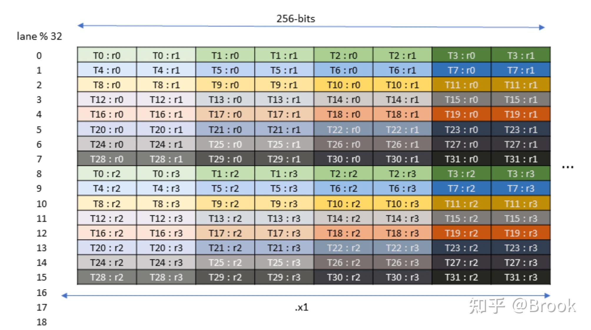

```cuda
scheduler.for_each_block([&](...) {
  if (block_phase == sched::BlockPhase::Linear1) {
	  for (uint32_t s = 0; s < WG_BLOCK_M / STORE_BLOCK_M; ++ s) {
        for (uint32_t i = 0; i < kNumAtomsPerStore; ++ i) {
            for (uint32_t k = 0; k < 2; ++ k) {
                auto bf16_gate = __float22bfloat162_rn(make_float2(fp32_values[k * 4], fp32_values[k * 4 + 1]));
                auto bf16_up = __float22bfloat162_rn(make_float2(fp32_values[k * 4 + 2], fp32_values[k * 4 + 3]));
                auto gate = __bfloat1622float2(bf16_gate);
                auto neg_gate_exp = make_float2(
                    kFastMath ? __expf(-gate.x) : expf(-gate.x),
                    kFastMath ? __expf(-gate.y) : expf(-gate.y));
                const auto denom = __fadd2_rn({1.0f, 1.0f}, neg_gate_exp);
                if constexpr (kFastMath) {
                    gate = __fmul2_rn(gate, {math::fast_rcp(denom.x), math::fast_rcp(denom.y)});
                } else {
                    gate = {gate.x / denom.x, gate.y / denom.y};
                }
                const auto up = __bfloat1622float2(bf16_up);
                swiglu_values[i * 2 + k] = __fmul2_rn(__fmul2_rn(gate, up), weights);
            }
	  }
}
```

最内层循环为遍历tmem\_up和tmem\_down，对于tmem\_up，将gate对应的两个值打包为float2，同理对up，对应计算swiglu得到float2类型的swiglu\_values。以warp0的第一个ATOM为例，swiglu\_values\[0\]对应tmem\_up的输出，swiglu\_values\[1\]对应tmem\_down的输出。 注意计算完swiglu\_values之后tmem\_up由16行变成了8行，同理tmem\_down。

```cuda
scheduler.for_each_block([&](...) {
  if (block_phase == sched::BlockPhase::Linear1) {
	  for (uint32_t s = 0; s < WG_BLOCK_M / STORE_BLOCK_M; ++ s) {
        for (uint32_t i = 0; i < kNumAtomsPerStore; ++ i) {
            for (uint32_t k = 0; k < 2; ++ k) {
                // compute swiglu_values
            }
            amax_values[i].x = math::warp_reduce<4, true>(
                cute::max(cute::abs(swiglu_values[i * 2 + 0].x), cute::abs(swiglu_values[i * 2 + 1].x)),
                math::ReduceMax<float>());
            amax_values[i].y = math::warp_reduce<4, true>(
                cute::max(cute::abs(swiglu_values[i * 2 + 0].y), cute::abs(swiglu_values[i * 2 + 1].y)),
                math::ReduceMax<float>());
            if (lane_idx < 4)
                smem_amax_reduction[epilogue_warp_idx * (STORE_BLOCK_M / 2) + i * (ATOM_M / 2) + lane_idx] = amax_values[i];
            __syncwarp();
	  }
}
```

然后开始找量化为fp8的max值。math::warp\_reduce<4, true>通过\_\_shfl\_xor\_sync计算max，由于是per\_token量化，因此就是图9的col方向，warp内的线程要计算出自己所在列的max。

```cuda
template <uint32_t kNumLanesPerGroup, bool kIntergroupReduce, typename T, typename Op>
CUTLASS_DEVICE T warp_reduce(T value, Op op) {
    constexpr uint32_t mask = 0xffffffff;
    if constexpr (kIntergroupReduce) {
        if constexpr (kNumLanesPerGroup <=  4) value = op(value, __shfl_xor_sync(mask, value,  4));
        if constexpr (kNumLanesPerGroup <=  8) value = op(value, __shfl_xor_sync(mask, value,  8));
        if constexpr (kNumLanesPerGroup <= 16) value = op(value, __shfl_xor_sync(mask, value, 16));
    }
    return value;
}
```

以tid0的第一次warp\_reduce为例看，输入的是max(swiglu\_values\[0\].x, swiglu\_values\[1\].x)，对应col0 tid0的两个值，然后开始执行shfl\_xor\_sync，第一次shfl得到max(T0, T4)，第二次得到max(0, 4, 8, 12)，最后一次得到max(0, 4, 8, 12, 16, 20, 24, 28)，正好得到col0的16个值中的最大值。如图10所示，不过这个含义和图9已经不同，图9表示mma输出，图10现在表示的是mma结果再执行swiglu的输出，图中展示的是一个atom中一个warp的结果，lane\[0 - 7\]为tmem\_up，lane\[8 - 15\]为tmem\_down。


此时一个warp中的每个lane都得到所在列16个数的max值，由lane0-3写回smem。一个warp在一个atom中产生8个max值，对应4个float2，相邻的col组成一个float2，所以个数为即ATOM\_M / 2。

  

然后同步一下warpgroup，由于刚刚只算了一列中16个数的max，量化是按照32个数算的，因此相邻warp还要再求一次max。

```cuda
scheduler.for_each_block([&](...) {
  if (block_phase == sched::BlockPhase::Linear1) {
	  for (uint32_t s = 0; s < WG_BLOCK_M / STORE_BLOCK_M; ++ s) {
        ptx::sync_aligned(128, kEpilogueWGBarrierStartIdx + epilogue_wg_idx);
        for (uint32_t i = 0; i < kNumAtomsPerStore; ++ i) {
		        // Reduce amax
		        const float2 wp_amax =
		            smem_amax_reduction[(epilogue_warp_idx ^ 1) * (STORE_BLOCK_M / 2) + i * (ATOM_M / 2) + lane_idx % 4];
		        amax_values[i].x = cute::max(amax_values[i].x, wp_amax.x);
		        amax_values[i].y = cute::max(amax_values[i].y, wp_amax.y);
		        float2 sf, sf_inv;
		        math::get_e4m3_sf_and_sf_inv(amax_values[i], sf, sf_inv);
		        const float2 upper = __fmul2_rn(swiglu_values[i * 2 + 0], sf_inv);
		        const float2 lower = __fmul2_rn(swiglu_values[i * 2 + 1], sf_inv);
		        const auto fp8x4_values = __nv_fp8x4_e4m3(make_float4(upper.x, upper.y, lower.x, lower.y));
		    }
	  }
}
```

首先同步一下整个warp group，然后读取相邻warp的max，得到32个值对应的max，然后将fp32转成fp8存入到fp8x4\_values，分别对应图中的r\[0 - 3\]。

```cuda
scheduler.for_each_block([&](...) {
  if (block_phase == sched::BlockPhase::Linear1) {
	  for (uint32_t s = 0; s < WG_BLOCK_M / STORE_BLOCK_M; ++ s) {
        ptx::sync_aligned(128, kEpilogueWGBarrierStartIdx + epilogue_wg_idx);
        for (uint32_t i = 0; i < kNumAtomsPerStore; ++ i) {
		        ...
		        // STSM
            uint32_t row = lane_idx;
            uint32_t col = warp_idx_in_wg;
            const auto smem_ptr = smem_cd[tma_stage_idx] + epilogue_wg_idx * STORE_BLOCK_M * L1_OUT_BLOCK_N
                                                         + i * ATOM_M * L1_OUT_BLOCK_N
                                                         + row * L1_OUT_BLOCK_N
                                                         + (col ^ (row / 2)) * kNumBankGroupBytes;
            ptx::SM100_U8x4_STSM_T<__nv_fp8x4_e4m3>::copy(fp8x4_values, smem_ptr);
		    }
	  }
}
```

完成一个atom的sacle之后开始通过SM100\_U8x4\_STSM\_T将他写回到smem\_cd，一个atom中一个warp中线程持有的数据对应图10。stmatrix使用了.x1，因此只有前8个线程提供SMEM地址。

```cuda
template <typename dtype_t>
struct SM100_U8x4_STSM_T {
    __device__ __forceinline__ static void
    copy(dtype_t src_0, void* smem_dst) {
        DG_STATIC_ASSERT(sizeof(dtype_t) == sizeof(uint32_t), "Invalid dtype");
        const uint32_t src = *reinterpret_cast<uint32_t*>(&src_0);
        asm volatile("stmatrix.sync.aligned.m16n8.x1.trans.shared.b8 [%0], {%1};\n"
                     :: "l"(__cvta_generic_to_shared(smem_dst)), "r"(src));
    }
};
```

然后看下对smem\_ptr的计算，这个逻辑和DeepGEMM的epilogue有点像。 一个warpgroup负责STORE\_BLOCK\_M x L1\_OUT\_BLOCK\_N大小，因此通过epilogue\_wg\_idx找到当前warpgroup的起始位置。 然后再找当前warpgroup对应的ATOM，一个ATOM为ATOM\_M x L1\_OUT\_BLOCK\_N，所以乘i找到当前的ATOM。 因为要转置，图10中一个col在SMEM中对应一行，所以一个线程提供SMEM中一个连续的16B地址，即SMEM中一行，因此lane\_idx x L1\_OUT\_BLOCK\_N找到自己的行，第一个warp对应图10中前16行，转置后对应SMEM中一个16B，因此warp\_idx就是第几列，smem\_cd用了swizzle\_64B，因此通过(col ^ (row / 2))找到swizzle后的列写入。

然后开始写sf，这个过程和dispatch的过程很像，这里不再赘述。

```cuda
scheduler.for_each_block([&](...) {
  if (block_phase == sched::BlockPhase::Linear1) {
	  for (uint32_t s = 0; s < WG_BLOCK_M / STORE_BLOCK_M; ++ s) {
        ptx::sync_aligned(128, kEpilogueWGBarrierStartIdx + epilogue_wg_idx);
		    if (warp_idx_in_wg == 0 and cute::elect_one_sync()) {
            uint32_t out_n_idx = n_block_idx * L1_OUT_BLOCK_N;
            cute::tma_store_fence();
            cute::SM90_TMA_STORE_2D::copy(
                &tensor_map_l1_output,
                smem_cd[tma_stage_idx] + epilogue_wg_idx * STORE_BLOCK_M * L1_OUT_BLOCK_N,
                out_n_idx,
                m_idx + epilogue_wg_idx * WG_BLOCK_M + s * STORE_BLOCK_M);
            cute::tma_store_arrive();
        }
	  }
	  ptx::tma_store_wait<0>();
    ptx::sync_aligned(kNumEpilogueThreads, kEpilogueFullBarrierIdx);
    if (epilogue_warp_idx == 0 and cute::elect_one_sync()) {
        DG_STATIC_ASSERT(L2_SHAPE_K <= 64 * L1_OUT_BLOCK_N, "L2 shape K is too large");
        ptx::red_or_rel_gpu(
            workspace.get_l2_arrival_mask_ptr(pool_block_idx),
            1ull << n_block_idx
        );
    }
}
```

完成一个STORE\_BLOCK\_M之后通过TMA将结果写入到l2\_acts，最后完成一个block之后，通过red\_or\_rel\_gpu设置l2\_arrival\_mask通知L2的TMA。

### 7.2 L2 epilogue

L2 epilogue对TMEM的ld和L1 epilogue一致，不再赘述。

然后看下如何将寄存器的值写回SMEM，依然是这张图，但是现在表示的是warp0 ld完成TMEM之后并且在寄存器内部转成bf16的结果。


```cuda
template <typename dtype_t>
struct SM90_U32x4_STSM_T {
    CUTLASS_DEVICE static void
    copy(dtype_t src_0, dtype_t src_1, dtype_t src_2, dtype_t src_3, void* smem_dst) {
        DG_STATIC_ASSERT(sizeof(dtype_t) == sizeof(uint32_t), "Invalid dtype");
        const uint32_t src[4] = {*reinterpret_cast<uint32_t*>(&src_0), *reinterpret_cast<uint32_t*>(&src_1),
                                 *reinterpret_cast<uint32_t*>(&src_2), *reinterpret_cast<uint32_t*>(&src_3)};
        asm volatile("stmatrix.sync.aligned.x4.m8n8.shared.b16.trans [%0], {%1, %2, %3, %4};\n"
                     :: "l"(__cvta_generic_to_shared(smem_dst)),
                        "r"(src[0]), "r"(src[1]), "r"(src[2]), "r"(src[3]));
    }
};
```

然后看下图12，展示的是ldmatrix.x4不带trans的过程，从上到下分别对应了4个8x8的小矩阵，假设叫M0-M3，stmatrix为图中逆操作，M0中T0对应了图11中的T0:r0和T0:r1，那么可以发现图11中lane0 - 7就对应了M0，带上转置写SMEM就可以得到原始\[token, hidden\]形状的结果，如col0的lane0 - 7写入图12的M0的第一行。

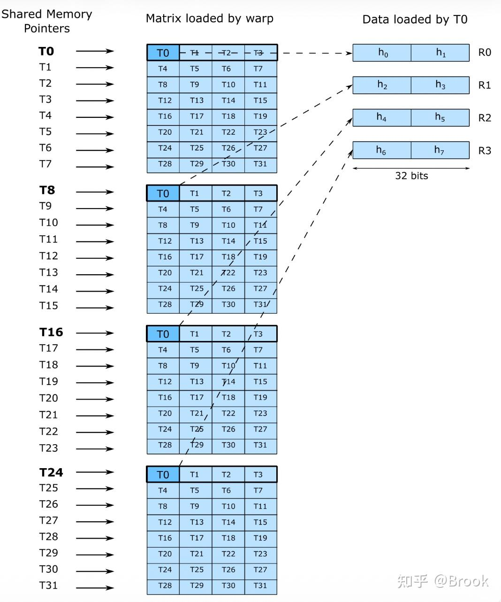

```cuda
scheduler.for_each_block([&](...) {
  if (block_phase == sched::BlockPhase::Linear2) {
		for (uint32_t s = 0; s < WG_BLOCK_M / STORE_BLOCK_M; ++ s) {
        for (uint32_t i = 0; i < STORE_BLOCK_M / ATOM_M; ++ i) {
            // do tcgen05.cp
            uint32_t row = lane_idx % 8;
            uint32_t col = (epilogue_warp_idx % 2) * 4 + lane_idx / 8;
            const auto smem_ptr = smem_cd_l2 +
                epilogue_wg_idx * STORE_BLOCK_M * BLOCK_N * static_cast<uint32_t>(sizeof(nv_bfloat16)) +
                (warp_idx_in_wg / 2) * STORE_BLOCK_M * kSwizzleCDMode +
                i * ATOM_M * kSwizzleCDMode +
                row * (kNumBankGroupBytes * 8) +
                (col ^ row) * kNumBankGroupBytes;
            ptx::SM90_U32x4_STSM_T<uint32_t>::copy(
                math::cast_into_bf16_and_pack(values[0], values[1]),
                math::cast_into_bf16_and_pack(values[2], values[3]),
                math::cast_into_bf16_and_pack(values[4], values[5]),
                math::cast_into_bf16_and_pack(values[6], values[7]),
                smem_ptr
            );
        }
	}
}
```

kSwizzleCDMode为128，即128B的swizzle，转置写回SMEM的过程后，图11的列方向，即token的hidden方向，对应128B，即64 lane或者说两个warp。这里在写SMEM的时候，原矩阵中shape为64 lane x STORE\_BLOCK\_M的区域是连续的。

然后看下怎么提供SMEM地址，在D的一个ATOM中，一个warpgroup负责STORE\_BLOCK\_M \* BLOCK\_N，所以按照epilogue\_warp\_idx找到自己warpgroup的区域。 刚刚说到两个warp对应的数据为连续的，即大小为STORE\_BLOCK\_M x kSwizzleCDMode，所以按照warp\_idx找到自己对应的STORE\_BLOCK\_M。 一个ATOM中，两个warp对应一个swizzle atom，所以根据第几个ATOM找到swizzle atom，并执行128B的swizzle，swizzle之前线程和SMEM对应关系如下图所示，下图展示了一个swizzle128B的atom，绿色为warp0，黄色为warp1。

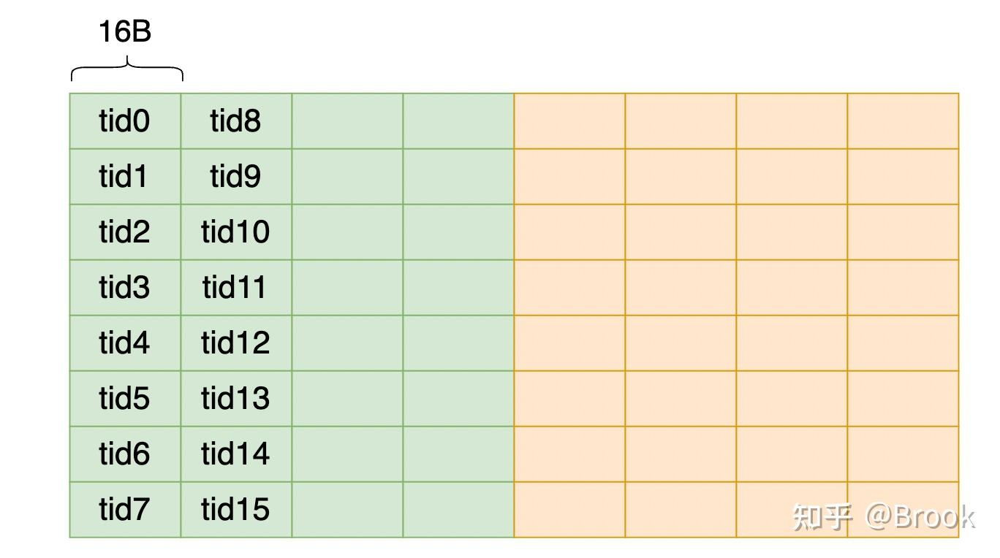

图14展示了TMEM的一个warpgroup写一个ATOM到SMEM的过程，箭头表示第一列/行。

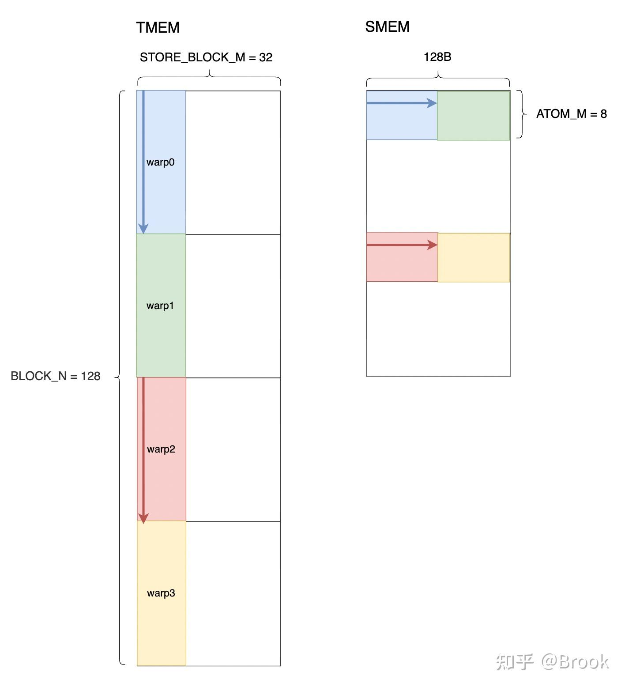

完成一个STORE\_BLOCK\_M之后开始通过nvlink写回src rank。

```cuda
scheduler.for_each_block([&](...) {
  if (block_phase == sched::BlockPhase::Linear2) {
		for (uint32_t s = 0; s < WG_BLOCK_M / STORE_BLOCK_M; ++ s) {
        for (uint32_t i = 0; i < STORE_BLOCK_M / ATOM_M; ++ i) {
            // do tcgen05.cp && stmatrix
        }
        constexpr uint32_t kNumRowsPerWarp = STORE_BLOCK_M / 8;
        const uint32_t row_in_atom = (warp_idx_in_wg * 2 + lane_idx / 16) % ATOM_M;
        const uint32_t bank_group_idx = lane_idx % 8;
        for (uint32_t j = 0; j < kNumRowsPerWarp; ++ j) {
            const uint32_t row_in_store = j * 8 + warp_idx_in_wg * 2 + lane_idx / 16;
            const uint32_t m_idx_in_block = epilogue_wg_idx * WG_BLOCK_M + s * STORE_BLOCK_M + row_in_store;

            const auto src_metadata = *workspace.get_token_src_metadata_ptr(m_idx + m_idx_in_block);
            const uint32_t dst_rank_idx = src_metadata.rank_idx;
            const uint32_t dst_token_idx = src_metadata.token_idx;
            const uint32_t dst_topk_idx = src_metadata.topk_idx;

            // Read from shared memory
            const auto smem_ptr = smem_cd_l2 +
                epilogue_wg_idx * STORE_BLOCK_M * BLOCK_N * static_cast<uint32_t>(sizeof(nv_bfloat16)) +
                (lane_idx % 16 / 8) * STORE_BLOCK_M * kSwizzleCDMode +
                row_in_store * kSwizzleCDMode +
                (bank_group_idx ^ row_in_atom) * kNumBankGroupBytes;
            const auto packed = ptx::ld_shared(reinterpret_cast<float4*>(smem_ptr));

            // Write into remote
            const auto dst_token = combine_token_buffer.get_rank_buffer(dst_topk_idx)
                                   .get_data_buffer(dst_token_idx);
            const auto dst_ptr = math::advance_ptr<float4>(
                dst_token.get_base_ptr(),
                n_idx * static_cast<uint32_t>(sizeof(nv_bfloat16)) + (lane_idx % 16) * static_cast<uint32_t>(sizeof(float4)));
            *sym_buffer.map(dst_ptr, dst_rank_idx) = packed;
        }
	}
}
```

每个warp一次写TMEM中的两列，即两个token，前16线程负责第一个token，后16线程负责第二个token，一个token为128个bf16，一个warpgroup 4个warp，所以一次完成8行，因此需要循环kNumRowsPerWarp = STORE\_BLOCK\_M / 8。 row\_in\_atom表示在一个ATOM内部是第几行，一个warp对应两行，16个lane对应一行，row\_in\_store得到当前循环的行数，一次循环对应8个token，即8行，然后通过row\_in\_store计算出全局这是第几个token，然后从token\_src\_metadata获取到meta信息，即src rank和topk\_slot，这样就可以获得写入的地址dst\_token。 对于SMEM的计算，首先通过epilogue\_wg\_idx找到当前warpgroup的区域。如图14的SMEM部分，一个token对应了SMEM的两行，即两个箭头所在行，所以lane\[0 - 15\]中前8个线程对应蓝色箭头，后8线程对应红色箭头，lane\[16 - 31\]对应第二个token，然后再加上STORE内部的行号row\_in\_store，一个lane对应一个bank\_group，即16B，然后用16B写回源端rank。

最后再所有block执行结束后，nvlink执行全局barrier，然后将本地每一个token的所有topk对应的hidden执行reduce，这部分没有overlap。

## 8. 参考

[https://huggingface.co/deepseek\-ai/DeepSeek-V4-Pro/blob/main/DeepSeek\_V4.pdf](https://link.zhihu.com/?target=https%3A//huggingface.co/deepseek-ai/DeepSeek-V4-Pro/blob/main/DeepSeek_V4.pdf)

[https://github.com/deepseek-ai/DeepGEMM/pull/304](https://link.zhihu.com/?target=https%3A//github.com/deepseek-ai/DeepGEMM/pull/304)

[https://docs.nvidia.com/cuda/parallel-thread-execution/index.html](https://link.zhihu.com/?target=https%3A//docs.nvidia.com/cuda/parallel-thread-execution/index.html)