# 蚂蚁 Theta 基于 DeepEP 的网络性能优化实践

## 前言

2025年初，以 DeepSeek 为代表的开源大模型在成本与能力上持续突破，已初步具备商业化条件，行业发展的重心正从模型训练向推理部署倾斜。在此背景下，推理场景的稳定性与性能成为急待攻克的关键问题。

今年，我们团队聚焦于推理场景的 DeepEP 通信库，不仅通过多种优化大幅提升了其通信性能，更在其之上研发了一套自动化高精诊断系统，以专项保障推理服务的稳定性。目前大部分能力已经沉淀到蚂蚁 Theta 项目。

## 1. 前置介绍

### 1.1 通信库的角色定位

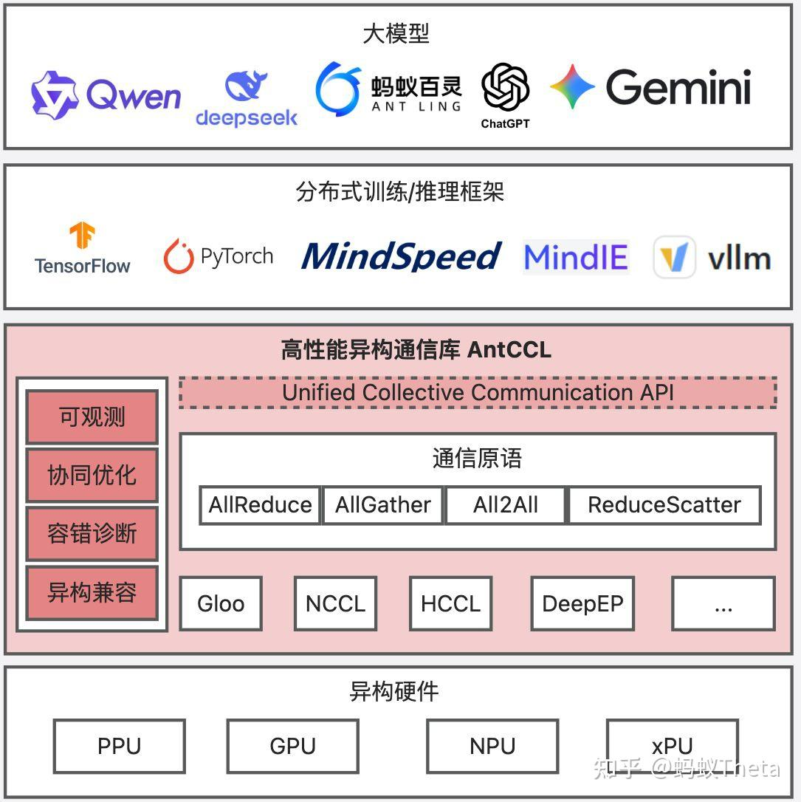

集合通信库在 AI 基础设施中扮演着 **分布式训练通信中枢** 的关键角色，其核心定位是 **高效协调多个计算节点间的数据同步与聚合**，以支撑大规模模型训练。

- **上层**：被 AI 框架（PyTorch、TensorFlow）和训练与推理框架（MindSpeed、Megatron、vLLM）调用。
- **下层**：依赖硬件驱动（如 GPU、NPU 驱动）、高速网络（InfiniBand、RoCE）。

集合通信库是分布式训练与推理的 **“神经系统”**，通过优化跨设备数据流动，使万卡级集群能够像单一设备一样高效协同，直接决定了训练任务的扩展效率与最终性能。其设计目标是在特定硬件拓扑上 **最小化通信开销，最大化计算利用率**。

### 1.2 通信库怎样发挥作用

大模型的有几个特点：参数量很大，计算量很大，大到一台机器装不下。为了实现高效的训练和推理，我们可以使用集合通信库 **实现高效的数据和模型切分策略**，把多台机器组成一个计算集群，从而克服单块 GPU 内存和计算能力的限制。高性能集合通信库（如 NCCL）在 AI 大模型训练和推理的切分策略中，扮演着 **关键使能者和性能决定者** 的角色。它不仅 **支撑** 了切分策略的执行，更通过底层通信优化 **直接决定了切分策略的效率和扩展上限**。

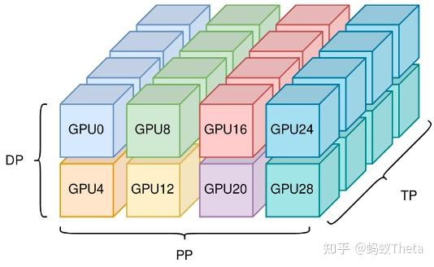

| 切分策略 | 通信原语 | 作用 |
| ----- | ----- | ----- |
| DP(数据并行) | AllReduce（或Reduce + Broadcast） | 每个GPU持有完整的模型副本，处理不同数据。需要聚合所有GPU的梯度。 |
| TP(张量并行) | AllReduce、AllGather、ReduceScatter | 将单个模型的层或张量切分到多个GPU上。在正向和反向传播中，需要进行大量的集合通信操作来聚合或分发部分计算结果（如Megatron-LM中的列并行与行并行）。 |
| PP(流水线并行) | send/recv | 将模型按层切分到不同GPU，形成流水线。在流水线阶段间传递激活值和梯度，主要依赖点对点通信。 |

## 2. 推理性能思考

- 为什么要做 **推理** 性能优化？发展重心从大模型训练到推理，从 Dense 稠密架构到 MoE 稀疏化架构。
- 通信在 **推理场景** 面临哪些挑战？推理集群资源越来越多，推理场景对通信库提出了哪些新要求？
- 推理性能有哪些可能的优化路径？
- DeepEP 性能优化是否必要？在 MoE 模型推理场景中，通信是否值得进一步优化？

### 2.1 近年大模型发展

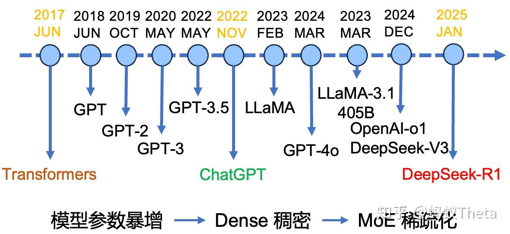

我个人认为，"大模型"发展开端应该从 2017 年 6 月 Google 发布 Transformers 论文后算起，接下来由 OpenAI 公司发布的 GPT 系列模型而进入发展高潮。2022 年 11 月，OpenAI 公司发布了自家产品：ChatGPT，该产品可谓是全球知名，红极一时，风光无限。当然最重要的还是给了投资人对未来无限美好的想象，给科技企业发展指明了一条光明大道。OpenAI 公司名字虽然叫 “open ai”，但是不巧的是 ChatGPT 背后的模型并不开源，“拿来主义”在这个时候便失效了。这能怎么办，目前看起来只能是自己训练了。从此之后的两年发展来看，国内外各家“大厂”就开始了模型训练的“军备竞赛”。

三十年河东三十年河西，直到 24 年末 - 25 年初国产大模型走上舞台中央，Deepseek-V3/Deepseek-R1 模型相继开源发布，使用了 MoE 稀疏化架构，大幅降低激活参数量，使得 Deepseek 模型成本大幅降低(型整体参数：671 B，激活参数：37 B)。Deepseek 不仅在算法方面进步很大，在工程领域也是下了很大功夫，针对算力阉割芯片 H800 的特性，衍生了很多高性能算子库(DeepEP, DeepGemm 等等)，算子编排方案(dual-batch overlap)，这些工作对开源社区来说可谓是久旱逢甘霖。

Deepseek 模型不仅在不损失模型性能的前提下，大大节省了模型成本(激活参数量降低)，一时间有关“中国大模型 Deepseek 火遍全球”。随着以 Deepseek 为首的开源大模型不断进化，开始采用开源模型来支撑自身业务的公司变得越来越多，推理场景也就成为各家科技公司竞争的新战场。

**总结：**

1. 模型架构：从 **Dense** 结构转向 **MoE 稀疏化**。

2. 产品业务发展：随着业务与推理资源规模持续增长，需要通过有效的 **性能优化降低成本**。

### 2.2 推理通信库挑战

从上文的模型发展简史分析，目前的业务中心已经从训练向推理场景偏移，那么如何保证推理场景的高性能，低成本就成了我们的工作重心。

模型推理服务(在线服务)是直接对客，随着业务规模的增大，推理集群的规模也在不断变大，一旦出现稳定性问题就直接影响一线用户，严重影响用户体验。在训练场景主要是要求集合通信的大吞吐性能，但是在推理场景要求是提升用户体验，要求的是低时延。

目前主流的模型架构 MoE 架构，为了更好支持 EP 并行策略，社区推出了 DeepEP 通信库。


为什么要重新开发一个新的通信库呢？通用型集合通信库无法支持 EP 并行的高效通信，会引入额外不必要的开销，而且在低延时场景无法满足。根据 EP 通信业务场景，专门开发了 DeepEP 通信库可以带来更好的性能，DeepEP 内部为训练和推理 Prefill 研发了 normal 模式，主打高吞吐；为了推理 Decode 专门研发了 low-latency 模式，主打低时延。

### 2.3 推理性能优化问题拆解

目前 Theta 平台的 SLO 要求是：TTFT P50 < 2s，TPOT P50 < 70ms。这两个要求主要对应大模型推理中的 Prefill（预填充）和 Decode（解码）阶段。

这两类计算差别很大，他们各有特征，Prefill 输入是 Decode 的 32 倍(prefill 输入是 4K token, Decode 最大 batch 是 128 Token)，Prefill 计算密集，吞吐量高。Decode 生成N个令牌需要执行N次Decode步骤，无法并行，每一步的计算量其实不大（主要是对最后一个令牌的向量进行矩阵乘法），但需要频繁地从显存中读取巨大的KV缓存。因此，Decode阶段的性能主要受限于内存带宽，而非计算速度。这就会导致我们对 Prefill 和 Decode 优化方向不一样。

在通信优化场景中，所以我们可以得到路径：

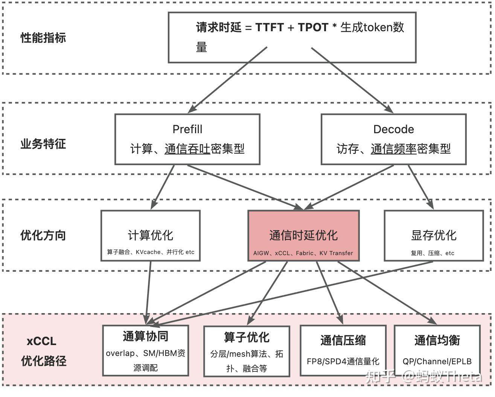

### 2.4 DeepEP 通信占比分析

**分析结论**

大模型推理中，通信占比还是比较高，大约 20%-30%，有优化的必要

**详细分析过程**

在 Deepseek-R1 模型推理中，首先我们经过多种切分策略性能的对比，我们发现这样的切分策略性能&稳定性是最优的：

- 机器信息：两台 H20 × 8 + 4 × 400 Gb/s NIC
- 切分策略：
  - Prefill：Attention TP8 + MoE TP8（Prefill 两台机器）
  - Decode：Attention DP16 + MoE EP16（Decode 两台机器）

(当前切分里面我们并没有在 Prefill 中打开 EP 切分， EP 切分带来额外的通信延迟拖慢了整体性能，所以我们只在 Prefill 中使用了 TP 切分)

因为我们的部署切分策略在 Prefill 中只会涉及到 allreduce 集合通信，该通信使用的 SGLang 框架内部自身的高性能通信 kernel 优化空间已经不太大。所以我们先针对 Decode 中的 DeepEP 通信分析：

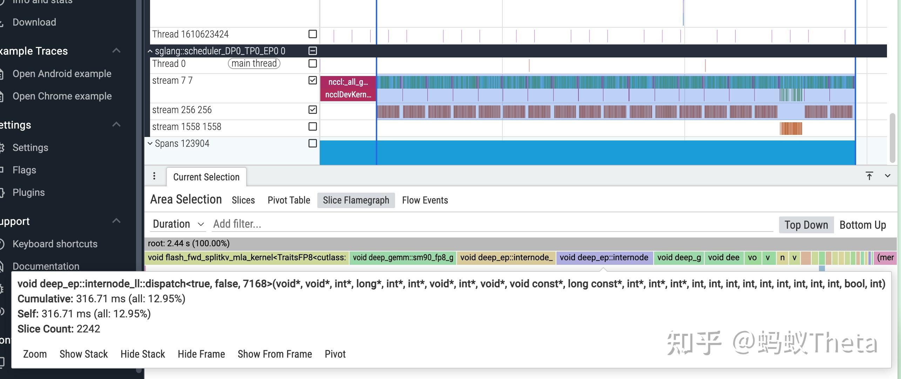

`low-latency dispatch kernel`

-   **占用百分比**：12.95%
-   **占用时间**： 316.7 ms

所有 kernel 占用时间：316.7 ms / 12.95% = 2445.55 ms

`combine kernel` 和 `dispatch kernel` 占用差不多，这里就不单独计算 `combine kernel`

某段 time-line:

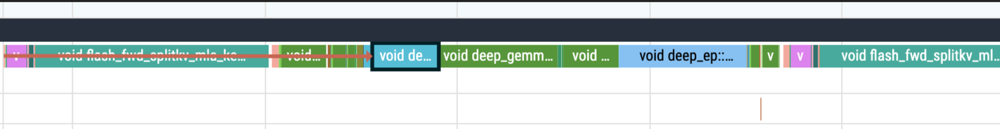

分析下所有的 ll dispatch kernel 的执行时间，一共执行了 2242 次。

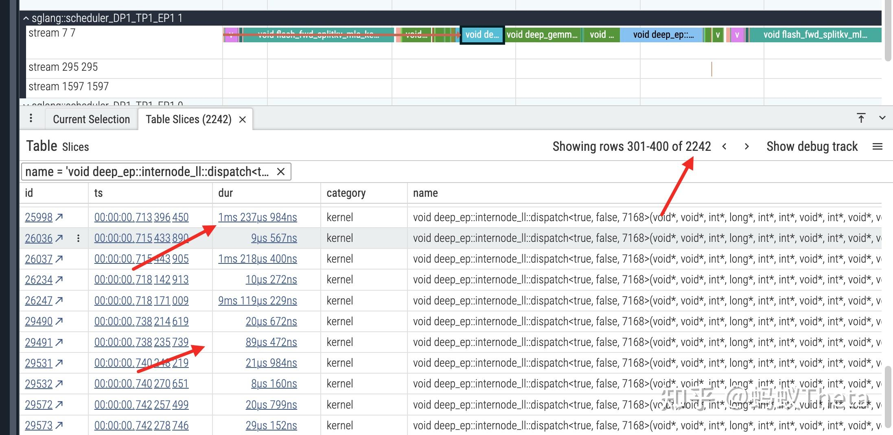

一次`dispatch`通信占用的时间 `316.7 ms / (2242 / 2) = 282.51 us`(*这里除 2 是因为打开了 DeepEP 的 hook 模式*)

我们为什么要分析这个 profile time-line 呢？这是因为通过分析 time-line 中不同的算子占用的运行时间，可以找到瓶颈点，先优化占比高的，可以知道哪些可以优化多少，是否有必要进行优化(例如：如果通信只占用百分之一，那么就没有必要去优化通信)！

## 3. DeepEP 性能优化：追平到超越

接下来通过两方面：**追平 -> 赶超** 来介绍下，我们这一年来在推理通信上所做的优化工作：

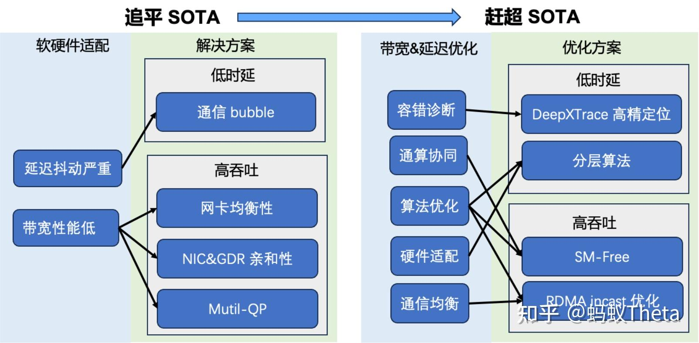

### 3.1 追平 SOTA

直接跑开源的代码就好，为什么还要追平呢？因为社区发布的版本是专门针对 H800,infiniband 机器专门研发，并且我们内部的机器硬件配置和软件配置都和社区存在差异，导致性能并不是最优的，我们需要根据自己的环境进行适配。

#### 3.1.1 通信 Bubble

最开始使用社区代码测试发现 hook 模式里面测试出来的性能抖动特别大，这里性能也和社区公布的性能不符。

```text
[rank 10] Dispatch send/recv time: 73.17 us  | Combine send/recv time: 124.84 us
[rank 15] Dispatch send/recv time: 684.89 us | Combine send/recv time: 862.45 us
[rank 8 ] Dispatch send/recv time: 85.14 us  | Combine send/recv time: 172.65 us
[rank 11] Dispatch send/recv time: 610.64 us | Combine send/recv time: 749.02 us
[rank 14] Dispatch send/recv time: 113.36 us | Combine send/recv time: 187.84 us
[rank 13] Dispatch send/recv time: 823.39 us | Combine send/recv time: 1134.90 us
[rank 9 ] Dispatch send/recv time: 528.58 us | Combine send/recv time: 655.32 us
[rank 12] Dispatch send/recv time: 35.04 us  | Combine send/recv time: 36.94 us
```

经过分析 DeepEP low-latency benchmark 的 profile, 发现这个抖动问题是 cuBLAS 导致的：

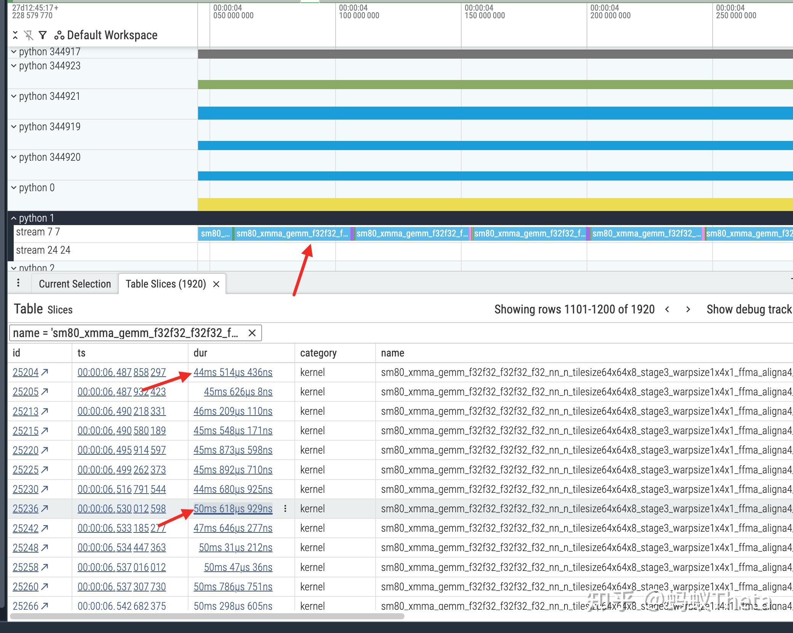

我们可以把 profile 中 Gemm kernel 耗时导出，然后画一个统计图，我们就很明显看出来计算 kernel 耗时抖动特别大。

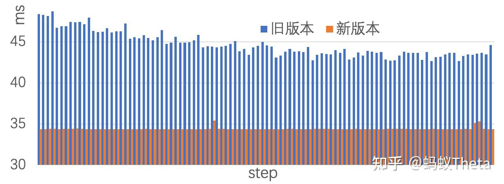

注意：蓝色表示有问题的，黄色表示修复后

为什么计算 kernel 问题会引入通信 bubble 呢？

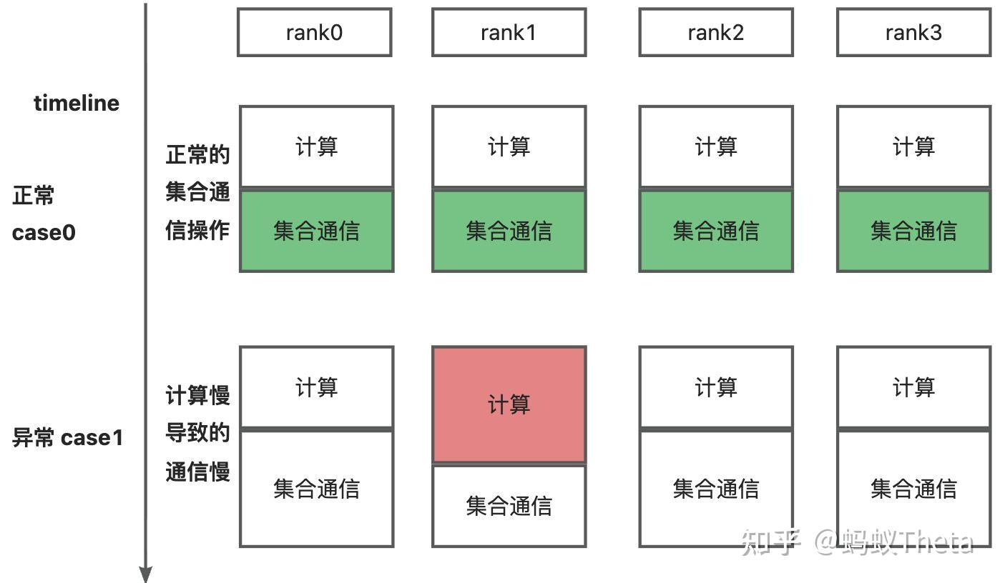

我们可以通过上图来看这样一个例子：

如上图中的 case0 ，正常情况下不同 rank 计算 kernel 应该是同时结束，然后同时开始进入集合通信里面。

但是在异常情况 case1，有某个计算 kernel 耗时相比其他 rank 明显变长很多，就导致该 rank 进入集合通信比其他 rank 慢很多，就导致其他 rank 就空闲等有问题的 rank 进行通信，从整体上来看集合通信耗时会变长。

其本质是因为集合通信是一个集体操作，容易出现短板效应。

在 DeepEP 的性能测试脚本里面为了模拟 hook 测试，在里面使用了 pytorch 的矩阵乘，底层调用的是 cuBLAS 库，我们的这个版本应该是存在性能抖动问题。测试脚本中矩阵乘的 shape 都是一样大，如上图我们可以看到两次kernel 差距有 5 ms 左右，这是不符合预期的。然后我们升级 cublas 后性能测试就正常了，性能测试结果如下：

```text
[rank 5] Dispatch send/recv time: 39.58 us | Combine send/recv time: 40.99 us
[rank 7] Dispatch send/recv time: 39.45 us | Combine send/recv time: 40.79 us
[rank 4] Dispatch send/recv time: 39.95 us | Combine send/recv time: 40.84 us
[rank 1] Dispatch send/recv time: 39.99 us | Combine send/recv time: 40.64 us
[rank 2] Dispatch send/recv time: 39.26 us | Combine send/recv time: 40.62 us
[rank 6] Dispatch send/recv time: 40.22 us | Combine send/recv time: 41.06 us
[rank 0] Dispatch send/recv time: 39.60 us | Combine send/recv time: 39.95 us
[rank 3] Dispatch send/recv time: 39.82 us | Combine send/recv time: 40.91 us
```

#### 3.1.2 均衡性适配

机型配置示意图：

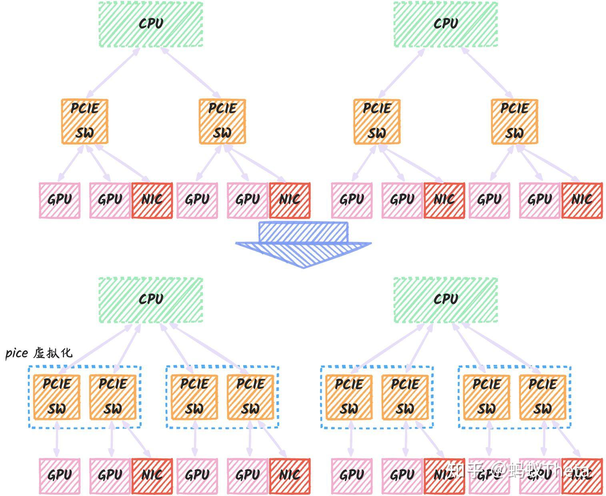

*（上图展示的 PCIe 虚拟化和 nvidia 标准配置是有差异的）*

我们先介绍下 DeepEP 高吞吐模式的组网逻辑图如下：

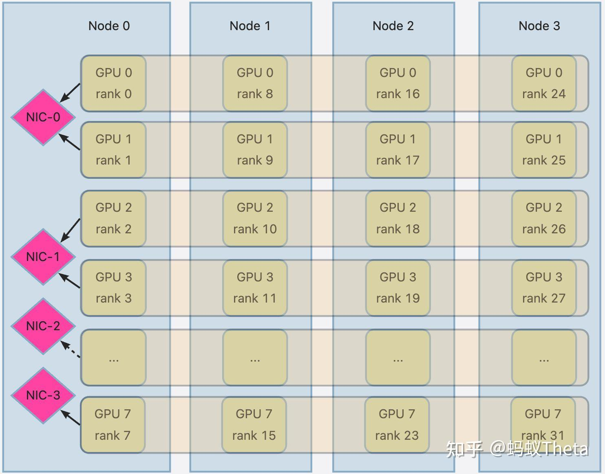

上图是我们 GPU 服务器的配置示意图，该机型一共有 8 个 GPU ，4 个 NIC，预期的情况是一台服务器会运行 8 个进程，每个进程独占是一个 GPU ，每两个进程共享一个 NIC。

为了适配 GPU 数量和网卡数量不一致，我们手动指定如下 HCA 的配置映射：

```text
export NVSHMEM_ENABLE_NIC_PE_MAPPING=1
export NVSHMEM_HCA_PE_MAPPING="mlx5_bond_0:1:2,mlx5_bond_1:1:2,mlx5_bond_2:1:2,mlx5_bond_3:1:2"
#NVSHMEM_HCA_PE_MAPPING 配置 hca_name:port:count
```

最初我们直接使用社区跑 DeepEP 高吞吐性能，非常低，与社区给出的性能数据差异比较大：

```text
[tuning] Best dispatch (FP8): SMs 24, NVL chunk 20, RDMA chunk 32: 6.46 GB/s (RDMA), 21.15 GB/s (NVL)
[tuning] Best dispatch (BF16): SMs 24, NVL chunk 32, RDMA chunk 32: 6.82 GB/s (RDMA), 22.32 GB/s (NVL)
[tuning] Best combine: SMs 24, NVL chunk 3, RDMA chunk 32: 6.73 GB/s (RDMA), 22.03 GB/s (NVL)
```

通过分析网卡的流量，发现只有 bond0 网卡有流量，这里就可以知道测试带宽低应该是和只使用一个网卡有关系。

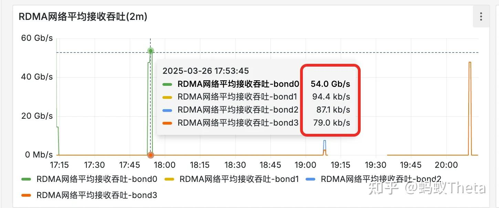

通过分析 NVSHMEM 源码，由于 DeepEP 中把同号 GPU 组成一个通信域，共组成 8 个通信域。这种特殊组网逻辑，导致 NVSHMEM 中选择网卡逻辑出现问题，加之因为我们服务器和 NVIDIA 标准的结构存在差异导致(前文展示的 PCIe 虚拟化)。

当我们修复网卡选择逻辑后性能也提升了，但是还没有达到官方给出的性能，差不多只有官方性能数据的一半。

```text
[tuning] Best dispatch (FP8): SMs 24, NVL chunk 20, RDMA chunk 32: 22.65 GB/s (RDMA), 74.16 GB/s (NVL)
[tuning] Best dispatch (BF16): SMs 24, NVL chunk 24, RDMA chunk 32: 23.41 GB/s (RDMA), 76.66 GB/s (NVL)
[tuning] Best combine: SMs 24, NVL chunk 2, RDMA chunk 12: 23.45 GB/s (RDMA), 76.81 GB/s (NVL)
```

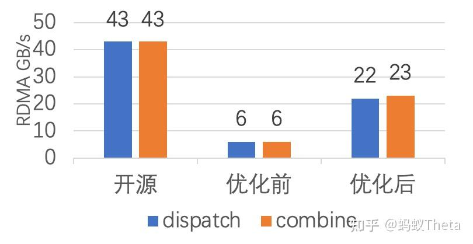

通过观察网卡流量也均匀了，并且每个网卡的流量都变很大了。当时我们也怀疑是否是 PCIe 虚拟化导致的，因为PCIe 虚拟化刚好导致一半GPU 距离网卡“变远”了。根据一系列排查，最后确认并不是该问题导致的。

后来经过我们各种测试发现单 QP 不能打满网卡的最高带宽：(我们一张网卡的带宽是 400 Gb/s，注意单位)

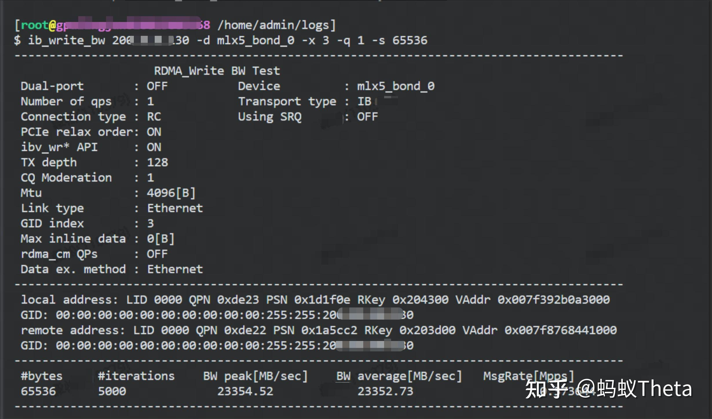

因为最初 DeepEP normal 模式就是使用的单 QP。

为什么单 QP 不能打满网卡带宽呢？我们使用的网卡(CX-7)是如下形态，具有两个物理口(一个 NIC 的带宽是两个物理口之和)，一个 QP 的流量只能走到一个物理口上(我们使用的是 Mellanox 双端口网卡，如下图所示)，一个物理口的带宽是 200 Gb/s

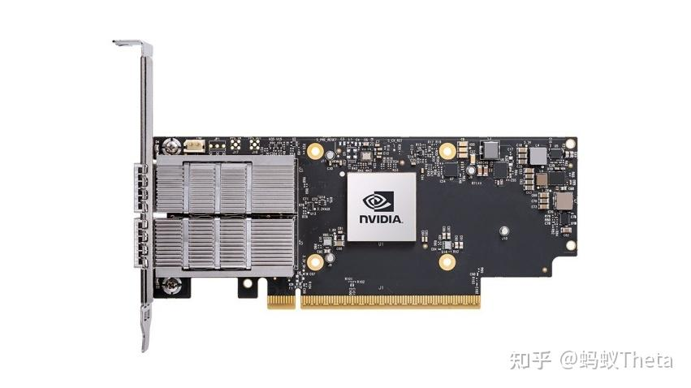

如果我们需要把网卡性能打满上去，就需要在一个网卡上创建多个 QP

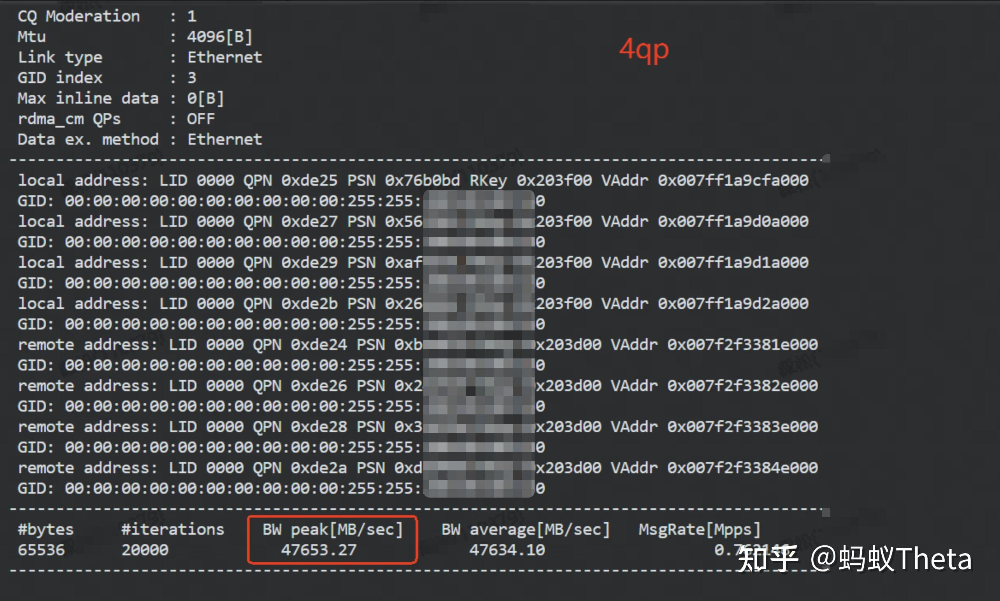

如上图所示，我们用工具测试 4 个 QP ，这样就能把整个网卡的带宽打上来了。之所以之前压测带宽只有一半，就是因为有一半端口浪费了。

刚好当时腾讯的同学提了一个 PR 修复了该问题，使用多 QP 通信后，然后性能就提升上来了，能和社区测试出来的带宽匹配上了。

```text
[tuning] Best dispatch (FP8): SMs 24, NVL chunk 20, RDMA chunk 12: 42.68 GB/s (RDMA), 140.80 GB/s (NVL)
[tuning] Best dispatch (BF16): SMs 24, NVL chunk 12, RDMA chunk 8: 44.62 GB/s (RDMA), 147.19 GB/s (NVL)
[tuning] Best combine: SMs 24, NVL chunk 2, RDMA chunk 8: 43.74 GB/s (RDMA), 144.29 GB/s (NVL)
```

[PR](https://link.zhihu.com/?target=https%3A//github.com/deepseek-ai/DeepEP/pull/130)

### 3.2 赶超 SOTA

我们主要在四个方面赶超了社区 SOTA：

1. DeepXTrace 覆盖 MoE 非均衡通信架构中 5 类慢节点问题，实现分钟级高精度定位。
2. 为低时延模式的 Dispatch 通信新增分层算法支持，将通信时延缩短一半。
3. 为高吞吐模式新增 SM-Free 能力，加速 Prefill 计算并缩短 TTFT。
4. 优化高吞吐模式的 Channel 均衡性，降低 RDMA 网络 Incast 概率并提升带宽。

#### 3.2.1 DeepXTrace 高精定位

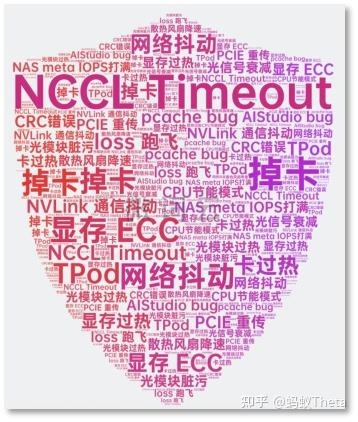

我们为什么要在 DeepEP 中做一个高精诊断系统呢？推理场景中专家并行是非常有效提升推理性能的并行策略，促使 DeepEP 通信库成为其必不可少的依赖。总的来说有两方面原因：

**需求推动：**

上图是我们 SRE 团队总结的去年训练场景中的一些故障，我们可以很明显的看出来网络表象问题是最多的。我们认为在训练场景发生的故障在推理场景也同样会发生。我们的推理系统(在线推理)是直接服务一线用户的，一旦出现稳定性问题会直接降低用户体验，影响产品口碑。所以推理场景也迫切需要一些自动化诊断手段，快速高效识别问题发生点，高效恢复用户服务。

**诊断非常困难：**

大模型推理系统的运维和问题诊断，与传统软件或甚至早期的AI系统相比，其复杂度和挑战性都上了一个新的量级。一个大模型推理请求，从用户输入到最终输出，贯穿了一个极其复杂的技术栈，任何一个环节都可能成为瓶颈或错误源。“定位复杂”的终极体现就是“静默问题”——系统没有抛出异常，服务看似正常，但输出的结果或性能是不可接受的。目前我们有效的手段就是人工排查，复现问题、人工排查各种监控成本非常高，并且效率不高，效果不好。

我们在 DeepEP 中设计了一套 metrics ，可以通过该 Metrics 诊断出不同场景触发的 slow 问题。该方案具有如下几点优势：

- **覆盖全面**
  - 覆盖计算、通信和混合三类场景。
  - 覆盖机内与机间链路（RoCE、NVLink）。
  - 支持 GPU 与 NPU 异构环境。
- **低开销**
  - EP32 下显存开销为 256 Bytes。
- **去中心化**
  - 自动聚合 N 次通信数据，并汇聚到 Rank 0 完成自动诊断。

**诊断案例展示：**

背景是业务团队在复现社区推理性能，但是性能一直没有达到社区公布的性能水平。他们自己排查该问题已经有两周都没有找到原因，后来找到了我们，我们把该诊断系统装上去后，几分钟就发现了问题所在。

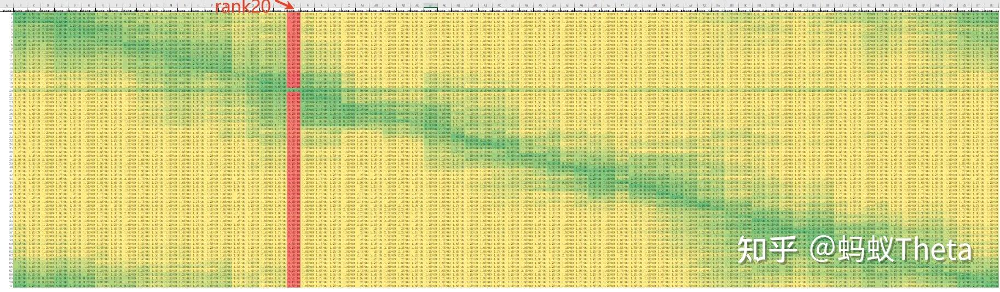

他们部署的推理实例，Decode 中开启了 EP72 切分策略。如上图，经过 DeepXTrace 诊断后，快速就识别出了 rank20 存在问题，精准命中了上文提到的 case2 场景。

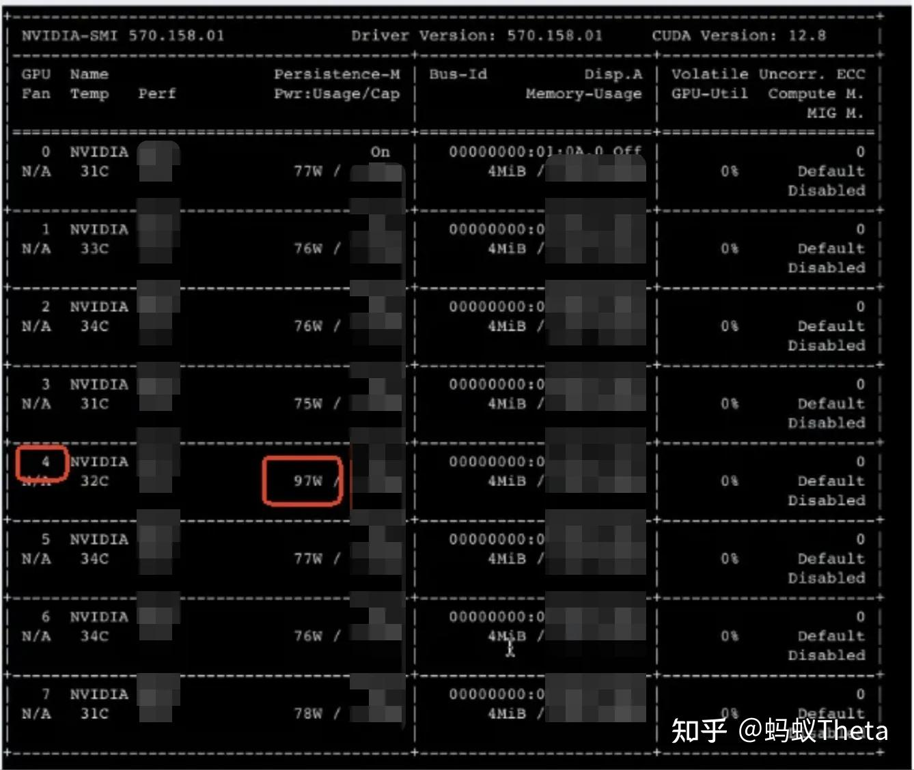

本质原因是 Rank 20 对应的这张 GPU 卡功耗明显高于其他 GPU 卡。我们同时单独对这台机器进行了 DeepEP Benchmark 测试：

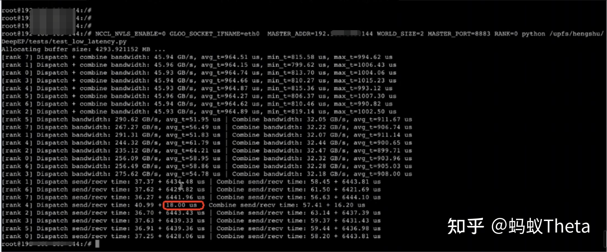

可以明显看到有问题的这张卡性能和其他卡对不齐。

[PR](https://link.zhihu.com/?target=https%3A//github.com/deepseek-ai/DeepEP/pull/311)

#### 3.2.2 DeepEP Low-Latency 分层算法

在 low-latency 模式里面，可以借鉴 normal 模式的分层算法思路，改造 ll 模式中的 dispatch 算子。如下图:

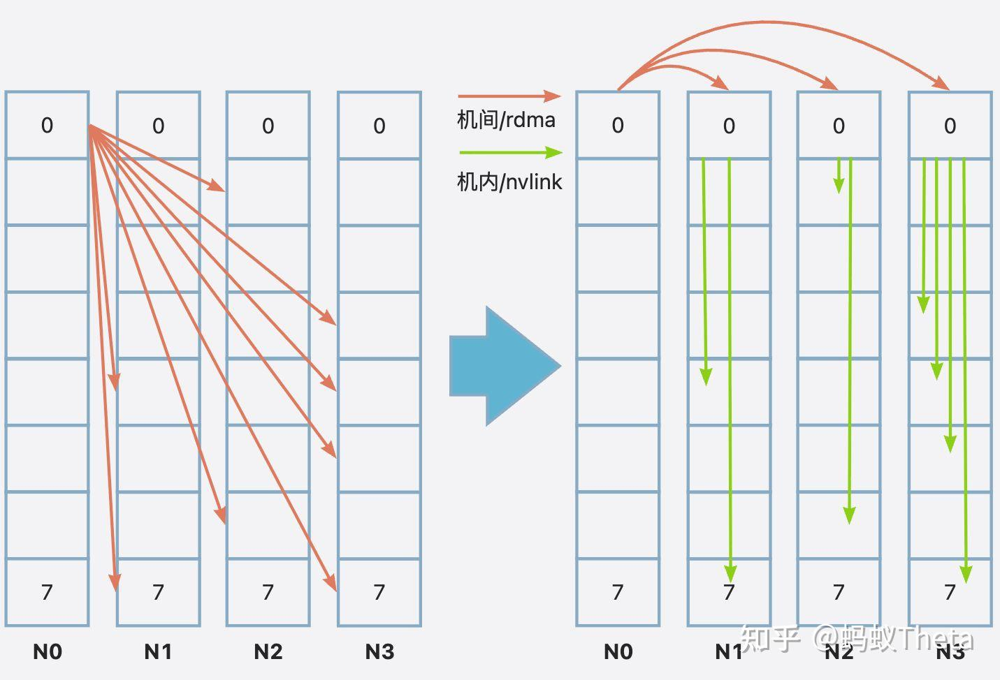

原始的算法(左图)是直接把 token 直接发送到目的地的 recv\_data\_buffer 上，优化后的算法(右图)是把本该直接发送到真正目的地的 token ，直接发给和发送者同轨(同 GPU 编号)的 rank。这样设计有如下好处：

1.  减少 8 倍显存占用
2.  减少 RDMA 发送的数据量，减少通信延迟
3.  避免 RDMA 跨轨发送数据，减少网络拥塞可能性

核心的 Buffer 设计：**dispatch recv\_data\_buffer**

**原始** shape: `{local_exports, num_ranks, max_tokens, hidden}`

**优化后** shape: `{local_exports, num_nodes, max_tokens, hidden}`

num\_ranks == num\_nodes \* num\_nvl\_rank

-   **num\_ranks**: 表示一个有多少个 rank，也就是一共有多少张卡
-   **num\_nodes**：表示一共有多少台服务器，一个服务器有多个 GPU 卡
-   **num\_nvl\_rank**：表示一个节点内有多少个 rank，也就是一个节点有多少个卡，目前是 8

**性能测试**

H20 EP16 下，不同 batch 下测试结果:

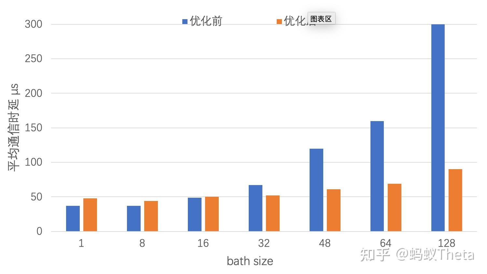

详细数据：

| batch size | 原生- 非 Hook | 优化后 - 非 Hook | 降低百分比 | 原生 - Hook | 优化后 - Hook |
| ----- | ----- | ----- | ----- | ----- | ----- |
| 1 | 37 us | 48 us | -29.7% | 23.08 + 5.41 us | 22.64 + 10.61 us |
| 8 | 37 us | 44 us | -18.9% | 13.50 + 5.64 us | 17.80 + 10.89 us |
| 16 | 49 us | 50 us | -2% | 16.31 + 5.62 us | 17.41 + 11.53 us |
| 32 | 67 us | 52 us | 28.8% | 14.56 + 6.00 us | 19.08 + 13.26 us |
| 48 | 120 us | 61 us | 49.1% | 18.14 + 6.48 us | 21.23 + 15.24 us |
| 64 | 160 us | 69 us | 56.8% | 19.85 + 6.74 us | 21.93 + 18.16 us |
| 128 | 300 us | 90 us | 70% | 25.12 + 10.59 us | 31.94 + 33.43 us |

如上图的性能测试结果看来，在小 batch 下，性能是存在负收益的，这是正常的，符合预期。

为什么小 batch 存在负收益，本质是因为我们在 cuda kernel 做的一个转发是一个应用层的转发，而且这个转发逻辑需添加额外的代码逻辑，增加代码的复杂度。例如：我有 7KB 数据从 node0-GPU0 发送给 node1-GPU0 是等 7KB 所有数据都到达后再转发给 node1 的其他 GPU，这里的转发并不是交换机侧的链路层转发，所以这里在小 batch 的时候会出现这种负收益。

在 128 batch 下，不同 EP 规模压测结果：

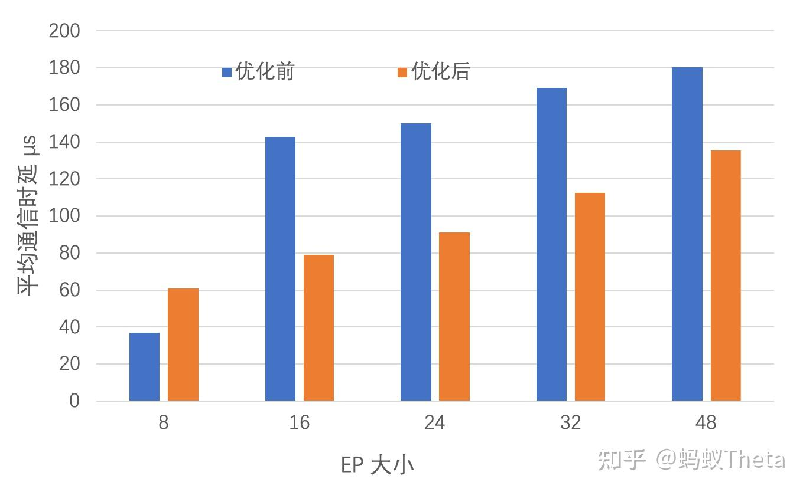

详细数据

| num_rank | dispatch 优化前 | dispatch 优化后 | 降低百分比 |
| ----- | ----- | ----- | ----- |
| 8 | 37.09 us | 60.72 us | -63.70% |
| 16 | 142.64 us | 78.89 us | 44.69% |
| 24 | 150.10 us | 91.19 us | 39.24% |
| 32 | 169.08 us | 112.45 us | 33.49% |
| 48 | 180.25 us | 135.50 us | 24.82% |

这里我们可以看到当 EP 规模加大后，收益在逐渐变小，这是因为 EP 更大，那么相同的 token 发送给相同节点的概率更低导致。当 EP size 为 8 的时候(单机场景)，这是一个特殊的 case ，因为单机内直接使用 nvlink 传输链路，不需要这种分层算法。后续可以专门针对单节点的场景进行优化(如果有需求)，这种单节点的优化是可以推演到单个超节点，因为单个超级节点内都可以直接走 nvlink 传输链路。

[PR](https://link.zhihu.com/?target=https%3A//github.com/deepseek-ai/DeepEP/pull/500)

#### 3.2.3 DeepEP Normal SM-Free

由于某些众所周知的原因，国内只能使用一些低算力芯片的加速硬件，例如：H20。其中也加剧了我们对性能优化的迫切需求，其中通信&计算 overlap 是特别好的优化思路。

DeepSeek 团队发布了一种 dual-batch overlap 的方案，方案大致如下：

Prefill 方案：

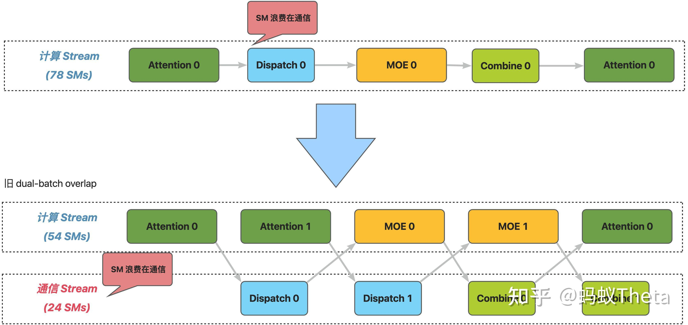

Decode 方案：

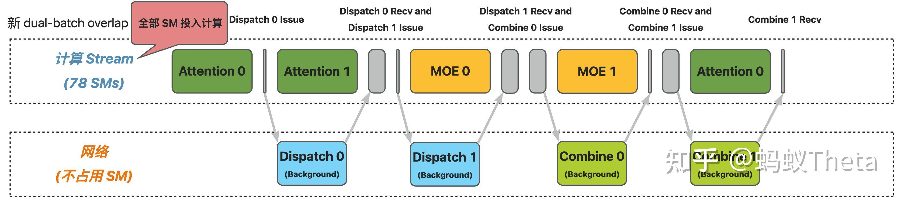

从上述在 Decode 的 overlap 方案是非常好的，它可以更大程度的把通信 SM 资源释放计算。但是 Decode 中的方案并不能推广到 Prefill 计算中，该问题的根本原因在于：DeepEP 的 Normal 模式中的数据发送是 **同步模式**。具体而言，其数据发送 **受限于网络 Buffer 的容量**，当通信数据量较大时，必须将数据分多轮传输，且 **发送端的通信算子需要频繁轮询检查网络 Buffer 是否可用**。尽管数据传输主要由网卡在后台完成，**通信算子仍需持续等待，无法参与其他计算任务，导致 GPU 资源空转和效率下降。**

由于网络 Buffer 的资源限制，DeepEP Normal 模式无法实现异步数据发送，从而形成了通信瓶颈。现有的集合通信库方案中，DeepEP Low Latency 模式突破了上述限制，可以异步发送。这是因为 Low Latency 模式应用于 Tokens 数量小的场景，会直接按照通信的 Tokens 数量分配网络 Buffer 的资源。而 Normal 模式以实现高吞吐为目标，往往应用于 Tokens 数量大的通信场景，如果像 Low Latency 模式一样直接按照 Tokens 数量分配网络 Buffer ，可能存在显存不足的问题。

通过测试发现 Prefill 节点的 GPU 显存并未用满，仍有部分可利用空间。这一发现为优化 MoE 推理服务性能提供了思路：即 **合理利用 P 节点空闲的显存空间作为网络 Buffer，并根据待通信的 Token 数量计算和分配 Buffer 资源**。

那么我们参考 Decode 的思路，增加 RDMA 网络 Buffer 的大小，在 normal 模式中也支持了 0 SM 技术，核心逻辑就是分离 send 和 recv 阶段：

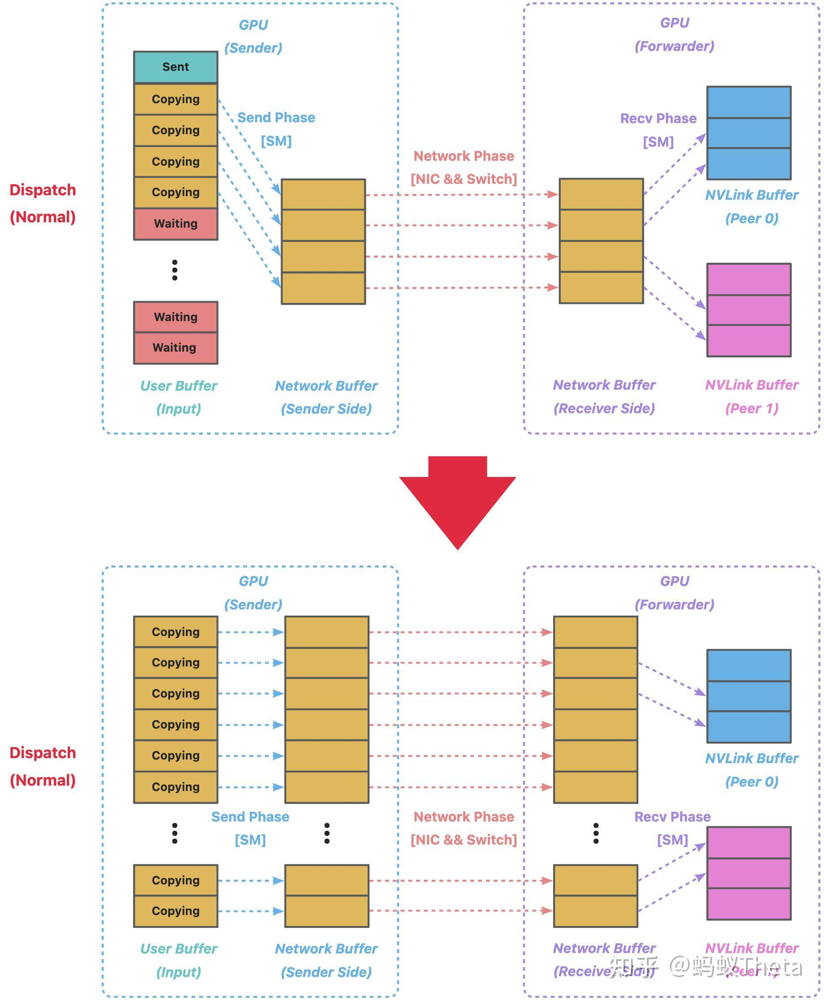

**收益与开销预估：**

| 类型 | 指标 | 变化 |
| --- | --- | --- |
| 收益 | 可用于计算的 SM 数量 | 54 SM → 78 SM |
| 收益 | P 节点 TTFT | 降低 30.8% |
| 开销 | 通信 Buffer HBM 占用（网络 Buffer 与 NVL Buffer 之和） | 0.4 GB → 4.18 GB |

根据 H20，SGLang 和 DeepEP 官方参数进行评估，实现异步 DeepEP Normal 通信算子和 0 通信 SM TBO 的收益是数据传输时，原本 54 SM 计算增加为 78 SM 计算，利用增加的计算资源完成相同的 Prefill 阶段计算任务，可以 **降低约 30.8% 的 TTFT**。

开销是 **每个 Batch 最多占用 H20 4.18 GB 的 HBM** 资源作为通信 Buffer（其中 3.78GB 是网络 Buffer 的 HBM 开销，0.4GB 是 NVL Buffer 的 HBM 开销）。

性能收益：

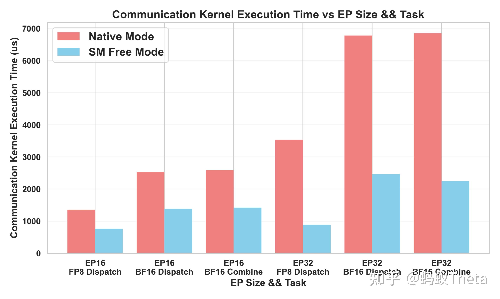

[PR](https://link.zhihu.com/?target=https%3A//github.com/deepseek-ai/DeepEP/pull/347)

#### 3.2.4 DeepEP Incast 优化

DeepEP 高吞吐 Dispatch 模式当通信 channel 的数量（SM/2）不是 RDMA RANK 数的整数倍时，DeepEP 通信算法导致各节点瞬时收发不均而会加剧 Incast 问题，比如 RDMA RANK 数 4、channel 数 5，会出现 6 打 1。

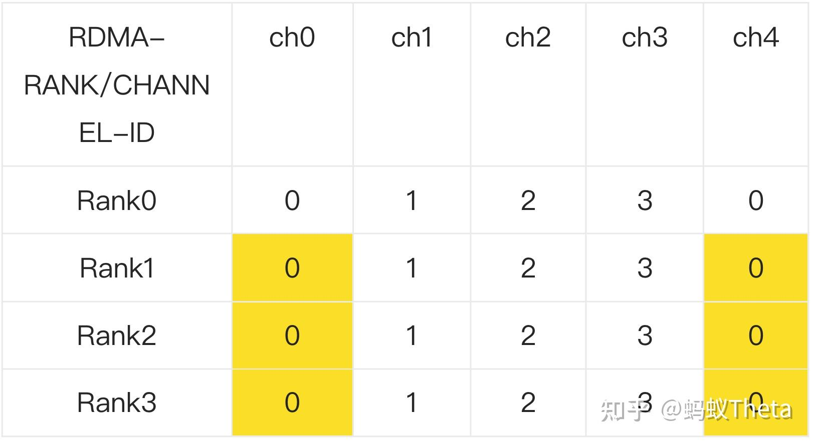

**延伸思考：** 除了高吞吐 Dispatch， 其他场景比如高吞吐 Combine 以及低延时 kernel 算子计算的发送目标 rank 位置信息是和 CUDA 的 Warp Scheduler 调度算法相关，具备一定的随机性打散（针对高吞吐的 combine 理论上也是可以通过算法优化变成确定性的打散，缓解 incast）。

**分析与优化方案：** 通过优化 DeepEP 的通信算法，同时将机内 Channel 以及机间并发在时间维度打散，实现 6 打 1 降低到 3 打 1。

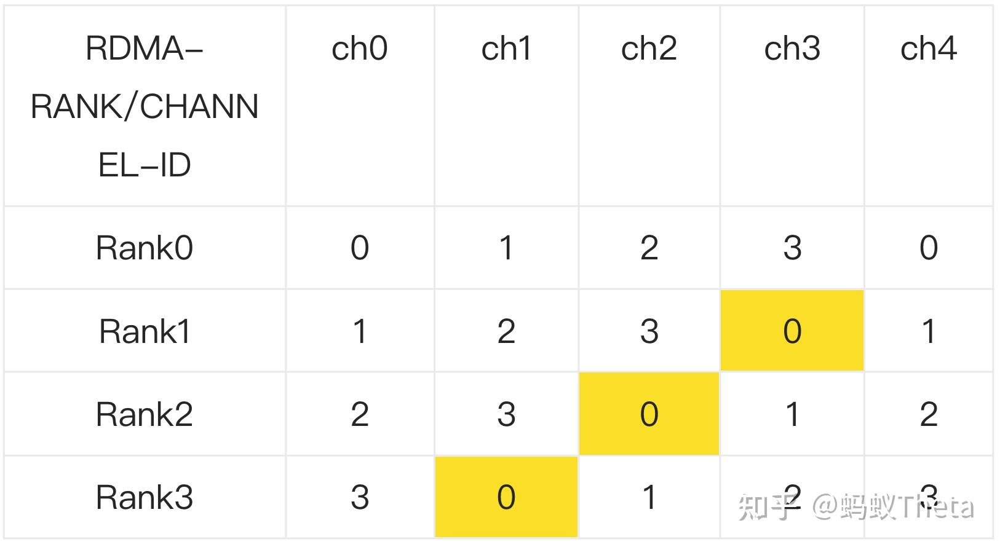

在如下环境对于高吞吐 Kernel 开启和关闭 Dispatch incast 优化场景各跑 3 次。

```text
机器类型：  H20
规模：     4 机 32 卡
SM:       12
Experts:  288
Tokens:   4096
```

数量类型 FP8、BF16，关闭和开启 Dispatch incast 优化的吞吐（GB/s）性能测试结果如下图所示：

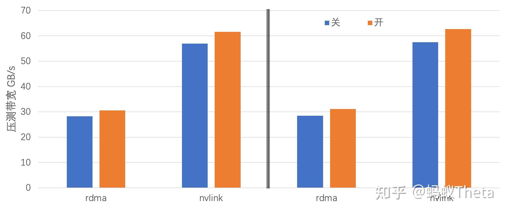

注：如下所有监控中红色框中代表是关闭 Dispatch incast 优化的相关指标，其他代表开启优化的指标。其中监控精度是 15 s 周期。

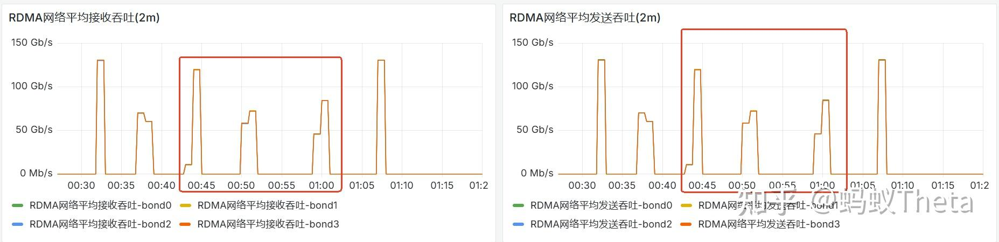

如下图，关闭 Dispatch 的 Incast 优化，端侧网卡收到的 ECN 数量明显飙高，相较于开启 Incast 优化的 ECN 数量高 3-9 倍。

端侧处理的 CNP 降速，在关闭 Incast 优化，CNP 降速通知明显增多，相较于开启 Incast 优化的 CNP 数量高 10-15 倍：

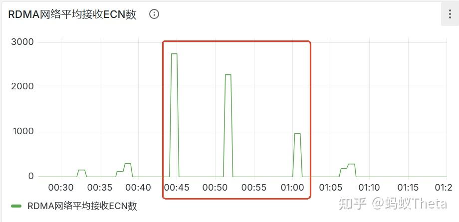

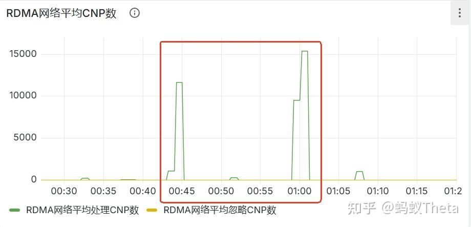

高吞吐模式的 Dispatch 在节点数和 channel 配比不均衡的情况下，开启 Incast 优化后， ECN 数量降低 3-9 倍，DeepEP 吞吐提升 8%。优化 [PR](https://link.zhihu.com/?target=https%3A//github.com/deepseek-ai/DeepEP/pull/153) 已经合并 DeepSeek 通信库 DeepEP。

### 3.3 工作总结

#### 3.3.1 性能优化总结

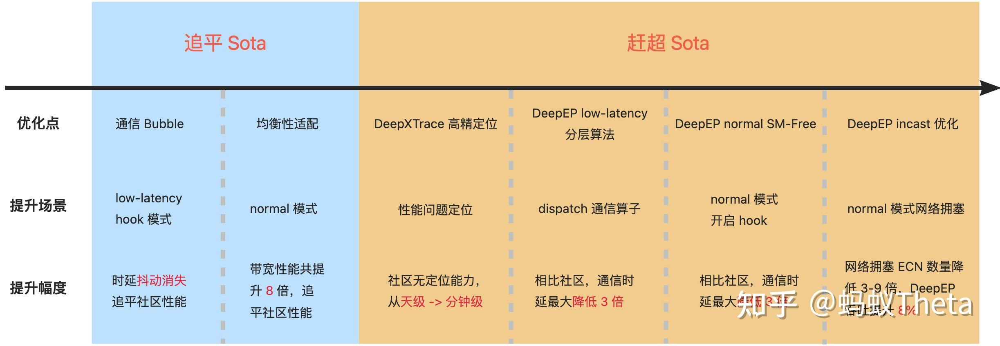

如上优化部分已集成到 Theta 项目，详见：[蚂蚁Theta基于SGLang，探索DeepSeek-R1 在 H20-96G 上的高效服务实践](https://zhuanlan.zhihu.com/p/1967164461916881309)

#### 3.3.2 社区与学术工作总结

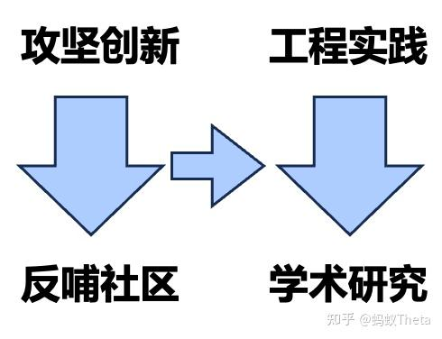

按照上图的工作推进流程，我们不仅实现了反哺社区，并且把我们工作沉淀成学术论文。

前面展示的攻坚创新工作不仅在我们内部生产中使用了起来，并且我们还把这些优化特性反哺给了社区，并且受到了社区的高度认可。我们的理念就是从开源中来，并且要回到开源中去，大家一起为行业发展贡献自己的力量。

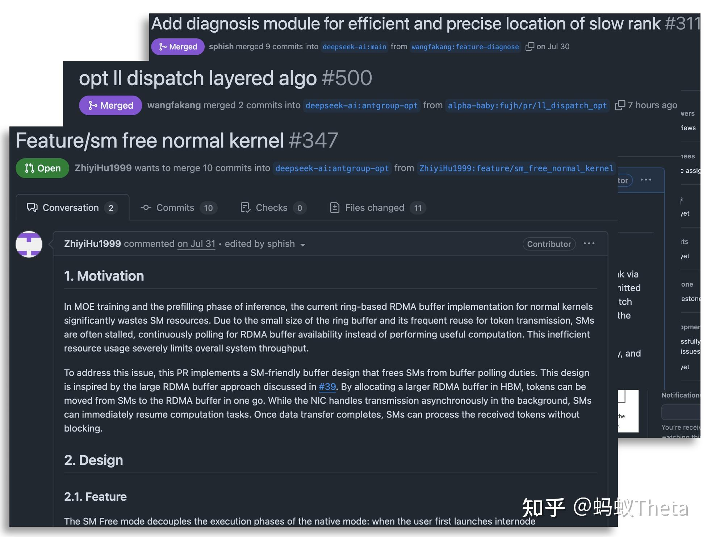

同时我们还把的工程创新实践写成论文，集合通信创新技术斩获高性能并行计算国际顶会 PPoPP'26 论文 2 篇：

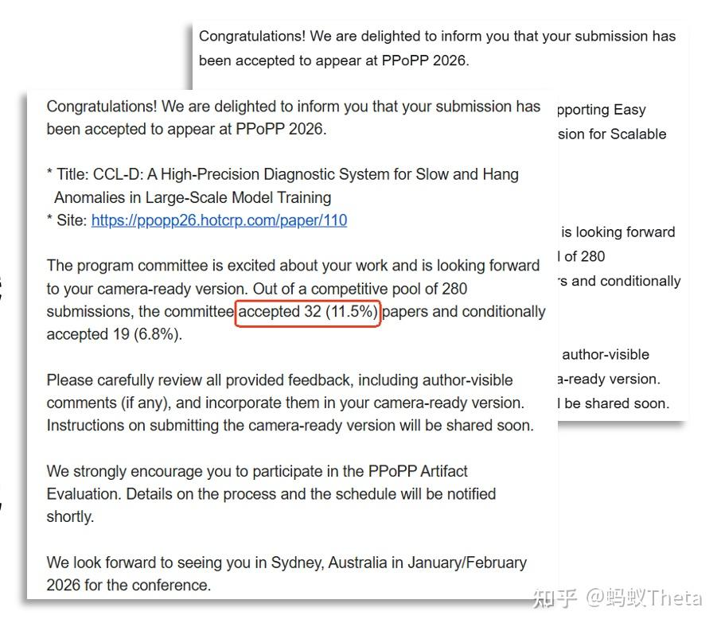

## 4. 通信库的一些未来趋势

业务发展和技术发展是相辅相成的，我们先看下业务后期一些发展方向：

1. **低成本服务**：AI 智算资源消耗相比通算场景仍然居高不下，为了更好地支撑业务，还需进一步优化。
2. **丰富业务场景**：从文本走向多模态，从“单模问答”走向“多模 Agentic 工作流”。
3. **绿色计算**：大模型的巨大计算量导致能耗远高于传统 IT 系统，后续也会面临绿色计算要求。
4. **模型与算力服务化**：头部云厂商或平台团队将 PD 分离、连续批处理、KV-Cache 量化封装为 Serverless API，中小公司或团队可直接调用，仅需关注自身业务逻辑，无需自建 GPU 资源池。

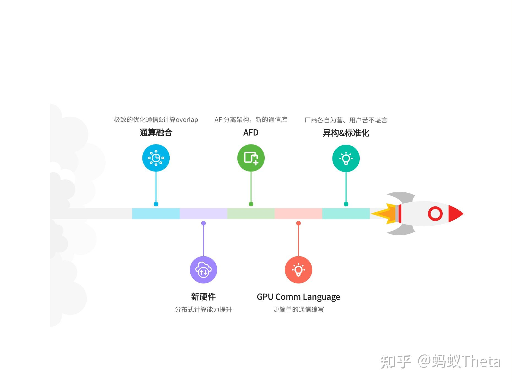

通信库技术发展方向：

- **通算融合**：为了降低成本，后续会进入优化的深水区，把通信库和算子库深度融合，实现更大比例的通信与计算重叠。
- **AFD（Attention 与 FFN 分离）**：目前的推理实例类似包含大量模块和特性的巨石应用，后续可能沿着传统 IT 系统的微服务方向演进。预填充—解码（PD）分离已成为云侧“事实标准”，更精细的 Attention 与 FFN 分离也会快速演进，并衍生新的通信模式和通信库。
- **新硬件**：使用超高速、低延迟网络连接的超节点服务器，相比传统 Scale-Out 扩展架构更能规避网络开销，充分发挥集群整体性能，并可能催生更低延迟的 Load/Store 内存通信。
- **GPU Comm Language**：目前集合通信库的编程方式非常底层且复杂。为了匹配大模型的发展速度，需要一种更高级、跨平台的通信编程语言，以便快速实现不同的集合通信算法，并减少多平台适配工作量。NCCL 2.28 推出的 Device API 已体现出这一趋势。
- **异构与标准化**：目前不同 AI 硬件厂商的软件栈通常只能适配自家硬件，用户体验和维护成本均不理想。未来需要推进接口标准化与多平台兼容，促进软件生态发展。

## 5. 关于我们

相比通算领域，大模型训练&推理性能优化是更加复杂的工程，不仅需要了解各种底层硬件，还需要熟悉上层框架&模型。随着 AI 行业和业务的发展，后续将有更多的工作和挑战供我们探索并攻克，希望我们在 DeepEP 上所做的工作能对大家有一些启发。

* * *

我们是蚂蚁集团网络技术团队，为蚂蚁集团全站提供通智一体、稳定高效的网络基础设施产品、平台和服务。在这里，我们专注集合通信库研发与性能攻坚，挑战大规模训推场景下算子优化、通信自愈稳定性等硬核课题。用代码重塑 AI 训推效率，用通信定义科技未来！

同时，团队也期待人才的加入！欢迎投递「**集合通信研发工程师/专家**」，联系方式：**fakang.wfk@antgroup.com**
