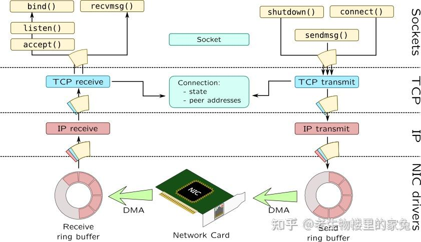
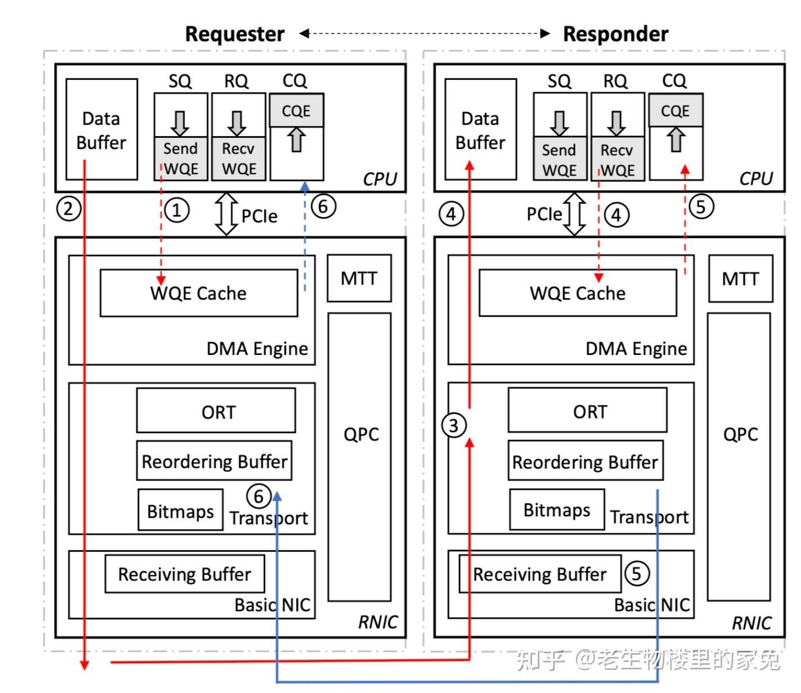
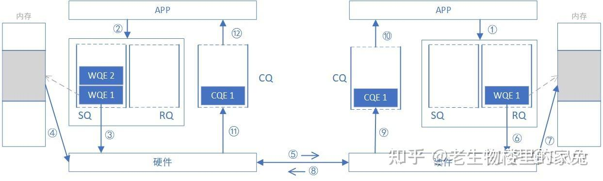
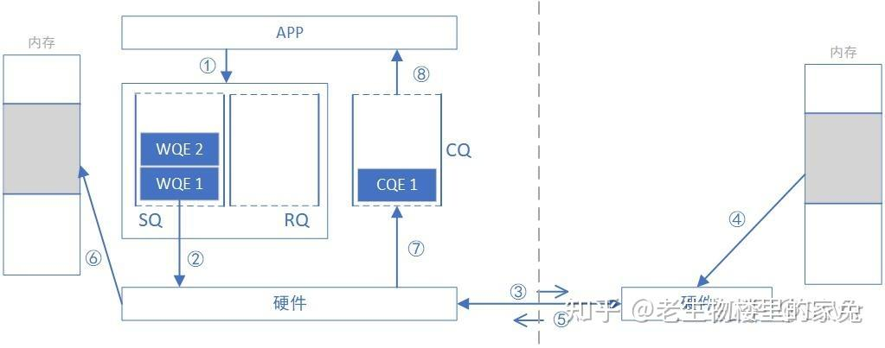
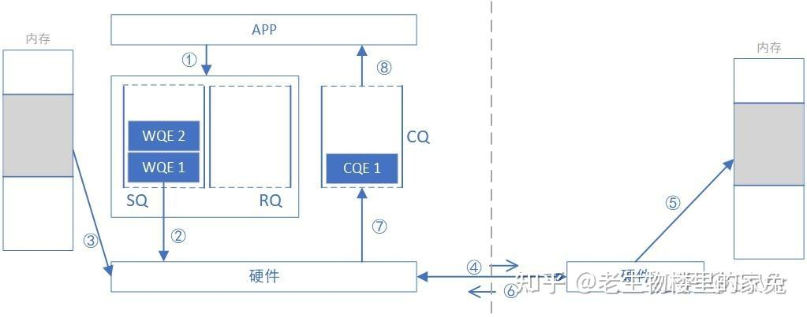
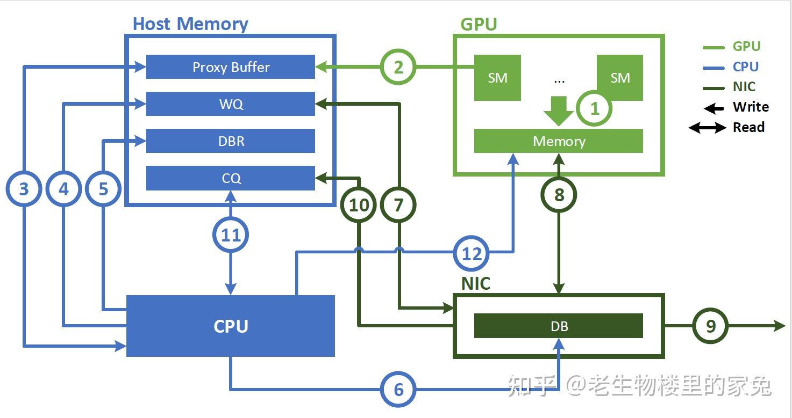
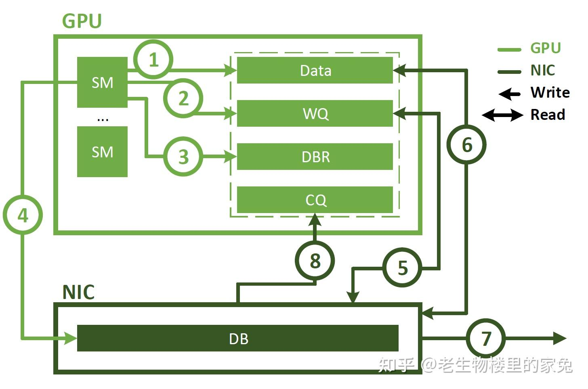

## 1. 引言

目前，[DeepSeek](https://zhida.zhihu.com/search?content_id=254238954&content_type=Article&match_order=1&q=DeepSeek&zhida_source=entity)已经爆火成为了“国运”级别的AI, 众多[Infra技术](https://zhida.zhihu.com/search?content_id=254238954&content_type=Article&match_order=1&q=Infra%E6%8A%80%E6%9C%AF&zhida_source=entity)博主也争相介绍DeepSeek-V3 Technical Report中的技术细节。但是，目前大家的关注度已然呈现"训推框架 > GPU >> Network"的分布趋势，这也蕴含着大家对Infra的关注趋势，毕竟能爽写python的人，谁会愿意苦哈哈的写C/C++呢？然而由于介绍训推框架和GPU的人太多了，各位博主已经介绍的十分详细清晰了，因此本文为大家科普一下DeepSeek中提到的\`IBGDA\`。

那么首先看一眼原文：

> Additionally, we leverage the IBGDA (NVIDIA, 2022) technology to further minimize latency and enhance communication efficiency.

原文也只是一笔待过，提到了DeepSeek中使用IBGDA进一步降低了延迟并提高了通信的效率。本文将从内核协议栈的问题谈起，并简要介绍RDMA网卡和编程的相关概念，最终再介绍NVIDIA IBGDA。本文假设大家已经知晓[GPU Direct RDMA](https://zhida.zhihu.com/search?content_id=254238954&content_type=Article&match_order=1&q=GPU+Direct+RDMA&zhida_source=entity)相关的技术。

## 2. [内核网络协议栈](https://zhida.zhihu.com/search?content_id=254238954&content_type=Article&match_order=1&q=%E5%86%85%E6%A0%B8%E7%BD%91%E7%BB%9C%E5%8D%8F%E8%AE%AE%E6%A0%88&zhida_source=entity)的制约

我们本科的时候都学过[计算机网络](https://zhida.zhihu.com/search?content_id=254238954&content_type=Article&match_order=1&q=%E8%AE%A1%E7%AE%97%E6%9C%BA%E7%BD%91%E7%BB%9C&zhida_source=entity)相关知识，当时老师们会教大家学习各种协议（TCP/UDP/IP...)、TCP 三次握手四次挥手、[滑动窗口](https://zhida.zhihu.com/search?content_id=254238954&content_type=Article&match_order=1&q=%E6%BB%91%E5%8A%A8%E7%AA%97%E5%8F%A3&zhida_source=entity)、重传等一系列的东西。但是当我们真正写代码的时候，好像什么都不用想，只需要无脑的send和recv就好了，代码示例如下：

```python
import socket
# 创建一个 TCP/IP 套接字
server_socket = socket.socket(socket.AF_INET, socket.SOCK_STREAM)
# 获取本地主机名
host = socket.gethostname()
port = 12345
# 绑定端口
server_socket.bind((host, port))
# 设置最大连接数，超过后排队
server_socket.listen(5)
while True:
    # 建立客户端连接
    client_socket, addr = server_socket.accept()
    print(f"连接地址: {str(addr)}")
    msg = '欢迎访问我的服务器！' + "\r\n"
    client_socket.send(msg.encode('utf-8'))
    # 接收客户端消息
    data = client_socket.recv(1024)
    print(f"收到客户端消息: {data.decode('utf-8')}")
    # 关闭连接
    client_socket.close()
```

上述代码中，我们模拟了[服务端](https://zhida.zhihu.com/search?content_id=254238954&content_type=Article&match_order=1&q=%E6%9C%8D%E5%8A%A1%E7%AB%AF&zhida_source=entity)用TCP协议做网络通信的过程。首先建立了一个socket，并跟客户端建立连接，最后发送并接收数据。一切都很简单，不需要考虑什么”三次握手、四次挥手、丢包重传、[拥塞控制](https://zhida.zhihu.com/search?content_id=254238954&content_type=Article&match_order=1&q=%E6%8B%A5%E5%A1%9E%E6%8E%A7%E5%88%B6&zhida_source=entity)“之类的。那么究竟是谁负重前行，帮我们做了这些事情呢？

常背[八股文](https://zhida.zhihu.com/search?content_id=254238954&content_type=Article&match_order=1&q=%E5%85%AB%E8%82%A1%E6%96%87&zhida_source=entity)的同学都知道，是[操作系统](https://zhida.zhihu.com/search?content_id=254238954&content_type=Article&match_order=1&q=%E6%93%8D%E4%BD%9C%E7%B3%BB%E7%BB%9F&zhida_source=entity)的内核协议栈劳苦功高，帮我们把复杂的事情在[内核态](https://zhida.zhihu.com/search?content_id=254238954&content_type=Article&match_order=1&q=%E5%86%85%E6%A0%B8%E6%80%81&zhida_source=entity)都做完了，并且给我们暴露了简洁的[用户态](https://zhida.zhihu.com/search?content_id=254238954&content_type=Article&match_order=1&q=%E7%94%A8%E6%88%B7%E6%80%81&zhida_source=entity)接口供我们使用。下图是操作系统的内核协议栈的简略版图示，在内核中协议栈是实现是分层的，正好对应到我们计网课学到的各层知识。由于本文并不想详细介绍相关内容，想深入学习的朋友可以去阅读[张彦飞](https://zhida.zhihu.com/search?content_id=254238954&content_type=Article&match_order=1&q=%E5%BC%A0%E5%BD%A6%E9%A3%9E&zhida_source=entity)老师的《[深入理解Linux网络](https://zhida.zhihu.com/search?content_id=254238954&content_type=Article&match_order=1&q=%E6%B7%B1%E5%85%A5%E7%90%86%E8%A7%A3Linux%E7%BD%91%E7%BB%9C&zhida_source=entity)》。

  



但是随着人们对[网络性能](https://zhida.zhihu.com/search?content_id=254238954&content_type=Article&match_order=1&q=%E7%BD%91%E7%BB%9C%E6%80%A7%E8%83%BD&zhida_source=entity)的需求日渐提高，内核网络协议栈反而成为了一种制约，原因如下：

-   收发报文时需要用户态与内核态的频繁切换，增大了时延
-   协议栈的处理链路较长，并且中间需要进行网络报文从内核态到用户态的拷贝，增大了[处理数据](https://zhida.zhihu.com/search?content_id=254238954&content_type=Article&match_order=1&q=%E5%A4%84%E7%90%86%E6%95%B0%E6%8D%AE&zhida_source=entity)报文的时间

面对上述问题，人们不得不重新思考该怎么解决[高性能网络](https://zhida.zhihu.com/search?content_id=254238954&content_type=Article&match_order=1&q=%E9%AB%98%E6%80%A7%E8%83%BD%E7%BD%91%E7%BB%9C&zhida_source=entity)传输的问题，主要的思想如下：

-   既然用户态到内核态开销太大，那就直接bypass kernel，在用户态负责网络报文的收发工作
-   数据拷贝会增加开销，那就直接把数据收到用户态的内存上，不需要内核态进行中转
-   让网卡硬件处理一部分软件协议栈的功能

RDMA就是使用了上述思想，实现了一套高性能网络的方案，并在技术的演进的长河中逐渐成为目前工业界广泛使用的高性能网络技术（当然，还有DPDK、TCP Hardware Offload等方案，但是目前看来并没有像RDMA一样成功）。

**本文对RDMA编程的介绍仅是入门级别，如果后续内容有不理解的地方，或想深入学习，可以看**

[https://zhuanlan.zhihu.com/p/164908617](https://zhuanlan.zhihu.com/p/164908617)

## 3. RDMA网络介绍

准确的讲，RDMA是一种网络协议，有不同的方式能够支持RDMA：

-   [InfiniBand](https://zhida.zhihu.com/search?content_id=254238954&content_type=Article&match_order=1&q=InfiniBand&zhida_source=entity)：InfiniBand(IB)是一个用于高性能计算的计算机网络通信标准，它是一家名为 InfiniBand Trade Association（IBTA）的组织发布的架构，该架构旨在提供一种高性能、低延迟的计算和存储互连技术。IB原生支持RDMA协议，然而它需要特殊的 NIC 和交换机来支持，并不能兼容[以太网](https://zhida.zhihu.com/search?content_id=254238954&content_type=Article&match_order=1&q=%E4%BB%A5%E5%A4%AA%E7%BD%91&zhida_source=entity)。因此如果想部署 IB，需要抛弃原有的建立在以太网上的[物理层](https://zhida.zhihu.com/search?content_id=254238954&content_type=Article&match_order=1&q=%E7%89%A9%E7%90%86%E5%B1%82&zhida_source=entity)和链路层设备，重新购买相应的设备。
-   [RoCE](https://zhida.zhihu.com/search?content_id=254238954&content_type=Article&match_order=1&q=RoCE&zhida_source=entity): RoCE 是由 IBTA 推广的基于以太网的 RDMA 协议, 它包括 RoCEv1和RoCEv2 两个版本。其中 RoCEv1 版本仍然使用 IB 的规范，将 IB 的物理层和链路层替换成了以太网的对应层。RoCEv2 把[网络层](https://zhida.zhihu.com/search?content_id=254238954&content_type=Article&match_order=1&q=%E7%BD%91%E7%BB%9C%E5%B1%82&zhida_source=entity)替换成了 UDP/IP 协议来实现 RDMA 协议。RoCEv2 需要支持其技术的特殊网卡，但是可以使用以太网的交换设备，能降低 RDMA 技术成本。
-   [iWARP](https://zhida.zhihu.com/search?content_id=254238954&content_type=Article&match_order=1&q=iWARP&zhida_source=entity) 协议由 IETF 推动的在 TCP/IP 基础上实现 RDMA 技术的协议。

### 3.1 [无损网络](https://zhida.zhihu.com/search?content_id=254238954&content_type=Article&match_order=1&q=%E6%97%A0%E6%8D%9F%E7%BD%91%E7%BB%9C&zhida_source=entity)

RDMA协议是建立在无损网络的假设下实现的。无损网络（Lossless Network） 是指网络通信过程中，不会丢失数据包或信息，能够保证数据可靠性和顺序完整性。对于[高性能计算](https://zhida.zhihu.com/search?content_id=254238954&content_type=Article&match_order=2&q=%E9%AB%98%E6%80%A7%E8%83%BD%E8%AE%A1%E7%AE%97&zhida_source=entity)和[数据中心](https://zhida.zhihu.com/search?content_id=254238954&content_type=Article&match_order=1&q=%E6%95%B0%E6%8D%AE%E4%B8%AD%E5%BF%83&zhida_source=entity)来说，尤其是在涉及大规模数据传输时，保证无丢包、低延迟和高[吞吐量](https://zhida.zhihu.com/search?content_id=254238954&content_type=Article&match_order=1&q=%E5%90%9E%E5%90%90%E9%87%8F&zhida_source=entity)是非常重要的。

这件事情可能会反直觉，因为我们计网课都在强调“链路层和网络层可能会丢包，[传输层](https://zhida.zhihu.com/search?content_id=254238954&content_type=Article&match_order=1&q=%E4%BC%A0%E8%BE%93%E5%B1%82&zhida_source=entity)TCP协议通过滑动窗口、超时重传等解决乱序丢包的问题”。但是我们可以想一下，就是因为TCP需要处理乱序和丢包，导致整个协议很复杂，如果假设是不丢包（或者丢包量和丢包率都极低）的场景，那么我们是否可以把传输层实现的更简单呢？答案是肯定的。

实际上现代数据中心通过[光纤](https://zhida.zhihu.com/search?content_id=254238954&content_type=Article&match_order=1&q=%E5%85%89%E7%BA%A4&zhida_source=entity)连接，本身丢包率就很低。Infiniband又通过在数据链路层进行[流量控制](https://zhida.zhihu.com/search?content_id=254238954&content_type=Article&match_order=1&q=%E6%B5%81%E9%87%8F%E6%8E%A7%E5%88%B6&zhida_source=entity)等方式，能够实现在链路层的无损网络。在这种情况下，我们的[传输层协议](https://zhida.zhihu.com/search?content_id=254238954&content_type=Article&match_order=1&q=%E4%BC%A0%E8%BE%93%E5%B1%82%E5%8D%8F%E8%AE%AE&zhida_source=entity)的逻辑就能简单些，并且还能把一部分功能卸载到[网卡硬件](https://zhida.zhihu.com/search?content_id=254238954&content_type=Article&match_order=2&q=%E7%BD%91%E5%8D%A1%E7%A1%AC%E4%BB%B6&zhida_source=entity)中实现，加速了网络传输的效率。RDMA便是依靠这种方式，提高了网络通信的效率。

## 4. RDMA介绍

我们用下面的RDMA概念模型来介绍RDMA。RDMA的编程模型更贴近硬件的实现。



图中包含很多信息，我们一步步分析：

-   首先，既然RDMA已经bypass了内核，那么CPU程序要发送数据时需要通知网卡，网卡收到数据时也需要CPU程序。那么软件和硬件怎么交互呢？RDMA中抽象出了Send Queue(SQ), Receive Queue(RQ), Complete Queue(CQ)来暴露给用户。用户想进行Send时，就往SQ中放一个叫做Send WQE(Work Queue Element)的元素；想进行Receive时，就往RQ中放一个叫做Recv WQE的元素。WQE中包含数据地址和长度等信息，网卡硬件收到后就可以进行数据收发。由于网络的传输是由硬件来做，此时CPU可以进行别的任务，因此整个过程是异步的。当网卡进行完收发操作后，就往Complete Queue(CQ)中放一个CQE元素，之后CPU通过查询CQ就能获取到完成信息。
-   其次，RDMA要和远端通信，那肯定也要像TCP一样建立连接，并维护和对端的连接信息（例如报文的序列号等）。这些信息都放到了QPC(Queue Pair Context)上了。注意到QPC在RNIC上，说明硬件可以维护这些信息并组装[包头](https://zhida.zhihu.com/search?content_id=254238954&content_type=Article&match_order=1&q=%E5%8C%85%E5%A4%B4&zhida_source=entity)，这就让硬件处理一部分软件协议栈的功能，实现了加速。
-   之后，RDMA实现了零拷贝，即把用户态数据直接DMA到[网卡](https://zhida.zhihu.com/search?content_id=254238954&content_type=Article&match_order=9&q=%E7%BD%91%E5%8D%A1&zhida_source=entity)的buffer并发送，避免了内核态的拷贝。这就需要用户先注册一部分用户的地址给网卡使用。但是用户态用的是[虚拟地址](https://zhida.zhihu.com/search?content_id=254238954&content_type=Article&match_order=1&q=%E8%99%9A%E6%8B%9F%E5%9C%B0%E5%9D%80&zhida_source=entity)，而网卡怎么通过虚拟地址对应到[物理地址](https://zhida.zhihu.com/search?content_id=254238954&content_type=Article&match_order=1&q=%E7%89%A9%E7%90%86%E5%9C%B0%E5%9D%80&zhida_source=entity)呢？RNIC上维护了MTT(Memory Translation Table)，它类似于操作系统的页表，维护虚拟地址到物理地址的对应关系。这样,RNIC就能找到对应的用户态地址并读取/写入了。具体把数据从内存到网卡的搬运，是使用了RNIC上的DMA Engine实现的。
-   最后，RNIC也需要维护收发报文相关的结构，例如Bacis NIC中的Receiving Buffer。上图中还有ORT, Reordering Buffer, Bitmap，这是因为这个图是论文中的图，而论文中这个RNIC可以在lossy network上工作，所以添加了一些用于保序和重传的[数据结构](https://zhida.zhihu.com/search?content_id=254238954&content_type=Article&match_order=1&q=%E6%95%B0%E6%8D%AE%E7%BB%93%E6%9E%84&zhida_source=entity)。注意到这些结构是在RNIC上，而如果是内核协议栈的话，是放在内核中。所以这里也是硬件处理了一部分[软件协议栈](https://zhida.zhihu.com/search?content_id=254238954&content_type=Article&match_order=3&q=%E8%BD%AF%E4%BB%B6%E5%8D%8F%E8%AE%AE%E6%A0%88&zhida_source=entity)的功能。

这里还要提一下DoorBell (DB)的概念，它经常出现在RDMA相关的资料和论文中：

Doorbell是一种软件发起、硬件接收的[通知机制](https://zhida.zhihu.com/search?content_id=254238954&content_type=Article&match_order=1&q=%E9%80%9A%E7%9F%A5%E6%9C%BA%E5%88%B6&zhida_source=entity)。例如软件通过Doorbell告诉硬件：

-   开始做某事：例如软件准备好WQE时，通知硬件开始处理
-   已经做完某事：例如软件读取CQE后，通知硬件”我已经取走CQE“

Doorbell有两种实现机制：

-   Doorbell[寄存器](https://zhida.zhihu.com/search?content_id=254238954&content_type=Article&match_order=1&q=%E5%AF%84%E5%AD%98%E5%99%A8&zhida_source=entity)。硬件提供的寄存器，来供软件读写。

-   优点：实现简单，只需要软件读写寄存器地址
-   缺点：读写寄存器行为会抢占总线；硬件需要立即响应，可能会打断硬件正在进行的工作（例如在DMA读取主机的内存），从而影响传输速率

-   Doorbell record。使用主机的一段内存作为中介。软件和硬件都知道这段内存的地址。软件直接写这段内存，硬件在必要时读取该内存

-   优点：软件通知时不需要抢总线
-   缺点：实时性较差

可以把DB理解成软件通知硬件的方式。

### 4.1 RDMA编程原语

在TCP/IP的内核协议栈提供的socket抽象中，通信是基于“流语义”的形式，流语义中不存在消息的边界。而RDMA的编程是基于“数据报语义”的形式，每个数据报都是一个独立的单元，有明确的边界。

在TCP/IP内核协议栈中，常用的数据传输的操作有send和recv。而在RDMA的操作中，常用的数据传输的操作有三种：

-   Send/Receive
-   Read
-   Write

### 4.2 RDMA Send/Recv

Send/Receive是一对双边操作。意思是他们的一次通信过程需要发送端和接收端两端的CPU参与。

如下图所示：

-   接收端往RQ中放一个Recv WQE, 里面包含接收的地址和长度(1)。
-   发送端往SQ中放一个Send WQE, 里面包含发送数据的地址和长度(2)。
-   [发送端](https://zhida.zhihu.com/search?content_id=254238954&content_type=Article&match_order=3&q=%E5%8F%91%E9%80%81%E7%AB%AF&zhida_source=entity)负责把数据从内存搬运到网卡中并发送。接收端网卡收到数据后，把数据搬运到接收端的Buffer中(3,4,5,6,7,8)。
-   发送端和接收端的网卡都会往CQ中放CQE(9, 11)。
-   发送端和接收端的CPU程序通过查询CQ, 获取到完成的通知(10, 12)。



与socket编程不同的是，在RDMA的Send/Receive操作中，接收端必须先于发送端进行Receive，然后发送端才能进行Send。这是因为为了零拷贝，网卡直接将接收的数据写入用户态的内存中。因此接收端需要先进行Receive操作，告知网卡“如果收到数据，应该把数据放到哪里”。之后发送端发送数据时，接收端网卡即可把数据写入接收端相应的内存中。如果接收端没有先进行Receive操作，那么网卡只能丢弃报文，并给发送端返回一个错误。

### 4.3 RDMA Read

RDMA Read和RDMA Write都属于单边操作，即只有发起操作的一方的CPU有感知，另一端无感知。

RDMA Read的意思是：发起操作的一方要读取远端内存的数据，到自己的内存中。

在操作开始前，两端会提前传输一些信息。在Read中，被读取数据的一端需要把自己的数据地址等信息告知对方，这样对面才能知道从哪里读取。



接下来：

-   左侧往SQ中放一个Send WQE, 里面包含要读取的对端数据的地址和长度，以及存放读到的数据的己方地址和长度 (1)。
-   网卡负责网络传输逻辑 (2, 3, 4, 5, 6)。
-   发起操作的一方的网卡往CQ中放CQE (7)。
-   发起操作的一方的CPU程序通过查询CQ, 获取到完成的通知 (8)。

注意到，上述过程中，右侧的CPU是无感知的。它并不知道自己的内存被别人读取过了。

### 4.4 RDMA Write

RDMA Write的意思是：发起操作的一方要把自己内存中的数据，写入到远端的内存中。

在操作开始前，两端会提前传输一些信息。在Write中，被写入数据的一端需要把自己的数据地址告知对方，这样对面才能知道写入哪里。



接下来：

-   左侧往SQ中放一个Send WQE, 里面包含己方的数据的地址和长度，以及要写入的对方的地址和长度 (1)。
-   网卡负责网络传输逻辑 (2, 3, 4, 5, 6)。
-   发起操作的一方的网卡都往CQ中放CQE (7)。
-   发起操作的一方的CPU程序通过查询CQ, 获取到完成的通知 (8)。

注意到，上述过程中，右侧的CPU是无感知的。它并不知道自己的内存被别人写入过了。

可以发现，RDMA的Read和Write可以实现远端内存无感知的访问。这也引发了一些”存算分离“、”统一内存“等设计方案。

## 5. GPU上的RDMA操作

通过上述介绍，我们已经简单的认识了RDMA的使用方式。那么在使用了GPU Direct RDMA的GPU中，网卡是怎么和GPU配合，实现将GPU的HBM的数据发送到远端的呢？



在引入InfiniBand GPUDirect Async(IBGDA)之前，是使用CPU上的代理线程来进行网络通信的。NCCL中也有类似的proxy thread和相应实现。

此时流程是这样的：

1.  应用程序启动一个CUDA kernel，在GPU内存中产生数据。
2.  kernel function通过往CPU memory中的proxy buffer写入数据的方式，通知CPU要进行网络操作。我们将这个通知称为work descriptor, 它包含源地址、目标地址、数据大小及其他必要的网络信息。
3.  CPU上的proxy thread收到worker descriptor，并发起相应的网络操作。CPU会更新host memory中的doorbell record (DBR) buffer。（This buffer is used in the recovery path in case the NIC drops the write to its doorbell. 就是用来记录doorbell的信息，万一硬件来不及及时响应doorbell并把它丢掉，你还能从DBR buffer中恢复doorbell）
4.  CPU通过写入NIC的 doorbell (DB)通知NIC。DB是NIC硬件中的一个寄存器。
5.  NIC从WQ中读取work descriptor。
6.  NIC使用GPUDirect RDMA直接从GPU内存搬运数据。
7.  NIC将数据传输到远程节点。
8.  NIC通过向主机内存中的CQ写入事件来指示网络操作已完成。
9.  CPU轮询CQ以检测网络操作的完成。
10.  CPU通知GPU操作已完成。

可以发现，这个过程竟然需要GPU, CPU, NIC三方参与。CPU就像是一个中转站，那么显然它有一些缺点：

-   proxy thread消耗了CPU cycles
-   proxy thread成为瓶颈，导致在[细粒度](https://zhida.zhihu.com/search?content_id=254238954&content_type=Article&match_order=1&q=%E7%BB%86%E7%B2%92%E5%BA%A6&zhida_source=entity)传输（小消息）时无法达到NIC的峰值吞吐。现代NIC每秒可以处理数亿个通信请求。GPU可以按照该速率生成请求，但CPU的处理速率低得多，造成了在细粒度通信时的瓶颈。

## 6. InfiniBand GPUDirect Async

优化的方法显而易见，能否绕过CPU，让GPU自己来和网卡做交换呢？IBGDA给出了这样的功能。



1.  CPU程序启动一个CUDA kernel function，在GPU内存中生成数据。
2.  使用SM创建一个NIC work descriptor，并将其直接写入WQ。与CPU proxy thread不同，该WQ区位于GPU内存中。
3.  SM更新DBR buffer，它也位于GPU内存中。
4.  SM通过写入NIC的DB寄存器通知NIC。
5.  NIC使用GPUDirect RDMA从WQ读取工作描述符。
6.  NIC使用GPUDirect RDMA读取GPU内存中的数据。
7.  NIC将数据传输到远程节点。
8.  NIC通过使用GPUDirect RDMA向CQ[缓冲区](https://zhida.zhihu.com/search?content_id=254238954&content_type=Article&match_order=1&q=%E7%BC%93%E5%86%B2%E5%8C%BA&zhida_source=entity)写入事件，通知GPU网络操作已完成。

可见，IBGDA消除了CPU在通信控制路径中的作用。在使用IBGDA时，GPU和NIC直接交换进行通信所需的信息。WQ和DBR buffer也被移到GPU内存中，以提高SM访问效率。

那么如何能使用上述功能呢？实际上NVIDIA OpenSHMEM Library (NVSHMEM)早已把IBGDA的能力加入进它的库中，并且NVSHMEM 为所有参与计算的 GPU 提供了一个统一的、对称的全局地址空间，方便用户的开发。DeepSeek开源的DeepEP也使用了NVSHMEM。

[https://link.zhihu.com/?target=https%3A//github.com/deepseek-ai/DeepEP](https://link.zhihu.com/?target=https%3A//github.com/deepseek-ai/DeepEP)

最后，[NVIDIA IBGDA Blog](https://link.zhihu.com/?target=https%3A//developer.nvidia.com/blog/improving-network-performance-of-hpc-systems-using-nvidia-magnum-io-nvshmem-and-gpudirect-async/)里面还展示了一些实验结果，大家可以看一下。
