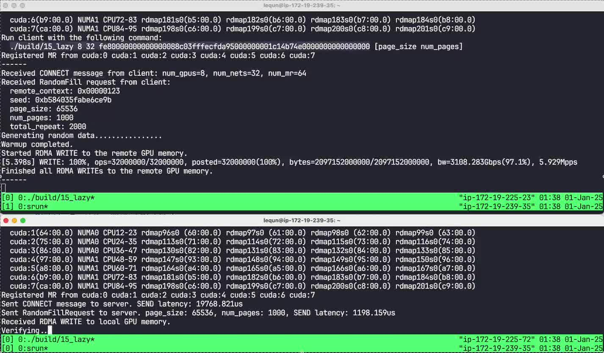

今年早些时候我有幸入职了 [Perplexity AI](https://www.perplexity.ai/hub/careers)，终于用上了最强配置的服务器——[AWS p5 实例](https://aws.amazon.com/ec2/instance-types/p5/)，上面搭载了 8 张 NVSwitch 互联的 NVIDIA H100 显卡。更令我兴奋的是，服务器之间搭载了 3200 Gbps 的超高速网络。我觉得要是我能写一个程序用上这 3200 Gbps 的带宽，一定是一件非常炫酷的事情！

3200 Gbps 网络测速

最近我花了一周的时间，大概摸到了一些门道，写了个小小的概念验证程序，用上了 95% 的带宽。因为我觉得这个摸索的过程挺有意思的，再加上网上关于 RDMA、GPUDirect RDMA、EFA、libfabric、高性能网络的文章和教程十分有限，所以我打算把我这一周学到的知识分享出来。既是一个记录，也可以当作一个入门教程来看。

对 MLSys 熟悉的朋友们可能要问了：这不是 PyTorch 或者 NCCL 一行代码就能搞定的事情吗？确实，NCCL 在集体通信（Collective Communication）方面已经非常成熟了，也是大语言模型的训练和推理的基石。然而在其他应用场景下，我觉得集体通信还是有一些不太适合的地方：

1.  集体通信需要建立起全局通信域（MPI World）。如果要动态地增加、减少或者替换集群中的节点，那么就需要先让整个集群停下来。
2.  集体通信采用了同步通信模型，不论实现方式是阻塞式的还是非阻塞式的，对我来说都是一种很强的心智负担。我更习惯的是像 gRPC 那样的异步通信模型。
3.  最重要的是，能自己造一个轮子不是很好玩吗？

因为我的实验环境是 AWS p5 集群，所以本文提到的一些技术细节可能只适用于 AWS p5 集群。不过我希望本文还是能对其他的高性能网络环境有一定的参考价值。

因为内容比较多，所以我把内容拆成了几篇文章，欢迎大家点击阅读：

-   [驾驭3200Gbps网络(0): 导言](https://zhuanlan.zhihu.com/p/14925828538)
-   [驾驭3200Gbps网络(1): RDMA和EFA](https://zhuanlan.zhihu.com/p/14932656965)
-   [驾驭3200Gbps网络(2): 高性能网络系统设计哲学](https://zhuanlan.zhihu.com/p/14932856737)
-   [驾驭3200Gbps网络(3): libfabric](https://zhuanlan.zhihu.com/p/14933249086)
-   [驾驭3200Gbps网络(4): 单向接收发送](https://zhuanlan.zhihu.com/p/15311843766)
-   [驾驭3200Gbps网络(5): 双向接收发送](https://zhuanlan.zhihu.com/p/15369995657)
-   [驾驭3200Gbps网络(6): GPUDirect RDMA WRITE](https://zhuanlan.zhihu.com/p/15591466384) 【97.433 Gbps (97.4%)】
-   [驾驭3200Gbps网络(7): 操作队列及带宽测试](https://zhuanlan.zhihu.com/p/15780296272)
-   [驾驭3200Gbps网络(8): 系统拓扑](https://zhuanlan.zhihu.com/p/15783439574)
-   [驾驭 3200 Gbps 网络(9): 使用 32 张网卡](https://zhuanlan.zhihu.com/p/15810491402) 【287.089 Gbps (9.0%)】
-   [驾驭3200Gbps网络(10): 测试前预热](https://zhuanlan.zhihu.com/p/15812571764) 【293.461 Gbps (9.2%)】
-   [驾驭3200Gbps网络(11): 多线程](https://zhuanlan.zhihu.com/p/15814205517) 【355.301 Gbps (11.1%)】
-   [驾驭3200Gbps网络(12): 绑定CPU核心](https://zhuanlan.zhihu.com/p/15816124517) 【1237.738 Gbps (38.7%)】
-   [驾驭3200Gbps网络(13): 状态分片](https://zhuanlan.zhihu.com/p/15818971516) 【1522.567 Gbps (47.6%)】
-   [驾驭3200Gbps网络(14): 批量提交操作](https://zhuanlan.zhihu.com/p/15824245120) 【2589.488 Gbps (80.9%)】
-   [驾驭3200Gbps网络(15): 惰性提交操作](https://zhuanlan.zhihu.com/p/15824390248) 【3108.283 Gbps (97.1%)】

在我的探索及写作过程中，得到了下面这些朋友的帮助，特此感谢：[Brian Barrett](https://github.com/bwbarrett)、[Shi Jin](https://github.com/shijin-aws)。同时我也非常感谢公司愿意让我花时间捣鼓这些技术，以及提供了这么强的硬件环境。

以下参考资料是我觉得非常有用的：

-   [libfabric 官方文档](https://ofiwg.github.io/libfabric/v2.0.0/man/)，尤其是介绍性的 [fi_intro(7)](https://ofiwg.github.io/libfabric/v2.0.0/man/fi_intro.7.html) 和 [fi_arch(7)](https://ofiwg.github.io/libfabric/v2.0.0/man/fi_arch.7.html)。在使用具体的 API 细节时，可以参阅各个 API 的文档。
-   [aws-ofi-nccl](https://github.com/aws/aws-ofi-nccl) 的代码。这是 AWS 的 NCCL 插件，是所有 AWS 上运行的多机机器学习任务的通信基础。这个代码库中有很多关于 `libfabric` 及 `efa` Provider 的实际应用例子。
-   [fabtests](https://github.com/ofiwg/libfabric/blob/main/fabtests/common/shared.c) 的代码。这是 `libfabric` 的测试工具，可以用来测试 `libfabric` 的性能。

文章的代码可以在 GitHub 中找到：[https://github.com/abcdabcd987/libfabric-efa-demo](https://github.com/abcdabcd987/libfabric-efa-demo)

[原文链接](https://abcdabcd987.com/2024/12/25/libfabric-efa-0-intro/)
