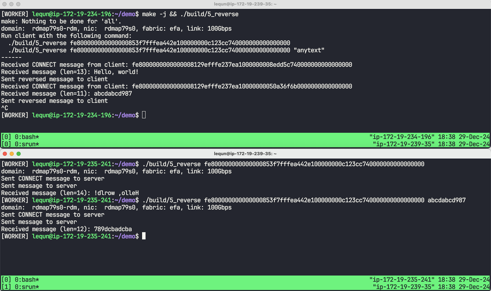

在[上一章](https://zhuanlan.zhihu.com/p/15311843766)中，我们实现了单向的接收和发送。在本章中，我们将拓展上一章的程序，实现双向的接收和发送。在服务器端收到客户端的消息后，对消息进行翻转，然后再发回给客户端。我们把这一个程序命名为 `5_reverse.cpp`。

## 不同类型的消息

要让服务器端能给客户端发消息，首先要让服务器端知道客户端的地址。因此我们首先让客户端向服务器端发送自己的地址，然后再向服务器端发送消息，最后再接收服务器端的消息。为了区分不同类型的消息，我们在消息头部加上一个 `type` 字段进行区分。

```cpp
enum class AppMessageType : uint8_t {
  kConnect = 0,
  kData = 1,
};

struct AppMessageBase {
  AppMessageType type;
};

struct AppConnectMessage {
  AppMessageBase base;
  EfaAddress client_addr;
};

struct AppDataMessage {
  AppMessageBase base;
  // Data follows
};
```

注意到 `AppDataMessage` 结构体中并没有定义长度，这是因为在发送时会指定缓冲区长度，在接收时会得到缓冲区长度。扣除掉消息头部的长度，就是数据的长度。

为什么不将 `CONNECT` 和 `DATA` 两个消息合并成一个消息呢？

1.  服务器端并不需要向客户端发送 `CONNECT` 消息，因此不需要在 `DATA` 消息中包含 `CONNECT` 的内容。
2.  对这两者进行拆分，让通信的逻辑更清晰。
3.  客户端也可以多次发送 `DATA` 消息，而不需要每次都发送 `CONNECT` 消息。
4.  在后面的章节中，我们会对 `CONNECT` 消息进行扩展，包含更多的信息。

## 服务器端逻辑

因为客户端会发送两个消息，所以服务器端需要维护一个状态机，来处理不同类型的消息。

```cpp
struct ReverseRequestState {
  fi_addr_t client_addr = FI_ADDR_UNSPEC;
  bool done = false;

  // ...
};
```

当收到 `CONNECT` 消息时，客户端会将客户端的地址添加到自己的地址向量中，并将其对应的 `fi_addr_t` 保存在状态机中。

```cpp
struct ReverseRequestState {
  // ...

  void HandleConnect(Network &net, RdmaOp &op) {
    auto *base_msg = (const AppMessageBase *)op.recv.buf->data;
    CHECK(base_msg->type == AppMessageType::kConnect);
    CHECK(op.recv.recv_size == sizeof(AppConnectMessage));
    auto *msg = (const AppConnectMessage *)base_msg;
    printf("Received CONNECT message from client: %s\n",
           msg->client_addr.ToString().c_str());
    client_addr = net.AddPeerAddress(msg->client_addr);
  }
};
```

当收到 `DATA` 消息时，服务器端会将消息翻转后再发回给客户端。并且将状态机的 `done` 置为 `true`。

```cpp
struct ReverseRequestState {
  // ...

  void HandleData(Network &net, RdmaOp &op) {
    auto *base_msg = (const AppMessageBase *)op.recv.buf->data;
    CHECK(base_msg->type == AppMessageType::kData);
    auto *msg = (uint8_t *)op.recv.buf->data + sizeof(*base_msg);
    auto len = op.recv.recv_size - sizeof(*base_msg);
    printf("Received message (len=%zu): %.*s\n", len, (int)len, msg);
    for (size_t i = 0, j = len - 1; i < j; ++i, --j) {
      auto t = msg[i];
      msg[i] = msg[j];
      msg[j] = t;
    }
    net.PostSend(client_addr, *op.recv.buf, op.recv.recv_size,
                 [this](Network &net, RdmaOp &op) {
                   printf("Sent reversed message to client\n");
                   done = true;
                 });
  }
};
```

尽管我们一次只处理一个客户端的请求，但是我们仍然需要使用两个缓冲区，以及提前提交两个 `RECV` 操作。这是因为，如果我们等到收到 `CONNECT` 之后再提交 `RECV`，那么客户端发送的数据有可能在提交第二个 `RECV` 之前就已经发出了，这样就会因为服务器端没有等待中的 `RECV` 操作而导致数据丢失。

因为这两个 `RECV` 操作是同时提交的，无法在指定回调函数的时候区分状态机的状态，所以我们需要让两者使用同样的回调函数，然后在回调函数中根据状态机的状态来决定下一步的操作。

```cpp
struct ReverseRequestState {
  // ...

  void OnRecv(Network &net, RdmaOp &op) {
    if (client_addr == FI_ADDR_UNSPEC) {
      HandleConnect(net, op);
    } else {
      HandleData(net, op);
    }
  }
};
```

最后就是服务器端的完整逻辑：

```cpp
int ServerMain(int argc, char **argv) {
  struct fi_info *info = GetInfo();
  auto net = Network::Open(info);

  // Allocate and register memory
  auto buf1 = Buffer::Alloc(kMessageBufferSize, kBufAlign);
  net.RegisterMemory(buf1);
  auto buf2 = Buffer::Alloc(kMessageBufferSize, kBufAlign);
  net.RegisterMemory(buf2);

  // Loop forever. Accept one client at a time.
  for (;;) {
    // State machine
    ReverseRequestState s;
    // RECV for CONNECT and DATA
    net.PostRecv(buf1, [&s](Network &net, RdmaOp &op) { s.OnRecv(net, op); });
    net.PostRecv(buf2, [&s](Network &net, RdmaOp &op) { s.OnRecv(net, op); });
    // Wait for completion
    while (!s.done) {
      net.PollCompletion();
    }
  }

  return 0;
}
```

## 客户端逻辑

客户端的逻辑也很简单。首先我们打开网络接口，并注册两个缓冲区。

```cpp
int ClientMain(int argc, char **argv) {
  CHECK(argc == 2 || argc == 3);
  auto server_addrname = EfaAddress::Parse(argv[1]);
  std::string message = argc == 3 ? argv[2] : "Hello, world!";

  struct fi_info *info = GetInfo();
  auto net = Network::Open(info);
  auto server_addr = net.AddPeerAddress(server_addrname);

  auto buf1 = Buffer::Alloc(kMessageBufferSize, kBufAlign);
  net.RegisterMemory(buf1);
  auto buf2 = Buffer::Alloc(kMessageBufferSize, kBufAlign);
  net.RegisterMemory(buf2);

  // ...
}
```

接着我们向服务器端发送 `CONNECT` 消息。

```cpp
// Send address to server
  auto *connect_msg = (AppConnectMessage *)buf1.data;
  connect_msg->base.type = AppMessageType::kConnect;
  connect_msg->client_addr = net.addr;
  bool connect_sent = false;
  net.PostSend(server_addr, buf1, sizeof(*connect_msg),
               [&connect_sent](Network &net, RdmaOp &op) {
                 printf("Sent CONNECT message to server\n");
                 connect_sent = true;
               });
  while (!connect_sent) {
    net.PollCompletion();
  }
```

接下来我们向服务器端发送 `DATA` 消息。为了保证能够接收到服务器端的回复，我们需要先提交一个 `RECV` 操作，再提交 `SEND` 操作。

```cpp
// Prepare to receive reversed message from server
  bool msg_received = false;
  net.PostRecv(buf2, [&msg_received](Network &net, RdmaOp &op) {
    auto *msg = (const char *)op.recv.buf->data;
    auto len = op.recv.recv_size;
    printf("Received message (len=%zu): %.*s\n", len, (int)len, msg);
    msg_received = true;
  });

  // Send message to server
  auto *data_msg = (AppDataMessage *)buf1.data;
  data_msg->base.type = AppMessageType::kData;
  memcpy((char *)buf1.data + sizeof(*data_msg), message.c_str(),
         message.size());
  net.PostSend(
      server_addr, buf1, sizeof(*data_msg) + message.size(),
      [](Network &net, RdmaOp &op) { printf("Sent message to server\n"); });
```

最后我们等待服务器端的回复。

```cpp
// Wait for message from server
  while (!msg_received) {
    net.PollCompletion();
  }

  return 0;
```

## 运行效果



完整代码可以在 GitHub 中找到：[https://github.com/abcdabcd987/libfabric-efa-demo](https://github.com/abcdabcd987/libfabric-efa-demo)