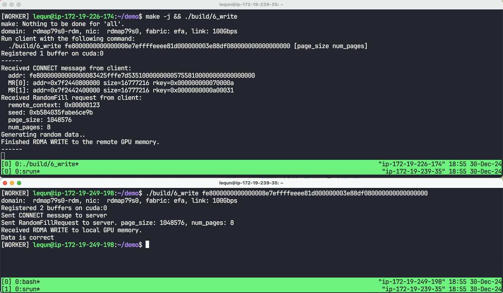

在[上一章](https://zhuanlan.zhihu.com/p/15369995657)中，我们实现了双向的 `RECV` 和 `SEND`，这两个操作都是双侧 RDMA 操作（Two-sided RDMA）。在本章中，我们将拓展上一章的程序，实现 `WRITE`，即直接写入远端的内存。`WRITE` 是一个单侧 RDMA 操作（One-sided RDMA），无需远端 CPU 的参与。在本章中，我们直接写入到 GPU 的内存。因为从 `libfabric` API 的角度来看，写入到宿主机内存和写到显存是一样的，所以如果读者的需求是写入到宿主机内存，只需要将显存的地址转换为宿主机内存的地址即可。我们把本章的程序命名为 `6_write.cpp`。

## 业务逻辑

从本章开始，我们都将假设我们在构建一个具有如下业务逻辑的应用程序。

想象我们在存储一些值，每个值可以用一个页编码（Page Index）来索引。一个值被分成了 `N*M` 份，分散存储在 `N` 个 GPU 中，每个 GPU 有 `M` 个大缓冲区。每个值在每个缓冲区中的大小都是相同的（Page Size）。客户端向服务器发送一个请求，要求服务器端按照给定的随机种子，在指定的页上填充随机数。大致的业务逻辑如下：

```python
def random_fill(seed: int,
                num_gpus: int,
                buf_addrs: list[int],
                page_size: int,
                page_indices: list[int]):
  bufs_per_gpu = len(buf_addrs) // num_gpus
  for gpu_idx in range(num_gpus):
    for gpu_buf_idx in range(bufs_per_gpu):
      buf_idx = gpu_idx * bufs_per_gpu + gpu_buf_idx
      rng = RandomGenerator(seed + buf_idx)
      for page_idx in page_indices:
        addr = buf_addrs[buf_idx] + page_idx * page_size
        rng.fill(addr, page_size)
```

在本章及后面的章节里面，我们都假设每个 GPU 上有两个缓冲区。

在本章中，我们侧重学习如何使用 RDMA WRITE，以及 GPUDirect RDMA（即网卡和 GPU 之间的直接数据传输）。因此，我们只考虑 1 个 GPU，以及传输非常少量的页。在后面的章节中，我们会让程序更健壮，能够传输更多的页面，以及支持多个 GPU、多个网卡。

## GPU 上的缓冲区

`libfabric` 支持访问其他设备的内存，这一特性在 `libfabric` 中称作 `HMEM`。对于 CUDA 设备，`libfabric` 有两种访问方式：通过 [GDRCopy](https://github.com/NVIDIA/gdrcopy) 库，以及通过 Linux 内核的 [dma-buf](https://www.kernel.org/doc/html/v6.12/driver-api/dma-buf.html)。我并没有找到关于这两者的文档，只能从 GitHub 上找到一些只言片语：

-   NCCL 在 CUDA 11.7 以上默认使用 dma-buf，对于不支持 dma-buf 的软硬件使用 GDR [\[1\]](https://github.com/NVIDIA/nccl/blob/v2.23.4-1/src/transport/net.cc#L779-L791)。
-   `libfabric` 的核心开发者 [Sean Hefty](https://github.com/shefty) 提到 dma-buf 和 GDR 类似，但是用的是更上游的机制 [\[2\]](https://github.com/ofiwg/libfabric/discussions/6540#discussioncomment-332019)。
-   `libfabric` 的 `efa` Provider 在探测 CUDA 的 p2p 支持时，会优先尝试 dma-buf [\[3\]](https://github.com/ofiwg/libfabric/blob/v2.0.0/prov/efa/src/efa_hmem.c#L127-L146)。

我自己的使用体验也感受不出两者的性能差异。我猜测对于新的软硬件，可能可以优先使用 dma-buf。不过在本文中，我会把两者的代码路径都写出来，以便读者参考。

在前面的文章里面，我们实现了 `Buffer` 类，里面所使用的地址是宿主机内存的地址。为了支持 GPU 上面的内存，我们额外增加两个成员：`cuda_device` 和 `dmabuf_fd`。同时我们增加一个函数用来从显存中分配空间。

```cpp
struct Buffer {
  void *data;
  size_t size;
  int cuda_device = -1;  // Added
  int dmabuf_fd = -1;    // Added

  bool is_cuda() const { return cuda_device >= 0; }

  static Buffer AllocCuda(size_t size, size_t align) {
    void *raw_data;
    struct cudaPointerAttributes attrs = {};
    CUDA_CHECK(cudaMalloc(&raw_data, size));
    CUDA_CHECK(cudaPointerGetAttributes(&attrs, raw_data));
    CHECK(attrs.type == cudaMemoryTypeDevice);
    int cuda_device = attrs.device;
    int fd = -1;
    CU_CHECK(cuMemGetHandleForAddressRange(
        &fd, (CUdeviceptr)align_up(raw_data, align), size,
        CU_MEM_RANGE_HANDLE_TYPE_DMA_BUF_FD, 0));
    return Buffer(raw_data, size, align, cuda_device, fd);
  }

  // ...
};
```

这里我们使用了 [cudaMalloc()](https://docs.nvidia.com/cuda/cuda-runtime-api/group__CUDART__MEMORY.html#group__CUDART__MEMORY_1g37d37965bfb4803b6d4e59ff26856356) 来从显存分配空间。然后我们使用 [cuMemGetHandleForAddressRange()](https://docs.nvidia.com/cuda/cuda-driver-api/group__CUDA__MEM.html#group__CUDA__MEM_1g51e719462c04ee90a6b0f8b2a75fe031) 来获取 `dmabuf_fd`。

## 注册内存区域

在注册内存区域的时候，我们也要做出一些变化：

```cpp
void Network::RegisterMemory(Buffer &buf) {
  struct fid_mr *mr;
  struct fi_mr_attr mr_attr = {
      .iov_count = 1,
      .access = FI_SEND | FI_RECV | FI_REMOTE_WRITE | FI_REMOTE_READ |
                FI_WRITE | FI_READ,
  };
  struct iovec iov = {.iov_base = buf.data, .iov_len = buf.size};
  struct fi_mr_dmabuf dmabuf = {
      .fd = buf.dmabuf_fd, .offset = 0, .len = buf.size, .base_addr = buf.data};
  uint64_t flags = 0;
  if (buf.is_cuda()) {
    mr_attr.iface = FI_HMEM_CUDA;
    mr_attr.device.cuda = buf.cuda_device;
    if (buf.dmabuf_fd != -1) {
      mr_attr.dmabuf = &dmabuf;
      flags = FI_MR_DMABUF;
    } else {
      mr_attr.mr_iov = &iov;
    }
  } else {
    mr_attr.mr_iov = &iov;
  }
  FI_CHECK(fi_mr_regattr(domain, &mr_attr, flags, &mr));
  this->mr[buf.data] = mr;
}
```

首先是 `access`。这里我们增加了本地及远程的单边 RDMA 读写权限。然后是根据不同的内存类型进行分别设置：

-   对于宿主机内存，我们需要使用 `mr_iov`。
-   对于使用 GDRCopy 的显存，我们使用 `mr_iov`，并且设置 `iface` 为 `FI_HMEM_CUDA`。
-   对于使用 dma-buf 的显存，我们使用 `dmabuf`，并且设置 `iface` 为 `FI_HMEM_CUDA`。因为 `mr_iov` 和 `dmabuf` 在同一个 `union` 里面，所以我们需要设置 `flags` 为 `FI_MR_DMABUF`，让 `libfabric` 知道我们使用的是 `dmabuf`。

## `WRITE` 操作

在之前的章节里面，我们构建了 `RdmaOp` 类用来保存 RDMA 操作的上下文，其中包含了 `RECV` 和 `SEND` 两种操作类型。`WRITE` 操作和前面两种操作类似，当操作结束后，完成队列中会有相应的上下文，因此我们需要增加一个保存 `WRITE` 操作上下文的类型。

另外一方面，因为 `WRITE` 是单边 RDMA 操作，所以目标节点并不会产生一个完成事件。例外的是，当 `WRITE` 操作带上一个立即数（Immediate Data）时，目标节点会产生一个完成事件。我们可以把这个立即数当作一个标志，用这个标志来查找对应的上下文。在[之前章节](https://zhuanlan.zhihu.com/p/14933249086)获取的 `fi_info` 信息中，我们可以看到 EFA 所支持的立即数大小为 4 字节。

```cpp
constexpr size_t kEfaImmDataSize = 4;

enum class RdmaOpType : uint8_t {
  kRecv = 0,
  kSend = 1,
  kWrite = 2,        // Added
  kRemoteWrite = 3,  // Added
};

struct RdmaWriteOp {
  Buffer *buf;
  size_t offset;
  size_t len;
  uint32_t imm_data;
  uint64_t dest_ptr;
  fi_addr_t dest_addr;
  uint64_t dest_key;
};
static_assert(std::is_pod_v<RdmaWriteOp>);

struct RdmaRemoteWriteOp {
  uint32_t op_id;
};
static_assert(std::is_pod_v<RdmaRemoteWriteOp>);
static_assert(sizeof(RdmaRemoteWriteOp) <= kEfaImmDataSize);

struct RdmaOp {
  RdmaOpType type;
  union {
    RdmaRecvOp recv;
    RdmaSendOp send;
    RdmaWriteOp write;               // Added
    RdmaRemoteWriteOp remote_write;  // Added
  };
  std::function<void(Network &, RdmaOp &)> callback;
};
```

接下来我们实现 `WRITE` 操作。

```cpp
void Network::PostWrite(RdmaWriteOp &&write,
                        std::function<void(Network &, RdmaOp &)> &&callback) {
  auto *op = new RdmaOp{
      .type = RdmaOpType::kWrite,
      .write = std::move(write),
      .callback = std::move(callback),
  };
  struct iovec iov = {
      .iov_base = (uint8_t *)write.buf->data + write.offset,
      .iov_len = write.len,
  };
  struct fi_rma_iov rma_iov = {
      .addr = write.dest_ptr,
      .len = write.len,
      .key = write.dest_key,
  };
  struct fi_msg_rma msg = {
      .msg_iov = &iov,
      .desc = &GetMR(*write.buf)->mem_desc,
      .iov_count = 1,
      .addr = write.dest_addr,
      .rma_iov = &rma_iov,
      .rma_iov_count = 1,
      .context = op,
      .data = write.imm_data,
  };
  uint64_t flags = 0;
  if (write.imm_data) {
    flags |= FI_REMOTE_CQ_DATA;
  }
  FI_CHECK(fi_writemsg(ep, &msg, flags)); // TODO: handle EAGAIN
}
```

因为 `WRITE` 操作的输入参数较多，为了使代码更清晰，我们使用了 `RdmaWriteOp` 结构体来保存输入参数。与 `SEND` 操作只需要指定发送端的 `[buf, buf+size)` 不同，`WRITE` 操作还需要指定目标端的内存地址。额外地，RDMA 为了防止未经授权的远程读写，还需要指定目标端内存区域的远程访问密钥（Remote Access Key）。我们在下文中会看到这个密钥是如何交换的。

对于带有立即数的 `WRITE` 操作，我们需要设置 `FI_REMOTE_CQ_DATA` 标志。这个标志会让目标端产生一个完成事件，我们可以通过这个完成事件来查找对应的上下文。

尽管 [fi_writemsg()](https://ofiwg.github.io/libfabric/v2.0.0/man/fi_rma.3.html) 支持多个发起端的 `iov` 以及多个目标端的 `rma_iov`，但是从 `fi_info` 中我们可以看到，EFA 只支持单个 `rma_iov`。因此，如果我们有多个不连续的内存区域需要写入，我们需要多次调用 `fi_writemsg()`。

另一个有趣的点是，在注册内存区域时，我们需要单独设置 dma-buf 的标志。但在 RDMA 操作中，我们并不需要关心内存区域在哪个设备上，也不关心是通过哪种机制访问的。

## `REMOTE WRITE` 回调函数

当 `WRITE` 操作带有立即数时，目标端会产生一个完成事件。如果目标端期待一个带有立即数的 `WRITE` 操作，那么我们可以提前设置好回调函数，以便在完成事件发生时调用。

```cpp
struct Network {
  // ...
  std::unordered_map<uint32_t, RdmaOp *> remote_write_ops;
};

void Network::AddRemoteWrite(
    uint32_t id, std::function<void(Network &, RdmaOp &)> &&callback) {
  CHECK(remote_write_ops.count(id) == 0);
  auto *op = new RdmaOp{
      .type = RdmaOpType::kRemoteWrite,
      .remote_write = RdmaRemoteWriteOp{.op_id = id},
      .callback = std::move(callback),
  };
  remote_write_ops[id] = op;
}
```

## 处理完成事件

在处理完成事件的时候，我们需要先判断是否是带有立即数的 `WRITE` 操作，即 `FI_REMOTE_WRITE`。如果是，我们需要从 `remote_write_ops` 中找到立即数 `cqe.data` 对应的上下文。如果是其他类型的操作，那么上下文就是 `cqe.op_context`。

```cpp
void HandleCompletion(Network &net, const struct fi_cq_data_entry &cqe) {
  RdmaOp *op = nullptr;
  if (cqe.flags & FI_REMOTE_WRITE) {
    // REMOTE WRITE does not have op_context
    uint32_t op_id = cqe.data;
    if (!op_id)
      return;
    auto it = net.remote_write_ops.find(op_id);
    if (it == net.remote_write_ops.end())
      return;
    op = it->second;
    net.remote_write_ops.erase(it);
  } else {
    // RECV / SEND / WRITE
    op = (RdmaOp *)cqe.op_context;
    if (!op)
      return;
    if (cqe.flags & FI_RECV) {
      op->recv.recv_size = cqe.len;
    } else if (cqe.flags & FI_SEND) {
      // Nothing special
    } else if (cqe.flags & FI_WRITE) {
      // Nothing special
    } else {
      fprintf(stderr, "Unhandled completion type. cqe.flags=%lx\n", cqe.flags);
      std::exit(1);
    }
  }
  if (op->callback)
    op->callback(net, *op);
  delete op;
}
```

## 应用程序消息

首先我们要修改 `AppConnectMessage`，告诉服务器端关于客户端内存区域的信息，包括每个内存区域的虚拟地址、大小、以及远程访问密钥。

```cpp
struct AppConnectMessage {
  struct MemoryRegion {
    uint64_t addr;
    uint64_t size;
    uint64_t rkey;
  };

  AppMessageBase base;
  EfaAddress client_addr;
  size_t num_mr;

  MemoryRegion &mr(size_t index) {
    CHECK(index < num_mr);
    return ((MemoryRegion *)((uintptr_t)&base + sizeof(*this)))[index];
  }

  size_t MessageBytes() const {
    return sizeof(*this) + num_mr * sizeof(MemoryRegion);
  }
};
```

然后我们增加一个新的消息类型 `AppRandomFillMessage`，用来告诉服务器端要在客户端的哪些页上填充随机数，以及页面大小和随机种子。另外，消息中还包含了 `remote_context`。之后服务器端会将 `remote_context` 作为立即数发送回客户端，以便客户端能够找到对应的上下文。

```cpp
struct AppRandomFillMessage {
  AppMessageBase base;
  uint32_t remote_context;
  uint64_t seed;
  size_t page_size;
  size_t num_pages;

  uint32_t &page_idx(size_t index) {
    CHECK(index < num_pages);
    return ((uint32_t *)((uintptr_t)&base + sizeof(*this)))[index];
  }

  size_t MessageBytes() const {
    return sizeof(*this) + num_pages * sizeof(uint32_t);
  }
};
```

在上面的这两个类型里，我们都先将固定长度的部分定义在结构体的最前面，然后通过指针的方式访问变长的部分。

## 服务器端逻辑

类似于上一章中的做法，我们使用一个状态机来处理两个不同类型的消息。

```cpp
struct RandomFillRequestState {
  Buffer *cuda_buf;
  fi_addr_t client_addr = FI_ADDR_UNSPEC;
  bool done = false;
  AppConnectMessage *connect_msg = nullptr;

  explicit RandomFillRequestState(Buffer *cuda_buf) : cuda_buf(cuda_buf) {}

  void OnRecv(Network &net, RdmaOp &op) {
    if (client_addr == FI_ADDR_UNSPEC) {
      HandleConnect(net, op);
    } else {
      HandleRequest(net, op);
    }
  }
};
```

当收到 `CONNECT` 消息时，我们把客户端的地址添加到服务器端的地址向量中，并且把这个 `CONNECT` 消息保存下来，以便后续使用。

```cpp
struct RandomFillRequestState {
  // ...

  void HandleConnect(Network &net, RdmaOp &op) {
    auto *base_msg = (AppMessageBase *)op.recv.buf->data;
    CHECK(base_msg->type == AppMessageType::kConnect);
    CHECK(op.recv.recv_size >= sizeof(AppConnectMessage));
    auto &msg = *(AppConnectMessage *)base_msg;
    CHECK(op.recv.recv_size == msg.MessageBytes());
    CHECK(msg.num_mr > 0);

    // Save the message. Note that we don't reuse the buffer.
    connect_msg = &msg;

    // Add the client to AV
    client_addr = net.AddPeerAddress(msg.client_addr);

    printf("Received CONNECT message from client:\n");
    printf("  addr: %s\n", msg.client_addr.ToString().c_str());
    for (size_t i = 0; i < msg.num_mr; i++) {
      printf("  MR[%zu]: addr=0x%012lx size=%lu rkey=0x%016lx\n", i,
             msg.mr(i).addr, msg.mr(i).size, msg.mr(i).rkey);
    }
  }
};
```

当收到 `RANDOM_FILL` 消息时，我们首先先在服务器端自己的 GPU 缓冲区上填充随机数。

```cpp
std::vector<uint8_t> RandomBytes(uint64_t seed, size_t size) { ... }

struct RandomFillRequestState {
  // ...

  void HandleRequest(Network &net, RdmaOp &op) {
    auto *base_msg = (const AppMessageBase *)op.recv.buf->data;
    CHECK(base_msg->type == AppMessageType::kRandomFill);
    CHECK(op.recv.recv_size >= sizeof(AppRandomFillMessage));
    auto &msg = *(AppRandomFillMessage *)base_msg;
    CHECK(op.recv.recv_size == msg.MessageBytes());

    printf("Received RandomFill request from client:\n");
    printf("  remote_context: 0x%08x\n", msg.remote_context);
    printf("  seed: 0x%016lx\n", msg.seed);
    printf("  page_size: %zu\n", msg.page_size);
    printf("  num_pages: %zu\n", msg.num_pages);

    // Generate random data and copy to local GPU memory
    printf("Generating random data");
    for (size_t i = 0; i < connect_msg->num_mr; ++i) {
      auto bytes = RandomBytes(msg.seed + i, msg.page_size * msg.num_pages);
      CUDA_CHECK(cudaMemcpy((uint8_t *)cuda_buf->data + i * bytes.size(),
                            bytes.data(), bytes.size(),
                            cudaMemcpyHostToDevice));
      printf(".");
      fflush(stdout);
    }
    printf("\n");

    // ...
  }
};
```

然后我们为每一页的数据提交一个 `WRITE` 操作。对于非最后一页的数据，我们跳过回调函数。对于最后一页的数据，我们在服务器端的回调函数中将状态机的 `done` 置为 `true`。并且我们在最后一页的 `WRITE` 操作中带上 `remote_context` 作为立即数，这样客户端的完成队列中就会有一个完成事件，并且客户端可以根据这个立即数找到对应的上下文。

```cpp
struct RandomFillRequestState {
  void HandleRequest(Network &net, RdmaOp &op) {
    // ...

    // RDMA WRITE the data to remote GPU.
    for (size_t i = 0; i < connect_msg->num_mr; ++i) {
      for (size_t j = 0; j < msg.num_pages; j++) {
        uint32_t imm_data = 0;
        std::function<void(Network &, RdmaOp &)> callback;
        if (i + 1 == connect_msg->num_mr && j + 1 == msg.num_pages) {
          // The last WRITE.
          imm_data = msg.remote_context;
          callback = [this](Network &net, RdmaOp &op) {
            CHECK(op.type == RdmaOpType::kWrite);
            done = true;
            printf("Finished RDMA WRITE to the remote GPU memory.\n");
          };
        }
        net.PostWrite(
            {.buf = cuda_buf,
             .offset = i * (msg.page_size * msg.num_pages) + j * msg.page_size,
             .len = msg.page_size,
             .imm_data = imm_data,
             .dest_ptr =
                 connect_msg->mr(i).addr + msg.page_idx(j) * msg.page_size,
             .dest_addr = client_addr,
             .dest_key = connect_msg->mr(i).rkey},
            std::move(callback));
      }
    }
  }
};
```

完成了以上部分之后，剩下的服务器端的主程序逻辑就十分简单了：

```cpp
constexpr size_t kMemoryRegionSize = 16 << 20;

int ServerMain(int argc, char **argv) {
  // Open Netowrk
  struct fi_info *info = GetInfo();
  auto net = Network::Open(info);

  // Allocate and register message buffer
  auto buf1 = Buffer::Alloc(kMessageBufferSize, kBufAlign);
  net.RegisterMemory(buf1);
  auto buf2 = Buffer::Alloc(kMessageBufferSize, kBufAlign);
  net.RegisterMemory(buf2);

  // Allocate and register CUDA memory
  auto cuda_buf = Buffer::AllocCuda(kMemoryRegionSize * 2, kBufAlign);
  net.RegisterMemory(cuda_buf);
  printf("Registered 1 buffer on cuda:%d\n", cuda_buf.cuda_device);

  // Loop forever. Accept one client at a time.
  for (;;) {
    printf("------\n");
    // State machine
    RandomFillRequestState s(&cuda_buf);
    // RECV for CONNECT
    net.PostRecv(buf1, [&s](Network &net, RdmaOp &op) { s.OnRecv(net, op); });
    // RECV for RandomFillRequest
    net.PostRecv(buf2, [&s](Network &net, RdmaOp &op) { s.OnRecv(net, op); });
    // Wait for completion
    while (!s.done) {
      net.PollCompletion();
    }
  }

  return 0;
}
```

## 客户端逻辑

客户端首先从命令行参数中获得服务器端的地址以及要写入的页面的大小和数量。

```cpp
int ClientMain(int argc, char **argv) {
  auto server_addrname = EfaAddress::Parse(argv[1]);
  size_t page_size = std::stoull(argv[2]);
  size_t num_pages = std::stoull(argv[3]);
  size_t max_pages = kMemoryRegionSize / page_size;
  CHECK(page_size * num_pages <= kMemoryRegionSize);

  // ...
}
```

然后打开网络接口，注册一个缓冲区用户发送消息，注册两个 GPU 缓冲区用来存储随机数。

```cpp
// Open Netowrk
  struct fi_info *info = GetInfo();
  auto net = Network::Open(info);
  auto server_addr = net.AddPeerAddress(server_addrname);

  // Allocate and register message buffer
  auto buf1 = Buffer::Alloc(kMessageBufferSize, kBufAlign);
  net.RegisterMemory(buf1);

  // Allocate and register CUDA memory
  auto cuda_buf1 = Buffer::AllocCuda(kMemoryRegionSize, kBufAlign);
  net.RegisterMemory(cuda_buf1);
  auto cuda_buf2 = Buffer::AllocCuda(kMemoryRegionSize, kBufAlign);
  net.RegisterMemory(cuda_buf2);
  printf("Registered 2 buffers on cuda:%d\n", cuda_buf1.cuda_device);
```

接着，向服务器端发送 `CONNECT` 消息。

```cpp
// Send address and MR to server
  auto &connect_msg = *(AppConnectMessage *)buf1.data;
  connect_msg = {
      .base = {.type = AppMessageType::kConnect},
      .client_addr = net.addr,
      .num_mr = 2,
  };
  connect_msg.mr(0) = {.addr = (uint64_t)cuda_buf1.data,
                       .size = kMemoryRegionSize,
                       .rkey = net.GetMR(cuda_buf1)->key};
  connect_msg.mr(1) = {.addr = (uint64_t)cuda_buf2.data,
                       .size = kMemoryRegionSize,
                       .rkey = net.GetMR(cuda_buf2)->key};
  bool connect_sent = false;
  net.PostSend(
      server_addr, buf1, connect_msg.MessageBytes(),
      [&connect_sent](Network &net, RdmaOp &op) { connect_sent = true; });
  while (!connect_sent) {
    net.PollCompletion();
  }
  printf("Sent CONNECT message to server\n");
```

在发送 `RANDOM_FILL` 请求之前，我们先设置 `REMOTE WRITE` 的回调函数。

```cpp
// Prepare to receive the last REMOTE WRITE from server
  bool last_remote_write_received = false;
  uint32_t remote_write_op_id = 0x123;
  net.AddRemoteWrite(remote_write_op_id,
                     [&last_remote_write_received](Network &net, RdmaOp &op) {
                       last_remote_write_received = true;
                     });
```

然后我们选中一些页面，发送 `RANDOM_FILL` 请求。

```cpp
// Prepare request
  uint64_t req_seed = ...;
  std::vector<uint32_t> page_idx = ...;

  // Send message to server
  auto &req_msg = *(AppRandomFillMessage *)buf1.data;
  req_msg = {
      .base = {.type = AppMessageType::kRandomFill},
      .remote_context = remote_write_op_id,
      .seed = req_seed,
      .page_size = page_size,
      .num_pages = num_pages,
  };
  for (size_t i = 0; i < num_pages; i++) {
    req_msg.page_idx(i) = page_idx[i];
  }
  bool req_sent = false;
  net.PostSend(server_addr, buf1, req_msg.MessageBytes(),
               [&req_sent](Network &net, RdmaOp &op) { req_sent = true; });
  while (!req_sent) {
    net.PollCompletion();
  }
  printf("Sent RandomFillRequest to server. page_size: %zu, num_pages: %zu\n",
         page_size, num_pages);
```

等待最后一个 `REMOTE WRITE` 操作的完成，最后验证收到的数据是正确的。

```cpp
// Wait for REMOTE WRITE from server
  while (!last_remote_write_received) {
    net.PollCompletion();
  }
  printf("Received RDMA WRITE to local GPU memory.\n");

  // Verify data
  auto expected1 = RandomBytes(req_seed, page_size * num_pages);
  auto expected2 = RandomBytes(req_seed + 1, page_size * num_pages);
  auto actual1 = std::vector<uint8_t>(page_size * num_pages);
  auto actual2 = std::vector<uint8_t>(page_size * num_pages);
  for (size_t i = 0; i < num_pages; i++) {
    CUDA_CHECK(cudaMemcpy(actual1.data() + i * page_size,
                          (uint8_t *)cuda_buf1.data + page_idx[i] * page_size,
                          page_size, cudaMemcpyDeviceToHost));
    CUDA_CHECK(cudaMemcpy(actual2.data() + i * page_size,
                          (uint8_t *)cuda_buf2.data + page_idx[i] * page_size,
                          page_size, cudaMemcpyDeviceToHost));
  }
  CHECK(expected1 == actual1);
  CHECK(expected2 == actual2);
  printf("Data is correct\n");

  return 0;
```

## 运行效果



完整代码可以在 GitHub 中找到：[https://github.com/abcdabcd987/libfabric-efa-demo](https://github.com/abcdabcd987/libfabric-efa-demo)
