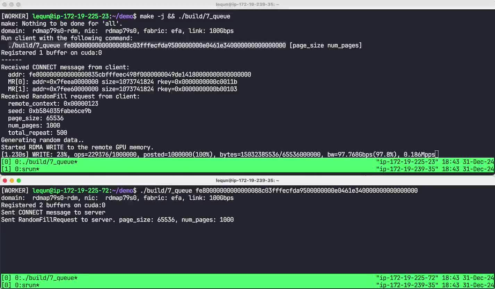

在[上一章](https://zhuanlan.zhihu.com/p/15591466384)中，我们实现了 GPUDirect RDMA WRITE。但是在上一章的程序中，我们只是一次性提交了 16 个 `WRITE` 操作。如果我们传输更多数据，因为网络的拥塞，`fi_writemsg()` 就会返回 `-EAGAIN`，而我们的程序并没有处理这种情况。在这一章里，我们将实现一个操作队列，将暂时无法提交的操作放到队列里，等待网络拥塞消失后再提交。与此同时，我们可以顺便测试一下我们的程序能达到多少带宽。我们把这个程序命名为 `7_queue.cpp`。

## 操作队列

首先我们在 `Network` 类中添加一个操作队列，保存所有未完成的操作。

```cpp
struct Network {
  // ...
  std::deque<RdmaOp *> pending_ops;
};
```

接下来，我们增加一个函数用来尽可能多地提交操作，直到提交完所有操作或者遇到 `EAGAIN`。

```cpp
void Network::ProgressPendingOps() {
  while (!pending_ops.empty()) {
    auto *op = pending_ops.front();
    pending_ops.pop_front();
    ssize_t ret = 0;
    switch (op->type) {
    case RdmaOpType::kRecv:
      ret = fi_recvmsg(...);
      break;
    case RdmaOpType::kSend:
      ret = fi_sendmsg(...);
      break;
    case RdmaOpType::kWrite:
      ret = fi_writemsg(...);
      break;
    case RdmaOpType::kRemoteWrite:
      CHECK(false); // Unreachable
      break;
    }
    if (ret == -FI_EAGAIN) {
      // Put it back to the front of the queue
      pending_ops.push_front(op);
      break;
    }
    if (ret) {
      // Unexpected error. Don't put it back.
      // Delete the op since it's not going to be in the completion queue.
      delete op;
      fprintf(stderr, "Failed to ProgressPendingOps. ret=%ld (%s)\n",
              ret, fi_strerror(-ret));
      fflush(stderr);
      break;
    }
  }
}
```

因为提交操作的主体（即 `fi_{recv,send,write}msg()`）已经转移到了 `ProgressPendingOps()` 函数中，所以我们的 `Post{Recv,Send,Write}()` 函数要做的事情就很简单了，只需要把操作放到队列里，然后调用 `ProgressPendingOps()`。

```cpp
void Network::PostRecv(...) {
  auto *op = new RdmaOp{ ... };
  pending_ops.push_back(op);
  ProgressPendingOps();
}

void Network::PostSend(...) {
  auto *op = new RdmaOp{ ... };
  pending_ops.push_back(op);
  ProgressPendingOps();
}

void Network::PostWrite(...) {
  auto *op = new RdmaOp{ ... };
  pending_ops.push_back(op);
  ProgressPendingOps();
}
```

最后，我们还需要修改 `PollCompletion()` 函数。当我们收到了一些完成事件时，这意味着网络可能腾出了一些空间，我们可以尝试提交更多操作。因此我们在处理完完成队列之后，再次调用 `ProgressPendingOps()`。

```cpp
void Network::PollCompletion() {
  // Process completions
  struct fi_cq_data_entry cqe[kCompletionQueueReadCount];
  for (;;) {
    auto ret = fi_cq_read(cq, cqe, kCompletionQueueReadCount);
    // ...
  }

  // Try to make progress.
  ProgressPendingOps();
}
```

以上就是对 `Network` 类的全部修改。加上这些修改之后，我们的网络库就可以处理网络拥塞的情况了。

## 服务器端逻辑

在之前的程序里面，服务器端会一口气将所有的 `WRITE` 操作提交出去，再回到主循环中处理完成队列。这样的逻辑在网络拥塞的情况下是不可行的。当 `EAGAIN` 出现的时候，我们必须等待之前的一些操作完成，并且处理完成队列。如果我们不处理完成队列，哪怕网络拥塞消失了，我们也无法提交新的操作。因此我们需要修改服务器端的逻辑，交替提交新的操作和处理完成队列。

为了让我们的带宽测试时间更长，我们将每个 `WRITE` 操作重复 500 次。

现在，让我们开始修改服务器端的状态机。首先让我们重新定义状态机结构体中的成员。我们需要增加一个 `State` 枚举类型表示状态机的状态；增加一个 `WriteState` 结构体以保存循环变量；以及我们增加一些成员变量用记录带宽测试的开始时间和当前进度。

```cpp
struct RandomFillRequestState {
  enum class State {
    kWaitRequest,
    kWrite,
    kDone,
  };

  struct WriteState {
    size_t i_repeat;
    size_t i_buf;
    size_t i_page;
  };

  Network *net;
  Buffer *cuda_buf;
  size_t total_bw = 0;
  State state = State::kWaitRequest;

  fi_addr_t client_addr = FI_ADDR_UNSPEC;
  AppConnectMessage *connect_msg = nullptr;
  AppRandomFillMessage *request_msg = nullptr;

  size_t total_repeat = 500;
  WriteState write_state;
  size_t total_write_ops = 0;
  size_t write_op_size = 0;
  size_t posted_write_ops = 0;
  size_t finished_write_ops = 0;
  std::chrono::time_point<std::chrono::high_resolution_clock> write_start_at;
};
```

当服务器端收到 `RANDOM_FILL` 请求时，我们不再一次性提交所有的 `WRITE` 操作。而是设置好相关的变量，将状态机转移到 `kWrite` 状态。

```cpp
struct RandomFillRequestState {
  // ...

  void HandleRequest(Network &net, RdmaOp &op) {
    // ...
    // Generate random data and copy to local GPU memory
    // ...

    // Prepare RDMA WRITE the data to remote GPU.
    total_write_ops =
        connect_msg->num_mr * request_msg->num_pages * total_repeat;
    posted_write_ops = 0;
    finished_write_ops = 0;
    write_op_size = request_msg->page_size;
    write_state = {.i_repeat = 0, .i_buf = 0, .i_page = 0};
    write_start_at = std::chrono::high_resolution_clock::now();
    state = State::kWrite;
    printf("Started RDMA WRITE to the remote GPU memory.\n");
  }
};
```

我们把提交 `WRITE` 操作的代码放到一个新函数中：

```cpp
struct RandomFillRequestState {
  // ...

  void ContinuePostWrite() {
    auto &s = write_state;
    if (s.i_repeat == total_repeat)
      return;
    auto page_size = request_msg->page_size;
    auto num_pages = request_msg->num_pages;

    uint32_t imm_data = 0;
    if (s.i_repeat + 1 == total_repeat && s.i_buf + 1 == connect_msg->num_mr &&
        s.i_page + 1 == num_pages) {
      // The last WRITE. Pass remote context back.
      imm_data = request_msg->remote_context;
    }
    net->PostWrite(
        RdmaWriteOp{ ... },
        [this](Network &net, RdmaOp &op) { HandleWriteCompletion(); });
    ++posted_write_ops;

    if (++s.i_page == num_pages) {
      s.i_page = 0;
      if (++s.i_buf == connect_msg->num_mr) {
        s.i_buf = 0;
        ++s.i_repeat;
      }
    }
  }
};
```

在 `ContinuePostWrite()` 中，如果还有 `WRITE` 操作没有提交，我们就提交一个新的 `WRITE` 操作。与上一章不同的是，我们对于每一个 `WRITE` 操作都设置了一个回调函数 `HandleWriteCompletion()`。在这个回调函数中，我们会输出当前的进度以及带宽。当最后一个 `WRITE` 操作完成时，我们将状态机转移到 `kDone` 状态。

```cpp
struct RandomFillRequestState {
  // ...

  void PrintProgress(...) { ... }

  void HandleWriteCompletion() {
    ++finished_write_ops;
    if (finished_write_ops % 16384 == 0) {
      auto now = std::chrono::high_resolution_clock::now();
      PrintProgress(now, posted_write_ops, finished_write_ops);
    }
    if (finished_write_ops == total_write_ops) {
      auto now = std::chrono::high_resolution_clock::now();
      PrintProgress(now, posted_write_ops, finished_write_ops);
      printf("\nFinished all RDMA WRITEs to the remote GPU memory.\n");
      state = State::kDone;
    }
  }
};
```

最后，我们修改服务器端的主循环。除了每次处理完成队列之外，我们还要检查状态机的状态。如果状态机处于 `kWrite` 状态，我们就继续提交 `WRITE` 操作。

```cpp
int ServerMain(int argc, char **argv) {
  // ...

  // Loop forever. Accept one client at a time.
  for (;;) {
    printf("------\n");
    // State machine
    RandomFillRequestState s(&net, &cuda_buf);
    // RECV for CONNECT
    net.PostRecv(buf1, [&s](Network &net, RdmaOp &op) { s.OnRecv(net, op); });
    // RECV for RandomFillRequest
    net.PostRecv(buf2, [&s](Network &net, RdmaOp &op) { s.OnRecv(net, op); });
    // Wait for completion
    while (s.state != RandomFillRequestState::State::kDone) {
      net.PollCompletion();
      switch (s.state) {
      case RandomFillRequestState::State::kWaitRequest:
        break;
      case RandomFillRequestState::State::kWrite:
        s.ContinuePostWrite();
        break;
      case RandomFillRequestState::State::kDone:
        break;
      }
    }
  }
  return 0;
}
```

## 客户端逻辑

客户端的逻辑不需要大的修改。唯一的一点小小的改动就是，我们增加 GPU 上缓冲区的大小，并且把默认的页面大小减小为 64 KiB，把默认传输的页面数量增加到1000。因为传输的页数变多了，所以 `RANDOM_FILL` 消息的大小也增大了，所以我们也增大了用于接收和发送的缓冲区的大小。

```cpp
constexpr size_t kMessageBufferSize = 1 << 20;
constexpr size_t kMemoryRegionSize = 1UL << 30;

int ClientMain(int argc, char **argv) {
  size_t page_size = 65536;
  size_t num_pages = 1000;
  // ...
}
```

## 运行效果



97.844 Gbps 传输速度

可以看到，传输速度达到了 97.844 Gbps，几乎打满了带宽。

完整代码可以在 GitHub 中找到：[https://github.com/abcdabcd987/libfabric-efa-demo](https://github.com/abcdabcd987/libfabric-efa-demo)
