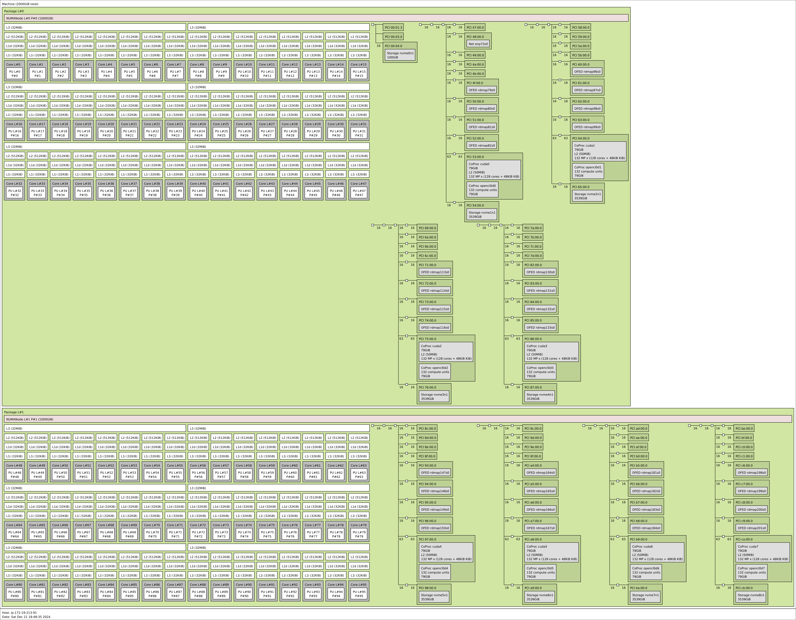
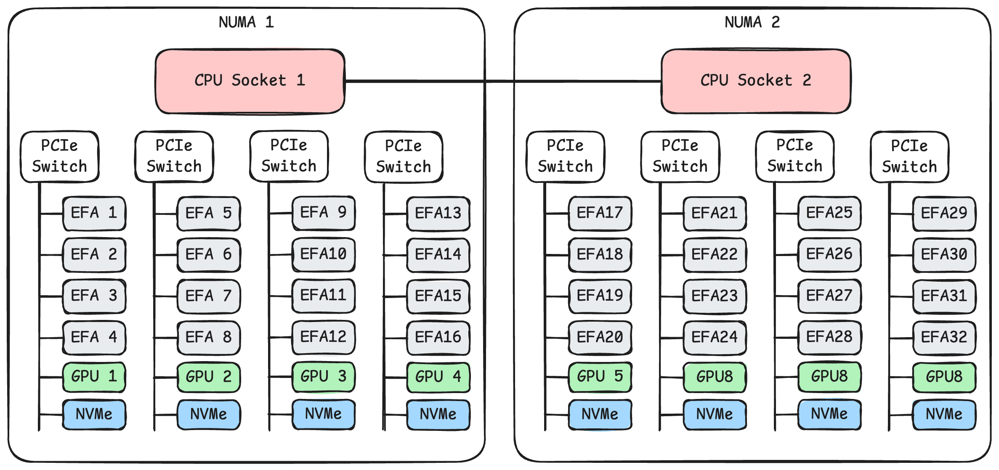
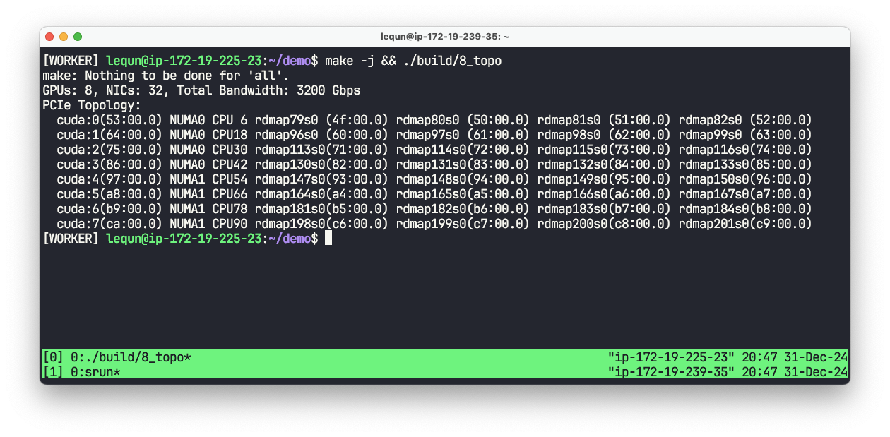

在[上一章](https://zhuanlan.zhihu.com/p/15780296272)中，我们在单张网卡上达到了 97.844 Gbps 的传输速度。在[第二章](https://zhuanlan.zhihu.com/p/14932856737)中我们已经介绍了，把显卡和邻近的网卡配对在一起才能达到最佳的传输速度。在我们开始使用多张网卡之前，我们在这一章先搞清楚机器的系统拓扑。我们把这个程序命名为 `8_topo.cpp`。

## 获取系统拓扑

在 Linux 上要获取系统拓扑，可以使用 `hwloc` 库，其中包含了一个命令行工具 `lstopo`，可以生成系统拓扑的图。我们运行 `lstopo`，可以看到下面的拓扑图：



稍微简化一下，AWS p5 实例的系统拓扑如下图所示：



可以看到系统安装了两块 CPU，每块 CPU 下面连接着 4 个 PCIe 交换机。每个 PCIe 交换机下面挂载了 4 张 100 Gbps 的 EFA 网卡，1 张 NVIDIA H100 显卡，以及一块 3.84 TB 的 NVMe SSD。

另一种获得系统拓扑的方法是使用 `lspci -tv` 命令。我们可以看到每个 PCIe 交换机的地址，以及每个 PCIe 交换机下面挂载的设备。例如：

```text
-+-[0000:bb]---00.0-[bc-cb]----00.0-[bd-cb]--+-01.0-[c6]----00.0  Amazon.com, Inc. Elastic Fabric Adapter (EFA)
 |                                           +-01.1-[c7]----00.0  Amazon.com, Inc. Elastic Fabric Adapter (EFA)
 |                                           +-01.2-[c8]----00.0  Amazon.com, Inc. Elastic Fabric Adapter (EFA)
 |                                           +-01.3-[c9]----00.0  Amazon.com, Inc. Elastic Fabric Adapter (EFA)
 |                                           +-01.4-[ca]----00.0  NVIDIA Corporation GH100 [H100 SXM5 80GB]
 |                                           \-01.5-[cb]----00.0  Amazon.com, Inc. NVMe SSD Controller
 +-[0000:aa]---00.0-[ab-ba]----00.0-[ac-ba]--+-01.0-[b5]----00.0  Amazon.com, Inc. Elastic Fabric Adapter (EFA)
 |                                           +-01.1-[b6]----00.0  Amazon.com, Inc. Elastic Fabric Adapter (EFA)
 |                                           +-01.2-[b7]----00.0  Amazon.com, Inc. Elastic Fabric Adapter (EFA)
 |                                           +-01.3-[b8]----00.0  Amazon.com, Inc. Elastic Fabric Adapter (EFA)
 |                                           +-01.4-[b9]----00.0  NVIDIA Corporation GH100 [H100 SXM5 80GB]
 |                                           \-01.5-[ba]----00.0  Amazon.com, Inc. NVMe SSD Controller
...
```

在 Linux 上，PCI 地址具有如下格式：

```text
XXXX:BB:DD.F
```

-   `XXXX` 是 PCI 域（Domain）的编号，是一个用 4 个字符的十六进制数表示的 16 位整数，通常是 `0000`。
-   `BB` 是总线（Bus）的编号，是一个用 2 个字符的十六进制数表示的 8 位整数。
-   `DD` 是设备（Device）的编号，是一个用 2 个字符的十六进制数表示的 5 位整数。
-   `F` 是功能（Function）的编号，是一个用 1 个字符的十六进制数表示的 3 位整数。

要在程序中获得系统拓扑，最常见的办法就是使用 [hwloc](https://github.com/open-mpi/hwloc)库，这也是 [aws-ofi-nccl](https://github.com/aws/aws-ofi-nccl/blob/v1.13.2-aws/src/nccl_ofi_topo.c) 所使用的方法。但是因为我不想引入额外的依赖，所以我选择直接读取 Linux 的 `/sys` 文件系统。

## Linux sysfs

在 `/sys/bus/pci/devices/` 目录下，列出了所有的 PCI 设备。每一个 PCI 设备都是一个软链接，指向 `/sys/devices/` 中的路径，而这个路径本身就反映了设备的拓扑结构。例如：

```text
$ ls -la /sys/bus/pci/devices/
...
0000:b5:00.0 -> ../../../devices/pci0000:aa/0000:aa:00.0/0000:ab:00.0/0000:ac:01.0/0000:b5:00.0
0000:b6:00.0 -> ../../../devices/pci0000:aa/0000:aa:00.0/0000:ab:00.0/0000:ac:01.1/0000:b6:00.0
0000:b7:00.0 -> ../../../devices/pci0000:aa/0000:aa:00.0/0000:ab:00.0/0000:ac:01.2/0000:b7:00.0
0000:b8:00.0 -> ../../../devices/pci0000:aa/0000:aa:00.0/0000:ab:00.0/0000:ac:01.3/0000:b8:00.0
0000:b9:00.0 -> ../../../devices/pci0000:aa/0000:aa:00.0/0000:ab:00.0/0000:ac:01.4/0000:b9:00.0
0000:ba:00.0 -> ../../../devices/pci0000:aa/0000:aa:00.0/0000:ab:00.0/0000:ac:01.5/0000:ba:00.0
...
0000:c6:00.0 -> ../../../devices/pci0000:bb/0000:bb:00.0/0000:bc:00.0/0000:bd:01.0/0000:c6:00.0
0000:c7:00.0 -> ../../../devices/pci0000:bb/0000:bb:00.0/0000:bc:00.0/0000:bd:01.1/0000:c7:00.0
0000:c8:00.0 -> ../../../devices/pci0000:bb/0000:bb:00.0/0000:bc:00.0/0000:bd:01.2/0000:c8:00.0
0000:c9:00.0 -> ../../../devices/pci0000:bb/0000:bb:00.0/0000:bc:00.0/0000:bd:01.3/0000:c9:00.0
0000:ca:00.0 -> ../../../devices/pci0000:bb/0000:bb:00.0/0000:bc:00.0/0000:bd:01.4/0000:ca:00.0
0000:cb:00.0 -> ../../../devices/pci0000:bb/0000:bb:00.0/0000:bc:00.0/0000:bd:01.5/0000:cb:00.0
...
```

对比前面的 `lspci -tv` 结果可以看到，显卡 `[ca]` 和 4 张网卡 `[c6]` `[c7]` `[c8]` `[c9]` 都挂载在 PCIe 交换机 `[bd]` 下面。通过这个软链接结构，我们就可以构建出系统的拓扑结构。

## 获取显卡的 PCI 地址

通过 [cudaGetDeviceProperties()](https://docs.nvidia.com/cuda/cuda-runtime-api/group__CUDART__DEVICE.html#group__CUDART__DEVICE_1g1bf9d625a931d657e08db2b4391170f0) 函数，我们可以获得显卡的 PCI 地址。

```cpp
int num_gpus = 0;
CUDA_CHECK(cudaGetDeviceCount(&num_gpus));
for (int cuda_device = 0; cuda_devicei < num_gpus; ++cuda_device) {
  char pci_addr[16];
  cudaDeviceProp prop;
  CUDA_CHECK(cudaGetDeviceProperties(&prop, cuda_device));
  snprintf(pci_addr, sizeof(pci_addr), "%04x:%02x:%02x.0",
            prop.pciDomainID, prop.pciBusID, prop.pciDeviceID);
  // ...
}
```

## 获取网卡的 PCI 地址

在[第三章](https://zhuanlan.zhihu.com/p/14933249086)末尾的 `fi_info` 输出中，我们可以看到 `fi_info` 结构体中有网卡的 PCI 地址。

```cpp
struct fi_info *info = GetInfo();
for (auto* fi = info; fi; fi = fi->next) {
  char pci_addr[16];
  snprintf(pci_addr, sizeof(pci_addr), "%04x:%02x:%02x.%d",
            fi->nic->bus_attr->attr.pci.domain_id,
            fi->nic->bus_attr->attr.pci.bus_id,
            fi->nic->bus_attr->attr.pci.device_id,
            fi->nic->bus_attr->attr.pci.function_id);
  // ...
}
```

## 获取 CPU 拓扑

### NUMA 节点信息

当机器上有多个 NUMA 节点时，编写高性能程序的时候经常要考虑到 NUMA 问题。Linux 系统中每个 NUMA 节点的信息存在下面这个正则表达式匹配的文件夹中：

```text
/sys/devices/system/node/node[0-9]+/
```

例如：

```text
$ ls -la /sys/devices/system/node/
total 0
drwxr-xr-x  5 root root    0 Oct 14 04:36 .
drwxr-xr-x 10 root root    0 Oct 14 04:36 ..
-r--r--r--  1 root root 4096 Dec 31 22:04 has_cpu
-r--r--r--  1 root root 4096 Dec 31 22:04 has_generic_initiator
-r--r--r--  1 root root 4096 Dec 31 22:04 has_memory
-r--r--r--  1 root root 4096 Dec 31 22:04 has_normal_memory
drwxr-xr-x  4 root root    0 Oct 14 04:36 node0
drwxr-xr-x  4 root root    0 Oct 14 04:36 node1
-r--r--r--  1 root root 4096 Dec  3 02:39 online
-r--r--r--  1 root root 4096 Dec 31 22:04 possible
drwxr-xr-x  2 root root    0 Dec 31 20:45 power
-rw-r--r--  1 root root 4096 Oct 14 04:36 uevent
```

这里我们可以看到系统中有 2 个 NUMA 节点。

### CPU 核心信息

每个 NUMA 节点下面的 CPU 编号存在下面这个正则表达式匹配的文件夹中：

```text
/sys/devices/system/node/node[0-9]+/cpu[0-9]+/
```

例如：

```text
$ ls -la /sys/devices/system/node/node1/cpu*          
lrwxrwxrwx 1 root root     0 Dec 31 20:45 /sys/devices/system/node/node1/cpu48 -> ../../cpu/cpu48
lrwxrwxrwx 1 root root     0 Dec 31 20:45 /sys/devices/system/node/node1/cpu49 -> ../../cpu/cpu49
lrwxrwxrwx 1 root root     0 Dec 31 20:45 /sys/devices/system/node/node1/cpu50 -> ../../cpu/cpu50
lrwxrwxrwx 1 root root     0 Dec 31 20:45 /sys/devices/system/node/node1/cpu51 -> ../../cpu/cpu51
lrwxrwxrwx 1 root root     0 Dec 31 20:45 /sys/devices/system/node/node1/cpu52 -> ../../cpu/cpu52
...
-r--r--r-- 1 root root 28672 Dec 31 22:07 /sys/devices/system/node/node1/cpulist
-r--r--r-- 1 root root  4096 Dec  3 02:39 /sys/devices/system/node/node1/cpumap
```

### CPU 超线程信息

对很多高性能程序来说，使用超线程反而会降低性能。我们这里可以进一步地筛选出 CPU 物理核心的编号。下面这个路径中的文件包含了与这个 CPU 核心共享同一个物理核心的所有逻辑核心的编号：

```text
/sys/devices/system/node/node[0-9]+/cpu[0-9]+/topology/thread_siblings_list
```

如果 `thread_siblings_list` 中只有一个编号，那么这个 CPU 核心就是物理核心，例如：

```text
$ cat /sys/devices/system/node/node1/cpu89/topology/thread_siblings_list 
89
```

因为 AWS p5 实例默认关闭了超线程，所以在这里我们看到 `thread_siblings_list` 中只有一个编号。

### PCI 设备 NUMA 节点信息

PCI 设备挂载在哪个 NUMA 节点上，可以通过下面这个路径中的文件获得：

```text
/sys/bus/pci/devices/XXXX:BB:DD.F/numa_node
```

例如:

```text
$ cat '/sys/bus/pci/devices/0000:53:00.0/numa_node' 
0
$ cat '/sys/bus/pci/devices/0000:ca:00.0/numa_node' 
1
```

## 程序接口

```cpp
struct TopologyGroup {
  int cuda_device;
  int numa;
  std::vector<struct fi_info *> fi_infos;
  std::vector<int> cpus;
};

std::vector<TopologyGroup> DetectTopo(struct fi_info *info);
```

我们编写一个函数 `DetectTopo()` 来获取系统拓扑，对 GPU、网卡、CPU 物理核心进行分组。这个函数对每个 GPU 返回一个 `TopologyGroup` 结构体。结构体中包含了 GPU 的编号、NUMA 节点编号、网卡的 `fi_info` 结构体指针、CPU 核心编号。我们把在同一个 NUMA 节点下的所有 CPU 物理核心平均分配给每个 GPU。因为这个代码用 C++ 编写过于丑陋，所以我就不在文章中展示了。

## 运行效果



完整代码可以在 GitHub 中找到：[https://github.com/abcdabcd987/libfabric-efa-demo](https://github.com/abcdabcd987/libfabric-efa-demo)
