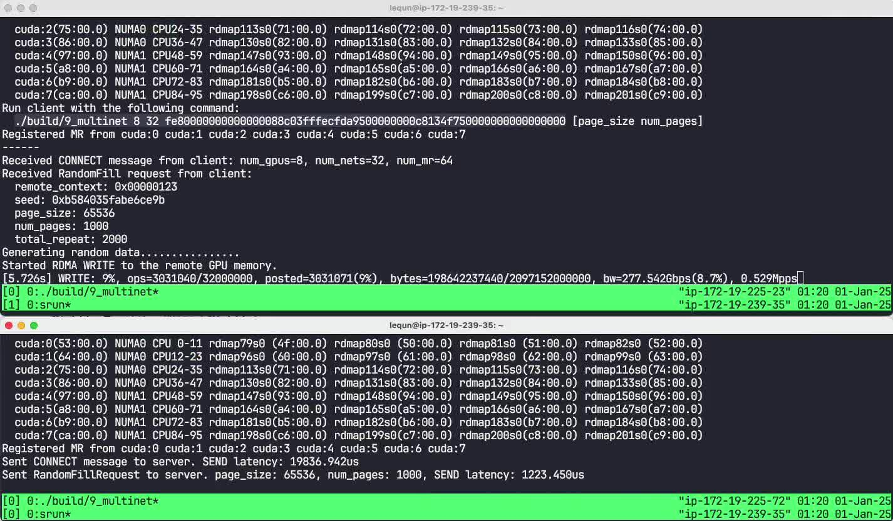

在[上一章](https://zhuanlan.zhihu.com/p/15783439574)中，我们已经搞清楚了系统的拓扑。而在[第七章](https://zhuanlan.zhihu.com/p/15780296272)中我们已经能够在单张网卡上达到 97.844 Gbps 带宽。那么在这一章里，我们将使用 8 张显卡对应的 32 张网卡，看看我们的程序能达到多少带宽。我们把这个程序命名为 `9_multinet.cpp`。

## 网络

我们首先对 `Network` 类进行一个微小的修改。一是我们记录下来网卡对应的显卡 `cuda_device`。二是我们在打开网络的时候，让所有的网卡都共享同一个 `fabric` 对象。

```cpp
struct Network {
  // ...
  int cuda_device;
};

Network Network::Open(struct fi_info *fi, int cuda_device,
                      struct fid_fabric *fabric) {
  if (!fabric) {
    FI_CHECK(fi_fabric(fi->fabric_attr, &fabric, nullptr));
  }

  // ...

  return Network{fi, fabric, domain, cq, av, ep, addr, cuda_device};
}
```

## 负载均衡

因为我们所有 `WRITE` 操作的大小都是相同的，所以负载均衡非常容易，只需要轮流使用显卡对应的四张网卡即可。为此，我们可以实现一个简单的 `NetworkGroup` 类，保存四张网卡的信息，并且使用 Round-Robin 来选择下一张网卡。

```cpp
struct NetworkGroup {
  std::vector<Network *> nets;
  uint8_t rr_mask;
  uint8_t rr_idx = 0;

  NetworkGroup(std::vector<Network *> &&nets) {
    CHECK(nets.size() <= kMaxNetworksPerGroup);
    CHECK((nets.size() & (nets.size() - 1)) == 0); // power of 2
    this->rr_mask = nets.size() - 1;
    this->nets = std::move(nets);
  }
  NetworkGroup(const NetworkGroup &) = delete;
  NetworkGroup(NetworkGroup &&) = default;

  uint8_t GetNext() {
    rr_idx = (rr_idx + 1) & rr_mask;
    return rr_idx;
  }
};
```

## `CONNECT` 消息

在之前的程序中，因为只使用了一张网卡，所以客户端只需要向服务器端发送一个地址即可。而现在，因为我们需要使用多张网卡，所以我们在 `CONNECT` 消息中需要发送显卡的数量、网卡的数量、以及每张网卡的地址和内存区域。和之前一样，我们将定长的数据放在结构体当中，而变长的数据放在结构体之后的内存中。

```cpp
struct AppConnectMessage {
  AppMessageBase base;
  size_t num_gpus;
  size_t num_nets;
  size_t num_mr;

  EfaAddress &net_addr(size_t index) {
    CHECK(index < num_nets);
    return ((EfaAddress *)((uintptr_t)&base + sizeof(*this)))[index];
  }

  MemoryRegion &mr(size_t index) {
    CHECK(index < num_mr);
    return ((MemoryRegion *)((uintptr_t)&base + sizeof(*this) +
                             num_nets * sizeof(EfaAddress)))[index];
  }

  size_t MessageBytes() const {
    return sizeof(*this) + num_nets * sizeof(EfaAddress) +
           num_mr * sizeof(MemoryRegion);
  }
};
```

## 服务器端逻辑

从一张网卡变成 8 张显卡、32 张网卡，服务器端的状态机的一些变量需要由单个变量变成数组。

```cpp
constexpr size_t kMaxNetworksPerGroup = 4;

struct RandomFillRequestState {
  std::vector<Network> *nets;
  std::vector<NetworkGroup> *net_groups;
  std::vector<Buffer> *cuda_bufs;
  std::vector<std::array<fi_addr_t, kMaxNetworksPerGroup>> remote_addrs;
  std::vector<WriteState> write_states;
  // ...
};
```

当收到 `CONNECT` 消息时，我们需要让服务器端和客户端的网卡一一对应起来，增加到对应的地址向量中。

```cpp
struct RandomFillRequestState {
  // ...

  void HandleConnect(Network &net, RdmaOp &op) {
    // ...

    // Assuming remote has the same number of GPUs and NICs.
    CHECK(msg.num_gpus == cuda_bufs->size());
    CHECK(msg.num_nets == nets->size());

    // Add peer addresses
    nets_per_gpu = msg.num_nets / msg.num_gpus;
    buf_per_gpu = connect_msg->num_mr / connect_msg->num_nets;
    for (size_t i = 0; i < msg.num_gpus; ++i) {
      std::array<fi_addr_t, kMaxNetworksPerGroup> addrs = {};
      for (size_t j = 0; j < nets_per_gpu; ++j) {
        auto idx = i * nets_per_gpu + j;
        addrs[j] = nets->at(idx).AddPeerAddress(msg.net_addr(idx));
      }
      remote_addrs.push_back(addrs);
    }

    // Initialize write states
    write_states.resize(connect_msg->num_gpus);
  }
};
```

我们也需要对 `ContinuePostWrite()` 函数进行一些修改。我们传入一个 `gpu_idx` 参数，表示只提交这个显卡对应的网卡的 `WRITE` 操作。首先用 `NetworkGroup` 选择下一个网卡。然后我们要找出这个网卡对应的客户端地址 `dest_addr`、内存区域地址 `mr.addr`、以及内存区域的远程访问密钥 `mr.rkey`。在设置立即数上面，我们也要注意判断是否是当前网卡的最后一个 `WRITE` 操作（`s.i_page + nets_per_gpu >= num_pages`）。

```cpp
struct RandomFillRequestState {
  // ...

  void ContinuePostWrite(size_t gpu_idx) {
    auto &s = write_states[gpu_idx];
    if (s.i_repeat == total_repeat)
      return;
    auto page_size = request_msg->page_size;
    auto num_pages = request_msg->num_pages;

    auto net_idx = (*net_groups)[gpu_idx].GetNext();
    uint32_t imm_data = 0;
    if (s.i_repeat + 1 == total_repeat && s.i_buf + 1 == buf_per_gpu &&
        s.i_page + nets_per_gpu >= num_pages) {
      // The last WRITE. Pass remote context back.
      imm_data = request_msg->remote_context;
    }
    const auto &mr = connect_msg->mr(
        (gpu_idx * nets_per_gpu + net_idx) * buf_per_gpu + s.i_buf);
    (*net_groups)[gpu_idx].nets[net_idx]->PostWrite(
        RdmaWriteOp{.buf = &(*cuda_bufs)[gpu_idx],
         .offset = s.i_buf * (page_size * num_pages) + s.i_page * page_size,
         .len = page_size,
         .imm_data = imm_data,
         .dest_ptr = mr.addr + request_msg->page_idx(s.i_page) * page_size,
         .dest_addr = remote_addrs[gpu_idx][net_idx],
         .dest_key = mr.rkey},
        [this](Network &net, RdmaOp &op) { HandleWriteCompletion(); });
    ++posted_write_ops;

    if (++s.i_page == num_pages) {
      s.i_page = 0;
      if (++s.i_buf == buf_per_gpu) {
        s.i_buf = 0;
        if (++s.i_repeat == total_repeat)
          return;
      }
    }
  }
};
```

在服务器端的主程序，我们首先检测系统拓扑，然后打开所有的网卡，并分组建立网络组。

```cpp
int ServerMain(int argc, char **argv) {
  // Topology detection
  struct fi_info *info = GetInfo();
  auto topo_groups = DetectTopo(info);
  int num_gpus = topo_groups.size();
  int num_nets = topo_groups[0].fi_infos.size() * topo_groups.size();
  int nets_per_gpu = num_nets / num_gpus;

  // Open Netowrk
  std::vector<Network> nets;
  std::vector<NetworkGroup> net_groups;
  for (int cuda_device = 0; cuda_device < num_gpus; ++cuda_device) {
    std::vector<Network *> group_nets;
    for (auto *fi : topo_groups[cuda_device].fi_infos) {
      int cuda_device = nets.size() / nets_per_gpu;
      auto *fabric = nets.empty() ? nullptr : nets[0].fabric;
      nets.push_back(Network::Open(fi, cuda_device, fabric));
      group_nets.push_back(&nets.back());
    }
    net_groups.push_back(NetworkGroup(std::move(group_nets)));
  }
  PrintTopologyGroups(topo_groups);

  // ...
}
```

然后我们在每张显卡上都分配一个缓冲区。同时，向这张显卡对应的所有的网卡注册这个内存区域。

```cpp
// Allocate and register CUDA memory
  printf("Registered MR from");
  std::vector<Buffer> cuda_bufs;
  for (int i = 0; i < num_gpus; ++i) {
    CUDA_CHECK(cudaSetDevice(i));
    cuda_bufs.push_back(Buffer::AllocCuda(kMemoryRegionSize * 2, kBufAlign));
    for (int j = 0; j < nets_per_gpu; ++j) {
      nets[i * nets_per_gpu + j].RegisterMemory(cuda_bufs.back());
    }
    printf(" cuda:%d", i);
    fflush(stdout);
  }
  printf("\n");
```

我们打算使用第一张网卡来接收客户端连接，所以我们分配两个缓冲区并在第一张网卡上注册内存区域。

```cpp
// Allocate and register message buffer
  auto buf1 = Buffer::Alloc(kMessageBufferSize, kBufAlign);
  auto buf2 = Buffer::Alloc(kMessageBufferSize, kBufAlign);
  nets[0].RegisterMemory(buf1);
  nets[0].RegisterMemory(buf2);
```

在主循环中，我们先在第一张网卡上提交两个 `RECV` 操作。在状态机未完成前，我们每次遍历每一个显卡。对于一张显卡，我们先处理其对应的所有的网卡的完成队列。然后如果状态机的状态处于 `kWrite`，则继续提交更多的 `WRITE` 操作。

```cpp
// Loop forever. Accept one client at a time.
  for (;;) {
    printf("------\n");
    // State machine
    RandomFillRequestState s(&nets, &net_groups, &cuda_bufs);
    // RECV for CONNECT
    nets[0].PostRecv(buf1, [&s](Network &net, RdmaOp &op) { s.OnRecv(net, op); });
    // RECV for RandomFillRequest
    nets[0].PostRecv(buf2, [&s](Network &net, RdmaOp &op) { s.OnRecv(net, op); });
    // Wait for completion
    while (s.state != RandomFillRequestState::State::kDone) {
      for (size_t gpu_idx = 0; gpu_idx < net_groups.size(); ++gpu_idx) {
        for (auto *net : net_groups[gpu_idx].nets) {
          net->PollCompletion();
        }
        switch (s.state) {
        case RandomFillRequestState::State::kWaitRequest:
          break;
        case RandomFillRequestState::State::kWrite:
          s.ContinuePostWrite(gpu_idx);
          break;
        case RandomFillRequestState::State::kDone:
          break;
        }
      }
    }
  }

  return 0;
```

## 客户端逻辑

客户端逻辑的修改和服务器端类似。首先检测系统拓扑，然后打开所有的网卡，并分组建立网络组。然后在每张显卡上分配缓冲区并在其对应的网卡上注册内存区域。再在第一张网卡上分配缓冲区和注册内存区域。这里不再赘述。

然后我们需要在 `CONNECT` 消息中包含显卡的数量、网卡的数量、每张网卡的地址、每张网卡上的内存区域。然后使用第一张网卡向服务器端发送这个消息。

```cpp
int ClientMain(int argc, char **argv) {
  // ...

  // Send address to server
  auto &connect_msg = *(AppConnectMessage *)buf1.data;
  connect_msg = {
      .base = {.type = AppMessageType::kConnect},
      .num_gpus = (size_t)num_gpus,
      .num_nets = nets.size(),
      .num_mr = nets.size() * 2,
  };
  for (size_t i = 0; i < nets.size(); i++) {
    connect_msg.net_addr(i) = nets[i].addr;
    int cuda_device = nets[i].cuda_device;
    connect_msg.mr(i * 2) = {
        .addr = (uint64_t)cuda_bufs1[cuda_device].data,
        .size = cuda_bufs1[cuda_device].size,
        .rkey = nets[i].GetMR(cuda_bufs1[cuda_device])->key,
    };
    connect_msg.mr(i * 2 + 1) = {
        .addr = (uint64_t)cuda_bufs2[cuda_device].data,
        .size = cuda_bufs2[cuda_device].size,
        .rkey = nets[i].GetMR(cuda_bufs2[cuda_device])->key,
    };
  }
  bool connect_sent = false;
  nets[0].PostSend(
      server_addr, buf1, connect_msg.MessageBytes(),
      [&connect_sent](Network &net, RdmaOp &op) { connect_sent = true; });
  while (!connect_sent) {
    nets[0].PollCompletion();
  }
}
```

在等待 `REMOTE WRITE` 回调函数的时候，之前的程序只需要等待一次回调，而现在我们需要在每张网卡上都等待一次回调。

```cpp
// Prepare to receive the last REMOTE WRITE from server
  int cnt_last_remote_write_received = 0;
  uint32_t remote_write_op_id = 0x123;
  for (auto &net : nets) {
    net.AddRemoteWrite(remote_write_op_id, [&cnt_last_remote_write_received](
                                               Network &net, RdmaOp &op) {
      ++cnt_last_remote_write_received;
    });
  }

  // Send message to server
  // ...

  // Wait for REMOTE WRITE from server
  while (cnt_last_remote_write_received != num_nets) {
    for (auto &net : nets) {
      net.PollCompletion();
    }
  }
  printf("Received RDMA WRITE to local GPU memory.\n");
```

到此我们就完成了所有的修改。

## 运行效果



9\_multinet 287.089 Gbps (9.0%)

在上面的视频中我们可以看到，我们确实能够使用 8 张显卡、32 张网卡，然而传输速度仅为 287.089 Gbps，只达到了总带宽 3200 Gbps 的 9.0%。接下来我们将一步一步地优化我们的程序，直到我们能打满 3200 Gbps 的带宽。

完整代码可以在 GitHub 中找到：[https://github.com/abcdabcd987/libfabric-efa-demo](https://github.com/abcdabcd987/libfabric-efa-demo)
