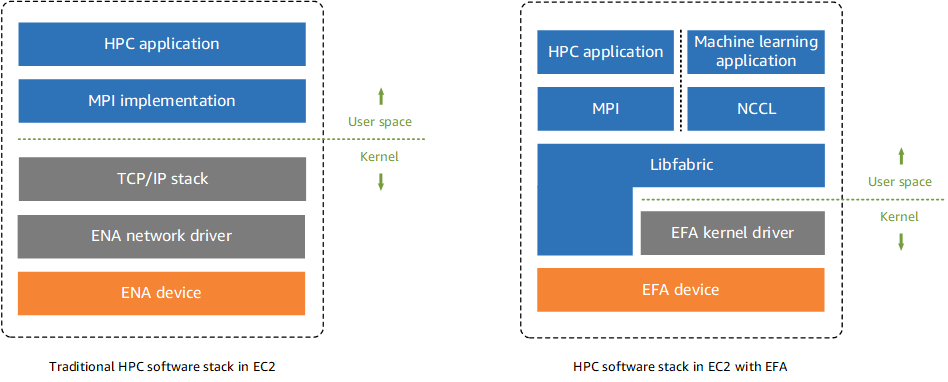

在开始写代码操作 3200 Gbps 网络之前，让我们先了解一下驱动这个高性能网络所需要的硬件、软件以及系统设计哲学。

## RDMA

我们日常使用的网络大多是基于 TCP/IP 协议的网络。应用程序通过套接字（Socket）与 Linux 内核交互。Linux 内核维护了完整的 TCP/IP 协议栈，以及负责操纵网卡（NIC，Network Interface Controller）。两个网卡之间通过以太网（Ethernet）进行网络层的通信。大家比较日常能见到的就是家用机中的千兆网卡（1 Gbps）以及服务器上的万兆网卡（10 Gbps）。

高性能网络则是另一套完全不同的软硬件技术栈，称为 RDMA（远程直接内存访问，Remote Direct Memory Access）。

1.  应用层：应用程序一般通过 [ibverbs API](https://github.com/linux-rdma/rdma-core)（也称为 verbs API）与 RDMA 网卡进行交互。verbs API 与套接字有非常大的区别，背后是完全不同的系统设计哲学，我们会在后文提到。
2.  协议层：不同于 TCP/IP，RDMA 有一套自己的协议。因为我不是做这方面的研究的，所以具体的技术细节我也不了解。可能对我来说最直观的感受就是，RDMA 没有“IP 地址”和“MAC 地址”，而是另有一套地址系统。
3.  网络层：RDMA 最常用的传输层是 InfiniBand 和 RoCE。InfiniBand 是私有协议，比较贵，也比较稳定。RoCE（基于融合以太网的远程直接内存访问，RDMA over Converged Ethernet）性价比比较高，但需要细致地调优，很多科技大厂也发表了不少关于 RoCE 的论文。
4.  网卡：最常见的 RDMA 网卡就是 Mellanox 的 ConnectX 系列网卡了。在 2020 年英伟达收购了 Mellanox 之后，英伟达更是坐实了当年网络上“N卡网速快”的梗。ConnectX-7 这一代网卡达到了 400 Gbps 的网速，常常与 H100 这一代的显卡进行搭配。

顾名思义，RDMA 能直接对远程的（以及本地的）内存进行读写。而且这里指的内存也不止是绑定在 CPU 上的内存，也可以是在 PCIe 总线上其他设备的内存，例如 GPU 的显存。相比起套接字的 `send()` 和 `recv()` 两种操作，RDMA 可以做的操作更丰富一点。RDMA 的操作可以分为两类，双边 RDMA 和单边 RDMA：

1.  双边 RDMA（Two-sided RDMA）：需要通信双方的 CPU 的参与

1.  `RECV`：目标方准备接受消息
2.  `SEND`：发起方将信息发送给目标方

3.  单边 RDMA（One-sided RDMA）：只需要发起方的 CPU 参与，目标方 CPU 并不知情

1.  `WRITE`：将数据从发起方的内存直接写入目标方的内存
2.  `WRITE_IMM`：类似 `WRITE`，将数据从发起方的内存直接写入目标方的内存，但额外地在目标方的完成队列（Completion Queue）中插入一个整数，用来通知目标方 CPU。
3.  `READ`：直接从目标方的内存读取数据并写入发起方的内存
4.  `ATOMIC`：对目标方的内存进行原子操作，如 Compare-and-Swap、Fetch-Add

在 RDMA 中，一对通信节点被称为队列对（Queue Pair，QP）。类似于 IP 协议上常用的两种传输类型 TCP 和 UDP，RDMA 上有三种传输类型：

1.  可靠连接队列对（Reliable Connected Queue Pair, RC QP）

1.  基于连接，因此在通信之前需要先建立连接。通常来说连接数有限制。
2.  可靠传输，包含重传，保证消息送达顺序。
3.  可以一次性传输很大的消息，消息的大小可以远超 MTU。
4.  支持所有 RDMA 操作：`RECV`、`SEND`、`WRITE`、`READ`、`ATOMIC`

3.  不可靠连接队列对（Unreliable Connected Queue Pair, UC QP）

1.  类似 RC，但是传输不可靠，不保证消息送达，不保证消息送达顺序。
2.  只支持部分 RDMA 操作：`RECV`、`SEND`、`WRITE`

5.  不可靠数据报队列对（Unreliable Datagram Queue Pair, UD QP）

1.  无需建立连接。
2.  不保证消息送达，不保证消息送达顺序。
3.  消息必须小于 MTU
4.  只支持 `RECV`、`SEND`

## AWS EFA

显然大多数的个人甚至公司都是买不起 NVIDIA HGX 集群的，只能依赖于云服务提供商。云服务提供商一般不喜欢把硬件直接暴露给租户，而是会在上面加一层虚拟化。在 AWS p5 实例上，AWS 提供的虚拟高性能网卡称为 EFA（Elastic Fabric Adapter）。

至于 EFA 底下用的是亚马逊自研的网卡还是标准化的产品，再底下的网络协议是 InfiniBand 还是 RoCE，再底下的物理介质是光纤还是铜缆，这些我们一概不知。当然我们也不需要知道，有问题找客服就行了。不过有意思的是，EFA 使用了亚马逊的自研协议 [SRD](https://aws.amazon.com/blogs/hpc/in-the-search-for-performance-theres-more-than-one-way-to-build-a-network/)（Scalable Reliable Datagram）。

那么应用程序应该如何使用 EFA 呢？[EFA 的文档](https://docs.aws.amazon.com/AWSEC2/latest/UserGuide/efa.html)中有下面一张图：

  

从这张图以及文档中我们可以知道，在 AWS EFA 场景下，应用程序通常不是直接操作裸 RDMA 网卡，而是通过 [libfabric](https://github.com/ofiwg/libfabric) 的 EFA provider 来使用 EFA。
