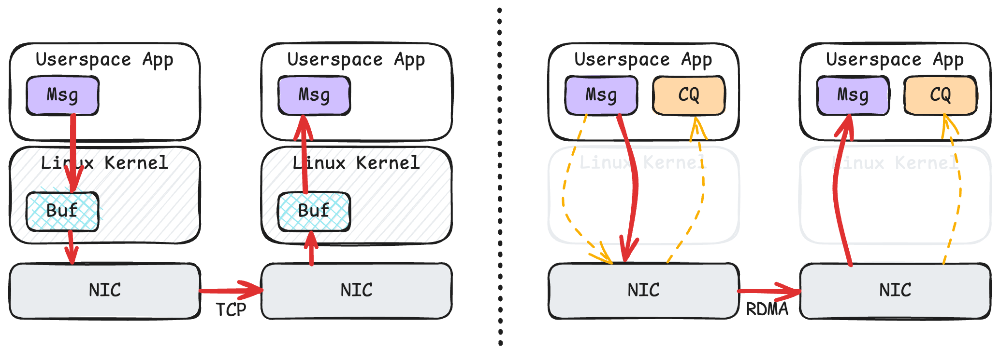
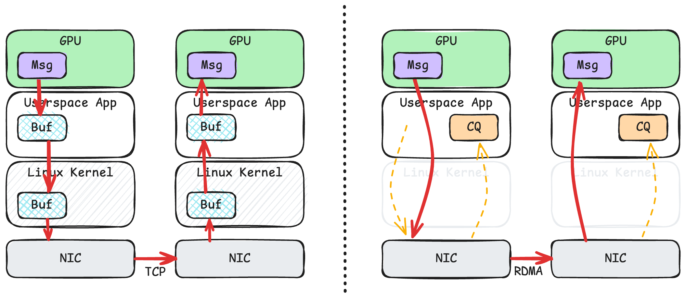
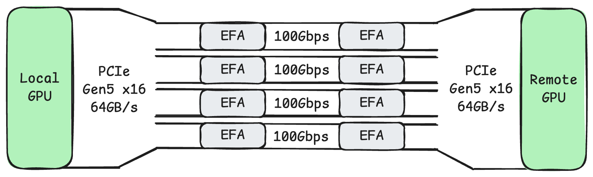
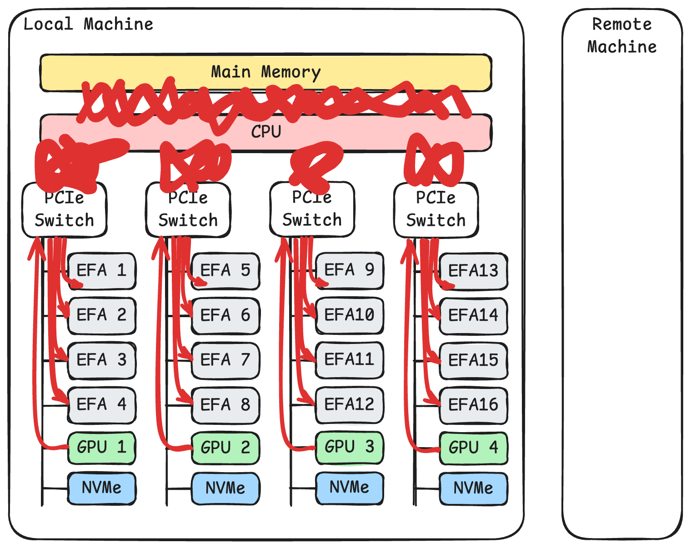

在介绍 `libfabric` 之前，让我们先来从更高的层级思考高性能网络库的设计，这也方便我们理解 ibverbs 以及 `libfabric` 的接口和编程模型。在这个话题上，其实 [libfabric 官方的介绍文章](https://ofiwg.github.io/libfabric/v2.0.0/man/fi_intro.7.html) 写得非常好，我建议感兴趣的读者也可以仔细阅读。我在 2021 年初的时候用 `ibverbs` 写过一个简易的 RDMA 通信程序，当时有很多类似的想法，因此当我时隔 3 年读到这篇文章的时候就产生了强烈的共鸣。

## 套接字

首先让我们回顾一下套接字（Socket）的 [send()](https://man7.org/linux/man-pages/man2/sendmsg.2.html) 和 [recv()](https://man7.org/linux/man-pages/man2/recv.2.html) 接口：

```c
ssize_t send(int sockfd, const void* buf, size_t len, int flags);
ssize_t recv(int sockfd, void* buf, size_t len, int flags);
```

应用程序最关心的是把 `[buf, buf+size)` 这一段数据传到 `sockfd` 代表的目的地，而这套接口就简单到几乎只包含这些信息。从 1983 年发明以来，这套接口就未经大改地保留到了现在。简洁和通用是其成功秘诀。这套接口隐藏了底下网络协议的所有细节，所有的脏活累活都包在操作系统内核中了。

这套接口在设计之初就考虑了阻塞式（Blocking）以及非阻塞式（Non-Blocking）的调用方式。从阻塞模式切换到非阻塞模式只需要一行代码：

```c
fcntl(sockfd, F_SETFL, O_NONBLOCK);
```

在使用阻塞模式时，这套接口的调用直到有部分消息发送成功（或者接收到部分消息）才会返回。在使用非阻塞模式时，这套接口总是会立刻返回，返回值即是发送了（或者接收了）多少字节。搭配上 [select()](https://man7.org/linux/man-pages/man2/select.2.html) / [poll()](https://man7.org/linux/man-pages/man2/poll.2.html) / [epoll](https://man7.org/linux/man-pages/man7/epoll.7.html) / [io_uring](https://man7.org/linux/man-pages/man7/io_uring.7.html) 这些 I/O 复用（I/O Multiplexing）的工具，很容易地就能编写出能异步处理大量请求的网络程序。

### 网络的异步天性

异步是网络的天性。一个网络操作能否成功远不是 Linux 内核能控制的，比如硬件的缓冲区满了需要暂停，出现了拥塞需要控制，出现了丢包需要重传。而且这些网络操作是否成功，完全不是在一次函数调用内可以知道的。一个数据包可能要过几百毫秒才能到达大洋彼岸。想象一下如果让我们来实现 Linux 内核的网络模块，我们应该如何做呢？

如果应用使用的是阻塞模式，一切都好说。等一切尘埃落定再唤醒应用即可。但是如果应用使用的是非阻塞模式，内核需要立即返回 `send()` 成功发送了多少字节（或者 `recv()` 收到了多少字节）。可是在不挂起用户态进程的前提下，内核可能甚至连网卡的硬件资源还有空余没有都不知道，更别说知道能有多少字节在几百毫秒后漂洋过海。

在这样的前提下，我能想到的一个可行的实现方式，便是让内核自己维护一份缓冲区。当用户态进程调用 `send()` 时，内核将用户给的内容复制到自己的缓冲区。因为内核十分清楚自己的缓冲区还剩多大，所以内核可以立即返回到用户态进程。而在之后，内核可以从自己的缓冲区中慢慢地与网络发生异步交互。

显然在高性能网络中我们是想要尽量避免额外的复制的。有没有别的办法呢？比如让应用提供这个缓冲区，而不是在内核维护。这个想法如何呢？

### 缓冲区的复制

假设 Linux 内核允许用户态进程提供缓冲区，那么用户态进程必须保证在内核通知它网络操作完成之前，一直不去修改这个缓冲区，也不会释放掉这个缓冲区。否则，要么传输的数据产生损坏，要么进程崩溃，甚至还可能带来安全隐患。显然这与 Linux 的设计哲学是相悖的，内核不应该信任用户态。

我再进一步地想象了一下，硬要这么做也不是实现不了。禁止用户态进程访问某段内存区间倒不是什么难事，内核只需要在 CPU 的页表（Page Table）上动动手脚就行了。然而如果真的这么做了，反而会进一步带来更多的问题。比如要操作页表的话，就需要缓冲区对齐到页表大小。另外，操作页表也不是一件那么快的事情。频繁地修改页表和页表缓存也会降低执行效率。

总之，我觉得让内核完全信任用户态进程提供的缓冲区还是一件不太可行的事情。让内核自己维护一份缓冲区反而容易很多，只是需要多一次复制而已。

因此，我认为这多出来的一次复制，正是套接字的接口设计带来的必然的结果。这一次额外的复制与套接字简单易用的设计哲学是一体两面的。

### 地址解析

[libfabric 的介绍文章](https://ofiwg.github.io/libfabric/v2.0.0/man/fi_intro.7.html) 中还提到了一点我之前没有想到过的——地址解析。套接字拿到的地址是 IP 地址，而要进行通信，内核还需要查找更底层的地址，也就是 MAC 地址。这一步地址解析也是需要花费一定时间的。对于 TCP 来说，可以在建立连接的时候把底层的地址缓存好，因此影响不大。然而对于 UDP 来说，因为它是没有连接的，所以每一次的收发都需要经过地址转换，花费不少时间。

## 高性能网络

那么要实现高性能网络，应用程序、网络接口、操作系统以及硬件需要有哪些默契的配合呢？

### 缓冲区的所有权

前面我们提到，让应用程序提供缓冲区可以避免额外的复制，但是前提是应用程序在网络操作结束之前都不应该再去读写这段缓冲区。这种软件层面的契约，按照现在时髦的 Rust 语言话来说，就是个[所有权](https://doc.rust-lang.org/book/ch04-01-what-is-ownership.html)的问题。在调用网络操作之后，缓冲区的所有权应该从应用程序转移到网络接口。

这种对用户态的高度信任无疑是不被 Linux 内核所接受的。那么我们一定要事事争得内核的同意吗？可以让用户态进程直接操纵网卡吗？有没有优雅的办法既保证系统的安全又能够达成这种契约？

### 绕过操作系统内核

套接字必须经过操作系统内核的原因是只有内核才能操纵网卡，整个网络栈都是在内核里面实现的。而如果反过来，用户态和网卡一起实现了网络栈，那么网络的调用就不一定要经过内核了。如果数据不用经过内核，那么性能肯定是会大大增加的，因为用户态和内核态的切换非常花费时间。

### 应用与网卡共享内存

假设操作系统内核允许应用程序和网卡一同共享某一段内存空间，那么所有的数据操作都可以变得非常快速。在发送数据时，网卡可以直接从内存读取数据；在接收数据时，网卡可以直接将数据写入到内存中；应用程序可以轮询（Poll）网卡的完成队列（Completion Queue）来知道网络操作是否完成，而这个轮询操作只不过是读取某段虚拟地址而已。

### 控制平面与数据平面分离

上面说的这些听起来很美好，但是如果一切都绕过操作系统内核，让用户态对硬件有完全的访问权限，那么操作系统的抽象就被破坏了，安全性更是无从保障。实际上，我们完全可以把网络操作分为两类：

1.  控制平面（Control Plane）：

1.  控制平面的网络操作可以经过操作系统内核，由内核来执行高权限的操作，以确保系统的安全性。这是一条慢速路径（Slow-Path）。
2.  例如：开启监听状态、地址解析、注册缓冲区、注册完成队列

3.  数据平面（Data Plane）：

1.  数据平面的网络操作应该绕开操作系统内核，这是一条快速路径（Fast-Path）。
2.  例如：接收数据、发送数据、轮询完成队列

既然我们要让应用程序提供缓冲区，那么我们可以要求应用程序提前告诉操作系统内核这是哪一段虚拟地址。内核此时可以在 CPU 的页表上做相应的标记。同时，内核也可以设置网卡的页表。这样一来，用户态进程和网卡硬件都可以访问同一段内存，并且内核已经提前设置好了双方的访问权限。

假设应用程序不遵守所有权的约定，那么破坏面最多只是使得应用程序本身崩溃，无法扩散到用户态以外，不会影响系统的其他进程。

### 接收先于发送

没有了内核提供缓冲区，当网卡收到一段消息的时候，网卡怎么知道应该写入应用程序的哪一段地址呢？

要解决这个问题，我们可以要求应用程序先提交几个接收操作。当新数据到来时，网卡就可以把数据写到其中一个接收操作指定的内存中。如果在新的数据到来时，没有等待中的接收操作，那么网卡就可以直接拒绝这段数据。反过来说，如果应用程序想要继续接收更多的数据，应用程序有责任在接收操作结束之后，再提交一个接收操作。

### TCP 及 RDMA 的比较



上面这张图简单描述了 TCP 和 RDMA 传输数据的流程。

左侧是 TCP。消息首先要从用户态复制到内核，然后内核才能驱动网卡发送消息。在接收端，网卡将数据写到内核，内核再将数据复制到用户态。由于有内核的参与，以及多了额外的缓冲区复制，TCP 的这一套流程性能是比较低的。

右侧是 RDMA。用户态可以直接告诉网卡要发送的消息的内存地址，网卡可以直接读取这段数据发送到远端。同时，用户态程序可以读取完成队列，从而知道发送操作是否完成。在操作完成了之后，应用就可以重新使用这一段内存。在接收端，网卡直接将数据写入等待中的接收操作所指定的内存区域，然后网卡更新完成队列。当接收端的应用程序读取到完成队列时，它就知道数据到达了。RDMA 的这一套流程无疑是十分高效的。



如果考虑到显卡，那么 TCP 和 RDMA 的性能差别就更大了。上图便是从本地显卡到远端显卡的消息传输的示意图。

左侧是 TCP。因为操作系统没法直接读取显存，所以这里额外多了一步从显存到用户态内存的复制。在接收端，同理也是多了一次从用户态内存到显存的复制。这让 TCP 本就不高的性能更是雪上加霜。

右侧是 RDMA。当应用程序要发送数据的时候，用户态进程只需要告诉网卡这个消息所在的虚拟地址，网卡就能直接读取显存。这一技术叫做 [GPUDirect RDMA](https://developer.nvidia.com/gpudirect)。值得注意的是，用户态进程在发送消息的时候，并不需要刻意区分到底这个虚拟地址是在 CPU 内存上的，还是在显卡的显存上的，因为内核已经提前设置好了 CPU、显卡以及网卡的页表，使得他们能够理解同一个虚拟地址空间。接收端也是类似的，网卡直接将数据写入显存，无需经过任何额外的复制。

## 硬件总线的拓扑结构

在上面的例子中我们可以发现，RDMA 不仅节省了软件层面的开销，也节省了 PCIe 总线以及内存总线上的数据传输。当一台机器上有更多的显卡以及更多的网卡的时候，我们需要关心硬件总线的拓扑结构，从而避免不必要的跨总线数据传输，避免总线上的阻塞。


以 [AWS p5 实例](https://aws.amazon.com/ec2/instance-types/p5/) 为例，上图画出了系统的拓扑结构。每台机器插了两块 CPU。每块 CPU 下面连接着 4 个 PCIe 交换机。每个 PCIe 交换机下面挂载了 4 张 100 Gbps 的 EFA 网卡，1 张 NVIDIA H100 显卡，以及一块 3.84 TB 的 NVMe SSD。



如上图所示，如果我们将同一个 PCIe 交换机下面的显卡和网卡配对，那么在 GPUDirect RDMA 的帮助下，他们之间的通信就只需要经过这个 PCIe 交换机，可以充分地享受 PCIe Gen5 x16 的带宽。同时，他们也不会影响到其他 PCIe 交换机，也不会影响到与 CPU 内存的总线。



而如果使用 TCP 进行传输，如上图所示，则网卡和显卡之间的通信需要绕一大圈。数据要从 GPU 显存经过 PCIe 交换机，再经过 CPU 内部的 PCIe 通道，再经过 CPU 的内存总线，才能复制到用户态内存中。接着内核会对这段数据再进行一次复制。然后内核上的数据需要经过 CPU 内存总线，经过 CPU 内部的 PCIe 通道，经过 PCIe 交换机，最终才能到达网卡。而当 8 张显卡、32 块网卡同时工作时，TCP 这样的传输显然会带来 PCIe 总线和内存总线上严重的阻塞。
