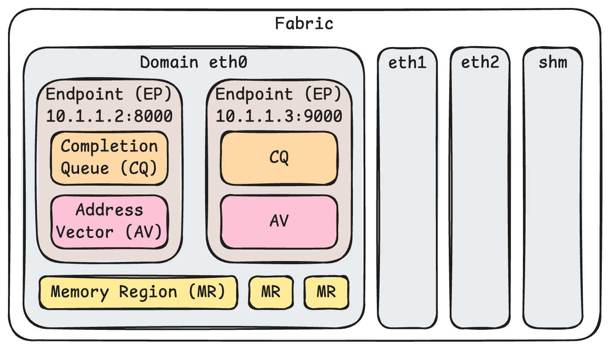
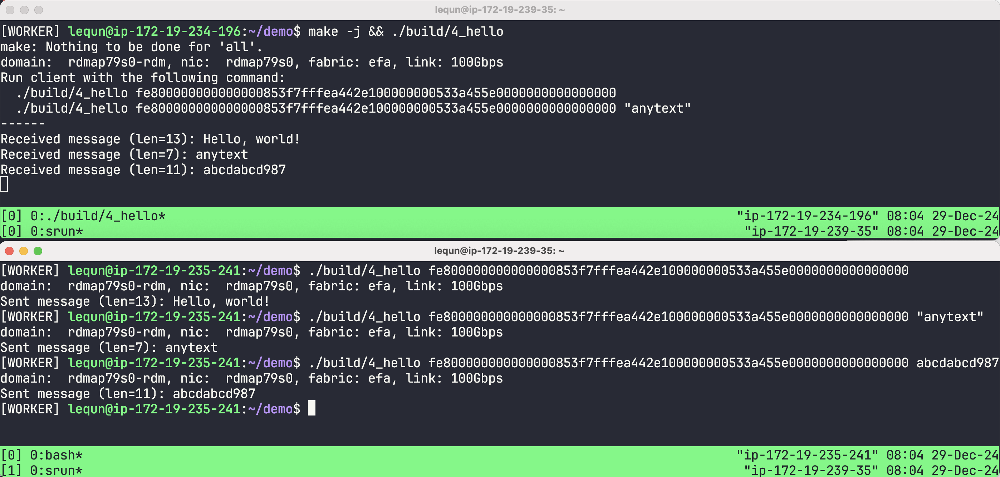

在经过前面一系列章节的铺垫，本章终于可以开始写代码了。本章的目标是在两台机器之间使用单张网卡实现单向的 `RECV` 和 `SEND`。

虽然 `libfabric` 的语言是 C，但是因为我实在是不懂 C 语言，所以我接下来都会使用我熟悉的 C++。并且因为这一系列的文章是一个教程，所以我不会刻意封装 C++ 的类，而是尽量保持简单。同时，我也会省略许多操作的异常返回值的处理，只是加入一些断言来做检查。

```cpp
#define CHECK(stmt)                                                            \
  do {                                                                         \
    if (!(stmt)) {                                                             \
      fprintf(stderr, "%s:%d %s\n", __FILE__, __LINE__, #stmt);                \
      std::exit(1);                                                            \
    }                                                                          \
  } while (0)

#define FI_CHECK(stmt)                                                         \
  do {                                                                         \
    int rc = (stmt);                                                           \
    if (rc) {                                                                  \
      fprintf(stderr, "%s:%d %s failed with %d (%s)\n", __FILE__, __LINE__,    \
              #stmt, rc, fi_strerror(-rc));                                    \
      std::exit(1);                                                            \
    }                                                                          \
  } while (0)
```

## 获取网络接口信息

在[上一章](https://zhuanlan.zhihu.com/p/14933249086)中我们知道了 `libfabric` 支持非常多设备，并且 EFA 支持两种不同的协议（`RDM` 和 `DGRAM`）。在这一系列的文章中我们都专注于使用 `RDM` 协议的 EFA。所以我们首先要用 [fi_getinfo()](https://ofiwg.github.io/libfabric/v2.0.0/man/fi_getinfo.3.html) 筛选出来符合要求的 `libfabric` 网络接口。

```cpp
#include <rdma/fabric.h>
#include <rdma/fi_cm.h>
#include <rdma/fi_domain.h>
#include <rdma/fi_endpoint.h>
#include <rdma/fi_errno.h>
#include <rdma/fi_rma.h>

struct fi_info *GetInfo() {
  struct fi_info *hints, *info;
  hints = fi_allocinfo();
  hints->ep_attr->type = FI_EP_RDM;
  hints->fabric_attr->prov_name = strdup("efa");
  FI_CHECK(fi_getinfo(FI_VERSION(2, 0), nullptr, nullptr, 0, hints, &info));
  fi_freeinfo(hints);
  return info;
}
```

在这一段程序里面，我们在 `hints` 里面指定了端点类型为 `RDM`，Provider 名称为 `efa`。`fi_getinfo()` 会将所有符合条件的网络接口以链表的形式返回。

接下来，让我们遍历这个链表，输出所有网络接口的基本信息，作为最基本的正确性检测。

```cpp
int main() {
  struct fi_info *info = GetInfo();
  for (auto *fi = info; fi; fi = fi->next) {
    printf("domain: %14s", fi->domain_attr->name);
    printf(", nic: %10s", fi->nic->device_attr->name);
    printf(", fabric: %s", fi->fabric_attr->prov_name);
    printf(", link: %.0fGbps", fi->nic->link_attr->speed / 1e9);
    printf("\n");
  }
  return 0;
}
```

让我们把程序保存为 `src/4_hello.cpp`。在上一章我们把 `libfabric` 安装到了 `build/libfabric/` 文件夹。我们可以使用下面的命令编译：

```bash
g++ -Wall -Werror -std=c++17 -O2 -g \
  -I./build/libfabric/include \
  -o build/4_hello src/4_hello.cpp \
  -L./build/libfabric/lib -lfabric
```

运行编译好的可执行文件，可以得到下面的输出，证明我们最基础的软硬件设置都是正确的：

```text
domain:  rdmap79s0-rdm, nic:  rdmap79s0, fabric: efa, link: 100Gbps
domain:  rdmap80s0-rdm, nic:  rdmap80s0, fabric: efa, link: 100Gbps
domain:  rdmap81s0-rdm, nic:  rdmap81s0, fabric: efa, link: 100Gbps
domain:  rdmap82s0-rdm, nic:  rdmap82s0, fabric: efa, link: 100Gbps
domain:  rdmap96s0-rdm, nic:  rdmap96s0, fabric: efa, link: 100Gbps
domain:  rdmap97s0-rdm, nic:  rdmap97s0, fabric: efa, link: 100Gbps
domain:  rdmap98s0-rdm, nic:  rdmap98s0, fabric: efa, link: 100Gbps
domain:  rdmap99s0-rdm, nic:  rdmap99s0, fabric: efa, link: 100Gbps
domain: rdmap113s0-rdm, nic: rdmap113s0, fabric: efa, link: 100Gbps
domain: rdmap114s0-rdm, nic: rdmap114s0, fabric: efa, link: 100Gbps
domain: rdmap115s0-rdm, nic: rdmap115s0, fabric: efa, link: 100Gbps
domain: rdmap116s0-rdm, nic: rdmap116s0, fabric: efa, link: 100Gbps
domain: rdmap130s0-rdm, nic: rdmap130s0, fabric: efa, link: 100Gbps
domain: rdmap131s0-rdm, nic: rdmap131s0, fabric: efa, link: 100Gbps
domain: rdmap132s0-rdm, nic: rdmap132s0, fabric: efa, link: 100Gbps
domain: rdmap133s0-rdm, nic: rdmap133s0, fabric: efa, link: 100Gbps
domain: rdmap147s0-rdm, nic: rdmap147s0, fabric: efa, link: 100Gbps
domain: rdmap148s0-rdm, nic: rdmap148s0, fabric: efa, link: 100Gbps
domain: rdmap149s0-rdm, nic: rdmap149s0, fabric: efa, link: 100Gbps
domain: rdmap150s0-rdm, nic: rdmap150s0, fabric: efa, link: 100Gbps
domain: rdmap164s0-rdm, nic: rdmap164s0, fabric: efa, link: 100Gbps
domain: rdmap165s0-rdm, nic: rdmap165s0, fabric: efa, link: 100Gbps
domain: rdmap166s0-rdm, nic: rdmap166s0, fabric: efa, link: 100Gbps
domain: rdmap167s0-rdm, nic: rdmap167s0, fabric: efa, link: 100Gbps
domain: rdmap181s0-rdm, nic: rdmap181s0, fabric: efa, link: 100Gbps
domain: rdmap182s0-rdm, nic: rdmap182s0, fabric: efa, link: 100Gbps
domain: rdmap183s0-rdm, nic: rdmap183s0, fabric: efa, link: 100Gbps
domain: rdmap184s0-rdm, nic: rdmap184s0, fabric: efa, link: 100Gbps
domain: rdmap198s0-rdm, nic: rdmap198s0, fabric: efa, link: 100Gbps
domain: rdmap199s0-rdm, nic: rdmap199s0, fabric: efa, link: 100Gbps
domain: rdmap200s0-rdm, nic: rdmap200s0, fabric: efa, link: 100Gbps
domain: rdmap201s0-rdm, nic: rdmap201s0, fabric: efa, link: 100Gbps
```

## 打开网络接口



上一章中我们介绍了 `libfabric` 的软件对象模型，是一个树形的结构。但是因为在这里我们只打算使用一个端点，所以为了简单起见，我们可以把所有的对象都放在一个结构体里面：

```cpp
struct Network {
  struct fi_info *fi;
  struct fid_fabric *fabric;
  struct fid_domain *domain;
  struct fid_cq *cq;
  struct fid_av *av;
  struct fid_ep *ep;
  // ... other fields

  static Network Open(struct fi_info *fi);
  // ... other methods
};
```

让我们实现 `Open()` 方法，打开 `fi` 所指代的网络接口：

```cpp
Network Network::Open(struct fi_info *fi) {
  struct fid_fabric *fabric;
  FI_CHECK(fi_fabric(fi->fabric_attr, &fabric, nullptr));

  struct fid_domain *domain;
  FI_CHECK(fi_domain(fabric, fi, &domain, nullptr));

  struct fid_cq *cq;
  struct fi_cq_attr cq_attr = {};
  cq_attr.format = FI_CQ_FORMAT_DATA;
  FI_CHECK(fi_cq_open(domain, &cq_attr, &cq, nullptr));

  struct fid_av *av;
  struct fi_av_attr av_attr = {};
  FI_CHECK(fi_av_open(domain, &av_attr, &av, nullptr));

  struct fid_ep *ep;
  FI_CHECK(fi_endpoint(domain, fi, &ep, nullptr));
  FI_CHECK(fi_ep_bind(ep, &cq->fid, FI_SEND | FI_RECV));
  FI_CHECK(fi_ep_bind(ep, &av->fid, 0));

  FI_CHECK(fi_enable(ep));
  //...
}
```

在这一段代码中，我们首先创建了 `fabric`，然后根据 `fi` 创建了 `domain`。

接着我们创建完成队列 `cq` 和地址向量 `av`。对于完成队列，我们指定了 `FI_CQ_FORMAT_DATA` 格式，之后当我们轮询完成队列的时候，就可以得到一个 `fi_cq_data_entry` 结构体：

```cpp
struct fi_cq_data_entry {
  void     *op_context;
  uint64_t flags;
  size_t   len;
  void     *buf;
  uint64_t data;
};
```

-   `op_context` 是我们在提交操作的时候传入的上下文，用来区分不同的操作。我们在后文会用到。
-   `flags` 是一个位掩码，表示了这个完成事件的类型。我们在后文会用到。
-   `buf` 和 `len` 表示了这个完成事件对应的数据缓冲区和长度。这对于 `RECV` 操作是有用的。
-   `data` 是 `WRITE_IMM` 操作所携带的立即数。在本章中我们不会用到，但是在后面的章节中会用到。

其他完成队列的格式可以参见 [fi_cq(3)](https://ofiwg.github.io/libfabric/v2.0.0/man/fi_cq.3.html)。

接着我们创建了端点 `ep`，并且绑定了完成队列和地址向量。最后我们启用了端点。

## EFA 端点地址

让我们顺便在 `Network::Open()` 中保存一下端点的地址。根据 [EFA RDM 协议文档](https://github.com/ofiwg/libfabric/blob/v2.0.0/prov/efa/docs/efa_rdm_protocol_v4.md#14-the-raw-address)，EFA 端点地址长度为 32 字节。我们可以使用 `fi_getname()` 来获取端点地址：

```cpp
Network Network::Open(struct fi_info *fi) {
  // ...
  uint8_t addr[64];
  size_t addrlen = sizeof(addr);
  FI_CHECK(fi_getname(&ep->fid, addr, &addrlen));
  FI_CHECK(addrlen == 32);
  // ...
}
```

这个地址是一个二进制的地址。为了方便输入输出，我们可以把这个地址转换成十六进制的字符串：

```cpp
struct EfaAddress {
  uint8_t bytes[32];

  explicit EfaAddress(uint8_t bytes[32]) { memcpy(this->bytes, bytes, 32); }

  std::string ToString() const {
    char buf[65];
    for (size_t i = 0; i < 32; i++) {
      snprintf(buf + 2 * i, 3, "%02x", bytes[i]);
    }
    return std::string(buf, 64);
  }

  static EfaAddress Parse(const std::string &str) {
    CHECK(str.size() == 64);
    uint8_t bytes[32];
    for (size_t i = 0; i < 32; i++) {
      sscanf(str.c_str() + 2 * i, "%02hhx", &bytes[i]);
    }
    return EfaAddress(bytes);
  }
};
```

在 `Network` 结构体中保存这个地址：

```cpp
struct Network {
  // ...
  EfaAddress addr;
  // ...
};

Network Network::Open(struct fi_info *fi) {
  // ...
  return Network{fi, fabric, domain, cq, av, ep, EfaAddress(addr)};
}
```

## 添加目标地址

在前面的章节中我们提到了，为了减少地址解析的开销，`libfabric` 在发起网络操作之前就需要将目标地址添加到地址向量中。[fi_av_insert()](https://ofiwg.github.io/libfabric/v2.0.0/man/fi_av.3.html) 函数可以用来添加地址，并会返回一个 `fi_addr_t` 类型的地址。让我们增加一个方法来添加目标地址：

```cpp
fi_addr_t Network::AddPeerAddress(const EfaAddress &peer_addr) {
  fi_addr_t addr = FI_ADDR_UNSPEC;
  int ret = fi_av_insert(av, peer_addr.bytes, 1, &addr, 0, nullptr);
  if (ret != 1) {
    fprintf(stderr, "fi_av_insert failed: %d\n", ret);
    std::exit(1);
  }
  return addr;
}
```

## 缓冲区

在 `libfabric` 中，数据传输的缓冲区是由用户提供的。我们使用一个简单的结构体来保存缓冲区的基本信息。除了指针和长度，还有一个需要注意的是内存地址的对齐。在 [aws-ofi-nccl](https://github.com/aws/aws-ofi-nccl) 的代码中，我发现了他们使用 [128 字节](https://github.com/aws/aws-ofi-nccl/commit/bb3ebfe77f4a62b8d248a6d8e14128ebb464d6fc) 的对齐。虽然我没有查到 `libfabric` 或者 EFA 任何关于对齐的要求，但是为了保险起见，我们也使用 128 字节的对齐。

```cpp
constexpr size_t kBufAlign = 128; // Conservative alignment used by aws-ofi-nccl.

void *align_up(void *ptr, size_t align) {
  uintptr_t addr = (uintptr_t)ptr;
  return (void *)((addr + align - 1) & ~(align - 1));
}

struct Buffer {
  void *data;
  size_t size;

  static Buffer Alloc(size_t size, size_t align) {
    void *raw_data = malloc(size);
    CHECK(raw_data != nullptr);
    return Buffer(raw_data, size, align);
  }

  Buffer(Buffer &&other)
      : data(other.data), size(other.size), raw_data(other.raw_data) {
    other.data = nullptr;
    other.raw_data = nullptr;
  }

  ~Buffer() { free(raw_data); }

private:
  void *raw_data;

  Buffer(void *raw_data, size_t raw_size, size_t align) {
    this->raw_data = raw_data;
    this->data = align_up(raw_data, align);
    this->size = (size_t)((uintptr_t)raw_data + raw_size - (uintptr_t)data);
  }
  Buffer(const Buffer &) = delete;
};
```

## 注册内存区域

在前面章节我们提到，要让网卡能够访问用户虚拟地址空间中的缓冲区，我们需要使用 [fi_mr_regattr()](https://ofiwg.github.io/libfabric/v2.0.0/man/fi_mr.3.html) 方法注册这个内存区域。

```cpp
struct Network {
  // ...
  std::unordered_map<void *, struct fid_mr *> mr;
  void RegisterMemory(Buffer &buf);
  struct fid_mr *GetMR(const Buffer &buf);
};

void Network::RegisterMemory(Buffer &buf) {
  struct fid_mr *mr;
  struct fi_mr_attr mr_attr = {};
  struct iovec iov = {.iov_base = buf.data, .iov_len = buf.size};
  mr_attr.mr_iov = &iov;
  mr_attr.iov_count = 1;
  mr_attr.access = FI_SEND | FI_RECV;
  uint64_t flags = 0;
  FI_CHECK(fi_mr_regattr(domain, &mr_attr, flags, &mr));
  this->mr[buf.data] = mr;
}

struct fid_mr *Network::GetMR(const Buffer &buf) {
  auto it = mr.find(buf.data);
  CHECK(it != mr.end());
  return it->second;
}
```

## 提交操作

接下来让我们看看如何提交一个 RDMA 网络操作，以及如何保存操作的上下文。

### 操作的上下文

当一个网络操作完成的时候，我们需要触发后续的应用逻辑。为了区分不同的操作，我们使用一个类 `RdmaOp` 来保存操作的类型、数据和回调函数。我们在提交操作的时候将这个 `RdmaOp` 作为上下文传入，当操作完成的时候，我们就可以根据这个上下文来调用回调函数。

```cpp
enum class RdmaOpType : uint8_t {
  kRecv = 0,
  kSend = 1,
};

struct RdmaRecvOp {
  Buffer *buf;
  fi_addr_t src_addr; // Set after completion
  size_t recv_size;   // Set after completion
};
static_assert(std::is_pod_v<RdmaRecvOp>);

struct RdmaSendOp {
  Buffer *buf;
  size_t len;
  fi_addr_t dest_addr;
};
static_assert(std::is_pod_v<RdmaSendOp>);

struct RdmaOp {
  RdmaOpType type;
  union {
    RdmaRecvOp recv;
    RdmaSendOp send;
  };
  std::function<void(Network &, RdmaOp &)> callback;
};
```

### `RECV` 操作

要接收数据，我们需要提交一个 `RECV` 操作。在 `libfabric` 中，我们使用 [fi_recvmsg()](https://ofiwg.github.io/libfabric/v2.0.0/man/fi_msg.3.html) 函数来提交一个 `RECV` 操作。

```cpp
void Network::PostRecv(Buffer &buf,
                       std::function<void(Network &, RdmaOp &)> &&callback) {
  auto *op = new RdmaOp{
      .type = RdmaOpType::kRecv,
      .recv =
          RdmaRecvOp{.buf = &buf, .src_addr = FI_ADDR_UNSPEC, .recv_size = 0},
      .callback = std::move(callback),
  };
  struct iovec iov = {
      .iov_base = buf.data,
      .iov_len = buf.size,
  };
  struct fi_msg msg = {
      .msg_iov = &iov,
      .desc = &GetMR(buf)->mem_desc,
      .iov_count = 1,
      .addr = FI_ADDR_UNSPEC,
      .context = op,
  };
  FI_CHECK(fi_recvmsg(ep, &msg, 0)); // TODO: handle EAGAIN
}
```

在上面代码中，我们首先分配了一个 `RdmaOp` 对象。这里我们直接使用 `new` 来分配内存。之后，我们会在操作完成的时候释放这个内存。

在调用 `fi_recvmsg()` 的时候，我们传入了缓冲区及其内存区域的描述符、作为上下文的 `RdmaOp` 对象。我们没有指定源地址，因此这个 `RECV` 操作可以接收任何地址的数据。

特别注意到，我们没有处理 `fi_recvmsg()` 的返回值。当网络操作非常频繁的时候，`fi_recvmsg()` 可能会返回 `FI_EAGAIN`，表示当前的网络接口已经没有空间来接收新的数据了。在这种情况下，我们需要等待一段时间再次提交 `RECV` 操作。因为在本章中我们只接收和发送一个消息，所以大概率不会遇到这种情况。因此在本章中我们不会处理这种情况，但是在后面的章节中我们会处理这种情况。

### `SEND` 操作

`SEND` 操作和 `RECV` 操作类似，只是我们需要指定目标地址。

```cpp
void Network::PostSend(fi_addr_t addr, Buffer &buf, size_t len,
                       std::function<void(Network &, RdmaOp &)> &&callback) {
  CHECK(len <= buf.size);
  auto *op = new RdmaOp{
      .type = RdmaOpType::kSend,
      .send = RdmaSendOp{.buf = &buf, .len = len, .dest_addr = addr},
      .callback = std::move(callback),
  };
  struct iovec iov = {
      .iov_base = buf.data,
      .iov_len = len,
  };
  struct fi_msg msg = {
      .msg_iov = &iov,
      .desc = &GetMR(buf)->mem_desc,
      .iov_count = 1,
      .addr = addr,
      .context = op,
  };
  FI_CHECK(fi_sendmsg(ep, &msg, 0)); // TODO: handle EAGAIN
}
```

## 轮询完成队列

我们需要轮询完成队列来获取操作的完成事件。我们可以使用 [fi_cq_read()](https://ofiwg.github.io/libfabric/v2.0.0/man/fi_cq.3.html) 函数来读取完成队列。我们需要传入一个数组来保存完成事件，以及数组的长度。因为我们前面指定了完成队列的格式为 `FI_CQ_FORMAT_DATA`，所以我们可以在栈上分配一个 `fi_cq_data_entry` 数组来保存完成事件。如果完成事件的数量超过了数组的长度，那么我们需要多次调用 `fi_cq_read()` 来读取所有的完成事件。

```cpp
constexpr size_t kCompletionQueueReadCount = 16;

void Network::PollCompletion() {
  struct fi_cq_data_entry cqe[kCompletionQueueReadCount];
  for (;;) {
    auto ret = fi_cq_read(cq, cqe, kCompletionQueueReadCount);
    // ...
  }
}
```

`fi_cq_read()` 的返回值有几种情况：

-   如果返回值大于 0，表示成功读取了完成事件。我们可以遍历 `cqe` 数组，处理每一个完成事件。
-   如果返回值是 `-FI_EAGAIN`，表示没有更多的完成事件。我们可以退出循环。
-   如果返回值是 `-FI_EAVAIL`，表示完成队列中有错误事件。我们可以使用 [fi_cq_readerr()](https://ofiwg.github.io/libfabric/v2.0.0/man/fi_cq.3.html) 函数来读取错误事件。

-   如果 `fi_cq_readerr()` 返回1，表示成功读取了一个错误事件。我们可以输出错误信息。
-   如果 `fi_cq_readerr()` 返回其他值，则表示出现了其他错误。我们可以直接退出程序。

```cpp
if (ret > 0) {
      for (ssize_t i = 0; i < ret; i++) {
        HandleCompletion(*this, cqe[i]);
      }
    } else if (ret == -FI_EAGAIN) {
      break;  // No more completions
    } else if (ret == -FI_EAVAIL) {
      struct fi_cq_err_entry err_entry;
      ret = fi_cq_readerr(cq, &err_entry, 0);
      if (ret > 0) {
        fprintf(stderr, "Failed libfabric operation: %s\n",
                fi_cq_strerror(cq, err_entry.prov_errno, err_entry.err_data,
                               nullptr, 0));
      } else {
        fprintf(stderr, "fi_cq_readerr error: %zd (%s)\n", ret,
                fi_strerror(-ret));
        std::exit(1);
      }
    } else {
      fprintf(stderr, "fi_cq_read error: %zd (%s)\n", ret, fi_strerror(-ret));
      std::exit(1);
    }
```

在处理完成事件的时候，我们首先读取 `op_context`。如果 `op_context == nullptr`，表示我们在提交操作的时候没有传入上下文，这种情况下我们直接忽略这个完成事件。

否则，我们就可以根据 `flags` 来判断这个完成事件的类型。如果是 `FI_RECV`，那么我们就可以读取 `len` 和 `buf`，并且调用回调函数。如果是 `FI_SEND`，那么我们就可以调用回调函数。

最后，我们需要释放 `RdmaOp` 对象。

```cpp
void HandleCompletion(Network &net, const struct fi_cq_data_entry &cqe) {
  auto comp_flags = cqe.flags;
  auto op = (RdmaOp *)cqe.op_context;
  if (!op) {
    return;
  }
  if (comp_flags & FI_RECV) {
    op->recv.recv_size = cqe.len;
    if (op->callback)
      op->callback(net, *op);
  } else if (comp_flags & FI_SEND) {
    if (op->callback)
      op->callback(net, *op);
  } else {
    fprintf(stderr, "Unhandled completion type. comp_flags=%lx\n", comp_flags);
    std::exit(1);
  }
  delete op;
}
```

因为在本章中我们只有 `RECV` 和 `SEND` 操作，所以我们只处理这两种完成事件。在后面的章节中，我们会处理更多的操作类型。

## 服务器端逻辑

完成了上面所有的准备工作，我们就可以编写服务器端的逻辑了。

在服务器端，我们首先打开网络接口，然后注册一个缓冲区，然后提交一个 `RECV` 操作。当 `RECV` 操作完成的时候，我们就可以读取数据，并且再次提交一个 `RECV` 操作。

要如何让客户端知道服务器端的地址呢？很多其他的示例程序要么选择了另外启动一个 TCP socket 来交换地址，要么选择了 `fork()` 出一个子进程来运行客户端。在这里我们选择了一个更简单的方法，就是在服务器端打印出地址，然后让用户手动输入。

完整的服务器端代码如下：

```cpp
int ServerMain(int argc, char **argv) {
  struct fi_info *info = GetInfo();
  auto net = Network::Open(info);
  printf("domain: %14s", info->domain_attr->name);
  printf(", nic: %10s", info->nic->device_attr->name);
  printf(", fabric: %s", info->fabric_attr->prov_name);
  printf(", link: %.0fGbps", info->nic->link_attr->speed / 1e9);
  printf("\n");
  printf("Run client with the following command:\n");
  printf("  %s %s\n", argv[0], net.addr.ToString().c_str());
  printf("  %s %s \"anytext\"\n", argv[0], net.addr.ToString().c_str());
  printf("------\n");

  auto buf_msg = Buffer::Alloc(kMessageBufferSize, kBufAlign);
  net.RegisterMemory(buf_msg);
  net.PostRecv(buf_msg, [](Network &net, RdmaOp &op) {
    auto *msg = (const char *)op.recv.buf->data;
    auto len = op.recv.recv_size;
    printf("Received message (len=%zu): %.*s\n", len, (int)len, msg);
    net.PostRecv(*op.recv.buf, std::move(op.callback));
  });

  for (;;) {
    net.PollCompletion();
  }

  return 0;
}
```

## 客户端逻辑

客户端逻辑与服务器端逻辑类似。我们首先打开网络接口，然后将服务器端的地址添加到地址向量中，接着注册一个缓冲区，然后提交一个 `SEND` 操作。当 `SEND` 操作完成的时候，客户端的逻辑就结束了。

```cpp
int ClientMain(int argc, char **argv) {
  CHECK(argc == 2 || argc == 3);
  auto server_addrname = EfaAddress::Parse(argv[1]);
  std::string message = argc == 3 ? argv[2] : "Hello, world!";

  struct fi_info *info = GetInfo();
  auto net = Network::Open(info);
  printf("domain: %14s", info->domain_attr->name);
  printf(", nic: %10s", info->nic->device_attr->name);
  printf(", fabric: %s", info->fabric_attr->prov_name);
  printf(", link: %.0fGbps", info->nic->link_attr->speed / 1e9);
  printf("\n");
  auto server_addr = net.AddPeerAddress(server_addrname);
  auto buf_msg = Buffer::Alloc(kMessageBufferSize, kBufAlign);
  net.RegisterMemory(buf_msg);
  memcpy(buf_msg.data, message.data(), message.size());

  bool sent = false;
  net.PostSend(server_addr, buf_msg, message.size(),
               [&sent](Network &net, RdmaOp &op) {
                 auto *msg = (const char *)op.send.buf->data;
                 auto len = op.send.len;
                 printf("Sent message (len=%zu): %.*s\n", len, (int)len, msg);
                 sent = true;
               });
  while (!sent) {
    net.PollCompletion();
  }

  return 0;
}
```

## 运行效果



完整代码可以在 GitHub 中找到：[https://github.com/abcdabcd987/libfabric-efa-demo](https://github.com/abcdabcd987/libfabric-efa-demo)
