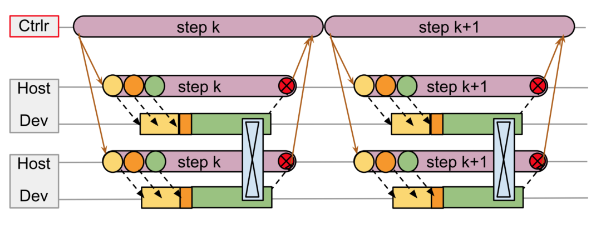
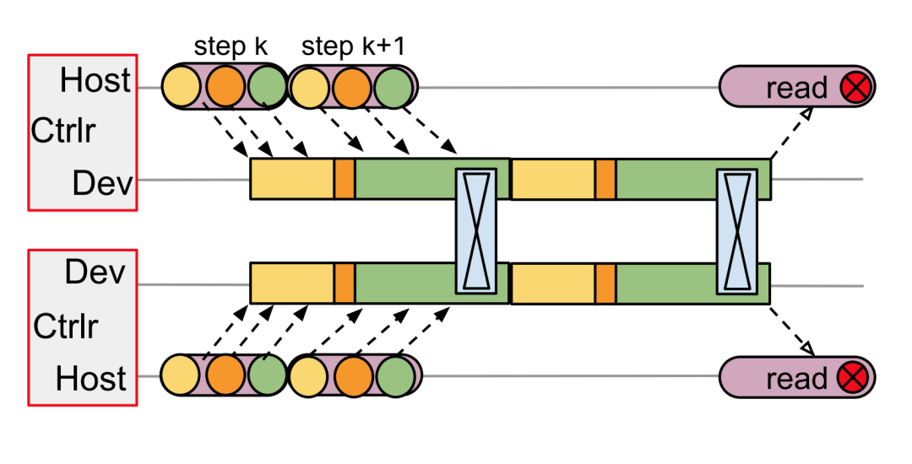
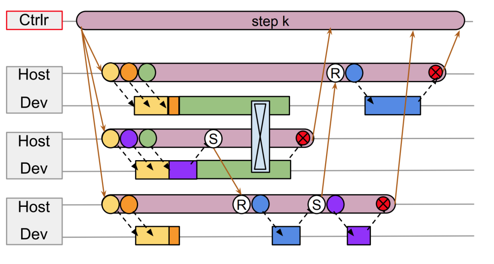
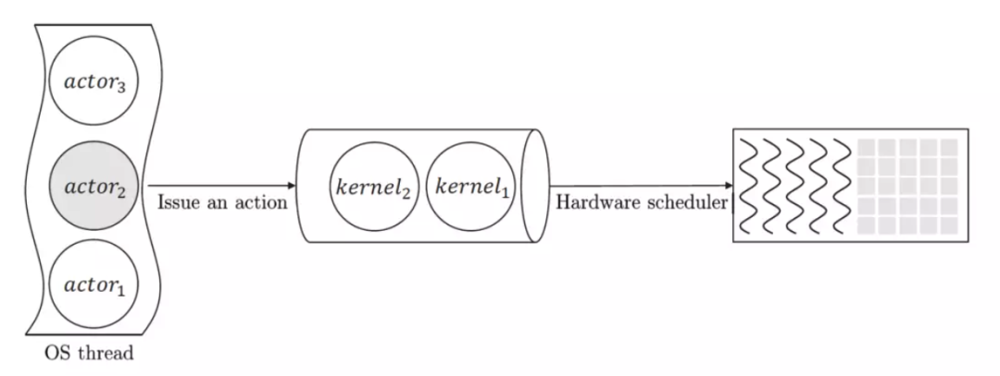
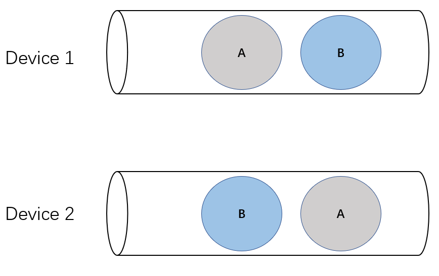
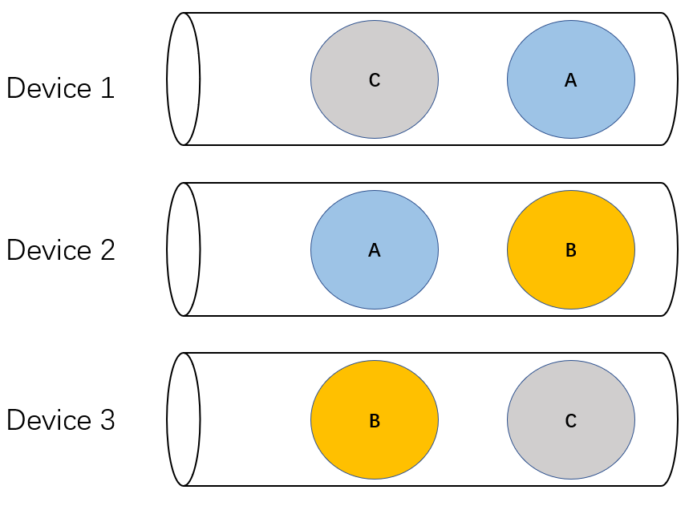
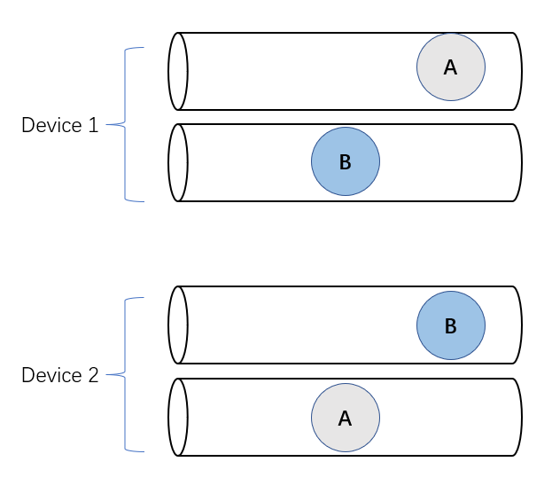

## **1、为什么讨论[Pathways](https://zhida.zhihu.com/search?content_id=198263124&content_type=Article&match_order=1&q=Pathways&zhida_source=entity)?**

近两年 TensorFlow 被斜刺里杀出的 [PyTorch](https://zhida.zhihu.com/search?content_id=198263124&content_type=Article&match_order=1&q=PyTorch&zhida_source=entity) 打了个措手不及，整个行业都在期待 [Jeff Dean](https://zhida.zhihu.com/search?content_id=198263124&content_type=Article&match_order=1&q=Jeff+Dean&zhida_source=entity) 力挽狂澜，祭出一记大杀器扭转乾坤。

去年，Jeff Dean 发了一篇有点万众瞩目的博客（*[https://blog.google/technology/ai/introducing-pathways-next-generation-ai-architecture/](https://link.zhihu.com/?target=https%3A//blog.google/technology/ai/introducing-pathways-next-generation-ai-architecture/)*）。一方面，写博客的人是 Jeff Dean，另一方面，博客的标题《Pathways: 下一代AI架构》耸人听闻，毕竟 Google 和 Jeff Dean 引领了互联网时代和人工智能时代基础架构的发展，别人嘴里说出来“下一代架构”可能是吹牛，Jeff Dean 说出来你不得不重视。这篇博客罗列了 Jeff Dean 对深度学习算法未来演进的判断：多模态、稀疏、动态路由等，这样特征的负载确实会对深度学习底层架构带来影响。

前几天，谷歌先是在arXiv上传了题为《Pathways: asynchronous distributed dataflow for ML》的论文（*[https://arxiv.org/abs/2203.12533](https://link.zhihu.com/?target=https%3A//arxiv.org/abs/2203.12533)*）, 介绍了行业期待已久的Pathways系统的设计理念。没过几天，谷歌又上传了基于 Pathways 系统训练的5400亿参数的大模型《[PaLM](https://zhida.zhihu.com/search?content_id=198263124&content_type=Article&match_order=1&q=PaLM&zhida_source=entity): scaling language modeling with Pathways（*[https://arxiv.org/abs/2204.02311](https://link.zhihu.com/?target=https%3A//arxiv.org/abs/2204.02311)*）》。

说实话，Pathways 论文不是很好懂。我认为这有几方面原因：首先，全世界范围内只有极少数从业者在从事分布式深度学习系统的研究和开发，即使在这个群体里，也只有极少数人曾经思考过文章中讨论的问题，如果不理解 WHY，就很难理解 HOW；其次，这篇论文写得并不好。我觉得，如果一个团队写出来的论文很容易被接收，论文质量就得不到保障，Jeff Dean 的论文就属于这一类，我认为当年TensorFlow的论文（*[https://www.usenix.org/system/files/conference/osdi16/osdi16-abadi.pdf](https://link.zhihu.com/?target=https%3A//www.usenix.org/system/files/conference/osdi16/osdi16-abadi.pdf)*）也很一般，但就是能中 OSDI。几年前，我就是看了 TensorFlow 论文才有信心做一个更好的深度学习框架。

我可能是比较能理解 Pathways 的少数人之一。Pathways 讨论的这些问题我们都思考过，好几年前就思考了，而且还研发出 OneFlow，也写过论文探讨这些问题。遗憾的是，我们在论文里讨论这些问题时，几乎从来没被理解过。今天，从 Google 论文讲出这些道理，这就是不需要证明的真理了。

刚才提到，这篇论文不太容易理解，我来解释一下，希望能把论文里令人费解的事讲明白。尤其当我们理解了 WHY 之后，可能会发现 Pathways 的设计和实现仍欠火候，如果可以更进一步，那恰恰是 OneFlow 早已实现的思路。所以，我在朋友圈开玩笑说要写一篇博客，题目是《Pathways: 向前一步是 OneFlow》或《Pathways 的尽头是 OneFlow》。我计划分两篇文章来讨论 Pathways，第一篇主要讨论背景，也就是 Pathways 的 design motivation，第二篇讨论 Pathways 的设计和实现。

论文花了不少笔墨在讨论 single-controller 和 multi-controller 的问题，没有思考过这个问题的人可能会觉得有点摸不着头脑：“[SPMD](https://zhida.zhihu.com/search?content_id=198263124&content_type=Article&match_order=1&q=SPMD&zhida_source=entity), MPMD, single-controller (client) 和multi-controller (client) 是什么意思？有这么重要吗？这个话题明明很无聊啊”让我们在这篇博客里把这个问题讨论清楚。论文先讨论了后出现的multi-controller，后讨论先出现的single-controller，像“倒叙”一样，我们还是按照时间轴来介绍。

## **2、TF v1 和 single-controller**

先来介绍一下TF v1里的一些基本概念，用户通过一个 Python 客户端（client）来描述计算图（包括神经网络的结构和可使用的资源信息），然后这个计算图通过众所周知的 session.run 交给运行时（runtime）系统, 运行时系统分成一个 master 和若干 worker，其中 master 来完成计算图的编译和切割，并把切割后的每一个子图发给各个对应的 worker 去执行。这里的 client 和 master 是总揽全局信息的，而 worker 只用于执行分配给自己的子图，所以 client 和 master 可以理解成一个 controller，这种结构在 Google 之前发表的论文（譬如GShard和GSPMD中）被称为 single-client，不过在 Pathways 这篇论文里被称为single-controller， 二者的意思是等价的。

上图展示了 TF v1 进行分布式计算时的机制，注意上图并不区分 client 和 master，统称为 controller，每个 worker 由 CPU 代表的 Host 和 GPU 为代表的 Device 组成，图中的箭头表示消息发送，从上到下的箭头代表了 controller 驱动 worker（跨节点通信一般通过以太网），而 worker 内部由 Host 驱动 Device（节点内通信一般通过PCIe），从下向上指的箭头表示 worker 向 controller 发送的汇报进度的消息，每个消息发送都存在一定的延迟（latency）；蓝色方框内的交叉符号表示在两个 device 之间发生了集群通信（一般发生在 NVLink或 RDMA 等专用传输设备）。Controller 把循环（loop）的每个步骤（step）对应的子图发给 worker 去执行，等所有 worker 把各自的子图执行完毕后会告知 controller，controller 再去发射下一个步骤的计算任务。

显而易见，在上图所示的TF v1方案中，由于发送消息存在延迟，虽然 controller 上两个相邻的步骤是紧密排列在一起，但两个 worker上的 device 上都出现了大段的空闲（idle），设备利用率无法饱和。这是一个显而易见的问题，想不通为什么 TensorFlow 开头这么设计。

## **3、[Horovod](https://zhida.zhihu.com/search?content_id=198263124&content_type=Article&match_order=1&q=Horovod&zhida_source=entity) 与 multi-controller**

TF v1 中心调度器的弊端从一开头就存在，早些年即使是最简单的数据并行， TF v1 的性能都被其它框架”吊打“。再加上在相当长一段时间内，数据并行就是分布式深度学习的唯一需求（所谓模型并行、流水并行仅仅最近一两年才变成主流需求），因此就出现了各种优化 TF v1 分布式性能的工作。

最典型的是 Uber 推出的 Horovod，它完全放弃各个深度学习框架自带的分布式功能，推出了一套只做数据并行的全新插件，用这个插件和 TF 等框架的单卡功能配合工作，就让数据并行的分布式训练又快又好，一度成为分布式深度学习的标配。Horovod 的启动和调度方式几乎与传统超算的MPI程序一样，每个卡启动一个进程，所有进程运行的代码完全一样，这就是典型的SPMD，每个进程都是分布式训练的一个客户端（client）或者入口，因此也被称为 multi-client 或 multi-controller。因此，后来 PyTorch/JAX 等框架竞相使用的 SPMD 实际上来自于 Horovod。

让我们看看 SPMD 如何解决 TF v1 里中心调度器的弊端。在 multi-controller 架构里，每个 Host 上都执行完全一样的程序，只是每份程序传入的参数 （rank）不同，标识了每个程序处理的数据片是不一样的。

注意，这里没有中心调度器，每个 Host 都按照相同顺序向各自管理的 Device 队列上发射计算任务即可，多个 Device 在相同的时间点发起集群通信，一旦完成集群通信就可以继续执行各自队列里的计算任务。可见，每个设备的执行队列里都排满了计算任务，不会出现 TF v1 里那么多空闲时间片。在这个架构里，设备之间的集群通信是通过特殊网络连接完成的，Host 和 Device 之间的消息通过 PCIe 来完成，不会承受 TF v1 中心 controller 和 worker 通过以太网通信所产生的高延迟。

Horovod 这种“倒退”让人反思，TensorFlow 是不是过度设计了？在 TensorFlow 的后续版本以及其它新生代框架 PyTorch、JAX 无一不拥抱 multi-controller 的架构。

## **4、非对称通信需求与 MPMD**

如果分布式深度学习都是数据并行那种对称、规则的通信，那么分布式深度学习的天空就一直是艳阳高照了。

事实上，即使加上模型并行，通信仍是对称和规则的，用 all-gather、reduce-scatter 等集群通信就可以了。当流水并行出现时，处于流水线（pipeline）不同阶段（stage）的进程上执行的程序就不一样了，这就是所谓的MPMD。在 MoE 等动态、稀疏的神经网络结构出现以后，这种不对称、不规则的情况越来越多。

在之前的一篇博客《**对抗软件复杂性：恰当分层，不多不少**》里我讨论过分布式深度学习里面的通信模式，有以集群通信为代表的规则通信模式和以点对点通信为代表的不规则通信模式。

于是，Google Pathways 这篇论文说：不行，我们得从 multi-controller 再返回到 single-controller。

如上图所示，假设从上到下三个 worker 的编号分别是1，2，3，显然它们的工作负载不完全相同、不对称。首先是 2 生产的一个中间结果需要通过 Send 发送给 3 的 Recv，3 的某一个中间结果需要通过 Send 发送给 1 的 Recv。Send 和 Recv 要成对出现，而且有顺序要求：Send 严格 happens before Recv。

## **5、死锁的风险**

Pathways 提出非对称的负载（non-SPMD）需要中心调度和群调度（gang scheduling）机制来避免死锁。如果不是框架开发者，或者没有亲自处理过这种非对称、不规则情形所导致的难题，并不好理解。关于这个问题，论文里有一句话非常关键：

*Gang-scheduling is essential in the case of TPUs, since they are single-threaded and only run non-preemptible kernels, so the system will deadlock if communicating computations are not enqueued in a consistent order.（在 TPUs 的情形下，群调度是必须的，原因是，TPUs 上的核函数（kernels）是**单线程**的而且是**非抢占式运行**的，如果多个 TPUs 上的通信操作不是按照一致的顺序发射到任务队列里，系统就会死锁。）*

怎么理解这段话？

一个设备经常被抽象成一个 FIFO 的任务队列，譬如 NVIDIA GPGPU 上 CUDA stream 的概念，队列里的 kernels 按照 FIFO 的方式被处理。其它硬件资源，包括CPU和网络也可以被抽象成任务队列，我们统一把这样的队列称为stream。

所谓单线程，是指一个 TPU 只有一个队列 （类似于在一个 GPU 上只分配一个 CUDA stream）；所谓非抢占式的，是指一个 kernel 一旦发射出去就必须等待它执行结束，它占有的资源才能被回收并用于其它 kernel，换句话说，发射出去的 kernel 不能暂停并把资源让给其它 kernel 去使用，再通俗一点讲，就是这个队列不允许插队。

在单线程和非抢占式调度这两个条件下，两个设备上如果要执行多个集群通信，这几个集群通信对应的 kernels 在这两个设备的队列上一定要顺序一致，否则就会死锁。

如上图所示，有 A 和 B 两个集群通信，如果在两个设备上 A 和 B 的顺序不一致，那么就会卡住，两个设备都不能继续前进，上面那个设备先发射 B kernel，它必须等待下面那个设备上对应 B kernel 发射出来才能完成，但是下面那个设备先发射了 A kernel，同样需要等待上面设备的 A kernel，但上面那个设备的 A kernel 必须等前面的 B kernel 完成才能发射，这就陷入了死锁。

上图展示了另外一种产生死锁的情形（经典的哲学家用餐问题），设备 1 和 2 需要做集群通信 A，设备 2 和设备 3 需要做集群通信 B， 设备 3 需要和设备 1 做集群通信 C，如果各个设备队列以上图所示的顺序发射 kernels，那么也会陷入死锁。

## **6、如何解除死锁？**

显然，如果在各个设备队列之间规定一个发射顺序，可以避免死锁，这实际上就是要用群调度（*gang scheduling，[https://en.wikipedia.org/wiki/Gang\_scheduling](https://link.zhihu.com/?target=https%3A//en.wikipedia.org/wiki/Gang_scheduling)*）的方法。

另外一种方法是使用抢占式调度，也就是允许 kernels 不按队列的顺序执行（换言之，允许插队），那么死锁也可以避免。

还有一种办法是增加并发度，也就是允许每个设备创建多个 FIFO 的队列。Pathways 论文在论述群调度必要性时，强调了 TPUs 场景有死锁的问题，但在 GPUs 场景说的是：

*Even for GPUs or other accelerators that can execute concurrent computations, gang scheduling allows more efficient execution of collectives (Feitelson and Rudolph, 1992).*

也就是说，论文认为设备支持“并发”执行的话，死锁可能就不再是个问题了，所以从执行效率的角度强调了群调度的必要性。增加并发度怎么有助于降低死锁的可能性？

如下图所示，每个设备上多分配几个队列，把 A 和 B 调度到不同的队列上去，也能避免死锁。

不过，增加队列数量不见得从根本上解决问题，队列数量总是有限的，当并发执行的集群通信数超过一个设备上的队列数量时，仍有死锁风险。这个问题在 GPUs 场景真实存在，而且经常发生，死锁源自 GPUs 集群通信都是调用英伟达开发的 NCCL，NCCL 设计存在一个“缺陷”：集群通信的数量超过了最大并发度时可能会死锁。这个问题比较有意思，我觉得也有必要介绍一下。

## **7、NCCL 的死锁陷阱**

NCCL 的文档中专门有一节在讨论多个集群通信并发执行的注意事项*（[https://docs.nvidia.com/deeplearning/nccl/user-guide/docs/usage/communicators.html#using-multiple-nccl-communicators-concurrently](https://link.zhihu.com/?target=https%3A//docs.nvidia.com/deeplearning/nccl/user-guide/docs/usage/communicators.html%23using-multiple-nccl-communicators-concurrently)）：*

*Using multiple NCCL communicators requires careful synchronization, or can lead to deadlocks. **NCCL kernels are blocking (waiting for data to arrive)**, and any CUDA operation can cause a device synchronization, meaning it will wait for all NCCL kernels to complete. This can quickly lead to deadlocks since NCCL operations perform CUDA calls themselves. Operations on different communicators should therefore be used at different epochs with a locking mechanism, and applications should ensure operations are submitted in the same order across ranks. **Launching multiple communication operations (on different streams) might work provided they can fit within the GPU, but could break at any time if NCCL were to use more CUDA blocks per operation**, or if some calls used inside NCCL collectives were to perform a device synchronization (e.g. allocate some CUDA memory dynamically).*

上文加粗字体描述的是当同时发生的集群通信的数量超过一定限制时发生死锁的风险，如何理解这个问题？

当在一个GPU上启动一个集群通信操作时，NCCL 会在GPU上启动一定数量的线程忙等（busy waiting）数据的到来，没等到数据，这些线程就不会退出，换句话说，这些集群通信的kernel 是非抢占式的。

这些线程会占用一定数量的 GPU cores，譬如64个，一个 GPU 的 core 的总数有限，譬如 4096 个，那么这个 GPU 上最多可以启动的集群通信数量就是4096/64 = 64个。如果用任务队列的例子来理解，也就是这个 GPU 最多支持 64 个服务于 NCCL 的任务队列，当并发执行的集群通信数量超过 64 时，就有死锁的风险。

## **8、总结**

为避免因不规则通信引入的死锁，Pathways 所开的药方是群调度加中心调度，在同一团设备（设备岛，island of accelerators）上用群调度，不同团设备之间通过中心调度器来协调多个设备团之间按照一致的顺序来发射集群通信操作。

是不是用中心调度就能解决所有可能的死锁？不见得，中心化的动态调度仍可能面临因资源依赖引入的死锁，我在之前的博客《资源依赖的诅咒：原有深度学习框架的缺陷》讨论过一个思想实验，在我们的论文《*OneFlow: Redesign the Distributed Deep Learning Framework from Scratch*

*([https://arxiv.org/pdf/2110.15032.pdf](https://link.zhihu.com/?target=https%3A//arxiv.org/pdf/2110.15032.pdf))*》中也讨论过。

是不是必须使用中心调度才能解决死锁？也不见得，如果神经网络是静态图，在静态编译阶段利用控制边安排好执行顺序，那么去中心化的调度也不会出现死锁，实际上静态编译就相当于一种 ahead of time 的中心调度器，当编译器把执行顺序安排好之后，在运行阶段是不是有中心调度器就不重要了。

最后，值得一提的是，SPMD 适合 multi-controller，以及MPMD适合single-controller，但并不是一一对应绑死的关系。使用single-controller 可以支持SPMD （例如，TF v1 支持数据并行和模型并行），使用multi-controller 也可以支持MPMD （例如GSPMD 论文对流水并行的支持，以及 OneFlow multi-client架构对流水并行的支持）。

因此，从避免死锁的角度论证使用 single-controller 和中心化调度的必要性有些牵强。当然，还有另外的原因和证据支持必须使用中心化调度这个设计。我们在下一篇文章展开讨论。
