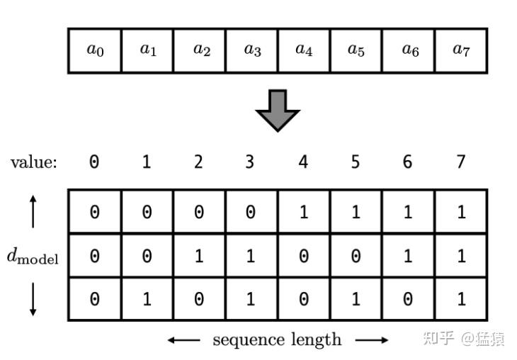
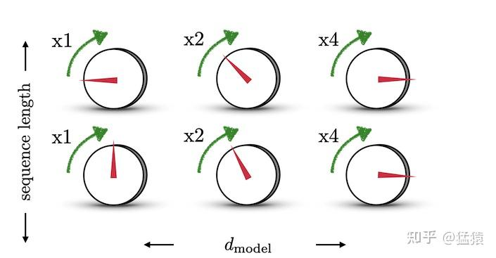
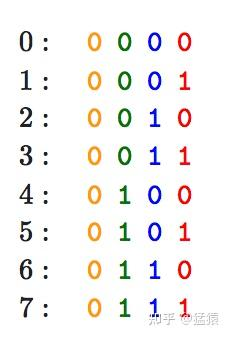
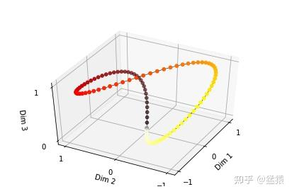

**小小引流一下，最近在更新ChatGPT系列，感兴趣的朋友可以移步[猛猿：ChatGPT技术解析系列之：训练框架InstructGPT](https://zhuanlan.zhihu.com/p/605516116)**

* * *

自从2017年[Transformer](https://zhida.zhihu.com/search?content_id=189127040&content_type=Article&match_order=1&q=Transformer&zhida_source=entity)模型被提出以来，它已经从论文最初的机器翻译领域，转向图像，语音，视频等等方面的应用（实现作者们在论文结论里的大同之梦）。原论文的篇幅很紧密，不看代码的话，缺乏了很多细节描述。我的学历经历大概是两周啃paper+代码 => 两周挖细节=>未来这个模型还有很多值得端详。在Transformer系列的笔记里，我把模型拆成了各个零件进行学习，最后把这些零件组装成Transformer，涵盖内容如下：  

1.  Positional Encoding （位置编码）
2.  [Self-attention（自注意力机制），点击跳转](https://zhuanlan.zhihu.com/p/455399791)
3.  [Batch Norm & Layer Norm（批量标准化/层标准化）,点击跳转](https://zhuanlan.zhihu.com/p/456863215)
4.  [ResNet（残差网络），点击跳转](https://zhuanlan.zhihu.com/p/459065530)
5.  [Subword Tokenization（子词分词法），点击跳转](https://zhuanlan.zhihu.com/p/460678461)
6.  组装：Transformer

这是Transformer系列的第一篇。这个笔记系列（即上方超链接）持续更新，欢迎大家一起来学习～

本篇目录结构如下：

一、什么是位置编码

二、构造位置编码的方法 /演变历程

-   2.1 用整型值标记位置
-   2.2 用\[0,1\]范围标记位置
-   2.3 用二进制向量标记位置
-   2.4 用周期函数（sin）来表示位置
-   2.5 用sin和cos交替来表示位置

三、Transformer中位置编码方法：Sinusoidal functions

-   3.1 Transformer 位置编码定义
-   3.2 Transformer位置编码可视化
-   3.3 Transformer位置编码的重要性质

四、参考

## 一、什么是位置编码

在transformer的encoder和decoder的输入层中，使用了Positional Encoding，使得最终的输入满足：

$input = input\_embedding + positional\_encoding$  

这里，input\_embedding是通过常规embedding层，将每一个token的向量维度从vocab\_size映射到d\_model，由于是相加关系，自然而然地，这里的positional\_encoding也是一个d\_model维度的向量。（在原论文里，d\_model = 512）  

那么，我们为什么需要position encoding呢？在transformer的self-attention模块中，序列的输入输出如下（不了解self-attention没关系，这里只要关注它的输入输出就行）：  

在self-attention模型中，输入是一整排的tokens，对于人来说，我们很容易知道tokens的位置信息，比如：  
（1）绝对位置信息。a1是第一个token，a2是第二个token......  
（2）相对位置信息。a2在a1的后面一位，a4在a2的后面两位......  
（3）不同位置间的距离。a1和a3差两个位置，a1和a4差三个位置....  
但是这些对于self-attention来说，是无法分辩的信息，因为self-attention的运算是无向的。因为，我们要想办法，把tokens的位置信息，喂给模型。

## 二、构造位置编码的方法 /演变历程

### 2.1 用整型值标记位置

一种自然而然的想法是，给第一个token标记1，给第二个token标记2...，以此类推。  
这种方法产生了以下几个主要问题：  
（1）模型可能遇见比训练时所用的序列更长的序列。不利于模型的泛化。  
（2）模型的位置表示是无界的。随着序列长度的增加，位置值会越来越大。  

### 2.2 用\[0,1\]范围标记位置

为了解决整型值带来的问题，可以考虑将位置值的范围限制在\[0, 1\]之内，其中，0表示第一个token，1表示最后一个token。比如有3个token，那么位置信息就表示成\[0, 0.5, 1\]；若有四个token，位置信息就表示成\[0, 0.33, 0.69, 1\]。  
但这样产生的问题是，当序列长度不同时，token间的相对距离是不一样的。例如在序列长度为3时，token间的相对距离为0.5；在序列长度为4时，token间的相对距离就变为0.33。  

因此，我们需要这样一种位置表示方式，满足于：  
（1）它能用来表示一个token在序列中的绝对位置  
（2）在序列长度不同的情况下，不同序列中token的相对位置/距离也要保持一致  
（3）可以用来表示模型在训练过程中从来没有看到过的句子长度。

### 2.3 用二进制向量标记位置

考虑到位置信息作用在input embedding上，因此比起用单一的值，更好的方案是用一个和input embedding维度一样的向量来表示位置。这时我们就很容易想到二进制编码。如下图，假设d\_model = 3，那么我们的位置向量可以表示成：  

这下所有的值都是有界的（位于0，1之间），且transformer中的d\_model本来就足够大，基本可以把我们要的每一个位置都编码出来了。  

但是这种编码方式也存在问题：这样编码出来的位置向量，处在一个离散的空间中，不同位置间的变化是不连续的。假设d\_model = 2，我们有4个位置需要编码，这四个位置向量可以表示成\[0,0\],\[0,1\],\[1,0\],\[1,1\]。我们把它的位置向量空间做出来：  

如果我们能把离散空间（黑色的线）转换到连续空间（蓝色的线），那么我们就能解决位置距离不连续的问题。同时，我们不仅能用位置向量表示整型，我们还可以用位置向量来表示浮点型。  

### 2.4 用周期函数（sin）来表示位置

回想一下，现在我们需要一个有界又连续的函数，最简单的，正弦函数sin就可以满足这一点。我们可以考虑把位置向量当中的每一个元素都用一个sin函数来表示，则第t个token的位置向量可以表示为：

$$
PE_t = [\sin(\frac{1}{2^0}t), \sin(\frac{1}{2^1}t), ..., \sin(\frac{1}{2^{i-1}}t), ..., \sin(\frac{1}{2^{d_{model}-1}}t)]
$$

结合下图，来理解一下这样设计的含义。图中每一行表示一个 $PE_t$ ，每一列表示 $PE_t$ 中的第i个元素。旋钮用于调整精度，越往右边的旋钮，需要调整的精度越大，因此指针移动的步伐越小。每一排的旋钮都在上一排的基础上进行调整（函数中t的作用）。通过频率 $\frac{1}{2^{i-1}}$ 来控制sin函数的波长，频率不断减小，则波长不断变大，此时sin函数对t的变动越不敏感，以此来达到越向右的旋钮，指针移动步伐越小的目的。 这也类似于二进制编码，每一位上都是0和1的交互，越往低位走（越往左边走），交互的频率越慢。  

由于sin是周期函数，因此从纵向来看，如果函数的频率偏大，引起波长偏短，则不同t下的位置向量可能出现重合的情况。比如在下图中(d\_model = 3），图中的点表示每个token的位置向量，颜色越深，token的位置越往后，在频率偏大的情况下，位置响亮点连成了一个闭环，靠前位置（黄色）和靠后位置（棕黑色）竟然靠得非常近：  

为了避免这种情况，我们尽量将函数的波长拉长。一种简单的解决办法是同一把所有的频率都设成一个非常小的值。因此在transformer的论文中，采用了 $\frac{1}{10000^{i/(d_{model}-1)}}$ 这个频率（这里i其实不是表示第i个位置，但是大致意思差不多，下面会细说）

总结一下，到这里我们把位置向量表示为：

$$
PE_t = [\sin(w_0t), \sin(w_1t), ..., \sin(w_{i-1}t), ..., \sin(w_{d_{model}-1}t)]
$$
其中， $w_{i} = \frac{1}{10000^{i/(d_{model}-1)}}$

### 2.5 用sin和cos交替来表示位置

目前为止，我们的位置向量实现了如下功能：  
（1）每个token的向量唯一（每个sin函数的频率足够小）  
（2）位置向量的值是有界的，且位于连续空间中。模型在处理位置向量时更容易泛化，即更好处理长度和训练数据分布不一致的序列（sin函数本身的性质）

那现在我们对位置向量再提出一个要求，**不同的位置向量是可以通过线性转换得到的**。这样，我们不仅能表示一个token的绝对位置，还可以表示一个token的相对位置，即我们想要：

$PE_{t+\bigtriangleup t} = T_{\bigtriangleup t} * PE_{t}$

这里，T表示一个线性变换矩阵。观察这个目标式子，联想到在向量空间中一种常用的线形变换——旋转。在这里，我们将t想象为一个角度，那么 $\bigtriangleup t$就是其旋转的角度，则上面的式子可以进一步写成：

$$
\begin{pmatrix}
\sin(t + \bigtriangleup t)\\
\cos(t + \bigtriangleup t)
\end{pmatrix}
=
\begin{pmatrix}
\cos\bigtriangleup t & \sin\bigtriangleup t \\
-\sin\bigtriangleup t & \cos\bigtriangleup t
\end{pmatrix}
\begin{pmatrix}
\sin t\\
\cos t
\end{pmatrix}
$$

有了这个构想，我们就可以把原来元素全都是sin函数的 $PE_t$ 做一个替换，我们让位置两两一组，分别用sin和cos的函数对来表示它们，则现在我们有：

$$
PE_t = [\sin(w_0t), \cos(w_0t), \sin(w_1t), \cos(w_1t), ..., \sin(w_{\frac{d_{model}}{2}-1}t), \cos(w_{\frac{d_{model}}{2}-1}t)]
$$

在这样的表示下，我们可以很容易用一个线性变换，把 $PE_t$ 转变为 $PE_{t + \bigtriangleup t}$ :

$PE_{t+\bigtriangleup t} = T_{\bigtriangleup t} * PE_{t} =\begin{pmatrix}   \begin{bmatrix}   cos(w_0\bigtriangleup t)& sin(w_0\bigtriangleup t)\\   -sin(w_0\bigtriangleup t)& cos(w_0\bigtriangleup t) \end{bmatrix}&...&0 \\   ...&  ...& ...\\   0&  ...&  \begin{bmatrix}   cos(w_{\frac{d_{model}}{2}-1 }\bigtriangleup t)& sin(w_{\frac{d_{model}}{2}-1}\bigtriangleup t)\\   -sin(w_{\frac{d_{model}}{2}-1}\bigtriangleup t)& cos(w_{\frac{d_{model}}{2}-1}\bigtriangleup t) \end{bmatrix} \end{pmatrix}\begin{pmatrix}  sin(w_0t)\\  cos(w_0t)\\  ...\\  sin(w_{\frac{d_{model}}{2}-1}t)\\  cos(w_{\frac{d_{model}}{2}-1}t) \end{pmatrix} = \begin{pmatrix}  sin(w_0(t+\bigtriangleup t))\\  cos(w_0(t+\bigtriangleup t))\\  ...\\  sin(w_{\frac{d_{model}}{2}-1}(t+\bigtriangleup t))\\  cos(w_{\frac{d_{model}}{2}-1}(t+\bigtriangleup t)) \end{pmatrix}$  

## 三、Transformer中位置编码方法：Sinusoidal functions

### 3.1 Transformer 位置编码定义

有了上面的演变过程后，现在我们就可以正式来看transformer中的位置编码方法了。  

定义：  
\- t是这个token在序列中的实际位置（例如第一个token为1，第二个token为2...）  
\- $PE_t\in\mathbb{R}^d$ 是这个token的位置向量， $PE_{t}^{(i)}$ 表示这个位置向量里的第i个元素  
\- $d_{model}$ 是这个token的维度（在论文中，是512)  

则 $PE_{t}^{(i)}$ 可以表示为：

$PE_{t}^{(i)} = \left\{\begin{matrix}   \sin(w_kt),&if\ i=2k \\   \cos(w_kt),&if\ i = 2k+1 \end{matrix}\right.$

这里：  
$w_k = \frac{1}{10000^{2k/d_{model}}}$  
$i = 0,1,2,3,...,\frac{d_{model}}{2} -1$

看得有点懵不要紧，这个意思和2.5中的意思是一模一样的，把512维的向量两两一组，每组都是一个sin和一个cos，这两个函数共享同一个频率 $w_i$ ，一共有256组，由于我们从0开始编号，所以最后一组编号是255。sin/cos函数的波长（由 $w_i$ 决定）则从 $2\pi$ 增长到 $2\pi * 10000$

### 3.2 Transformer位置编码可视化

下图是一串序列长度为50，位置编码维度为128的位置编码可视化结果：

可以发现，由于sin/cos函数的性质，位置向量的每一个值都位于\[-1, 1\]之间。同时，纵向来看，图的右半边几乎都是蓝色的，这是因为越往后的位置，频率越小，波长越长，所以不同的t对最终的结果影响不大。而越往左边走，颜色交替的频率越频繁。

### 3.3 Transformer位置编码的重要性质

让我们再深入探究一下位置编码的性质。

**(1) 性质一：两个位置编码的点积(dot product)仅取决于偏移量** $\bigtriangleup t$ **，也即两个位置编码的点积可以反应出两个位置编码间的距离。**

证明：  
$\begin{aligned}  PE_{t}^{T}*PE_{t+\bigtriangleup t} &= \sum_{i = 0}^{\frac{d_{model}}{2}-1} [sin(w_it)sin(w_i(t+\bigtriangleup t) + cos(w_it)cos(w_i(t+\bigtriangleup t)]\\ &= \sum_{i = 0}^{\frac{d_{model}}{2}-1}cos(w_i(t-(t+\bigtriangleup t)))\\ & = \sum_{i = 0}^{\frac{d_{model}}{2}-1}cos(w_i\bigtriangleup t) \end{aligned}$  

**(2) 性质二：位置编码的点积是无向的，即 $PE_{t}^{T}*PE_{t+\bigtriangleup t} = PE_{t}^{T}*PE_{t-\bigtriangleup t}$**

证明：  
由于cos函数的对称性，基于性质1，这一点即可证明。  
我们可以分别训练不同维度的位置向量，然后以某个位置向量 $PE_t$ 为基准，去计算其左右和它相距 $\bigtriangleup t$ 的位置向量的点积，可以得到如下结果：  

这里横轴的k指的就是 $\bigtriangleup t$ ，可以发现，距离是对成分布的，且总体来说， $\bigtriangleup t$ 越大或者越小的时候，内积也越小，可以反馈距离的远近。也就是说，虽然位置向量的点积可以用于表示**距离(distance-aware)**，但是它却不能用来表示位置的**方向性(lack-of-directionality)**。  

当位置编码随着input被喂进attention层时，采用的映射方其实是：

$PE_t^TW_Q^TW_KPE_{t+k}$

这里 $W_Q^T$ 和 $W_K$ 表示self-attention中的query和key参数矩阵，他们可以被简写成 $W$ 表示attention score的矩阵，到这里看不懂也没事，在self-attention的笔记里会说明的）。我们可以随机初始化两组 $W_1，W_2$ ，然后将 $PE_t^TW_1PE_{t+k}$ ， $PE_t^TW_2PE_{t+k}$ 和 $PE_t^TPE_{t+k}$ 这三个内积进行比较，得到的结果如下：  

绿色和黄色即是 $W_1$ 和 $W_2$ 的结果。可以发现，进入attention层之后，内积的**距离意识(distance-aware)**的模式也遭到了破坏。更详细的细节，可以参见复旦大学这一篇用transformer做NER的[论文](https://link.zhihu.com/?target=https%3A//arxiv.org/pdf/1911.04474.pdf)中。  

在Transformer的论文中，比较了用positional encoding和learnable position embedding(让模型自己学位置参数）两种方法，得到的结论是两种方法对模型最终的衡量指标差别不大。不过在后面的BERT中，已经改成用learnable position embedding的方法了，也许是因为positional encoding在进attention层后一些优异性质消失的原因（猜想）。Positional encoding有一些想象+实验+论证的意味，而编码的方式也不只这一种，比如把sin和cos换个位置，依然可以用来编码。关于positional encoding，我也还在持续探索中。

## 四、参考

1.  [https://towardsdatascience.com/master-positional-encoding-part-i-63c05d90a0c3](https://link.zhihu.com/?target=https%3A//towardsdatascience.com/master-positional-encoding-part-i-63c05d90a0c3)
2.  [https://kazemnejad.com/blog/transformer\_architecture\_positional\_encoding/](https://link.zhihu.com/?target=https%3A//kazemnejad.com/blog/transformer_architecture_positional_encoding/)
3.  [https://arxiv.org/pdf/1911.04474.pdf](https://link.zhihu.com/?target=https%3A//arxiv.org/pdf/1911.04474.pdf)
