**【往期文章汇总】**

[猛猿：【必看】历史技术文章导航](https://zhuanlan.zhihu.com/p/654910335) 文章

* * *

**大家好，今天的这篇文章，我想避开复数的推导，从一些全新的、更好玩、更可视化的角度，来探究[RoPE](https://zhida.zhihu.com/search?content_id=248968516&content_type=Article&match_order=1&q=RoPE&zhida_source=entity)的原理和各种性质。**  

**这里所说的“可视化”，不仅仅是大家熟悉的“向量空间的旋转”**，而是：

-   具体能让你在调控RoPE的超参时，可以在脑海里快速绘制出一副图，预估你的调参对模型效果的大致影响
-   或者是当你想探寻衰减性和外推性时，你的脑海里不再仅有代表结果的那一副曲线图，你能动态地绘制出这些重要的性质是怎么一步步产生的。

诸如此类。而当你看完这篇文章，你就能站在几何的角度去理解复数推导的过程了（复数的运算本身就具有几何意义）。

## 一、原始Transformer函数式位置编码

### 1.1 从旋转的角度理解原理

[transformer位置编码](https://zhida.zhihu.com/search?content_id=248968516&content_type=Article&match_order=1&q=transformer%E4%BD%8D%E7%BD%AE%E7%BC%96%E7%A0%81&zhida_source=entity)原理我们在[这篇文章](https://zhuanlan.zhihu.com/p/454482273)中详细讲过，这里我们对它进行一个快速的回顾解读。了表达方便，我们先**以二维特征空间为例，根据transformer PE的构造方法，我们有**：  

-   $t$ 位置的编码为 $PE_{t} = \begin{pmatrix}  sin \theta t\\  cos \theta t \end{pmatrix}$
-   $t + \Delta t$ 位置的编码为 $PE_{t + \Delta t} = \begin{pmatrix}  sin \theta (t + \Delta t)\\  cos \theta (t + \Delta t) \end{pmatrix}$

其中 $\theta$ 是我们设定好的常数。  

那么根据:

-   $sin(\alpha + \beta) = sin \alpha *cos \beta + cos \alpha * sin \beta$
-   $cos(\alpha + \beta) = cos \alpha *cos \beta - sin \alpha * sin \beta$

我们可以把 $PE_{t}$ 和 $PE_{t} + \Delta t$ 的关系拆解成：

$\begin{pmatrix}  sin \theta (t + \Delta t)\\  cos \theta (t + \Delta t) \end{pmatrix} =  \begin{pmatrix}   cos \theta\Delta t &  sin \theta\Delta t\\   -sin \theta\Delta t& cos \theta\Delta t \end{pmatrix} * \begin{pmatrix}  sin \theta t \\  cos \theta t  \end{pmatrix}  = \mathcal {R_{\Delta t}} * \begin{pmatrix}  sin \theta t \\  cos \theta t  \end{pmatrix}$  

从这个拆解关系我们可以直观看出，**由于** $\mathcal {R_{\Delta t}}$ **是一个表示顺时针旋转的正交矩阵（正交意味着旋转不改变向量的模长，只改变方向），则** $PE_{t + \Delta t}$ **其实就是以** $PE_{t}$ **为基础，顺时针旋转** $\theta * \Delta t$ **这个角度而来**。  

为了直观体会到这点，我们以 $PE_{0}$ 为基础，画图看一下不同的 $PE_{0 + \Delta t}$ 是如何旋转而来的：  

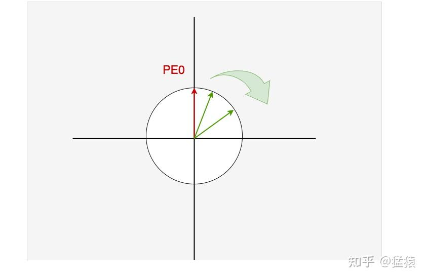

在直观理解了如何从 $PE_{t}$ 推导至 $PE_{t + \Delta t}$ 的基础上，我们来探究 $PE_{t}^{T} * PE_{t + \Delta t}$ 的性质：

-   $PE_{t}^{T} * PE_{t + \Delta t} = ||PE_{t}|| * || PE_{t + \Delta t} || * cos (\theta \Delta t)$

由于 $\theta$ 是预先设定好的一个常数，所以当我们假设某个t固定不变，然后慢慢增大 $\Delta$ 时， $cos (\theta \Delta t)$ 逐渐变小，**这也意味着相距较远的两个位置编码的内积越小，即内积可以用于反馈两个位置向量在绝对位置上的远近**  

但是，细心的你一定发现了，**如果我保持红色** $PE_0$ **不变，顺时针慢慢转动绿色PE时，可能会出现下图的情况，即图中所示的两个绿向量和红向量的内积是一样的，但是左侧绿向量明明距离红向量更远**，此时，我们似乎无法从内积大小判断两个位置向量的远近：  

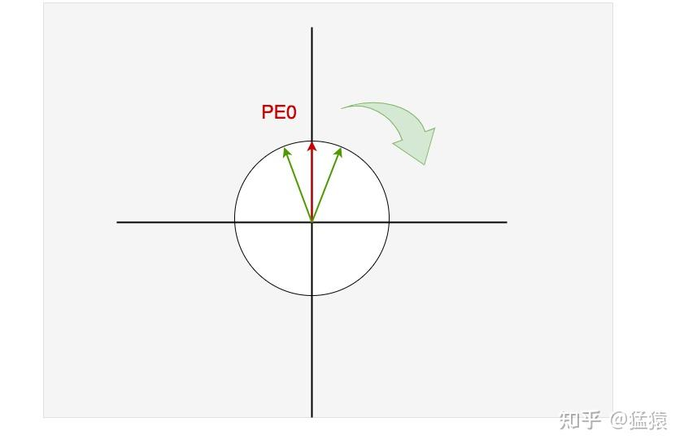

**那该怎么办呢？我们有一个粗暴但有效的解决方法：让每次位置变动时的转动角度小一些，不就可以了吗？**由于我们转动角度为 $\theta * \Delta t$ ，**这意味着只要我们尽量把** $\theta$ **设置得小一些（这就意味着调大了** $cos(\theta\Delta t)$ **的周期）**，让绿线旋转的幅度小一些，使得不管有多少个位置向量，绿线都在第一和第四象限内移动，不就可以了吗？这就是关于 $\theta$ 的一个最简单的直观解释，在后文中，我们还会结合更细致的内容，继续探寻 $\theta$ 在更高维的位置向量特种空间中的作用。

### 1.2 缺陷

从1.1节的介绍中，我们提取到两个关于transformer原始位置编码的重要信息：  

-   **在设置合适的** $\theta$ **值的前提下，每个位置都能取到唯一的位置编码（绝对性）**
-   **一个位置编码可以由另一个位置编码旋转而来（相对性），且在设置合适的** $\theta$ **值的前提下，两个位置编码的内积大小可以反应位置的远近，内积越小，距离越远（衰减性）。**

我们固定住某个t，变动 $\Delta$ ，来可视化一下 $PE_{t}^{T} * PE_{t + \Delta t}$ 的变动趋势（实验结果来自[这篇论文](https://link.zhihu.com/?target=https%3A//arxiv.org/pdf/1911.04474.pdf)）:  

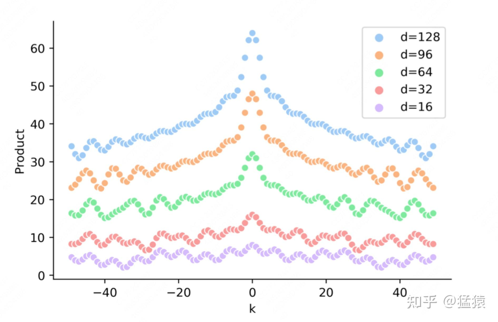

如图：

-   横轴表示 $\Delta$
-   纵轴表示固定某个 $PE_{t}$ 的情况下，改变 $\Delta$ 后得到的 $PE_{t}$ 和 $PE_{t + \Delta t}$ 的内积
-   d表示不同的hidden\_size（例如在1.1节中，我们就假设d = 2）

从图中我们可以发现：

-   **在固定某个** $PE_{t}$ **的情况下，两个位置编码的内积具有对称性**（很简单，对照1.1的圆圈，想象cos函数的对称性。更严谨的推导参见[这篇文章](https://zhuanlan.zhihu.com/p/454482273)的3.3节（1）部分）
-   **在固定某个** $PE_{t}$ **的情况下，两个位置编码的内积具有远程衰减性（在上面实验图对应的原始论文中被称为“距离意识（distance-aware）”）**，即两个位置编码相距越远，距离越小。

**看起来，transformer的原始位置编码应该已经足够好了，可是为什么在很长的一段时间里，人们还是普遍用可学习式的位置编码，甚至还有很多实验证明了transformer的这种位置编码对最终的效果没有起到实质性帮助呢？**  

**这是因为，我们上述的一切分析，都是在原始位置编码** $PE_{t}^{T} * PE_{t + \Delta t}$ **上的结果**，我们一般把位置编码和输入层的token相加，然后让他们继续去做接下来的计算。可是，transformer架构是复杂的，更详细地说，**当token向量进入[attention层](https://zhida.zhihu.com/search?content_id=248968516&content_type=Article&match_order=1&q=attention%E5%B1%82&zhida_source=entity)时，起作用的还是** $PE_{t}^{T} * PE_{t + \Delta t}$ **这个部分吗？**  

为了更详细探究这个问题，我们假设：

-   $x_{t}, x_{t + \Delta_{t}}$ 分别为两个不同位置的原始token向量，其尺寸为`(hidden_size, 1)`
-   $PE_{t}, PE_{t + \Delta t}$ 分别为两个不同位置的原始PE向量，其尺寸为`(hidden_size, 1)`
-   $W_Q, W_K$ 分别为尺寸为`(hidden_size, hidden_size)`的Q、K矩阵

那么数据过attention部分可以表示成：

$\begin{aligned} q_{t}^{T} * k_{t + \Delta t} &= [W_{Q} * (x_{t} + PE_{t})]^{T}[W_{K} * (x_{t + \Delta t} + PE_{t + \Delta t})]\\ &= [x_{t}^{T}W_{Q}^{T} + PE_{t}^{T}W_{Q}^{T}][W_{K}x_{t + \Delta t} + W_{K}PE_{t + \Delta t}] \end{aligned}$  

**我们只关注其中和两个位置变量都相关的部分，也就是：**  
$PE_{t}^{T}W_{Q}^{T}W_{K}PE_{t + \Delta t}$  

从中我们不难发现，经过attention层后，位置编码真正起作用的不再是 $PE_{t}^{T} * PE_{t + \Delta t}$ ，而是引入了[线性变化](https://zhida.zhihu.com/search?content_id=248968516&content_type=Article&match_order=1&q=%E7%BA%BF%E6%80%A7%E5%8F%98%E5%8C%96&zhida_source=entity)后的 $PE_{t}^{T}W_{Q}^{T}W_{K}PE_{t + \Delta t}$ 。**那么再引入这种线性变化后，位置编码还能保持上述所说的绝对性、相对性和远距离衰减性这种优良性值吗？我们同样用实验的方式来细看这一点。**  

由于 $W_{Q}^{T}W_{K}$ 本质上可以合成一种线性变化，所以我们可以随机初始化一个线性矩阵来代替它，在我们的实验中，我们做了三组试验：

-   $PE_{t}^{T} * PE_{t + \Delta t}$
-   $PE_{t}^{T}* W_{1} *PE_{t + \Delta t}$ ，其中 $W_{1}$ 是我们随机初始化的一个线性矩阵
-   $PE_{t}^{T}* W_{2} *PE_{t + \Delta t}$ ，其中 $W_{2}$ 是我们随机初始化的一个线性矩阵

同样，我们固定住某个我们固定住某个t，变动 $\Delta$ ，来可视化一下这三组试验的结果：  

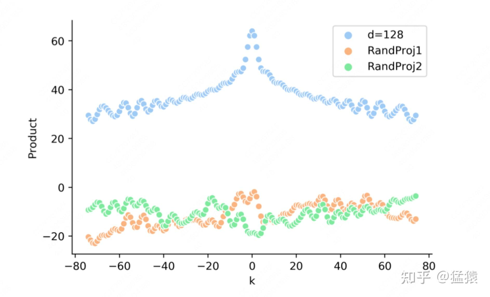

上图中的橘线和绿线即表示两位置编码内积间引入线性变化 $W_1, W_2$ 后的结果，**可以发现相比于标准的蓝线（** $PE_{t}^{T} * PE_{t + \Delta t}$ **），原始位置编码的优良性质（远程衰减性等）都受到了极大程度的破坏**。  

**总结来看，虽然原始transfomer位置编码本身考虑了绝对性、相对性和远程衰减性，但是由于位置编码经过attention层后，最终起作用的形式是** $PE_{t}^{T}W_{Q}^{T}W_{K}PE_{t + \Delta t}$ **而不是** $PE_{t}^{T}PE_{t + \Delta t}$ **，而进一步我们通过实验直观证明了插入一个线性变化会极大破坏位置编码设计之初的各种优良性质，所以早期transformer的这种函数式的位置编码并没有得到大家的青睐。**

## 二、RoPE

在第一部分的分析中，我们已经知道attention层的计算（$q_{t}^{T} k_{t + \Delta t}$）会破坏掉输入层位置编码的优良性质，那么我们自然而然会想到：如果我直接在attention层中融入位置信息，也就是我直接把位置编码作用于 $q_{t}^{T} k_{t + \Delta t}$，这样我不就能维持位置编码优良性质不变吗？（在接下来的讲解中，为了表达方便，我们直接用下标m和n表示两个位置）

### 2.1 $q_{m}^{T} k_{n}$ 在做一件什么事

这里 $q_{m}, k_{n}$ 都是尺寸为`(hidden_size, 1)`的向量。  
我们知道，当我们计算 $q_{m}^{T} k_{n}$ 时，我们是在做attention score的计算，其结果表示m位置的token和n位置token间的相关性分数。**现在让我们切换一下视角，这个相关性分数其实就是两个特征向量之间的内积，在一定程度上衡量了两个向量之间的相似性。**  

现在我们希望把位置编码的信息直接引入 $q_{m}^{T} k_{n}$ 中，这也就意味着，**我们希望根据|n-m|的结果，给这个内积计算一定的惩罚：**

-   当|n-m|较小时，我们希望拉进近$q_{m}, k_{n}$ 的距离
-   当|n-m|较大时，我们希望拉远 $q_{m}, k_{n}$ 的距离

你可能觉得有些抽象，不要紧，我们马上仿照1.1中的方式，给出可视化的解释

### 2.2 旋转角度：二维空间

假设原始 $q_{m}, k_{n}$ 的特征向量如下：  

模仿1.1的方式，如果我们想让 $q_{m}, k_{n}$ 具备位置信息，我们可以分别把他们旋转m和n度。在**1.1中我们采用顺时针旋转，在这里我们使用逆时针旋转**（没有特殊原因，只是为了和原始rope旋转方式贴合），那么我们可以得到如下结果，其中 $q'_{m}, k'_{n}$ 分别表示旋转后的结果：  

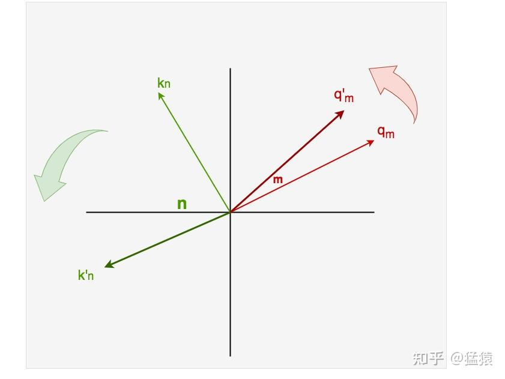

可以发现，旋转过后，随着|n-m|差值的变大，**在保持向量模长不变的情况下**，我们拉远了 $q_{m}, k_{n}$ 两者之间的距离，也即降低了它们的内积，最后达到降低（惩罚）attention score的效果。  

同时，和1.1中一样，我们同样需要引入参数 $\theta$，通过拉长三角函数周期的方式确保不同位置的向量不发生碰撞。我们以上图中的 $q_{m}$ 为例，当保持其模长不变的情况下，它的逆时针运动轨迹是一个圆，这也意味着一个较小的m和一个较大的m代表的向量可能会重合，所以我们需要使用 $\theta$ 这种形式，对q每次旋转的幅度加以控制。  

总结起来，在二维特征空间下，我们定义了一个**逆时针[正交旋转矩阵](https://zhida.zhihu.com/search?content_id=248968516&content_type=Article&match_order=1&q=%E6%AD%A3%E4%BA%A4%E6%97%8B%E8%BD%AC%E7%9F%A9%E9%98%B5&zhida_source=entity)(正如1.1所说，正交旋转矩阵保证了模长不变，即维护q，k原始的特征，只单纯做旋转使其拥有绝对位置信息)：**  
$\mathcal{R}_{i} = \begin{pmatrix}   cos i\theta & -sin i\theta\\   sin i\theta & cos i\theta \end{pmatrix}$

其中 $i$ 表示绝对位置，例如0，1，2...  

接着我们将其作用到attention部分的计算上，则有：

$\begin{aligned} (\mathcal{R}_{m}q_{m})^{T}(\mathcal{R}_{n}k_{n}) &= [\begin{pmatrix}   cos m\theta & -sin m\theta\\   sin m\theta & cos m\theta \end{pmatrix} * \begin{pmatrix}  q_{0}\\ q_{1} \end{pmatrix}]^{T} [\begin{pmatrix}   cos n\theta & -sin n\theta\\   sin n\theta & cos n\theta \end{pmatrix} * \begin{pmatrix}  k_{0}\\ k_{1} \end{pmatrix}]\\ &= \begin{pmatrix}   q_{0}&q_{1} \end{pmatrix} * \begin{pmatrix}   cos ((n-m)\theta) & -sin ((n-m)\theta)\\   sin ((n-m)\theta) & cos ((n-m)\theta) \end{pmatrix} * \begin{pmatrix}  k_{0}\\  k_{1} \end{pmatrix} \\ &= q_{m}^{T}\mathcal{R}_{n-m}k_n{} \end{aligned}$  

端详上面这个等式，我们可以发现：

-   $\mathcal{R}_{m}q_{m}, \mathcal{R}_{n}k_{m}$ ：**两者分别赋予** $q_m, k_m$ **绝对位置信息**
-   $\mathcal{R}_{n-m}$ ：**绝对位置信息相乘的结果拥有了相对位置的概念**

### 2.3 旋转角度：高维空间

### (1) 可以使用一个很小的 $\theta$ 吗

到目前为止，我们都在讨论二维特征空间下的位置编码，那么到了高维特征空间，位置编码应该如何设计，比如此时我们有：

$q_m = \begin{pmatrix}  q_0\\  q_1\\  q_2\\  q_3\\  ...\\  q_{d-2}\\  q_{d-1}  \end{pmatrix}$  

其中 $d$ 就是我们所说的hidden\_size。  

我们先再次把目光聚焦回二维特征空间上，这次我们只看 $q_{m}$ （因为 $k_{n}$ 也是同理）  

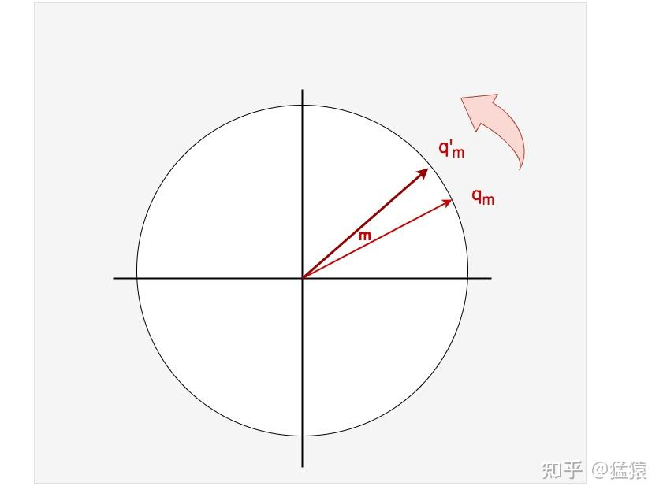

**正如2.2节所说，我们通过旋转的方式赋予原始** $q_{m}$ **绝对位置的信息，由于** $q_{m}$ **是一个逆时针的圆周旋转，这也意味着一个较小的m可能和一个较大的m代表的向量重合**，为了避免这一点，**我们引入一个较小的调控参数** $\theta$ ，使得旋转角度变为 $\theta$ ，放慢 $q_{m}$ 旋转的步调。  

你可能会想：这个方法真是不错。如果我面对的是一排数量很多的token（长文本），那么我只要把 $\theta$ 设置得尽可能小，我就能保证不同位置的绝对位置向量一定是唯一的了！  

**但是，过小的** $\theta$ **会产生一个问题：由于旋转角度十分微弱，不同位置的向量几乎重合，这就使得“位置”这个信息带来的帮助有限了。**

### (2) 钟表视角下的高维旋转

**当你看见上图中，向量逆时针做圆周运动时，不知道是否让你想起了日常生活中一个很熟悉的物体：钟表。**对于一块钟表：

-   秒针：走得最快
-   分针：走得中等
-   时针：走得最慢

**而“时刻”这个东西，就是由这三个频率各不相等的圆周运动组成的**。  
当两块表摆在你面前时，即使走得最快的秒针重合了，但是如果走得较慢的分针和时针不一样，他们照样能代表不同的时刻。  

**现在，让我们把高维的位置编码想象成一个“时刻”**，那么如下图所示：  

在这幅图中：  

-   横向表示不同位置的位置编码（m =0和m=1）
-   纵向可以看成是3个不同频率的逆时针旋转运动（秒针、分针、时针），你可以发现，从m=0变到m=1，秒针旋转的幅度最大，时针最小。

更具体一点来说，假设这三个旋转运动对应的旋转矩阵分别是：

$\begin{pmatrix}   cos m\theta_0 & -sin m\theta_0\\   sin m\theta_0 & cos m\theta_0 \end{pmatrix}, \begin{pmatrix}   cos m\theta_1 & -sin m\theta_1\\   sin m\theta_1 & cos m\theta_1 \end{pmatrix}, \begin{pmatrix}   cos m\theta_2 & -sin m\theta_2\\   sin m\theta_2 & cos m\theta_2 \end{pmatrix}$  

则有 $\theta_{0} > \theta_{1} > \theta_{2}$ 。  

我们继续做一些延展，对于向量：  
$q_m = \begin{pmatrix}  q_0\\  q_1\\  q_2\\  q_3\\  ...\\  q_{d-2}\\  q_{d-1}  \end{pmatrix}$  

**两两为一组（** $(q_{0}, q_{1}), (q_{2}, q_{3}), ...$ **），每一组都可以看成是一个旋转速度不一样的指针，我们可以用** $d // 2$ **个指针来表示** $q_{m}$ **的位置向量，如下图所示：**  

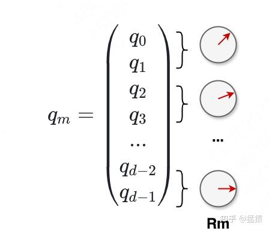

**因此在高维度空间中，用于表示** $q_{m}$ **绝对位置的旋转矩阵** $\mathcal{R}_{m}$ **最终可以表示成**：

$\mathcal{R}_{m}q =\begin{pmatrix}   \begin{bmatrix}   cos(m\theta_{0})& -sin(m\theta_{0})\\   sin(m\theta_{0})& cos(m\theta_{0}) \end{bmatrix}&...&0 \\   ...&  ...& ...\\   0&  ...&  \begin{bmatrix}   cos(m\theta_{d/2-1} )& -sin(m\theta_{d/2-1})\\   sin(m\theta_{d/2-1})& cos(m\theta_{d/2-1}) \end{bmatrix} \end{pmatrix}\begin{pmatrix}  q_{0}\\  q_{1}\\  ...\\  q_{d-2}\\  q_{d-1} \end{pmatrix}$  

**由于以上的** $\mathcal{R}_{m}$ **是一个稀疏矩阵，大部分位置为0，为了节省算力，在代码开发时我们一般采用下列方式：**  
$\begin{pmatrix}  q_0\\  q_1\\  q_2\\  q_3\\  ...\\  q_{d-2}\\  q_{d-1}  \end{pmatrix}\otimes  \begin{pmatrix}  cosm\theta_{0}\\  cosm\theta_{0}\\  cosm\theta_{1}\\  cosm\theta_{1}\\  ...\\  cosm\theta_{d/2-1}\\  cosm\theta_{d/2-1}  \end{pmatrix} +  \begin{pmatrix}  -q_1\\  q_0\\  -q_3\\  q_2\\  ...\\  -q_{d-1}\\  q_{d-2}  \end{pmatrix}\otimes  \begin{pmatrix}  sinm\theta_{0}\\  sinm\theta_{0}\\  sinm\theta_{1}\\  sinm\theta_{1}\\  ...\\  sinm\theta_{d/2-1}\\  sinm\theta_{d/2-1} \end{pmatrix}$  

为了满足我们所说的 $\theta_{0} > \theta_{1} > \theta_{2} > ... > \theta_{d/2-1}$ 的特性，同时又不能让 $\theta$ 太大，我们设:

$\theta_{i} = 10000^{-2i/d}, i=0,1,2,...,d/2-1$

**其中，10000这个数决定了** $\theta$ **的大小，我们称其为基数（base）。在后面的章节中，我们回来讨论基数应该如何选择。**

### 2.4 理解衰减性：从傅立叶变换角度（快乐版）

（⚠️本节没有令人抓狂的数学公式，所以是快乐版，大家可以放心食用）  
**傅立叶变换的基本思想，是一个函数可以用无穷多个周期性的线性组合来逼近**，我们通过一张经典的示例图来可视化这句话：  

在图中，红色方波就是我们想做傅立叶变换的原始函数，它可以被分解成无穷个频率不一致的蓝色三角函数（sin）的线性和。再形象一点解释的话，这些频率不一致的sin函数加总后，在各个方向上的趋势相互影响，最终生成了红色方波有的地方平，有的地方陡峭的模样。（当然，并不是只有方波可以被分解，这里只是给出了一个例子）  

现在，让我们回到那个逆时针转动的圆盘上。我们画出两个空的二维坐标系。一个坐标系我们放着这个圆（圆心在原点），记录下它每次转动的角度，和对应的y轴坐标。然后我们在另一个坐标系上绘制出角度和y的关系，你会发现自己得到了一个周期性的三角函数，如下图所示（快快回忆起高中的知识）：  

我们只需关注第一行的图即能帮助我们理解上面说的内容。第二～三行的图是在从圆周旋转的角度帮助我们理解方波是如何形成的。图片来自wiki百科。  

**理解到这一步，我们结合“旋转角度”和“傅立叶变换”角度，再来看一次我们的RoPE，不难理解，一块钟表的旋转，可以被转换成一个周期性的三角函数。**  

**现在再让我们回头看看** $q_{m}^{T}k_{n}$ **这个内积计算（假设我们已经把RoPE的信息赋给q和k了），当向量中的各项相加时：**  

-   **是不是就相当于各个不同的周期的三角函数在做线性组合？**
-   **那么线性组合的结果，是不是就可以看成是某种具有周期性的波形？（就像时分秒针组成了一个时刻一样）**
-   **当我们固定住某个m，改变n，去计算这个内积。如果|n-m|越大，内积越小，这不就是我们所说的“衰减性”吗？那现在我们再来看下面张图（注意箭头），你是不是能体会到衰减性是怎么来的？**

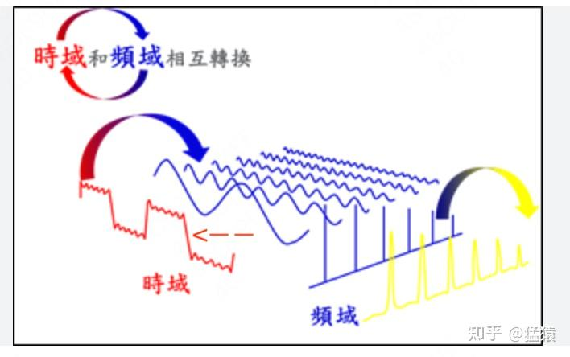

-   **那么再进一步，你可能在实验中会发现，对于** $\theta$ **的base，它设置得越大，衰减曲线越平缓。现在你对照着上图，大base引起小** $\theta$ **，也即相当于加大了每个蓝线分量的周期（把它们变得更宽更平缓了），那么红线的趋势自然也就拉平了。**

（注意，这里并不是说内积就长成方波的样子，只是结合这个图例，给大家一个感性的理解）  

现在，你是不是已经能渐渐认识到了RoPE的魅力，并且能从图像化的角度去思考它的超参意义了呢？

### 2.5 理解外推性：基数的选择

### （1）可视化理解位置编码的训练过程

在2.3节中，我们提过原始RoPE中， $\theta$ 的设置为：  
$\theta_{i} = 10000^{-2i/d}, i=0,1,2,...,d/2-1$

你的每一个 $\theta$ 值就控制着一块圆盘的转动速度，一共有d/2个圆盘，这里我们再把这张图放一次：  

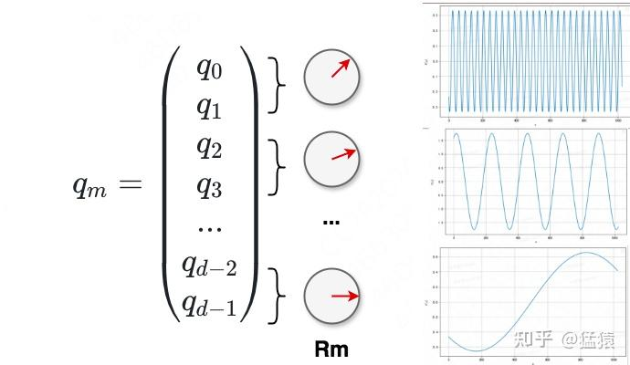

结合这张图，我们再来看下旋转矩阵 $\mathcal{R}_{m}$ 的定义，**其中每个\[\]表示一个圆盘：**

$\mathcal{R}_{m}q =\begin{pmatrix}   \begin{bmatrix}   cos(m\theta_{0})& -sin(m\theta_{0})\\   sin(m\theta_{0})& cos(m\theta_{0}) \end{bmatrix}&...&0 \\   ...&  ...& ...\\   0&  ...&  \begin{bmatrix}   cos(m\theta_{d/2-1} )& -sin(m\theta_{d/2-1})\\   sin(m\theta_{d/2-1})& cos(m\theta_{d/2-1}) \end{bmatrix} \end{pmatrix}\begin{pmatrix}  q_{0}\\  q_{1}\\  ...\\  q_{d-2}\\  q_{d-1} \end{pmatrix}$  

**我们单独拎出一个圆盘来看：**  
$\begin{pmatrix}   cos m\theta_{0} & -sin m\theta_{0}\\   sin m\theta_{0} & cos m\theta_{0} \end{pmatrix}$  

**在二维空间中，这个圆盘表示逆时针方向的旋转，结合我们学过的极坐标的知识，它可以被画成一个单位圆，也就是指针将在这个单位圆上每次做角度为** $m\theta$ 的**逆时针旋转**（这就是复数 $e^{im\theta} = cosm\theta + i * sinm\theta$ 的几何意义，理解了这一点，也能从可视化的角度去看复数推导了，不理解的话直接忽略）  

**所以，当我们训练位置编码时，我们其实就是在训练这d/2个转速不一的单位圆盘：**

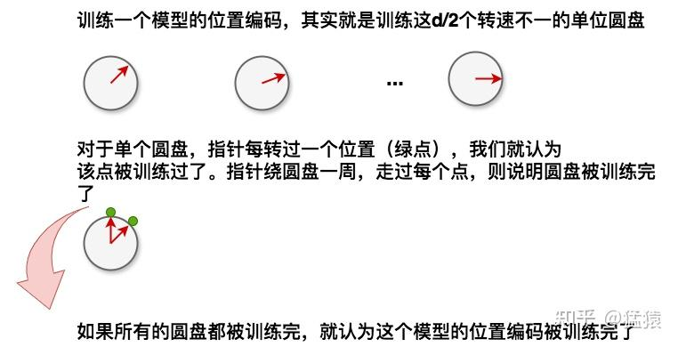

### （2）基数的选择

理论上，当我们把 $\theta$ 的基数设得很大时，每个圆盘的转速都很慢，这样就可以保证不管有多少个token，它们的绝对位置编码都不会重复，**也就是如果仅从编码表示的范围上看，较大的基数已经能够允许我们灵活表示不同长度的token了。**  

但是，从模型效果上来看呢？例如：**假设我想训练一个能处理长文本的模型，我直接用“长文本数据 + 大基数”去做这件事，效果会怎么样呢？**  
我们可以从（1）中的示意图的角度来可视化地思考这个问题：当我们使用“长文本数据+大基数”时，**每个圆盘的旋转速度都变慢了，当我们完成训练后，我们会发现大部分圆盘都没有转完一周（被训练完），也就是我们的位置编码信息训练不到位（没有收敛）**，这时如果我们想用这个模型做推理，就可能得不到好效果。  

**同样地，如果我们直接用一个“短文本数据 + 小基数”的方式去训练模型，那么虽然有更多的圆盘旋转过一周了，但是并不是圆盘上的每一个点都能训练到（见下图）。所以如果我们直接用这个模型去做长文本的推理，也得不到好效果**  

这时，我们可以换一个角度思考：**如果我能尽量让每个圆盘都转一周（当然这个过程并不是把圆周上的每一个点都走过），把大致的信息学到。然后再去微调圆盘上点和点之间的缝隙，尽量把这个圆周的细节都填满（在填的过程中你可能会经过之前已经学过的点，有了先验知识，那效果就更好了），那不就能快速学到尽可能完整的位置信息，加速模型收敛了吗？**  
把这个思想用于实践，就得到了目前训练长文本的一个常用方法：  

-   **现用“小基数 + 短数据”做训练（让每个圆盘都尽量转满一圈）**
-   **再用“大基数 + 长文本”做微调（弥补圆盘上的空隙）**

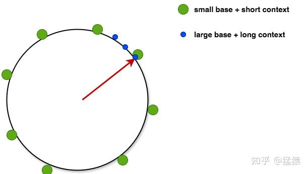

**所以，当你想探究位置编码的外推性，或者想研究基数选择对外推性的影响时，不妨在脑海里可视化这d//2个圆盘，想想如何让圆盘上尽可能多的点位被训练到。**

## 三、NTK-RoPE（有公式但快乐版）

让我们来延续圆盘训练的视角，来可视化理解一下NTK-RoPE的设计原理和运作流程。  

假设现在我们已经过一次pretrain，**那么对于不同转速的圆盘，其被训练过的圆周长度也是不一样的，对于高频（i更靠近0）的圆盘来说，它被训练过的圆周长度越长。而对于低频(i更靠近d//2-1)的圆盘来说，它被训练过的圆周长度越短，如下图所示：**  

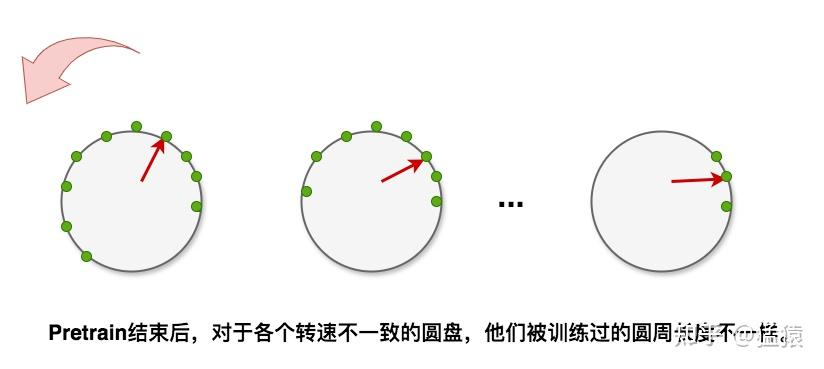

在这个基础上，现在我们想使用更长的文本做continue-pretrain或者推理，这个时候，从直觉上来说，我们肯定希望圆盘能实现下面的要求：  

-   **（1）尽量不要偏移已经训练过的圆周范围**。例如，对于图中第一个圆盘，我们就在pretrain走过的绿点的圆周范围内，按照2.5（2）中所说的方式做细节填充（蓝色点），这个操作也就等于尽可能利用已经训练好的位置相关信息。
-   **（2）尽量学到比pretrain更多的位置信息**。虽然我们希望尽可能实现（1），但同时圆盘上那些没训练过的圆周位置，我们就不管了吗？如果我们引入了更长的文本，我们当然希望在保守训练的同时，能学到一些新知识。

读到这里你可能已经察觉到，（1）和（2）之间需要有一个balance，那怎么做呢？  

我们再回来端详这个圆盘，假设当我们从位置50变动到位置10000时，你希望这d//2个圆盘的指针怎么变动，才能更加【突显】出两个位置之间的差异？我们回想一下，越靠后的圆盘转速越慢，意味着它对【绝对位置】的变动不敏感，所以，如果我们想反映出这个【绝对位置】上的差异，我们最好让靠前的圆盘走得多一些：**也就是，靠前的圆盘，我们希望在数据长度变更时，它能尽量学到pretrain以外的位置知识，走更多的圆弧。**那么同理，**对于靠后的圆盘，它的指针转速小，精度高，我们希望它遵循pretrain中学到的规律，限制在原始的圆弧内，不要做新的尝试。**那么如果说大角度转速对应着【绝对位置】，那么小角度转速当然对应着【相对位置】间的精细学习，**因此，靠后的圆盘其实是在控制【相对位置】的学习能力。**  

好，我们来做个总结，对于长文本的continue-pretrain或者inference：  

-   **靠前的圆盘，我们尽量让它学习到【绝对位置】信息，尝试突破pretrain看过的圆周部分（外推）**
-   **靠后的圆盘，我们尽量让它学习到【相对位置】信息，保持在pretrain看过的圆周部分，只做精细角度的训练（内插）**

画成图就是：  

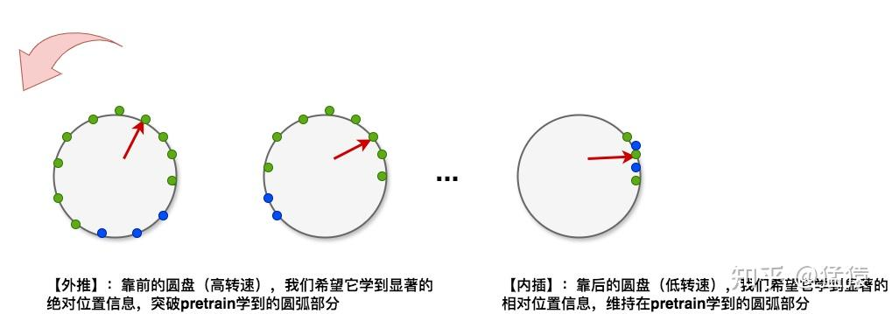

**所以，理想情况下，我们希望最后一个圆盘完全限制在pretrain看过的圆周之内，从最后一个盘开始往前推，每个盘都逐步尝试突破pretrain看过的位置，越靠前的圆盘，这个突破程度越大。**  

所以，我们现在就从最后一个圆盘开始看起。怎么让长文本 continue-pretrain或者inference时，最后一个圆盘保持在pretrain阶段得到的弧度内呢？当然是靠改变我们每次转动的角度 $\theta$ 的设置啦！具体来说：  

-   我们假设pretrain阶段的训练文本长度为 $S_{pre}$ ，最后一个圆盘的转动角度为 $\theta_{d//2-1}$ ，则绕着圆盘转动一周会经过 $\frac{2\pi}{\theta_{d//2-1}}$ 个tokens，那么pretrain阶段转过的周数为： $\frac{S_{pre} * \theta_{d//2-1}}{2\pi}$
-   假设continue-pretrain/inference阶段的文本长度为 $S_{post}$ ，理想的圆盘转动角度为 $\theta^{*}_{d//2-1}$ ，那么我们当然希望： $\frac{S_{pre} * \theta_{d//2-1}}{2\pi} = \frac{S_{post} * \theta^{*}_{d//2-1}}{2\pi}$
-   **求解得** $\theta^{*}_{d//2-1} = \frac{S_{pre}}{S_{post}} * \theta_{d//2-1}$

也就是说，对最后一个圆盘，我们只需要对原始的旋转角度乘上缩放因子 $\frac{S_{pre}}{S_{post}}$ 就可以满足严格限制在pretrain学到的位置内了。但是，当我们实际操作时，我们不是控制 $\theta$ 的方式是通过控制base（默认是为10000）实现的，所以其实我们缩放的是base，我们假设base缩放程度为 $\lambda$ ，则只要令：  
$\frac{1}{(10000 * \lambda)^{2i/d}} = \frac{S_{pre}}{S_{post}} * \frac{1}{10000 ^{2i/d}}$  
在 $i = d//2 -1$ 的条件下成立即可。  

**以此我们得出，对于最后一个圆盘，最终基数（base）的缩放因子** $\lambda =( \frac{S_{post}}{S_{pre}})^{\frac{d}{d-2}}$ **即可。**  
这时，我们发现，如果我们把这个固定 $\lambda$ 值带入前面的圆盘的基数中，我们可以发现前面的圆盘都实现了位置的外推，同时受到i的影响，越往前的圆盘，超出pretrain训练过的位置越多（推导就不给出啦，用数学的推理演绎法就可以证明）。

当然，如果你想说，只有最后一个圆盘在做内插，是不是不合理？当然有这种可能（我没有做过实验，所以不能给出确切答案）。所以或许，我们可以再通过更精细化的规则+实验结果，去更好设计每个圆盘的缩放因子。
