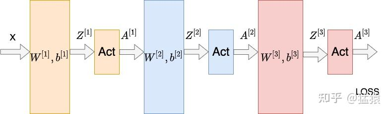
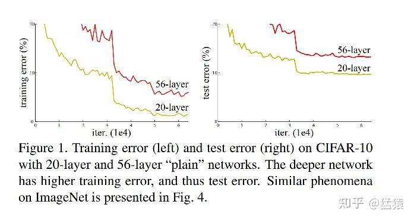
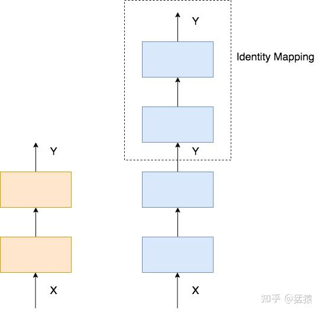
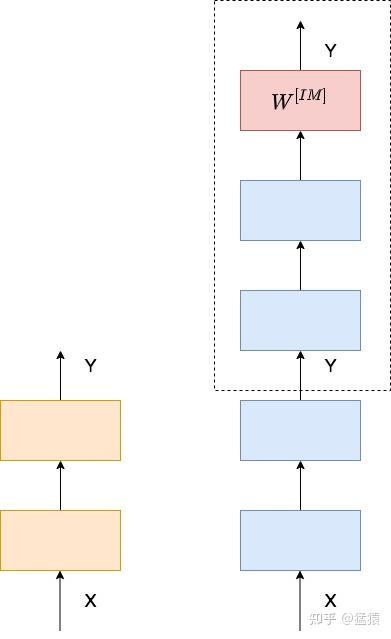
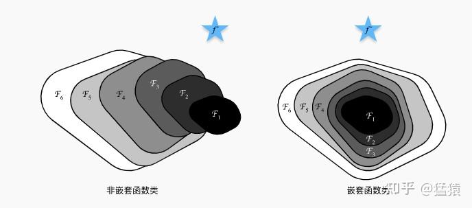
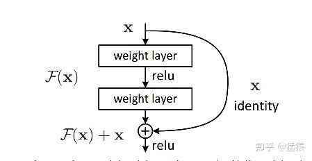
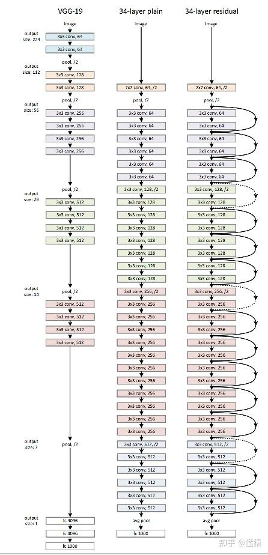
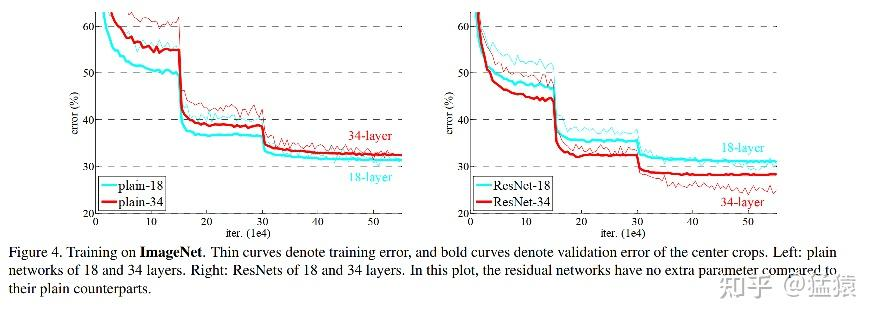
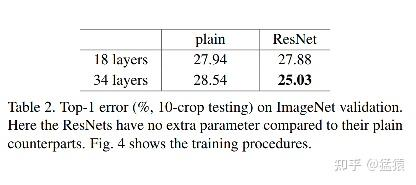
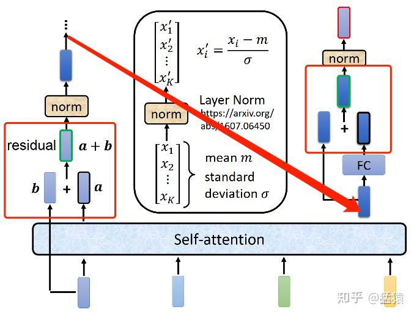

关于[Transformer](https://zhida.zhihu.com/search?content_id=190144936&content_type=Article&match_order=1&q=Transformer&zhida_source=entity)的笔记，预计出如下几篇：

1.  [Positional Encoding （位置编码），点击跳转](https://zhuanlan.zhihu.com/p/454482273)
2.  [Self-attention（自注意力机制），点击跳转](https://zhuanlan.zhihu.com/p/455399791)
3.  [Batch Norm & Layer Norm（批量标准化/层标准化），点击跳转](https://zhuanlan.zhihu.com/p/456863215)
4.  ResNet（残差网络）
5.  [Subword Tokenization（子词分词法），点击跳转](https://zhuanlan.zhihu.com/p/460678461)
6.  组装：Transformer

> 封面介绍一下Brainstorm小诸葛：  
> 【派别】：汽车人  
> 【职责】：生化机械工程师  
> 【优点也是缺点】：想法太多太快，导致脑电路过热或者短路。  
> 【经历】在赛博坦星球时，作为一个理性的理想主义者而抑郁不得志。最终在星云找到了自己的世外桃源，潜心做开发研究工作，主要成就是人机互换领域的突破。  
> “再强大的暴君也无法抑制思想的自由。”

在Transformer中，数据过Attention层和FFN层后，都会经过一个**Add & Norm**处理。其中，Add为**residule block（残差模块）**，数据在这里进行**residule connection（[残差连接](https://zhida.zhihu.com/search?content_id=190144936&content_type=Article&match_order=1&q=%E6%AE%8B%E5%B7%AE%E8%BF%9E%E6%8E%A5&zhida_source=entity)）**。残差连接的思想最经典的代表就是2015年被提出的[ResNet](https://link.zhihu.com/?target=https%3A//arxiv.org/pdf/1512.03385.pdf)，这个用于解决深层网络训练问题的模型最早被用于图像任务处理上，现在已经成为一种普适性的深度学习方法。这篇笔记将对此进行解析，笔记内容包括：

一、背景

-   1.1 [梯度消失](https://zhida.zhihu.com/search?content_id=190144936&content_type=Article&match_order=1&q=%E6%A2%AF%E5%BA%A6%E6%B6%88%E5%A4%B1&zhida_source=entity)/爆炸
-   1.2 [网络退化](https://zhida.zhihu.com/search?content_id=190144936&content_type=Article&match_order=1&q=%E7%BD%91%E7%BB%9C%E9%80%80%E5%8C%96&zhida_source=entity)(Degradation)

二、思路

-   2.1 为什么需要更深的网络
-   2.2 理想中的深网络表现

三、实践和实验效果

-   3.1 构造恒等映射：残差学习（residule learning）
-   3.2 实验过程及结果

四、Transformer中的残差连接

五、参考

## 一、背景

在进行**深层**网络学习的过程中，有两个避不开的问题：

### 1.1 梯度消失/爆炸

如图所示的三层神经网络，每一层的线性层和非线性层可以表示为：  

$\begin{aligned} Z^{[L]} &= W^{[L]} * A^{[L-1]} + b^{[L]} （线性变化层）\\ A^{[L]} &= g^{[L]}(Z^{[L]})（非线性变化/激活函数层） \end{aligned}$  

假设现在要计算第一层 $W^{[1]}$ 的梯度，那么根据链式法则，有：  

$\begin{aligned} \frac{\partial LOSS}{\partial W^{[1]}} & = \frac{\partial LOSS}{\partial A^{[3]}}\frac{\partial A^{[3]}}{\partial Z^{[3]}}\frac{\partial Z^{[3]}}{\partial A^{[2]}}\frac{\partial A^{[2]}}{\partial Z^{[2]}}\frac{\partial Z^{[2]}}{\partial A^{[1]}}\frac{\partial A^{[1]}}{\partial  Z^{[1]}}\frac{\partial Z^{[1]}}{\partial W^{[1]}}\\ & = \frac{\partial LOSS}{\partial A^{[3]}}{g^{[3]}}'W^{[3]}{g^{[2]}}'W^{[2]}{g^{[1]}}'\frac{\partial Z^{[1]}}{\partial W^{[1]}}  \end{aligned}$  

如果在神经网络中，多层都满足 ${g^{[L]}}'W^{[L]} > 1$ ，则越往下的网络层的梯度越大，这就造成了**梯度爆炸**的问题。反之，若多层都满足 ${g^{[L]}}'W^{[L]} < 1$ ，则越往下的网络层梯度越小，引起**梯度消失**的问题。而在深度学习网络中，为了让模型学到更多非线性的特征，在激活层往往使用例如**sigmoid**这样的激活函数。对sigmoid来说，**其导数的取值范围在** $(0,\frac{1}{4} ]$ ，在层数堆叠的情况下，更容易出现梯度消失的问题。

面对梯度消失/爆炸的情况，可以通过Normalization等方式解决，使得模型最终能够收敛。  

### 1.2 网络退化(Degradation)

因为梯度消失/爆炸所导致的深层网络模型不收敛的问题，已经得到了解决。那么现在新的问题出现了：**在模型能够收敛的情况下，网络越深，模型的准确率越低，同时，模型的准确率先达到饱和，此后迅速下降**。这个情况我们称之为**网络退化（Degradation）。**如下图，56层网络在测试集（右）上的错误率比20层网络要更高，这个现象也不是因为overfitting所引起的，因为在训练集上，深层网络的表现依然更差。  

因此，ResNet就作为一种解决网络退化问题的有效办法出现了，借助ResNet，我们能够有效训练出更深的网络模型（可以超过1000层），使得深网络的表现不差于浅网络。  

## 二、思路

### 2.1 为什么需要更深的网络

神经网络帮我们避免了繁重的特征工程过程。借助神经网络中的非线形操作，可以帮助我们更好地拟合模型的特征。为了增加模型的表达能力，一种直觉的想法是，增加网络的深度，一来使得网络的每一层都尽量学到不同的模式，二来更好地利用网络的非线性拟合能力。  

### 2.2 理想中的深网络表现

理想中的深网络，其表现不应该差于浅网络。举一个简单的例子，下图左边是2层的浅网络，右边是4层的深网络，我们只要令深网络的最后两层的输入输出相等，那么两个网络就是等效的，这种操作被称为**恒等映射（Identity Mapping)。**  

当然，这样完全相等的映射是一种极端情况，更为理想的情况是，在网络的深层，让网络尽量逼近这样的极端情况，使得网络在学到新东西的同时，其输出又能逼近输入，这样就能保证深网络的效果不会比浅网络更差。  

**总结：在网络的深层，需要学习一种恒等映射（Identity Mapping）。**  

## 三、实践和实验效果

### 3.1 构造恒等映射：残差学习（residule learning）

最暴力的构造恒等映射的方法，就是在相应网络部分的尾端增加一层学习层 $W^{[IM]}$ ，来满足输出和输入逼近。但是本来深网络要学的参数就很庞大了，再构造新的参数层，又增加了模型的复杂度。  

能不能在不添加参数层的情况下，实现恒等映射的功能？考虑下图：  

蓝色星星 $\mathcal{f}^*$ 是“真正”拟合我们数据集的函数，而 $\mathcal{F}_1 ,...,\mathcal{F}_6$ 表示分别表示不同层数的神经网络（层数为1的，层数为2的...）。在左边的构造方式中，函数是非嵌套的，可以发现6层神经网络可能比单层神经网络距离最优解更远。而在右边的嵌套式构造中，则保证了更多层的神经网络至少能取到更浅的神经网络的最优解。受到这一思想的启发，我们在深层网络中引入残差模块，具体运作方式如下：  

如图所示，这个残差模块包含了神经网络中的两层，其中， $X$ 表示输入， $\mathcal{F}(X)$ 表示过这两层之后的结果， $\mathcal{H}(X)$ 表示恒等映射，则在这样的构造方式下，恒等映射可以写成：

$\mathcal{H}(X) = \mathcal{F}(X) + X$ （1）  

$\mathcal{F}(X)$ 就被称之为**残差函数（residule function）。**在网络深层的时候，在优化目标的约束下，模型通过学习使得 $\mathcal{F}(X)$ 逼近0**（residule learning)**，让深层函数在学到东西的情况下，又不会发生网络退化的问题。

通过这样的构造方式，让 $\mathcal{F}(X)$ 嵌套在了 $\mathcal{H}(X)$ 中，这样跃层构造的方式也被称为**残差连接(residule connection)/ 跳跃连接(skip connection)/短路(shortcuts)**。模型并不是严格的跨越2层，可以根据需要跨越3，4层进行连接。同时，等式（1）是在假设输入输出同维，即 $\mathcal{F}(X)$ 和 $X$ 同维的情况，不同维时，只需要在 $X$ 前面增加一个转换矩阵 $W_{s}$ 即可。  

### 3.2 实验过程及结果

在ResNet的论文中，做了很丰富的实验，这里仅贴出它在ImageNet 2012数据集上的试验结果。  
这个实验的网络以VGG网络为参考，构造了**34-layer plain DNN**和**34-layer residule DNN。**前者是一个标准的深层网络，后者是增加残差处理的深层网络。基本构造如下：（图很小吧，都怪网络太深，没关系，不看也可以）  

以下是实验结果。左图是18层和34层的plain DNN，右是18层和34层的residule DNN。粗线表示训练集上的错误率，细线表示验证集上的错误率。可以发现在残差网络中，深网络的错误率都已经被压到了浅网络之下，同时也比plain DNN的错误率更低。  

## 四、Transformer中的残差连接

在transformer的encoder和decoder中，各用到了6层的attention模块，每一个attention模块又和一个FeedForward层（简称FFN）相接。对每一层的attention和FFN，都采用了一次残差连接，即把每一个位置的输入数据和输出数据相加，使得Transformer能够有效训练更深的网络。在残差连接过后，再采取Layer Nomalization的方式。具体的操作过程见下图，箭头表示画不下了，从左边转到右边去画：  

## 五、参考

1.  Deep Residual Learning for Image Recognition：[https://arxiv.org/pdf/1512.03385.pdf](https://link.zhihu.com/?target=https%3A//arxiv.org/pdf/1512.03385.pdf)
2.  [https://zhuanlan.zhihu.com/p/80226180](https://zhuanlan.zhihu.com/p/80226180)
3.  [https://zh-v2.d2l.ai/chapter\_convolutional-modern/resnet.html](https://link.zhihu.com/?target=https%3A//zh-v2.d2l.ai/chapter_convolutional-modern/resnet.html)