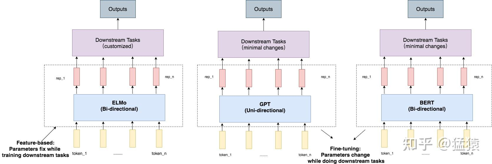
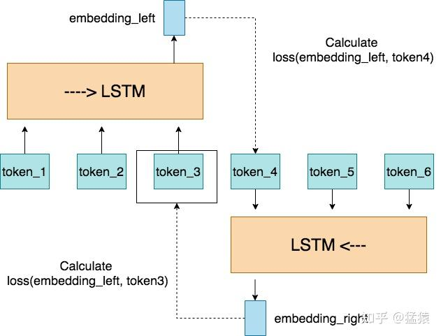
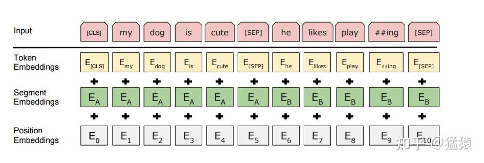
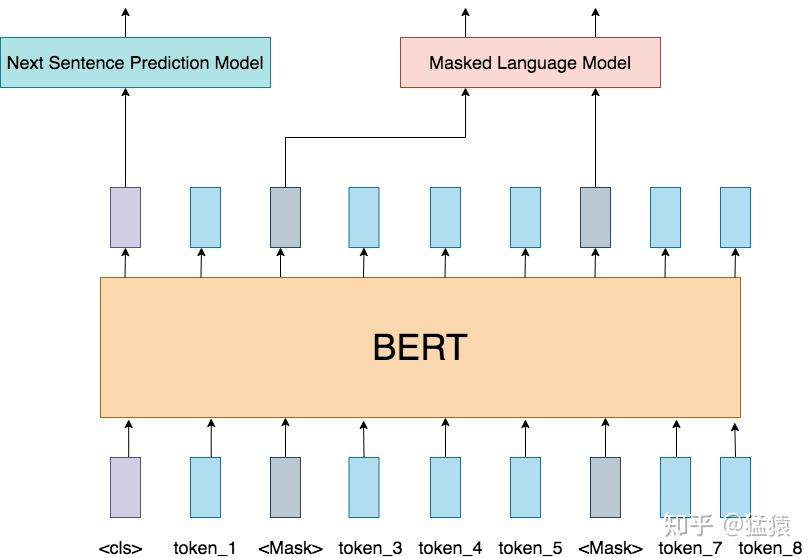

**20230225更新：最近在更新ChatGPT系列，感兴趣的朋友可以移步：**

**[猛猿：ChatGPT技术解析系列之：训练框架InstructGPT](https://zhuanlan.zhihu.com/p/605516116)（因平台bug暂时显示不出来，可以看这一篇回答**

[ChatGPT 技术如何进行解构？](https://www.zhihu.com/answer/2888503670) 回答

**[猛猿：ChatGPT技术解析系列之：GPT1、GPT2与GPT3](https://zhuanlan.zhihu.com/p/609367098)**

**[猛猿：ChatGPT技术解析系列之：赋予GPT写代码能力的Codex](https://zhuanlan.zhihu.com/p/611313567)**

这篇笔记将基于[BERT原始论文](https://link.zhihu.com/?target=https%3A//arxiv.org/pdf/1810.04805.pdf)，对BERT模型的结构及训练方式进行解读。在下一篇的笔记中，将提供基于pytorch的BERT实践（从头开始搭建一个BERT），以此通过train from scratch的方式来了解BERT的运作流程（因为train from scratch，所以模型大小和数据集都比原论文要小很多，穷人train穷bert啦，嘿嘿）。

由于Bert是基于[Transformer](https://zhida.zhihu.com/search?content_id=190633912&content_type=Article&match_order=1&q=Transformer&zhida_source=entity)的Encoder层构造的，因此在学习Bert之前，需要了解Transformer的相关知识，可以移步：

1.  [Positional Encoding （位置编码），点击跳转](https://zhuanlan.zhihu.com/p/454482273)
2.  [Self-attention（自注意力机制），点击跳转](https://zhuanlan.zhihu.com/p/455399791)
3.  [Batch Norm & Layer Norm（批量标准化/层标准化）,点击跳转](https://zhuanlan.zhihu.com/p/456863215)
4.  [ResNet（残差网络），点击跳转](https://zhuanlan.zhihu.com/p/459065530)
5.  [Subword Tokenization（子词分词法），点击跳转](https://zhuanlan.zhihu.com/p/460678461)
6.  组装：Transformer

本篇笔记的内容结构为：

1.  构建上下文相关的Word Embedding
2.  ELMo，GPT，BERT
3.  三、Bert的输入数据
4.  四、Bert的模型构造
5.  五、Bert的两种预训练任务

5.1 Masked Language Model（遮蔽语言模型）

5.2 Next Sentence Prediction Model （下一句预测）

1.  六、总结

七、参考

## 一、构建上下文相关的Word Embedding

BERT之所以表现优秀的原因之一，是因为对于一个词元（以下称为token），BERT可以很好地抽象出它的embedding，“很好地”特指embedding是基于上下文的。

思考两个句子：

> (1) I ate an apple.  
> (2) The Apple pencil is expensive.

在这两个句子里，很明显基于不同的上下文，apple的含义是不一样的。但是古早的word embedding模型，例如word2vec, GloVe等，对相同的token都采用同一个预训练embedding，很明显这个embedding没有涵盖足够的上下文信息。于是就有了contextualized word embedding的需求。

## 二、ELMo，GPT，BERT

在原始论文中，比较了三种能够产生contextualized word embedding的模型，它们都属于预训练语言模型（pre-trained language model）。

当前预训练模型有两种策略：

**(1) Feature-based**

代表作是ELMo（Embedding from Language Model）

**(2) Fine-tuning**

代表作是GPT（Generative Pre-Training）和BERT（Bidirectional Encoder Representations from Transformer)

配合上下面这张图，来理解一下这两种策略之间的区别：

**ELMo**内部可以理解成是多层RNN/LSTM，结合下图，来理解下ELMo的特性。

（1）**ELMo是双向的**。假定我们想得到token\_3处的embedding，那么我们的模型会将token\_3前后的tokens序列都看一遍，分别生成embedding\_left和embedding\_right，则token\_3最终的embedding就是concat(embedding\_left, embedding\_right)。

（2）**ELMo是无监督的**。原文中采用“unsupervised”，基于其训练特性，也可称为“self-supervised”。在训练token\_3的过程中，我们不需要对训练数据集进行额外的标注，而是采用token\_3和token\_4来计算loss。

（3）**ELMo是feature-based的预训练模型**。在预训练完ELMo模型，并把它接入下游任务后，ELMo模型本身的参数不参与训练，而是固定的。也就是说，将ELMo产生的rep\_1,..., rep\_n当作是下游任务的额外feature直接使用。

**GPT**的内部采用的是transformer的架构。关于transfomer的部分，会另外整理一篇笔记来描述。

这里假设读者已有transformer的相关知识。

**（1）GPT是单向的**。在GPT吃训练tokens，对其做attention的时候，只atten到一个token左边的部分，而右边的部分是mask起来的。

**（2）GPT是无监督的**。同样不需要对训练数据进行额外标注。

**（3） GPT是fine-tuning的预训练模型**。在预训练完毕，接入下游任务后，GPT模型的参数以预训练得到的参数文件初始值，参与到下游任务的训练中去，因此称为“微调”。

**BERT**的内部同样采用的是transformer的架构（可以理解为是transformer encoder部分）。但它综合了ELMo和GPT的优势，具体表现在：

（1）**BERT是双向的**。BERT在做attention的时候，会atten到一个token左、右两边的部分。

（2）**BERT是无监督的**。

（3）**BERT是fine-tuning的预训练模型**。

## 三、BERT的输入数据

在BERT当中，若输入的是单个句子，则表示为\[<cls>, 句子tokens, <sep>\]。若输入的是句子对，则表示为\[<cls>, 句子A的tokens, <sep>, 句子B的tokens, <sep>\]。其中，<sep>表示分隔符，<cls>则表示要做分类的位置，这个在后面的部分会细说。

BERT的输入数据由三部分组成：**Token Embeddings**，**Segment Embeddings**和**Position Embeddings**

-   **Token Embedding**：tokens的常规embedding层
-   **Segment Embedding**：用于表示对应的token属于哪一个句子
-   **Position Embedding:** 用于表示每一个token在整个输入中的位置信息，和transformer里的positional encoding不同的是，这里不再构造特殊函数直接对position的信息硬编码，而是构造了一层参数需要学习的position embedding。

## 四、BERT的模型构造

前面说过，BERT模型的内部其实就是transformer encoder层。

在论文中，一共搭建了base和large两种规模的BERT模型，其构造如下：

> BERTbase（L=12，H = 768，A = 12，Total Parameters = 110M）  
> BERTlarge（L = 24，H = 1024，A = 16，Total Parameters = 340M）

其中，

> L：The number of layers (transformer encoder layer的层数)  
> H: Hidden size  
> A: self-attention head

同时，BERT也对输入tokens的长度做了限制，最大输入长度为512。

关于两种模型的效果比较，可以参见原始论文。

## 五、BERT的两种预训练任务

处理完了输入层，也搭建好了模型架构，接下来就是模型训练了。

BERT的训练阶段一共包含两个任务，这两个任务是**同时**进行训练的，它们分别是：

-   **Masked Language Model （遮蔽语言模型）**
-   **Next Sentence Prediction （下一句预测）**

### 5.1 Masked Language Model（遮蔽语言模型）

这个预训练任务，可以理解成是在教BERT做填空题。具体步骤如下：

（1）随机遮盖掉整个输入序列15%的token（不遮盖特殊token，如<cls>和<sep>）

（2）选定好需要遮盖的token后，对这个token的处理方式如下：

\- 80%的概率，将token替换为特殊符号<mask>

\- 10%的概率，将token随机替换为vocabulary中的某个token

\- 10%的概率，保持原token不变

***为什么要以一定的概率去改造token，而不是统一给这些选中被遮盖的token一个<mask>标记呢？***

这是因为，一来，在之后的fine-tuning阶段，数据集中不会出现这些人造的<mask>标记，这就造成预训练的数据集和fine-tuning的数据集不匹配的情况。二来，通过将token进行随机替换，给模型增加噪声，使得模型的泛化能力更强。

（3）BERT吃进这一串处理好的token之后，将会计算loss(被遮盖的位置输出的token，真实token)。

这里，Masked Language Model将会被设置为一个很简单的Linear nn，做多分类的预测。**为什么这里设置的模型相比于BERT要更加简单呢？**因为我们需要强迫BERT能够针对被遮盖的位置和其上下文，抽取出信息量足够丰富的embedding，丰富到仅用一个简单的预测模型就能对结果进行分类。

### 5.2 Next Sentence Prediction Model （下一句预测）

同时进行的训练任务，还有预测输入的两个句子是否是真实相连的两个句子（二元分类）。而<cls>处的embedding，就是要抽取出和此分类相关的足够多的信息。具体步骤如下：

（1）对输入的句子对进行随机替换

\- 50%的概率，两个句子真实相连

\- 50%的概率，第二个句子是从训练数据集中随机挑选的句子

（2）将过BERT层抽出的<cls> embedding送入Next Sentence Prediction Model，这也是一个简单的Linear nn。

## 六、总结

到此为止，BERT中最核心的部分就说完了。关于BERT在不同数据集上的表现，即不同规模BERT的预测能力，可以去细读原始论文。

最后总结一下这篇笔记的核心内容：

-   BERT表现优秀的主要原因之一，是因为它能抽取出基于上下文的word embedding
-   在ELMo，GPT和BERT这三个无监督(原文表述为"unsupervised"，基于其训练特性也称为“self-supervised”，因为它们用自数据进行训练）的预训练模型，都能产生基于上下文的word embedding。其中，ELMo是双向feature-based，GPT是单向fine-tuning，而BERT是双向fine-tuning。相比于feature-based的预训练模型，fine-tuning对预训练模型的架构更改更小。
-   BERT i**nput = token\_embedding + segment\_embedding + postion\_embedding**
-   BERT在预训练阶段同时对两个任务进行训练：Masked Language Model & Next Sentence Prediction

## 七、参考

1.  BERT原始论文：[https://arxiv.org/pdf/1810.04805.pdf](https://link.zhihu.com/?target=https%3A//arxiv.org/pdf/1810.04805.pdf)
2.  李宏毅DLHLP 2020 Spring课堂讲义：[https://www.youtube.com/watch?v=UYPa347-DdE](https://link.zhihu.com/?target=https%3A//www.youtube.com/watch%3Fv%3DUYPa347-DdE)