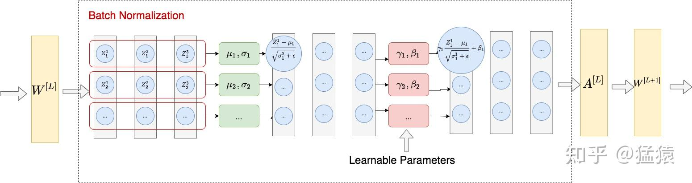
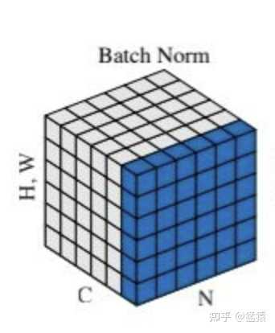
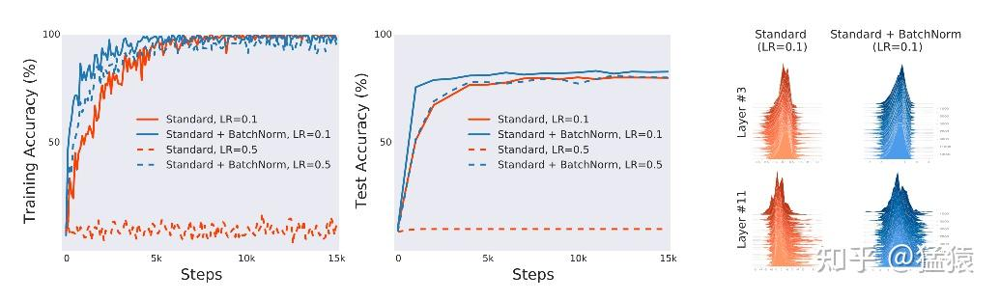
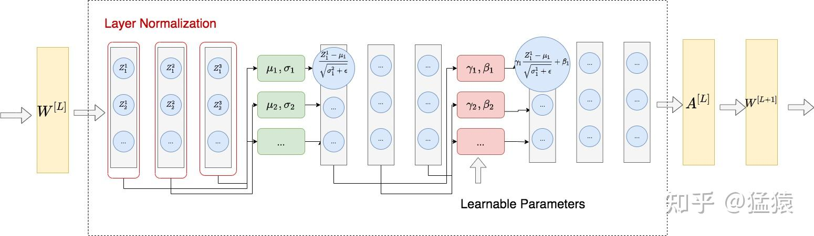
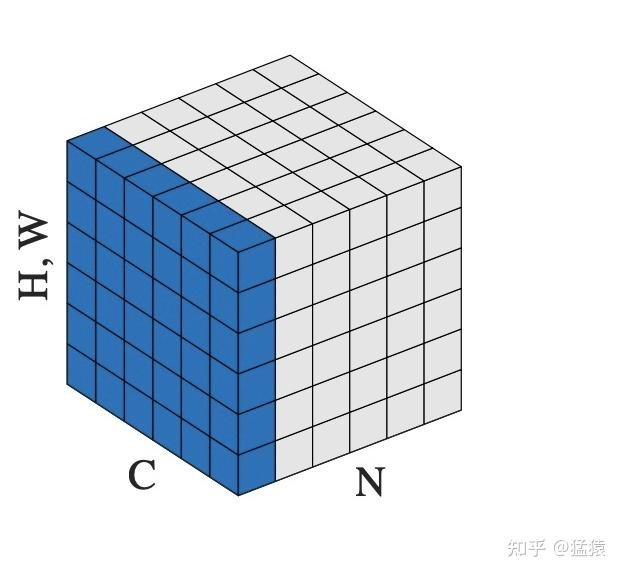

尝试回答一下题主的这两个问题。

**为什么要用Norm**，可以关注1.1和1.4的部分，概括说来，Norm最开始被提出的时候，是用来解决ICS问题的，而后人的研究发现，Norm起作用的本质是它平滑了Loss，保持了[梯度下降](https://zhida.zhihu.com/search?content_id=449943598&content_type=Answer&match_order=1&q=%E6%A2%AF%E5%BA%A6%E4%B8%8B%E9%99%8D&zhida_source=entity)过程中的稳定。

**为什么用LN而不是BN**，可以在看完第一部分BN后，来看2.1。

希望对题主有所帮助。

一、Batch Normalization

-   1.1 提出背景

-   1.1.1 ICS所带来的问题
-   1.1.2 解决ICS的常规方法

-   1.2 BN的实践

-   1.2.1 思路
-   1.2.1 训练过程中的BN
-   1.2.2 测试过程中的BN

-   1.3 BN的优势总结
-   1.4 大反转：著名深度学习方法BN成功的秘密竟不在ICS？

二、Layer Normalization

-   2.1 背景 (为何NLP多用LN，图像多用BN)
-   2.2 思路
-   2.3 训练过程和测试过程中的LN

## 一、Batch Normalization

本节1.2-1.3的部分，在借鉴[天雨粟：Batch Normalization原理与实战](https://zhuanlan.zhihu.com/p/34879333)解说的基础上，增加了自己对论文和实操的解读，并附上图解。上面这篇文章写得非常清晰，推荐给大家阅读～

### 1.1 提出背景

Batch Normalization（以下简称BN）的方法最早由[Ioffe&Szegedy](https://link.zhihu.com/?target=https%3A//arxiv.org/pdf/1502.03167.pdf)在2015年提出，主要用于解决在深度学习中产生的**ICS（[Internal Covariate Shift](https://zhida.zhihu.com/search?content_id=449943598&content_type=Answer&match_order=1&q=Internal+Covariate+Shift&zhida_source=entity)）**的问题。若模型输入层数据分布发生变化，则模型在这波变化数据上的表现将有所波动，输入层分布的变化称为Covariate Shift，解决它的办法就是常说的[Domain Adaptation](https://zhida.zhihu.com/search?content_id=449943598&content_type=Answer&match_order=1&q=Domain+Adaptation&zhida_source=entity)。同理，在深度学习中，第L+1层的输入，也可能随着第L层参数的变动，而引起分布的变动。这样每一层在训练时，都要去适应这样的分布变化，使得训练变得困难。这种层间输入分布变动的情况，就是Internal Covariate Shift。而BN提出的初衷就是为了解决这一问题。

$\begin{aligned} Z^{[L]} &= W^{[L]} * A^{[L-1]} + b^{[L]} （线性变化层）\\ A^{[L]} &= g^{[L]}(Z^{[L]})（非线性变化/激活函数层） \end{aligned}$

（ICS：随着梯度下降的进行， $W^{[L]}$ 和 $b{[L]}$ 都会被更新，则 $Z^{[L]}$ 的分布改变，进而影响 $A^{[L]}$ 分布，也就是第L+1层的输出）

### 1.1.1 ICS所带来的问题

**（1）在过激活层的时候，容易陷入激活层的梯度饱和区，降低模型收敛速度。**  
这一现象发生在我们对模型使用[饱和激活函数](https://zhida.zhihu.com/search?content_id=449943598&content_type=Answer&match_order=1&q=%E9%A5%B1%E5%92%8C%E6%BF%80%E6%B4%BB%E5%87%BD%E6%95%B0&zhida_source=entity)(saturated activation function)，例如sigmoid，tanh时。如下图：

可以发现当绝对值越大时，数据落入图中两端的梯度饱和区（saturated regime），造成梯度消失，进而降低模型收敛速度。当数据分布变动非常大时，这样的情况是经常发生的。当然，解决这一问题的办法可以采用非饱和的激活函数，例如[ReLu](https://zhida.zhihu.com/search?content_id=449943598&content_type=Answer&match_order=1&q=ReLu&zhida_source=entity)。

**（2）需要采用更低的学习速率，这样同样也降低了模型收敛速度。**  
如前所说，由于输入变动大，上层网络需要不断调整去适应下层网络，因此这个时候的学习速率不宜设得过大，因为梯度下降的每一步都不是“确信”的。

### 1.1.2 解决ICS的常规方法

综合前面，在BN提出之前，有几种用于解决ICS的常规办法：

-   采用非饱和激活函数
-   更小的学习速率
-   更细致的参数初始化办法
-   数据白化（whitening）

其中，最后一种办法是在模型的每一层输入上，采用一种线性变化方式（例如PCA），以达到如下效果：

-   使得输入的特征具有相同的均值和方差。例如采用PCA，就让所有特征的分布均值为0，方差为1
-   去除特征之间的相关性。

然而在每一层使用白化，给模型增加了运算量。而小心地调整学习速率或其他参数，又陷入到了超参调整策略的复杂中。因此，BN作为一种更优雅的解决办法被提出了。

### 1.2 BN的实践

### 1.2.1 思路

-   对每一个batch进行操作，使得对于这一个batch中所有的输入数据，它们的每一个特征都是均值为0，方差为1的分布
-   单纯把所有的输入限制为(0,1)分布也是不合理的，这样会降低数据的表达能力（第L层辛苦学到的东西，这里都暴力变成（0,1）分布了）。因此需要再加一个线性变换操作，让数据恢复其表达能力。这个线性变化中的两个参数 $\gamma, \beta$ 是需要模型去学习的。

整个BN的过程可以见下图：

上图所示的是2D数据下的BN，而在NLP或图像任务中，我们通常遇到3D或4D的数据，例如：

-   **图像中的数据维度**：（N, C, H, W)。其中N表示数据量（图数），C表示channel数，H表示高度，W表示宽度。
-   **NLP中的数据为度**：（B, S, E）。其中B表示批量大小，S表示序列长度，F表示序列里每个token的embedding向量维度。

如下图，它们在执行BN时，在图中每一个蓝色的平面上求取 $\mu, \sigma$ ，同时让模型自己学习 $\gamma, \beta$ 。其中"H,W"表示的是"H\*W"，即每一个channel里pixel的数量。为了表达统一，这张图用作NLP任务说明时，可将(N, C, H\*W)分别理解成(B, S, E)。

### 1.2.1 训练过程中的BN

配合上面的图例，我们来具体写一下训练中BN的计算方式。  
假设一个batch中有m个样本，则在神经网络的某一层中，我们记第i个样本在改层第j个神经元中，经过线性变换后的输出为 $Z^i_j$ ，则BN的过程可以写成（图中的每一个红色方框）：

$\begin{aligned} \mu_j &= \frac{1}{m} \sum_{i=1}^{m} Z^i_j \\ \sigma^2_j &= \frac{1}{m} \sum_{i=1}^{m} (Z^i_j - \mu_j)^2 \\ \tilde{Z_j} &= \gamma_{j}\frac{Z_j - \mu_j}{\sqrt{\sigma^2_j + \epsilon}} + \beta_{j} \end{aligned}$

其中 $\epsilon$ 是为了防止方差为0时产生的计算错误，而 $\gamma_j, \beta_j$ 则是模型学习出来的参数，目的是为了尽量还原数据的表达能力。

### 1.2.2 测试过程中的BN

在训练过程里，我们等一个batch的数据都装满之后，再把数据装入模型，做BN。但是在测试过程中，我们却更希望模型能来一条数据就做一次预测，而不是等到装满一个batch再做预测。也就是说，我们希望测试过程共的数据不依赖batch，每一条数据都有一个唯一预测结果。这就产生了训练和测试中的gap：测试里的 $\mu, \sigma$ 要怎么算呢？一般来说有两种方法。

**（1）用训练集中的均值和方差做测试集中均值和方差的无偏估计**

保留训练模型中，***每一组***batch的***每一个***特征在***每一层***的 $\mu_{batch}, \sigma^2_{batch}$ ，这样我们就可以得到测试数据均值和方差的无偏估计：

$\begin{aligned} \mu_{test} &= \mathbb{E}(\mu_{batch}) \\ \sigma^2_{test} &= \frac{m}{m-1}\mathbb{E}(\sigma^2_{batch})\\ BN(X_{test}) &= \gamma \frac{X_{test} - \mu_{test}}{\sqrt{\sigma^2_{test} + \epsilon}} + \beta  \end{aligned}$  
其中m表示的是批量大小。  
这种做法有一个明显的缺点：需要消耗较大的存储空间，保存训练过程中所有的均值和方差结果（每一组，每一个，每一层）。  

**（2）Momentum：移动平均法(Moving Average)**

稍微改变一下训练过程中计算均值和方差的办法，设 $\mu_{t}$是当前步骤求出的均值， $\bar \mu$ 是之前的训练步骤累积起来求得的均值（也称running mean），则：  
$\bar\mu \gets p\bar\mu + (1-p)\mu^{t}$  
其中，p是momentum的超参，表示模型在多大程度上依赖于过去的均值和当前的均值。 $\bar\mu$ 则是新一轮的ruuning mean，也就是当前步骤里最终使用的mean。同理，对于方差，我们也有：  
$\bar{\sigma^2} \gets p\bar{\sigma^2} + (1-p){\sigma^2}^{t}$

采用这种方法的好处是：

-   节省了存储空间，不需要保存所有的均值和方差结果，只需要保存running mean和running variance即可
-   方便在训练模型的阶段追踪模型的表现。一般来讲，在模型训练的中途，我们会塞入validation dataset，对模型训练的效果进行追踪。采用移动平均法，不需要等模型训练过程结束再去做无偏估计，我们直接用running mean和running variance就可以在validation上评估模型。

### 1.3 BN的优势总结

-   通过解决ICS的问题，使得每一层神经网络的输入分布稳定，在这个基础上可以使用较大的学习率，加速了模型的训练速度
-   起到一定的正则作用，进而减少了dropout的使用。当我们通过BN规整数据的分布以后，就可以尽量避免一些极端值造成的overfitting的问题
-   使得数据不落入饱和性激活函数（如sigmoid，tanh等）饱和区间，避免梯度消失的问题

### **1.4 大反转：著名深度学习方法BN成功的秘密竟不在ICS？**

以解决ICS为目的而提出的BN，在各个比较实验中都取得了更优的结果。但是来自MIT的[Santurkar et al. 2019](https://link.zhihu.com/?target=https%3A//arxiv.org/pdf/1805.11604.pdf)却指出：

-   就算发生了ICS问题，模型的表现也没有更差
-   BN对解决ICS问题的能力是有限的
-   **BN奏效的根本原因在于它让optimization landscape更平滑**

而在这之后的很多论文里也都对这一点进行了不同理论和实验的论证。  
（每篇论文的Intro部分开头总有一句话类似于：“BN的奏效至今还是个玄学”。。。）  

图中是[VGG网络](https://zhida.zhihu.com/search?content_id=449943598&content_type=Answer&match_order=1&q=VGG%E7%BD%91%E7%BB%9C&zhida_source=entity)在标准，BN，noisy-BN下的实验结果。其中noisy-BN表示对神经网络的每一层输入，都随机添加来自分布(non-zero mean, non-unit variance)的噪音数据，并且在不同的timestep上，这个分布的mean和variance都在改变。noisy-BN保证了在神经网络的每一层下，输入分布都有严重的ICS问题。但是从试验结果来看，noisy-BN的准确率比标准下的准确率还要更高一些，这说明ICS问题并不是模型效果差的一个绝对原因。

而当用VGG网络训练[CIFAR-10](https://zhida.zhihu.com/search?content_id=449943598&content_type=Answer&match_order=1&q=CIFAR-10&zhida_source=entity)数据时，也可以发现，在更深层的网络（例如Layer11）中，在采用BN的情况下，数据分布也没有想象中的“规整”：

最后，在VGG网络上，对于不同的训练step，计算其在不同batch上loss和gradient的方差（a和b中的阴影部分），同时测量 $\beta-smoothness$ （简答理解为l2-norm表示的在一个梯度下降过程中的最大斜率差）。可以发现BN相较于标准情况都来得更加平滑。

## 二、Layer Normalization

### 2.1 背景

BN提出后，被广泛作用在CNN任务上来处理图像，并取得了很好的效果。针对文本任务，[Ba et al. 2016](https://link.zhihu.com/?target=https%3A//arxiv.org/pdf/1607.06450.pdf) 提出在[RNN](https://zhida.zhihu.com/search?content_id=449943598&content_type=Answer&match_order=1&q=RNN&zhida_source=entity)上使用Layer Normalization（以下简称LN）的方法，用于解决BN无法很好地处理文本数据长度不一的问题。例如采用RNN模型+BN，我们需要对不同数据的同一个位置的token向量计算 $\mu, \sigma^2$ ，在句子长短不一的情况下，容易出现：

-   测试集中出现比训练集更长的数据，由于BN在训练中累积 $\mu_{batch}, \sigma^2_{batch}$ ，在测试中使用累计的经验统计量的原因，导致测试集中多出来的数据没有相应的统计量以供使用。 （在实际应用中，通常会对语言类的数据设置一个max\_len，多裁少pad，这时没有上面所说的这个问题。但这里我们讨论的是理论上的情况，即理论上，诸如[Transformer](https://zhida.zhihu.com/search?content_id=449943598&content_type=Answer&match_order=1&q=Transformer&zhida_source=entity)这样的模型，是支持任意长度的输入数据的）
-   长短不一的情况下，文本中的某些位置没有足够的batch\_size的数据，使得计算出来的 $\mu, \sigma^2$ 产生偏差。例如[Shen et al. (2020)](https://link.zhihu.com/?target=https%3A//arxiv.org/pdf/2003.07845.pdf)就指出，在数据集Cifar-10（模型RestNet20)和IWLST14（模型Transformer）的训练过程中，计算当前epoch所有batch的统计量 $\mu_{B}, \sigma^2_{B}$ 和当前累计（running）统计量 $\mu, \sigma^2$ 的平均Euclidean distance，可以发现文本数据较图像数据的分布差异更大：

这是一个结合实验的解释，而引起这个现象的原因，可能不止是“长短不一”这一个，也可能和数据本身在某一维度分布上的差异性有关。目前相关知识水平有限，只能理解到这里，未来如果有更确切的想法，会在这里补充。  

### 2.2 思路

整体做法类似于BN，不同的是LN不是在特征间进行标准化操作（横向操作），而是在整条数据间进行标准化操作（纵向操作）。

在图像问题中，LN是指对一整张图片进行标准化处理，即在一张图片所有channel的pixel范围内计算均值和方差。而在NLP的问题中，LN是指在一个句子的一个token的范围内进行标准化。

### 2.3 训练过程和测试过程中的LN

LN使得各条数据间在进行标准化的时候相互独立，因此LN在训练和测试过程中是一致的。LN不需要保留训练过程中的 $\mu, \sigma^2$ ，每当来一条数据时，对这条数据的指定范围内单独计算所需统计量即可。

## 参考

1.  [https://arxiv.org/pdf/1805.11604.pdf](https://link.zhihu.com/?target=https%3A//arxiv.org/pdf/1805.11604.pdf)
2.  [https://arxiv.org/pdf/1502.03167.pdf](https://link.zhihu.com/?target=https%3A//arxiv.org/pdf/1502.03167.pdf)
3.  [https://arxiv.org/pdf/1607.06450.pdf](https://link.zhihu.com/?target=https%3A//arxiv.org/pdf/1607.06450.pdf)
4.  [https://arxiv.org/pdf/2002.04745.pdf](https://link.zhihu.com/?target=https%3A//arxiv.org/pdf/2002.04745.pdf)
5.  [https://arxiv.org/pdf/2003.07845.pdf](https://link.zhihu.com/?target=https%3A//arxiv.org/pdf/2003.07845.pdf)
6.  [天雨粟：Batch Normalization原理与实战](https://zhuanlan.zhihu.com/p/34879333)