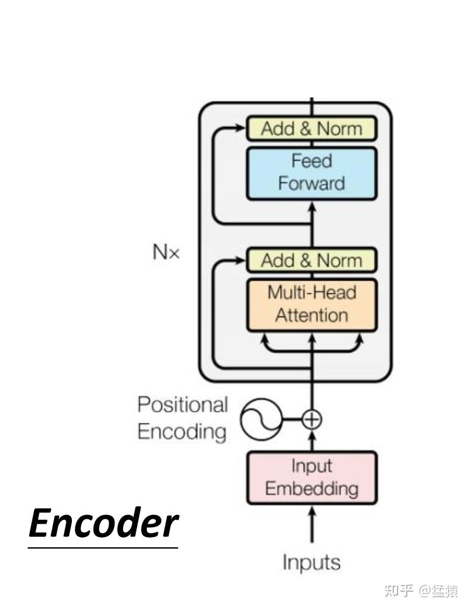
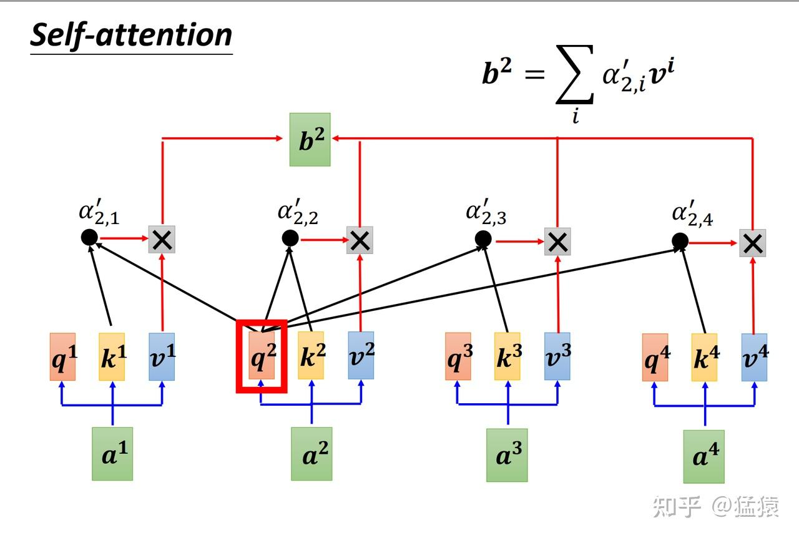
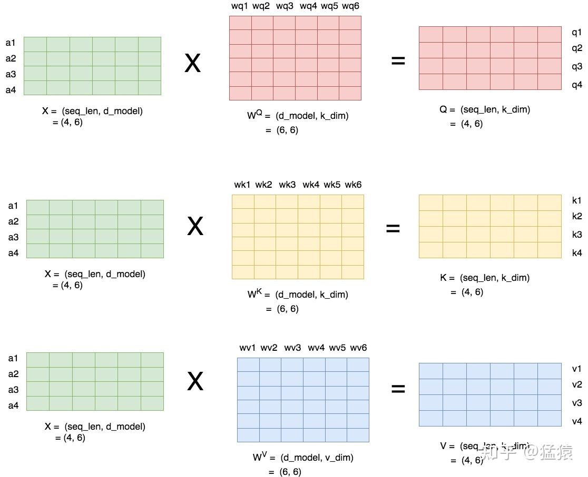

回答这个问题，等同于解释“**Transformer中的参数矩阵维度与输入序列的长度无关**”。

咱们单独将Encoder层的一个block取出来，分析一下这个block中的参数（[Decoder层](https://zhida.zhihu.com/search?content_id=449404701&content_type=Answer&match_order=1&q=Decoder%E5%B1%82&zhida_source=entity)也可以类推），就可以知道Transformer是如何做到处理可变长度数据的了。

如下图，要分析的参数矩阵有五块

-   [Input Embedding层](https://zhida.zhihu.com/search?content_id=449404701&content_type=Answer&match_order=1&q=Input+Embedding%E5%B1%82&zhida_source=entity)
-   Positional Encoding（位置编码层）
-   Attention层
-   [Add&amp;Norm层](https://zhida.zhihu.com/search?content_id=449404701&content_type=Answer&match_order=1&q=Add%26amp%3BNorm%E5%B1%82&zhida_source=entity)
-   [Feed Forward层](https://zhida.zhihu.com/search?content_id=449404701&content_type=Answer&match_order=1&q=Feed+Forward%E5%B1%82&zhida_source=entity)



我们针对这五层参数矩阵，逐一分析。

在分析之前，我们先定义好表示符号：

-   `batch_size`：批量大小
-   `seq_len`：序列长度，也就是题主说的一条语料数据的长度啦
-   `d_model`: 序列中每个token的embedding向量维度
-   `vocab_size`：词表大小。也就是每个token在做embedding前的one-hot向量维度

基本表示符号就是这些，若有新增，则会在下面解说中给出说明。定义了符号，那现在我们输入数据的维度就是`(batch_size, seq_len, vocab_size)`

**(1) Input Embedding层**

这个大家应该都很熟悉了，Input Embedding层参数的维度是`(vocab_size, d_model)`(我统一把输入维度写前，输出维度写后），数据过Embedding层后的输出维度是`(batch_size, seq_len, d_model)`。因此，Embedding层的参数和seq\_len没有关系。

**（2）Positional Encoding层**

确切说来，在Transformer的位置编码层，是没有待训练参数的。它其实是以每个token在序列中的位置 $i$ 作为变量，定义了一个函数，为每一个token生成一个同样是d\_model维度的位置向量，该向量里包含这个token在这个序列里的位置信息。因此，也是和序列长度无关的。

如果对位置向量的细节感兴趣，可以看：[猛猿：Transformer学习笔记一：Positional Encoding（位置编码）](https://zhuanlan.zhihu.com/p/454482273)

**(3)Attention层**

这一部分应该是理解的重点了，我们先来看一个Attention层的输入输出结构，如下，输入为a序列，输出为b序列，蓝色部分代表一个Attention层：


现在我们要来解释为什么Attention层的参数矩阵也是和序列长度无关的。要理解这一点，我们先简单看下Attention层是怎么运作的：



对于每一个token，我们都生成三个向量`q, k, v`。我们用k去和每一个token的q计算attention s分数（记为 $\alpha$ )，再用这个分数和v相乘，最终相加起来生成对应位置的b。

Attention层里的参数矩阵，就是用来生成q, k, v。那具体这些参数矩阵的维度是什么样，又是怎么执行矩阵运算的呢？请见下图：



具体步骤在图片里描述很清楚了，这里就不做文字说明啦。总结一下，Attention层里需要训练的参数矩阵是 $W^Q, W^K, W^V$ 。这三个矩阵的维度和`seq_len`都没有关系。在Transformer的论文中，k\_dim和v\_dim满足：

$k\_dim = v\_dim = d\_model//num\_heads$

其中num\_heads表示头数（Attention是多头的）

如果对Attention的细节感兴趣，可以看：

[猛猿：Transformer学习笔记二：Self-Attention（自注意力机制）](https://zhuanlan.zhihu.com/p/455399791)

**（4）Add&Norm层**

这里Add指的是采用ResNet中残差连接的办法，Norm指的是用Layer Normalization。这两个模块详细的内容就不展开说啦。简单说一下结论：Add是把上图里的 $a_i$ 和对应的 $b_i$ 相加，而Norm则是对每一个输出token做标准化。因此，也和`seq_len`没有关系

**（5）Feed Forward层**

这一层，我就直接放出pytorch中的源码了，一看就能明白和`seq_len`也没有关系：

```python
self.linear1 = Linear(d_model, dim_feedforward, **factory_kwargs)
self.dropout = Dropout(dropout)
self.linear2 = Linear(dim_feedforward, d_model, **factory_kwargs) 
```

在这一层里主要是封装了两层线性层。

最后，按照上述输入输出的计算流程，理论上Transformer是支持变长数据的。但是实际应用中，输入序列太长，会增加模型的运算负担（毕竟Transformer派是富人模型，手动狗头）。所以都会限制输入的`max_len`，多裁少pad 。

希望对题主有所帮助～