### 写在前面

最近想基于公开材料给团队新人准备一份大模型训练的入职培训材料。找了一圈发现，现有的资料要么只讲某个点，要么太偏学术不落地，缺少一个零基础，从硬件基础到工程实践、能让新人系统建立认知的完整路径。

所以决定自己整理。这份材料的目标：**从 [GPU 架构](https://zhida.zhihu.com/search?content_id=270824324&content_type=Article&match_order=1&q=GPU+%E6%9E%B6%E6%9E%84&zhida_source=entity)基础讲起，一路讲到 [MoE](https://zhida.zhihu.com/search?content_id=270824324&content_type=Article&match_order=1&q=MoE&zhida_source=entity) + DeepEP 的工程落地**，让读者读完后能回答"为什么这样设计"而不只是"怎么用"。内容主要来自公开材料、代码和论文，不涉及具体业务细节。

同时打个广告，可灵AI infra训练团队长期招社招、校招、实习生，如果觉得写的还不错，欢迎投递简历liaoyiqiao@kuaishou.com

* * *

## 从零开始的通信计算overlap

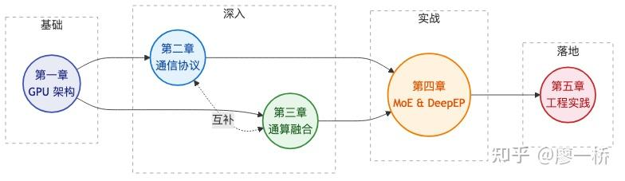

### 各章速览

| 章节 | 一句话 | 关键词 |
| ----- | ----- | ----- |
| 第一章 GPU 架构与通信概览 | GPU 内部怎么工作？为什么需要多卡通信？ | SM / Warp / Warp Group、NVSHMEM、通算融合概念 |
| 第二章 通信协议与路径选择 | 数据在 GPU 之间怎么走？选什么协议？ | NCCL LL/LL128/Simple、IBRC vs IBGDA、CE→TMA→mbarrier |
| 第三章 通算融合与 Overlap | 如何让通信和计算同时跑起来？ | SM Free、2×2 分类框架、TP/UP/DP/EP Overlap 策略 |
| 第四章 MoE 与 EP 并行 | MoE 场景下怎么高效通信？ | EP / All-to-All、DeepEP Normal/LL、GroupGEMM |
| 第五章 工程落地 | 从理论到实践怎么走？ | 场景选型、API 策略、行动路线图 |

* * *

## 第一章：GPU 架构与通信概览

> **核心观点**: GPU 高性能计算的核心在于理解"硬件如何组织、任务如何调度、数据如何流动"——SM 是控制与计算的基本单元，Warp 是调度的最小粒度，而通信协议的选择决定了多卡协作的效率上限。掌握这三层基础，是理解后续通算融合、MoE 并行等高级主题的前提。

* * *

### 1.1 GPU 计算架构：从芯片到线程

> **核心观点**: GPU 不是一个巨大的计算器，而是由成百上千个"小型处理器"（SM）组成的并行计算集群。理解 SM 内部的层级结构，是理解 GPU 编程和性能优化的第一步。

### 1.1.1 为什么要了解 GPU 架构？

在分布式 AI 训练中，我们经常听到"通信瓶颈"、"SM 利用率低"、"通算融合"等术语。但如果不了解 GPU 硬件的基本组织方式，这些概念就像空中楼阁。本节的目标是建立一个清晰的心智模型：**GPU 内部是怎么工作的？**

简单类比：

-   **CPU** 像一个"全能选手"——核心少（几个到几十个），但每个核心能力极强，擅长复杂逻辑
-   **GPU** 像一支"大规模流水线团队"——核心极多（数千个），每个核心简单，但集体力量惊人

### 1.1.2 SM：GPU 的基本执行单元

SM（Streaming Multiprocessor）是 GPU 的核心构建块，可以类比为"车间"。每个 SM 内部有自己的控制单元、计算核心和共享内存。

**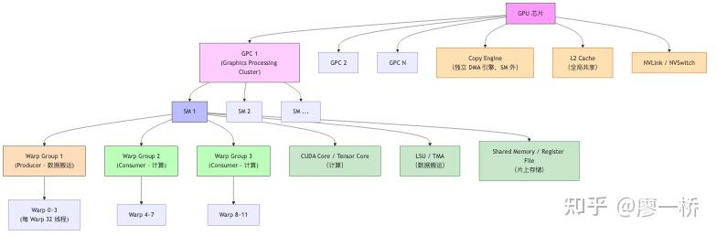**

**关键硬件参数速查表**：

| 层级 | 概念 | 说明 | 典型规模 |
| ----- | ----- | ----- | ----- |
| 芯片级 | GPU | 整块 GPU 芯片 | A100: 108 SM, H100: 132 SM, B200/B300: 148 SM |
| 集群级 | GPC | GPU Processing Cluster，包含多个 TPC | 均为 8 GPC；每 GPC 含 8-10 个 TPC |
| 集群级 | TPC | Texture Processing Cluster，每个含 2 SM | A100: 8 TPC/GPC → 16 SM/GPC；H100: 9 TPC/GPC → 18 SM/GPC |
| 处理器级 | SM | Streaming Multiprocessor，基本执行单元 | 每 SM 最多 64 Warp（H100）/ 48 Warp（B300 SM103） |
| Warp Group 级 | Warp Group | 4 个 Warp = 128 线程（Hopper+） | SM 最多驻留 16 个；Warp Specialization 流水线中常见 1 Producer + 2 Consumer 的 3 组配合 |
| 调度级 | Warp | 32 线程组成的 SIMT 执行单元 | 每 Warp Group 4 个 Warp |
| 执行级 | Thread | 最小执行单元 | 每 Warp 32 个 |

**SM 内部硬件架构**：上面的图展示了 SM 在 GPU 中的组织层级，下面这张图展示一个 SM 内部到底有哪些硬件单元。注意不同架构代际的 SM 内部组成有显著差异：

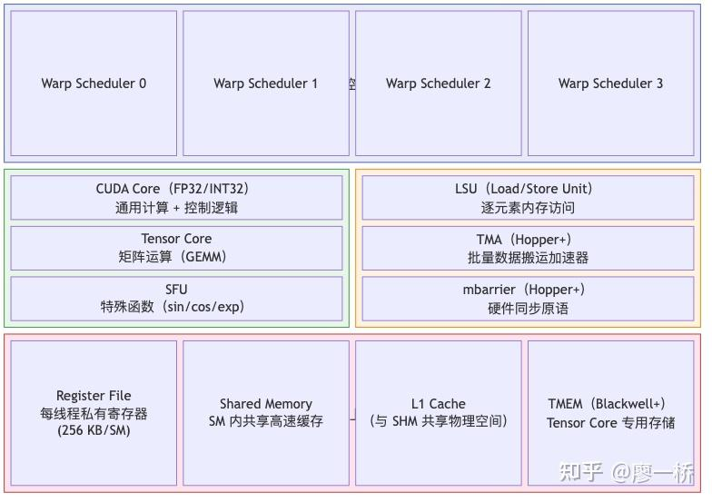| 功能分类 | 硬件单元 | 职责 | 架构支持 | 与通算融合的关系 |
| ----- | ----- | ----- | ----- | ----- |
| 控制面 | Warp Scheduler | 调度 Warp 到计算/搬运单元执行 | 全部 | 通过调度不同 Warp 实现通信/计算交替 |
| 计算 | CUDA Core | 通用计算（FP32/INT32）+ 控制逻辑 | 全部 | 通信中的 flag 检查、WQE 构建也用 CUDA Core |
| 计算 | Tensor Core | 矩阵乘法加速（GEMM） | 全部（代际不同） | 专用于计算，通信不占用；Blackwell 支持 per-thread 操作 |
| 计算 | SFU | 特殊函数（exp/sin/cos） | 全部（B300 翻倍） | Softmax 中的 exp 运算瓶颈；B300 翻倍直接加速 Attention |
| 搬运 | LSU | 逐元素 Load/Store 内存访问 | 全部 | NCCL 机内搬运默认走 LSU，占 SM |
| 搬运 | TMA | 批量数据搬运，内置地址生成单元 | Hopper+ | 数据量 <1KB 时 LSU 更快（TMA 有调用延迟）；>2KB 时 TMA 更快（批量搬运优势）；1–2KB 为过渡区间。DeepEP 大块搬运用 TMA |
| 同步 | mbarrier | 硬件级字节计数 + Warp 挂起/唤醒 | Hopper+ | 硬件实现的细粒度同步，有性能优势但非唯一实现方式 |
| 存储 | Register File | 每线程私有，速度最快（256 KB/SM） | 全部 | 寄存器压力影响 Occupancy |
| 存储 | Shared Memory | SM 内所有线程共享 | 全部 | Producer-Consumer 数据传递的桥梁 |
| 存储 | L1 Cache | 与 Shared Memory 共享物理空间 | 全部 | 可配置 SHM/L1 比例 |
| 存储 | TMEM | Tensor Core 专用存储（256 KB/SM），解耦累加器与寄存器 | Blackwell+ | 矩阵运算中间结果不占寄存器，显著提升 Occupancy |
| 解压 | Decompression Engine | 硬件解压（Snappy/LZ4/Deflate/GZip），600 GB/s | Blackwell+ | 可异步解压，目前场景有限 |

**三代架构完整对比**：

**芯片级参数**：

| 特性 | Ampere (A100) | Hopper (H100) | Blackwell (B200/B300) |
| ----- | ----- | ----- | ----- |
| 制程 | TSMC 7nm | TSMC 4N | TSMC 4NP |
| 晶体管数 | 54.2B | 80B | 208B（双 die） |
| SM 数量 | 108 | 132 | 148 |
| CUDA Core / SM | 64 | 128 | 128 |
| CUDA Core 总数 | 6,912 | 16,896 | 18,944 |
| NVLink 代际 | 第 3 代 | 第 4 代 | 第 5 代 |
| NVLink 带宽 | 600 GB/s | 900 GB/s | 1.8 TB/s |
| PCIe | Gen4（64 GB/s） | Gen5（128 GB/s） | Gen6 |
| HBM 容量 | 80 GB HBM2e | 80 GB HBM3 | 180 GB (B200) / 288 GB (B300) HBM3e |
| HBM 带宽 | 2 TB/s | 3.35 TB/s | 7.7 (B200) / 8 TB/s (B300) |
| L2 Cache | 40 MB | 50 MB | ~126.5 MB（双 die 合计） |
| TDP | 400 W | 700 W | 1,000 W (B200) / 1,100 W (B300) |

**SM 内部差异**：

| 特性 | Ampere (A100) | Hopper (H100) | Blackwell (B200/B300) |
| ----- | ----- | ----- | ----- |
| Tensor Core 代际 | 第 3 代 | 第 4 代 | 第 5 代（ tcgen05.mma） |
| 最低精度支持 | FP16/BF16 | FP8 | FP4/FP6（NVFP4, MXFP4/6/8） |
| Tensor Core 操作粒度 | Warp 级 | Warp Group 级（ wgmma，128 线程协同） | Per-warp 独立（去掉 Warp Group 间同步） |
| Tensor Core 吞吐 | 基准 | ~2x (vs Ampere) | FP8 2x，FP4 4x（vs Hopper） |
| 数据搬运 | LSU（占 SM） | LSU + TMA（硬件加速） | LSU + TMA |
| 同步机制 | sync_threads（CTA 级） | mbarrier（Warp Group 级） | mbarrier + 更多原语 |
| 专用存储 | — | — | TMEM（256 KB/SM） |
| SFU 容量 | 基准 | 基准 | B300: 翻倍 |
| 硬件解压 | — | — | Decompression Engine（600 GB/s） |
| SM 最大 Warp 数 | 64 | 64 | 64（SM100/SM103 均为 64） |
| Shared Memory / SM | 192 KB | 228 KB | 228 KB（SM100/SM103 均为 228 KB） |

**Blackwell 关键新硬件详解**：

**TMEM（Tensor Memory）**：每个 SM 内置 256 KB 专用存储，物理上将矩阵累加器从 Register File 中解耦。Hopper 中 Tensor Core 的累加结果必须存放在寄存器中，大 Tile 消耗大量寄存器空间，压制 Occupancy。Blackwell 的 TMEM 让矩阵运算中间结果有专用存储，显著缓解寄存器压力。

*与当前方案的关系*：TMEM 通过 cuBLAS / CUTLASS 3.x / [DeepGEMM](https://zhida.zhihu.com/search?content_id=270824324&content_type=Article&match_order=1&q=DeepGEMM&zhida_source=entity) 等 GEMM 库自动利用，不需要显式适配。迁移到 Blackwell 后，GroupGEMM 和常规 GEMM 的 Occupancy 会隐式提升。

**Per-thread Tensor Core（ `tcgen05.mma`）**：Hopper 的 `wgmma` 指令要求 128 个线程（一个 Warp Group，4 个 Warp）全部就位、协同执行矩阵运算——如果其中一个 Warp 还在等数据，整个 Warp Group 的 Tensor Core 操作就必须等它。Blackwell 的 `tcgen05.mma` 将这个约束从 Warp Group 级降到 Warp 级，每个 Warp 可以独立触发 Tensor Core 操作，调度器有更多空间交错安排计算和等待，减少了"大家一起等最慢那个"的情况，Warp Scheduler 阻塞减少 18-23%（memory-bound kernel 场景）。

*与 SIMT 是否矛盾？* 不矛盾。SIMT 的约束是 **Warp 内 32 个线程执行相同指令**，这一点在 Blackwell 上完全没变。变的是 Warp **之间**的协同约束：Hopper 要求 4 个 Warp 同步到同一条 `wgmma` 指令（SIMT 之上的额外约束），Blackwell 去掉了这层 Warp 间同步，所以 "per-thread" 更准确地说是 **"per-warp 独立"**。

*与当前方案的关系*：对 MoE 场景直接有益——GroupGEMM 的 SM 利用率天然更高，Warp Specialization 中 Producer 和 Consumer 之间的同步开销更小。未来在 Blackwell 上做 FP4 量化推理时，GroupGEMM 吞吐直接翻 4 倍。

**SFU 翻倍（B300 Ultra）**：Transformer 推理中，Attention 层的 Softmax 需要大量指数运算（exp），由 SFU（Special Function Unit）执行。历代 GPU 中 Tensor Core 吞吐快速增长，但 SFU 没有同步增长，导致 Softmax 成为推理瓶颈。B300 将 SFU 容量翻倍，直接缓解了长上下文推理中 Attention 层的计算瓶颈。

  

**B200 vs B300（Blackwell Ultra）**：

B200 和 B300 同属 Blackwell 架构家族，均采用双 die chiplet 设计（两颗 reticle-size die 通过 10 TB/s NV-HBI 互连），但**并非同一块硅片的 binning**，而是不同的计算能力版本：

| 对比维度 | B200 | B300（Blackwell Ultra） |
| ----- | ----- | ----- |
| Compute Capability | SM100 | SM103 |
| SM 数 | 148 | 148（同） |
| SFU 容量 | 基准 | 翻倍（加速 Softmax/exp） |
| FP4 算力 | 9 PFLOPS | 14 PFLOPS（+56%） |
| FP8/FP6 算力 | 4.5 PFLOPS | 4.5 PFLOPS（同） |
| FP64 算力 | 37 TFLOPS | 1.25 TFLOPS（大幅削减） |
| HBM3e 容量 | 180 GB（8-high stack） | 288 GB（12-high stack，+60%） |
| HBM 带宽 | 7.7 TB/s | ~7.7 TB/s（与 B200 基本相同） |
| TDP | 1,000 W | 1,100 W |
| SM 最大 Warp 数 | 64 | 64（Max Threads/SM=2048） |
| Shared Memory/SM | 228 KB | 228 KB（每 block opt-in 最大 227 KB） |
| 定位 | 通用训练 + HPC | AI 推理 + 低精度训练 |

**核心区别**：B300 的 SM103 相比 B200 的 SM100 是实际的硬件变化（SFU 翻倍、FP4 加速、FP64 削减），不是简单的频率 binning。B300 以牺牲 FP64 HPC 能力为代价，全面强化 AI 推理场景（FP4 算力翻倍、Softmax 瓶颈解除、显存容量 +60%），是面向 Reasoning Model 长上下文推理的专用优化。

**关键认知**：SM 不仅是计算单元，更是**控制单元**——它能执行控制逻辑、生成通信请求、发送指令。真正的数值计算由 CUDA Core/Tensor Core 完成，数据搬运由 TMA 等外设完成。这种"指挥官 + 执行者"的分工模式，是后续通算融合设计的硬件基础。

### 1.1.3 Warp：GPU 调度的最小单位

Warp 是理解 GPU 并行性的核心概念。一个 Warp 包含 32 个线程，这 32 个线程**必须执行相同的指令**（SIMT —— Single Instruction, Multiple Threads）。

**`__syncthreads()` 的双重功能**： `syncthreads()` 只能在一个 Thread Block（CTA）内部使用，不能跨 Block。它同时完成两件事：(1) Block 内·所有线程到达同步点（barrier）；(2) 保证 Shared Memory 的内存一致性。典型用法是一个 thread 通知其他 thread 数据已到达。

**SM 轮询的真实代价**：如果派一个 thread 专门去轮询 flag，该 thread 所在的**整个 warp（32 线程）**都会被占用——不是浪费一个线程，而是浪费一整个 warp。不过 Warp scheduler 会将该 warp 挂起，在间隔检查之间调度其他 ready 的 warp 来执行。因此在 SM 上 warp 数量充足（高 occupancy）时，轮询的影响相对可控。

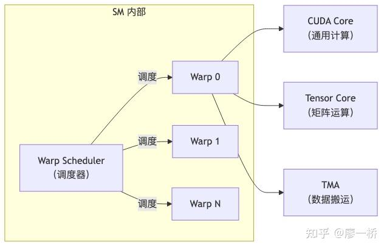

**三个核心理解**：

1.  **Warp 是调度单位，不是资源单位**：Warp 本质上是 Warp Scheduler 调度的线程与硬件的映射关系。SM 支持的最大 Warp 数和线程数是固定的硬件资源
2.  **不同 Warp 可以干不同的事**：虽然同一 Warp 内的线程必须执行相同指令，但不同 Warp 可以分别执行通信、计算等不同任务——这是通算融合的线程级基础
3.  **资源超额分配（Oversubscription）**：GPU 可能有 100 个计算核心但开 300 个线程，部分线程处于等待状态。这不是浪费，而是 GPU **隐藏内存访问延迟**的核心策略——当一组线程等待数据时，调度器立即切换到另一组线程执行

### 1.1.4 Warp Specialization：任务的分工机制

理解了 SM 和 Warp 之后，还需要了解 GPU 如何将一个复杂任务拆分为"搬数据"和"做计算"两个阶段。这就是 Warp Specialization（Warp 特化）机制——不同 Warp Group 承担不同角色。

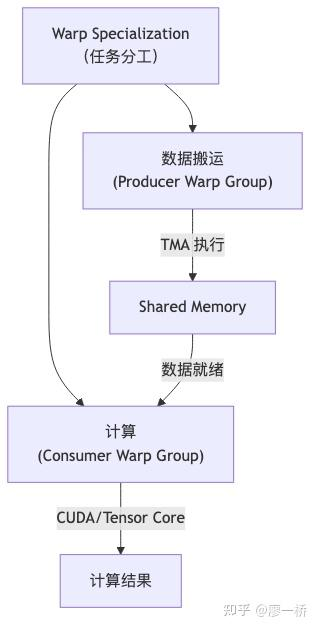

  

-   **Producer Warp Group**：负责数据搬运（通信），使用 TMA 等外设将数据从远端或显存搬入 Shared Memory
-   **Consumer Warp Group**：负责计算，使用 CUDA Core / Tensor Core 对 Shared Memory 中的数据进行运算

> 这种 Producer-Consumer 的分工模式，正是后续"通算融合"的雏形——通信和计算可以在同一个 SM 内流水线执行。

### 1.1.5 CUDA 软件层级与硬件映射

CUDA 编程模型有自己的线程组织层级，与 GPU 硬件层级并非一一对应。理解软硬件的映射关系，是后续理解 kernel 设计、资源分配和同步机制的前提。

| CUDA 软件层级 | 组成 | 映射到的硬件 | 关键约束 |
| ----- | ----- | ----- | ----- |
| Thread | 1 个线程 | SM 内的 1 个执行通道 | 最小执行单元 |
| Warp | 32 个 Thread | Warp Scheduler 的调度单位 | SIMT：32 线程必须执行相同指令 |
| Warp Group | 4 个 Warp = 128 Thread | Hopper+ 的 WGMMA 协同单位 | Hopper 要求 Warp Group 同步触发 Tensor Core；Blackwell 放松为 per-warp |
| Thread Block (CTA) | 多个 Warp | 必须在同一个 SM 内 | 共享 Shared Memory；支持 syncthreads() 同步；一个 SM 可同时驻留多个 CTA |
| Thread Block Cluster | 多个相邻 SM 上的 Thread Block | 跨 SM（Hopper+） | 支持分布式 Shared Memory 和 L2 Multicast；Cluster 内的 CTA 保证被调度到相邻 SM |
| Grid | 所有 Thread Block | 整个 GPU | 一个 kernel launch 对应一个 Grid |
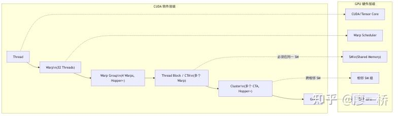

> **关键理解**：Thread Block (CTA) 和 SM 的映射是**最重要的约束**——一个 CTA 的所有线程必须驻留在同一个 SM 内，共享该 SM 的 Shared Memory 和寄存器。这意味着 CTA 的资源需求（线程数、SHM 用量、寄存器用量）决定了一个 SM 能同时驻留多少个 CTA，直接影响 Occupancy。

* * *

### 1.2 通信的必要性：为什么 GPU 需要"对话"

> **核心观点**: 大模型训练中，单卡算力远远不够，多卡协作不可避免。多卡协作的核心瓶颈在于通信——数据如何在 GPU 之间高效流动，直接决定了训练效率的上限。

### 1.2.1 从单卡到多卡：通信挑战的由来

现代大模型（如 GPT-4、DeepSeek-V3）的参数量已达数千亿甚至万亿级别，远超单块 GPU 的显存和算力。因此必须使用多卡甚至多机分布式训练。在分布式训练中，GPU 之间需要频繁交换数据：

| 场景 | 通信操作 | 说明 |
| ----- | ----- | ----- |
| 数据并行 | AllReduce | 多卡梯度聚合 |
| 模型并行 | AllGather / ReduceScatter | 分片参数/激活值的汇聚与分发 |
| MoE 专家并行 | All-to-All | 每个 token 发送到不同的专家节点 |

**核心矛盾**：大模型训练中，通信开销占比越来越大。传统方式下通信和计算串行执行，硬件利用率低——通信时计算 SM 空闲，计算时网络带宽空闲。

### 1.2.2 通信协议全景：如何选择

在 GPU 集群中，节点间（机间）与节点内（机内）的数据搬运效率直接决定了训练/推理的整体吞吐与延迟表现。通信协议的选择本质上是**"延迟-吞吐-一致性"三角权衡**。

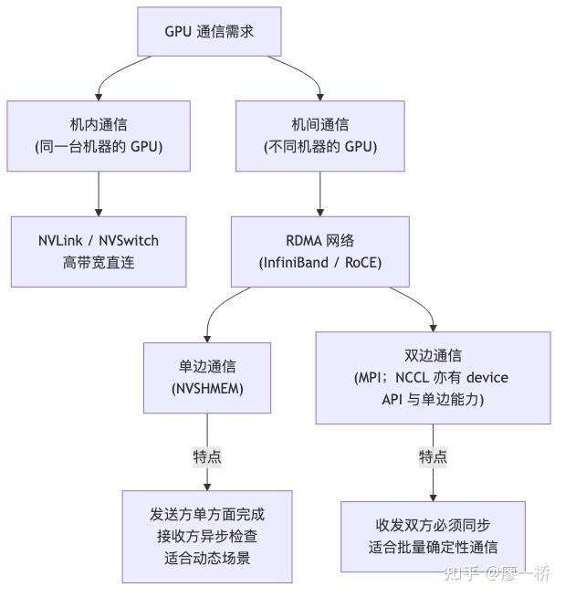

**核心挑战**：

-   **协议层面**：RDMA 单边通信 vs 双边通信各有适用场景，不能简单地认为"单边一定更快"
-   **算法层面**：NCCL 提供了 LL、LL128、Simple 三套小包/大包协议，各有不同的保序机制和性能特征
-   **路径层面**：直发模式、链路 pass、混合路径等选择影响端到端延迟
-   通信协议与路径选择的详细对比将在第二章展开。

* * *

### 1.3 NVSHMEM：单边通信的破局者

> **核心观点**: 传统双边通信（如 MPI、NCCL）要求收发双方同步，导致 GPU 在通信期间无法充分利用算力。NVSHMEM 通过单边通信打破了这一限制，是 MoE 等动态负载场景下实现高效通算重叠的关键技术基础。

### 1.3.1 NVSHMEM 是什么

NVSHMEM 是 NVIDIA 提供的 GPU-native 通信库，基于 OpenSHMEM 标准，以**单边通信（one-sided communication）**为核心特性，也支持双边操作。核心特点：

-   **Symmetric Memory**: 每块 GPU 分配相同大小的显存区域，组成全局可寻址的对称内存空间
-   **Global Address**: 发送方可直接写入接收方的显存地址，无需接收方参与
-   **跨节点支持**: PyTorch 2.27+ 已集成 NVSHMEM 版本，支持跨机通信

### 1.3.2 单边 vs 双边通信对比

| 维度 | 传统双边通信 | 单边通信 |
| ----- | ----- | ----- |
| 同步要求 | 收发双方必须同步（例如communicate shape） | 发送方单方面完成，接收方异步检查 |
| SM 占用 | 通信期间 SM 被占用 | Device API 模式下 SM 可穿插计算 |
| 适用场景 | 适合批量、确定性通信 | 适合动态、细碎的 MoE 场景 |

### 1.3.3 单边通信的基本范式：put / fence / flag

单边通信的基本模式只有三步，理解这三步是理解后续所有优化的基础：

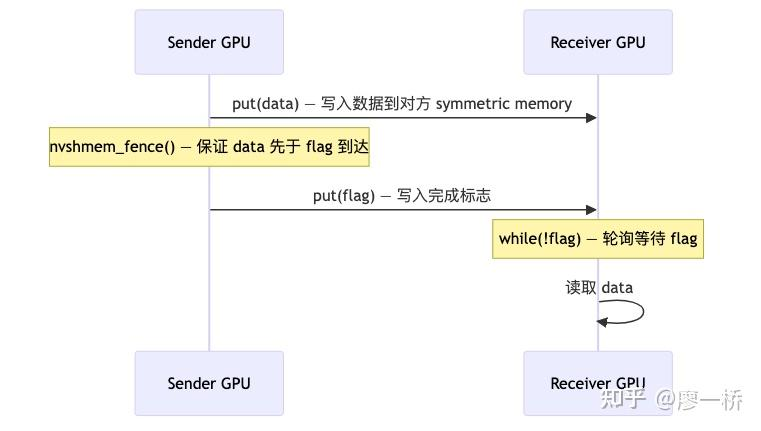

**三步保证**：

1.  `put(data)` — 将数据写入接收方的 symmetric memory
2.  `nvshmem_fence()` — 内存屏障，保证 data 的写入在 flag 之前被递送
3.  目前是个双边过程
4.  用了个trick，原子加来做确定性发送
5.  `put(flag)` — 写入标志位，通知接收方数据已就绪

接收方只需轮询 `while(!flag)`，flag 变化即可安全读取数据。

**三步逻辑链**：

1.  `发送方:`
2.  `1. put(data)→ data 的写请求进入传输队列`
3.  `2. nvshmem_fence()→排空写管线：确保 data 的写请求已全部提交到传输层`
4.  `3. put(flag)→ flag 的写请求排在 data 之后进入队列`
5.  `传输层（同一 QP /同一NVLink通道）:`
6.  `FIFO 保证:先提交的请求先到达目的地`
7.  `接收方:`
8.  `while(!flag)→轮询等待 wait signal操作`
9.  `当 flag=1时:→ fence 保证了 data 先于 flag 提交`
10.  `→ FIFO 保证了先提交的先到达`
11.  `→因此 data 一定已到达，可以安全读取✅`

  

> **核心逻辑链**：fence 保证提交顺序 + 传输层 FIFO 保证到达顺序 = data 一定在 flag 之前到达。  
> **实践中的优化：atomic add 替代 fence**：DeepEP 的实际实现中，并不使用标准的 `nvshmem_fence()`，而是在 put(data) 之后直接用一次 **atomic add** 作为 flag 通知。虽然 atomic add 在 NVSHMEM 规范中并不严格保证内存序，但在当前硬件上它提供了确定性的递送顺序（即 data 在 atomic add 之前到达），性能优于 `nvshmem_fence()`。这是一个利用硬件实际行为的 trick，而非规范保证。

### 1.3.4 Host API vs Device API：关键区分

这是一个决定**能否真正实现 overlap** 的关键区分：

| 维度 | Host API | Device API |
| ----- | ----- | ----- |
| 调用方式 | 从 CPU 端发起的API | 在 GPU kernel 内直接调用 |
| SM 占用 | 仍然占用 SM（本质是启动 kernel） | put 和 fence 之间可穿插其他计算 |
| 核心优势 | 编程简单 | 这才是单边通信的本质价值 |
| overlap 能力 | 无 | 发送端在 put 和 fence 之间自由插入计算 |

> **本质**：Device API 模式下，接收方负责 flag 检查和正确性保证，发送方在 put 和 fence 之间可以随意插入计算——这是 NVSHMEM 单边通信的真正价值所在。

* * *

### 1.4 通算融合：让所有硬件都"忙起来"

> **核心观点**: 通算融合的本质是在同一 kernel 中实现通信与计算的重叠执行，让通信不再阻塞计算，计算不再等待通信。关键突破不在于软件算法，而在于硬件是否提供细粒度同步机制。

### 1.4.1 传统方式 vs 通算融合

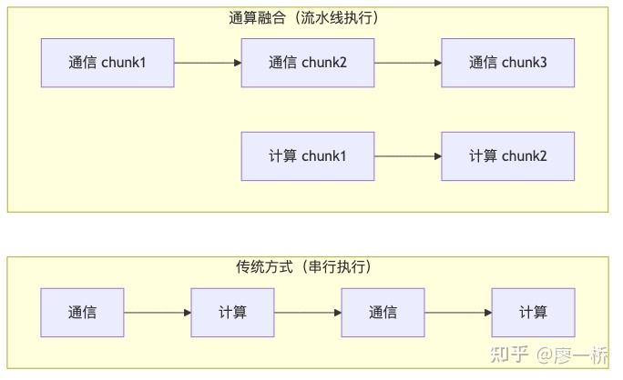| 对比维度 | 传统方式 | 通算融合 |
| ----- | ----- | ----- |
| 执行模式 | 通信 → 计算串行 | 通信与计算重叠 |
| SM 利用率 | 通信时计算 SM 空闲 | 所有 SM 持续工作 |
| kernel 关系 | 通信和计算在不同 kernel | 在同一 kernel 内 |
| 同步粒度 | CTA 级别（粗粒度） | Warp Group 级别（细粒度） |

通算融合在小数据量下不一定是最优的。

### 1.4.2 为什么必须在同一 kernel 中

为什么不能用两个 kernel，一个管通信、一个管计算？

-   不同 kernel**无法共享 SM 资源**
-   即使一个 kernel 的 SM 处于空闲，另一个 kernel 也无法使用
-   不同 kernel 之间缺乏高效的同步机制

因此，实现通算融合的关键路径是：

1.  将通信和计算逻辑放在**同一个 kernel** 中
2.  利用 **Warp Specialization** 将任务拆分为 Producer（通信）和 Consumer（计算）
3.  通过**细粒度同步机制**实现流水线执行
4.  使用 **Persistent Kernel** 技术长期占用资源，减少 kernel 启动开销

### 1.4.3 同步机制的演进：从粗到细

通算融合的效率直接取决于硬件提供的同步粒度。同步越细，流水线越高效：

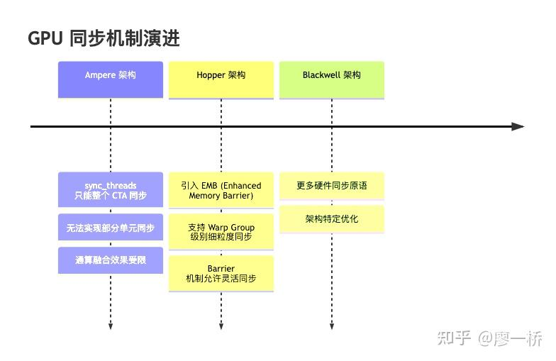| 架构 | 同步能力 | 通算融合支持 |
| ----- | ----- | ----- |
| Ampere (A100) | 只能在整个 CTA 级别 sync_threads | 流水线粒度粗，融合效果受限 |
| Hopper (H100) | EMB + 细粒度 Barrier | 支持 Warp Group 间灵活同步，融合效率高 |
| Blackwell (B200/B300) | 更多硬件原语 + TMEM + per-thread Tensor Core | Tensor Core 操作粒度从 Warp Group 细化到 per-warp；TMEM 减少寄存器压力，提升 Occupancy |

> "这个东西特别的硬件 specific，在 Ampere 上、Hopper 上、Blackwell 上，你有不同的写法和玩法，完全取决于上面有多少硬件资源。"

* * *

### 1.5 硬件约束：资源不是无限的

> **核心观点**: 理解硬件的物理限制，才能做出合理的资源分配决策。SM 数量、GPC 组织、网卡 QP 数量等多重因素共同约束着通信与计算的效率上限。

### 1.5.1 SM 物理层级与资源分配粒度

GPU 的 SM 按 **GPC → TPC → SM** 三级物理组织：

1.  `GPC（GraphicsProcessingCluster）——最大分组，`
2.  `共享 L2 cache 分区和 memory controller`
3.  `├── TPC 0（TextureProcessingCluster）——物理最小配对，共享TextureUnit`
4.  `│├── SM 0`
5.  `│└── SM 1`
6.  `├── TPC 1`
7.  `│├── SM 2`
8.  `│└── SM 3`
9.  `└──...`

  

  

满配芯片出厂后会禁用部分 SM 以提升良率：

| GPU 型号 | GPC | TPC/GPC | SM/TPC | SM/GPC（满配） | 满配 SM | 启用 SM |
| ----- | ----- | ----- | ----- | ----- | ----- | ----- |
| A100 (GA100) | 8 | 8 | 2 | 16 | 128 | 108 |
| H100 (GH100) | 8 | 9 | 2 | 18 | 144 | 132 |
| B200 (Blackwell) | 8 | ~10 | 2 | ~19 | ~160 | 148 |

> 数据来源：NVIDIA Ampere / Hopper Architecture In-Depth

**工程上真正决定"整数倍"的，不是物理 GPC，而是 Green Context 的分配约束**。流程是先给 Green Context 分 SM，再在该 Context 里创建 stream。 `cuDevSmResourceSplitByCount`（默认 `useFlags=0`）会按照最小分区和对齐规则调整请求值：

| 架构 | Compute Capability | 最小分区 ( minSmPartitionSize) | 对齐 ( smCoscheduledAlignment) | 备注 |
| ----- | ----- | ----- | ----- | ----- |
| Ampere (A100) | sm_80 | 4 SM | 2 的倍数 | 请求 5，通常会变成 6 |
| Hopper (H100) | sm_90 | 8 SM | 8 的倍数 | 请求 5，会变成 8 |
| Blackwell (B200) | sm_100 | 8 SM | 8 的倍数 | 请求 5，会变成 8 |

> 来源：CUDA Driver API - Green Contexts

结果：

-   实际分配值不是你请求多少就给多少，会先满足最小分区，再满足对齐。

有时候还会看到 "SM 争抢"：

-   常见原因 1：你以为给了 5，实际可能是 6 或 8，导致通信/计算预算失真。
-   常见原因 2：Green Context 主要隔离的是 SM 空间，其他资源（如 workqueue 等）仍可能影响并发表现。

### 1.5.2 SM 资源分配策略对比

如何在通信和计算之间分配 SM 资源，是工程实践中的关键决策：

| 策略 | 说明 | 隔离保证 | 优点 | 缺点 |
| ----- | ----- | ----- | ----- | ----- |
| Cooperative Launch + 通信窗口内 Persistent | 通信 kernel 同时使用两个机制：(1) Cooperative Launch 保证 ~20 个 block 同时获得 SM；(2) block 在单次通信窗口内 persistent——polling wait 不退出，但通信完成后 kernel 结束、SM 释放（一次 dispatch 实际对应 2-3 个 kernel）。区别于训练全程驻留的经典 Persistent Kernel。额外的 Cluster 约束（ clusterDim=2）要求 SM 对在同一 GPC | 通信期间事实隔离——cooperative 保证同时获得 SM，通信窗口内持续占用；窗口间 SM 释放回调度池 | DeepEP Normal 模式采用此方案（~20 SM）；polling wait 期间 SM 可与计算 Warp 共享时间片，部分弥补浪费 | 通信期间 SM 无法主动释放；Cluster 约束使 SM margin 需求 > 实际 block 数 |
| Green Context | 驱动层通过 cuDevSmResourceSplitByCount 将 SM 划入不同 Context，硬件强制隔离 | SM 维度硬件隔离——计算 block 不会被调度到通信 SM 上 | 显著降低 SM 争抢，行为可预测 | 通信 SM 空闲时浪费资源；隔离粒度受架构约束（A100: 4 SM，H100: 8 SM）；其他资源仍可能影响并发 |
| 通算融合 | 同一 SM 内通信与计算动态切换，通过 Warp Specialization 实现 Producer/Consumer 流水线 | 不隔离——同一 SM 内共享 | 理论上全部 SM 可利用 | 实现复杂，依赖硬件同步机制（mbarrier 等） |

> 前两种策略都是"静态 SM 分区"，核心缺点相同：通信 SM 空闲时无法复用给计算。区别在于隔离保证程度——Green Context 在 SM 维度是硬件强制，Cooperative Launch 是通过资源耗尽间接实现。DeepEP Normal 模式通信 kernel 的 polling wait 期间，SM 可以与计算 Warp 共享时间片（见第四章），部分弥补了资源浪费。

### 1.5.3 通信效率的饱和曲线

增加用于通信的 SM 数量并非总是有益的——存在一个**饱和点**，由多层外部资源天花板决定：

**SM 在通信中的具体角色**：SM 不是"搬数据的苦力"，而是"发指令 + 等完成"的控制者。以 DeepEP Normal 模式为例，20 个 SM 的 warp 分工为：构建 WQE 触发 RDMA、polling wait 检查数据到达、TMA 转发（NVLink 两跳场景）。SM 越多，能并行发起的通信通道越多——但通道数增加到一定程度后，瓶颈就不在 SM 了。

**瓶颈在哪里（从近到远）**：

| 瓶颈层级 | 具体约束 | 饱和表现 |
| ----- | ----- | ----- |
| 网卡 QP | 每个独立通信通道需要一个 QP；Normal 模式 ~10 QP，LL 模式 8-16 QP | QP 达到 10-24 后性能不再提升，瓶颈转移到网卡带宽 |
| 网卡带宽 | 单 NIC ~50 GB/s（400 Gb/s IB）；GPU Direct RDMA 场景下 SM 再多也超不过网卡线速 | SM 能灌满网卡后，多余 SM 只是空转 polling |
| NVLink 带宽 | 机内通信走 NVLink（H100: 900 GB/s）；Normal 两跳转发中 SM 用 TMA 搬运，带宽受 NVLink 端口限制 | 20 SM 的 TMA 已足够打满 NVLink，增加 SM 无收益 |
| HBM 带宽 | memory-bound 通信中，SM 发起的 load/store 受 HBM 带宽约束 | 数据准备阶段可能先于网卡饱和 |

**实际工程中的经验值**：

-   DeepEP Normal：~20 SM（10 通信 channel，每 channel 2 SM 分别负责 NVLink 和 IB）
-   DeepEP LL：仅需 8 SM 即可让网卡达到饱和（IBGDA 模式，SM 只发指令不搬数据）
-   NCCL Overlap 场景：通常 4 SM（channel 数少，避免影响计算）

**关键洞察**：通信效率与 SM 数量呈"先升后平"的关系。超过饱和点后，继续增加 SM 无法提升性能，反而可能因资源竞争导致效率下降。**判断饱和点的方法不是算出来的，而是实测**——固定通信模式，逐步增加 SM 数量，观察吞吐何时不再增长。

* * *

### 1.6 本章小结

本章建立了分布式 GPU 通信的基础认知框架：

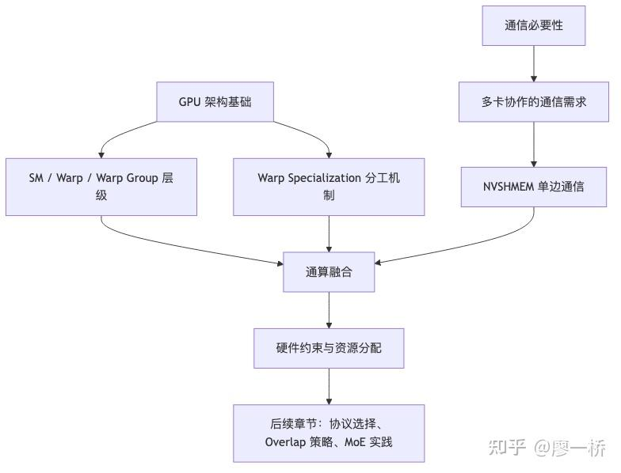| 概念 | 一句话总结 |
| ----- | ----- |
| SM 架构 | GPU 的"车间"，既能控制又能计算 |
| Warp / Warp Group | 调度最小单位（32 线程）；Warp Group（128 线程）支持 Warp Specialization 流水线 |
| CUDA 软硬件映射 | Thread → Warp → CTA（必须在同一 SM）→ Cluster（跨 SM）→ Grid |
| 通信需求 | 多卡训练必须高效交换数据，通信模式决定协议选择 |
| NVSHMEM | 以单边通信为核心，发送方不等待接收方 |
| 通算融合 | 同一 kernel 内通信计算重叠执行，关键在硬件同步粒度 |
| 硬件约束 | SM 资源有上限，分配策略影响 Overlap 效果 |

* * *

### Know-How

**KH-1-1: SM 角色认知**

-   **场景**: 理解 GPU 编程模型和通算融合设计
-   **原则**: SM 不仅是计算单元，更是控制单元。SM 能执行控制逻辑、发请求、发命令；真正的计算由 CUDA Core/Tensor Core 完成，数据搬运由 TMA 等外设完成。这种分工是通算融合的硬件基础
-   **边界**: 不同架构的 SM 能力不同（Ampere vs Hopper vs Blackwell），编程方式也不同

**KH-1-2: 通算融合的硬件前提**

-   **场景**: 设计通信计算重叠方案时
-   **原则**: 通算融合必须在同一 kernel 内实现，因为不同 kernel/stream 之间无法共享 SM。实现的关键不在于软件算法，而在于硬件是否提供细粒度同步机制
-   **边界**: 每代 GPU 架构的同步能力不同，代码需针对具体架构适配

**KH-1-3: 同步粒度决定融合效率**

-   **场景**: 评估通算融合方案的性能上限
-   **原则**: 同步粒度越细，流水线越高效。CTA 级别同步只能实现粗粒度流水，Warp Group 级别同步才能实现细粒度流水线
-   **边界**: 过细的同步粒度可能带来额外的同步开销，需要权衡

**KH-1-4: 资源分配的黄金法则**

-   **场景**: 设计 GPU 通信方案时的 SM 分配决策
-   **原则**: 固定分配 SM 给通信是最简单但最浪费的方式。通算融合虽然实现复杂，但能最大化资源利用率。Green Context 只能隔离资源，不能提升效率
-   **边界**: 当通信量很小且恒定时，固定分配反而更简单可靠

**KH-1-5: 通信效率的饱和曲线**

-   **场景**: 调优通信 SM 数量时
-   **原则**: 通信效率与 SM 数量呈"先升后平"的关系，受限于网卡 QP 数量、内存带宽和 GPC 调度。不要盲目增加通信 SM，需要找到饱和点
-   **边界**: 饱和点因 GPU 型号、网络拓扑、通信模式而异，需实际测试

**KH-1-6: Host API vs Device API 的选择**

-   **场景**: 选择 NVSHMEM 的调用方式时
-   **原则**: 只有 Device API 才能真正实现通算重叠；Host API 只是封装，SM 仍然 busy
-   **边界**: 如果不需要 overlap，Host API 更简单易用

* * *

**本文是从零开始的通信计算overlap系列的一部份，请见：**

[从零开始的通信计算overlap【第一章】](https://zhuanlan.zhihu.com/p/2011564057396809841)

[从零开始的通信计算overlap【第二章】大模型通信基础 2.1：通信硬件拓扑](https://zhuanlan.zhihu.com/p/2028907020917449344)

[从零开始的通信计算overlap【第二章】大模型通信基础2.2 RDMA 核心概念](https://zhuanlan.zhihu.com/p/2028907599861495146)

[从零开始的通信计算overlap【第二章】大模型通信基础 2.3 机内数据搬运](https://zhuanlan.zhihu.com/p/2028907936030704604)

[从零开始的通信计算overlap【第二章】大模型通信基础 2.4 机间数据搬运](https://zhuanlan.zhihu.com/p/2028908577935336722)