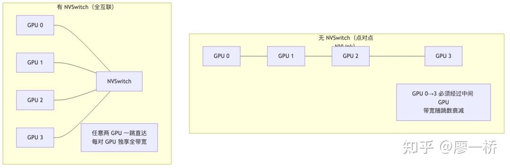
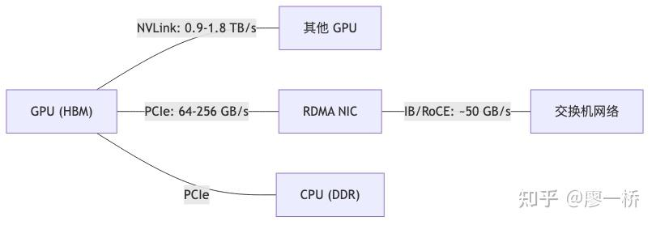
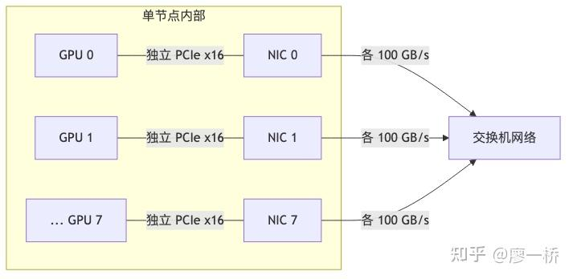

## 可灵AI infra训练团队正在招聘，欢迎投递简历liaoyiqiao@kuaishou.com

## 大模型通信基础 —— 硬件、协议与数据通路

> 这部分原本是《从 0 到 1 的通信-计算 overlap》那篇文章的第二章，写着写着篇幅越来越大，索性独立出来作为《大模型通信基础》。本文是其中的"通信硬件拓扑"一节。

今天咱们来聊聊大模型训练里的通信系统。

别把它想成技术名词的堆砌：**传得越远衰减越大，快存储做不大、大存储做不快，单芯片算力也有天花板**——这几条硬约束自上而下传导，才堆出你看到的带宽阶梯、协议栈和整栈取舍。

本文围绕四条主线展开：

-   **分层通信**——带宽从芯片内到机间十倍十倍地降，所以高带宽层做重活、低带宽层只搬精华（§2.1, §2.4.2, §2.6.4）
-   **SM 占用阶梯**——搬运数据要消耗计算资源，通信和计算是零和博弈，所以要尽量选不占 SM 的搬运方式（§2.3, §2.3.5）
-   **控制面与数据面分离**——"描述搬运任务"和"执行搬运"可以由不同硬件完成，分离得越彻底，释放给计算的 SM 越多（§2.2, §2.3.4, §2.4.1, §2.5）
-   **搬运 vs 归约二分**——DMA 引擎只能搬数据不能做算术，含归约的操作必须用 SM 或专用硬件，这直接决定了 overlap 的可行性（§2.6）

### 目录

-   **2.1 通信硬件拓扑**（本文）
-   2.2 RDMA 核心概念
-   2.3 机内数据搬运
-   2.4 机间数据搬运
-   2.5 通信协议栈：从黑盒到开放平台
-   2.6 集合通信原语：搬运与归约的二分法
-   2.7 总结与展望

> **适用范围**：文中硬件参数以 H100/B200/B300 + [ConnectX](https://zhida.zhihu.com/search?content_id=273351144&content_type=Article&match_order=1&q=ConnectX&zhida_source=entity)\-7/8 为主要参考平台；NCCL 版本特性截至 2.29、NVSHMEM 截至 3.5。所有数字请以你自己的 benchmark 和 NVIDIA 官方 Release Notes 为准。

* * *

### 2.1 通信硬件拓扑

### 通信的不可能三角

通信本质是 **A→B 搬数据**；三目标互相牵制——**高带宽、低延迟、尽量不占用 SM/寄存器/缓存**，构成**不可能三角**，优化只能是取舍：

> **要点**: 没有「三角全胜」——你只能按场景决定牺牲带宽、延迟还是 SM。

| 策略 | 带宽 | 延迟 | 对计算的影响 |
| ----- | ----- | ----- | ----- |
| SM Load/Store 搬运 | 受限于 SM 发射速率 | 低（直接） | 重度占用 SM |
| TMA 硬件搬运 | 高（绕过 Register File） | 有启动延迟 | 近零占用 |
| Copy Engine DMA | 高 | 有 kernel launch 延迟 | 零占用 |
| RDMA（IBRC） | 高 | 有 CPU 中转延迟 | SM 等待 CPU |
| RDMA（IBGDA） | 高 | 更低（直控 NIC） | SM 短暂占用 |

举个实际的例子。DeepEP 在同一个代码库里做了两种截然不同的模式——不是纠结，而是物理约束在两个场景下的优先级不同：

|  | Normal 模式（训练 / 预填充） | Low-Latency 模式（推理 Decode） |
| ----- | ----- | ----- |
| 优先目标 | 带宽 | 延迟 |
| 路径 | 两跳聚合（NVLink 汇聚 → RDMA 大包） | 一跳直达（每 GPU 直接 RDMA 小包） |
| SM 占用模式 | 持续占用——通信 kernel 常驻 N 个 SM（ set_num_sms 可调），与计算 kernel 空间划分，存在资源竞争 | 脉冲式占用——send/recv 短暂用 SM，RDMA 传输期间释放，通算时间划分，传输窗口内零竞争 |
| 牺牲了什么 | 延迟（多一跳 NVLink） | 带宽利用率（小包开销大、NIC 打不满） |

说白了，训练时数据量大、延迟容忍度高，牺牲延迟换带宽；Decode 时每个 token 只传几 KB、TPOT 直接影响用户体感，牺牲带宽换延迟。**不可能三角不是"选一个最好的"，而是"按场景选择牺牲哪个"。**

而在这个三角之前，还有一个更根本的问题：**能不能不搬或少搬？**

-   **不搬**：重写计算逻辑，消掉对完整中间结果的依赖。典型如 loss\_parallel——不再先 AllGather 完整 logits 再算 loss，而是直接在各自的 vocab 分片上计算，最后只做小规模归约。通信量从 O(vocab × seq × bs) 降到 O(seq × bs)。关键不是把大张量搬得更快，而是让这次搬运根本不需要发生。
-   **少搬**：压缩（TopK、量化、FP8 通信减少 4 倍数据量）、分层归约（机内先 ReduceScatter，机间只传 1/8 数据）、激活值重计算（不传中间结果）。 量化不是一刀切——DeepEP 的做法是**分阶段选择性量化**：前向 dispatch 用 FP8 发 token 给 expert，通信量减半；但 combine 阶段用 BF16 保精度。 根本原因在于**误差传播路径不同**：

| 阶段 | 量化选择 | 误差传播路径 | 为什么可以/不可以 FP8 |
| ----- | ----- | ----- | ----- |
| Dispatch | FP8 | 误差进入 expert MLP → 经多层矩阵乘 + 非线性激活 → 误差方向被"打散" | MLP 内 BF16 计算有精度余量吸收 FP8 噪声 |
| Combine | BF16 | 结果直接进入残差连接 → 误差不经计算直传下一层 → 沿残差流逐层累积 | 精度余量已被消耗，再叠加 FP8 误差会失控 |

-   **非要搬，则选最近的路**：搬运成本从近到远递增——

> **要点**: 这张表把「远近」量化成层级——越远带宽越窄、搬运者越杂，是否占 SM 也随之而变。

| 搬运层级 | 硬件路径 | 带宽 | 搬运者 | 占用 SM？ | 对应 CUDA 指令 |
| ----- | ----- | ----- | ----- | ----- | ----- |
| 寄存器↔SRAM | SM 内部 | ~31 TB/s 峰值（H100，132 SM × 32 banks × 4B × 1.83 GHz） | LSU | 是 | ld.shared / st.shared |
| SRAM↔L2 Cache | SM ↔ L2 | ~3.8-5.5 TB/s（近分区 ~5.5 TB/s、全 L2 ~3.8 TB/s，H100 L2 分区特性导致） | LSU 或 TMA | LSU 是，TMA 否 | ld.global / cp.async.bulk |
| L2↔HBM | Memory Controller | 3.35 TB/s（H100） | Memory Controller | 否 | 隐式 |
| GPU↔GPU（机内） | NVLink | 900 GB/s（H100） | SM LSU / TMA / CE | 视方式而定 | ld.global（remote）/ cudaMemcpyPeerAsync（CE） |
| GPU↔NIC（机间） | PCIe + RDMA | ~50 GB/s/NIC | NIC DMA | 否 | ibv_post_send（libibverbs）/ nvshmem_put（NVSHMEM） |

"缩短搬运距离"的两种思路：

| 思路 | 代表技术 | 机制 |
| ----- | ----- | ----- |
| 近存计算 | Groq LPU 等（大容量片上 SRAM、存算紧密布局） | 用片上 SRAM 缓解「远 HBM」搬运；注：LPU 为 Groq 产品线，勿与「NVIDIA 收购 Groq」等市场误传混淆 |
| 网内计算 | NVLS（NVSwitch 内部）/ IB SHARP（IB 交换机内部） | 在数据经过的交换芯片内部直接做 in-network reduction |

> **共同本质：不是把数据搬到计算单元，而是把计算放到数据所在或经过的地方。**

### 为什么需要"通信"——数据搬运的第一性原理

在本章的语境中，**通信 = 一切数据搬运**，不仅仅是卡与卡之间的网络传输。寄存器→SRAM、L2→HBM、GPU→GPU、节点→节点——只要数据从一个物理位置移动到另一个物理位置，就是通信。

**为什么数据搬运不可避免？** 两层原因，一层比一层更根本：

**第一层：单设备内——存储层级的物理约束**

即使只有一张卡、一个 SM，数据搬运也无法消除。快的存储做不大，大的存储做不快（具体带宽数字见上方搬运层级表）。计算需要的数据量远超片上存储容量，所以数据必须在层级间反复搬运。

**第二层：多设备间——并行的本质是资源维度的重新分配**

单个计算设备有三个资源维度，各自有物理上限：**算力**（FLOPS）、**显存容量**（GB）、**显存带宽**（TB/s）。并行不仅仅是"模型太大放不下才切分"，而是**在多个设备之间重新分配这些资源维度，用通信开销换取某个维度的扩展**：

| 并行策略 | 核心动机 | 资源 trade-off |
| ----- | ----- | ----- |
| DP（数据并行） | 提高吞吐——单卡算力不够，想同时处理更多数据 | 每卡各存一份完整模型（冗余显存），换取 N 倍数据吞吐；代价是梯度同步通信（AllReduce） |
| TP（张量并行） | 降低单步延迟——把一个矩阵乘法拆到多卡同时算 | 每卡只存部分参数和激活；代价是每层都要 AllReduce，通常限制在同一 NVLink domain 内（跨节点代价极高） |
| PP（流水线并行） | 跨节点的模型并行——TP 通常限于 NVLink domain，PP 用 P2P 点对点通信突破域边界 | 每卡只存部分层；通信只发生在相邻 stage 间（传激活/梯度），通信量小，可容忍慢速节点间网络；副产品：省出的显存可给更大 micro-batch；代价是 pipeline bubble |

**并行一旦存在，通信就是数学必然**：分块矩阵乘法需要交换中间结果（TP 的 AllReduce）、流水线阶段之间需要传递激活（PP 的 P2P）、数据并行需要同步梯度（DP 的 AllReduce）。这不是工程缺陷，是线性代数分块计算的固有属性。

因此，本章的核心问题是：**既然搬运不可避免，它受什么物理约束？怎么判断瓶颈在哪？**

### 统一框架：α + S/β —— 从 Kernel 到集群的通用瓶颈模型

从单个 kernel 到整个集群，每一层的性能瓶颈都服从同一个结构：

$$t = \\\\alpha + \\\\frac{S}{\\\\beta}$

-   $\\\\alpha$ = 固定开销（不随规模变化）
-   $S$ = 工作规模（数据量、计算量、batch size……）
-   $\\\\beta$ = 吞吐能力（带宽、算力……）

说白了，这就跟寄快递一样：α 是填单子等快递员上门的时间，S/β 是路上运输的时间。**瓶颈永远取决于两种资源中哪个先成为短板。** 每一层都有两种竞争资源，性能由较慢的那个决定：

| 层级 | 资源 A | 资源 B | 强度指标 | 强度低 → bound by | 强度高 → bound by |
| ----- | ----- | ----- | ----- | ----- | ----- |
| 单次通信 | 启动延迟 α | data_size / 带宽 | 消息大小 | latency-bound | bandwidth-bound |
| 单个 Kernel | Bytes / HBM 带宽（访存时间） | FLOPs / 算力（计算时间） | Arithmetic Intensity（FLOPs/Byte） | memory-bound | compute-bound |
| 单次forward or backward | 通信时间 | 计算时间 | 每次通信间的计算量（DP 看 batch，TP 看 hidden_dim，PP 看 stage 深度） | communication-bound | compute-bound |

即 **Roofline 在多尺度上的同一套结构**：看「强度」落在拐点左还是右；latency/bandwidth 与 compute/communication **同源**，只是层级不同。

### 带宽阶梯：三层互联各自为什么存在

带宽阶梯不是一张"参数表"，而是三层互联——片上 HBM、机内 NVLink、机间 RDMA——各自回答同一个问题：**怎么在这个物理距离下获得最高带宽？**

| 层级 | 技术 | 带宽量级 | 解决的问题 |
| ----- | ----- | ----- | ----- |
| GPU 内部 | HBM | 3-8 TB/s | 计算单元的数据供给 |
| 机内 GPU↔GPU | NVLink + NVSwitch | 0.9-1.8 TB/s | 同机 GPU 间高速同步（绕过 PCIe） |
| 机间 Node↔Node | RDMA NIC + Switch | 50-400 GB/s | 跨机梯度同步与数据交换 |
| GPU↔NIC/CPU | PCIe | 64-256 GB/s | 异构设备间的通用总线 |

### 延迟 vs 带宽——训练和推理关注的东西不一样

**单次点对点传输**的延迟由三部分构成：

$$t*{p2p} = \\\\alpha + \\\\frac{S}{BW} + t*{propagation}$$

-   **$\\\\alpha$**（启动延迟）：软件栈开销（kernel launch、WQE 构建、doorbell）
-   **$S / BW$**（传输延迟）：数据量 / 带宽，大包场景的主导项
-   **$t\_{propagation}$**（传播延迟）：物理距离导致的信号传播时间（光纤中信号传播速度约 5μs/km）

但实际的集合通信（AllReduce、AllGather 等）不是单次传输，而是**由多步点对点操作组成**。通信算法决定了步数和每步的数据量，对总延迟影响巨大——Ring 用 O(N) 步、每步 S/N 实现近满带宽（$t = 2(N{-}1)(\\\\alpha + \\\\frac{S}{N \\\\cdot BW})$）；Tree 用 O(log N) 步、每步全量 S 省延迟费带宽。**NCCL 按消息大小切换**（小包 Tree、大包 Ring），正是 α 与 S/β 的权衡。（算法细节与 PAT 第三选择见 §2.6.3。）

| 场景 | 瓶颈类型 | 原因 |
| ----- | ----- | ----- |
| 训练（大 batch） | 几乎总是 bandwidth-bound | 梯度/权重 MB~GB 级，传输时间远大于启动延迟；NCCL 选 Ring |
| 推理 Prefill | bandwidth-bound | 长序列的 KV Cache 和 AllReduce 数据量大 |
| 推理 Decode | latency-bound | 每个 token 只需通信几 KB，启动延迟占主导；NCCL 选 Tree |
| MoE Decode（LL 模式） | latency-bound | 每个 expert 的 token 可能只有几个，All-to-All 启动延迟占主导 |

训练中几乎不会 latency-bound——batch 大、通信数据量大，带宽打满后传输时间远大于固定延迟。唯一例外是 PP 中 micro-batch 极小时，stage 间小消息传递可能受启动延迟影响。

### 讨论带宽时必须区分三个层次

| 概念 | 含义 | H100 示例 |
| ----- | ----- | ----- |
| 单卡带宽 | 一块 GPU 的 NVLink/NIC 总带宽 | NVLink 900 GB/s，NIC 50 GB/s |
| 单机聚合带宽 | 8 块 GPU 的总对外带宽 | 8 × 50 = 400 GB/s（NIC 总和） |
| 实际可用带宽 | 取决于通信模式、算法和网络拓扑 | 见下文 |

### Rail-Optimized 拓扑与通信模式的带宽差异

**Rail-Optimized** 拓扑（下同）：

1.  `Node A`

  

1.  `LeafSwitchesNode B`
2.  `+----------++----------+`
3.  `| GPU0-NIC0|----Leaf0(Rail0)----|NIC0-GPU0 |`
4.  `| GPU1-NIC1|----Leaf1(Rail1)----|NIC1-GPU1 |`
5.  `| GPU2-NIC2|----Leaf2(Rail2)----|NIC2-GPU2 |`
6.  `|...|...|...|`
7.  `| GPU7-NIC7|----Leaf7(Rail7)----|NIC7-GPU7 |`
8.  `+----------++----------+`
9.  `各LeafSwitch通过SpineSwitch互联`

  

每条 **Rail** = 独立 leaf，接各节点**同号** GPU/NIC；同 rail 走 leaf，**跨 rail 必绕 spine**。据此，模式间可用带宽差很大：

| 通信模式 | 可用带宽 | 为什么是这个值 |
| ----- | ----- | ----- |
| P2P（单对） | ~50 GB/s | 一个 GPU 通过一个 NIC 发给远端一个 GPU，只用一条路径 |
| Rail-parallel | 8 × 50 = 400 GB/s | GPUi 只和远端 GPUi 通信（对号），8 条 rail 完全独立、零竞争，各自跑满 |
| Ring AllReduce | busBW ≈ 单 NIC 带宽 × N_channels | Ring 是一条链：每步每个 GPU 只通过一个 NIC 向相邻 GPU 发 S/N 数据。单条 ring 的 busBW 上限 = 单 NIC 带宽。NCCL 会开多条并行 ring（channel）利用多个 NIC，实际 busBW 可趋近 8 × 50 GB/s。注意 busBW 衡量的是链路利用率；应用实际感受到的 algBW=busBW×N/(2(N-1))（AR = RS + AG 两阶段；大 N 趋近 busBW/2，8 卡为 busBW × 4/7 ≈ 0.57 × busBW） |
| All-to-All（跨 Rail） | 远低于 400 GB/s | 每个 GPU 要和所有远端 GPU 通信。8×8=64 对中只有 8 对是对号（走 leaf），其余 56 对是 cross-rail（必须绕行 spine switch）。Spine 的总带宽是固定的，56 条流量全挤在上面 → spine 成为瓶颈 |

* * *

### 2.1.1 机内互联：NVLink 与 NVSwitch——为什么 PCIe 不够用

为什么不用 PCIe？因为太慢了。NVLink 绕过 PCIe 瓶颈实现 GPU 直连，NVSwitch 将点对点拓扑升级为全互联。从 Ampere 到 Blackwell，单 GPU 互联带宽从 600 GB/s 跃升至 1.8 TB/s，同代 NIC 带宽亦在同步提升；**NVLink 与同代 NIC 的长期带宽比**及由此推出的分层通信动机，在 **§2.1.6** 集中给出——这里只需记住：机内与机间不是同一档「管道」，软件必须分层利用。

**NVLink 为什么存在？** 多卡并行后 AllReduce 需极高聚合带宽；PCIe Gen5 x16 双向仅 128 GB/s 量级，必须用**绕过 PCIe 的专有高速差分链路**（NVLink）才能喂饱机内通信。

### NVLink 代际演进

各代 NVLink 的关键参数对比：

> **要点**: 代际升级同时抬链路速率与链路条数，单 GPU 对外 NVLink 带宽从 600 GB/s 一路走到 TB/s 量级。

| 特性 | NVLink 3（Ampere） | NVLink 4（Hopper） | NVLink 5（Blackwell） |
| ----- | ----- | ----- | ----- |
| 单链路带宽 | 50 GB/s（双向） | 50 GB/s（双向） | 100 GB/s（双向） |
| 链路数/GPU | 12 | 18 | 18 |
| 单 GPU 总带宽 | 600 GB/s | 900 GB/s | 1.8 TB/s |
| 拓扑能力 | NVSwitch 全互联（第二代，无 NVLS） | NVSwitch 全互联 + NVLS | NVSwitch + MNNVL |
| 交换层能力 | NVSwitch v2（纯交换，无硬件归约） | NVSwitch v3 + NVLink SHARP（NVLS） | NVSwitch v4 + MNNVL / NVLS 继续演进 |

两个术语说明：

-   **MNNVL（Multi-Node NVLink）**：传统 NVLink 域局限在单机内，MNNVL 将其扩展到**跨节点**（典型平台如 GB200 NVL72）。意义在于让部分跨节点通信不再完全受 RDMA 路径约束，但端到端带宽仍取决于域划分、拓扑和软件实现。详见 2.1.5 节。
-   **NVLink SHARP / NVLS**：**NVLink 域内**的交换层硬件归约能力。注意它与机间 [InfiniBand](https://zhida.zhihu.com/search?content_id=273351144&content_type=Article&match_order=1&q=InfiniBand&zhida_source=entity) 网络里的 SHARP 不是同一层能力，不能混为一谈。NCCL 自动探测并可通过 `NCCL_NVLS_ENABLE` 控制。

### 带宽的四个层次——别把规格书当实测

别把"规格书上的带宽"当"实际能用的带宽"——中间差着好几层：

| 概念 | 含义 | H100 SXM/HGX NVLink 示例 |
| ----- | ----- | ----- |
| 物理带宽（Peak/Spec） | 官方规格，必须区分单向和双向 | 单向 450 GB/s（18 links × 25 GB/s/方向），双向合计 900 GB/s |
| 等效带宽（Effective） | spec 本身已是 effective 口径，不等于应用实测 | NVLink 4.0 单条 link 为 25 GB/s/方向 effective |
| 实测带宽（Achieved） | benchmark 测量值，受工具、消息大小和拓扑影响 | p2pBandwidthLatencyTest 常见单向约 370-400 GB/s，双向约 740-780 GB/s |
| 算法带宽（Algorithm BW） | 数据量 / 总时间，上层应用"感受到"的吞吐 | 对纯 Ring AllReduce， algBW=busBW×N/(2(N-1))；8 卡理论上限约 257 GB/s，考虑协议开销后常见更低 |

从「规格→实测→算法观感」往下，还要再问一句：即便链路标称够快，为什么有效吞吐仍常常打不满？下面五个因素把常见折损点摊开，便于你对照自己的 job 逐条排除。

**带宽利用率**取决于五个因素：

| 因素 | 影响机制 | 典型示例 |
| ----- | ----- | ----- |
| 消息大小 | 小包无法填满流水线，利用率低 | <1KB 包难以打满带宽 |
| 通信模式 | P2P 单对 vs 全互联，用的链路数不同 | 全互联可用 8× 单对带宽 |
| 带宽利用率 | 去除协议元数据后的有效吞吐占比 | LL ~50%（4B 数据 + 4B flag，flag 占半），Simple ~100%（元数据占比极低） |
| 软件栈延迟 | kernel launch、WQE 构建等"非搬运"时间 | 占比越高，有效带宽越低 |
| 拥塞和争用 | 多路流量竞争同一链路 | 每路实际带宽下降 |

### NVSwitch：从点对点到全互联

NVSwitch 解决的是纯点对点 NVLink 拓扑中远端 GPU 需要多跳中转的问题。没有 NVSwitch 时，GPU 0 要跟 GPU 3 通信得经过中间 GPU，带宽随跳数衰减；有了 NVSwitch，任意两 GPU 一跳直达：

上图对比的是拓扑形态；下表把同一组对比收成四行决策信息，方便和前文「带宽层次」一节交叉查阅。

| 维度 | 无 NVSwitch | 有 NVSwitch |
| ----- | ----- | ----- |
| 通信路径 | 点对点，远端 GPU 需多跳 | 任意两 GPU 一跳直达 |
| 带宽 | 远端带宽随跳数衰减 | 每对 GPU 独享全 NVLink 带宽 |
| 集合通信 | AllReduce 需要多步 | 步骤显著减少，NVLS 可在交换层加速归约 |
| 典型配置 | 早期 DGX（4-8 GPU） | DGX H100/B200（8 GPU） |

**为什么是 8 GPU 一个 NVLink 域？** 这不是软件选择而是物理约束：单个服务器基板能容纳的 SXM 模块数受限于封装面积、供电能力（H100 每 GPU ~700W，8 GPU + NVSwitch 整机已近 ~10kW；B200 时代已达 ~1000W/GPU、整机 ~14kW）和散热设计。NVSwitch 的端口数也与 8 GPU 全互联匹配。要突破 8 GPU 域边界，就需要 MNNVL（§2.1.5）。

补充一个 Blackwell 架构的细节：**NV-HBI（NVIDIA High-Bandwidth Interface）** 是双 die 设计中两颗 die 之间的互联通道，带宽高达 10 TB/s。对软件来说，双 die 看起来像一块完整的 GPU。

* * *

### 2.1.2 机间互联：网卡与 RDMA 网络——18 倍落差的另一端

跨机后带宽从 NVLink（TB/s 级）落到单 NIC（~50 GB/s）量级，约 **18×** 落差——厘米级板级链路 vs 米–百米级光纤/铜缆 + NIC/PCIe 开销。IB / [RoCE](https://zhida.zhihu.com/search?content_id=273351144&content_type=Article&match_order=1&q=RoCE&zhida_source=entity) 选型 ≈ **硬件保障** vs **运维调参**。

### IB vs RoCE：两条路线

| 维度 | InfiniBand (IB) | RoCE v2 |
| ----- | ----- | ----- |
| 底层 | 专有 IB 交换网络 | 标准以太网 |
| 传输协议 | IB Transport | UDP/IP + RDMA |
| 拥塞控制 | 硬件信用流控（精确、逐链路） | ECN/PFC（需精细调参，较脆弱） |
| 路由 | 自适应路由（硬件级，动态绕过拥塞） | 静态 ECMP 哈希（负载均衡效果差） |
| 典型带宽 | 400/800 Gbps（NDR/XDR） | 100/400 Gbps |
| 大规模训练稳定性 | 高——硬件保证，对配置不敏感 | 中——PFC 风暴风险，调参复杂 |

### ConnectX 网卡能力演进

每代 ConnectX 网卡不只是带宽翻倍，更关键的是**卸载能力**的增强——把原本需要 CPU 或 GPU 干的活儿交给网卡硬件：

| 网卡 | 带宽 | 关键能力 | 对通信栈的影响 |
| ----- | ----- | ----- | ----- |
| ConnectX-6 | 200 Gbps HDR | GPUDirect RDMA；IBGDA 最早在 CX-6 Dx 完成验证 | 数据面绕过 CPU；IBRC 控制面走 CPU，IBGDA 可让控制面也绕过 CPU |
| ConnectX-7 | 400 Gbps NDR | 更强 IBGDA 硬件支持（更多 QP、更大 BAR）+ 更强网络卸载 | GPU 发起控制面的规模和效率大幅提升；可与 SHARP/CollNet 组合 |
| ConnectX-8 | 800 Gbps XDR | 更强的 GPU 发起网络能力 | 更适合多 QP / 高并发场景 |

**网卡与 IBGDA 的关系**：IBGDA（InfiniBand GPUDirect Async）是一种**控制面模式**，让 GPU SM 直接构建 WQE 并"敲" NIC 的 doorbell，绕过 CPU。它依赖网卡、驱动和软件栈共同支持；新一代 ConnectX 平台对这类 GPU 发起网络路径的支持更完整（详见 2.4.1 节）。

### SHARP：把计算放到数据经过的地方

| 维度 | 说明 |
| ----- | ----- |
| 硬件要求 | ConnectX-6 HDR 及以上 + Quantum HDR 及以上交换机 + GPUDirect RDMA |
| 软件启用 | 通过 NCCL-SHARP plugin 接入；常见控制项是 NCCL_COLLNET_ENABLE=1 |
| 实际效果 | 能减少网络侧归约开销，但收益依赖拓扑、消息大小和插件版本 |
| 当前限制 | 这是机间 IB 网络侧能力；与 NVLink 域内的 NVLS 不是同一层 |

**SHARP 默认只能给一个通信组**。NCCL SHARP 插件通过 `NCCL_SHARP_MAX_COMMS` 控制可使用 SHARP 的 communicator 数量（默认 1，最大 2），也就是说默认只有**第一个**在 `NCCL_COLLNET_ENABLE=1` 下创建的 communicator 能获得 SHARP 加速。

Megatron 在 `initialize_model_parallel` 里：**清**`NCCL_COLLNET_ENABLE` → 建 **dp-cp**（ `DATA_PARALLEL_GROUP_WITH_CP`）**前**置 1 → **barrier** 触发 lazy 建连 → **立刻删掉**。因 **DP AllReduce** 跨 IB 量最大，SHARP 最值；TP 走 NVLink、PP 量小，不抢。**创建顺序**即硬件加速分配；新版可用 `sharp_enabled_group` 把 SHARP 给 `dp_replica`。

* * *

### 2.1.3 PCIe：不是主角，但绕不开的桥梁

PCIe 是 GPU/NIC/CPU 的**通用桥梁**，机间 RDMA 数据面仍经 PCIe 到 NIC；现网多 **NIC 先于 PCIe** 触顶，CX-8 普及后 PCIe 余量变薄。

### PCIe 在通信中的四个角色

| 角色 | 说明 |
| ----- | ----- |
| GPU ↔ NIC | RDMA 通信时，数据从 GPU 显存经 PCIe 到网卡（GPUDirect RDMA 绕过 CPU，但物理上仍走 PCIe） |
| GPU ↔ CPU（D2H / H2D） | checkpoint 保存（GPU→CPU）、数据加载（CPU→GPU） |
| GPU ↔ CPU（控制面） | Host API 调用、IBRC 模式下 CPU 构建 WQE 控制网卡 |
| 无 NVLink 时的 GPU↔GPU | 作为 fallback 路径，带宽远低于 NVLink |

**Overlap**：PCIe / NVLink 各**全双工**且**物理独立**，GPU 又多 **Copy Engine**，故 PCIe 上下行、NVLink 双向 P2P、PCIe+NVLink 并发、以及上述与 **SM 计算**均可并行——调度上应**刻意叠流**，避免无谓串行。

打满 PCIe 带宽有三个必要条件（详见 §2.3.1 激活值卸载部分的完整说明）：① **独立 CUDA Stream**（异步传输，避免与计算串行），② **Pinned Memory**（ `cudaMallocHost` 避免额外拷贝，否则带宽砍半），③ **NUMA 亲和性**（ `numactl--cpunodebind` 绑定到 GPU 所在 CPU socket）。

  

### PCIe 代际对比

| 代际 | 单通道带宽 | x16 带宽（双向） | 典型搭配 |
| ----- | ----- | ----- | ----- |
| PCIe Gen4 | 2 GB/s | 64 GB/s | A100 |
| PCIe Gen5 | 4 GB/s | 128 GB/s | H100 |
| PCIe Gen6 | 8 GB/s | 256 GB/s | B300（B200 仍为 PCIe Gen5 + CX-7） |

### 机间通信的数据路径——为什么 8 卡同时通信不会挤爆 PCIe

B300 上 8 块 GPU 各带一块 CX-8（100 GB/s），同时通信时系统总吞吐 800 GB/s，PCIe 怎么扛得住？关键在于**每块 GPU 有独立的 PCIe x16 链路连接自己的 NIC**，不是 8 块 NIC 共享一条总线：

每条 PCIe 链路只需承载自己那块 GPU 的 NIC 流量。以 B300 为例：单 NIC 100 GB/s vs PCIe Gen6 x16 单向 128 GB/s，每条链路还有 ~28% 余量。800 GB/s 是 8 条独立链路的总和，不是一条链路的负载。

### PCIe 什么时候是瓶颈？

理解了"每 GPU 独立链路"后，PCIe 成为瓶颈的条件就清楚了——**单条链路上的流量叠加超过其容量**：

| 场景 | 是否瓶颈 | 说明 |
| ----- | ----- | ----- |
| H100 + CX-7 | 否 | 单 NIC 50 GB/s < PCIe Gen5 单向 64 GB/s，瓶颈在 NIC |
| B300 + CX-8 | 否（余量变小） | 单 NIC 100 GB/s vs PCIe Gen6 单向 128 GB/s，余量 ~28% |
| 同一条 PCIe 链路上多种 DMA 流量叠加 | 可能 | NIC 的 RDMA 通信 + 其他 D2H/H2D DMA（如权重 offload、激活值 offload、异步 checkpoint 写出）同时走同一条 PCIe 链路时可能饱和 |
| 无 NVLink 消费级多 GPU | 是 | PCIe 是唯一 GPU 间通信路径 |

* * *

### 2.1.4 集群网络拓扑——有限端口数下的最优组网

单台交换机的端口数有限（IB 交换机 64 端口），不可能把所有机器直连到一台交换机上。网络拓扑要解决的核心问题是：**如何用有限端口数的交换机，让成百上千台机器两两之间都能高速通信？**

这个问题分四步拆解：

1.  **物理层级**——机器怎么分组放置
2.  **交换架构**——用几层交换机、怎么连
3.  **通信模式优化**——8 块 GPU 的 8 个 NIC 怎么组织连接
4.  **拥塞和故障**——万卡集群每天都有故障

### 数据中心物理层级

GPU 集群的物理组织从小到大分四层，每层对应不同的网络设计约束：

| 层级 | 典型规模 | 说明 |
| ----- | ----- | ----- |
| 机架 (Rack) | 4-8 台节点 | 一个物理机柜，顶部安装 ToR 交换机连接本机架内所有网卡 |
| Pod | 32-256 台节点 | 共享同一组 Leaf/Spine 交换机的一组机架，内部通常 non-blocking |
| 集群 (Cluster) | 数百至数千节点 | 多个 Pod 通过 Core/Super Spine 互联，跨 Pod 可能存在收敛比 |
| 数据中心 (DC) | 多个集群 | 集群间通常物理隔离 |

**Pod** = 通常能拿到全线速互联的最大范围；Pod 越大，大模型训练越不易被跨域带宽卡住。

### 多级 Clos 网络架构

> **范围说明**：本章默认**单 Pod、两层 Clos（Leaf + Spine）**；跨 Pod 的 Core 仅作超大规模补充。

超过单层交换机端口容量时用 **多级 Clos（fat-tree 工程形态）** 扩展：节点 → Leaf/ToR → Spine；超大规模再在 Pod 的 Spine 之上叠 **Core/Super Spine** 互联多 Pod。

| 层级 | 名称 | 功能 | 连接关系 |
| ----- | ----- | ----- | ----- |
| 第一层 | Leaf / ToR | 接入层，直连计算节点 | 下连节点网卡，上连 Spine |
| 第二层 | Spine | Pod 内汇聚层 | 下连本 Pod 所有 Leaf |
| 第三层（超大规模） | Core / Super Spine | 跨 Pod 核心层 | 连接各 Pod 的 Spine；多数训练不涉及 |

**ToR**：机架顶交换机，常见 IB 盒式约 64×400G。**Fat**：各层尽量 **non-blocking**（上行总带宽与下行匹配），向上层加宽端口。

### 收敛比与 Non-blocking 设计

**收敛比（Oversubscription Ratio）是网络设计的核心参数——交换机下行总带宽与上行总带宽的比值**，直接决定跨域通信的性能上限：

| 收敛比 | 含义 | 效果 |
| ----- | ----- | ----- |
| 1:1 | 上行 = 下行 | Non-blocking，任意两节点可同时以最大带宽通信 |
| 2:1 | 上行 = 下行的 1/2 | Oversubscribed，跨交换机流量可能拥塞 |
| 3:1+ | 上行更少 | 成本更低，但跨域通信严重受限 |

例：64 口 400G Leaf——32 下/32 上为 1:1；48 下/16 上为 3:1，跨域带宽约为前者的 1/3。

| 场景 | 典型收敛比 | 原因 |
| ----- | ----- | ----- |
| 大模型训练集群 | 1:1 | AllReduce/AllGather 需要全带宽通信 |
| 推理集群 | 2:1 ~ 3:1 | 通信模式可预测，跨组流量少 |
| 通用数据中心 | 3:1 ~ 5:1 | Web 服务不需全线速互联 |

训练侧 AllReduce 需**同时**满速交换；2:1 等收敛会直接砍跨域有效带宽，故大模型训练集群普遍追求 **1:1**（成本高）。

### Rail-Optimized 拓扑——带宽阶梯下的最优设计

DGX H800/B200 典型为 8 GPU + 8 NIC 一一绑定。**Rail**：同编号的 GPU–NIC 在所有节点上接入同一组交换机（拓扑示意见本节开篇 ASCII）。概念与路径如下：

先记三个词：**Rail-parallel** = 同编号 GPU 对同编号 GPU，流量在各 rail 内独立；**Cross-rail** = 跨编号 GPU 通信，需要经交换机转发；**Incast** = 多个源同时打向同一目的端口，All-to-All 最容易触发。

**为什么 Rail-Optimized 是主流？** 在 **§2.1.6** 所述 NVLink≫NIC 的阶梯下，机内完全有能力先做聚合，再让每个 NIC 只发本 rail 流量；按 rail 映射 rank/NIC 且 **hostfile 与拓扑对齐**（**§2.1.4**）时，DP/FSDP 的 AllReduce/AllGather 可做到 rail-parallel——同编号 GPU 对号通信，流量在各 rail 内独立。

> **要点**: 记住一行就够——DP/FSDP 尽量对号走 Rail，MoE EP 的 All-to-All 才容易把 Spine 打满。

| 关键训练场景 | 网络路径 | 为什么 |
| ----- | ----- | ----- |
| DP / FSDP | Rail-parallel | 同编号 GPU 对号通信，跨机流量基本留在各 Rail |
| MoE EP All-to-All | Cross-rail + Incast | 需要跨编号发包，最容易把 Spine 打满 |

TP 的机内 AllReduce 留在 NVLink；PP stage 间则取决于 rank 映射，映射到同编号 GPU 时也能走 rail-parallel。

上一张表回答的是「每种并行习惯走哪条路」；紧接着这张则把 **Rail-only / Rail-optimized / Full fat-tree** 三类拓扑摆在一起，看它们为 cross-rail 流量预留了多少退路。DP/FSDP 偏 rail-parallel、MoE EP 偏 cross-rail，故对拓扑更敏感——纯 rail-only 下 MoE 易吃瘪。

| 拓扑 | 网络结构 | 跨 Rail | 适用场景 | 典型部署 |
| ----- | ----- | ----- | ----- | ----- |
| Rail-only | 各 Rail 独立网，Rail 间无互联 | 仅机内 NVLink 转发 | 成本最低；规律 DP/TP | 中小规模（256 GPU 以下）、单层 Clos |
| Rail-optimized | 各 Rail Leaf-Spine，Rail 间经共享 Spine/Core | 可跨 Rail（受收敛比约束） | 主流生产；成本与灵活性平衡 | 大厂自建 IB、DGX SuperPOD（256–1024 GPU） |
| Full fat-tree | 全 Rail 共享多层交换 | 任意 GPU 对可全线速 | 最灵活、最贵 | — |

**通信双方在拓扑中的相对位置决定了数据经过的链路**：

| 通信场景 | 数据路径 | 经过的交换设备 |
| ----- | ----- | ----- |
| 机内 | GPU → NVSwitch → GPU | NVSwitch |
| 同机架、同 Rail | GPU → NIC → ToR → NIC → GPU | ToR |
| 跨机架、同 Pod、同 Rail | GPU → NIC → ToR → Spine → ToR → NIC → GPU | ToR → Spine → ToR |
| 跨 Pod（超大规模） | 同上 + Core 层 | ToR → Spine → Core → Spine → ToR |
| 两跳聚合 | 先 NVLink 汇聚到 Gateway GPU，再由 Gateway 走 RDMA 发出 | NVSwitch + ToR（或 + Spine） |

DeepEP Normal 选择两跳聚合而非一跳直达，本质是用 NVLink 做预处理，减少 RDMA 流量——少花 NIC 带宽这个"贵资源"。DeepEP LL 选一跳直达，因为多经过一次 NVSwitch 的延迟（单跳转发 ~200-400 ns，加上 NVLink 链路往返亚微秒级）在延迟敏感场景中也不能忍。

两层 Clos 支撑约 16K GPU，三层可达数万；IB 信用流控将拥塞局域化，RoCE PFC 风暴易全局传染；MoE EP 的 cross-rail incast 是最常见拥塞场景。

### Hostfile 排序——看似细节，影响巨大

Rail-Optimized 下，NCCL Ring/Tree 假设**相邻 rank 物理邻近**；hostfile 乱序会把「近邻」打成跨 Rail/Pod，流量被迫上 Spine/Core。

| Hostfile 排序方式 | 通信行为 | 性能影响 |
| ----- | ----- | ----- |
| 按 Rail 排序 | Ring 相邻 rank 走 rail-parallel | 最优，流量在各 Rail 内独立 |
| 随机/未排序 | 相邻 rank 跨 Rail、跨 Pod | 大量流量上 Spine/Core，拥塞概率剧增 |

实测（**特定集群与 hostfile 实验下的实测值**）：未按拓扑排序时，**超过 85%** 跨机流量挤上 Leaf–Fabric，部分 TOR↔LF 仅 **~50%** 理论吞吐；修正后 AllGather busbw 约 **200→260–270 GB/s**。即 **non-blocking 硬件 + 错误 rank 映射 ≈ 等效 oversubscription**。

**微突发**：同 Pod 多任务时，他任务 AllReduce 均值占比不高（如 ~4%），但若在 **ms 级窗口**与本任务重叠，仍会在缓冲层形成尾延迟尖刺（同步下由最慢 rank 定步长）。缓解：独占 Pod；共享 Pod 则统一拓扑排序 hostfile；必要时 VLAN/VF 隔离。

### 训练任务与网络拓扑的映射

通信密集的并行组应尽量映射到高带宽局部区域：

| 并行策略 | 通信量 | 理想放置 | 原因 |
| ----- | ----- | ----- | ----- |
| TP 组 | 极高频（每层两次 AG+RS） | 同一节点（NVLink） | 900 GB/s，延迟 <1μs |
| DP 组 | 每 step 一次 AllReduce，大包 | 同一 Pod 内 | Pod 内 non-blocking |
| EP 组 | 每层两次 All-to-All，cross-rail | 同 Pod + rail-optimized | 需要 cross-rail 通信 |
| PP 组 | stage 间 P2P，小包 | 灵活 | 通信量小，对拓扑不敏感 |

* * *

### 2.1.5 MNNVL：跨节点 NVLink——模糊带宽阶梯边界的尝试

MNNVL 将 NVLink 域从 8 GPU（单节点）扩展到 72 GPU（跨节点，典型平台 GB200 NVL72）。核心变化：**域内跨节点通信走 NVLink 路径而非 RDMA**，带宽从 ~50 GB/s（单 NIC）跃升到 NVLink 量级。

**对 MoE 影响最大**：传统集群中 EP=64 的 All-to-All 需跨 8 台机器走 RDMA（NIC 瓶颈）；NVL72 上 64 GPU 落在同一 NVLink 域内，All-to-All 延迟降低一个量级。两跳聚合、DeepEP gateway 等为绕过慢速 RDMA 而设计的分层策略，在 MNNVL 域内可能被简化甚至不再必要。

> **注意**：端到端性能取决于域划分和软件实现，不能直接用 NVLink/NIC 带宽比换算收益。

* * *

### 2.1.6 带宽层级总览——稳定带宽阶梯的启示

先看一眼各层级的绝对带宽：

| 层级 | 技术 | 带宽 |
| ----- | ----- | ----- |
| GPU 内部 | HBM | 3.35 TB/s（H100）/ 8 TB/s（B300） |
| GPU 内部 | NV-HBI（双 die） | 10 TB/s（Blackwell） |
| 机内互联 | NVLink 4 | 900 GB/s（H100） |
| 机内互联 | NVLink 5 | 1.8 TB/s（B200/B300） |
| 机内互联 | PCIe Gen5 | 128 GB/s（x16 双向） |
| 机间互联 | 单 NIC（400G IB） | ~50 GB/s |
| 机间互联 | 8×NIC（rail-parallel） | ~400 GB/s |

代际增长趋势：**各层带宽增速大致相当（每代约 2×，两代累积 3-4×），层间差距并未缩小**。NVLink 与同代 NIC 的比值稳定在 18-24:1（A100 时代 24:1，H100 与搭配 CX-8 的 B300 为 18:1；B200 搭配 CX-7 NDR 则为 36:1）——这意味着"两跳聚合"等分层通信策略在可预见的未来仍然有效。

### 带宽阶梯如何决定 5D 并行策略的通信域分配

带宽阶梯不是抽象数字——它直接决定了"哪种并行放在哪层互联上"。以 **LLaMA-70B、H100 集群、TP=8 × PP=4 × DP=64、总 2048 GPU** 为例：

| 并行策略 | 通信原语 | 单步通信量 | 频率 | 延迟敏感度 | 必须放在哪层 |
| ----- | ----- | ----- | ----- | ----- | ----- |
| TP | 每层 2 次 AG+RS（SP 模式） | ~256 MB/次 | 160 次/step | 极高（计算路径上） | NVLink（机内） |
| DP/FSDP | AllGather + ReduceScatter | ~140 GB | 1 次/step | 低（可完全 overlap） | RDMA（跨机） |
| PP | P2P Send/Recv | ~256 MB/次 | 每 micro-batch 1 次 | 中等 | 灵活 |
| EP | All-to-All | 取决于 routing | 每层 2 次 | 训练中等，推理高 | RDMA + 拓扑要求高 |

**上表落到互联层**：**TP** 若跨机 RDMA：160×256MB÷50GB/s≈**819ms**，NVLink ~46ms，倍数与 NVLink:NIC 一致；TP 在**计算关键路径**，难像 DP 大面积 overlap（Flux 等融合仅部分缓解）。**DP/FSDP** 梯度在反向末段，易与反向 **overlap**，故常把 DP 拉大。**PP** 每步 ~256MB 激活，通信远小于 micro-batch 算时；主瓶颈是 **bubble**。**EP** All-to-All → cross-rail，rail-only 最吃亏；**MNNVL** 扩到 72 GPU 域后，大 EP 多落 NVLink 内，延迟可降量级。

**CP**：跨机时 Megatron **Hierarchical CP**——机内 All-to-All 换大量 KV，跨机 P2P 控小流量；与两跳聚合同构。

**DeepEP**：Global / RDMA Rank（÷8）/ NVL Rank（%8）对齐 8-GPU NVSwitch 域；kernel 以 RDMA Rank 是否相同选 NVLink vs RDMA；buffer 分 **IPC**（域内）与 **NVSHMEM**（跨机）。

**torchtitan**： `DeviceMesh` 映 PP/DP/FSDP/Ulysses/CP/TP——TP/SP 进 NVLink 域，DP/FSDP 走 RDMA，EP 独立 mesh。**HSDP** = `dp_replicate×dp_shard`：内 FSDP、外 DDP 式 AllReduce，把分层通信嵌进 DP 维。

> **本节要点**：

-   机内带宽远高于机间须分层用链路
-   Rail 与 hostfile 对齐才能吃满并行
-   理论到实测要按四层漏斗逐层排

  

本文是从零开始的通信计算overlap系列的一部份，请见：

[从零开始的通信计算overlap【第一章】](https://zhuanlan.zhihu.com/p/2011564057396809841)

[从零开始的通信计算overlap【第二章】大模型通信基础 2.1：通信硬件拓扑](https://zhuanlan.zhihu.com/p/2028907020917449344)

[从零开始的通信计算overlap【第二章】大模型通信基础2.2 RDMA 核心概念](https://zhuanlan.zhihu.com/p/2028907599861495146)

[从零开始的通信计算overlap【第二章】大模型通信基础 2.3 机内数据搬运](https://zhuanlan.zhihu.com/p/2028907936030704604)

[从零开始的通信计算overlap【第二章】大模型通信基础 2.4 机间数据搬运](https://zhuanlan.zhihu.com/p/2028908577935336722)