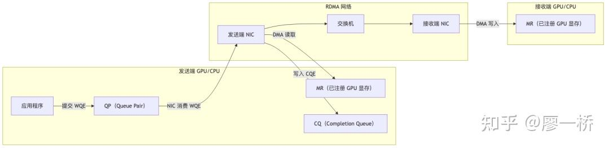
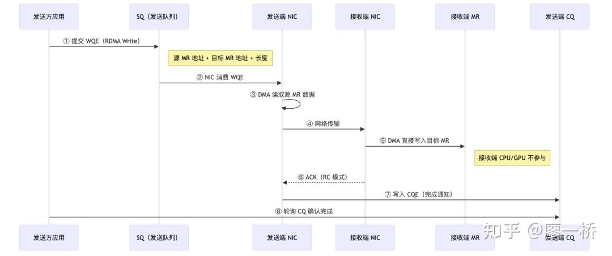
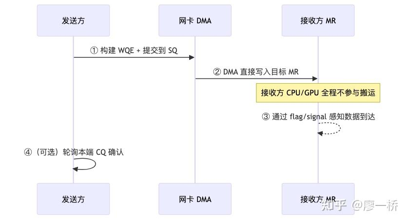
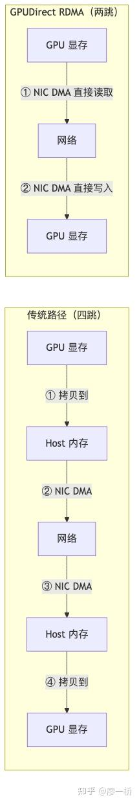

### 可灵AI infra训练团队正在招聘，欢迎投递简历liaoyiqiao@kuaishou.com

### 2.2 RDMA 核心概念

数据搬运这事儿，总得有个"人"去干。如果让 CPU 既当包工头（描述任务）又当搬砖工（亲自干活），那它就被彻底钉死在数据路径上了，传统的 TCP/IP 网络就是这么干的。

RDMA 的核心逻辑，就是把"派活"和"干活"彻底拆开：干活交给专门的搬砖工（[DMA 引擎](https://zhida.zhihu.com/search?content_id=273351217&content_type=Article&match_order=1&q=DMA+%E5%BC%95%E6%93%8E&zhida_source=entity)），派活则交给一套叫 [QP/WQE](https://zhida.zhihu.com/search?content_id=273351217&content_type=Article&match_order=1&q=QP%2FWQE&zhida_source=entity) 的硬件抽象。一句话理解 RDMA 的本质：**用硬件抽象替代软件协议栈，让 DMA 引擎直接搬数据，把 CPU 从搬砖的苦差事里彻底解放出来。**

在展开细节前，先来看看通信方式的全景图：

> **要点**: 先扫「谁搬运、占不占 SM」两列——overlap 能走多远，往往在这张表里已能看出大半。

| 通信方式 | 硬件搬运者 | SM 占用 | 关键资源消耗 |
| ----- | ----- | ----- | ----- |
| SM Load/Store（机内） | SM 的 LSU 单元 | 全程占用指令管线 | Register File、L1/L2 Cache 带宽 |
| TMA（机内/NVLink） | SM 内 TMA 硬件加速器 | 发指令瞬间 | Shared Memory、mbarrier slot |
| Copy Engine（机内/NVLink） | 独立 CE DMA 引擎 | 不占用 | PCIe/NVLink 带宽 |
| RDMA IBRC（机间） | NIC DMA 引擎 | SM 等待 CPU（间接） | CPU 线程、PCIe、QP/WQE 内存 |
| RDMA IBGDA（机间） | NIC DMA 引擎 | SM 构建 WQE + doorbell（短暂） | GPU 显存（WQE/CQ 缓冲）、PCIe |
| NVLS/SHARP（归约） | Switch 内计算单元 | 近零 | 交换机计算资源 |

判断一个搬运方式坑不坑，不能只看它"用没用 SM"，还得看它抢了哪些共享资源。比如 SM 亲自搬数据（Load/Store），会疯狂消耗寄存器和 L1 Cache 带宽，这会直接拖慢旁边正在跑的计算 kernel。

### 2.2.1 为什么需要 RDMA——TCP/IP 的病根是 CPU 卡在数据路径上

TCP/IP 有三大著名的瓶颈：内核态拷贝、CPU 中断处理、协议栈开销。这仨看起来是不同的问题，但追根溯源病根只有一个——**CPU 被迫充当了搬运工**。CPU 既要"描述怎么搬"（协议封装），又要"亲自搬"（内核缓冲区拷贝），还要"随时响应"（中断处理）。控制面和数据面全部压在 CPU 上，这是系统设计里典型的"中间人开销"。

RDMA 是怎么对症下药的呢？

| TCP/IP 瓶颈 | 开销来源 | RDMA 对策 | 实现原理 |
| ----- | ----- | ----- | ----- |
| 内核态拷贝 | 数据 用户态→内核态→网卡，两次拷贝 | Zero-copy | 网卡 DMA 直接从内存读写，不经内核缓冲区 |
| CPU 中断处理 | 每个包到达都触发 CPU 中断 | CPU bypass | 传输过程 CPU 不参与（建连等控制面仍需 CPU） |
| 协议栈开销 | TCP/IP 层层封装/解封装 | Kernel bypass | 用户态通过 verbs API 直接操作网卡 |

这三大绝招的共同硬件基础，就是 **DMA**（Direct Memory Access）——外设不经 CPU，直接在内存之间搬数据。GPU 通信里 DMA 出现在两个层面：

-   **网卡 DMA**：网卡内置 DMA 引擎负责 GPU 显存与网络之间的搬运，是 [GPUDirect RDMA](https://zhida.zhihu.com/search?content_id=273351217&content_type=Article&match_order=1&q=GPUDirect+RDMA&zhida_source=entity) 的底层
-   **Copy Engine DMA**：GPU 内部的 Copy Engine 也是 DMA 引擎，负责 GPU 显存之间（或 GPU 与 Host 之间）的搬运

DMA 的关键特征是**不需要 CPU 或 SM 逐个字节地盯着**——硬件引擎自主完成搬运，发起方只需一条指令描述任务。这是"控制面与数据面分离"的硬件起点。

Zero-copy、CPU bypass、Kernel bypass 不是三个独立特性，而是同一个设计决策的三个投影——**把 CPU 从数据面踢出去**。DMA 是让这一切成立的硬件基础。

### 2.2.2 四大抽象——从"谁来描述搬运任务"推导 QP/WQE/CQ/MR

CPU 退出数据面后，应用程序怎么告诉网卡"搬什么、从哪搬、搬到哪、搬完怎么通知我"呢？这就引出了 RDMA 的四大核心抽象。它们可不是凭空捏造的——**每个抽象都是对一个具体操作需求的精确回应**。

| 概念 | 解决什么问题 | 是什么 | 类比 |
| ----- | ----- | ----- | ----- |
| QP（Queue Pair） | 搬运从哪条通道走？ | 通信通道的最小单元，含发送队列（SQ）和接收队列（RQ）。每对通信 GPU 之间至少一个 QP，QP 数量 = 并行传输上限 | 高速公路车道数 |
| WQE（Work Queue Element） | 搬什么、搬多少？ | 一次搬运任务的描述（源地址、目标地址、长度、操作类型），提交到 QP 的发送队列 | 快递面单 |
| CQ（Completion Queue） | 搬完了怎么知道？ | 网卡完成 WQE 后写入 CQE（完成通知），应用轮询 CQ 感知操作是否完成 | 签收回执 |
| MR（Memory Region） | 网卡可以访问哪里？ | 向网卡注册的可访问内存区域。GPU 场景下就是注册过的显存，网卡 DMA 只能读写已注册的 MR | 报备过的仓库地址 |
| PD（Protection Domain） | 谁有权访问？ | 权限隔离域，限制哪些 QP 可以访问哪些 MR | 门禁系统 |

协同起来的画面是这样的：应用程序把快递面单（WQE）提交给车道（QP），网卡 DMA 去报备过的仓库（MR）里拉数据，走网络发到接收端，对方网卡同样用 DMA 把货卸进对端仓库（MR）。全部搞定后，网卡写个签收回执（CQE）到完成队列（CQ）。

再来看看 RDMA Write 的完整时序（RC 模式）。注意：**数据面全程无 CPU 参与**，CPU 只在初始化时建立 QP 和注册 MR：

  

CQ 里的签收回执什么时候才靠谱？这取决于 QP 的连接类型。在 **RC（Reliable Connection）** 模式下，CQE 意味着接收端 NIC 已确认数据写入了目标 MR——因为发送端 NIC 是收到 ACK 后才写 CQE。这就是 RC 里 "Reliable" 的含义：端到端可靠，包括 DMA 写入完成。而 UD（Unreliable Datagram）模式下没有 ACK，CQE 只表示数据已发出，不保证对端收到。

**QP 的三种连接类型**——资源开销与功能保证的权衡：

| 类型 | 特点 | 适用场景 |
| ----- | ----- | ----- |
| RC（Reliable Connection） | 一对一，保序可靠（类似 TCP） | NCCL 默认、DeepEP Normal |
| UD（Unreliable Datagram） | 一对多，不保序不可靠（类似 UDP） | 低延迟场景、控制面 |
| DC（Dynamically Connected） | 按需建连，减少 QP 资源占用 | 大规模集群，减少连接数 |

**QP 数量是通信并行度的第一层天花板**。每个 QP 都是一条独立传输通道，网卡内部对每个 QP 维护独立的发送队列和状态机。多 QP 并行传输可隐藏流水线延迟——跟 CPU 多线程隐藏内存延迟一个道理。不过 QP 消耗网卡内存和 PCIe 资源，不是越多越好——DeepEP Normal ~10 QP，LL ~8-16 QP 已接近收益天花板。QP 饱和后瓶颈转移到 NIC 处理速率或 PCIe 带宽。

**为什么多 QP 能提升带宽？** 这就好比多线程并行——NIC 处理 WQE 有延迟（取 WQE → 解析 → DMA → 等 ACK），单 QP 吞吐受限于流水线深度。多 QP 让 NIC 在等一个 QP 的 ACK 时处理另一个 QP 的 WQE，三个维度同时受益：

1.  **流水线饱和**：多 QP 填满 NIC 硬件流水线的空闲周期，等待 ACK 的时间被其他 QP 的 DMA 操作覆盖
2.  **路由多样性**：不同 QP 的流量可以走不同网络路径（交换机自适应路由基于 QP 分流），减少单链路拥塞
3.  **消除队头阻塞**：单 QP 的 WQE 按 FIFO 执行，一个大包 WQE 会卡住后面的小包。多 QP 绕过这个问题

实际数据（**特定配置下的实测值**）：DeepEP Normal 从 1 QP → 10 QP，算法带宽从 ~30 GB/s → ~58 GB/s（接近翻倍）。再往上加 QP 收益递减——瓶颈转移到 NIC 硬件处理速率或 PCIe 带宽。

### 2.2.3 单边 vs 双边——控制面参与度决定延迟

单边和双边通信的本质区别在于**接收方是否需要参与控制面**，而非"谁发起"。RDMA Write 让接收方在数据面和控制面都不参与（发送方知道对端 MR 地址即可直写），是控制面分离的极致。

| 模式 | RDMA 操作 | 上层库映射 | 关键区别 |
| ----- | ----- | ----- | ----- |
| 单边 | RDMA Write / Read | NVSHMEM put/get；NCCL RMA API（2.29+ 等版本，视构建与特性开关而定） | 接收方无需显式参与数据面 |
| 双边 | Send / Recv | MPI Send/Recv，NCCL send/recv | 收发双方都需提交对应操作 |

单边通信的不对称性（对应第一章 put/fence/flag 范式）：

  

NVSHMEM 的映射关系：**跨机场景下**，NVSHMEM 的 `nvshmem_put()` 底层就是 RDMA Write（机内则走 NVLink P2P）。Symmetric Memory 的"注册"本质上是 RDMA 的 MR 注册。第一章的 put/fence/flag 三步保证，在 RDMA 层面对应 WQE 提交顺序 + QP 内 FIFO 保序。

### 深入：单边通信的 Ordering 陷阱——为什么"先发 data 再发 flag"没那么简单

第一章 1.3.3 介绍了 put/fence/flag 的基础范式。这里进一步展开：**为什么其他看似合理的方案行不通？**

单边通信的标准流程是"先 put data，再 put flag"，接收端轮询 flag 就绪后消费 data。核心难点在于：**发送顺序 ≠ 到达顺序**——data 有几 MB 走一条 QP，flag 只有几字节可能走另一条 QP，flag 可能比 data 先到，导致接收端读到脏数据。

常见的软件层"修复"都不行：发送端确认发出 ≠ 接收端已收到（网络管道中可能还在路上）；接收端加线程等 data → 退化为双边；buffer 尾放哨兵 → RDMA 不保证 buffer 内部写入顺序。能用的办法必须依赖硬件协议保证：

| 方案 | 原理 | 适用场景 |
| ----- | ----- | ----- |
| 同一 QP 内顺序保证 | RDMA 协议保证同一 QP 上消息按序到达。data 和 flag 走同一 QP，flag 到达时 data 一定已写完 | 最通用，是 NVSHMEM put/fence/flag 的底层依赖 |
| RDMA Write with Immediate Data | 把 flag 附在 data 传输操作上，作为原子操作一起完成，接收端通过 CQ 感知 | 适合需要通知接收端的场景 |
| Fence 操作 | 在 data 和 flag 之间插入 fence 指令，硬件保证 fence 前的所有操作完成后才执行 fence 后的操作 | 不同 QP 间需要保序时 |

ordering 问题的解决**依赖底层硬件和协议保证**，不是靠上层软件逻辑能绕过的。这也是为什么 DeepEP 在遇到自适应路由（AR）导致同 QP 乱序时，必须通过 atomic fence 修复正确性（§2.1.4），代价是每次多一个 RTT。

* * *

### 2.2.4 GPUDirect——数据面分离的第二级：消除 Host 中转

RDMA 解决了 CPU 在协议栈里的中间人开销，但数据如果还要在 Host 内存里中转一下，那就太冤了。传统的路径是 GPU→Host→NIC→网络→NIC→Host→GPU，整整四跳。GPUDirect RDMA 把 NIC DMA 的目标从 Host 内存换成 GPU 显存，砍掉两次 Host 中转，是**搬运代价公式中"搬多远"的优化**。

| 技术 | 能力 | 数据路径 |
| ----- | ----- | ----- |
| GPUDirect P2P | 同一 PCIe 总线下 GPU 间直接访问显存 | GPU ↔ PCIe ↔ GPU（无 NVLink 时） |
| GPUDirect RDMA (GDR) | NIC DMA 直接读写 GPU 显存 | GPU 显存 ↔ PCIe ↔ NIC ↔ 网络 |
| GPUDirect Storage (GDS) | NVMe SSD 直接读写 GPU 显存 | GPU 显存 ↔ PCIe ↔ NVMe |

四跳变两跳，一目了然：

  

Zero-copy 的准确含义：不是不经过网卡，而是绕过 CPU 内存和操作系统缓冲区——数据仍然物理经过 PCIe 总线（PCIe 带宽是上限之一），但中间没有 CPU 参与的内存拷贝。GPU 和 NIC 在同一 PCIe root complex 下时 GDR 最佳；跨 NUMA 节点会引入额外延迟。

* * *

**控制面/数据面分离的三级递进**——从 TCP/IP 到 IBGDA，每一级都是把更多职责从"通用处理器"搬到"专用硬件"：

| 级别 | 谁做控制面 | 谁做数据面 | Host 内存中转？ | 代表技术 |
| ----- | ----- | ----- | ----- | ----- |
| TCP/IP | CPU（协议栈） | CPU（内核拷贝） | 是 | socket |
| RDMA IBRC | CPU（构建 WQE） | NIC DMA | 否（GDR） | NCCL 默认 |
| RDMA IBGDA | GPU SM（构建 WQE） | NIC DMA | 否（GDR） | DeepEP LL |

IBRC 和 IBGDA 的具体差异在 2.4 节展开。

> **本节要点**：

-   网卡直访内存把 CPU 移出数据面
-   QP 与 WQE 把派活和执行交给硬件
-   乱序由网卡与协议保证难靠软绕

* * *

  

**本文是从零开始的通信计算overlap系列的一部份，请见：**

[从零开始的通信计算overlap【第一章】](https://zhuanlan.zhihu.com/p/2011564057396809841)

[从零开始的通信计算overlap【第二章】大模型通信基础 2.1：通信硬件拓扑](https://zhuanlan.zhihu.com/p/2028907020917449344)

[从零开始的通信计算overlap【第二章】大模型通信基础2.2 RDMA 核心概念](https://zhuanlan.zhihu.com/p/2028907599861495146)

[从零开始的通信计算overlap【第二章】大模型通信基础 2.3 机内数据搬运](https://zhuanlan.zhihu.com/p/2028907936030704604)

[从零开始的通信计算overlap【第二章】大模型通信基础 2.4 机间数据搬运](https://zhuanlan.zhihu.com/p/2028908577935336722)