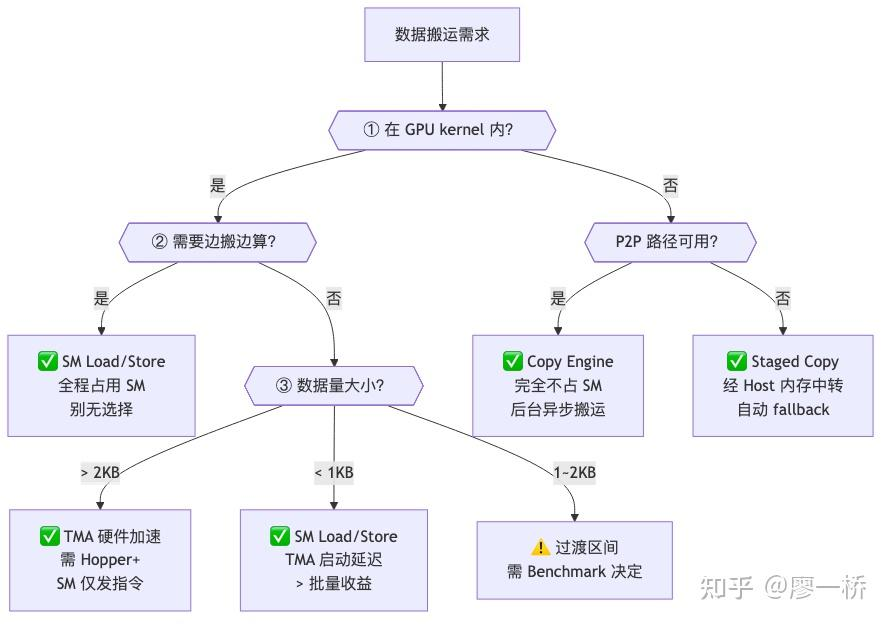
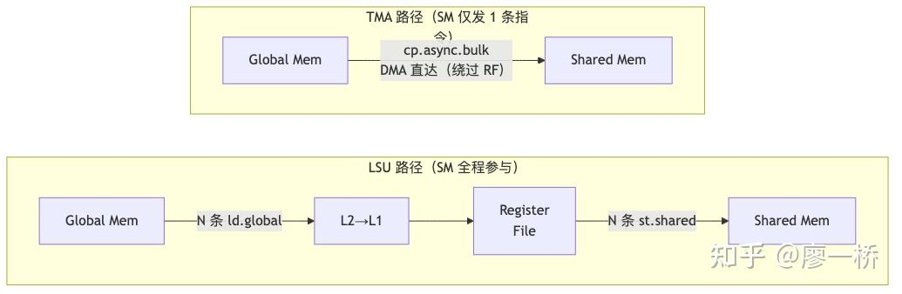
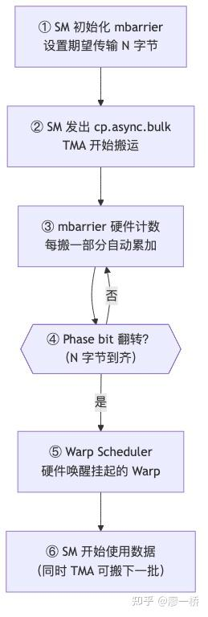

### 可灵AI infra训练团队正在招聘，欢迎投递简历liaoyiqiao@kuaishou.com

### 2.3 机内数据搬运

咱们刚才定了个调：SM 做搬运就不能做计算，这是个零和博弈。所以在 GPU 内部搬数据，核心问题不是"怎么搬更快"，而是**"怎么搬不占 SM"**。

而且搬运这事儿分两步：执行搬运（数据面）和通知搬完（控制面）。很多人只看数据面——"搬运是否占 SM"，忽略了控制面——"同步通知是否占 SM"。**两者都解放了，才是真的 SM-free。**

先把两个维度亮出来：

| 维度 | 问题 | 为什么重要 |
| ----- | ----- | ----- |
| 数据面 | 谁执行搬运动作？ | SM 自己搬 = SM 全程被占；硬件代搬 = SM 释放 |
| 控制面 | 谁负责"搬完了"的通知？ | SM 轮询等结果 = SM 仍被占；硬件通知 = SM 彻底释放 |

2.1 的"不可能三角"（带宽、延迟、SM 占用）在这里展开为四种具体搬运方式——它们各自在三角形的不同位置做取舍。

* * *

### 2.3.1 四种搬运方式：SM 占用的阶梯

四种方式的本质区别就一个问题——**谁做搬运动作？** SM 自己搬、[TMA](https://zhida.zhihu.com/search?content_id=273351248&content_type=Article&match_order=1&q=TMA&zhida_source=entity) 硬件代搬、CE DMA 引擎搬、还是经 Host 中转搬。搬运者不同，SM 被占用的程度形成清晰的阶梯：

| 方式 | 发起方 | 搬运者 | 数据路径 | SM 占用 | 适用场景 |
| ----- | ----- | ----- | ----- | ----- | ----- |
| SM Load/Store | GPU kernel | SM 自己（LSU） | Global → L2 → L1 → Register → SHM，跨 GPU 经 NVLink | 全程占用 | 通信中需要做计算（如 reduce 加法） |
| TMA（Hopper+） | GPU kernel | TMA 硬件加速器 | Global ↔ Shared Memory（绕过 Register File），跨 GPU 经 NVLink | 发指令时短暂占用 | Kernel 内纯搬运，>2KB 时优于 LSU |
| Copy Engine | CPU 侧 | CE 硬件 DMA 引擎 | GPU → NVLink/PCIe P2P → GPU（直达） | 不占用 | Kernel 外异步搬运 |
| Staged Copy | CPU 侧 | CPU + CE | GPU → PCIe → Host → PCIe → GPU | 不占 SM | P2P 不可用时的 fallback |

为什么是这个阶梯？从"搬运必须有人执行"出发推导——

-   **SM L/S**：搬运者就是 SM 自己。这就好比让高级工程师一行行写代码搬砖，N 条指令逐元素搬，数据还要经 Register File 中转。SM 全程被锁定，既不能做别的计算，寄存器也被占用。
-   **TMA**：SM 只需要像发个快递单一样，下 1 条指令描述搬运任务，TMA 硬件自主执行，数据绕过 RF 直达 SHM。SM 做完"下单"就能回去算 GEMM。
-   **CE**：DMA 引擎独立于 SM，整个搬运过程 SM 完全不参与。但 CE 只能在 kernel 外发起，做不了 kernel 内的细粒度搬运。
-   **Staged Copy**：P2P 路径不可达时的兜底——数据先到 Host 再到目标 GPU，延迟高但至少不占 SM。训练集群中基本不出现。

> **为什么 Kernel 内调不了 CE？** CE 由 Host 侧 Command Processor 调度，SM thread 没有权限直接操控；且 CE 的批处理队列模型与 kernel 内实时执行的时序语义不兼容。这是刻意的架构解耦——CE 独立运行才能与计算完全并行。因此 kernel 内只有两个选择：LSU（SM 自己搬，占 SM）和 TMA（H100+ 的硬件 DMA，SM 只发指令）。TMA 可以看作"kernel 内的 CE 替代品"。

**实际训练中谁在用什么**：

| 方式 | 典型使用者 | 场景举例 |
| ----- | ----- | ----- |
| SM Load/Store | NCCL 机内通信（默认） | AllReduce 机内阶段：SM 从远端 GPU Load 数据，做 reduce 加法后写回。必须经过 SM，因为要做计算 |
| TMA | DeepEP Normal 模式 | NVLink 转发：网关 GPU 收到跨机数据后，用 TMA 搬入本地 SHM，再通过 NVLink 写到目标 GPU。SM 只发指令 |
| Copy Engine | FSDP 参数预取 | 计算当前层 GEMM 时，CE 异步预取下一层的权重分片（AllGather），SM 和 CE 完全不争资源 |
| Staged Copy | 跨 PCIe 的消费级 GPU | 无 NVLink 的多 GPU 服务器，数据经 Host 内存中转。训练集群中基本不出现 |

字节 Flux 的 Dense MLP 是个很好的印证。在同一个 MLP 的两层中，因为"搬运 vs 归约"的差异，选择了完全不同的搬运方式：

-   **Layer0（AllGather + GEMM）**：AllGather 是纯搬运 → Flux 在独立 stream 上用 **Copy Engine / NVLink memcpy** 做数据搬运，GEMM 在主 stream 上计算，两者完全不争 SM
-   **Layer1（GEMM + ReduceScatter）**：ReduceScatter 含归约（加法）→ DMA 引擎做不了 → Flux 把 RS 语义**融进 GEMM 的 epilogue**，让 SM 在算完每个 tile 后直接把结果路由写到目标 rank 的 buffer

同一个模型的两层，"谁来搬"的答案截然不同——纯搬运交给 CE（完全不占 SM），含归约只能让 SM 做（但通过融合掩盖延迟）。这正是四种搬运方式选择逻辑的缩影。

激活值卸载（GPU→CPU via PCIe DMA）和梯度检查点（反向时重算）解决同一问题（前向激活值占显存）但机制互补：**卸载换 PCIe 带宽省显存，检查点换算力省显存**。选择取决于张量的重计算成本 vs 搬运成本。

### Activation Offloading 完整策略框架

激活值卸载看似简单（把 GPU 数据搬到 CPU），但要真正打满 DTH（Device-to-Host）带宽，有三个**缺一不可**的必要条件：

| 条件 | 为什么必要 | 错误做法 → 后果 |
| ----- | ----- | ----- |
| ① 异步传输 | 同步传输让 GPU 空等 PCIe 传输完成 | tensor.to('cpu') 阻塞 → GPU 空转 |
| ② Pinned Memory | 普通 pageable 内存可能被 OS swap 到磁盘，GPU DMA 无法直接访问，需要先拷到临时 pinned buffer → 多一次 CPU 侧 memcpy，带宽砍半 | 不 pin → 带宽损失 50%+ |
| ③ NUMA 亲和性 | 多路服务器上 GPU 通过 PCIe 连接到特定 CPU socket，如果 offload 目标内存在远端 NUMA 节点，需跨 QPI/UPI 总线 | 不绑 NUMA → 带宽降低 2-3 倍 |

**Offload 什么、什么时候 offload**：

| 数据类型 | 是否适合 offload | 原因 |
| ----- | ----- | ----- |
| 激活值（activations） | 最适合 | 前向产生、反向才需要，时间窗口大，PP bubble 天然提供 offload/prefetch 时机 |
| 优化器状态 | 适合 | 只在 optimizer.step 时使用，生命周期最长 |
| 梯度 | 较少 offload | 反向产生后很快需要 reduce，时间窗口短 |

**PP 是 offload 的天然搭档**——PP 的 micro-batch 切换点就是 offload/prefetch 的时机：前向的后几个 micro-batch 可以 offload 早期 micro-batch 的激活，反向开始前 prefetch 回来，bubble 时间正好用于数据搬运。无 PP 时需要手动在前向过程中找 offload 时机，与后续层计算 overlap。FSDP 的 prefetch 机制（前向 all-gather 通信窗口）也提供额外的 overlap 机会。

**选择依据**：显存充足 → 不 offload 不重计算；显存紧张 + DTH 带宽高（如 GH200 C2C ~180 GB/s）→ 优先 offload；显存紧张 + DTH 带宽低（如 H100 PCIe ~64 GB/s）→ 优先重计算。两者可组合使用。

**怎么选——三步判断**：

判断链按约束硬度排序：**位置约束最硬**（kernel 外根本用不了 TMA/LSU），**计算需求次之**（有计算就只能走 SM），**数据量最后微调**。

* * *

### 2.3.2 TMA vs LSU：数据面 SM-free 的硬件基础

TMA 和 LSU 都在 SM 内部，但硬件设计根本不同。这个差异就是"低 SM 干扰搬运"的硬件基础。LSU 搬运 SM 逐元素参与——N 条 `ld.global` / `st.shared` 指令逐个搬数据，每个元素都要经过 Register File 中转，SM 全程被锁在指令管线上。TMA 则反过来——SM 只发 1 条 `cp.async.bulk`，TMA 内置的 AGU 自主计算多维张量地址、DMA 直达 Shared Memory（绕过 RF），SM 发完指令就回去算 GEMM。两条路径的数据流对比：

**关键指标对比**：

| 对比维度 | LSU | TMA |
| ----- | ----- | ----- |
| SM 发多少条指令 | N 条（每个元素一条 ld/st） | 1 条（描述整个搬运任务） |
| 地址计算 | SM 算 | TMA 内置 AGU 自己算 |
| 数据路径 | Global → L2 → L1 → Register File → SHM | Global → 直接写入 SHM（绕过 Register File） |
| 执行方式 | 同步——SM 逐条发射 | 异步——SM 发完指令，TMA 自主执行 |

带宽与延迟有个权衡：<1KB 数据 LSU 更快（TMA 有启动延迟），>2KB 数据 TMA 更快（批量搬运优势），1–2KB 为过渡区间。因此 TMA 的"SM-free"不是说 TMA 不在 SM 里，而是搬运这个动作从 SM 的指令管线中**解耦**出来了——SM 只做"下单"（控制面），TMA 做"代搬"（数据面），数据绕过 Register File 直达 SHM。这是控制面/数据面分离在 SM 内部的体现，也是 SM 占用从"全程占用"跳到"近零占用"的硬件基础。

* * *

### 2.3.3 [mbarrier](https://zhida.zhihu.com/search?content_id=273351248&content_type=Article&match_order=1&q=mbarrier&zhida_source=entity)：控制面也要 SM-free

TMA 解决了数据面的问题——硬件代搬，SM 不用逐元素操作。但搬完了怎么通知 SM？如果 SM 还要傻乎乎地一直轮询"搬完没？搬完没？"，控制面的 SM 开销照样存在。

[Hopper 架构](https://zhida.zhihu.com/search?content_id=273351248&content_type=Article&match_order=1&q=Hopper+%E6%9E%B6%E6%9E%84&zhida_source=entity)引入了 mbarrier，这是一个硬件级的同步原语。它的核心设计：**字节级硬件计数 + Phase bit 翻转 + Warp Scheduler 硬件唤醒**——SM 不需要持续轮询，搬完了硬件自动唤醒等待中的 Warp。

TMA + mbarrier 协同流程：

| 特性 | 说明 |
| ----- | ----- |
| 硬件级通知 | 不是软件轮询，而是 Warp Scheduler 硬件级挂起/唤醒 |
| Warp 粒度 | 最细粒度是 Warp 级挂起，Scheduler 调度其他 ready warp |
| 字节级计数 | 不再是整个 kernel 粒度，可以做细粒度 overlap |
| Phase bit | 翻转机制通知数据到齐，避免 ABA 问题——mbarrier 每完成一阶段后计数器会重置为期望值用于下一轮，等待方仅凭计数器值无法区分当前阶段与下一阶段（两阶段计数器必然经过同一值域），可能误判为"还是旧状态"而丢失通知；Phase bit 每轮 0↔1 翻转，作为显式的阶段版本号， mbarrier.try_wait.parity 直接比对 phase bit，天然区分相邻批次 |

实际使用中，Shared Memory 通常需要 **ping-pong 双缓冲**——一块供计算读取（Buffer A），一块供 TMA 写入（Buffer B），通过 mbarrier 在两者之间切换。计算读 A 时 TMA 写 B，mbarrier 翻转后角色互换，实现搬运与计算的持续流水。

* * *

### 2.3.4 三代演进：从 CPU 控制到"数据面+控制面双 SM-free"

把前面的逻辑串起来，GPU 通信的同步机制经历了三代演进。每一代解放了一个维度的 SM 占用： 下表把三代机制直接对齐到「同步放哪、谁醒谁睡」。

| 演进阶段 | 同步位置 | 延迟 | SM 参与 | 粒度 |
| ----- | ----- | ----- | ----- | ----- |
| 经典 memcpy | CPU | 高 | 不占 GPU SM | 整个传输 |
| CE + flag | Global Memory | 较高 | SM 轮询 / CPU 介入 | Kernel 级 |
| TMA + mbarrier | Shared Memory | 低 | 硬件挂起/唤醒 | 字节级 |

CE 模式虽然"数据面 SM-free"了，但 SM 仍需轮询 Global Memory 里的 flag 来判断数据到没到——控制面的 SM 开销仍然存在。TMA + mbarrier 的贡献在于——**数据面交给 TMA 硬件，控制面交给 mbarrier 硬件，两者同时从 SM 指令管线中解耦出来**。§2.2 把 CPU 从数据面踢出去，这里把 SM 也从数据面和控制面同时解放，是 Hopper 架构在通信上的真正里程碑。

三代演进不只是纸面概念——它直接决定了同一个算子在不同架构上的实现方式。字节 Flux 的 GEMM+ReduceScatter 融合就是个典型案例：

-   **Ampere（SM80）**：每 SM 跑多个 threadblock → 把 RS 的远端写入直接塞进 GEMM 的 epilogue。某个 block 在 epilogue 里做长延迟远端 I/O 时，**调度器切到同 SM 上的其他 block 继续算**，延迟被"多 block 并行"自然掩盖
-   **Hopper（SM90）**：每 SM 只有一个 persistent warp-specialized threadblock，TMA（Producer Warp）与 MMA（Consumer Warp）形成高效异步流水线。如果此时再把长延迟远端 I/O 塞进 epilogue，**没有其他 block 可调度**，就会在 TMA+MMA 流水线里打出 bubble → Flux 被迫把 RS 拆成**独立的 TMA DMA 流水线**，与主计算流水线并行

SM-free 能力越强的架构，对"在 kernel 内融合通信"的约束反而越紧——正因为 Hopper 的计算流水线高度异步且紧凑，插入任何不属于 TMA/MMA 的长延迟操作都会成为 bubble。架构越先进，融合策略越需要重新设计。

* * *

### 2.3.5 通算重叠的真相：SM 竞争与 k 倍率

上面讲的是"单次搬运"的 SM 代价。实际训练中，通信和计算要同时跑（overlap），这时候 SM 竞争问题就从"占不占"升级为"占多少、争多狠"。

**竞争的来源**

通算重叠场景下，计算和通信 kernel 在多个层级上争抢资源：

| 竞争资源 | 影响机制 | 严重程度 |
| ----- | ----- | ----- |
| SM 数量 | 计算和通信 kernel 各占一部分 SM，互相挤压可用 SM 数 | 直接影响，可通过限制通信 CTA 数量控制 |
| Register File | SM 内寄存器被通信 warp 占用，降低计算 warp 的占用率（occupancy） | 中等——通信 warp 通常寄存器需求不高 |
| L2 Cache 带宽 | 通信搬运数据经 L2，与计算的访存流量竞争 L2 带宽 | 取决于计算 kernel 的 L2 命中率和通信数据量 |
| Memory Controller | 通信大量读写 HBM 时，与计算 kernel 竞争 HBM 带宽 | 计算为 compute-bound 时影响小，memory-bound 时影响大 |
| Warp Scheduler | 同一 SM 上计算和通信的 warp 交替调度，增加调度压力 | 通常影响较小 |

**竞争倍率的量化**

通信与计算同时执行时，通信耗时相比独占执行会增加一个倍率 $k$（SM 资源竞争导致的乘性膨胀系数，不要与 §2.1 统一框架 $t = \\\\alpha + S/\\\\beta$ 中的启动延迟 $\\\\alpha$ 混淆）：

$$t*{comm\_overlap} = t*{comm\_solo} \\\\times k$$

$k$ 的大小取决于几个因素：

| 因素 | 影响方向 | 说明 |
| ----- | ----- | ----- |
| 计算 kernel 的 SM 占用率 | k 越大 | 计算占用的 SM 越多，留给通信的越少 |
| 计算 kernel 的访存模式 | k 越大 | memory-bound 计算与通信争抢 HBM/L2 带宽 |
| 通信 CTA 数量 | 反向——通信 CTA 越多，k 对通信越小但对计算影响越大 | 本质是 SM 分配的 tradeoff |
| 通信数据量 | 影响竞争持续时间 | 数据量大时竞争窗口长 |

小规模集群上通过 torch-tests 测得，计算对通信耗时的竞争倍率 k ≈ 1.1+（即通信耗时增加 10% 以上）。GEMM（compute-bound）影响较小，Attention（memory-bound）影响较大。

字节 Flux 在这方面也有个很实用的设计： `sm_margin` 参数。k 倍率的工程对策不只是 NCCL 的 Channel 数量。Flux 在 GEMM+通信融合算子中暴露了 `sm_margin` 参数，允许用户**直接指定为通信预留多少 SM**，剩余 SM 全部给 GEMM 计算。这比 NCCL 层面调 Channel 更精确——Channel 控制的是"通信开几条车道"， `sm_margin` 控制的是"算子内部计算和通信的 SM 切分比例"。本质都是通算零和博弈的不同粒度实现：NCCL Channel 是 kernel 间的粗粒度分配， `sm_margin` 是单个融合 kernel 内的细粒度分配。

**SM-Free 通信：消除竞争的根本方向**

k 倍率的根本解法是让通信**完全不使用 SM**。各种方案在消除 SM 竞争上各有定位：

| 方案 | SM 竞争消除程度 | 适用范围 | 限制 |
| ----- | ----- | ----- | ----- |
| Copy Engine 搬运 | 完全消除 | kernel 外的纯搬运（AllGather 等） | 不能用于 kernel 内、不能做归约计算 |
| CE Collectives（NCCL v2.28+） | 完全消除 | (MN)NVL 域内的 AlltoAll/Gather/Scatter | 需要对称窗口注册 |
| TMA + mbarrier | 数据面+控制面均大幅降低 | kernel 内搬运 | 需要 Hopper+ 架构 |
| SM-Free AllGather（研发中） | 完全消除 | 跨机 AllGather | 依赖网络组自研 NCCL Kernel |
| 限制通信 channel 数（ NCCL_MAX_NCHANNELS） | 降低竞争程度 | 通用 | 通信带宽相应下降，需找平衡点 |

SM-Free AllGather 的目标是将机间 AllGather 完全卸载到 NIC DMA + Copy Engine 路径——当前开源 NCCL 的 AllGather 仍使用 SM kernel。消除 SM 竞争后 overlap 收益不再受 k 倍率折扣，对 FSDP 训练中 AllGather 与前向计算的重叠尤为关键。

训练实践中还有更细粒度的拆分方式。比如 Megatron 在启用 `overlap_moe_expert_parallel_comm` 时，将 Transformer 层拆成 5 个独立 callable：

1.  Attention
2.  Post-Attention
3.  MoE Dispatch（A2A 通信）
4.  MoE Experts
5.  MoE Combine（A2A 通信）

分配到不同 CUDA stream 后，当前 micro-batch 的 Dispatch 通信可与上一个 micro-batch 的 Expert 计算重叠。为此 1F1B 调度额外多一个 warmup 前向，确保前向/反向之间有足够的通信窗口。这种**层内细粒度拆分**比层级 overlap 更精细——缩短通信窗口可降低 SM 竞争倍率 k 的影响。

DeepEP 还提供了两种 SM 管控思路：

**思路一：显式 SM 配额**。DeepEP Normal 模式的 `Buffer.set_num_sms(n)` 直接声明"通信 kernel 最多用 n 个 SM"，内部按 `num_channels=n/2` 分配通信通道数。与 NCCL 的 `NCCL_MAX_NCHANNELS` 思路一致，但粒度更直接——不是通过 channel 数间接控制 SM，而是直接设定 SM 上限。用户可以根据当前 GEMM 是 compute-bound 还是 memory-bound 来调整：compute-bound 时给通信多留几个 SM（反正计算打不满），memory-bound 时尽量少给。

**思路二：时间分阶段——LL 模式的 send/recv Hook**。LL 模式把一次通信拆成两个可独立调度的阶段：

-   **Send Phase**：SM 构建 WQE、发起 RDMA 发送，随即返回——SM 被释放
-   **（网络传输在后台进行，不占 SM）**
-   **Recv Phase**：在用户指定时刻调用 `recv_hook`，完成接收侧处理

这个设计的价值在推理的**双 batch 流水线**中尤为明显：batch A 发出 dispatch 后 SM 立即转去做 batch B 的 expert GEMM，等 GEMM 结束再调 batch A 的 recv hook 拉齐数据。RDMA 传输和 GEMM 在时间上完全重叠，且重叠期间 SM 竞争为零——不是靠"少用 SM 做通信"（降低 α），而是靠"通信和计算在时间上完全不重叠地使用 SM"（消灭竞争窗口）。

* * *

### 2.3.6 IPC Handle：跨进程显存共享

前面讲的搬运方式都假设"能直接访问对方的显存"。但 GPU 训练通常是多进程的（每个进程管一块 GPU），进程间的显存地址空间是隔离的。IPC Handle 就是打通这层隔离的机制。

| 概念 | 说明 |
| ----- | ----- |
| IPC Handle | GPU 显存的跨进程句柄。一个进程分配的 GPU 显存，通过 IPC Handle 序列化后传给另一个进程，对方可以直接访问这块显存 |
| 工作流程 | 进程 A 调用 cudaIpcGetMemHandle() 获取 Handle → 通过 IPC 机制传给进程 B → 进程 B 调用 cudaIpcOpenMemHandle() 映射到本地地址空间 |

**两种管理策略**：

| 维度 | 频繁创建/销毁 | 持久化复用（推荐） |
| ----- | ----- | ----- |
| Handle 生命周期 | 每次通信时申请，用后释放 | 初始化时创建，长期持有 |
| 序列化开销 | 每次都需序列化/反序列化 | 仅首次序列化，后续直接使用 |
| 适用场景 | 临时性、低频通信 | 推理阶段高频更新等持续通信场景 |

这和前面提到的 [Symmetric Memory](https://zhida.zhihu.com/search?content_id=273351248&content_type=Article&match_order=1&q=Symmetric+Memory&zhida_source=entity) 是什么关系呢？IPC Handle 是手动一对一发通行证，Symmetric Memory（NVSHMEM）则在初始化时就建立了全局统一的地址空间——本质是"批量化的 IPC Handle + 统一地址空间"，所有 GPU 可以直接用全局地址访问任意 GPU 的显存。高频场景优先考虑 Symmetric Memory。

DeepEP 的 Buffer 对象就是两者并存的典型：

-   **NVLink 侧缓冲区**通过 CUDA IPC Handle 在同一节点的 8 个进程间共享——每个进程分配 GPU 显存，通过 IPC Handle 让其他 7 个进程直接访问，实现 NVLink P2P 读写。
-   **RDMA 侧缓冲区**通过 NVSHMEM Symmetric Memory 注册——所有节点的 RDMA 缓冲区拥有统一的对称地址空间，任意节点可通过 `nvshmem_put` 直接写入远端。

两种机制在同一 Buffer 内并存：NVLink 侧管机内（900 GB/s），RDMA 侧管跨机（~50 GB/s）；按目的地选用对应缓冲区即可。

* * *

> **本节要点**：

-   搬运与计算争 SM 目标尽量少占 SM
-   TMA 卸数据面 mbarrier 卸控制面
-   通算 overlap 仍有 k 倍率资源竞争

* * *

  

**本文是从零开始的通信计算overlap系列的一部份，请见：**

[从零开始的通信计算overlap【第一章】](https://zhuanlan.zhihu.com/p/2011564057396809841)

[从零开始的通信计算overlap【第二章】大模型通信基础 2.1：通信硬件拓扑](https://zhuanlan.zhihu.com/p/2028907020917449344)

[从零开始的通信计算overlap【第二章】大模型通信基础2.2 RDMA 核心概念](https://zhuanlan.zhihu.com/p/2028907599861495146)

[从零开始的通信计算overlap【第二章】大模型通信基础 2.3 机内数据搬运](https://zhuanlan.zhihu.com/p/2028907936030704604)

[从零开始的通信计算overlap【第二章】大模型通信基础 2.4 机间数据搬运](https://zhuanlan.zhihu.com/p/2028908577935336722)