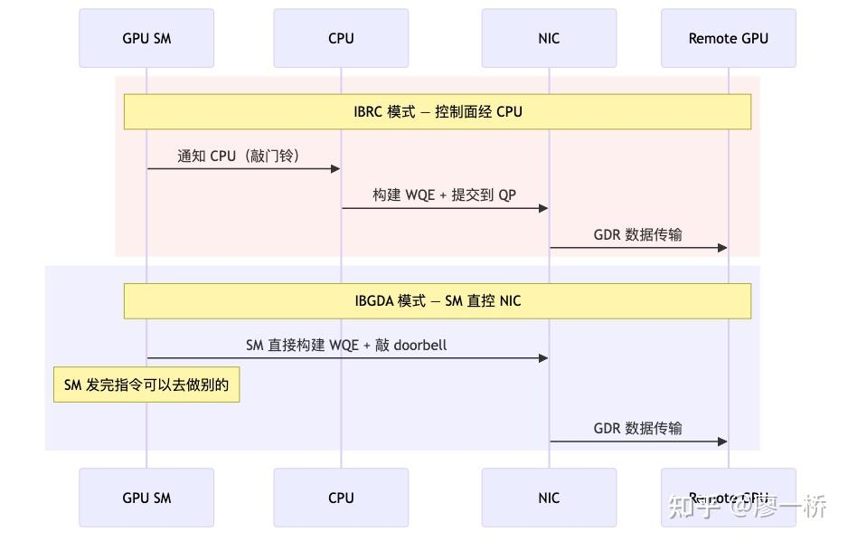
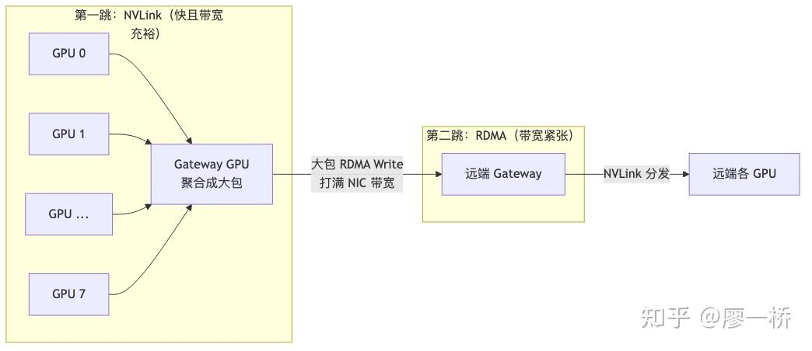

### 2.4 机间数据搬运

机间段里带宽、延迟与可靠性挑战比机内高一档。[GPUDirect RDMA](https://zhida.zhihu.com/search?content_id=273351323&content_type=Article&match_order=1&q=GPUDirect+RDMA&zhida_source=entity) 统一了数据面（GPU 显存 → NIC DMA → 远端），不同方案的性能差异来自两个正交维度：

-   **控制面方案**：谁来构建 WQE、敲 doorbell——CPU（[IBRC](https://zhida.zhihu.com/search?content_id=273351323&content_type=Article&match_order=1&q=IBRC&zhida_source=entity)）还是 SM（IBGDA）？大包场景控制面开销被带宽掩盖，CPU 更稳定；小包场景控制面延迟成瓶颈，必须绕过 CPU。
-   **路径策略**：数据出机前是否先经 [NVLink](https://zhida.zhihu.com/search?content_id=273351323&content_type=Article&match_order=1&q=NVLink&zhida_source=entity) 聚合？动机来自 **§2.1.6**；极小消息下多一跳 NVLink 的延迟可能压过聚合收益（详见本节 2.4.2）。

两个维度正交——[DeepEP Normal](https://zhida.zhihu.com/search?content_id=273351323&content_type=Article&match_order=1&q=DeepEP+Normal&zhida_source=entity)（IBRC/IBGDA + 两跳聚合）和 LL（IBGDA + 一跳直达）覆盖了典型场景。

* * *

### 2.4.1 控制面方案：IBRC vs IBGDA

### 数据面统一之后，性能差异全在控制面

GPUDirect RDMA 统一了数据面——不管用什么方案，数据始终是从 GPU 显存直出到网卡。但发起一次 RDMA 操作需要两步：**构建 WQE**（Work Queue Element，描述"搬什么、从哪到哪"的指令）+ **敲 NIC 的 doorbell**（通知网卡干活）。这两步在 2.2 节讲 QP 时已经介绍过——现在的问题是：这两步由谁来做？

答案只有两个：

-   **IBRC（IB Reliable Connection）**——CPU 来做。SM 先通知 CPU → CPU 在 Host 内存构建 WQE → CPU 提交到 NIC 的 QP。数据面走 GDR，但控制面多绕了一趟 PCIe。
-   **IBGDA（IB GPU Direct Async）**——SM 自己做。SM 直接在 GPU 显存中构建 WQE → SM 敲 NIC doorbell（通过 BAR 空间直接映射）。控制面和数据面都在 GPU 侧完成，绕过了 CPU 主导的 host 控制路径（doorbell/WQE 仍经 PCIe BAR 与 NIC 交互）。

换个角度看：IBRC 是"描述任务和执行任务分属不同硬件——CPU 描述、NIC 执行"，IBGDA 是"都在 GPU 侧——SM 描述、NIC 执行"。

### 工作流程对比

控制路径的差异一目了然：IBRC 走 `SM→PCIe→CPU→PCIe→NIC`，IBGDA 走 `SM→NIC`。IBGDA 砍掉了两趟 PCIe 和 CPU 调度开销。

### 多维度对比

| 维度 | IBRC | IBGDA |
| ----- | ----- | ----- |
| 控制面路径 | CPU 构建 WQE → 提交到 NIC | SM 在 GPU 显存构建 WQE → 敲 NIC doorbell |
| WQE/CQ 位置 | CPU Host 内存 | GPU 显存 |
| 控制面瓶颈 | PCIe 延迟 + CPU 调度延迟 | 消除 PCIe 控制面延迟 |
| SM 占用 | SM 自旋等待 CPU 完成 | SM 快速构建 WQE + 敲 doorbell 后释放 |
| 并发天花板 | 受 CPU 线程数限制 | 多 SM 可并发敲 doorbell（如 96 SM 并发） |
| 适用场景 | 大包、带宽敏感（NCCL 默认） | 小包延迟敏感 + 大包多 QP 并发 |

IBGDA 并非全面优于 IBRC。大包场景下延迟优势被带宽瓶颈淹没，IBRC 的 CPU 构建 WQE 吞吐完全够用且稳定性更好。只有当 per-message 延迟成为瓶颈（小包）或需多 QP 并发打满 NIC 带宽时，IBGDA 的优势才体现。

### 生态选择现状

| 使用者 | 协议选择 | 场景 |
| ----- | ----- | ----- |
| NCCL（默认） | IBRC | AllReduce / AllGather 等集合通信 |
| DeepEP Normal | IBRC 或较新版本中的 IBGDA + Multi-QP | 大 batch 的 MoE All-to-All |
| DeepEP LL | IBGDA | Decode 推理，大量小消息 |

DeepEP Normal 的后端有**版本演进特征**：早期多为 IBRC，较新实现可见 IBGDA + Multi-QP 方向。 `44GB/s→58GB/s` 等数字应理解为**特定实现上的 benchmark（特定配置下的实测值）**，不是通用常数。

### 实战陷阱：Put+Signal Blocking 退化——"单边通信"可能是假的

**场景**：使用 Put Data + Put Signal 模式实现单边通信时，在 put data 和 put signal 之间插入了 blocking wait（等待对端确认数据已收到）。

**陷阱**：一旦发送方在发完 data 后等待对端的某种响应（显式 ACK 或隐式的"资源就绪"信号）才继续发 signal，通信模式就从单边退化为双边——**双方在互相协调节奏**，延迟特征变为请求-应答模式，往返延迟翻倍。

**判断标准**：单边通信的核心是 fire-and-forget。如果发送方需要等待对端的任何形式的响应才能继续发送下一步，那本质上就已经是双边通信了。

**正确做法**：利用 RDMA 协议层的保序机制保证 data 先于 flag 到达——① 让 data 和 flag 走同一个 QP（RDMA 协议保证同 QP 内接收顺序与发送顺序一致）；② 使用 RDMA Write with Immediate Data 将 flag 附在 data 传输操作上原子完成；③ 在 data 和 flag 之间插入 fence 指令（而非 blocking barrier），确保 data 全部到达后才发 flag。这三种方式都不需要对端参与，保持了真正的单边语义。

**量化影响**：blocking 等待引入的额外 RTT（典型值 ~5-10μs/跨机）在 MoE 推理 decode 场景（per-token 通信仅几 KB）中可占通信总时间的 30-50%，直接拉高 TPOT。

DeepEP 主路径使用手工优化的 LD/ST PTX 指令（ `ld.global.nc.L1::no_allocate.L2::256B`）而非 TMA——TMA 适配在 Roadmap 中，目前仅 Intranode kernel 完成，Internode/LL kernel 仍用 LD/ST（可通过 `DISABLE_AGGRESSIVE_PTX_INSTRS=1` 禁用激进 LD/ST）。

核心教训：越贴近硬件微架构的优化越需要多型号验证；绕过通信库直操 RDMA 时应用层流控必须自行实现。

* * *

### 2.4.2 路径策略：两跳聚合 vs 一跳直达

### 路径选择与带宽阶梯

§2.1.6 已给出 NVLink 与单 NIC 的恒定带宽阶梯及「便宜/贵」互联的经济学直觉；本节把它落实为可实现的拓扑与 kernel 策略（两跳聚合 / 一跳直达），下文用流程图与 MoE 量化表展开。

### 两跳聚合的工作方式

先用 NVLink 在机内汇聚到 Gateway GPU，再由 Gateway 通过 NIC 发大包。一跳直达则反过来——每张 GPU 各自通过 NIC 直接发小包给远端。

### 对比

| 维度 | 两跳聚合 | 一跳直达 |
| ----- | ----- | ----- |
| NVLink | 充分利用——聚合步骤用满带宽 | 未使用——直接走 NIC |
| NIC | 高效——少量大包，接近 100% 利用率 | 低效——大量小包，per-packet 开销大 |
| 网络连接数 | 少——Gateway 间互联 | 多——GPU 全互联，cross-rail 流量大 |
| 延迟 | 较高（多一跳 NVLink 延迟） | 较低（直达） |
| 使用者 | DeepEP Normal（训练） | DeepEP LL（推理 decode） |

设计哲学很直白：如果所有 GPU 各自通过 NIC 发小包——NIC 带宽被多路分摊，交换机 incast 拥塞，NVLink 完全闲置。两跳聚合用 NVLink（便宜）做预处理，让 NIC（贵）只干发大包这一件事——**花 1 份 NVLink 代价，省 N 份 NIC 代价**。

### 量化分析：MoE 训练中两跳 vs 一跳的实际效果

以 **[DeepSeek-V3](https://zhida.zhihu.com/search?content_id=273351323&content_type=Article&match_order=1&q=DeepSeek-V3&zhida_source=entity) 风格 MoE、EP=64（8 台 × 8 GPU）、每层 token dispatch** 为例：

**场景设定**：每个 GPU 有 512 个 token 分发给 64 个 expert，hidden\_size=7168、bf16（2 字节），每 GPU 总发送量 ≈ 512 × 7168 × 2B = **7 MB**。

| 维度 | 一跳直达 | 两跳聚合 |
| ----- | ----- | ----- |
| NIC 上的包数 | 每 GPU 向 56 个远端 GPU 各发 1 包 → 56 包/GPU（同机 7 个走 NVLink，1 个是自身） | 每 Gateway 向 7 个远端 Gateway 各发 1 包 → 7 包/GW |
| 平均包大小 | 7MB×(56/64) ÷ 56 ≈ 109 KB（小包） | 7MB×8×(56/64)÷7 ≈ 7 MB（大包） |
| NIC 利用率 | 小包 per-packet 开销高，典型量级约 20-30 GB/s（特定配置下的实测值） | 大包接近峰值 ~45-50 GB/s（特定配置下的实测值） |
| NVLink 开销 | 0 | 8 GPU 聚合 ≈ 56MB ÷ 900GB/s ≈ 0.06 ms（理论估算） |
| RDMA 开销 | 6.1MB ÷ 20GB/s ≈ 0.31 ms（56 路 incast 可能更高；理论估算） | 49MB ÷ 50GB/s ≈ 0.98 ms（无 incast；理论估算） |
| cross-rail 流量 | 大量——每 GPU 向 7 个不同编号 GPU 发包 | 少量——Gateway 对号通信（rail-parallel 友好） |
| 交换机拥塞 | 严重——56 路源同时向同一端口发数据 | 轻微——Gateway 数量少，流量分散 |

**读这张表的关键**：上面的 0.06/0.31/0.98 ms 是 NVLink 聚合与 RDMA 各阶段的 sequential 估算；DeepEP Normal kernel 实际以 **NVLink/RDMA 并发 forwarding**（见下节 Warp 角色分配）运行，wall-clock 接近 max(T*NVL, T*RDMA) 而非两者相加——官方 EP64 normal-kernel algorithmic bandwidth ~51 GB/s。两跳聚合的价值不在"单次通信更快"，而在三点结构性改善：① NIC 包从 56×109KB 变成 7×7MB，per-GPU NIC 利用率从 20 GB/s 量级提升到 50 GB/s 量级；② cross-rail 流量大幅减少（Gateway 对号通信可完全走 rail-parallel）；③ 大幅降低 56 路 incast 概率。训练场景下通信可被计算 overlap，决定 step 时间的是"通信是否足够高效地被塞进 overlap 窗口"，而非孤立通信绝对时长。

### 两跳聚合在 kernel 内部的实现哲学——Warp 级角色分配

上面的流程图展示了两跳聚合的宏观数据流。一个自然的问题是：Gateway GPU 同时要做 NVLink 接收（从本节点其他 GPU 收数据）、RDMA 发送（向远端 Gateway 发大包）、RDMA 接收（从远端 Gateway 收数据）、NVLink 转发（把收到的跨机数据分发给本节点各 GPU）——这些操作如果拆成独立 kernel 串行执行，光 kernel launch 和同步的开销就会吃掉低延迟优势。

DeepEP 的做法是**在一个 kernel 内部，按 Warp 粒度分配五种角色**。一个通信 kernel 启动后，不是所有 Warp 做同一件事，而是：

| Warp 角色 | 职责 | SM 分配规则 |
| ----- | ----- | ----- |
| RDMA+NVL Forwarder | 从 RDMA 收到跨机数据后，通过 NVLink 转发到目标 GPU | 偶数 SM |
| NVL Receiver | 接收本节点其他 GPU 通过 NVLink 发来的本地数据 | 奇数 SM |
| RDMA Sender | 将聚合后的数据通过 RDMA 发往远端 Gateway | 奇数 SM |
| NVL Sender | 将本地数据通过 NVLink 发给 Gateway | 由源 GPU 执行 |
| Local Handler | 处理目标就在本 GPU 的 token（不需网络传输） | 按需 |

偶数 SM 负责转发（RDMA→NVLink 方向），奇数 SM 负责接收（NVLink→本地方向），channel 数 = SM 数 / 2。

原因是**不同 Warp 同时利用 NVLink 和 RDMA 两种独立硬件通道，它们之间物理上不竞争**（NVLink 走 NVSwitch，RDMA 走 NIC + PCIe，是两套独立的 DMA 路径）。如果所有 Warp 都做 RDMA，NVLink 通道就闲置了；如果全做 NVLink 转发，RDMA 就没人发。Warp 级角色分配让一个 kernel 同时驱动两种硬件通道，最大化带宽利用。这也是为什么 DeepEP 把 SM 数做成可调参数（ `set_num_sms`）——SM 越多，每种角色分到的 Warp 越多，两种通道的吞吐都更高，但留给计算的 SM 就更少。

### 何时不用两跳聚合？

推理 Decode 阶段（DeepEP LL 模式）是明确的例外。Decode 时每个 expert 可能只收到 1-2 个 token，每个 token 几 KB。此时两跳多出的 NVLink 一跳延迟（~1μs）绝对值虽小，但 Decode 总通信量也极小——**延迟而非带宽是瓶颈**。多 1μs 就是多 1μs 的 TPOT（Time Per Output Token），直接影响用户体感。LL 模式选择一跳直达，宁可 NIC 利用率低也要最低延迟。

**不同并行维度的通信交叉影响**也值得注意。FSDP 的 AllGather 和 EP 的 AllToAll 若在时间上重叠，会在 NIC 或 PCIe 上产生资源竞争。VeOmni 的解法是让 EP 模块和非 EP 模块使用**两套独立的 DeviceMesh**，从通信域层面将两种流量隔离。

> **本节要点**：

-   GDR 统一数据面差异在谁构建 WQE
-   两跳聚合省 NIC 一跳直达换低延迟
-   分角色 Warp 可同时吃满 NVLink 与网卡

* * *

  

**本文是从零开始的通信计算overlap系列的一部份，请见：**

[从零开始的通信计算overlap【第一章】](https://zhuanlan.zhihu.com/p/2011564057396809841)

[从零开始的通信计算overlap【第二章】大模型通信基础 2.1：通信硬件拓扑](https://zhuanlan.zhihu.com/p/2028907020917449344)

[从零开始的通信计算overlap【第二章】大模型通信基础2.2 RDMA 核心概念](https://zhuanlan.zhihu.com/p/2028907599861495146)

[从零开始的通信计算overlap【第二章】大模型通信基础 2.3 机内数据搬运](https://zhuanlan.zhihu.com/p/2028907936030704604)

[从零开始的通信计算overlap【第二章】大模型通信基础 2.4 机间数据搬运](https://zhuanlan.zhihu.com/p/2028908577935336722)