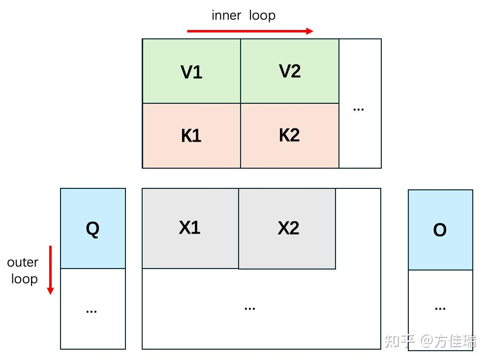

# FlashAttention 算法之美：极简推导版

FlashAttention（FA）是大模型训练和推理性能优化最重要的组件。从并行计算角度，FA 的算法设计是可以写进教科书的。通过利用简单数学知识，等价变换任务的计算流程，从而将算法并行执行起来，实现最佳的内存效率，这无疑是并行计算 PhD 心中最完美的 idea。

FA 的算法流程也以复杂著称，原始论文中的公式包含纷繁的变量和复杂的计算流程图，让普通读者很难理解。FA 也有很多非官方解读版本，比如 Zihao Ye 的《[From Online Softmax to FlashAttention](https://link.zhihu.com/?target=https%3A//courses.cs.washington.edu/courses/cse599m/23sp/notes/flashattn.pdf)》（2023 年 5 月作为 UW 研究生作业发布）。Ye 从 FA 的演化历史入手，囊括了完备的前置知识，让读者只读这一篇就能理解 FA。但是 Ye 的版本力求完整严谨，普通读者很难一遍读懂，需要反复揣摩。Zhihao Ye 也是 [FlashInfer](https://link.zhihu.com/?target=https%3A//github.com/flashinfer-ai/flashinfer) 的作者。

去年此时，FA v2刚刚更新，我写过文章分析过FA的历史和现状。最近工作需要用到FA的细节，于是又重新看了一下FA的论文。

相关文章：[方佳瑞：大模型训练加速之 FlashAttention 系列——爆款工作背后的产品观](https://zhuanlan.zhihu.com/p/664061672)

这里给出我自己的极简推导版本，平时可以作为阅读代码时的小抄。也希望它能帮助读者理解 FA 的算法之美。本文尽量避免复杂的数学符号，只需要基本的线性代数知识即可。如有纰漏，也希望大家指正。

## 一、前置知识

### 1. 矩阵乘法分块

对于三矩阵连续乘法

$$
O = QK^\top V,
$$

可以采用分块方式避免物化完整的 $QK^\top$。但是加入 Softmax 后，不同分块之间会通过全局最大值和归一化分母相互依赖，不能直接独立计算。

### 2. 数值稳定的 Softmax

$$
\operatorname{softmax}(x)_i
=
\frac{\exp(x_i-m)}
{\sum_j \exp(x_j-m)},
\qquad
m=\max_j x_j.
$$

减去最大值不会改变 Softmax 的结果，但能避免指数运算上溢。

### 3. 指数与对数的运算性质

$$
\exp(a+b)=\exp(a)\exp(b),
$$

因此

$$
\exp(x-m_2)
=
\exp(x-m_1)\exp(m_1-m_2).
$$

此外，

$$
\log(ab)=\log a+\log b,
\qquad
\log\frac{a}{b}=\log a-\log b.
$$

### 4. 分块矩阵乘法

$$
\begin{bmatrix}A_1 & A_2\end{bmatrix}
\begin{bmatrix}V_1\\V_2\end{bmatrix}
=
A_1V_1+A_2V_2.
$$

## 二、目标

将 $K$ 和 $V$ 沿序列维分成两个块：

$$
K=
\begin{bmatrix}K_1\\K_2\end{bmatrix},
\qquad
V=
\begin{bmatrix}V_1\\V_2\end{bmatrix}.
$$

目标是计算

$$
\begin{aligned}
O
&=\operatorname{softmax}(QK^\top)V\\
&=\operatorname{softmax}
\left(
\begin{bmatrix}
QK_1^\top & QK_2^\top
\end{bmatrix}
\right)
\begin{bmatrix}V_1\\V_2\end{bmatrix}.
\end{aligned}
$$

理解下面两个 $K/V$ 分块的计算，就可以自然扩展到更多分块。对 $Q$ 分块形成外层循环，对 $K/V$ 分块形成内层循环。

*图：$Q$ 使用外层循环，$K/V$ 使用内层循环。*

## 三、FlashAttention 计算流程

> 为了突出核心思想，下面省略 batch、head 和行下标。$\max$ 与 $\sum$ 均沿每一行执行。

### Step 1：计算分块 Attention Score

$$
X_1=QK_1^\top,
\qquad
X_2=QK_2^\top.
$$

### Step 2：在线更新最大值

处理第一个分块时：

$$
m_1=\max(X_1).
$$

读取第二个分块后，全局最大值更新为：

$$
m_2=\max\left(m_1,\max(X_2)\right).
$$

由于最大值从 $m_1$ 变为 $m_2$，之前基于 $m_1$ 计算的结果需要缩放。定义修正因子：

$$
\alpha=\exp(m_1-m_2).
$$

### Step 3：计算 Softmax 分子

第一个分块原来的指数结果为：

$$
A_1=\exp(X_1-m_1).
$$

换成新的全局最大值 $m_2$ 后：

$$
\begin{aligned}
A_1'
&=\exp(X_1-m_2)\\
&=\exp(X_1-m_1)\exp(m_1-m_2)\\
&=\alpha A_1.
\end{aligned}
$$

第二个分块直接使用新的最大值：

$$
A_2=\exp(X_2-m_2).
$$

### Step 4：在线更新 Softmax 分母

分别定义两个分块的归一化分母：

$$
d_1=\sum \exp(X_1-m_1),
\qquad
d_2=\sum \exp(X_2-m_2).
$$

第一个分块切换到最大值 $m_2$ 后，其分母同样需要乘以 $\alpha$：

$$
d_1'
=
\sum\exp(X_1-m_2)
=
\alpha d_1.
$$

因此两个分块合并后的分母为：

$$
d_{12}=\alpha d_1+d_2.
$$

### Step 5：在线更新输出

先定义每个分块独立归一化后的输出：

$$
O_1=\frac{A_1V_1}{d_1},
\qquad
O_2=\frac{A_2V_2}{d_2}.
$$

合并两个分块：

$$
\begin{aligned}
O
&=
\frac{A_1'V_1+A_2V_2}{d_1'+d_2}\\
&=
\frac{\alpha A_1V_1+A_2V_2}{d_{12}}\\
&=
O_1\frac{\alpha d_1}{d_{12}}
+
O_2\frac{d_2}{d_{12}}.
\end{aligned}
$$

这个公式具有对称性：旧输出乘以旧分块在新分母中的权重，新输出乘以新分块在新分母中的权重。继续读取 $K_3/V_3、K_4/V_4,\ldots$ 时，可以反复使用同一更新公式。

FlashAttention 实现还会返回一个称为 LSE（Log-Sum-Exp）的变量。对于 Attention Score

$$
X=QK^\top\cdot \mathrm{scale},
$$

LSE 定义为：

$$
\operatorname{LSE}(X)
=
\log\left(\sum_j\exp(X_j)\right).
$$

LSE 可以用更紧凑、数值更稳定的形式记录 Softmax 的归一化信息。下面将上述流程改写为 LSE 版本。相关原理可参考 [The Log-Sum-Exp Trick](https://gregorygundersen.com/blog/2020/02/09/log-sum-exp/)。

## 四、FlashAttention 的 LSE 版本

### Step 1：记录每个分块的 LSE

沿用上一节的定义：

$$
\begin{aligned}
X_1 &= QK_1^\top,
&
m_1 &= \max(X_1),
&
d_1 &= \sum\exp(X_1-m_1),\\
X_2 &= QK_2^\top,
&
m_2 &= \max\left(m_1,\max(X_2)\right),
&
d_2 &= \sum\exp(X_2-m_2).
\end{aligned}
$$

两个分块对应的真实 LSE 分别是：

$$
\operatorname{LSE}_1=m_1+\log d_1,
\qquad
\operatorname{LSE}_2=m_2+\log d_2.
$$

这里即使 $m_2$ 大于 $\max(X_2)$，等式仍然成立，因为减去的 $m_2$ 会在外部重新加回来。

### Step 2：合并 LSE

仍然令：

$$
\alpha=\exp(m_1-m_2),
\qquad
d_{12}=\alpha d_1+d_2.
$$

合并后的 LSE 为：

$$
\begin{aligned}
\operatorname{LSE}_{12}
&=m_2+\log d_{12}\\
&=m_2+\log\left(\alpha d_1+d_2\right)\\
&=\log\left(
\exp(\operatorname{LSE}_1)
+
\exp(\operatorname{LSE}_2)
\right).
\end{aligned}
$$

也可以写成数值稳定的 `logaddexp` 形式。令

$$
M=\max(\operatorname{LSE}_1,\operatorname{LSE}_2),
$$

则

$$
\operatorname{LSE}_{12}
=
M+\log\left(
\exp(\operatorname{LSE}_1-M)
+
\exp(\operatorname{LSE}_2-M)
\right).
$$

### Step 3：使用 LSE 更新输出

上一节得到：

$$
O
=
O_1\frac{\alpha d_1}{d_{12}}
+
O_2\frac{d_2}{d_{12}}.
$$

其中：

$$
\frac{\alpha d_1}{d_{12}}
=
\exp(\operatorname{LSE}_1-\operatorname{LSE}_{12}),
$$

$$
\frac{d_2}{d_{12}}
=
\exp(\operatorname{LSE}_2-\operatorname{LSE}_{12}).
$$

最终得到对称的 LSE 更新公式：

$$
\boxed{
O
=
O_1\exp(\operatorname{LSE}_1-\operatorname{LSE}_{12})
+
O_2\exp(\operatorname{LSE}_2-\operatorname{LSE}_{12})
}
$$

这就是在线 Softmax 的核心：每次只保留当前输出 $O$、当前最大值 $m$ 和归一化信息，就能继续合并下一个 $K/V$ 分块，而不需要在 HBM 中物化完整的 $QK^\top$。
