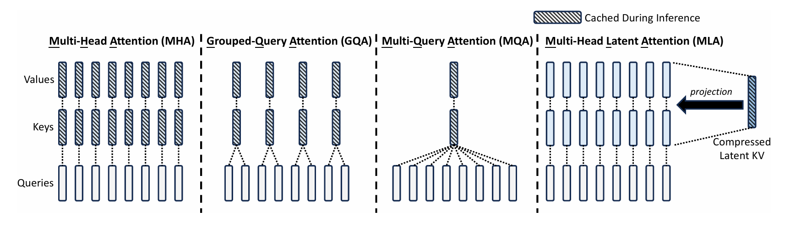
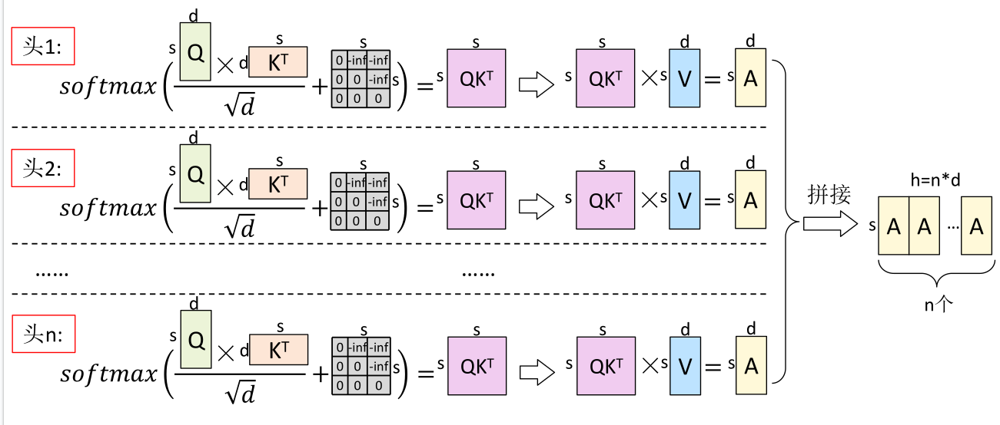
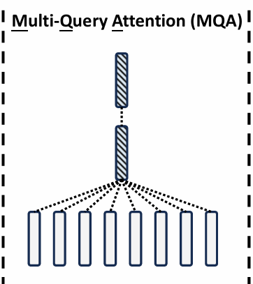
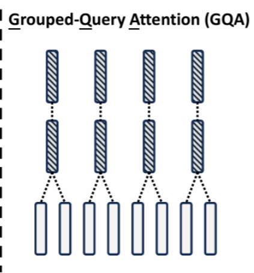
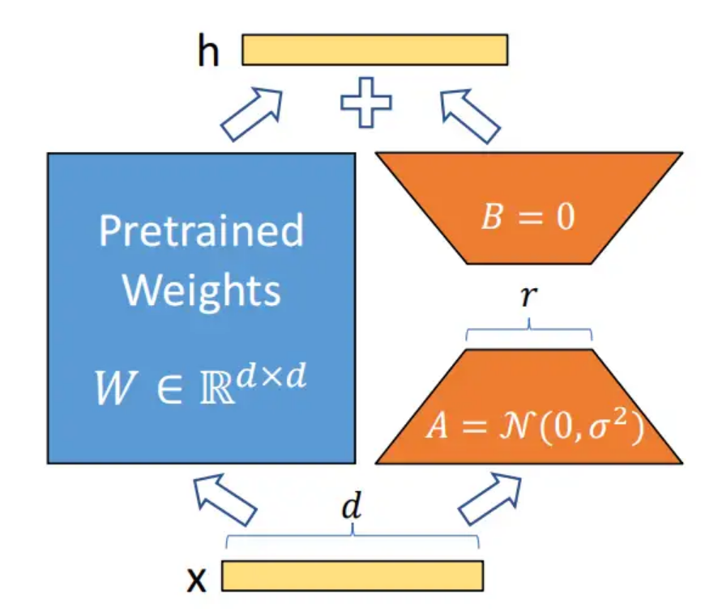
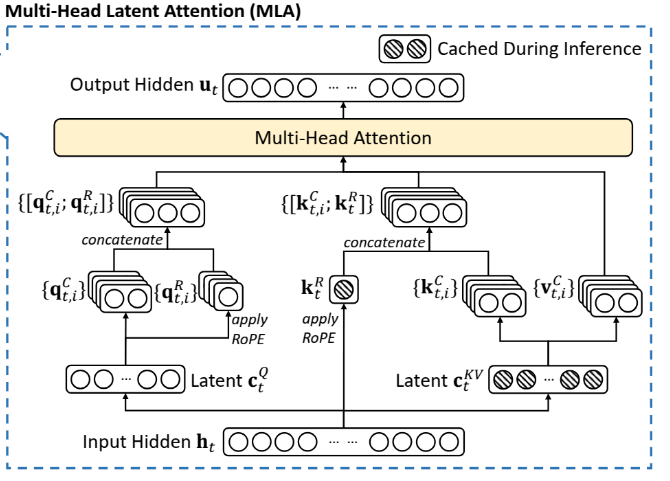

[DeepSeek V3](https://zhida.zhihu.com/search?content_id=253252683&content_type=Article&match_order=1&q=DeepSeek+V3&zhida_source=entity)的大火，让我深入学习了MLA的结构、原理和公式，借此，重新整理下相关的MHA、MQA、GQA和MLA这一脉络。

### 最初 MHA

首先是transformer论文中提出，也是应用很广的MHA（**M**ulti-**H**ead**A**ttention），多头注意力机制。

其相当于多个单头注意力的拼接，对于[LLAMA2-7b](https://zhida.zhihu.com/search?content_id=253252683&content_type=Article&match_order=1&q=LLAMA2-7b&zhida_source=entity)有 $h=4096,n=32,d_k=d_v=128$ ，

[LLAMA2-70b](https://zhida.zhihu.com/search?content_id=253252683&content_type=Article&match_order=1&q=LLAMA2-70b&zhida_source=entity)则是 $h=8192,n=64,d_k=d_v=128$

问题：在**推理**过程中，随着输入文本的不断增多，每次都要计算历史的QKV矩阵，为了更好的用户体验（加速），就把历史的KV矩阵存储下来，减少了重复运算，称之为[KV cache](https://zhida.zhihu.com/search?content_id=253252683&content_type=Article&match_order=1&q=KV+cache&zhida_source=entity)。

但速度快了，KV cache越存越大也不是个事啊，所以，我们就有以下策略：

### 降本MQA

既然KV cache那么珍贵，那就少用一点，来个共享版：**M**ulti-**Q**uery**A**ttention

使用MQA的模型包括[PaLM](https://link.zhihu.com/?target=https%3A//arxiv.org/pdf/2204.02311)、[StarCoder](https://link.zhihu.com/?target=https%3A//papers.cool/arxiv/2305.06161)、[Gemini](https://link.zhihu.com/?target=https%3A//papers.cool/arxiv/2312.11805)等。

每个head的Query 共享K和V矩阵，KV cache的内存占用直接降到了 $1/n$ 。

不过这么做的效果还是会有折扣的，即性能上的下降不可避免，也会影响模型的稳定性。

### 折中 GQA

既然每个Q用一个KV太多，一起用一个又不够，不如来个折中，一组用一个：**G**rouped-**Q**uery**A**ttention

  

用一个可配的 $g$ 对Query进行分组， $g=1$ 就是MQA， $g=n$ 就是MHA。调参党狂喜（bushi

目前常用的模型：[LLAMA2-70B](https://link.zhihu.com/?target=https%3A//llama.meta.com/llama2/)、[LLAMA3](https://link.zhihu.com/?target=https%3A//llama.meta.com/llama3/)全系列、[TigerBot](https://link.zhihu.com/?target=https%3A//papers.cool/arxiv/2312.08688)、[DeepSeek-V1](https://link.zhihu.com/?target=https%3A//papers.cool/arxiv/2401.02954)、[StarCoder2](https://link.zhihu.com/?target=https%3A//papers.cool/arxiv/2402.19173)、[Yi](https://link.zhihu.com/?target=https%3A//papers.cool/arxiv/2403.04652)、[ChatGLM2](https://link.zhihu.com/?target=https%3A//github.com/THUDM/ChatGLM2-6B)、[ChatGLM3](https://link.zhihu.com/?target=https%3A//github.com/THUDM/ChatGLM3)用的都是这个方法。

### 降秩MLA

DeepSeek V2提出了MLA，**M**ulti-head**L**atent**A**ttention，其本质思想是将原本的权重**降秩**成两个，大家伙先**公用**一个KV权重，就像MQA那样，而**私有**的KV权重，这能藏在哪里呢？如果能够转移到Q和输出O上，是不是就即节省了内存，又不降低性能呢？来看具体内容：

### 注意力机制中的低秩矩阵

deepseek v2和苏神从**低秩投影**的角度解释了MLA

1、什么是低秩投影？

结合[LoRA](https://zhida.zhihu.com/search?content_id=253252683&content_type=Article&match_order=1&q=LoRA&zhida_source=entity)来解释低秩投影：

对于前向传播 $h=Wx，W\in \mathbb{R}^{d\times d}$ ，为了使用尽可能少的参数来训练，设置新的权重参数：

$W_{new} = W + \Delta W = W + B \cdot A$

其中 $B\in \mathbb{R}^{d\times c},A\in \mathbb{R}^{c\times d} c<<d$ ，这里的 $\Delta W$ 就是低秩矩阵，训练时 $W$ 冻结，而只优化 $A$ 和 $B$

2、低秩投影为什么有效？

这里有个假设，即模型在适应**新任务**的时候，只需要训练很少的参数，其参数变化的有效维度远小于原始维度，**低秩矩阵足以捕捉关键信息**，而且它在推理的时候没有延迟。

3、attention中的低秩矩阵

除了苏神在博客中提到的GQA的降秩操作（下一部分介绍），其实attention本身公式中，也有降秩操作:

我们往往看到的公式是这个：

$softmax(\frac{QK^T}{\sqrt{d_k}})V$

这里的QKV都是将原本的特征向量乘以一个降维矩阵得到的，即原本是 $s\times h$ 的X，经过降维矩阵之后， h 变成了 d。维度降低是为了在较低纬度中计算注意力，减少计算量，那这个QK这么算可以理解，但V为什么要这么算? 因为注意力的本质是将当前token的特征向量，通过与其他token进行交互，得到一个信息更加全面的向量，所以V 应该是一个 $s\times h$ 的张量， $W_v$ ​的大小也应该是 $h \times h$ ,但这样的话，参数量就会暴涨。所以这里用了一个低秩矩阵:将 $h \times h$ 的矩阵，拆分成 $h\times d$ 和 $d\times h$ 的两个矩阵， $h\times d$ 的降秩矩阵就是我们的 $W_v$ ​,而另一个升秩矩阵就是，注意力最后的输出矩阵O

4、注意力机制中是否可以用低秩矩阵？注意力机制中是否可以用低秩矩阵？

其实**注意力矩阵本身就具有低秩特性**，注意力机制的秩也可能远小于原始维度，LoRA的原论文就将低秩矩阵用在了QKV的权重中，经过实验，他们主要在Q和V的权重矩阵添加LoRA。可以从QKV的作用角度加以区分：Q将输入映射到‘查询’空间，用于分配注意力，不同任务关注的角度不同；K将输入映射到‘键’空间，代表对语句的语法和语义进行建模的能力，需要形成稳定的表达；V将输入映射到‘值’空间，不同的任务对内容提取的特征不同。相对于K而言，QV更加具有敏感性。

MQA和GQA，相对于MHA而言，其实也是一种低秩运算，将原本有n对的KV权重矩阵，只保留g对：

$MHA:[k_1,k_2,...,k_n,v_1,v_2,...v_n] = x[W_{k1},W_{k2},...W_{kn},W_{v1},W_{v2},...W_{vn}]$

$GQA: [k_1,k_2,...,k_g,v_1,v_2,...v_g] = x[W_{k1},W_{k2},...W_{kg},W_{v1},W_{v2},...W_{vg}]$

把这里的权重矩阵拼接起来，可以看到MHA 的shape为 $d \times 2d$ ，GQA的shape为 $d \times 2dg/n$ ，相对于原来的权重矩阵，这里就是一个降秩矩阵。

MLA在之后的处理与GQA有所不同：

得到KV矩阵之后，GQA是把它**切分**，然后**复制**多份用于计算；这种切分与复制也是一种简单的线性变换，那么MLA干脆进行了线性变换：

$c = xW_c  (W_c \in \mathbb{R}^{d \times d_c}) 低秩 \\k = cW_k (W_k \in \mathbb(R)^{d_c \times d_k}) 线性 \\v = cW_v (W_v \in \mathbb(R)^{d_c \times d_v}) 线性$

这如果像MHA一样，保留计算得到的kv，那就完全没有节省到，所以需要想办法，要是只需要保存 $c$ 就很完美了么？

这里MLA用了一个矩阵变化来实现：

$q_ik_i^T = (xW_{qi})(cW_{ki})^T = x(W_{qi}W_{ki}^T)c^T = xW_{cqi}c^T$

这里就是在前文中说的，把**私有**的K"藏"在了Q的投影矩阵中，对于V，也同样可以吸收到后面的投影中：

$o_i = a_iv_iW_{oi} =a_ic(W_{vi}W_{oi}) = a_icW_{cv}$

这里的c是共享的，也就是前文说的，**公用**的KV cache。

### 来吧RoPE

上面的想法很美好，但有一个问题，就是忽略了RoPE位置编码。目前的大模型中，主要在attention计算之前，对Q和K矩阵进行位置编码。

即 $q_i k_i^T=RoPE(xW_{qi})RoPE(cW_{ki})^T$

这样就没法子化简了

DeepSeek使用的方法是多条路：即Q和K多出一些维度专门来处理位置编码，当然为了减少cache，这里的K是共享的，具体来看公式：

$q_ik_i^T = [q_i(C),q_i(R)][k_i(C),k(R)]^T \\=q_i(C)k_i(C)^T + q_i(R)k(R)^T \\=xW_{cqi}c^T +RoPE(xW_{qri})RoPE(xW_{kr})^T$

这里 $q_i(R)和k(R)$ 就是多出来的维度，用于加入位置编码的，其维度为 $s \times d_r$ , $d_r$ 取 $d_c/4$

### Q 你来的正好

Q本身与推理时的KV cache，但通过对Q也进行降秩，可以降低网络训练阶段的参数量：

$q_i = [q_i(C) ,q_i(R)] = [xW_{dq}W_{qci}, xW_{dq}W_{qr}] = [c_{q}W_{qci},c_{q}W_{qri}]$

最后的结构如下：

参考：

[再读MLA，还有多少细节是你不知道的 - 知乎](https://zhuanlan.zhihu.com/p/19585986234)

[MHA、MQA、GQA和MLA发展演变 - 知乎](https://zhuanlan.zhihu.com/p/17434772442)

[缓存与效果的极限拉扯：从MHA、MQA、GQA到MLA - 科学空间|Scientific Spaces](https://link.zhihu.com/?target=https%3A//kexue.fm/archives/10091)

[arxiv.org/pdf/2405.04434](https://link.zhihu.com/?target=https%3A//arxiv.org/pdf/2405.04434)