## 1\. 背景

Overlap Scheduling 是大模型推理加速的重要手段。从应用视角来说：Overlap Scheduling 适用于有高 QPS 压力的场景，吞吐和 TTFT 通常会更好。如果是低 QPS 的场景，输入压力有限，Overlap Scheduling 的吞吐不会更好，并且会有 TTFT 升高的风险。这个结论不需要深入理解 Overlap Scheduling，可以通过端到端的黑盒测试得到，而本文想要做的是白盒分析，知其所以然。本文试图解答以下问题：

-   Overlap Scheduling 是什么？
-   Overlap Scheduling 为什么会导致 TTFT 上涨？有什么优化手段？
-   Overlap Scheduling 消除 GPU 空闲气泡，系统吞吐和 TTFT 就一定会更好吗？

在解答过程中，也会给读者展示分析和解决问题的方法，在其他性能优化分析场景下也能应用。

注：本文的示例代码，主要是 mini-sglang 的 Overlap Scheduling 实现提供的灵感，在介绍基础概念时，也以 mini-sglang 为样板。

## 2\. 概念理解

**定义**：Overlap Scheduling 是一种将 CPU 调度开销与 GPU 计算重叠执行的优化技术，mini-sglang 通过双 CUDA Stream 机制实现 CPU 和 GPU 并行工作，有效隐藏 CPU 延迟，提高 GPU 利用率和系统吞吐。

**核心价值**：Overlap Scheduling 的核心目标是让 CPU 的调度操作与 GPU 的推理计算同时进行。由于 CPU 资源相对廉价且通常不是瓶颈，而 GPU 算力昂贵且稀缺，因此该技术的核心价值在于：让瓶颈硬件（GPU）保持持续的满负荷计算状态，避免其因等待 CPU 指令而 “空转”。

**技术手段**：能够并行工作，本质上是让 GPU 计算可以异步执行，多流是实现 GPU 异步计算的关键手段。对于熟悉传统 CPU 后台开发的工程师来说，这类似于经典的 “生产者 - 消费者” 模型：外部消息响应线程在遇到计算密集型任务时，通常会将计算任务丢到工作线程里，待计算完成后再返回给消息响应线程，而消息响应线程则通过轮询回包队列或者事件触发的方式，将计算结果回给外部请求者。mini-sglang 就是采用这类思路实现的，CUDA 的工作流就是 CPU 里的工作线程。

**扩展**：本章介绍的是调度的重叠，大模型推理中还有其他重叠，譬如：数据传输和计算的重叠、核函数启动和计算的重叠。无论哪种重叠，其本质都是为了掩盖非瓶颈环节的延迟，从而让昂贵的瓶颈硬件（GPU）得到最充分的利用。

## 3\. 核心技术点

如前所述，Overlap Scheduling 的本质技术是异步执行，核心有两点：

-   创建异步环境，让推理计算可以在单独的流里执行
-   置位同步信号，推理计算开始前需要确保数据已经准备好，调度线程处理结果前需要确保推理已经完成

mini-sglang 的实现很简洁，关键代码如下：

（1）创建推理流

```python3
# Engine 对象的 __init__：
self.stream = torch.cuda.Stream()
...
# Scheduler 对象的 __init__：
self.engine_stream_ctx = torch.cuda.stream(self.engine.stream)
```

（2）任务切换到推理流执行，并且确保推理之前数据准备完成：

```python
with self.engine_stream_ctx:  # 切换到推理流
    self.engine.stream.wait_stream(self.stream)  # 等待调度流完成元数据准备
    ongoing_data = (forward_input, self._forward(forward_input))
```

（3）处理结果之前确保推理流的数据已拷贝到 CPU：

```python
def _process_last_data(self, last_data, ongoing_data):
    if last_data is None:
        return
    batch, (_, next_tokens_cpu, copy_done) = last_data[0].batch, last_data[1]
    copy_done.synchronize()  # 等待 GPU→CPU 数据拷贝完成
    # 处理采样结果...
```

## 4\. 原型代码

基于 mini-sglang 的思路，我们可以自行实现一份 demo 代码：

```python
import torch
import time
import queue

# 模拟各 CPU 阶段耗时（秒）
PRE_PROCESS_TIME = 0.03  # 前处理（CPU: 接收请求、准备 Metadata, Tokenization）
POST_PROCESS_TIME = 0.02  # 后处理（CPU: Sample, De-tokenization）
TOTAL_REQUESTS = 10  # 测试总请求数


class OverlapEngine:
    def __init__(self):
        self.engine_stream = torch.cuda.Stream()
        self.request_queue = queue.Queue()
        self.results_queue = queue.Queue()

    def _pre_process(self, req_id):
        """模拟前处理"""
        time.sleep(PRE_PROCESS_TIME)

    def _post_process_normal(self, req_id):
        """模拟 normal 模式的后处理"""
        time.sleep(POST_PROCESS_TIME)

    def _post_process_overlap(self, last_data):
        """模拟 overlap 模式的后处理"""
        if last_data is not None:
            _, sync_event, _ = last_data
            sync_event.synchronize()
            time.sleep(POST_PROCESS_TIME)

    def _mock_forward(self):
        """模拟 GPU 推理"""
        dummy_tensor = torch.randn(1000, 1000, device="cuda")
        for _ in range(1000):
            dummy_tensor = torch.matmul(dummy_tensor, dummy_tensor)

        return dummy_tensor

    def _gpu_inference_async(self, req_id):
        """模拟异步 GPU 推理"""
        with torch.cuda.stream(self.engine_stream):
            result = self._mock_forward()
            sync_event = torch.cuda.Event()
            sync_event.record(self.engine_stream)
            return req_id, sync_event, result

    def _gpu_inference_blocking(self):
        """模拟同步 GPU 推理"""
        result = self._mock_forward()
        torch.cuda.synchronize()
        return result

    def run_normal(self):
        """模拟运行 normal 模式"""
        start_time = time.time()
        for i in range(TOTAL_REQUESTS):
            self._pre_process(i)
            self._gpu_inference_blocking()
            self._post_process_normal(i)
        return time.time() - start_time

    def run_overlap(self):
        """模拟运行 overlap 模式"""
        start_time = time.time()

        last_data = None

        for i in range(TOTAL_REQUESTS + 1):
            ongoing_data = None
            if i < TOTAL_REQUESTS:
                self._pre_process(i)
                ongoing_data = self._gpu_inference_async(i)

            self._post_process_overlap(last_data)
            last_data = ongoing_data

        return time.time() - start_time


# 预热
dummy_tensor = torch.randn(1000, 1000, device="cuda")
torch.matmul(dummy_tensor, dummy_tensor)

engine = OverlapEngine()
print(f"开始测试 {TOTAL_REQUESTS} 个请求...")

duration_normal = engine.run_normal()
throughput_normal = TOTAL_REQUESTS / duration_normal

duration_overlap = engine.run_overlap()
throughput_overlap = TOTAL_REQUESTS / duration_overlap

print("-" * 30)
print(f"Normal  模式耗时: {duration_normal:.4f}s | 吞吐: {throughput_normal:.2f} req/s")
print(
    f"Overlap 模式耗时: {duration_overlap:.4f}s | 吞吐: {throughput_overlap:.2f} req/s"
)
print(f"提升效率: {((throughput_overlap/throughput_normal)-1)*100:.2f}%")
```

运行效果如下：

```python
开始测试 10 个请求...
------------------------------
Normal  模式耗时: 1.2408s | 吞吐: 8.06 req/s
Overlap 模式耗时: 0.8476s | 吞吐: 11.80 req/s
提升效率: 46.39%
```

从原型代码的运行结果看到有 46.39% 的吞吐提升收益，那么收益的来源是哪儿呢，下面做进一步拆解。

## 5\. 收益和代价分析

### 5.1. Overlap Scheduling 模式推理时序图

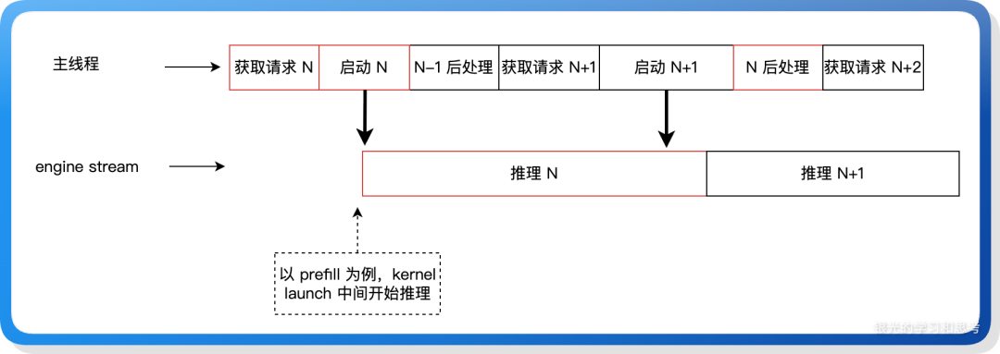

### 5.2. 吞吐收益分析

在 Overlap Scheduling 模式下，主线程持续向推理流提交任务，以最大化 GPU 占用率。根据 GPU 推理耗时与 CPU 调度耗时的相对比例，系统将呈现两种运行状态：

（1）GPU 饱和态（Compute Bound）：当单次 GPU 推理耗时显著大于 CPU 调度开销时，任务调度形成完美的 GPU 流水线。

-   现象： 任务 N+1 的启动触发点早于任务 N 的结束时间。
-   结果： GPU 无需等待，任务 N 结束后无缝衔接任务 N+1，GPU 利用率达到 100%。

（2）GPU 饥饿态（CPU Bound）：当单次 GPU 推理耗时小于 CPU 调度开销时，GPU 流水线出现断流。

-   现象： 任务 N 提前结束，但任务 N+1 尚未由 CPU 准备就绪。
-   结果： GPU 被迫进入空转等待状态，算力出现浪费。

**无论处于饱和态还是饥饿态，Overlap Scheduling 模式的系统吞吐量均高于 Normal 模式。** 然而，在 GPU 饥饿场景下，CPU 成为了瓶颈，是否可以进一步优化？

针对 GPU 饥饿态时的 CPU 瓶颈，可通过任务解耦让 CPU 任务并行执行：基于与<启动 N+1>之间无数据依赖的特点，让二者可以并行执行，从而消除 CPU 的串行等待时间，让系统进入 GPU 饱和态。因为 python 的 GIL 限制导致无法使用多核，但这里的 CPU 任务是 IO 密集型的，不会消耗太多 CPU，应该可以做到不错的效果。后文会再结合 TTFT 优化进一步分析，最后会给出一份并行化改造的示例代码，以及分析过度并行化会因破坏 Continuous Batching 带来的负面影响。

### 5.3. TTFT 代价分析

通常我们讲 Overlap Scheduling 收益时，都是在谈论它如何提升 GPU 利用率让系统吞吐更高，但这是有代价的，它可能会让 TTFT 升高。请求的首 token 推理计算量不会因为调度重叠而减少，反而可能因重叠需要，导致一次请求的处理过程中插入了非本请求的时间消耗，最终导致 TTFT 耗时增加。

实际上，在我们的业务中也确实出现了这样的现象：在仅有 Prefill 推理的场景下（后文简称为“纯 Prefill 场景”），开启 Overlap Scheduling 的耗时要比不开启的 Normal 模式耗时多 30%。**下面的几个章节将基于这个命题展开：在 Overlaping Scheduling 模式下，TTFT 上涨的底层原因是什么，以及如何让 TTFT 不增加。**

## 6\. TTFT 耗时分析实验代码

前述的原型代码每个请求只处理一次推理，和我们的纯 Prefill 场景一致，给原型代码加上 nvtx 和请求耗时统计，同时加上 QPS 控制，确保公平，然后通过调整前处理、推理、后处理三个阶段的耗时，来模拟 GPU 饱和、GPU 饥饿的场景，观察 NSYS 和平均耗时（即 TTFT）。

代码较长，为免影响阅读体验，放到 github：

-   `https://github.com/cswuyg/tools/blob/main/overlap_scheduling/overlap_scheduling_gpu_bound.py`
-   `https://github.com/cswuyg/tools/blob/main/overlap_scheduling/overlap_scheduling_cpu_bound.py`

运行：`nsys profile --trace=cuda,osrt,nvtx python3 demo_overlap.py`

## 7\. GPU 饱和场景 TTFT 分析

（1）实验代码特点，CPU 耗时 < GPU 耗时，并且请求出现积压。

（2）通过 nsys 看到 GPU 泳道没有空隙。

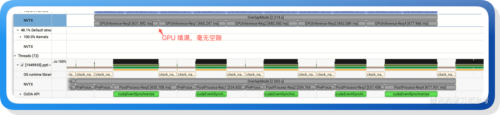

（3）实验结果

```python
开始测试 5 个请求 (QPS=1000)...
------------------------------
Normal  模式 - 总耗时: 3.4863s | 平均延迟: 2125.93ms | 队列等待: 1428.68ms | 吞吐: 1.43 req/s
Overlap 模式 - 总耗时: 2.5646s | 平均延迟: 1618.12ms | 队列等待: 713.20ms | 吞吐: 1.95 req/s
吞吐提升: 35.94% | 延迟降低: 23.89%
```

**请求积压，并且 GPU 饱和场景下，Overlap Scheduling 的吞吐和 TTFT 都更好。** 我们再通过 NSYS 分析，观察 Overlap 模式下不含队列等待时间的 TTFT 耗时组成，以请求 2 为例：

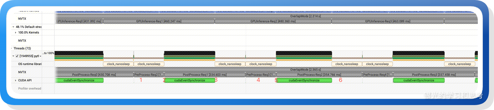

请求 2 的耗时包括 6 个步骤：

-   1\. 请求 2 的前处理
-   2\. 请求 2 的 cuda launch
-   3\. 请求 1 的 后处理
-   4\. 请求 3 的前处理
-   5\. 请求 3 的 Kernel Launch
-   6\. 请求 2 的后处理

因推理耗时非常长，所以 3、4、5、6 四个步骤的时间主要是请求 1 和请求 2 的推理耗时，也就是说请求 2 的 TTFT 包含了请求 1 的推理时间，此时如果要降低 TTFT，需要减少每次推理的计算量，或者是加大请求之间的间隔，避免前请求影响到后请求。

在实际的业务应用中，本案例属于：系统压力过大，GPU 饱和使用，请求在队列里等待。这时候 Overlap 模式的 TTFT 比 Normal 好，因为高压力下，Normal 的队列等待会更严重。

**分析结论：纯 Prefill 推理，GPU 用满的场景下，当前请求的 Prefill 耗时会包含前一个请求的部分 Prefill 耗时，导致 TTFT 耗时升高，但因为 GPU 使用充分，因此在相同的高 QPS 压力下，Overlap Scheduling 比 Normal 模式的 TTFT 低。**

## 8\. GPU 饥饿场景 TTFT 分析

（1）实验代码特点，CPU 耗时 > GPU 耗时，并且请求出现积压，此时 CPU 调度处理阻塞了 GPU 任务的执行：很多请求在等待，但是 GPU 用不起来。

（2）通过 nsys 看到 GPU 泳道出现明显的间隙，Normal 模式的间隙更大。

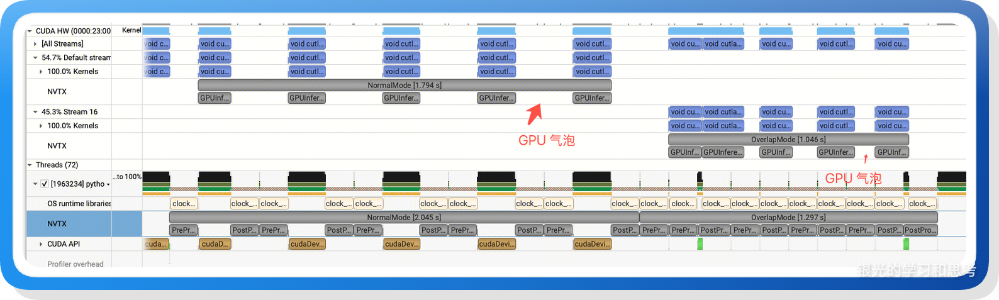

（3）实验结果

```python
开始测试 5 个请求 (QPS=1000)...
------------------------------
Normal  模式 - 总耗时: 2.0446s | 平均延迟: 1214.26ms | 队列等待: 805.36ms | 吞吐: 2.45 req/s
Overlap 模式 - 总耗时: 1.2969s | 平均延迟: 875.86ms | 队列等待: 411.88ms | 吞吐: 3.86 req/s
吞吐提升: 57.65% | 延迟降低: 27.87%
```

我们再通过 nsys 分析，观察耗时的组成：

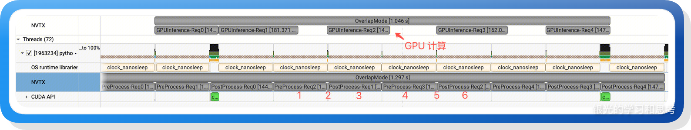

请求 2 的耗时包括 6 个步骤：

-   1\. 请求 2 的前处理
-   2\. 请求 2 的 cuda launch
-   3\. 请求 1 的 后处理（重叠请求 2 的 GPU 计算）
-   4\. 请求 3 的前处理
-   5\. 请求 3 的 Kernel Launch
-   6\. 请求 2 的后处理

这 6 个步骤只有 1、2、6 是请求 2 相关的，其他是 Overlap 插入的，这导致请求 2 的 TTFT 时间增加了。此时如果要降低 TTFT，应该让步骤 6 尽快的执行，不要在 3、 4、5 后面等待。

在实际的业务应用中，本案例属于：调度开销占比过高，GPU 使用不充分。

**结论：纯 Prefill 推理，GPU 用不满的场景下，当前请求的 Prefill 耗时会包含前一个请求的后处理和后一个请求的前处理耗时，TTFT 耗时升高，但因为 GPU 使用相对充分，因此在相同的高 QPS 压力下， Overlap Scheduling 比 Normal 模式的 TTFT 低。**

## 9\. 现有架构下优化 TTFT

### 9.1. 纯 Prefill 场景

上述两节的分析，纯 Prefill 场景下，GPU 无论是饱和还是饥饿，Overlap Scheduling 模式下不含队列等待时间的 TTFT 相比 Normal 都是增加的，怎么才能让 TTFT 不增加呢？从上一节的 NSYS 分析图我们得到结论：**当 CPU 时间里的 3、4、5 步骤和 GPU 推理时间正好重叠的时候，TTFT 耗时就不会增加。**

将上述 GPU 饥饿实验代码里的前处理和后处理时间做修改，让 CPU 时间和 GPU 时间尽量接近，同时修改发起请求的时机，让请求一个接一个串行执行，效果如下：

```python
Normal  模式 - 总耗时: 2.3839s | 平均延迟: 476.78ms | 吞吐: 2.10 req/s
Overlap 模式 - 总耗时: 1.4150s | 平均延迟: 497.96ms | 吞吐: 3.53 req/s
吞吐提升: 68.47% | 延迟降低: -4.44%
```

可以看到 Overlap 模式的 TTFT 耗时已经和 Normal 非常接近，因为我们的 cuda 任务耗时不稳定，所以要做到延迟不降低需要尝试很多次，这里略过。

**结论：纯 Prefill 推理场景下，当 CPU 处理时间和 GPU 推理时间正好重叠时，TTFT 耗时不会增加。** 这个结论理论上可达，实际上几乎无法做到，我们只能尽量的缩短差距：首先，CPU 计算任务的耗时我们无法通过参数调节，我们只能通过调节推理计算量来对齐时间，而推理计算量又和请求序列长度相关，我们可以用 chunked prefill 来调节单次推理的计算长度，但 chunked prefill 又需要付出 TTFT 升高的代价，陷入死结。

### 9.2. Prefill 和 Decode 混合场景

在 Prefill 和 Decode 混合的情况下，可以实现 TTFT 不增长。还是以上一节的 GPU 饥饿场景 NSYS 图为例，我们修改请求的推理时间：请求 1 和 请求 3 是 decode 请求，耗时很短，而请求 2 是 prefill 请求，耗时很长。这时候就可以保证：

（1）请求 2 Kernel Launch 之后可以马上使用 GPU；

（2）请求 2 的推理时间就可以覆盖住请求 3 的 前处理和 Kernel Launch，使得请求 2 推理完成之后，马上就可以执行回包处理。

这样请求 2 的 TTFT 就没有任何的插入时间，修改前面的实验代码：

```python
    def _mock_forward(self, req_id):
        torch.cuda.nvtx.range_push(f"GPUInference-Req{req_id}")
        dim = 15000
        dummy_tensor = torch.randn(dim, dim, device="cuda")
        result = torch.matmul(dummy_tensor, dummy_tensor)
        result = torch.matmul(dummy_tensor, dummy_tensor)
        result = torch.matmul(dummy_tensor, dummy_tensor)
        torch.cuda.nvtx.range_pop()
        return result

    def _gpu_inference_async(self, req_id):
        with torch.cuda.stream(self.engine_stream):
            if req_id in [2]:
                result = self._mock_forward_prefill(req_id)
            else:
                result = self._mock_forward(req_id)
            sync_event = torch.cuda.Event()
            sync_event.record(self.engine_stream)
            return req_id, sync_event, result
```

再次运行，然后通过 nsys 看效果：

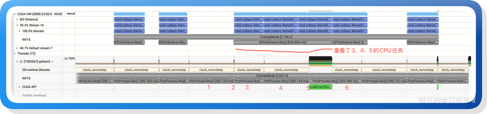

可以看到请求 2 的推理时间重叠了其他请求的 CPU 处理时间，此时请求 2 的 TTFT 耗时和 Normal 模式一样。

此时时序图如下：

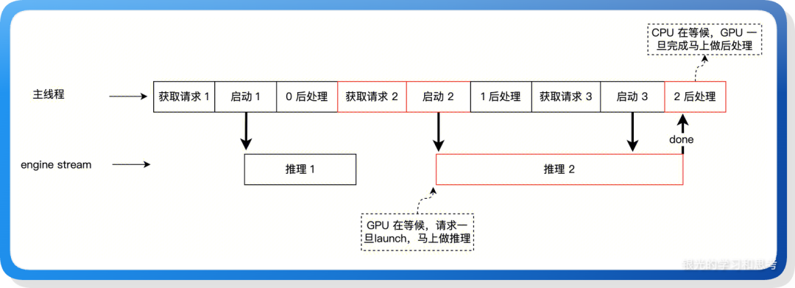

从时序图很容易就可以发现：GPU 进入了“饥饿态”，也就是保住了 TTFT，但是吞吐下降了。

**结论：Prefill 和 Decode 混合场景下，当 Prefill 请求的前后都是 Decode 请求时，可以确保 Prefill 请求的 TTFT 不会增加，但 GPU 出现了空转，付出了系统吞吐下降的代价。**

## 10\. CPU 并行计算改造尝试

在前面分析到 GPU 饥饿场景时，我们提到过让 CPU 并行加速，看起来可以让 GPU 不断流，也可以优化 TTFT，本节还是通过实验来模拟并行改造后的效果。

### 10.1. 理论分析

（1）并行改造之前的时序图

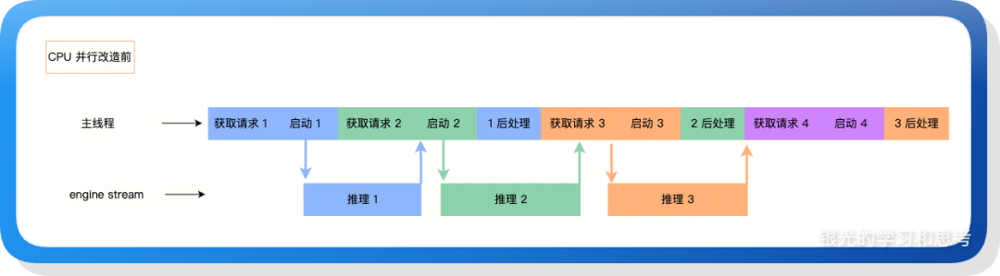

GPU 饥饿场景下的时序如上图，GPU 流存在气泡，CPU 的阻塞了 GPU 的运行。

（2）并行改造之后的时序图

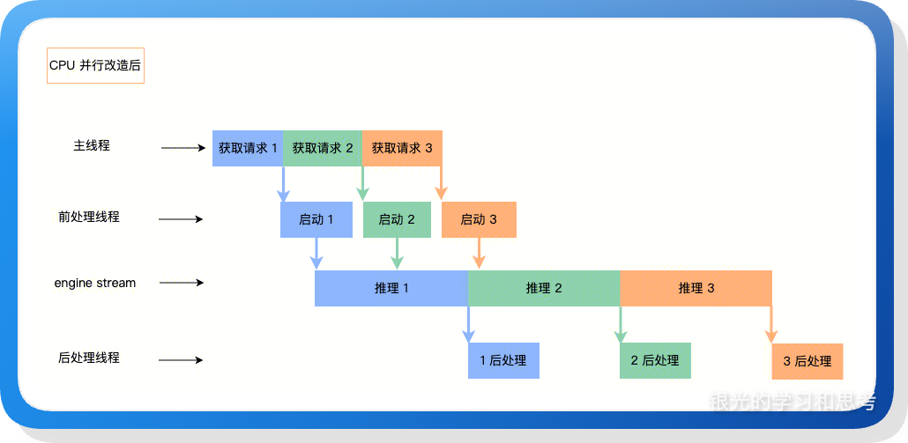

如上图所示，将所有 CPU 任务都异步化，保证 GPU 不断流。

### 10.2. 实验验证

（1）实验代码

在 TTFT 耗时分析实验代码基础上做改造，新增两个工作线程，让前处理、启动、后处理都通过队列衔接，让它们都可以并发执行。

代码较长，为免影响阅读体验，放到 github：`https://github.com/cswuyg/tools/blob/main/overlap_scheduling/overlap_scheduling_multi_cpu_thread.py`

（2）NSYS 观察

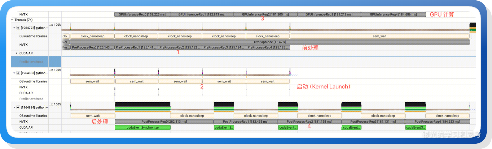

可以看到 GPU 流水线没有气泡，用得非常满。

（3）实验数据

```python
开始测试 5 个请求 (QPS=1000)...
------------------------------
Normal  模式 - 总耗时: 2.0174s | 平均延迟: 1206.19ms | 队列等待: 802.71ms | 吞吐: 2.48 req/s
Overlap 模式 - 总耗时: 1.1415s | 平均延迟: 773.87ms | 队列等待: 250.32ms | 吞吐: 4.38 req/s
吞吐提升: 76.73% | 延迟降低: 35.84%
```

和 GPU 饥饿场景下的实验数据合并（表格中的优化比例都是相对于 Normal 模式的）：

| 方案 \ 指标 | 吞吐提升 | TTFT 降低 |
| ----- | ----- | ----- |
| CPU 单线程 (GPU 饥饿场景) | 57.65% | 27.87% |
| CPU 3 线程 (并行改造) | 76.73% | 35.84% |

可以看到高 QPS 压力下，如果 GPU 流水线出现气泡，可以使用 CPU 并行，吞吐和 TTFT 都有很大的优化。

看起来很完美，到这里就结束了吗？不是的，在现实环境下，有两个点我们的模拟实验没考虑到：

-   Python 的 GIL 限制。如果前处理和后处理有比较重的 CPU 计算，会因为 python 无法使用多核导致 CPU 并行失效。
-   更高频的 Kernel Launch 会影响动态批处理。原本攒一批请求再一次执行，我们将 CPU 处理改造为多线程并行之后，会变成多批执行。请求量没有改变，但 GPU 需要做的计算次数更多了，导致系统吞吐下降。

影响最大的是第二个点，下面展开分析。

## 11\. Overlap Scheduling CPU 并行带来的性能退化

### 11.1. 理论分析

动态批处理是契合 GPU 硬件特性，增大系统吞吐的重要优化策略，但和 Overlap Scheduling 在一起时，Overlap Scheduling 会降低动态批处理的批次大小，导致系统吞吐下降。

Overlap Scheduling 让 CPU 调度任务更早的执行，使得多个 GPU 任务可以连续的执行，GPU 流水线不会断流，但当 CPU 调度任务太早执行时，会削弱动态批处理。CPU 调度任务执行得更早、更快、更高频，就会导致连续的多个请求被更高频的组装成多个 CUDA Stream 任务，对于 CUDA Stream 来说，背后的请求总数并没有改变，但 GPU 任务数变多了，GPU 需要执行更长的时间。此时我们会观察到：GPU 的流水线没有空闲气泡，但系统的吞吐大幅度下降。

注：这里仅分析纯 Prefill 场景下的 TTFT，因此不涉及连续批处理（Continuous Batching），仅是动态批处理（Dynamic Batching）。

### 11.2. 实验验证

我们继续修改前面的实验代码，增加动态批处理处理逻辑来模拟 Overlap Scheduling 过度并行导致的性能下降。

（1）实验代码

代码较长，为免影响阅读体验，放到 github：`https://github.com/cswuyg/tools/blob/main/overlap_scheduling/overlap_scheduling_with_dynamic_batching.py`

启动：`nsys profile --trace=cuda,osrt,nvtx --gpu-metrics-devices=0 python3 overlap_scheduling_with_dynamic_batching.py`

（2）实验结果

```python
开始测试 100 个请求 (QPS=50)...
--------------------------------------------------------------------------------
Normal 模式       - 总耗时: 2.3594s | 平均延迟: 366.42ms | 请求队列等待: 123.12ms | 吞吐: 42.38 req/s | 推理次数: 10
Overlap 单线程模式 - 总耗时: 2.4227s | 平均延迟: 509.54ms | 请求队列等待: 99.22ms | 吞吐: 41.28 req/s | 推理次数: 12
Overlap 三线程模式 - 总耗时: 10.9589s | 平均延迟: 4620.92ms | 请求队列等待: 13.53ms | 吞吐: 9.12 req/s | 推理次数: 66
--------------------------------------------------------------------------------
单线程 vs Normal  - 吞吐提升: -2.62% | 延迟降低: -39.06%
三线程 vs Normal  - 吞吐提升: -78.47% | 延迟降低: -1161.09%
三线程 vs 单线程  - 吞吐提升: -77.89% | 延迟降低: -806.88%
```

可以看到 CPU 单线程和三线程 Overlap Scheduling 模式的吞吐和 TTFT 都变差了，因为动态批处理的批次太碎了。

（3）观察 NSYS

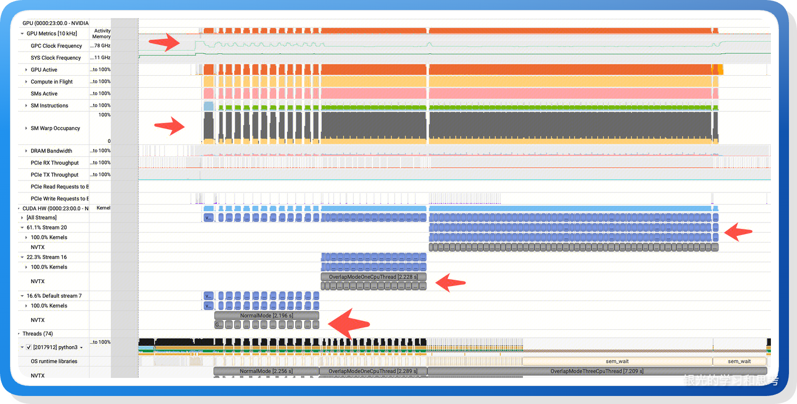

我们可以看到：

-   GPC Clock Frequency 在做 Normal 模式计算时，频率升高，这意味着 GPU 的功耗管理系统检测到了更高的计算强度。
-   SM Warp Occupancy 的黄色部分在三种模式下都持平，因为用的是同一个 Kernel，只是维度变化，它所需要的计算资源是固定的。
-   CUDA HW 部分可以看到 Normal 模式的 GPU 流水线有很大的空隙，其他两种模式都是连续使用的。

实验结果和我们的理论推导一致：CPU 单线程和 3 线程的 Overlap Scheduling 虽然让 GPU 流水线不断流，但是削弱了动态批处理，GPU 的计算强度下降，系统的吞吐和 TTFT 都变得更差。

## 12\. 权衡 CPU 并行和动态批处理的方案

### 12.1. 基础方案

回到文章开头的 Overlap Scheduling GPU 饥饿场景下的时序图，CPU 调度只使用一个线程，多个没有依赖的 CPU 任务串行执行，这可能是权衡之后的方案：

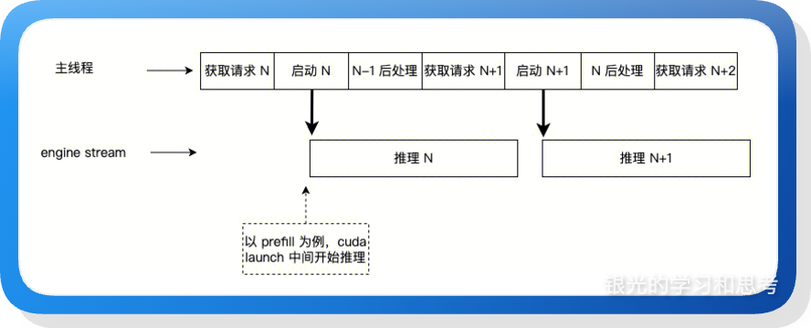

获取请求尽量的晚执行，保障动态批处理尽量的获取更多请求，付出 GPU 流水线有一定的空隙的代价，获得更大的批处理，但这种设计不是精准可控的，使用多个线程执行 CPU 任务如果做到精准可控，也有可能进一步优化。

### 12.2. 精准控制 CPU 并行

（1）理论分析

上述的平衡方案也可以进一步优化，我们仍然可以使用多线程来做 CPU 任务，然后基于耗时预估，让 Kernel Launch 在最合适的时机执行，也就是：尽量的多攒请求，又不会导致 GPU 流水线断流。下面继续改造实验代码来验证。

（2）实验代码

通过预估当前任务的推理时间，在当前任务结束前夕完成下一个批次任务的收集，确保 batch size 足够大，同时让 GPU 不要断流。当然，实验代码没有很精细，耗时预估不准，所以还是有少量的 GPU 空隙，还可以进一步优化。

代码较长，为免影响阅读体验，放到 github：`https://github.com/cswuyg/tools/blob/main/overlap_scheduling/overlap_scheduling_with_dynamic_batching_enhance.py`

启动：`nsys profile --trace=cuda,osrt,nvtx --gpu-metrics-devices=0 python3 overlap_scheduling_with_dynamic_batching_enhance.py`

（3）运行效果

```python
开始测试 100 个请求 (QPS=50)...
--------------------------------------------------------------------------------
Normal 模式         - 总耗时: 2.2206s | 平均延迟: 277.31ms | 队列等待: 95.61ms | 吞吐: 45.03 req/s | 推理次数: 12
Overlap 单线程模式   - 总耗时: 2.3685s | 平均延迟: 351.26ms | 队列等待: 69.72ms | 吞吐: 42.22 req/s | 推理次数: 17
Overlap 三线程模式   - 总耗时: 7.3986s | 平均延迟: 4553.77ms | 队列等待: 15.93ms | 吞吐: 13.52 req/s | 推理次数: 53
Overlap 三线程优化版 - 总耗时: 2.0589s | 平均延迟: 271.82ms | 队列等待: 15.64ms | 吞吐: 48.57 req/s | 推理次数: 14
--------------------------------------------------------------------------------
单线程 vs Normal    - 吞吐提升: -6.24% | 延迟降低: -26.67%
三线程 vs Normal    - 吞吐提升: -69.99% | 延迟降低: -1542.13%
三线程优化 vs Normal - 吞吐提升: 7.85% | 延迟降低: 1.98%
三线程优化 vs 三线程 - 吞吐提升: 259.35% | 延迟降低: 94.03% | 推理次数减少: 73.58%
```

可以看到，CPU 三线程优化版本，推理次数和 Normal 模式接近，吞吐和 TTFT 也都好于 Normal 模式，但还有优化空间，看下图 NSYS 分析。

（4）NSYS

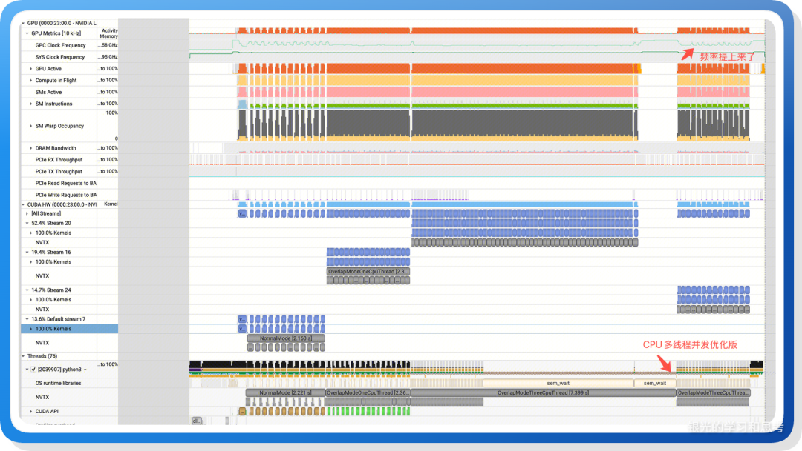

图中可以看到，优化版本的 GPU 流水线还是有少量的空隙。

### 12.3. 总结

Overlap Scheduling 里的 CPU 任务调度应该“恰到好处”的和 GPU 并行，不能太早也不能太晚，才能在 Overlap Scheduling 和 动态批处理之间取得平衡，获取最大收益。当前 SGLang 和 vLLM 都没有把获取请求和 Kernel Launch 两个 CPU 任务拆分到独立工作线程，甚至 SGLang 没有把推理后处理拆分到独立工作线程，可能都是基于 Overlap Scheduling 和动态批处理的平衡考虑，如果追求极致，应该可以进一步优化，但也应该考虑到这类优化是和业务场景强相关的，如果一次推理的时间足够长，单线程的 CPU 不是瓶颈，那当前的实现也足够了。

## 13\. 附：SGLang 早期实现的 Overlap Scheduling

Overlap Scheduling 的剖析就基本完成了，这里再附上我第一次分析 Overlap Scheduling 时的记录。

在 SGLang 的早期版本里，没有使用双流，而是通过工作线程执行推理，然后主线程等待工作线程的 Kernel Launch（GPU 任务都是异步执行的，launch 完函数就返回）完成后才继续往下执行其他 CPU 任务。这里工作线程和主线程本质上是串行执行的，其实没有必要开启工作线程，当前最新的 SGLang 也确实去掉了工作线程。

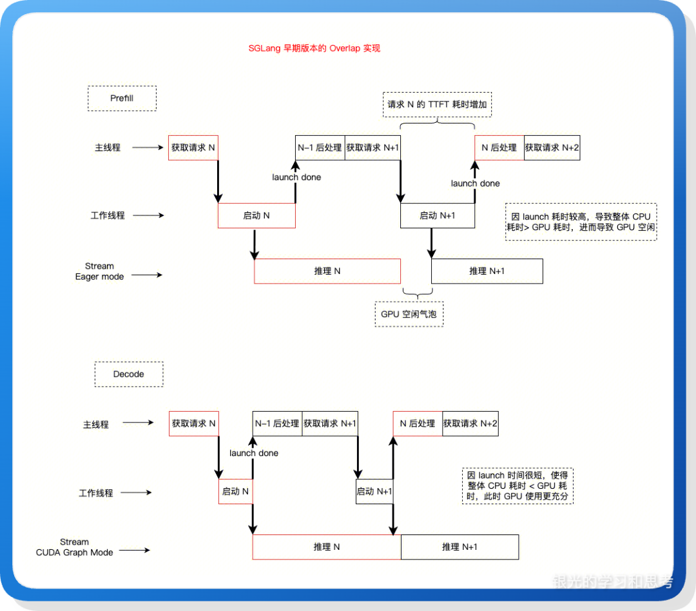

## 14\. 附：其他信息

（1）数据传输和计算的重叠。当前的推理时间不仅是推理时间，还包括推理结果从 GPU 拷贝到 CPU的时间（D2H），这里也可以使用多流，vLLM、SGLang 就是这么干的。

（2）CPU 并行计算改造里的后处理线程。实际上 vLLM 就有这样的线程，但 SGLang 没有，它都在主线程里完成。

（3）多推理一个 token。Overlap Scheduling 的异步实现会导致结束推理的请求不能及时终止，它又进入下一轮推理。这要求在结果处理、清理结束请求资源时，需要做容错处理，同时会多推理一个 token，这对纯 prefill 请求浪费占比较大。

（4）停止连续两次 prefill 推理。前面分析到：Prefill 计算的前后如果都是 Decode 计算，那么有机会让 TTFT 不升高，而前后都是 Prefill 则会导致前一次 Prefill 耗时升高，因此可以在连续两次 Prefill 的时候禁用 Overlap Scheduling，让第一个 Prefill 的后处理尽快执行。SGLang 的 `SGLANG_DISABLE_CONSECUTIVE_PREFILL_OVERLAP` 环境变量，就是用来干这个的。

## 15\. 参考信息

在本文的总结过程中，除了使用 AI 工具辅助理解和生成示例代码，也重点参考以下开源项目代码：

-   mini-sglang [https://github.com/sgl-project/mini-sglang](https://link.zhihu.com/?target=https%3A//github.com/sgl-project/mini-sglang)
-   sglang [https://github.com/sgl-project/sglang](https://link.zhihu.com/?target=https%3A//github.com/sgl-project/sglang)

注：本文亦记录在个人公众号。