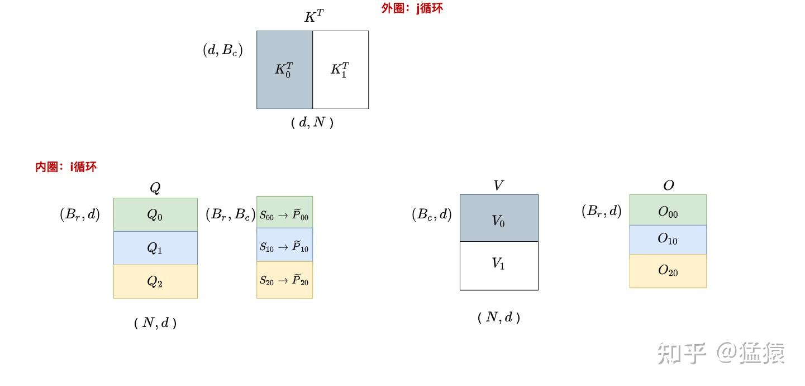
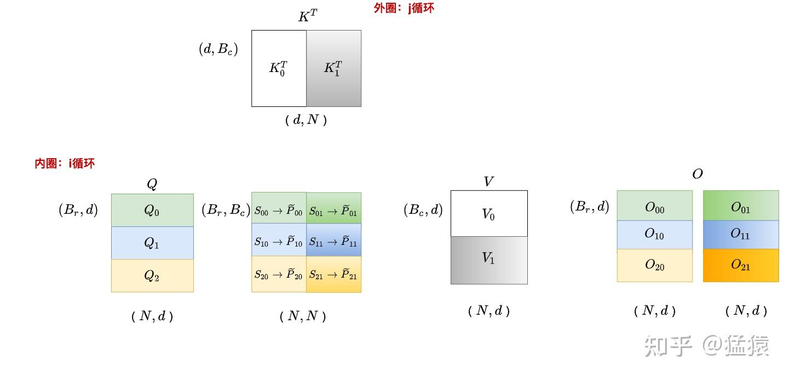
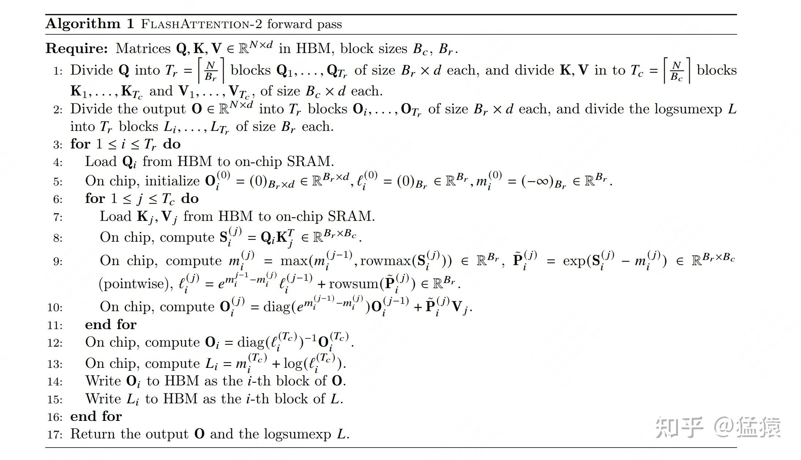
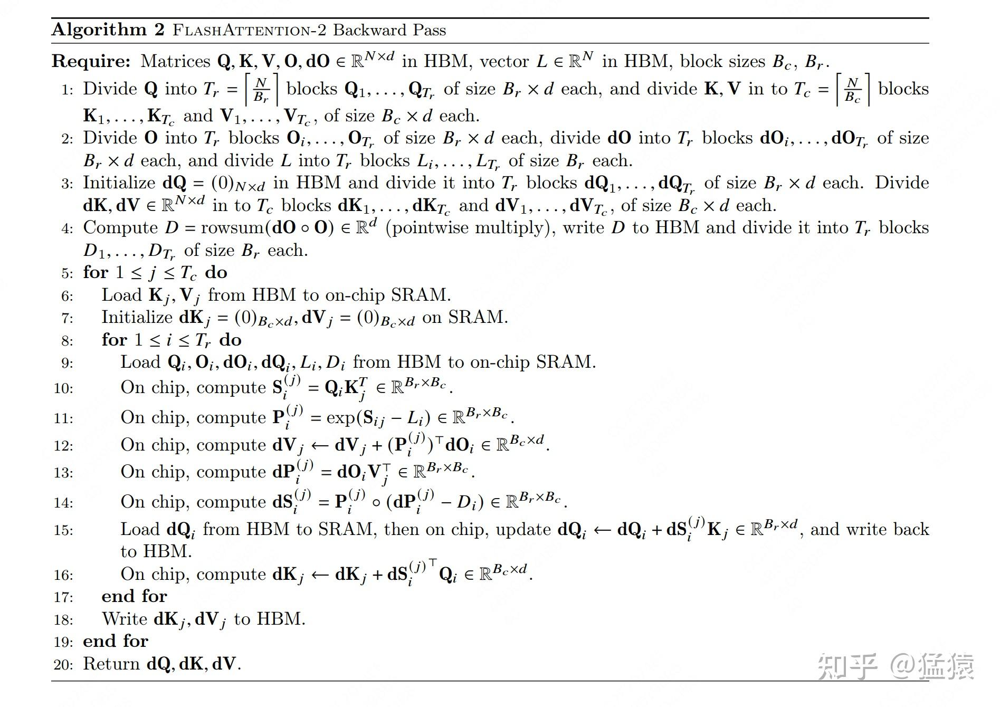
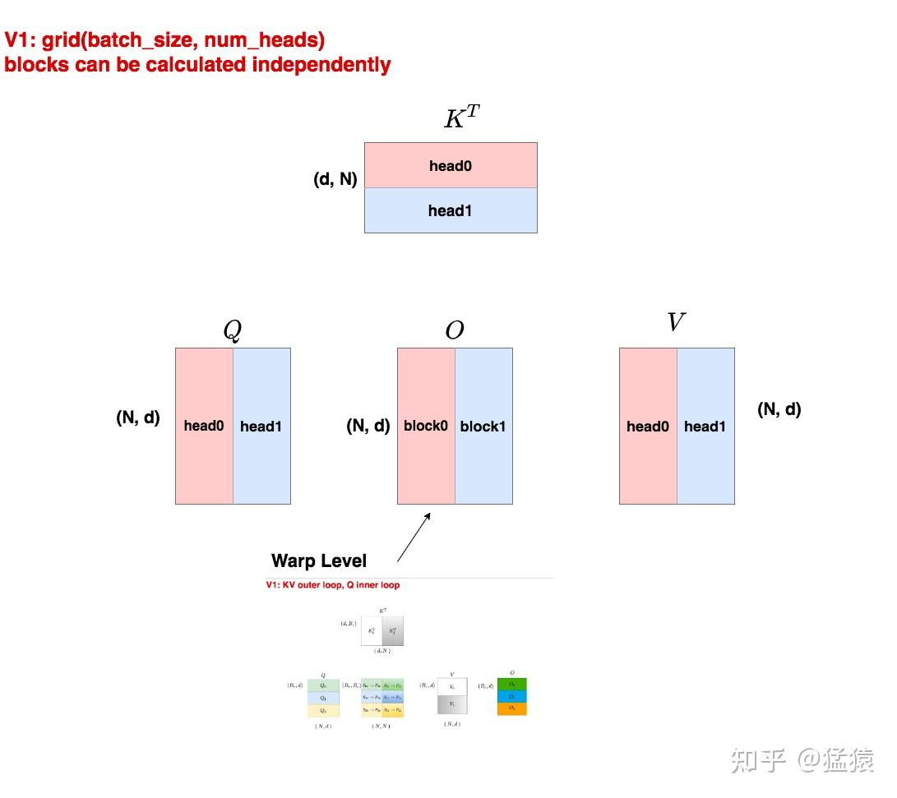
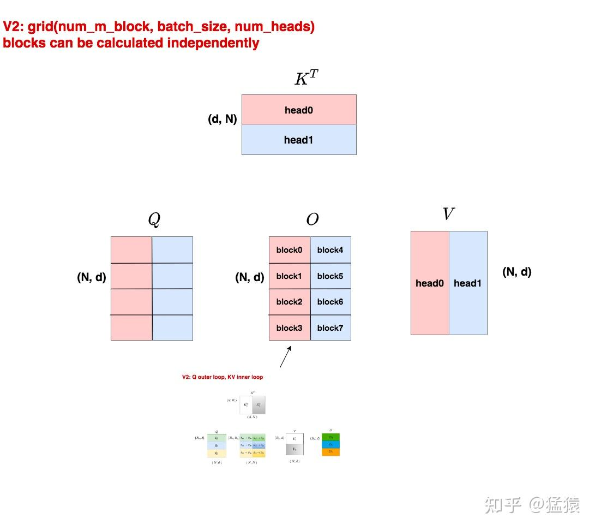
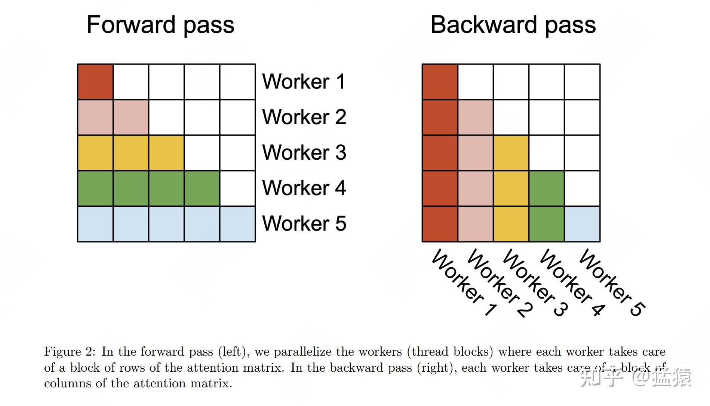
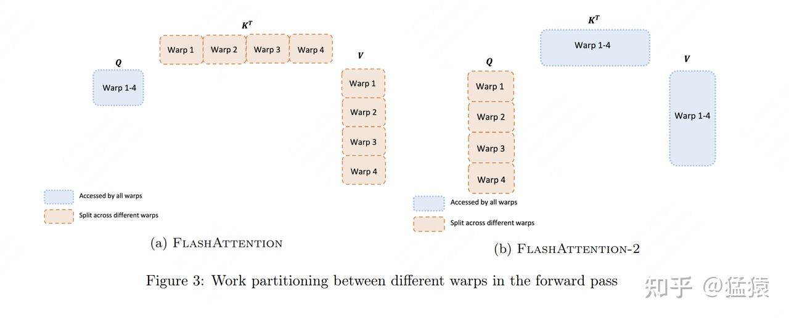
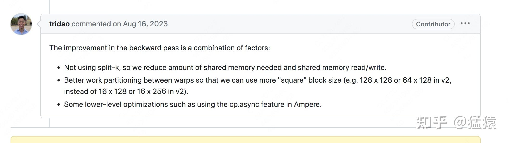

在V1的讲解中，我们通过详细的图解和公式推导，一起学习了Flash Attention的整体运作流程。如果大家理解了V1的这块内容，就会发现V2的原理其实非常简单：**无非是将V1计算逻辑中的内外循环相互交换，以此减少在[shared memory](https://zhida.zhihu.com/search?content_id=241701055&content_type=Article&match_order=1&q=shared+memory&zhida_source=entity)上的读写次数，实现进一步提速。那当你交换了循环位置之后，在[cuda](https://zhida.zhihu.com/search?content_id=241701055&content_type=Article&match_order=1&q=cuda&zhida_source=entity)层面就可以配套做一些并行计算优化。这就是V2的整体内容。**

**所以本文也分两个部分进行讲解：原理与cuda层面的并行计算。**

在阅读本文前，**需要先阅读V1的讲解**，本文会沿用V1的表达符号及推演思路。

**【大模型计算加速系列】**

**[猛猿：图解大模型计算加速系列：FlashAttention V1，从硬件到计算逻辑](https://zhuanlan.zhihu.com/p/669926191)**

**[猛猿：图解大模型计算加速系列：Flash Attention V2，从原理到并行计算](https://zhuanlan.zhihu.com/p/691067658)**

**[猛猿：图解Mixtral 8 \* 7b推理优化原理与源码实现](https://zhuanlan.zhihu.com/p/691066049)**

**[猛猿：从啥也不会到CUDA GEMM优化](https://zhuanlan.zhihu.com/p/703256080)**

**[猛猿：图解大模型计算加速系列之：vLLM核心技术PagedAttention原理](https://zhuanlan.zhihu.com/p/691038809)**

**[猛猿：图解大模型计算加速系列：vLLM源码解析1，整体架构](https://zhuanlan.zhihu.com/p/691045737)**

**[猛猿：图解大模型计算加速系列：vLLM源码解析2，调度器策略(Scheduler)](https://zhuanlan.zhihu.com/p/692540949)**

**[猛猿：图解大模型计算加速系列：vLLM源码解析3，块管理器BlockManager（上篇）](https://zhuanlan.zhihu.com/p/700780161)**

**[猛猿：图解大模型计算加速系列：vLLM源码解析3，Prefix Caching](https://zhuanlan.zhihu.com/p/707228704)（BlockManager下篇）**

**[猛猿：图解大模型计算加速系列：分离式推理架构1，从DistServe谈起](https://zhuanlan.zhihu.com/p/706761664)**

**[猛猿：图解大模型计算加速系列：分离式推理架构2，模糊分离与合并边界的chunked-prefills](https://zhuanlan.zhihu.com/p/710165390)**

**【历史文章汇总】**

**[猛猿：【必看】历史技术文章导航](https://zhuanlan.zhihu.com/p/654910335)**

---

## 一、Flash Attention V2整体运作流程

### 1.1 V1的运作流程

我们先快速回顾一下V1的运作流程：**以K，V为外循环，Q为内循环。**
$j=0$ ，遍历 $i$ :



$j = 1$ ，遍历 $i$ :



为了帮助大家更好理解v1中数据块的流转过程，在图中我们画了6块O。但实际上最终只有三块O： $O_{0}, O_{1}, O_{2}$ 。

以 $O_{0}$ 为例，它可理解成是由 $O_{00}, O_{01}$ 经过某些处理后汇总而来的。进一步说，

- 我们在外循环j = 0时，先遍历一次所有的i，在这个阶段中我们产出 $O_{00}$ ，并将它和一些别的重要数据写回HBM中
- 接下来我们进行第二次外循环，即j=1，在这个阶段中我们产出 $O_{01}$ 。同时我们把 $O_{00}$ 和那些重要的数据从HBM传入shared memory中，然后从shared memory中读取它们，以配合 $O_{01}$ 产出最终的 $O_{00}$

（关于 $O_{00}, O_{01}$ 如何得到 $O_{0}$ 的细节我们在V1讲解中详细推导过，这里不再赘述）

**在这个过程中，你是不是隐隐觉得有些别扭：**

- $O_{00}, O_{01}$ 其实都和 $Q_{0}$ 有关系，那我为什么不以Q为外循环，以KV为内循环做遍历呢？这样我不就能避免往shared memory上读写中间结果，从而一次性把 $O_{00}, O_{01}$ 乃至最终的 $O_{0}$ 给算出来？
- 同时，softmax这个操作也是在row维度上的，所以我固定Q循环KV的方式，更天然符合softmax的特性。

### 1.2 V2的运作流程

基于1.1中的思想，我们在V2中将原本的内外循环置换了位置（示意图就不画了，基本可以对比V1示意图想象出来）。我们直接来看V2的伪代码（如果对以下伪代码符号表示或解读有疑惑的朋友，最好先看一下V1的讲解）。

#### （1）V2 FWD



现在，想象自己固定住了一块Q（i），依此循环K和V的分块（j），在这个想象下我们来解读这份FWD为代码。

- 第8行，计算分块 $S_{i}^{(j)}$
- 第9行：
  - $m_{i}^{(j)}$ 表示截止到当前分块 $S_{i}^{(j)}$ （包含当前分块）为止的rowmax
  - $\tilde{P}_{i}^{(j)}$ 表示使用当前每行最大值计算归一化前的 $P_{i}^{(j)}$ （我们在V1中说过，不带波浪号的P表示(s-rowmax)/rowsum的结果，带波浪号表示(s-rowmax)）
  - $l_{i}^{(j)}$ 表示截止到当前分块 $S_{i}^{(j)}$ （包含当前分块）为止的rowsum
- 第10行： $O_{i}^{(j)}$ 表示截止到当前分块 $S_{i}^{(j)}$ （包含当前分块）为止计算出的O值。由第9和第10行知，当我们固定Q循环KV时，我们每个分块都是用当前最新的rowmax和rowsum计算的，同理对应的 $O_{i}^{(j)}$ 也是用当前最新的rowmax和rowsum计算的。这样当我们遍历完所有的KV时，得到的 $O_{i}^{(j)}$ 就等于最终全局的结果。相关的证明我们在V1讲解中给过，这里不再赘述，只额外提两点：
  - 可能在有些朋友下载的V2论文中，第十行这里O前面的因子项是 $diag(...)^{-1}$ ，这个公式应该是错误的（大家动手推一下就可知，初次看到时让我困扰了很久）。在作者个人主页的[论文链接](https://link.zhihu.com/?target=https%3A//tridao.me/publications/flash2/flash2.pdf)中，这个typo已经被修正。
  - 你可能已发现这个O的计算中缺少归一化的一项 $diag(l_{i}^{(j)})^{-1}$ ，这一项其实放到了第12行做统一计算。**这也是V2优化的一个点：尽量减少非矩阵的计算，因为在GPU中，非矩阵计算比矩阵计算慢16倍。**

比起V1，V2中不用再存每一Q分块对应的 $m_{i}$ 和 $l_{i}$ 了。但是在BWD的过程中，我们仍需要 $m_{i}, l_{i}$ 来做 $S_{i}^{(j)}$ 和 $P_{i}^{(j)}$ 的重计算，这样才能用链式求导法则把dQ，dK，dV正常算出来。V2在这里用了一个很巧妙的方法，它只存一个东西（代码13行，这样又能进一步减少shared memory的读写）： $L_{i} = m_{i}^{(T_{c})} + \log(l_{i}^{(T_{c})})$ ，这个等式中小写的m和l可以理解成是全局的rowmax和rowsum。在接下来BWD的讲解中，我们会来看到这一项的妙用。

#### （2）V2 BWD

**⚠️⚠️一个建议：如果你在阅读本节中觉得很困惑，一定记得先去看V1的BWD部分，有非常详细的推导介绍。看完再来看本节就很顺畅了。**



我们观察到，**在V2 BWD中，内外循环的位置又换回来了，即还是KV外循环，Q内循环，这是为什么呢？**

我们知道在BWD的过程中，我们主要是求 $dV_{j}, dK_{j}, dQ_{i}$ （为了求它们还需要求中间结果 $dS_{ij}, dP_{ij}$ ），**我们来总结一下这些梯度都需要沿着哪些方向AllReduce：**

- $dV_{j}$ ：沿着i方向做AllReduce，也就是需要每行的结果加总
- $dK_{j}$ ：沿着i方向做AllReduce，也就是需要每行的结果加总
- $dQ_{i}$ ： 沿着j方向做AllReduce，也就是需要每列的结果加总
- $dS_{ij}, dP_{ij}$ ：只与当前i,j相关

基于此，如果你还是保持Q外循环，KV外循环不变的话，这种操作其实是固定行，遍历列的，那么在这些梯度中，只有 $dQ_{i}$ 从中受益了，K和V的梯度则进入了别扭的循环（也意味着要往shared memory上写更多的中间结果）；**但如果你采用KV外循环，Q内循环，这样K和V都受益，只有Q独自别扭，因此是一种更好的选择**。（S和P的计算不受循环变动影响）。

前面说过，在BWD过程中读写我们要用全局的 $m_{i}^{(j)}, l_{i}^{(j)}$ 重新计算 $P_{i}^{(j)}$ ，计算公式如下：
$P_{i}^{(j)} = \operatorname{diag}(l_{i}^{(j)})^{-1}\exp(S_{i}^{(j)}-m_{i}^{(j)})$

但如此一来，我们就要从shared memory上同时读取 $m_{i}^{(j)}, l_{i}^{(j)}$ ，似乎有点消耗读写。所以在V2中，我们只存储 $L_{i} = m_{i}^{(j)} + \log(l_{i}^{(j)})$ ，然后计算：
$P_{i}^{(j)} = \exp(S_{i}^{(j)}-L_{i})$

**很容易发现这两个计算是等价的，但V2的做法节省了读写量**

好，现在我们就把V2相对于V1在计算原理上的改进介绍完了。接下来我们总结一下V2相对于V1所有的改进点

## 二、V2相对V1的改进点

之所以把这块内容放到“V2整体流程介绍”之后，是想让大家在先理解V2是怎么做的基础上，更好体会V2的优点。

总体来说，**V2从以下三个方面做了改进：**

- 置换内外循环位置，同时减少非矩阵的计算量。（这两点我们在第一部分中已给出详细说明）
- 优化Attention部分[thread blocks](https://zhida.zhihu.com/search?content_id=241701055&content_type=Article&match_order=1&q=thread+blocks&zhida_source=entity)的并行化计算，新增seq\_len维度的并行，使SM的利用率尽量打满。这其实也是内外循环置换这个总体思想配套的改进措施
- 优化thread blocks内部warp级别的工作模式，尽量减少warp间的通讯和读取shared memory的次数。

第二和第三点都可以归结为是cuda gemm层面的优化，我们马上来细看这两点。

## 三、V2中的thread blocks排布

```cpp
// gridDim in V1
// params.b = batch_size, params.h = num_heads
dim3 grid(params.b, params.h);

// gridDim in V2
const int num_m_block = (params.seqlen_q + Kernel_traits::kBlockM - 1) / Kernel_traits::kBlockM;
dim3 grid(num_m_block, params.b, params.h);
```

**这段代码整合自flash attention github下的cutlass实现，为了方便讲解做了一点改写。**
这段代码告诉我们：

- 在V1中，我们是按batch\_size和num\_heads来划分block的，也就是说一共有`batch_size * num_heads`个block，每个block负责计算O矩阵的一部分
- 在V2中，我们是按batch\_size、num\_heads和num\_m\_block来划分block的，其中num\_m\_block可理解成是沿着Q矩阵行方向做的切分。例如Q矩阵行方向长度为seqlen\_q（其实就是我们熟悉的输入序列长度seq\_len，也就是图例中的N），我们将其划分成num\_m\_block份，每份长度为kBlockM（也就是每份维护kBlockM个token）。这样就一共有`batch_size * num_heads * num_m_block`个block，每个block负责计算矩阵O的一部分。

**为什么相比于V1，V2在划分thread block时，要新增Q的seq\_len维度上的划分呢？**
**先说结论，这样做的目的是尽量让SM打满。** 我们知道block是会被发去SM上执行的。以1块A100 GPU为例，它有108个SM，如果此时我们的block数量比较大（例如论文中所说>=80时），我们就认为GPU的计算资源得到了很好的利用。现在回到我们的输入数据上来，当batch\_size和num\_heads都比较大时，block也比较多，此时SM利用率比较高。但是如果我们的数据seq\_len比较长，此时往往对应着较小的batch\_size和num\_heads，这是就会有SM在空转了。而为了解决这个问题，我们就可以引入在Q的seq\_len上的划分。

**看到这里你可能还是有点懵，没关系，我们通过图解的方式，来一起看看V1和V2上的thread block到底长什么样。**

### 3.1 V1 thread block



假设batch\_size = 1，num\_heads = 2，我们用不同的颜色来表示不同的head。**我们知道在Multihead Attention中，各个head是可以独立进行计算的，在计算完毕后将结果拼接起来即可。所以我们将1个head划分给1个block，这样就能实现block间的并行计算，如此每个block只要在计算完毕后把结果写入自己所维护的O的对应位置即可。**

而每个block内，就能执行V1中的"KV外循环，Q内循环”的过程了，这个过程是由block的再下级[warp level](https://zhida.zhihu.com/search?content_id=241701055&content_type=Article&match_order=1&q=warp+level&zhida_source=entity)层面进行组织，thread实行计算的。这块我们放在第四部分中讲解。

### 3.2 V2 thread block



现在我们继续假设batch\_size = 1，num\_heads = 2。与V1不同的是，我们在Q的seq\_len维度上也做了切分，将其分成四份，即num\_m\_block = 4。所以现在我们共有1\*2\*4 = 8个block在跑。这些block之间的运算也是独立的，因为：

- **head的计算是独立的，所以红色block和蓝色block互不干扰**
- **采用Q做外循环，KV做内循环时，行与行之间的block是独立的，因此不同行的block互相不干扰。**

每个block从Q上加载对应位置的切块，同时从KV上加载head0的切块，计算出自己所维护的那部分O，然后写入O的对应位置。

**在这里你可能想问，为什么只对Q的seq\_len做了切分，而不对KV的seq\_len做切分呢？**
在V2的cutlass实现中，确实也提供了对KV的seq\_len做切分的方法。但除非你认为SM真得打不满，否则尽量不要在KV维度上做切分，因为如此一来，不同的block之间是没法独立计算的（比如对于O的某一行，它的各个部分来自不同的block，为了得到全局的softmax结果，这些block的结果还需要汇总做一次计算）。

### 3.3 seq 并行不是V2特有

如果你看过V1的代码，你会发现，其实在V1后期的版本中，也出现了seq维度的并行：

```cpp
// V1 seq parallel: csrc/flash_attn/src/fmha_fwd_launch_template.h
dim3 grid(launch_params.params.b, launch_params.params.h, launch_params.params.num_splits);

// nums_splits计算方法
// Find the number of splits that maximizes the occupancy. For example, if we have
// batch * n_heads = 48 and we have 108 SMs, having 2 splits (efficiency = 0.89) is
// better than having 3 splits (efficiency = 0.67). However, we also don't want too many
// splits as that would incur more HBM reads/writes.
// So we find the best efficiency, then find the smallest number of splits that gets 95%
// of the best efficiency.
// [2022-11-25] TD: Mark this as "inline" otherwise we get "multiple definition" error.
inline int num_splits_heuristic_fwd(int batch_nheads, int num_SMs, int ctas_per_sm, int max_splits) {
    float max_efficiency = 0.f;
    std::vector<float> efficiency;
    efficiency.reserve(max_splits);
    for (int num_splits = 1; num_splits <= max_splits; num_splits++) {
        float n_waves = float(batch_nheads * num_splits) / (num_SMs * ctas_per_sm);
        float eff = n_waves / ceil(n_waves);
        // printf("num_splits = %d, eff = %f\n", num_splits, eff);
        if (eff > max_efficiency) { max_efficiency = eff; }
        efficiency.push_back(eff);
    }
    for (int num_splits = 1; num_splits <= max_splits; num_splits++) {
        if (efficiency[num_splits - 1] > 0.95 * max_efficiency) {
            // printf("num_splits chosen = %d\n", num_splits);
            return num_splits;
        }
    }
    return 1;
}

....
// 可以发现num_splits也是由Q的seq_len维度切分来的
launch_params.params.num_splits = num_splits_heuristic_fwd(
                launch_params.params.b * launch_params.params.h, dprops->multiProcessorCount,
                ctas_per_sm,
                /*max_splits=*/std::min(30, (launch_params.params.seqlen_q + M - 1 / M))
            );
```

上图代码中的`num_splits`也是在由Q的seq\_len维度切分来的。通过这段代码，我猜想作者在V1后期引入seq\_len维度切分的原因是：**V1也需要解决seq\_len过长时，batch\_size和num\_heads较小而造成SM打不满的问题。**

`num_splits_heuristic_fwd`这个函数的作用概括起来就是，我先提供一连串num\_splits值的备选，然后由这个函数计算出每个备选值下SM的利用率。计算完之后，我先找到最高的利用率，然后再找出满足利用率>=0.95 \* max(利用率)的那个最小的num\_split值，作为最终的选择。

**细心的你此时可能已经观察到了，虽然V1也引进过seq parallel，但是它的grid组织形式时`(batch_size, num_heads, num_m_blocks)`，但V2的组织形式是`(num_m_blocks, batch_size, num_heads)`，这种顺序调换的意义是什么呢？**

直接说结论，这样的调换是为了提升L2 cache hit rate。大家可以看下3.2中的图（虽然block实际执行时不一定按照图中的序号），对于同一列的block，它们读的是KV的相同部分，因此同一列block在读取数据时，有很大概率可以直接从L2 cache上读到自己要的数据（别的block之前取过的）。

### 3.4 FWD和BWD过程中的thread block划分

在3.1～3.3中，我们其实给出的是FWD过程中thread block的划分方式，我们知道V2中FWD和BWD的内外循环不一致，所以对应来说，thread block的划分也会有所不同，我们详细来看：



在图中：

- **worker表示thread block，不同的thread block用不同颜色表示**
- **整个大方框表示输出矩阵O**

我们先看左图，它表示FWD下thread block的结构。每一行都有一个worker，它表示O矩阵的每一行都是由一个thread block计算出来的（假设num\_heads = 1），这就对应到我们3.1～3.3中说的划分方式。那么白色的部分表示什么呢？我们知道如果采用的是casual attention，那么有一部分是会被mask掉的，所以这里用白色来表示。但这不意味着thread block不需要加载白色部分数据对应的KV块，只是说在计算的过程中它们会因被mask掉而免于计算（论文中的casual mask一节有提过）。

我们再看右图，它表示BWD下thread block的结构。每一列对应一个worker，这是因为BWD中我们是KV做外循环，Q做内循环，这种情况下dK, dV都是按行累加的，而dQ是按列累加的，少数服从多数，因此这里thread\_block是按 $K^{T}$ 的列划分的。

## 四、Warp级别并行



讲完了thread block，我们就可以再下一级，看到warp level级别的并行了。左图表示V1，右图表示V2。不管是V1还是V2，在[Ampere架构](https://zhida.zhihu.com/search?content_id=241701055&content_type=Article&match_order=1&q=Ampere%E6%9E%B6%E6%9E%84&zhida_source=entity)下，每个block内进一步被划分为4个warp，在[Hopper架构](https://zhida.zhihu.com/search?content_id=241701055&content_type=Article&match_order=1&q=Hopper%E6%9E%B6%E6%9E%84&zhida_source=entity)下则是8个warp。

在左图（V1）中，**每个warp都从shared memory上读取相同的Q块以及自己所负责计算的KV块**。在V1中，每个warp只是计算出了列方向上的结果，这些列方向上的结果必须汇总起来，才能得到最终O矩阵行方向上的对应结果。所以每个warp需要把自己算出来的中间结果写到shared memory上，再由一个warp（例如warp1）进行统一的整合。**所以各个warp间需要通讯、需要写中间结果，这就影响了计算效率。**

在左图（V2）中，**每个warp都从shared memory上读取相同的KV块以及自己所负责计算的Q块**。在V2中，行方向上的计算是完全独立的，即每个warp把自己计算出的结果写到O的对应位置即可，warp间不需要再做通讯，通过这种方式提升了计算效率。**不过这种warp并行方式在V2的BWD过程中就有缺陷了：由于bwd中dK和dV是在行方向上的AllReduce，所以这种切分方式会导致warp间需要通讯。**

针对V2 warp切分影响BWD这点，作者在论文中依然给出了“BWD过程相比V1也有提升”的结论，针对这点，我在github issue上找到了一条作者的回复（在“安装报错”组成的issue海洋里捞出的宝贵一条）：



最关键的可能是第1和第2点，关于第1点，我想作者应该是说，之前需要反复读取KV的数据，现在只用反复读取Q的数据，因此从一定程度上节省了shared memory的读写次数。第2点理解起来有点复杂，个人觉得是将warp处理的tile划分得更像方形。这样做的好处是在做casual mask的时候可以大块丢掉被mask掉的tile（见论文casual masking部分），进一步加速计算。第3点是关于一些底层的优化，就不提了。

好！关于V2我们就介绍到这了，写这篇文章的时候，我刚粗过了一遍triton的flash attention实现，以及扫了一下cutlass实现的入口。如果后续有时间，我会出一些源码解读的文章。

## 五、参考

1.  [https://arxiv.org/abs/2307.08691](https://link.zhihu.com/?target=https%3A//arxiv.org/abs/2307.08691)
2.  [https://github.com/Dao-AILab/flash-attention](https://link.zhihu.com/?target=https%3A//github.com/Dao-AILab/flash-attention)
3.  [Antinomi：FlashAttention核心逻辑以及V1 V2差异总结](https://zhuanlan.zhihu.com/p/665170554)
