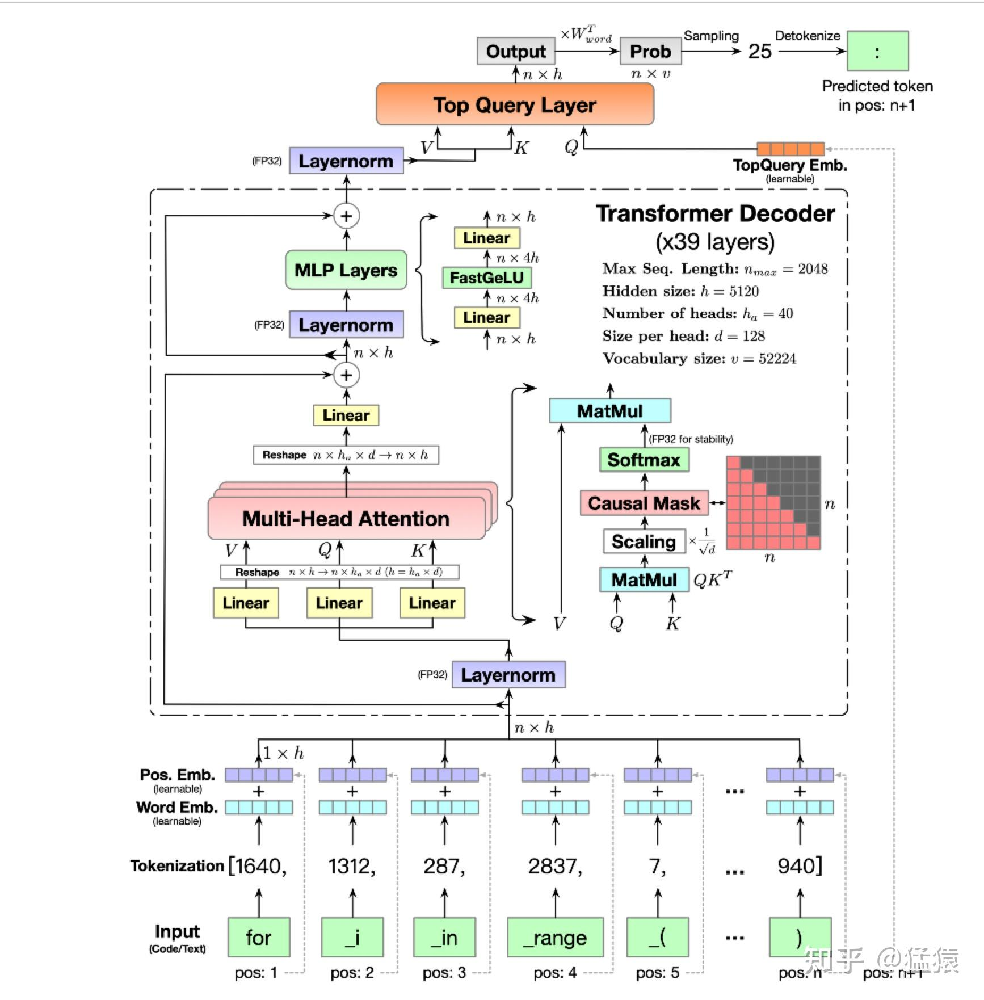

## 一、BatchNorm 与 LayerNorm 的区别

### 1.1 输入张量

假设输入张量为：

$$
X \in \mathbb{R}^{b \times s \times h}
$$

其中：

- $b$ 表示 batch size，也就是一个 batch 中有多少条 sequence。
- $s$ 表示 sequence length，也就是每条 sequence 中有多少个 token。
- $h$ 表示 hidden size，也就是每个 token 的特征维度。



### 1.2 BatchNorm

BatchNorm 可以理解为：**对每个特征维度，统计整个 batch 中所有样本、所有 token 位置上的均值和方差，然后做归一化。**

也就是说，对于第 $z$ 个 hidden feature，BatchNorm 统计的是：

$$
X[:, :, z]
$$

也就是：

```text
所有 batch
所有 token
第 z 个 hidden feature
```

因此它的均值和方差可以写成：

$$
\mu_z = mean(X[:, :, z])
$$

$$
\sigma_z^2 = var(X[:, :, z])
$$

然后对每个位置的该特征做归一化：

$$
Y[x, y, z] = \frac{X[x, y, z] - \mu_z}{\sqrt{\sigma_z^2 + \epsilon}}
$$

所以，BatchNorm 的特点是：

- 固定 hidden 维度。
- 沿 batch 维和 sequence 维统计。
- 统计结果会受到 batch size、sequence length、padding 等因素影响。

### 1.3 LayerNorm

LayerNorm 可以理解为：**对每个 token 的 hidden 向量单独做归一化。**

也就是说，对于第 $x$ 个 batch 中第 $y$ 个 token，LayerNorm 统计的是：

$$
X[x, y, :]
$$

也就是：

```text
某一个 token 的所有 hidden features
```

因此它的均值和方差可以写成：

$$
\mu_{x,y} = mean(X[x, y, :])
$$

$$
\sigma_{x,y}^2 = var(X[x, y, :])
$$

然后对这个 token 的每个 hidden feature 做归一化：

$$
Y[x, y, z] = \frac{X[x, y, z] - \mu_{x,y}}{\sqrt{\sigma_{x,y}^2 + \epsilon}}
$$

实际 LayerNorm 中通常还有可学习参数 $\gamma$ 和 $\beta$：

$$
Y[x, y, z] = \gamma_z \cdot \frac{X[x, y, z] - \mu_{x,y}}{\sqrt{\sigma_{x,y}^2 + \epsilon}} + \beta_z
$$

所以，LayerNorm 的特点是：

- 固定 batch 和 token 位置。
- 沿 hidden 维统计。
- 每个 token 独立归一化。
- 不依赖 batch size 和 sequence length，因此更适合 Transformer / NLP 场景。

### 1.4 直观对比

如果输入是：

$$
X \in \mathbb{R}^{b \times s \times h}
$$

那么：

```text
BatchNorm: X[:, :, z]
固定某个 hidden feature，统计所有 batch、所有 token。

LayerNorm: X[x, y, :]
固定某个 token，统计这个 token 的所有 hidden features。
```

一句话总结：

**BatchNorm 是“同一个特征，在一批样本和 token 上归一化”；LayerNorm 是“同一个 token，在自己的 hidden 特征上归一化”。**

在 Megatron SP 中，activation 是沿 sequence/token 维切开的：

$$
X[:, 0:s/t, :],\ X[:, s/t:2s/t, :],\ \cdots
$$

由于 LayerNorm 只依赖每个 token 自己的 hidden 向量 $X[x, y, :]$，不依赖其他 token，因此按 sequence 维切分不会影响 LayerNorm 的计算。
