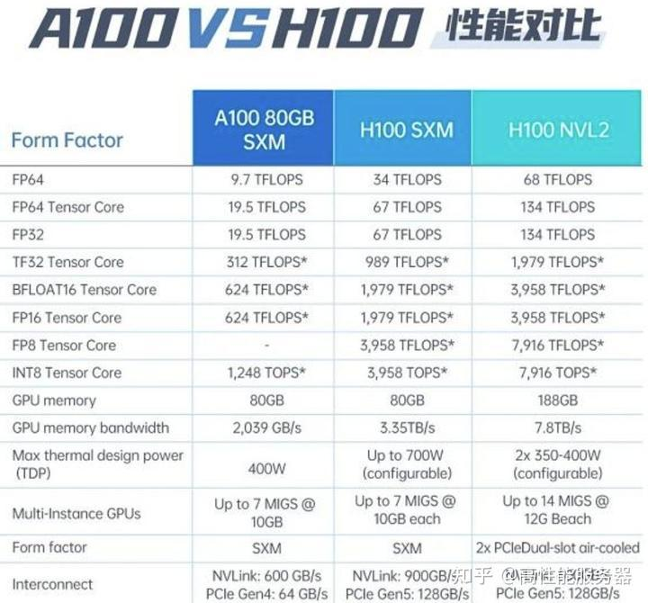
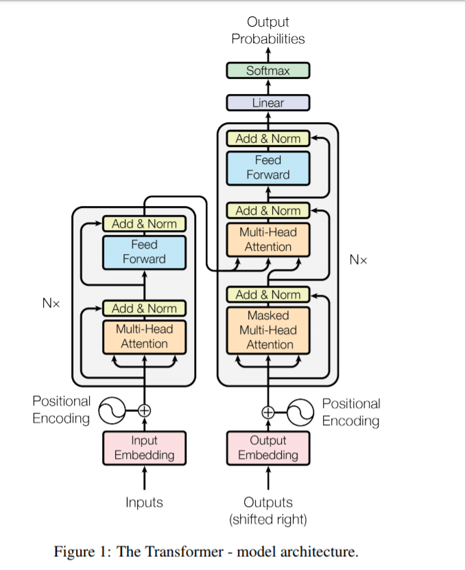
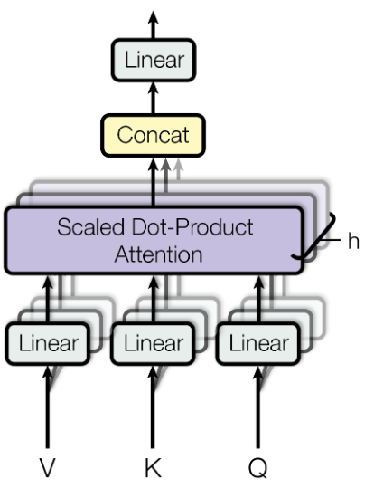
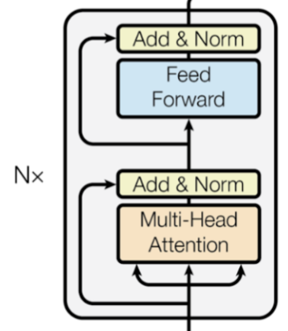

# FLOPs、FLOPS 与 LLM 训练时间估算

## 1. 核心结论

如果只需要快速估算大语言模型训练时间，常用近似是：

$$
\text{训练时间} \approx \frac{6TP}{nX}
$$

其中：

| 符号 | 含义 |
| --- | --- |
| $T$ | 训练语料的总 token 数 |
| $P$ | 模型参数量 |
| $n$ | GPU 数量 |
| $X$ | 每张 GPU 每秒实际完成的浮点运算数，即实际 FLOPS |

这个公式背后的关键近似是：

$$
\text{训练总 FLOPs} \approx 6TP
$$

系数 6 来自三个部分：一次前向中权重矩阵乘法约为 $2TP$；反向传播的计算量约为前向传播的 2 倍；因此一次完整的前向加反向约为 $3 \times 2TP = 6TP$。

注意这里的 $X$ 应使用实测或合理估计的实际 FLOPS，而不是显卡峰值 FLOPS。开启 full activation recomputation 时，经验上分子系数可能更接近 8；selective recomputation 的影响通常小一些。

## 2. FLOP、FLOPs、FLOPS、MACs

| 名词 | 含义 | 用法 |
| --- | --- | --- |
| FLOP | Floating Point Operation，单次浮点运算 | 描述一次加法、乘法等浮点操作 |
| FLOPs | Floating Point Operations，总浮点运算次数 | 描述模型、算法或一次训练所需的总计算量 |
| FLOPS | Floating Point Operations Per Second，每秒浮点运算次数 | 描述硬件或训练系统的计算速度 |
| MACs / MAdds | Multiply-Accumulate operations，乘加累积次数 | 一个 MAC 通常约等于 2 个 FLOPs |
| QPS | Queries Per Second，每秒查询数 | 常用于在线服务吞吐评估 |

FLOPs 和 FLOPS 最容易混淆：前者是“要做多少计算”，后者是“每秒能做多少计算”。训练时间本质上就是：

$$
\text{时间} = \frac{\text{总计算量 (FLOPs)}}{\text{计算速度 (FLOPS)}}
$$

常见 FLOPS 数量级：

| 单位 | 数量级 |
| --- | --- |
| MFLOPS | $10^6$ FLOPS |
| GFLOPS | $10^9$ FLOPS |
| TFLOPS | $10^{12}$ FLOPS |
| PFLOPS | $10^{15}$ FLOPS |
| EFLOPS | $10^{18}$ FLOPS |
| ZFLOPS | $10^{21}$ FLOPS |

## 3. 从矩阵乘法开始

大多数神经网络 FLOPs 估算都绕不开矩阵乘法。设输入矩阵为：

$$
X \in \mathbb{R}^{N \times h}
$$

权重矩阵为：

$$
W \in \mathbb{R}^{h \times o}
$$

输出为：

$$
Y = XW,\quad Y \in \mathbb{R}^{N \times o}
$$

这里的 $N$ 不是模型参数量，也不是 GPU 数量，而是输入矩阵的行数。在 LLM 中，它通常等于这次送进线性层的 token 向量个数；如果一个 step 的 batch size 为 $B$、序列长度为 $s$，则常见情况下：

$$
N = B \times s
$$

这一层的参数只来自权重矩阵 $W$，因此该层参数量是：

$$
P_{\text{layer}} = h \times o
$$

注意 $N$ 只是输入 token 数，不属于参数量。

输出矩阵有 $N \times o$ 个元素。每个元素是长度为 $h$ 的点积，需要 $h$ 次乘法和 $h-1$ 次加法，严格 FLOPs 为：

$$
N \times o \times (2h - 1)
$$

当 $h$ 很大时，常用近似是：

$$
2 N h o
$$

把 $h \times o$ 替换为该层参数量 $P_{\text{layer}}$，就得到：

$$
FLOPs \approx 2 N P_{\text{layer}}
$$

直觉上就是：1 个 token 过这一层时，几乎会用到这一层的所有参数；每用一个参数大约对应 1 次乘法和 1 次加法，所以约为 $2P_{\text{layer}}$ FLOPs。$N$ 个 token 一起过这一层，就约为 $2 N P_{\text{layer}}$ FLOPs。

这个关系是 LLM 中 $6TP$ 估算的基础：把所有层的 $P_{\text{layer}}$ 加起来近似得到模型参数量 $P$，把整个训练过程处理的 token 数加起来得到 $T$，则前向传播主项约为 $2TP$。

## 4. 常见网络层 FLOPs

以下公式都主要统计权重矩阵或卷积核相关的乘加运算，忽略激活函数、LayerNorm、残差、softmax 等相对较小的计算。严格统计时，这些操作也会贡献 FLOPs，但通常不是主项。

### 4.1 全连接层

设输入为 $H \times I$，权重矩阵为 $I \times W$，输出为 $H \times W$。

精确到加法次数时：

$$
FLOPs = H \times W \times (2I - 1)
$$

如果忽略常数项或把 bias 加法也算进去，常用近似是：

$$
FLOPs \approx 2HIW
$$

也就是：

$$
FLOPs \approx 2 \times H \times Parameters
$$

### 4.2 卷积层

设卷积输出空间尺寸为 $H \times W$，输出通道数为 $C_{out}$，输入通道数为 $C_{in}$，卷积核尺寸为 $K \times K$。

精确到每个输出元素的乘加次数：

$$
FLOPs = H \times W \times C_{out} \times (2K^2C_{in} - 1)
$$

常用近似：

$$
FLOPs \approx 2HWC_{out}K^2C_{in}
$$

如果以 MACs 计数：

$$
MACs \approx HWC_{out}K^2C_{in}
$$

因此：

$$
FLOPs \approx 2 \times MACs
$$

### 4.3 LSTM/RNN/GRU 层

对 LSTM 的单个时间步，设输入 embedding 维度为 $E$，隐藏状态维度为 $H$。LSTM 有 4 组门控/变换，每组都涉及输入和 hidden 拼接后的矩阵乘法，所以粗略 FLOPs 为：

$$
FLOPs \approx 4 \times 2(E + H)H
$$

如果统计完整序列，还需要乘以序列长度；如果统计 batch，还需要再乘以 batch size。

## 5. Transformer 与 LLM 的结构来源

LLM 通常以 Transformer decoder block 为核心。每层主要由 Multi-Head Attention 和 FFN 组成，计算主项仍然来自大矩阵乘法。

下文使用这些符号：

| 符号 | 含义 |
| --- | --- |
| $B$ | batch size |
| $s$ | 序列长度 |
| $h$ | hidden size |
| $l$ | Transformer 层数 |
| $V$ | 词表大小 |
| $P$ | 模型参数量 |
| $T$ | 总训练 token 数 |
| $Step$ | 训练 step 数 |

## 6. Transformer 参数量估算

对一个标准 Transformer block，先忽略细小实现差异：

Attention 部分有 $W_Q, W_K, W_V, W_O$ 四个 $h \times h$ 权重矩阵，主参数量为：

$$
4h^2
$$

FFN 部分通常是 $h \to 4h \to h$ 两个线性层，主参数量为：

$$
h \times 4h + 4h \times h = 8h^2
$$

所以单层主参数量约为：

$$
12h^2
$$

总层数为 $l$ 时，模型主体参数量近似为：

$$
P \approx 12lh^2
$$

如果把 bias、LayerNorm、Embedding、LM Head 等都算进去，会得到略有差异的公式。例如：

$$
l(12h^2 + 13h) + Vh
$$

或在单独计算 Embedding 与 LM Head 时写成：

$$
12lh^2 + (2l + 1)h + 2hV
$$

这些口径的差别来自是否计入 bias、LayerNorm、Embedding、LM Head，以及输入输出 embedding 是否共享。对大模型来说，主项 $12lh^2$ 往往占绝大多数，因此估算训练 FLOPs 时通常直接使用 $P$ 或 $12lh^2$。

## 7. LLM FLOPs 的粗估：为什么是 6TP

只考虑权重矩阵乘法时，一次前向传播对每个 token 的计算量近似为：

$$
2P
$$

因为矩阵乘法中每个权重参数大致对应一次乘法和一次加法。

一个 step 中输入 token 数为：

$$
Bs
$$

所以前向传播每 step 的 FLOPs 约为：

$$
2BsP
$$

反向传播通常约为前向传播的 2 倍，因此前向加反向每 step 约为：

$$
6BsP
$$

训练 $Step$ 步时，总 token 数为：

$$
T = Step \times B \times s
$$

因此总训练计算量为：

$$
FLOPs \approx 6 \times Step \times B \times s \times P = 6TP
$$

这就是训练时间公式分子的来源。

## 8. LLM FLOPs 的细化公式

粗估公式把 Attention 矩阵、LM Head 等都并入“较小项”中。更细一点，可以按 Transformer 每层拆开。

每层前向传播的主要 FLOPs：

| 模块 | FLOPs |
| --- | --- |
| Q、K、V 三个线性变换 | $6Bsh^2$ |
| $QK^T$ 得到 attention matrix | $2Bs^2h$ |
| attention matrix 乘 $V$ | $2Bs^2h$ |
| attention 输出投影 $W_O$ | $2Bsh^2$ |
| FFN: $h \to 4h \to h$ | $16Bsh^2$ |

每层相加：

$$
24Bsh^2 + 4Bs^2h
$$

所有层加上 LM Head 后，每 step 前向传播 FLOPs 为：

$$
l(24Bsh^2 + 4Bs^2h) + 2BshV
$$

前向加反向约为前向的 3 倍，所以每 step 训练 FLOPs 为：

$$
72Bslh^2 + 12Bs^2lh + 6BshV
$$

也可以整理为：

$$
72Bslh^2 \left(1 + \frac{s}{6h} + \frac{V}{12lh}\right)
$$

三项分别对应：

| 项 | 来源 | 什么时候可忽略 |
| --- | --- | --- |
| $72Bslh^2$ | QKV、输出投影、FFN 等权重矩阵乘法 | 主项，不忽略 |
| $12Bs^2lh$ | attention matrix 与 attention over values | 当 $s \ll 6h$ 时相对较小 |
| $6BshV$ | LM Head | 当 $V \ll 12lh$ 时相对较小 |

以 LLaMA-13B 的量级看，$h=5120$，$6h=30720$；常见训练序列长度在 1k 到数 k 时，attention 的二次项相对主项并不大。$12lh$ 也通常远大于词表大小，因此 LM Head 也常能忽略。

所以在大模型训练估算里：

$$
72Bslh^2 \approx 6Bs \times 12lh^2 \approx 6BsP
$$

继续乘以 step 数，就回到：

$$
FLOPs \approx 6TP
$$

这里要小心一个常见误解：Attention 的复杂度确实含有 $s^2$ 项，但训练总时间不一定随序列长度平方增长。若总 token 数、模型大小和实际 FLOPS 固定，主项主要由 $T$ 和 $P$ 决定；序列长度增加带来的额外成本主要体现在 $\frac{s}{6h}$ 这一相对项上。若固定 batch 中的样本数而直接增大 $s$，每 step 的 token 数也会增加，此时每 step 时间仍会增长。

## 9. 训练时间估算方法

先估算总训练 FLOPs：

$$
C_{train} \approx 6TP
$$

再除以训练系统的实际总 FLOPS：

$$
\text{训练时间} \approx \frac{C_{train}}{nX} = \frac{6TP}{nX}
$$

例如训练一个 13B 模型，训练数据约 100B tokens，使用 40 张 A100，每张卡实际约 180 TFLOPS：

$$
\text{训练时间} =
\frac{6 \times 100 \times 10^9 \times 13 \times 10^9}
{40 \times 180 \times 10^{12}}
= 1{,}083{,}333\ \text{秒}
\approx 12.5\ \text{天}
$$

这个估算没有显式加入通信、数据加载、保存 checkpoint、坏卡重启、并行策略效率等工程因素。实际排期时可以在公式结果上留出额外 buffer。

## 10. 如何反推出当前实际 FLOPS

如果已经跑了几个 step，可以用 step time 反推出训练系统的实际 FLOPS。

设每 step 训练 FLOPs 为 $C_{step}$，step 用时为 $\tau$ 秒，GPU 数量为 $n$，则每张 GPU 的实际 FLOPS 为：

$$
X \approx \frac{C_{step}}{n\tau}
$$

其中 $C_{step}$ 可用粗估：

$$
C_{step} \approx 6BsP
$$

也可以用细化公式：

$$
C_{step} =
72Bslh^2 + 12Bs^2lh + 6BshV
$$

如果训练框架能给出吞吐 $R$ tokens/s，且这是全局吞吐，则：

$$
\text{总 FLOPS} \approx 6PR
$$

每张卡实际 FLOPS：

$$
X \approx \frac{6PR}{n}
$$

进一步可以计算模型 FLOPS 利用率：

$$
MFU \approx \frac{\text{每张卡实际 FLOPS}}{\text{每张卡理论峰值 FLOPS}}
$$

这比只看 samples/s 更稳定，因为不同模型参数量不同，samples/s 不能直接比较训练效率。

## 11. 快速使用清单

1. 明确训练 token 数 $T$：数据大小最好换算到 token，而不是只看 GB/TB。
2. 明确模型参数量 $P$：可以使用官方参数量，或用 $P \approx 12lh^2$ 快速估计。
3. 估算实际 FLOPS $X$：优先短跑几个 step 反推；没有实测值时再用理论峰值乘利用率。
4. 检查是否 full activation recomputation：若开启，系数可能从 6 接近 8。
5. 用 $\frac{6TP}{nX}$ 得到理想训练时间，再为通信、IO、checkpoint、故障和调参留 buffer。

## 12. 易错点

| 易错点 | 正确处理 |
| --- | --- |
| 把 FLOPs 和 FLOPS 混用 | FLOPs 是总计算量，FLOPS 是每秒速度 |
| 用显卡理论峰值直接代入 $X$ | 应使用实际 FLOPS；理论峰值只适合作为上限 |
| 忽略精度差异 | FP32、TF32、FP16、BF16、INT8 的峰值差别很大 |
| 只按数据字节数估算 $T$ | 不同 tokenizer 和语料结构会改变 token 数 |
| 认为序列长度一定导致平方级训练时间 | Attention 有 $s^2$ 项，但主计算常由权重矩阵乘法主导 |
| 忘记激活重计算 | full recomputation 会用更多计算换显存 |
| 把训练公式套到推理 | 推理尤其是自回归 decoding、KV cache、batching 的计算结构不同 |

## 13. 参考来源

- MrYXJ：《训练模型算力的单位：FLOPs、FLOPS、Macs 与 估算模型（FC, CNN, LSTM, Transformers&&LLM）的FLOPs》，知乎，https://zhuanlan.zhihu.com/p/649993943
- Ethan Yan：《语言模型的训练时间：从估算到 FLOPs 推导》，知乎，https://zhuanlan.zhihu.com/p/646905171
- Vaswani et al., Attention Is All You Need, https://arxiv.org/pdf/1706.03762.pdf
- Marius Hobbhahn and Jaime Sevilla, What's the backward-forward FLOP ratio for Neural Networks?, https://epochai.org/blog/backward-forward-FLOP-ratio
- Microsoft Megatron-DeepSpeed FLOPS 相关实现，https://github.com/microsoft/Megatron-DeepSpeed/blob/9b42cdb16c32d18c2116d589e2936e6398f247dd/megatron/utils.py#L248
