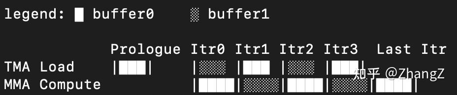
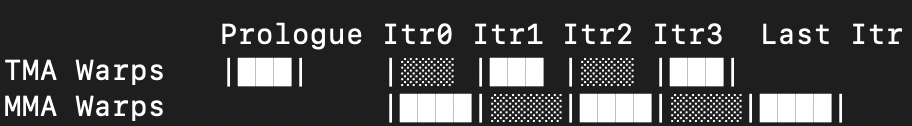
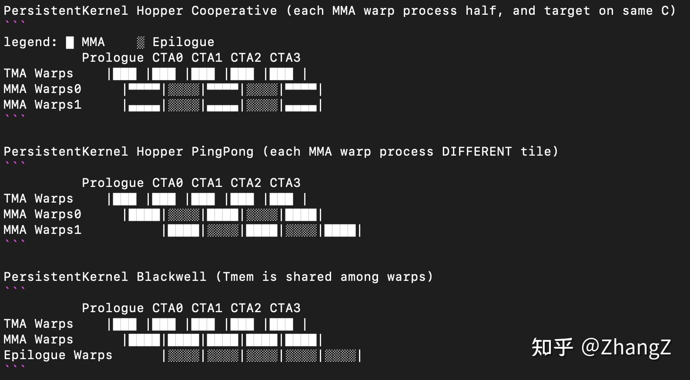
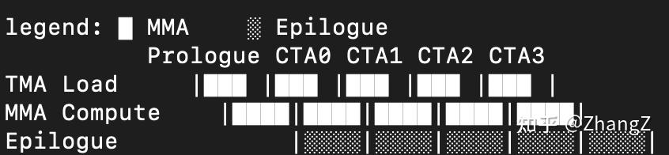

本文的核心重点是 **Software Pipelining (SWP)**。 Software pipelining 是一种调度技术，它将不同循环迭代的操作在时间上重叠，以隐藏硬件延迟并使执行单元保持最大忙碌状态。在现代 GPU 编程中，SWP 并不是孤立存在的；它与其他两个关键范式高度相关：**Warp Specialization**(WASP) 和 **Persistent Kernels**。

在接下来的章节中，我们将探讨使 SWP 成为可能的ISA演进(Pre-Ampere -> Ampere -> Hopper -> Blackwell)，介绍 Warp Specialization 和 Persistent Kernels，并解释它们之间深度的关系。为了feed日益快速的计算单元（如 Tensor Cores），硬件必须将内存操作/TensorCore/SFU完全解耦，理解这种流水线演进是解锁峰值性能的关键。

写完了之后才发现最重要的讨论在后面。希望大家能耐心看到那里。也欢迎讨论。

Software-pipeline (CTA-aligned overlapping)：

Warp Specialization：

对于Persistent Kernel，我们把一整个MMA或者Epilogue代替上面的每一个小的iteration。

Persistent Kernel (CTA-aligned SWP, No WASP)

Outer Loop: CTA0 -> CTA1 -> CTA2 … Inner Loop: K0 -> K1 -> K2 …

## 1. 数据移动的演进：从 Pre-Ampere 到 TMA

在硬件加速的`cp.async`出现之前，数据移动是一个低效的同步过程。在 **Pre-Ampere** 架构（如 Volta 或 Turing）中，将数据从全局内存移动到共享内存需要线程执行标准的同步内存指令：首先使用 `ld.global` 将数据加载到本地register file，然后使用 `st.shared` 将数据写入smem。为了最大化内存带宽，开发者依赖向量修饰符（如 `.v4`）在单条指令中每个线程最多移动 **16 字节（128 位）**。这种方法大量占用寄存器容量并阻塞执行单元直到操作完成。

Ampere 通过引入 `cp.async` 指令来缓解这个问题，该指令绕过寄存器文件进行内存传输，使直接的gmem到smem拷贝成为可能而不会阻塞执行单元。然而，这仍然是每个线程的操作，严格的拷贝大小限制仍然被限制在每个线程 **16 字节**。

Hopper 更进一步，引入了 Tensor Memory Accelerator (TMA) 和 `cp.async.bulk` 指令族。这完全解除了每线程指令宽度限制，允许单个”leader”线程发起任意大小的异步加载，主要受threadblock的smem总量限制。

| 特性 | Pre-Ampere (同步) | Ampere (cp.async) | Hopper (TMA / cp.async.bulk) |
| ----- | ----- | ----- | ----- |
| 主要指令 | (ld.global + st.shared) or (ld.shared + st.global) | cp.async | cp.async.bulk.tensor |
| 最大拷贝大小限制 | 每线程 16 字节（通过 .v4） | 每线程 16 字节 | 任意批量大小（至 SMEM 限制） |
| 范围 | 逐元素同步拷贝 | 逐元素异步拷贝 | 1D 到 5D 张量的批量传输 |
| 执行 | 线程阻塞和停顿 | Warp 中所有 32 个线程发起拷贝 | 单个”leader”线程发起整个批量拷贝 |
| 方向 | gmem → reg → smem or smem → reg → gmem | async单向（仅gmem到smem可以cp.async，reg/smem到gmem还得用同步st.global） | async双向（gmem到smem，以及smem到gmem） |
| 地址计算 | 由线程软件计算 | 由线程软件计算 | 由 TMA 硬件根据tensormap自动计算 |
| 同步 | __syncthreads()（追踪线程到达） | wait_group（追踪指令完成） | mbarrier（追踪精确字节/arrive count） |
| Cluster 支持 | 无 | 无 | 支持multicast到多个 SM |

## 2. 批量传输：`.bulk` vs. `.tensor`

在使用 Hopper 的 TMA 引擎时，开发者根据数据的复杂程度选择两种主要指令变体：

-   `cp.async.bulk`：设计用于移动简单的、一维连续内存数组。要求16byte的倍数.
-   `cp.async.bulk.tensor`：专门设计用于多维数据，从 1D 到 5D 张量。

要执行 `.tensor` 变体，硬件需要一个特殊的描述符称为 Tensor Map，它指定多维结构如何映射到内存。将此描述符传递给 TMA 引擎可带来巨大的性能收益：

-   **寄存器效率：** 硬件自动处理所有复杂的多维地址计算和步长stride，使执行线程免于在地址计算上消耗宝贵的寄存器容量。
-   **硬件级预测：** 硬件自动处理oob fill（例如，返回0或者NaN），无需程序员编写缓慢的显式软件分支逻辑。
-   **自动 Swizzling：** Tensor Map 指定数据进入共享内存时的排列方式，允许硬件动态应用 swizzling 模式以防止后续消费数据时发生共享内存 bank conflict。

## 3. 同步的转变：`wait_group` vs. `mbarrier`

由于 Hopper 将数据移动（TMA）与数学计算（Tensor Cores）完全分离到不同的 warp，旧的让线程等待自己的指令完成的方法（`wait_group`）已经过时。Hopper 用 `mbarrier`取代了它。

`mbarrier` 不是追踪线程到达，而是追踪**数据量**。producer warp 在后台发起 TMA 加载并用预期的字节数配置 `mbarrier`。consumer warp（处理数学计算）在 `mbarrier` 上安全地挂起。一旦精确字节数安全到达共享内存，屏障才会释放 consumer。这种解耦确保昂贵的 Tensor Cores 永远不会被浪费在管理内存上；它们只会为特定缓冲区未准备好而短暂暂停.

## 4. Phase Flip

追踪这种异步交接的核心机制是”phase flip”。用的是经典的sense reversing barrier，硬件使用简单的奇偶校验位追踪屏障状态（0 表示偶数阶段，1 表示奇数阶段）。

使用 phase flip 解锁关键的流水线收益：

-   **mbarrier Reuse：** 初始化屏障时，其阶段为 0。一旦一批数据到达，阶段翻转为 1，然后为下一批翻回 0。因为屏障只是来回切换其奇偶校验位，精确相同的内存地址可以在无数次循环迭代中无限重用。
-   **Race Condition预防：** 通过严格追踪这些 phase flip，硬件确保对缓冲区的所有后台内存写入在计算读取开始之前完全完成。在双缓冲流水线中，consumer warp 在阶段 `0` 上进行数学计算，然后翻转相应的”empty\_barrier”阶段以向 producer warp 信号缓冲区已空闲。这种严格的所有权交接防止快速的 producer 意外覆盖仍然在计算的慢速 consumer 的缓冲区。
-   **极低开销：** 显式阶段追踪比传统的 token 或 `__syncthreads()` 效率高得多，因为它允许单个线程设置arrive count和transaction count，而其他线程只需轮询phase bit。

注意：`mbarrier.wait(phase=1)` 在一开始的时候直接等1，此时标记是mbarrier处于phase 0，所以1是结束的状态，non-blocking直接过。

## 5. Memory Proxies 和 Visibility

由于计算和内存移动完全解耦到不同的硬件单元，GPU 内存一致性模型将这些操作分类到不同的”proxies”——硬件单元访问内存的专门路径。

-   **Generic Proxy：** 处理由标准 CUDA 线程执行的正常同步内存操作。e.g. ld, st.
-   **Async Proxy：** 处理由 TMA 引擎发起的后台硬件加速批量内存传输。
-   **Tensormap Proxy：** 专门为与 Tensor Maps 相关的内存访问建立排序保证。

**Proxy 分离规则：** 因为标准数学计算（Generic Proxy）和异步内存拷贝（Async Proxy）使用不同的路径，标准线程本地内存排序不足以保证一个单元看到另一个单元写入的数据。

为了弥补这一差距，开发者必须使用显式的跨代理同步。例如，如果标准线程在共享内存中初始化 `mbarrier`，它必须发出 `fence.proxy.async` 指令。此 fence 强制 Async Proxy（ TMA 引擎）“看到” Generic Proxy 所做的初始化，确保后台硬件知道屏障已准备好追踪进入的数据。相反，Async Proxy 中完成的操作一旦被观察到就会自动对 Generic Proxy 可见，这意味着计算线程可以在 phase flip 后立即读取数据。

## 6. Persistent Kernels：宏观层面的 Software Pipelining

**Persistent kernels 作为软件流水线的额外更高层。** 传统 SWP 在单个 tile 计算的内循环中重叠指令，persistent kernels 将这种重叠提升到涵盖多个 tile 的整个生命周期，具体针对 kernel 的 prologue mainloop epilogue。

在传统的执行模型中，GPU 为每个输出 tile 发起一个新的线程块。这会产生线程块启动的重复开销，每个块都必须经历未重叠的”prologue”（填充初始内存流水线）和”epilogue”（排空流水线并将结果写回全局内存）。

相反，**persistent kernel** 发起少量固定数量的线程块——通常仅够填充 GPU 上的所有 Streaming Multiprocessors (SM)——并让它们在整个工作负载期间保持活动。这些 persistent 块运行内部循环，不断从工作队列（Tile Scheduler）中获取新的输出 tile，直到处理完整个矩阵。

通过这样做，persistent kernels 将软件流水线范式扩展到宏观层面：

-   **摊销开销：** 启动开销和初始 prologue 设置每个 SM 只会发生一次，而不是每个矩阵数千次。
-   **Epilogue 与计算重叠：** 在 Hopper 等先进架构中，CUTLASS 等框架使用”Warp-Specialized Persistent Ping-Pong”设计。在此模型中，两个不同的 consumer warp 组被分配完全不同的输出 tile。当 Consumer Group A 完成其数学计算并进入高延迟 epilogue 阶段（将累加器写入全局内存）时，Consumer Group B 已经在为下一个 tile 执行 Tensor Core 数学运算。

这有效地将 prologue 和 epilogue 从序列化瓶颈转变为完美隐藏在相邻 warp 组的连续 Tensor Core 计算背后的后台操作，创建完全重叠的连续处理流水线。 但是注意，像我上面说的Persistent Kernel不是只能在WASP才能实现。

最后再在这里定义下Cooperative和Pingpong的区别：

-   Cooperative：两个consumer都在处理同一片output tile，但是是分成两个部分同时进行。每一个warp就消耗原先一半的register
-   Pingpong：两个consumer交错分别处理各自一片完整的output tile，就是一个进行epilogue的时候另一个进行MMA。扩展来说FA3的MMA+Softmax，FA4的MMA+Softmax+Correction都是Pingpong。

注意producer-consumer之间的错位严格来讲不算pingpong，因为他们的行为完全不同。pingpong指的是一模一样的instructions，但是岔开了执行。

## 7. 讨论：为什么有了 Warp Specialization 仍然需要 Software Pipelining

这里先厘清一下概念：

-   我理解的SWP是利用了double buffer，multi-buffer的都算。所以其实WASP也是一个SWP
-   Ampere时期,用async operation在iteration之间做overlapping我们就叫它CTA-aligned SWP, 因为整个CTA所有的warp是一致的。

为了避免读（比如MMA）和写（比如TMA）在同一块smem上竞争, Multi-buffer总归是要的。区别是WASP是利用了producer-consumer的模式直接把它们放到不同的warp上同时进行，而CTA-aligned SWP让他们在相同warp的不同的iteration之间同时处理, 这里必须要有async operation的支持。

那么问题来了，相比于CTA-aligned SWP，WASP的优势是什么？ 要回答这个问题我们先看看WASP的历史，第一次被提出来其实是在2011年，一篇叫做**CudaDMA**的论文。当时还是在Tesla卡上（只有14个SM）。在那个时候就已经有了double buffer来交错compute和load的想法了。 所以可能的时间先后顺序其实**是先有的1. Tesla WASP，2. 然后在Ampere这里主流的做法是CTA-aligned。3. 最后在Hopper这里才又回归了WASP**。

我这里写一下网上收集到的和我自己的一些观点，欢迎探讨：

1.  **Pre-Ampere 为什么是WASP**：ld/st/mma都是同步计算，无法做到iteration间overlapping
2.  **Ampere为什么是CTA-aligned**：

1.  1\. cp.async的出现支持了mma可以循环算，然后在中间穿插cp.async
2.  2\. WASP需要额外的warps，这些造成了额外的register开销。（cp.async明明需要更少的register，但是load warp和MMA warp 分配的register一样多)
3.  3\. 方便书写，所有warp都是一个样，而且不用考虑warp间同步。
4.  4\. 其他观点我都不是太赞同，比如CTA-aligned multi-stage需要更深的buffer。其实WASP和buffer的深度并不冲突。比如FA4就有6个stage的buffer，更深的buffer只是提供更长的”跑道”来预取数据。缓冲区越深，为gmem访问的不可预测延迟做准备的时间就越多，确保数据在 Tensor Cores 需要它进行未来 GEMM 计算时已经完美就绪。不管CTA-aligned还是WASP都需要它。

4.  **Ampere -> Hopper: 用WASP的收益又在哪里**？这个讨论的多一些

1.  1\. 首先就是setmaxnreg的支持，有了warp specialized register allocation，WASP的收益才能体现出来不是。
2.  2\. TMA register收益：单线程发射，而且有专门的hardware算地址和oob检查，都是为了省register开路
3.  3\. 基于mbarrier的sync方式：基于mbarrier的sync方式相比较于基于thread的方式比如syncthread或者wait\_group，要更灵活。解耦了读和写，天然适配producer-consumer模式. 而基于thread的sync方式由于是写在同一个warp里，要考虑触发的时机，不能太早也不能太晚。虽然早在Ampere就有了mbarrier，但是没有setmaxnreg，就没有register收益。
4.  4\. 有人说是WASP支持了pingpong，所以可以overlap MMA和Epilogue。我不赞同这一点，因为实际上Persistent Kernel并不一定需要WASP，CTA-aligned SWP也是支持的，就是多加一层外循环的事。而且如果对于out smem也做了multi-stage的话，也是可以实现MMA + Epilogue overlap的，在CTA-aligned SWP的情况下。

6.  **Hopper -> Blackwell: 现在的新硬件有啥不一样？**

1.  1\. TMA, TCGen05 都是一个thread直接发射，那就分别用一个小register的warp吧
2.  2\. 现在所有的register压力都跑到了Epilogue这里（或者其他需要用到CUDACore的操作），他们必须得把vector从tmem里load到珍贵的regsiter里。所以GEMM的epilogue warp需要4/8个
3.  3\. TCGen05的结果不再用register的另一个巨大的影响是，它不必和epilogue放到一起了。之前的wgmma结果总要放到register里，单开一个epilogue warp没有收益，不如直接接到MMA后面把register直接存到gmem里。现在不一样了，register可以分配给专门的warp里从tmem里读

Reference：

为什么Hopper架构上warp-specialization比multi-stage要好？ - Titus的回答 - 知乎

[为什么Hopper架构上warp-specialization比multi-stage要好？](https://www.zhihu.com/question/11261005710/answer/93139551976)

为什么Hopper架构上warp-specialization比multi-stage要好？ - 霸王手枪腿的回答 - 知乎

[为什么Hopper架构上warp-specialization比multi-stage要好？](https://www.zhihu.com/question/11261005710/answer/120008943249)

* * *

更新 2026.04.09

一开始我叫非WASP的SWP为iteration-based，但是这个命名明显是不对的，谁还不是iteration-based。但是iteration-overlapping感觉也是不准确。所以我改成CTA-aligned SWP。整个CTA里大家都是一致的。但是这个命名没体现inter-iteration-overlapping的角度。就先姑且这样了。

发现知乎上没有人提[twill nvidia](https://link.zhihu.com/?target=https%3A//arxiv.org/html/2512.18134v1)，这篇工作用经典的modulo scheduling来生成最优的WASP情况下的SWP。推荐阅读，我可能后面也会水一篇解读。这篇分的就很清楚，SWP是一个调度概念，而WASP是实现他的一种programming paradigm。
