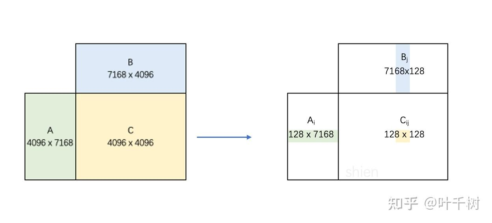
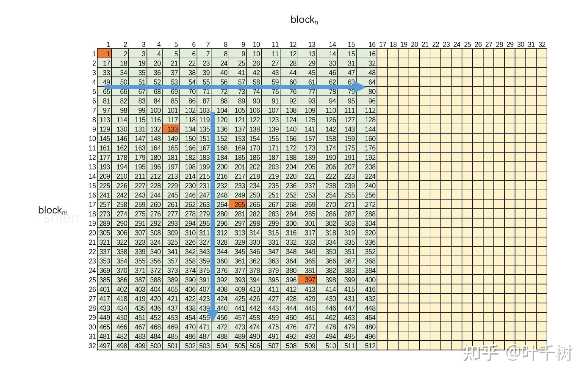
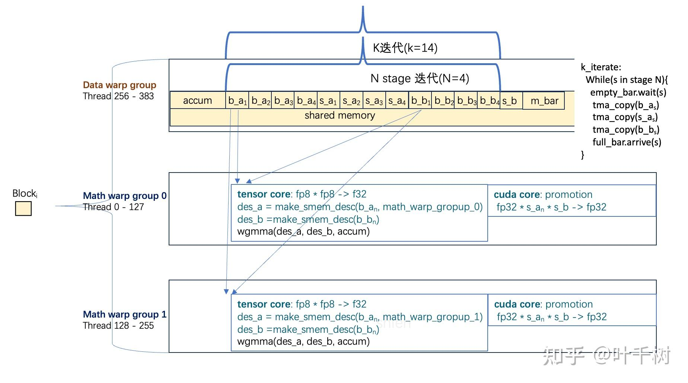
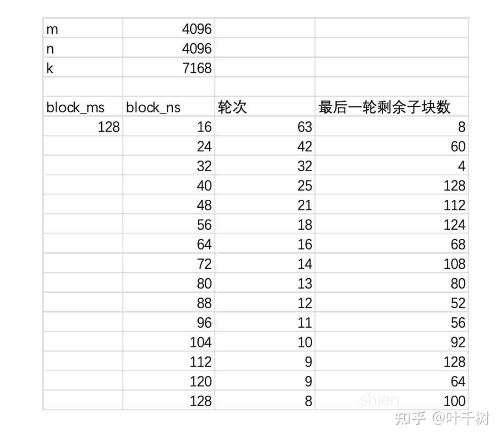
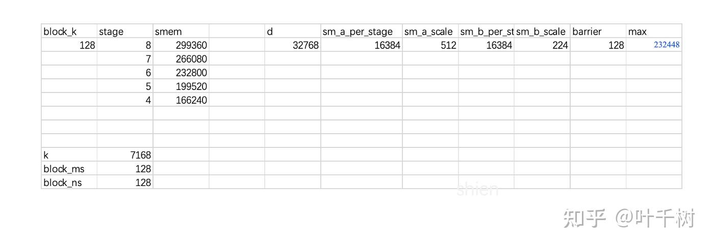
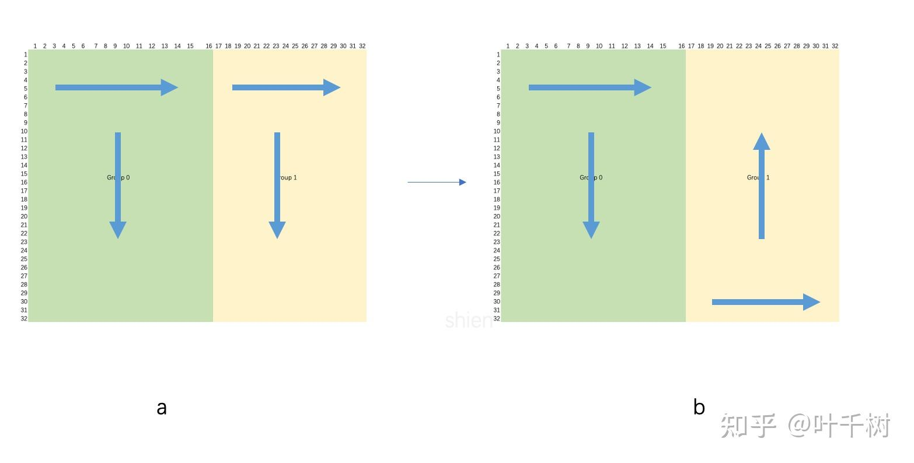
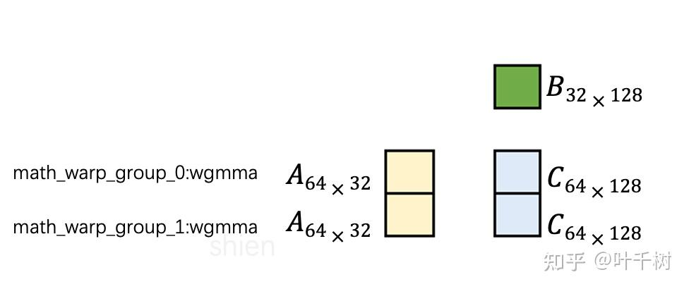
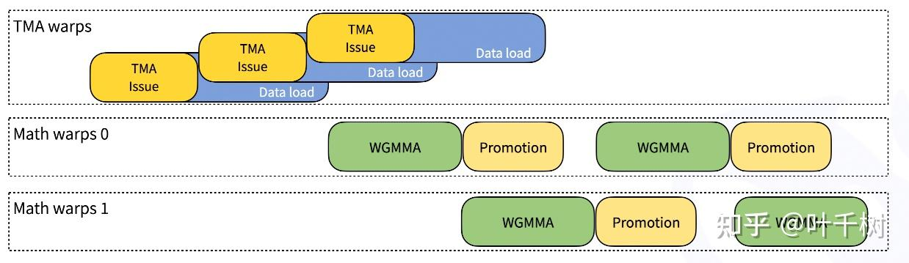

DeepSeek开源[DeepGEMM](https://link.zhihu.com/?target=https%3A//github.com/deepseek-ai/DeepGEMM), 如其ReadME中提到的，代码库非常简洁，适合用于学习理解cuda/ptx程序逻辑和实现GEMM计算（General Matrix Multiplication, 通用矩阵乘法）。（This makes it a clean and accessible resource for learning Hopper FP8 matrix multiplication and optimization techniques）。

虽然总体代码不多，但是包含了诸多技巧， 如为了减少读取显存带来的延迟，使用了persistent warp-specialization。 持久化内核（persistent warp），内核在SM中长驻，同一个内核block会依序处理多个矩阵子块的计算。线程特化（warp-specialization）,每个内核block启用3 x 128线程，线程 0-255用于wgmma矩阵计算（math warp group 0, math warp group 1），线程256-383用于将数据从显存读取到SM共享内存中。用两个wgmma矩阵计算线程来重叠（overlap）减少 fp8计算结果scale up（fp32 \* scale -> fp32）的成本。

此外在代码库中包含c++, cuda, ptx等多种编程语言，代码理解成本较高。期望通过本文，能够理解cuda/ptx的代码特性，以及理解DeepGEMM中展现优化技巧。

## 分块矩阵乘法



如图1所示，在大矩阵乘法中 $A_{4096\times7168} \times B_{7168\times4096} \rightarrow C_{4096\times 4096} (m=4096, n=4096, k=7168)$ ， 为了充分提高GPU的高并发性，对矩阵乘法做了分块处理， 以 $block_m = 128$ , $block_n=128$ 为基础，将大矩阵乘法，分成了 $\frac{4096}{128} \times \frac{4096}{128} \rightarrow 32 \times 32 \rightarrow1024$ 分解成了1024个子矩阵计算。



如图2所示，为了提升L2的缓存使用， 分块排布和计算顺序遵循某种排布（swizzled block）规则。 H800有132个SM，kernel会启用132个线程块（thread block）, 线程块1（或线程块0，如果计数从0开始）依次处理分块 1， 133， 265， 397， 529， 661， 793， 925。同理线程块2依次处理分块2， 134， 266, 398...。

在大部分情况下， $block_m$ 处于同一行的可以提升矩阵A的L2缓存使用， $block_n$ 处于同一列的，会提升矩阵B的L2缓存使用。



如图3， 对于每一个数据块，其内部通过多个循环来计算累加。首先是线程块起了3 \* 128 个线程， 其中128个线程被用来从显存（global memory）中**异步**读取数据到芯片上的共享存储（shared memory）， 为了在共享存储有限的情况下尽量多的使用共享存储，分成了外循环（k iteration）套内循环（inner stage）的方式。 另外256个线程则分成组0和组1， 分别计算计算块的一半， 达到wgmma计算(tensor core计算)和promotion(cuda core计算)重叠，减少promotion的影响。

上文大致描述了GEMM分块计算的逻辑。下文对应DeepGEMM的实现代码。

## 源码分析

### 1\. 构建矩阵A， B， Scale\_A, Scale\_B

在tests/test\_core.py construct函数中，通过torch.randn分别构建(m=4096, n=4096, k=7168)的A，B矩阵

```python
def construct(m: int, k: int, n: int) -> \
        Tuple[Tuple[torch.Tensor, torch.Tensor], Tuple[torch.Tensor, torch.Tensor], torch.Tensor, torch.Tensor]:
    x = torch.randn((m, k), device='cuda', dtype=torch.bfloat16)
    y = torch.randn((n, k), device='cuda', dtype=torch.bfloat16)
    out = torch.empty((m, n), device='cuda', dtype=torch.bfloat16)
    ref_out = x @ y.t()

    x_fp8, y_fp8 = per_token_cast_to_fp8(x), per_block_cast_to_fp8(y)
    # Transpose earlier so that the testing will not trigger transposing kernels
    x_fp8 = (x_fp8[0], get_col_major_tma_aligned_tensor(x_fp8[1]))
    return x_fp8, y_fp8, out, ref_out
```

在该代码中，通过per\_token\_cast\_to\_fp8以 1 x 128 tile的方式将A压缩到fp8， 得到A(fp8)和Scale\_A(fp32), 通过per\_block\_cast\_to\_fp8 以 128 x 128 block的方式将B压缩到fp8, 得到B(fp8)和Scale\_B(fp32)

压缩方式为 $tile / max(abs(tile)) * 448.0$ *或* $block / max(abs(block)) * 448.0$ ， 将title和block的值尽量分散到整个fp8值域中（448.0 为fp8 e4m3 的最大值， 对应的二进制为01111110， 2^8 \* 1.75=448）

### 2\. 计算合适的分块值block\_m, block\_n, 分配合适的共享内存

在deep\_gemm/jit\_kernels/gemm.py get\_best\_config函数中，代码注释以中文写在代码中，

```python
def get_best_configs(m: int, n: int, k: int, num_groups: int, num_sms: int,
                     is_grouped_contiguous: bool = False) -> Tuple[int, int, int, int, int]:
     #计算block_ms， 因为此例子中m=4096, 因此block_ms=128
     if not is_grouped_contiguous:
        # TODO: for some cases, smaller M block is better, add them into tuning space
        block_ms = (64 if m <= 64 else 128, )
    else:
        block_ms = (get_m_alignment_for_contiguous_layout(), )
    block_ns = tuple(range(16, 129, 8))
    
    #wave 理解为需要处理多少轮次， h800有132个streaming multi-processor, 
    #不同的block_ns意味者C矩阵子块个数不同，因此需要的轮次也就会不同
    #get_last_wave_util 则是在最后一轮中剩余的待处理子块，理论上c子块划分个数能整除132是最好的
    #如果不能整除，则在轮次一致的情况下，最后一轮待处理子块个数越多越好，因为此时计算可以分散在尽可能多的sm硬件资源上

    fix_wave_saturate = lambda x: num_sms if x == 0 else x
    get_num_waves = lambda bm, bn: (ceil_div(ceil_div(m, bm) * ceil_div(n, bn) * num_groups, num_sms) if bm else None)
    get_last_wave_util = lambda bm, bn: fix_wave_saturate((ceil_div(m, bm) * ceil_div(n, bn) * num_groups) % num_sms)
    
    # block_ns取值从16到128，步长8增长
    # 判断条件为轮次（get_num_waves）最少，在轮次一致的情况下，最后一轮待处理子块个数（get_last_wave_util）越多越好
    # 在本例中 block_ns=128
    # Decide block sizes by waves
    best_block_m, best_block_n = None, None
    for block_m in block_ms:
        for block_n in block_ns:
            success = False
            num_waves, best_num_waves = get_num_waves(block_m, block_n), get_num_waves(best_block_m, best_block_n)
            if best_block_m is None or best_block_n is None:
                success = True
            elif num_waves < best_num_waves:
                success = True
            elif num_waves == best_num_waves:
                # Check last wave utilization
                util = get_last_wave_util(block_m, block_n)
                best_util = get_last_wave_util(best_block_m, best_block_n)
                success = util > best_util or (util == best_util and (block_m > best_block_m or (block_m == best_block_m and block_n < best_block_n)))
            best_block_m, best_block_n = (block_m, block_n) if success else (best_block_m, best_block_n)
    assert best_block_m is not None and best_block_n is not None
    
    # 计算合适的stage, stage的判断条件为共享存储不超过232448的情况stage尽可能多
    # 因为stage越多，占用的共享存储越多

    # Always pick the longest one
    # NOTES: for double B scales, the best number of stages may be reduced
    best_num_stages, best_smem_size, sm90_capacity = None, None, 232448
    for num_stages in (6, 5, 4) if 128 % best_block_n != 0 else (8, 7, 6, 5, 4):
        best_smem_size = get_smem_size(num_stages, k, best_block_m, best_block_n)
        if best_smem_size <= sm90_capacity:
            best_num_stages = num_stages
            break
    assert best_num_stages is not None

    # Decide the number of TMA multicast
    best_num_tma_multicast = 1
    if m >= 1024 and is_tma_multicast_legal(n, best_block_n, 2, num_sms) and num_groups == 1:
        best_num_tma_multicast = 2

    return best_block_m, best_block_n, best_num_stages, best_num_tma_multicast, best_smem_size
```

  

在get\_best\_config中，计算合适的分块值， 得到block\_ms=128.

在计算block\_ns的时候，不同的block\_ns会影响C矩阵的划分形式。 H800有132个streaming multi-processor, 因此最佳的划分方式是所需轮次最少 并且 划分的c矩阵子块个数能整除132。在没有办法整除的情况下则是所需轮次最少 并且 最后一轮剩余的子块个数最多。



如图4所示，在block\_ns=112和120时，所需轮次都为9， 但是block\_ns=112时剩余的子块数128大于block\_ns=120时候的64， 所以相对于block\_ns=112相对于block\_ns=120更好。

但是在block\_ns=128时，所需轮次为8，少于block\_ns=112时候的轮次9， 因此最后选择block\_ns=128。

这里倾向于大子块，应该是因为使用了tma从显存中读取数据到共享存储中， tma能高效读取大块内存。

同时在这个函数中通过get\_smem\_size 计算了所需的共享存储 get\_smem\_size， 在约束共享存储不超过232448（227k）的情况下(h100 L1+shared memory + 纹理cache 总共为256k, 分出了不超过227k用于shared memory )，尽可能多的使用共享存储。隐性定义了block\_k=128, 定义了共享存储的数据分布， 以及stage数。在后续的cuda代码中会基于此约定使用共享存储。



如果5所示，在stage=5的情况下，所占用的共享存储199520< 232448, 因此得到stage数为5.

在cuda编程中，会使用ping-pong来描述 warp-specialization(线程组特化)， 在ping-pong中，会使用2个缓冲区来提供 数据读取-数据计算的分离，在一个缓冲区用于数据计算的情况下，有另外一个缓冲区用于数据读取。

在stage的情况下，就是有stage个缓冲区， stage=2的情况下等价于ping-pong模式。

大stage数有助于提升显卡L2缓存利用率，因此会倾向于尽可能的提高stage数目。

### 3\. 计算子块的排布和计算顺序

在deep\_gemm/include/deep\_gemm/scheduler.cuh get\_next\_block函数中决定了c矩阵子块的排布的计算顺序。

为了简洁性， 只保留了相关代码

```cpp
__device__ __forceinline__ bool get_next_block(uint32_t& m_block_idx, uint32_t& n_block_idx) {
        const auto next_block_idx = (++ current_iter) * gridDim.x + blockIdx.x;
        if (next_block_idx >= num_blocks)
                return false;
        get_swizzled_block_idx(num_aligned_m_blocks, next_block_idx, m_block_idx, n_block_idx);
        return true;
 };
```

在此段代码中， gridDim.x 是kernel启动时候的总blocks, kernel启动时该值为132（总sm个数）， blockIdx.x是当前block在132个sm中属于第几个。因此next\_block\_idx是以132为步长，以自身在132个sm顺序值为基数的一个递增数。 以block 0 为例， 依次处理的子块为0， 132， 264， 396...

然后利用get\_swizzled\_block\_idx决定了子块在c矩阵子块中的顺序。代码注释以中文写在代码中。

```cpp
__device__ __forceinline__ void get_swizzled_block_idx(const uint32_t num_m_blocks, int block_idx, uint32_t& m_block_idx, uint32_t& n_block_idx) {
        DG_STATIC_ASSERT(kNumNBlocksPerGroup % kNumTMAMulticast == 0, "Invalid group size");
        # kNumNBlocksPerGroup = 16
        # num_m_blocks = 32
        // Swizzle for better L2 usages
        auto num_blocks_per_group = num_m_blocks * kNumNBlocksPerGroup;
        # num_blocks_per_group=512
        # group_idx决定是第几组
        auto group_idx = block_idx / num_blocks_per_group;
        auto first_n_block_idx = group_idx * kNumNBlocksPerGroup;
        auto num_n_blocks_in_group = min(kNumNBlocksPerGroup, kNumNBlocks - first_n_block_idx);
        # in_group_idx 决定组内顺序
        auto in_group_idx = block_idx % num_blocks_per_group;
        # m_block_id决定组内第几行, 从上到下
        m_block_idx = in_group_idx / num_n_blocks_in_group;
        # n_block_id决定第几列， first_n_block_idx为该组的起始列， 从左到右
        n_block_idx = first_n_block_idx + in_group_idx % num_n_blocks_in_group;
    }
```



如图6所示， 以本文矩阵 $C_{32\times32}$ 子块为例， get\_swizzled\_block\_idx构建了两个group。 group 0包含0-511， group1包含512-1023。 在上述代码中构建的两个子块顺序如图6a所示，都是从左到右，从上到下。

理论上图6b所示的子块顺序会有更好的L2缓存利用性,右部（group 1）底部的子块可以利用左侧(group 0)底部子块的L2缓存。 而在图6a因为是group1是从上往下，无法利用group 0底部的L2缓存。 对应的代码改动为如下：

```cpp
__device__ __forceinline__ void get_swizzled_block_idx(const uint32_t num_m_blocks, int block_idx, uint32_t& m_block_idx, uint32_t& n_block_idx) {
        ...
        # m_block_idx = in_group_idx / num_n_blocks_in_group;
        if (group_idx % 2 == 0){
            m_block_idx = in_group_idx / num_n_blocks_in_group;
        } else {
            m_block_idx = num_m_blocks - 1  - in_group_idx / num_n_blocks_in_group;
        }
        ...
    }
```

### 4\. 启动子块计算kernel

基于上文，已经得知如何构建子块（block\_ms, block\_ns, block\_k）, 构建共享存储，以及按照特定顺序（swizzled block）获取子块的逻辑，开始进入子块计算逻辑。

在deep\_gemm/jit\_kernels/gemm.py gemm\_fp8\_fp8\_bf16\_nt函数中， 通过编译模版（template）来获得c端代码入口。 在template中传入了N， K， block\_ms, block\_ns, kNumStages等参数， 并通过c++ template构建了GemmType， 并最终调用GemmType::run 从python代码进入到c++ , 并通过参数传递，将矩阵A，B， Scale\_A, Scale\_B, sm个数，共享缓存大小等参数传递进了GemmType::run

```cpp
...
using GemmType = Gemm<N, K, BLOCK_M, BLOCK_N, 128, 1, kNumStages, kNumTMAMulticast, GemmType::Normal>;
...
GemmType::run(out, rhs_scales, nullptr,
              m,
              tma_a_desc, tma_b_desc, tma_scales_a_desc, tma_d_desc,
              stream, num_sms, smem_size);
```

  

在deep\_gemm/include/deep\_gemm/fp8\_gemm.cuh, 定义了Gemm::run, 这个函数本质上是准备启动cuda kernel函数的各种环境变量。例如通过c++ template构建cuda kernel, 配置启动多少个block, 每个block中使用多少个线程，以及使用动态共享缓存机制，分配在kernel中用到的共享缓存。然后通过cudaLaunchKernelEx启动cuda内核。

为了简洁性，只保留相关代码。

```cpp
static void GemmType::run(...) {
        // NOTES: we must use 4 warps to do TMA, because `setmaxnreg.aligned` requires 4 warps
        ...
        auto kernel = fp8_gemm_kernel<SHAPE_N, SHAPE_K, BLOCK_M, BLOCK_N, BLOCK_K,
                                      kNumGroups, kNumStages, kNumTMAThreads, kNumMathThreadsPerGroup,
                                      kNumTMAMulticast, kGemmType>;
       ...
        // Cluster launch
        cudaLaunchConfig_t config;

        // 启动的block数=num_sms
        config.gridDim = num_sms;  
        // blockDim = 3 * 128
        config.blockDim = get_num_threads_per_sm<kNumTMAThreads, kNumMathThreadsPerGroup>(BLOCK_M);
        //配置动态共享缓存
        config.dynamicSmemBytes = smem_size;
        config.stream = stream;
        ...
        // Launch
        auto status = cudaLaunchKernelEx(&config, kernel,
                                         gmem_d, scales_b, grouped_layout,
                                         shape_m,
                                         tma_a_desc, tma_b_desc, tma_scales_a_desc, tma_d_desc);
        DG_HOST_ASSERT(status == cudaSuccess);
    }
```

虽然在tma传输中只使用了一个线程，但是需要分配128个线程来使用tma， 这在某种程度上也导致了部分寄存器被挤用了，因此在kernel代码中，使用 cutlass::arch::warpgroup\_reg\_dealloc<kNumTMARegisters>() 来减少 tma线程的寄存器数量， 使用cutlass::arch::warpgroup\_reg\_alloc<kNumMathRegisters>()来增加数学计算线程的寄存器数量。

在启动的cuda kernel，分配了num\_sms(132)个block, 就是在h800的132个sm中，每个物理streaming multi-processor会启动一个block，每个block启动了384个线程。 这个机制和kernel的 \_\_lauch\_bounds\_\_属性也密切联系

```cpp
void __launch_bounds__(384, 1) fp8_gemm_kernel(...)
```

\_\_launch\_bounds\_\_(384, 1) 含义是kernel对应的硬件sm, 只启用一个block(一般不限制情况下，一个sm会有多个活跃block, 具体调度是驱动决定)， 每个block最多384个线程， 这样可以有助于编译器使用分配寄存器。

如上文分块矩阵乘法中提到的，每个block是常驻在sm上，依次计算多个子块任务，只至结束。通过这种显式的资源分配，而不是启用1024个block（每个block计算一个矩阵子块的运算， 由驱动调度计算顺序和并发情况），能更好的利用硬件特性，如L2缓存， 共享缓存， 寄存器等硬件资源。

### 5\. 子块计算kernel

在分析fp8\_gemm\_kernel函数之前，先简单解释下cuda相关的概念。 cuda相关的概念可以在nvidia [cuda c programming guide](https://link.zhihu.com/?target=https%3A//docs.nvidia.com/cuda/cuda-c-programming-guide/)及cuda [parallel thread execution](https://link.zhihu.com/?target=https%3A//docs.nvidia.com/cuda/parallel-thread-execution/)中进一步了解。

gpu是cpu之外的计算设备，一个cuda的程序在gpu上执行。cuda的SIMT(single instruction multiple thread) 是SIMD（single instruction multiple data）的一种特化方式，SIMT可以实现更复杂的功能。

cuda在迭代过程中，一些实现逻辑也发生了变化，因此网络上的一些对于cuda的介绍，和当下的实现可能会存在冲突， 例如在早期的cuda实现中，cuda的线程是基于warp来调度， warp是一组线程（虽然没有明文规定，但一般概念下是32个线程为一个warp）, 早期一个warp内，因为只有一个指令分发器，该warp内所有线程都需要执行同一个指令（操作不同的数据，或者因为条件不满足被处于非活跃状态，所以叫做single instruction multiple thread）, 但是**现在每个线程都有自己单独的instruction寄存器，因此一个warp内的线程可以执行不同的指令**（这是为什么tma可以只用一个线程）。

在一个简单的cuda代码中，warp内的线程各自独立工作，互不影响。但是在cuda/ptx中，也有线程间（warp范围，block范围，kernel范围）同步，例如使用shfl来交换warp线程间的数据， 使用barrier, mbarrier同步线程（**warp-specialization 会使用mbarrier来建立数据**读取**（生产）- 数据计算（消费）的同步机制**）。

nvidia在Volta(v100)中引入tensor core, tensor core在某种程度上等价于在gpu上引入了一个计算协处理器，用来加速矩阵计算，Volta一个sm上有8个tensor core, 一个tensor core在一个周期内能完成 4x4 矩阵和4x4矩阵的乘法，完成64次乘和加。并引入了指令**wmma**(warp level matrix multiply and addition), **该指令要求一个warp内的所有线程(32个线程)参与到该指令计算**中， 主要是wmma所用到的输入会分散在warp线程上的寄存器上。

tensor core在之后的Amper架构（A100, A800)和Hooper架构（H100, H800)中得到继续加强， 在A100中，一个tensor core在一个周期能完成256次乘和加， 在H100中，一个tensor core在一个周期能能完成512次乘和加。

并在Hooper架构中引入了新的指令， **wgmma**(warp group level mma), **使用4个warp 128个线程来完成wgmma指令计算**。 wgmma支持异步计算，支持fp8计算，这是在DeepGEMM中使用fp8计算的原因。

**随着gpu计算能力增加，gpu访问数据延迟带来的对总体的影响就变得越来越大。** 在gpu的存储体系中，访问速度依次为 寄存器， (L1缓存， 共享存储)，L2缓存，（gpu全局显存， local存储）, host内存。为了减少数据访问延迟的影响， 在硬件层面增加寄存器数量，增加L1缓存，L2缓存，增加数据带宽， 加速全局显存到共享缓存搬运， 提供硬件级别的异步数据搬运(TMA)等形式， 有40%～60%的芯片晶体管被用来做这些工作。 在软件方面，减少host内存<->全家显存的数据搬运， 减少全局显存访问，提高L2缓存利用率，提高共享存储利用率，对数据做编排（swizzle）来提高tensor core对数据的访问速率 ， 利用warp-specialization来重叠（overlap）数据读取-数据计算来减小数据访问延迟对整体计算的影响。在DeepGEMM中做了多种形式的重叠来提升效率。

随着LLM的兴起， 提高了对矩阵乘法（GEMM）的需求，**cuda主要运算模式从早期线程级别的SIMT， 逐步的进化到warp-level mma, 和warp-group level mma**, 一定程度上改变了编程的范式。后面介绍DeepEP,也看到对高速通信的需求，范式转变到高性能集群计算（HPC）上。

回到fp8\_gemm\_kernel（deep\_gemm/include/deep\_gemm/fp8\_gemm.cuh）， 该方法的主要逻辑是实现三个层次的重叠,来减少数据读取/存储对整体计算的影响。

1.  数据读取（通过TMA将矩阵分块数据全局显存读取到共享存储）和数据计算（通过wgmma计算矩阵分块）重叠， 参考图3。
2.  fp8计算（wgmma通过tensor core 计算矩阵分块）和 分块promotion(通过cuda core 运算 wgmma计算结果(fp32) *\* scale\_a \** scale\_b) 重叠。
3.  分块计算结果存储（通过tma将分块计算结果存储到全局显存）和 分块 scale\_b load到共享存储 重叠。

### 5.1 wgmma算子

line49 指定了wgmma算子。

```cpp
using WGMMA = typename FP8MMASelector<BLOCK_N>::type; #line49
```

FP8MMASelector<BLOCK\_N>::type 使用了c++ template 和常数表达式， 可在编译时刻得到类型值。在deepGEMM中有大量的template及常数表达式，利用c++编译器得到计算值，提升代码性能。在block\_N=128情况下，对应的WGMMA为 deep\_gemm/include/deep\_gemm/mma\_utils.cuh struct SM90\_64x128x32\_F32E4M3E4M3\_SS.

下面代码为了简洁程度做了缩减。SM90\_64x128x32\_F32E4M3E4M3\_SS 这个结构， SMxx是nvidia对其显卡计算能力的一种划分方式，SM90对应了Hooper架构。 64x128x32 是 m=64, n =128, k=32. F32E4M3E4M3是 $C= A \times B$ 矩阵C是FP32，A和B是是fp8 e4m3, SS是A和B数据从shared memory中读取。

wgmma函数最终路由到ptx指令 wgmma.mma\_async.sync.aligned.m64n128k32.f32.e4m3.e4m3， 该指令mma\_async说明这是一个异步计算指令。

此外还有一个参数scale\_d, 对应了ptx指令中的条件判断值p, 这个参数为0时(p = false)， 编译的指令为 $C= A \times B$ ， 为非0时(p=true)，编译的指令为 $C= A \times B + C$

```cpp
struct SM90_64x128x32_F32E4M3E4M3_SS {
    __device__ static void wgmma(...) {
        asm volatile("{\n"
                     ".reg .pred p;\n"
                     "setp.ne.b32 p, %66, 0;\n"
                     "wgmma.mma_async.sync.aligned.m64n128k32.f32.e4m3.e4m3"
                     "{...}, "
                     " %64,"
                     " %65,"
                     " p   , 1,    1;\n"
                     "}\n"
                    : "+f"(d00) ...
                    : "l"(desc_a), "l"(desc_b), "r"(int32_t(scale_d)));
    }
    __device__ static void wgmma(uint64_t const& desc_a, uint64_t const& desc_b, float* d, bool scale_d) {
        wgmma(desc_a, desc_b,
              d[0], ...
              scale_d);
    }
    ...
};
```

### 5.2 数据子块读取和数据运算重叠

line 52 - line 59 为共享内存的配置计算， 这些配置计算值和上文第2节分配合适的共享内存逻辑是一致的。

```cpp
    // Shared memory #line 52
    static constexpr int kMustUseUniformedScaleB = (BLOCK_K % BLOCK_N == 0);
    static constexpr uint32_t SMEM_D_SIZE = BLOCK_M * BLOCK_N * sizeof(__nv_bfloat16);
    static constexpr uint32_t SMEM_A_SIZE_PER_STAGE = BLOCK_M * BLOCK_K * sizeof(__nv_fp8_e4m3);
    static constexpr uint32_t SMEM_B_SIZE_PER_STAGE = BLOCK_N * BLOCK_K * sizeof(__nv_fp8_e4m3);
    static constexpr uint32_t SMEM_SCALES_A_SIZE_PER_STAGE = BLOCK_M * sizeof(float);
    static constexpr uint32_t SHAPE_K_SCALES = ceil_div(SHAPE_K, BLOCK_K);
    static constexpr uint32_t SMEM_SCALES_B_SIZE = ceil_div<uint32_t>(SHAPE_K_SCALES * (kMustUseUniformedScaleB ? 1 : 2) * sizeof(float), sizeof(Barrier)) * sizeof(Barrier);
```

line 61 - line 67 是一些状态值计算， 例如每个block上启动的线程数（用来分配数据线程和计算线程）， 迭代次数， warp id， 线程在warp中的顺序值lane\_id（wgmma 的计算结果C分散在128个线程的寄存器上，使用warp id 和lane id 来编排线程寄存器数据在共享缓存中的位置）

```cpp
// Configs
    constexpr uint32_t kFullKOfAllStages = kNumStages * BLOCK_K;
    constexpr uint32_t kNumThreads = get_num_threads_per_sm<kNumTMAThreads, kNumMathThreadsPerGroup>(BLOCK_M);
    constexpr uint32_t kNumMathThreads = kNumThreads - kNumTMAThreads;
    constexpr uint32_t kNumIterations = ceil_div(SHAPE_K, kFullKOfAllStages);
    const uint32_t warp_idx = __shfl_sync(0xffffffff, threadIdx.x / 32, 0);
    const uint32_t lane_idx = get_lane_id();
```

warp\_idx = \_\_shfl\_sync(0xffffffff, threadIdx.x / 32, 0)， \_\_shfl\_sync是warp 级别的数据交换函数， warp内的32线程接受来自由该warp内第0个线程所计算的 threadIdx.x / 32 数值。 threadIdx.x 是这个第0个线程在整个block中的顺序值， 对于block中0-31线程该值为0， 对于block中32-63线程该值为1。

同一个函数和参数， 但是各warp得到的结果值存在差异， 这是cuda代码的一个特性。

line 69 - line 75是数据线程（线程256）从全局显存加载tma描述符， 方便后续的tma从全句显存搬运数据到共享缓存。

```cpp
// Prefetch TMA descriptors at very beginning
    if (threadIdx.x == kNumMathThreads) {
        cute::prefetch_tma_descriptor(reinterpret_cast<cute::TmaDescriptor const*>(&tensor_map_a));
        cute::prefetch_tma_descriptor(reinterpret_cast<cute::TmaDescriptor const*>(&tensor_map_b));
        cute::prefetch_tma_descriptor(reinterpret_cast<cute::TmaDescriptor const*>(&tensor_map_scales_a));
        cute::prefetch_tma_descriptor(reinterpret_cast<cute::TmaDescriptor const*>(&tensor_map_d));
    }
```

line 79- line 100 是给共享缓存中设定了一些指针方便后续数据搬运和数据计算(smem\_d, smem\_a\[\], smem\_b\[\], smem\_scales\_a\[\], smem\_scales\_b)

```cpp
    extern __shared__ __align__(1024) uint8_t smem_buffer[]; #line 79
    DG_STATIC_ASSERT(SMEM_D_SIZE % 1024 == 0, "Shared memory of A/B must be aligned to 1024 bytes");

    // Data on shared memory
    auto smem_d = reinterpret_cast<__nv_bfloat16*>(smem_buffer);
    __nv_fp8_e4m3* smem_a[kNumStages];
    __nv_fp8_e4m3* smem_b[kNumStages];
    float* smem_scales_a[kNumStages];
    float* smem_scales_b;

    // TMA Barrier for both divisible and non-divisible cases
    Barrier* full_barriers[kNumStages];
    Barrier* empty_barriers[kNumStages];

    // Fill shared memory pointers
    #pragma unroll
    for (int i = 0; i < kNumStages; ++ i) {
        smem_a[i] = reinterpret_cast<__nv_fp8_e4m3*>(smem_buffer + SMEM_D_SIZE + i * SMEM_A_SIZE_PER_STAGE);
        smem_b[i] = reinterpret_cast<__nv_fp8_e4m3*>(smem_buffer + SMEM_D_SIZE + kNumStages * SMEM_A_SIZE_PER_STAGE + i * SMEM_B_SIZE_PER_STAGE);
        smem_scales_a[i] = reinterpret_cast<float*>(smem_buffer + SMEM_D_SIZE + kNumStages * (SMEM_A_SIZE_PER_STAGE + SMEM_B_SIZE_PER_STAGE) + i * SMEM_SCALES_A_SIZE_PER_STAGE);
    }
    smem_scales_b = reinterpret_cast<float*>(smem_buffer + SMEM_D_SIZE + kNumStages * (SMEM_A_SIZE_PER_STAGE + SMEM_B_SIZE_PER_STAGE + SMEM_SCALES_A_SIZE_PER_STAGE));
```

extern \_\_shared\_\_ \_\_align\_\_(1024) uint8\_t smem\_buffer\[\] 是动态共享缓存，缓存的大小在启动kernel的时候指定， 这个值是在第二步分配合适的共享缓存计算出来的。缓存的位置由驱动分配，对于每一个sm，都会有一份独立的共享缓存。

line 102-line124 是初始化同步机制（empty\_barrier, full\_barrier）, 用于后续的数据读取和数据计算同步

```cpp
// Fill barriers #line 102
    auto barrier_start_ptr = reinterpret_cast<Barrier*>(reinterpret_cast<uint8_t*>(smem_scales_b) + SMEM_SCALES_B_SIZE);
    #pragma unroll
    for (int i = 0; i < kNumStages; ++ i) {
        full_barriers[i] = barrier_start_ptr + i;
        empty_barriers[i] = barrier_start_ptr + kNumStages + i;
    }

    // Initialize barriers
    DG_STATIC_ASSERT(kNumTMAMulticast <= 32, "Too many TMA multicast");
    if (threadIdx.x == kNumMathThreads) {
        // NOTES: we always use `lane_idx` to arrive for the `lane_idx`-th CTA in the cluster,
        // even with TMA multicast disabled, we want to make the behavior aligned
        #pragma unroll
        for (int i = 0; i < kNumStages; ++ i) {
            full_barriers[i]->init(1);
            empty_barriers[i]->init(kNumTMAMulticast * kNumMathThreads / 32);
        }

        // Make initialized barrier visible in async proxy
        cutlass::arch::fence_view_async_shared();
        (kNumTMAMulticast > 1) ? cutlass::arch::fence_barrier_init() : void();
    }
```

line 129 - line 141是 是一个k迭代lambda函数， 图3中的k迭代。在每个迭代中，会有N个stage(使用共享缓存)， K迭代+N stage 完成一个数据分块的计算

```cpp
// For pipeline unrolling #line 129
    struct DivisibleK {};
    struct NotDivisibleK {};
    auto launch_k_iterations = [](const auto& func) {
        if constexpr (SHAPE_K % kFullKOfAllStages == 0) {
            for (int k_iter = 0; k_iter < kNumIterations; ++ k_iter)
                func(k_iter, DivisibleK{});
        } else {
            for (int k_iter = 0; k_iter < kNumIterations - 1; ++ k_iter)
                func(k_iter, DivisibleK{});
            func(kNumIterations - 1, NotDivisibleK{});
        }
    };
```

line 148- line 149 是数据子块的调度器， 数据子块分布和计算顺序在上文第3节计算子块的排布和计算顺序有介绍

```cpp
// Block scheduler #line 148
    uint32_t m_block_idx, n_block_idx;
    auto scheduler = Scheduler<kGemmType, SHAPE_N, BLOCK_M, BLOCK_N, kNumGroups, kNumTMAMulticast>(shape_m, grouped_layout);
```

line 151 - line 202 是TMA thread 读取子块数据。对于每个block(有132个block同时存在)， 只有该block中的第kNumMathThreads（256）线程参与数据加载。首先是**通过scheduler.get\_next\_block知道该block应该**读取**第几个block数据**，然后通过k迭代，通过tma\_copy 异步读取N stage数据。只要有empty\_barriers， 就会加载， 所以类似构建了一个N个slot(stage)的消息队列。 TMA thread是这个消息队列的生产者， 负责填充消息队列。

```cpp
if (threadIdx.x >= kNumMathThreads) { #line 151
        // TMA warp-group for loading data
        cutlass::arch::warpgroup_reg_dealloc<kNumTMARegisters>();

        // NOTES: only one thread (or warp) will be used
        if (threadIdx.x == kNumMathThreads) {
            // Persistently schedule over blocks
            while (scheduler.get_next_block(m_block_idx, n_block_idx)) {
                launch_k_iterations([&](int k_iter, auto type) {
                    constexpr bool kHasDivisibleStages = std::is_same_v<decltype(type), DivisibleK>;
                    constexpr int kNumInnerStages = kHasDivisibleStages ? kNumStages : (SHAPE_K % kFullKOfAllStages) / BLOCK_K;
                    DG_STATIC_ASSERT(kNumInnerStages != 0, "Invalid number of inner stages");

                    // NOTES: unrolling and `kNumInnerStages` are vital for performance, NVCC will try to eliminate all
                    // shared memory pointers, e.g. `full_barriers` registers, if all the access indices are constant
                    #pragma unroll
                    for (uint32_t s = 0; s < kNumInnerStages; ++ s) {
                        // Wait consumer release
                        empty_barriers[s]->wait((scheduler.current_iter * kNumIterations + k_iter + 1) & 1);

                        // Issue TMA A with broadcasting
                        auto& full_barrier = *full_barriers[s];
                        int k_idx = k_iter * kFullKOfAllStages + s * BLOCK_K;
                        tma_copy<kNumTMAMulticast>(&tensor_map_a, reinterpret_cast<uint64_t*>(&full_barrier),
                                                   smem_a[s], k_idx, scheduler.get_global_idx(shape_m, BLOCK_M, m_block_idx));
                        tma_copy<kNumTMAMulticast>(&tensor_map_scales_a, reinterpret_cast<uint64_t*>(&full_barrier),
                                                   smem_scales_a[s], m_block_idx * BLOCK_M,
                                                   scheduler.get_global_idx(SHAPE_K_SCALES, 1, k_idx / BLOCK_K));

                        // Issue TMA B without broadcasting
                        tma_copy(&tensor_map_b, reinterpret_cast<uint64_t*>(&full_barrier),
                                 smem_b[s], k_idx, scheduler.get_global_idx<false>(SHAPE_N, BLOCK_N, n_block_idx, m_block_idx));
                        full_barrier.arrive_and_expect_tx(SMEM_A_SIZE_PER_STAGE + SMEM_B_SIZE_PER_STAGE + SMEM_SCALES_A_SIZE_PER_STAGE);
                    }

                    // Wait unaligned cases
                    #pragma unroll
                    for (uint32_t s = kNumInnerStages; s < kNumStages; ++ s) {
                        empty_barriers[s]->wait((scheduler.current_iter * kNumIterations + k_iter + 1) & 1);
                        full_barriers[s]->arrive();
                    }
                });
            }

            // To safely deconstruct distributed shared barriers, we need another round of empty waits
            if constexpr (kNumTMAMulticast > 1) {
                #pragma unroll
                for (uint32_t s = 0; s < kNumStages; ++ s)
                    empty_barriers[s]->wait((scheduler.current_iter * kNumIterations + 1) & 1);
            }
        }
    }
```

  

  

line 202 - line 345 是数据计算/存储逻辑。 Block thread 0 -255执行数据计算。 计算warp group 和 数据warp group之间通过empty\_barriers, full\_barriers进行同步。通过切分计算和数据读取，达到重叠计算和数据读取的效果。

首先是line 207,

```cpp
const auto math_wg_idx = __shfl_sync(0xffffffff, threadIdx.x / kNumMathThreadsPerGroup, 0);#line 207
```

math\_wg\_idx = \_\_shfl\_sync(0xffffffff, threadIdx.x / kNumMathThreadsPerGroup, 0); kNumMathThreadsPerGroup是128， \_\_shfl\_sync上文提及是warp 级别的数据同步机制， 对于0-127 math\_wg\_idx=0， 对于math\_wg\_idx = 1

l

line 271 - line 275 是wgmma计算逻辑

```cpp
for (int k = 0; k < BLOCK_K / WGMMA::K; ++ k) {  #line 271
     auto desc_a = make_smem_desc(smem_a[s] + math_wg_idx * WGMMA::M * BLOCK_K + k * WGMMA::K, 1);
     auto desc_b = make_smem_desc(smem_b[s] + k * WGMMA::K, 1);
     WGMMA::wgmma(desc_a, desc_b, accum, k);# k=0时，accum = a x b; k>0时， accum = a x b + accum
 }
```

因为BLOCK\_K=128， 但是ptx指令wgmma.mma\_async.sync.aligned.m64n128k32.f32.e4m3.e4m3 接受的k是32， 所以需要在每个stage中对BLOCK\_K做拆分，此时 $A_{128 \times 32}, B_{32 \times 128}$ 。

同时wgmma指令中m=64, 所以需要对A矩阵再做切分， math\_wg\_0 $A_{0:63 \times 32}, B_{32 \ times 128}$ , math\_wg\_1 $A_{64:127 \times 32}, B_{32 \times 128}$



图7所示两个warp group的计算切分，切分后满足wgmma m=64, n =128, k=32的运算要求。 并且两个warp group是分别计算C分块的一部分，不需要进行数据同步。

### 5.3 tensor core wgmma 计算和 cuda core promotion计算重叠

line 285- line 298 是promotion(scale up)

```cpp
 // Promote with scales
// NOTES: making it as predicates is very important for performance, comparing to two loops
float scale_0_0 = scale_a_0 * scale_b_0, scale_1_0 = scale_a_1 * scale_b_0;
float scale_0_1, scale_1_1;
if constexpr (not kMustUseUniformedScaleB)
    scale_0_1 = scale_a_0 * scale_b_1, scale_1_1 = scale_a_1 * scale_b_1;
#pragma unroll
for (int i = 0; i < WGMMA::kNumAccum / 4; ++ i) {
    bool predicate = kMustUseUniformedScaleB or i < num_former_iters;
    final_accum[i * 4 + 0] += (predicate ? scale_0_0 : scale_0_1) * accum[i * 4 + 0];
    final_accum[i * 4 + 1] += (predicate ? scale_0_0 : scale_0_1) * accum[i * 4 + 1];
    final_accum[i * 4 + 2] += (predicate ? scale_1_0 : scale_1_1) * accum[i * 4 + 2];
    final_accum[i * 4 + 3] += (predicate ? scale_1_0 : scale_1_1) * accum[i * 4 + 3];
}
```

这段代码主要是stage计算结果 $A_{64 \times 128 } \times B_{128 \times 128} \rightarrow C_{64 \times 128}$ 计算完成后，乘上原来的scale\_A, scale\_B.

值得注意的是warpgroup 的同步代码， line 276 - line 283

```cpp
warpgroup_commit_batch(); #line276
#pragma unroll
for (int i = 0; i < WGMMA::kNumAccum; ++ i)
    warpgroup_fence_operand(accum[i]);
warpgroup_wait<0>();

// Notify barrier arrival
empty_barrier_arrive(s);
```

warpgroup\_commit\_batch() 使用了ptx指令 asm volatile("wgmma.commit\_group.sync.aligned;*\\n*" ::: "memory"); 基于当前warp group, 创建了一个wgmma group, 将上文提到的line 271 - line 275 wgmma计算逻辑提交执行。

warpgroup\_wait<0>()使用了ptx指令 asm volatile("wgmma.wait\_group.sync.aligned 0;*\\n*" :: "n"(N) : "memory");等待当前warp group 的wgmma group 所有计算完成。

empty\_barrier\_arrive(s); 是在warpgroup\_wait<0>()（也就是一个stage所有wgmma计算完）发送empty barrier arriver(warp group 中的4个warp 中的第一个thread会发送一次arrive(lane\_idx == 0 ? empty\_barriers\[s\]->arrive() : void();) 只有两个warp-group empty\_barrier\_arrive(s)都执行后， TMA数据读取thread empty\_barrier\_wait(s)才满足条件可以继续执行。

ptx指令wgmma.commit\_group.sync.aligned 和 wgmma.wait\_group.sync.aligned 是warp group 级别，也就是只影响自身warp group , 以math-warp-group-0 和math-warp-group-1为例，他们互不影响。 math-warp-group-0的warpgroup\_wait<0>()会在math-warp-group-0计算结束后马上往下执行， 不会等待math-warp-group-1的wgmma计算。

假设 math-warp-group-0 先完成wgmma计算，那么math-warp-group-0马上会执行line 285- line 298 的promotion(scale up)操作，而此时 math-warp-group-1 还在执行自身的wgmma操作。所以通过这种方式， 两个math-warp-group重叠了tensor core的wgmma计算和cuda core的promotion操作。

### 5.4 scale\_b读取和计算结果accum\_d存储重叠

line 223-line 229 是读取scale\_b到共享内存（A, B, scale\_A是通过tma读取到共享缓存,一个stage读取一次， scale B是通过cuda thread读取到缓存中，一个数据子块读取一次）

```cpp
if (threadIdx.x >= 32) { #line 223
    auto num_previous_lines = scheduler.get_global_idx<false>(ceil_div(SHAPE_N, BLOCK_K), 0, 0, m_block_idx);
    auto local_scales_b = scales_b + (num_previous_lines + ((n_block_idx * BLOCK_N) / BLOCK_K)) * SHAPE_K_SCALES;
    #pragma unroll
    for (uint32_t i = threadIdx.x - 32; i < num_scales_b; i += kNumMathThreads - 32)
        st_shared(smem_scales_b + i, __ldg(local_scales_b + i));
}
```

线程32-255会参与到scale\_b的读取操作， 每个thread只会读取一部分值。 这里没有使用tma操作应该是为了与下文的tma存储重叠，以及scale\_b本身量级很小，基本一个循环就结束了。

line 328-line 337是计算结果存储到全局显存中

```cpp
// Use TMA store to write back to global memory
if (threadIdx.x == 0) {
    cute::SM90_TMA_STORE_2D::copy(&tensor_map_d, smem_d, n_block_idx * BLOCK_N,
                                  scheduler.get_global_idx(shape_m, BLOCK_M, m_block_idx));
    cute::tma_store_arrive();
    cute::tma_store_wait<0>();
}
```

线程0-31参与到计算结果的存储，此时只有线程0参与到存储操作中，因为只需要一个线程执行tma操作。

通过这种形式完成了scale\_b读取和accum\_d存储操作重叠。

## 总结

DeepGEMM本身代码比较少，但是作为一个高效的，工业应用的计算库， 本身包含了诸多cuda相关的技巧，涉及到persistent warp-specializaiton(持续化内核， 内核特化)，多种重叠机制， 数据分块（swizzled block）, 动态共享存储分配。 语言特性也涵盖了c++, cuda, ptx， 在同步机制上，有warp级别，warp-group级别， block级别。理解代码需要对cuda有一定的了解程度，期望通过本文的解释，能理解代码库中提到的计算/数据重叠， wgmma/promotion重叠的概念和实现技巧。



图8 来自DeepGEMM.
