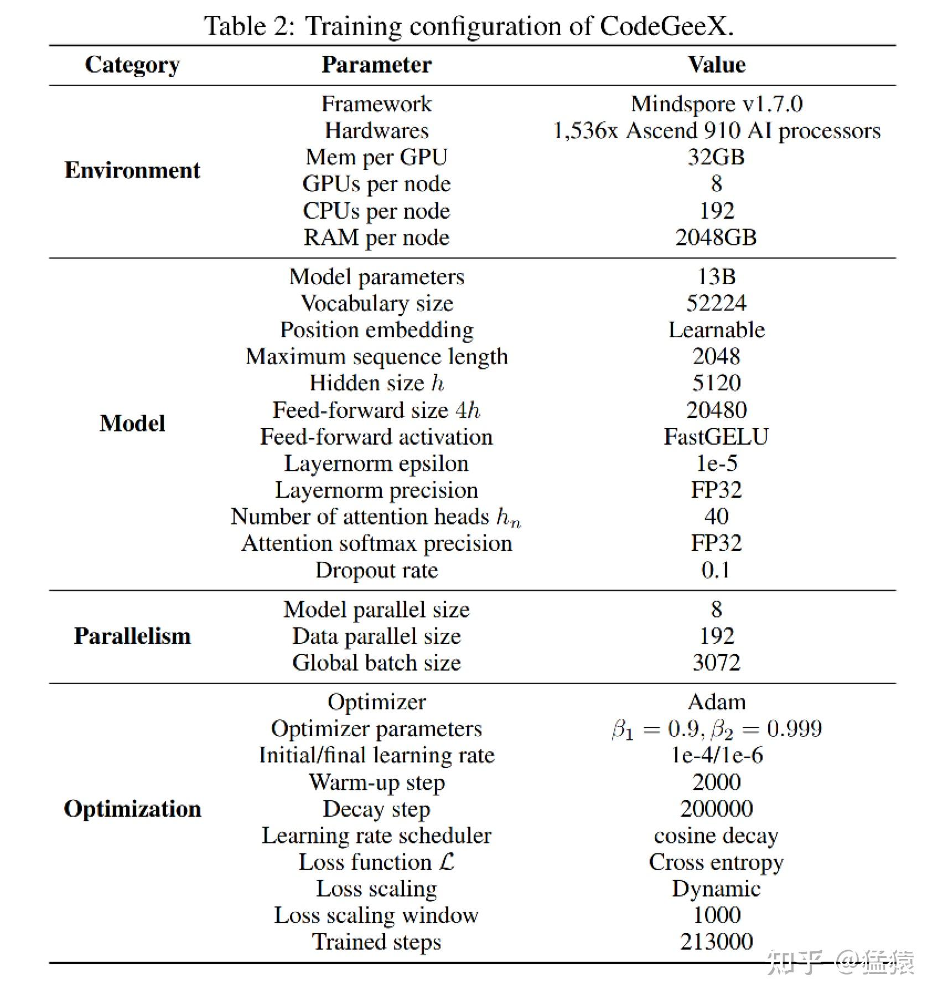
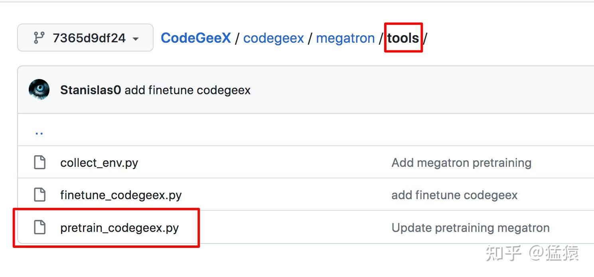
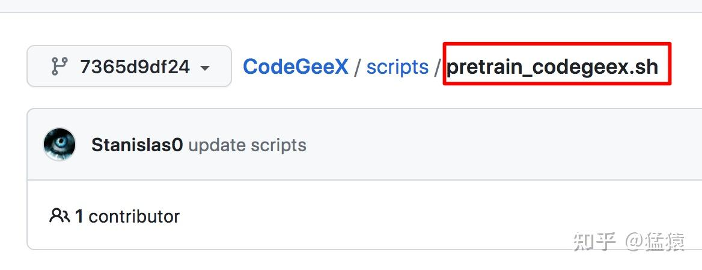
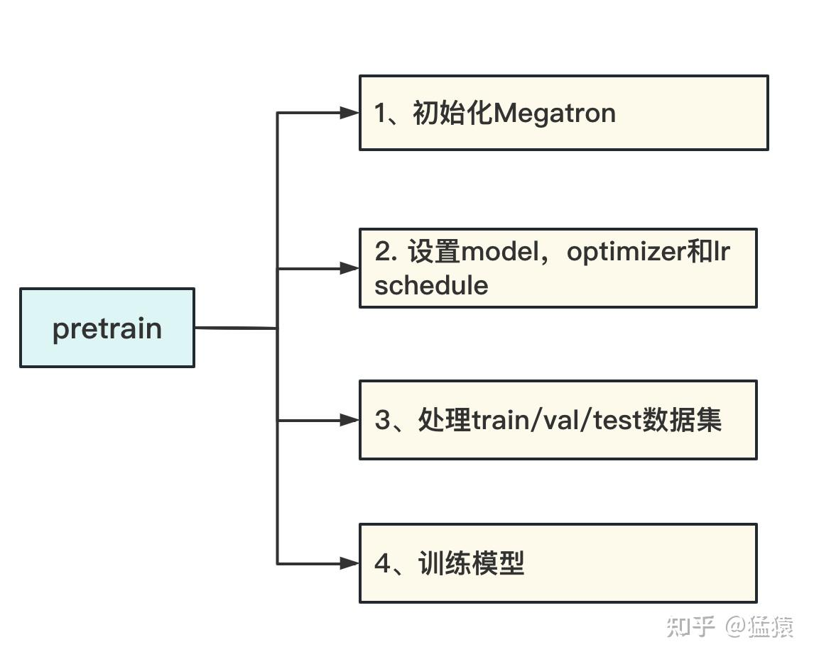
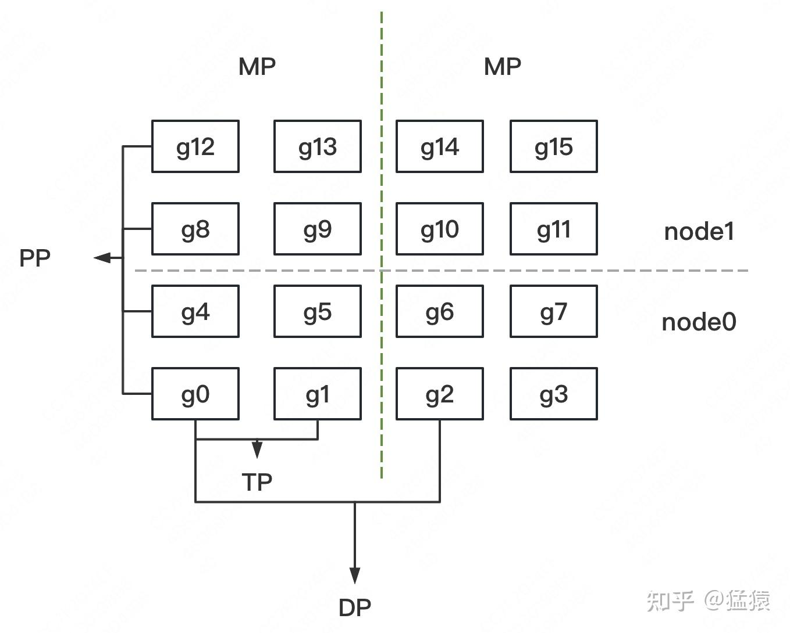
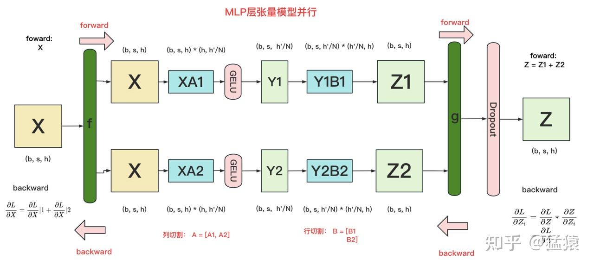

一晃过去大半个月，终于有时间来写Megatron的源码解读篇了。

首先，请允许我介绍下封面。明明是Megatron，为什么放Bee啊？还不是因为Megatron长得太丑了。翻遍了网络全都是五彩斑斓的灰上加了两只红色眼睛，实在是有碍阅读心情。。。放个明黄色舒爽下眼睛。

源码阅读类的文章很难写。尤其是对Megatron这样细节丰富，代码结构上又较为松散的项目而言。思考了一下，我决定依然用自己最擅长的【图解】方式，和大家一起阅读源码。在这个系列里，我基本按以下3步骤来做解读：

-   先通过【图解】的方式，说明这块代码在做一件什么事
-   阐述代码整体架构，拆分逻辑
-   细节解读

在阅读前，建议大家先掌握各种并行方式的理论知识。在阅读后，建议大家亲自阅读相关部分的源码细节，并阅读参考部分中推荐的tutorial。

【推荐阅读】：

**[猛猿：图解大模型训练之：流水线并行（Pipeline Parallelism），以Gpipe为例](https://zhuanlan.zhihu.com/p/613196255)**

**[猛猿：图解大模型训练之：数据并行上篇(DP, DDP与ZeRO)](https://zhuanlan.zhihu.com/p/617133971)**

**[猛猿：图解大模型训练之：数据并行下篇(ZeRO，零冗余优化)](https://zhuanlan.zhihu.com/p/618865052)**

**[猛猿：图解大模型系列之：张量模型并行，Megatron-LM](https://zhuanlan.zhihu.com/p/622212228)**

**[猛猿：图解大模型训练之：Megatron源码解读2，模型并行](https://zhuanlan.zhihu.com/p/634377071)**

**[猛猿：图解大模型训练系列之：Megatron源码解读3，分布式混合精度训练](https://zhuanlan.zhihu.com/p/662700424)**

[猛猿：图解大模型训练系列之：DeepSpeed-Megatron MoE并行训练（原理篇）](https://zhuanlan.zhihu.com/p/681154742)

[猛猿：图解大模型训练系列之：DeepSpeed-Megatron MoE并行训练（源码解读篇）](https://zhuanlan.zhihu.com/p/681692152)

**【创作与绘图不易，如果觉得本文有帮助，麻烦点一个赞，可以让更多人看到～谢谢～～】**

## 一、CodeGeeX模型简述

使用Megatron来训练gpt类大模型的项目有很多。在这个系列里，我选择了由THUDM开发的CodeGeeX项目，它是gpt在代码生成方向上的应用，对标于openAI的CodeX。github地址 [在此](https://link.zhihu.com/?target=https%3A//github.com/THUDM/CodeGeeX/tree/7365d9df242d87a5583d3f203e4b6c547dc6240e)。
为什么选择CodeGeeX呢？因为：

-   **完全开源**。它开源了完整的预训练代码。而很多号称开源的项目，其实只公开了预训练模型。
-   **简洁精要的模型图**。在对应[论文](https://link.zhihu.com/?target=https%3A//arxiv.org/abs/2303.17568)中，用两张图就清晰描绘了整个 **预训练配置** 和 **模型架构**（精确到混合精度和矩阵维度）。极大提升了源码阅读的效率。

下面我们就放出这两张牛皮的架构图：




在下一篇讲解切割模型部分的源码里，我们会配合模型架构图来读。这一篇我们着重讲分布式环境初始化。因此对gpt或codegeex模型架构不熟悉的话，也不影响本文阅读。特别说明的是，根据预训练配置，**我们可知codegeex采用的是8头TP，192头DP，共1536块GPU进行训练，采用的训练框架为Megatron + DeepSpeed ZeRO2**

## 二、预训练代码整体架构

### 2.1 预训练代码设计与使用规范

如下图：

-   预训练入口函数在 `megatron/tools/pretrain_codegeex.py` 这个路径下
-   启动脚本在 `pretrain_codegeex.sh` 这个文件中。

使用Megatron时，一般将预训练函数命名为 `pretrain_模型名.py` 的形式，例如 `pretrain_bert.py`、`pretrain_gpt.py` 等。在codegeex这个项目里，该代码位于tools目录下；在NVDIA提供的[代码](https://link.zhihu.com/?target=https%3A//github.com/NVIDIA/Megatron-LM/tree/2c493fb3fd37e5ecac068607b408ed5724d80fcc)中，则与tools目录同级。放在哪里不重要，梳理出来只是方读者查找阅读。
在 `pretrain_codegeex.sh` 这个启动脚本里，定义了模型训练的参数值，包括batch\_size、hidden\_size等；同时也定义了设置分布式环境的参数值，例如DP/TP/PP组的大小等。





### 2.2 预训练代码整体设计

在 `pretrain_codegeex.py` 中，核心入口函数为 `pretrain`，调用它则开启预训练过程：

```python
if __name__ == "__main__":
    pretrain(
        train_valid_test_datasets_provider,
        model_provider,
        forward_step,
        args_defaults={"tokenizer_type": "GPT2BPETokenizer"},
    )
```

如下图，`pretrain`函数主要包含以下4个内容：



-   **初始化Megatron：** 设置分布式训练环境。主要目的是设置DP/TP/PP进程组，并为每一个进程分配GPU。
-   **设置model，optimizer和lr schedule：** 在CPU上定义好模型，再将其按照第1步中定义好的分布式框架，把模型切割并搬运到GPU上。
-   **处理train/val/test数据集：** 按第1步定义好的分布式框架，对数据集进行切分。
-   **训练模型：** 在分布式环境中定义每个step的训练方式。

Megatron源码解读系列，也按上述逻辑分成4个部分。本篇将着重介绍第一部分：**初始化Megatron**。

## 三、初始化Megatron

### 3.1 初始化在做一件什么事

在阅读代码之前，我们先看初始化到底在完成一件什么事。
假设我们有2台机器（node0和node1），每台机器上有8块GPU，GPU的编号为0~15。
我们使用这16块GPU，做 **DP/TP/PP混合并行**，如下图：



-   **MP：模型并行组（Model Parallism）**。假设一个完整的模型需要布在8块GPU上，则如图所示，我们共布了2个model replica（2个MP）。MP组为：`[[g0, g1, g4, g5, g8, g9, g12, g13], [g2, g3, g6, g7, g10, g11, g14, g15]]`
-   **TP：张量并行组（Tensor Parallism）**。对于一个模型的每一层，我们将其参数纵向切开，分别置于不同的GPU上，则图中一共有8个TP组。TP组为：`[[g0, g1], [g4, g5],[g8, g9], [g12, g13], [g2, g3], [g6, g7], [g10, g11], [g14, g15]]`
-   **PP：流水线并行组（Pipeline Parallism）**。对于一个模型，我们将其每一层都放置于不同的GPU上，则图中一共有4个PP组。PP组为：`[[g0, g4, g8, g12], [g1, g5, g9, g13], [g2, g6, g10, g14], [g3, g7, g11, g15]]`
-   **DP：数据并行组（Data Parallism）**。经过上述切割，对维护有相同模型部分的GPU，我们就可以做数据并行，则图中共有8个DP组。DP组为 `[[g0, g2], [g1, g3], [g4, g6], [g5, g7], [g8, g10], [g9, g11], [g12, g14], [g13, g15]]`

明确了分组设计，我们再来看下面几个问题。
**（1）分组的原则是什么？**

-   **MP设定原则：** MP其实由TP+PP共同决定。在开始训练前，需要我们根据实际模型，预估训练时显存消耗（特别注意峰值显存），来为模型安排GPU资源。
-   **TP、DP和PP设定原则：** 在这三种并行模式的原理篇中，我们分析过三者的通讯量。一般而言，TP>DP>PP。通讯量大的尽量放入一台机器内，因为机器内带宽高。所以在图例中，TP和DP不跨机，PP跨机。再提一点，在使用Megatron时，很多项目是不用PP，仅用TP+DP的，此时一般将TP放入一台机器内，令DP跨机（比如codegeex）

**（2）分组的目的是什么？**

-   **分配进程：**
    -   确认分组方案后，在每块GPU上启动一个进程（process），每个进程 **独立执行** 自己所维护的那部分模型的计算，实现并行训练。
    -   进程0~15，为一个 **进程大组（group）**，其下的每一个DP/MP/PP组，为一个 **进程子组（subgroup）**

-   **组间通讯：** 确认好DP/TP/PP组，并分配好进程后，我们就能进一步设置不同进程间的通讯方案。例如属于一个DP组的g0和g2需要进行梯度通讯，属于一个PP组的g4和g8需要进行层间输出结果的通讯。

总结来说，初始化Megatron做了如下事：

-   **定义模型的切割框架**
-   **在此框架上，初始化进程，分配GPU，设置进程组（DP/TP/PP）**

### 3.2 代码整体解读

明确了初始化代码要做的事情，现在可以来看代码实现了。
回到`pretrain`函数，它的第一行就通过`initialize_megatron`执行了分布式初始化：

```python
def pretrain(
    train_valid_test_dataset_provider,
    model_provider,
    forward_step_func,
    valid_forward_step_func=None,
    extra_args_provider=None,
    args_defaults={},
):
    initialize_megatron(
        extra_args_provider=extra_args_provider, args_defaults=args_defaults
    )
    ...
```

`initialize_megatron` 函数位于 `megatron/initialize.py` 文件中，我们直接来看它的核心函数 `_initialize_distributed`。代码如下：

```python
def _initialize_distributed():
    """Initialize torch.distributed and mpu.
                |    Node1  |   Node2    |
    ____________| p1 |  p2  |  p3  |  p4 |
    local_rank  | 0  |   1  |  0   |   1 |
    rank        | 0  |   1  |  2   |   3 |

    node: 物理结点，1台机器或者1个容器。图中2个物理结点
    rank：进程在全局上的序号。图中4个进程
    local_rank：进程在node上的序号。
    torch.cuda.device_count()：当前进程所在的node上可使用的GPU的数量
    device：GPU在某个node上的编号

    该函数作用：
    1、设置分布式环境：初始化进程，分配GPU，并设置进程大组（group）
    2、制定DP/TP/PP分组策略，设置进程子组（subgroup）
    3、设置DeepSpeed ZeRO-R，对activation进行优化
    """
    args = get_args()

    device_count = torch.cuda.device_count() # 当前进程所在的node上可使用的GPU的数量
    if torch.distributed.is_initialized(): # 如果已创建好分布式环境
        if args.rank == 0: # 在0号进程上打印出“创建完毕”的日志
            print(
                "torch distributed is already initialized, "
                "skipping initialization ...",
                flush=True,
            )
        args.rank = torch.distributed.get_rank() # 取得当前进程的全局序号
        args.world_size = torch.distributed.get_world_size() # 取得全局进程的个数

    else: # 如果未创建好分布式环境
        if args.rank == 0:
            print("> initializing torch distributed ...", flush=True)

        # 1. 初始化进程，分配GPU，并设置进程大组（group）
        if device_count > 0:
            device = args.rank % device_count # 1块进程1个GPU。device为GPU编号。例如图例中的进程9，其所在机器上有8块卡。因此进程9使用的gpu编号为8%9=1
            if args.local_rank is not None:
                assert (
                    args.local_rank == device
                ), "expected local-rank to be the same as rank % device-count."
            else:
                args.local_rank = device

            if args.force_device is not None:
                print(
                    f"  > forcefully set the device to {args.force_device}, originally {device}"
                )
                device = args.force_device
            torch.cuda.set_device(device) # 为当前进程分配GPU

        # 设置进程大组
        init_method = "tcp://"
        master_ip = os.getenv("MASTER_ADDR", "localhost") # 获取rank=0进程的ip
        master_port = os.getenv("MASTER_PORT", "6000") # 获取rank=0进程的端口
        init_method += master_ip + ":" + master_port
        print(
            f"  > (rank={args.rank}) initializing process group: "
            f"world_size={args.world_size} "
            f"backend={args.distributed_backend} "
            f"init_method={init_method}",
            flush=True,
        )
        timeout = datetime.timedelta(minutes=args.dist_timeout)
        torch.distributed.init_process_group(
            backend=args.distributed_backend,
            world_size=args.world_size,
            rank=args.rank,
            init_method=init_method,
            timeout=timeout
        )
        print(f"  > (rank={args.rank}) process group initialized")

    # 2、制定DP/TP/PP分组策略，设置进程子组（subgroup）
    if device_count > 0:
        if mpu.model_parallel_is_initialized():
            print("model parallel is already initialized")
        else:
            mpu.initialize_model_parallel( # megatron/mpu/initialize.py
                args.tensor_model_parallel_size,
                args.pipeline_model_parallel_size,
                args.virtual_pipeline_model_parallel_size,
            )

    # 设置DeepSpeed ZeRO-R，对activation进行优化
    if args.deepspeed and args.deepspeed_activation_checkpointing:
        setup_deepspeed_random_and_activation_checkpointing(args)
```

总体来说，这个代码实现了3个目的：

-   设置分布式环境：初始化进程，分配GPU，并设置 **进程大组（group）**。也即例子中的0~15号进程同属一个分布式进程大组
-   制定DP/TP/PP分组策略，设置 **进程子组（subgroup）**
-   设置DeepSpeed ZeRO-R，对activation进行优化

我们来逐一讲解。

### 3.3 代码细节：torch.distributed，设置分布式环境

**设置进程大组的目的是告知程序，从全局上看，有哪些进程共同组成了分布式训练系统。** 我们先明确几个术语：

```python
                |    Node1  |   Node2    |
    ____________| p1 |  p2  |  p3  |  p4 |
    local_rank  | 0  |   1  |  0   |   1 |
    rank        | 0  |   1  |  2   |   3 |

    node: 物理结点，1台机器或者1个容器。图中2个物理结点
    rank：进程在全局上的序号。图中4个进程
    local_rank：进程在node上的序号。
    torch.cuda.device_count()：当前进程所在的node上可使用的GPU的数量
    device：GPU在某个node上的编号
```

特别说明，在2.2的图例中，我们用g0~g15表示GPU编号，但更准确地应理解为进程编号。GPU的编号与local\_rank一样，是相对于node而言的，即0~8，0~8。

我们借助`torch.distributed` 来实现这一步，它是pytorch用于设置分布式训练环境的偏底层API（**distributed communication package**）。如果你看过pytorch的文档，可能会发现对于该API的阐述比较抽象。所以我把它单独拎出来做说明。

```python
        init_method = "tcp://"
        master_ip = os.getenv("MASTER_ADDR", "localhost") # 获取rank=0进程的ip
        master_port = os.getenv("MASTER_PORT", "6000") # 获取rank=0进程的端口
        init_method += master_ip + ":" + master_port
        print(
            f"  > (rank={args.rank}) initializing process group: "
            f"world_size={args.world_size} "
            f"backend={args.distributed_backend} "
            f"init_method={init_method}",
            flush=True,
        )
        timeout = datetime.timedelta(minutes=args.dist_timeout)
        torch.distributed.init_process_group(
            backend=args.distributed_backend,
            world_size=args.world_size,
            rank=args.rank,
            init_method=init_method,
            timeout=timeout
        )
        print(f"  > (rank={args.rank}) process group initialized")
```

我们聚焦于`torch.distributed.init_process_group`，该函数实现了设置进程大组（group）的功能，它主要由以下几个概念组成：

-   **backend：** 直译为后端。但本质上是在定义IPC通信机制（对数据实现reduce, gather, broadcase等通信操作）。取值有`gloo`，`nccl` 等。粗暴来说，使用CPU时，用gloo；使用GPU时，用nccl。
-   **world\_size：** 全局进程数。例如图例中的world\_size = 16。
-   **rank：** 当前进程在全局上的序号。例如图例中进程序号的取值范围0~15，我们需要对每个进程操作init\_process\_group，将其纳入进程大组中。
-   **init\_method：** 这个概念较难理解，官方文档也写得比较抽象。通俗来说，**这个参数指明了一个地址，进程组内的进程通过该地址中存放的信息进行交流**。这些信息包括：**哪些进程间应该相互通讯；各进程的计算进度如何等**。还是以图例说明，g1和g3属于一个DP组，当它们把各自梯度算完后，需要对梯度做AllReduce。g1算完自己的梯度后，它就会去这个地址下，声明自己已算完，并去查找自己应该和谁通讯，通讯方是否已算完等信息。**借助这个地址中存储的信息，进程组内的进程就能相互知道彼此状态，并联系彼此**。一般来说，**为避免冗余，这个信息只存一份，存在rank 0 进程上（rank 0进程又称为master进程）**。
-   **store：** 默认值为None。它的作用和init\_method一样，只不过init\_method指定的是一个地址，指定后在该地址下创建存储交流信息的数据对象，这个数据对象就是store。也就是说，store **显式地** 指明了交流信息的内容。因此store和init\_method是互斥的，即store非空时，会忽略init\_method。
-   **timeout：** 设置每个进程等待的时间。进程间的计算速度不一样，还是以DP组的g1和g3为例，可能g1都算完梯度了，g3还在执行forward。在等待g3算梯度的过程中，g1可能会timeout。因此这个参数就用于设置每个进程的最大等待时间。

现在回头再看这个代码片段，是不是好理解很多~`torch.distributed.init_process_group` 非常重要，它贯穿了Megatron，也是使用pytorch做分布式训练不可略过的一环。关于`torch.distributed`的更多信息，推荐大家阅读[官方文档](https://link.zhihu.com/?target=https%3A//pytorch.org/docs/stable/distributed.html)，以及[这篇blog](https://link.zhihu.com/?target=https%3A//www.cnblogs.com/rossixyz/p/15553670.html)。

### 3.4 代码细节：设置DP/TP/PP组

设置完进程大组（group）后，我们就可以进一步设置进程子组（subgroup）了，也即设置DP/TP/PP组。

```python
            mpu.initialize_model_parallel( # megatron/mpu/initialize.py
                args.tensor_model_parallel_size,
                args.pipeline_model_parallel_size,
                args.virtual_pipeline_model_parallel_size,
            )
```

核心函数 `initialize_model_parallel` 在 `megatron/mpu/initialize.py` 下。`mpu` 的含义是model parallisim utils，也就是和模型并行设置相关的函数，都放在这个目录下，它接收3个参数：

-   **tensor\_model\_parallel\_size：** 每个TP组的进程数量。例如图例中是2
-   **pipeline\_model\_parallel\_size：** 每个PP组的进程数量。例如图例中是4
-   **virtual\_pipeline\_model\_parallel\_size：** 每个virtual PP组的进程数量。这是NVIDIA对Megatron做后续迭代时提出的一种优化方法。我们之后会单独开一篇文章来讲解。这里可暂时忽略（不是必须参数，可以传None值）。

你可能会问，**为什么不设置DP相关的size**？回想2.2中设计分布式的过程，我们根据TP+PP就可确认MP，进而推出DP。也就是定好了TP和PP，DP\_size就能根据 world\_size // (TP\_size \* PP\_size)计算得出。因此不用定义。
我们来看具体代码：

```python
def initialize_model_parallel(
    tensor_model_parallel_size_=1,
    pipeline_model_parallel_size_=1,
    virtual_pipeline_model_parallel_size_=None,
):
    """
    Initialize model data parallel groups.

    Arguments:
        tensor_model_parallel_size: number of GPUs used to parallelize model tensor.
        pipeline_model_parallel_size: number of GPUs used to parallelize model pipeline.

    Let's say we have a total of 16 GPUs denoted by g0 ... g15 and we
    use 2 GPUs to parallelize the model tensor, and 4 GPUs to parallelize
    the model pipeline. The present function will
    create 8 tensor model-parallel groups, 4 pipeline model-parallel groups
    and 8 data-parallel groups as:
        8 data_parallel groups:
            [g0, g2], [g1, g3], [g4, g6], [g5, g7], [g8, g10], [g9, g11], [g12, g14], [g13, g15]
        8 tensor model-parallel groups:
            [g0, g1], [g2, g3], [g4, g5], [g6, g7], [g8, g9], [g10, g11], [g12, g13], [g14, g15]
        4 pipeline model-parallel groups:
            [g0, g4, g8, g12], [g1, g5, g9, g13], [g2, g6, g10, g14], [g3, g7, g11, g15]
        2 model-parallel group:
        [g0, g1, g4, g5, g8, g9, g12, g13], [g2, g3, g6, g7, g10, g8, g14, g15]

    Note that for efficiency, the caller should make sure adjacent ranks
    are on the same DGX box. For example if we are using 2 DGX-1 boxes
    with a total of 16 GPUs, rank 0 to 7 belong to the first box and
    ranks 8 to 15 belong to the second box.
    """
    if torch.distributed.get_rank() == 0:
        print(
            "> initializing tensor model parallel with size {}".format(
                tensor_model_parallel_size_
            )
        )
        print( # 打印出流水线模型并行的度
            "> initializing pipeline model parallel with size {}".format(
                pipeline_model_parallel_size_
            )
        )
    # Get world size and rank. Ensure some consistencies.
    assert torch.distributed.is_initialized() # 确保torch已经做了分布式初始化
    world_size = torch.distributed.get_world_size() # 得到全局进程的总数
    tensor_model_parallel_size = min(tensor_model_parallel_size_, world_size)
    pipeline_model_parallel_size = min(pipeline_model_parallel_size_, world_size)

    ensure_divisibility( # 后者表示一个完整模型所占的gpu数，我们要保证前者能被后者整除
        world_size, tensor_model_parallel_size * pipeline_model_parallel_size
    )
    # 在codegeex中，TP_size=8, PP_size=1，world_size = 1536，因此DP_size是1536/(8*1) = 192
    data_parallel_size = world_size // ( # 根据TP_size和PP_size，求出DP_size
        tensor_model_parallel_size * pipeline_model_parallel_size
    )

    num_tensor_model_parallel_groups = world_size // tensor_model_parallel_size # TP的组数
    num_pipeline_model_parallel_groups = world_size // pipeline_model_parallel_size # PP的组数
    num_data_parallel_groups = world_size // data_parallel_size # DP的组数

    if virtual_pipeline_model_parallel_size_ is not None:
        global _VIRTUAL_PIPELINE_MODEL_PARALLEL_RANK
        global _VIRTUAL_PIPELINE_MODEL_PARALLEL_WORLD_SIZE
        _VIRTUAL_PIPELINE_MODEL_PARALLEL_RANK = 0
        _VIRTUAL_PIPELINE_MODEL_PARALLEL_WORLD_SIZE = (
            virtual_pipeline_model_parallel_size_
        )

    rank = torch.distributed.get_rank() # 获取当前进程的全局rank

    # Build the data-parallel groups.（设置DP组）
    global _DATA_PARALLEL_GROUP # 保存DP组，如[[0,2], [1,3]...]，数字表示进进程的全局序号
    assert _DATA_PARALLEL_GROUP is None, "data parallel group is already initialized"
    all_data_parallel_group_ranks = []
    for i in range(pipeline_model_parallel_size):
        start_rank = i * num_pipeline_model_parallel_groups
        end_rank = (i + 1) * num_pipeline_model_parallel_groups
        for j in range(tensor_model_parallel_size):
            ranks = range(start_rank + j, end_rank, tensor_model_parallel_size)
            all_data_parallel_group_ranks.append(list(ranks))
            group = torch.distributed.new_group(ranks) # 设置DP组
            if rank in ranks:
                _DATA_PARALLEL_GROUP = group

    # Build the model-parallel groups.（设置MP组）
    global _MODEL_PARALLEL_GROUP # 保存MP组
    assert _MODEL_PARALLEL_GROUP is None, "model parallel group is already initialized"
    for i in range(data_parallel_size):
        ranks = [
            data_parallel_group_ranks[i]
            for data_parallel_group_ranks in all_data_parallel_group_ranks
        ]
        group = torch.distributed.new_group(ranks) # 设置MP组
        if rank in ranks:
            _MODEL_PARALLEL_GROUP = group

    # Build the tensor model-parallel groups.（设置TP组）
    global _TENSOR_MODEL_PARALLEL_GROUP # 保存TP组
    assert (
        _TENSOR_MODEL_PARALLEL_GROUP is None
    ), "tensor model parallel group is already initialized"
    for i in range(num_tensor_model_parallel_groups):
        ranks = range(
            i * tensor_model_parallel_size, (i + 1) * tensor_model_parallel_size
        )
        group = torch.distributed.new_group(ranks) # 设置TP组
        if rank in ranks:
            _TENSOR_MODEL_PARALLEL_GROUP = group

    # Build the pipeline model-parallel groups and embedding groups
    # (first and last rank in each pipeline model-parallel group).（设置PP组与embedding组）
    global _PIPELINE_MODEL_PARALLEL_GROUP # 设置PP组
    global _PIPELINE_GLOBAL_RANKS
    assert (
        _PIPELINE_MODEL_PARALLEL_GROUP is None
    ), "pipeline model parallel group is already initialized"
    global _EMBEDDING_GROUP
    assert _EMBEDDING_GROUP is None, "embedding group is already initialized"
    for i in range(num_pipeline_model_parallel_groups):
        ranks = range(i, world_size, num_pipeline_model_parallel_groups)
        group = torch.distributed.new_group(ranks) # 设置PP组
        if rank in ranks:
            _PIPELINE_MODEL_PARALLEL_GROUP = group
            _PIPELINE_GLOBAL_RANKS = ranks
        # Setup embedding group (to exchange gradients between
        # first and last stages).
        if len(ranks) > 1:
            embedding_ranks = [ranks[0], ranks[-1]]
        else:
            embedding_ranks = ranks
        group = torch.distributed.new_group(embedding_ranks) # 设置embedding组
        if rank in embedding_ranks:
            _EMBEDDING_GROUP = group
```

总结来说，我们采用`torch.distributed.new_group(ranks)` 在进程大组下设置子组。ranks是list of list，表示对进程序号的划分，例如设置DP组，则ranks为 `[[0,2], [1,3]...]`，以此类推。我们将划分结果存在全局变量中（例如`_DATA_PARALLEL_GROUP`），方便我们在后续切割模型时使用。
同时，我们定义以下函数，使得对于任意一个进程，我们都能查到它在DP/TP/PP组中的 **局部序号（local\_rank）**，以及它对应的DP/TP/PP组的world\_size。这也是为后续切割模型使用:

```python
# 这里展示和TP组相关的查询操作。其余组也是类推。详细代码一样都在megatron/mpu/initialize.py中
def get_tensor_model_parallel_group():
    """Get the tensor model parallel group the caller rank belongs to."""
    assert (
        _TENSOR_MODEL_PARALLEL_GROUP is not None
    ), "intra_layer_model parallel group is not initialized"
    return _TENSOR_MODEL_PARALLEL_GROUP

def set_tensor_model_parallel_world_size(world_size):
    """Set the tensor model parallel size"""
    global _MPU_TENSOR_MODEL_PARALLEL_WORLD_SIZE
    _MPU_TENSOR_MODEL_PARALLEL_WORLD_SIZE = world_size

def get_tensor_model_parallel_rank():
    """Return my rank for the tensor model parallel group.
    my_rank指的就是local_rank，例如[g2, g3]这一个TP组，rank为2，3；local_rank为0，1
    """
    global _MPU_TENSOR_MODEL_PARALLEL_RANK
    if _MPU_TENSOR_MODEL_PARALLEL_RANK is not None:
        return _MPU_TENSOR_MODEL_PARALLEL_RANK
    return torch.distributed.get_rank(group=get_tensor_model_parallel_group())
```

最后，你可能想问，**为什么还有一个embedding\_group?**
在GPT类模型中，输入层和输出层共享一个word\_embedding（可参见第一部分中codegeex的架构图）。因此，在计算完梯度，更新embedding权重前，输入和输出层需要进行通讯，保证word\_embedding完全一致。也即PP组中的第一个和最后一个进程需要通讯。我们知道 **设置进程子组的目的就是进一步划分通讯组**，因此这里再添加一个embedding\_group。

### 3.5 代码细节：DeepSpeed ZeRO-R

到目前为止，对于初始化，我们设置了全局的分布式，完成了进程大组的设置；同时根据DP/TP/PP设计划分了进程子组。NVIDIA Megatron初始化部分的代码，其实已经结束了。
但是，在实际应用中，通常采用 **DeepSpeed-Megatron** 的方式，借助微软DeepSpeed库，通过ZeRO技术，帮助我们更好节省显存。例如codegeex就采用了ZeRO2 + Megatron的方式进行训练。

总结来说，在Megatron中使用ZeRO的方法很简单，按照[这篇官方教程](https://link.zhihu.com/?target=https%3A//www.deepspeed.ai/tutorials/megatron/)，秉持着万物皆可wrap的原则，在原始代码特定的几个位置，把DeepSpeed提供的API包进去，就能帮我们在训练中管理显存了。使用ZeRO-R，对activation做显存管理，是一个可选项。当activation大小成为显存瓶颈时，可以按照教程指导，在初始化Megatron的代码里引入这部分优化：

```python
    # 设置ZeRO-R
    if args.deepspeed and args.deepspeed_activation_checkpointing:
        setup_deepspeed_random_and_activation_checkpointing(args)
```

**那么ZeRO-R是怎么对显存优化起作用的呢？**

与ZeRO1，ZeRO2和ZeRO3是在DP组中做显存优化不同，ZeRO-R是在TP组中特别针对activation做显存优化。回想一下，在DP组里输入数据X各不相同，对应的activation也不相同。这时对activation做切割是没意义的。只有在输入X相同的情况下，才有意义对activation进行不用时切割存储，用时再gather回来的操作。

回顾Megatron每一层的计算，在TP组中，各GPU上的模型部分计算完毕后，需要经过一次AllReduce将聚合后的结果取回，然后才能进行下一层计算。此时，不同的GPU都拥有了同一个输入X，也意味着在后续计算中会产生相同的activation，这时我们就能通过ZeRO-R来避免冗余了。如下图，提供了TP下transfomer MLP层的计算：



关于ZeRO和Megatron的理论，可以参考之前写过的[这篇](https://zhuanlan.zhihu.com/p/618865052)和[这篇](https://zhuanlan.zhihu.com/p/622212228)文章。
关于初始化Megatron，就讲解到这了，本文列举了核心代码，各位读者可去官方github上，阅读更多细节。在下一篇里，我们将进入预训练的第二部分：**模型切割**，这也是整个Megatron的核心。这部分代码细节较多，代码架构上也比较分散，我依然会通过图解+细节解读的模式，和大家一起阅读～

## 四、参考

1. **codegeex github:** [https://github.com/THUDM/CodeGeeX/tree/7365d9df242d87a5583d3f203e4b6c547dc6240e](https://link.zhihu.com/?target=https%3A//github.com/THUDM/CodeGeeX/tree/7365d9df242d87a5583d3f203e4b6c547dc6240e)
2. **NVIDIA Megatron github:** [https://github.com/NVIDIA/Megatron-LM/tree/2c493fb3fd37e5ecac068607b408ed5724d80fcc](https://link.zhihu.com/?target=https%3A//github.com/NVIDIA/Megatron-LM/tree/2c493fb3fd37e5ecac068607b408ed5724d80fcc)
3. **torch distributed tutorial:** [https://pytorch.org/docs/stable/distributed.html](https://link.zhihu.com/?target=https%3A//pytorch.org/docs/stable/distributed.html)
4. **init\_process\_group:** [https://www.cnblogs.com/rossixyz/p/15553670.html](https://link.zhihu.com/?target=https%3A//www.cnblogs.com/rossixyz/p/15553670.html)
5. **DeepSpeed Megatron tutorial:** [https://www.deepspeed.ai/tutorials/megatron/](https://link.zhihu.com/?target=https%3A//www.deepspeed.ai/tutorials/megatron/)
6. **codegeex paper:** [https://arxiv.org/abs/2303.17568](https://link.zhihu.com/?target=https%3A//arxiv.org/abs/2303.17568)
