# 图解大模型训练之：Megatron源码解读2，模型并行

源码解读系列将和大家一起来读Megatron的pretrain部分代码。
在源码解读第一篇中，我们讲解了如何做 **分布式环境初始化**，即按照DP/TP/PP对进程进行分组，并为每个进程指定GPU。在这一章中，我们将一起读 **模型并行** 部分：**如何切分模型，并搬入分布式环境定义好的DP/TP/PP组中**。


**【本文将提供】**

-   详细的图解。画图说明代码的设计架构，讲清代码想做一件什么事。
-   详细的代码注释。在图解的基础上，提取核心代码部分，并附上注释。

**【如何利用本文提高源码阅读效率】**

-   先看一~三部分。了解 **模型并行的设计思想、整体框架** 及**入口函数**。
-   打开Megatron源码，找到入口函数，开始阅读。
-   阅读中的每一块细节，可参考四～八部分。

**【大模型预训练系列文章】**

**[猛猿：图解大模型训练之：流水线并行（Pipeline Parallelism），以Gpipe为例](https://zhuanlan.zhihu.com/p/613196255)**

**[猛猿：图解大模型训练之：数据并行上篇(DP, DDP与ZeRO)](https://zhuanlan.zhihu.com/p/617133971)**

**[猛猿：图解大模型训练之：数据并行下篇(ZeRO，零冗余优化)](https://zhuanlan.zhihu.com/p/618865052)**

**[猛猿：图解大模型系列之：张量模型并行，Megatron-LM](https://zhuanlan.zhihu.com/p/622212228)**

**[猛猿：图解大模型系列之：Megatron源码解读1，分布式环境初始化](https://zhuanlan.zhihu.com/p/629121480)**

**[猛猿：图解大模型训练之：Megatron源码解读2，模型并行](https://zhuanlan.zhihu.com/p/634377071)**

**[猛猿：图解大模型训练系列之：Megatron源码解读3，分布式混合精度训练](https://zhuanlan.zhihu.com/p/662700424)**

**[猛猿：图解大模型训练系列之：DeepSpeed-Megatron MoE并行训练（原理篇）](https://zhuanlan.zhihu.com/p/681154742)**

**[猛猿：图解大模型训练系列之：DeepSpeed-Megatron MoE并行训练（源码解读篇）](https://zhuanlan.zhihu.com/p/681692152)**

**【写作和绘图不易，如果觉得本文有帮助，麻烦点一个赞，可以让更多人看到，谢谢大家～】**

---

## 一、模型概述

前文说过，用Megatron做分布式训练的开源大模型有很多，我们选用的是THUDM开源的CodeGeeX（代码生成式大模型，类比于openAI Codex）。选用它的原因是“**完全开源**”与“**清晰的模型架构和预训练配置图**”，能帮助我们高效阅读源码。我们再来回顾下这两张图。

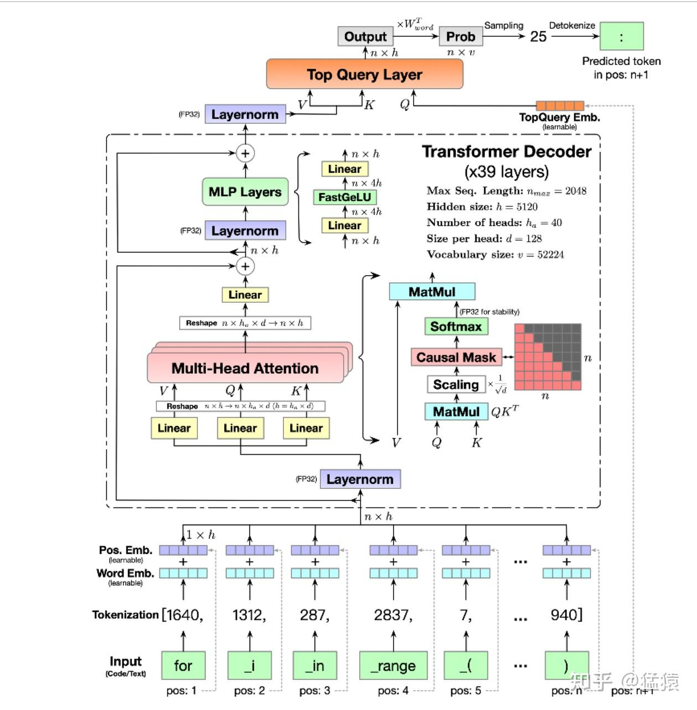

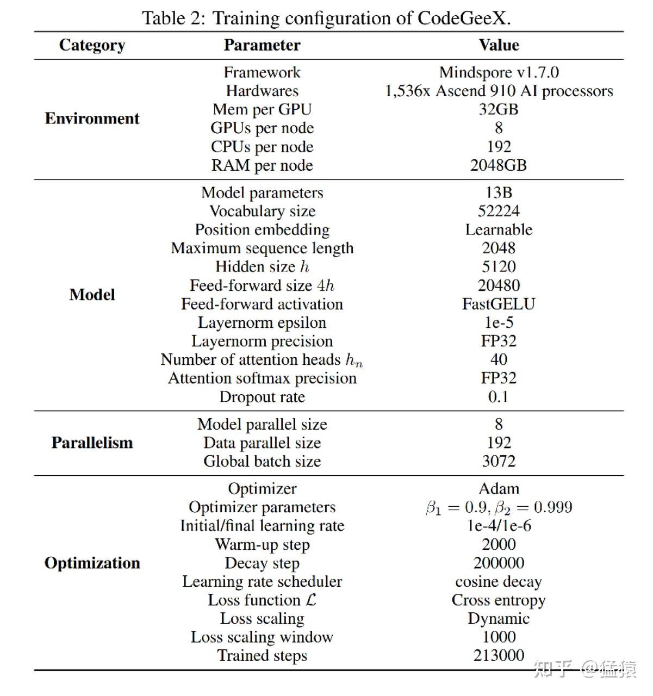

由图可知，CodeGeeX在预训练中采用的是8头TP（同一个node内的8张卡做TP，8张卡组成一个完整的模型），192头DP（192个node间做DP），一共1536块GPU进行训练。
**【阅读提醒】：如果你对GPT模型比较熟悉，则不需要花时间细看CodeGeeX架构图也能无障碍阅读本文。架构图只是在涉及模型细节时，可以对照着看。**

## 二、模型切割在做一件什么事

### 2.1 模型切割设计思想

回顾一下，在初始化分布式环境中，我们根据DP/TP/PP组设置并划分了进程，确定了模型的切割方法，如下图：

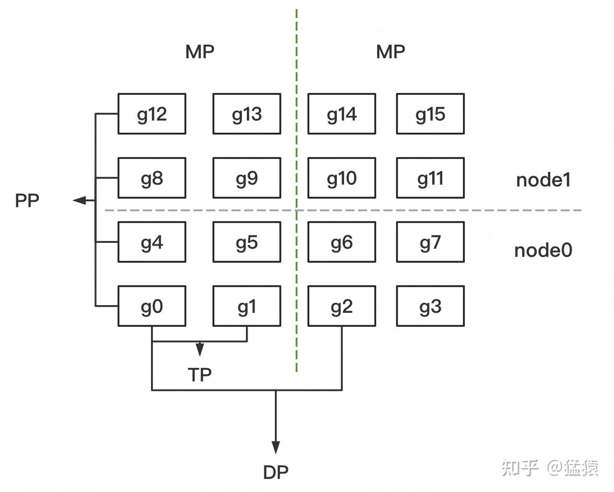

接下来，我们就可以根据这个框架来切割模型了。pytorch默认将模型（nn.Module）定义在CPU上，因此，我们 **在CPU上定义并初始化模型，然后将其搬运到当前进程所对应的GPU上**，整个过程如下图：

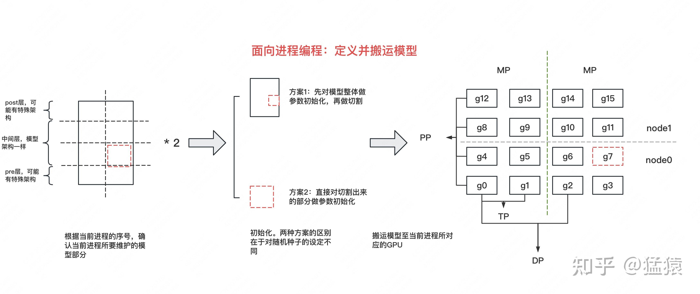

首先，我们是 **面向进程编程** 的，也就是 **整份脚本处理的是发生在1个进程上的事情**。这样做的好处是，我们只需要维护1份脚本，然后将其发去不同机器的各张卡上执行，就能实现全局的并行。

但是，**1个进程处理的是模型的不同部分**，比如GPT模型，它的pre层涉及到Embedding计算，post层涉及到softmax和loss的计算，这样每个进程上处理的模型是不一样的，这时怎么办呢？别忘了，我们能够取到 **进程id**（全局或DP/TP/PP组内的），这样我们就能通过进程id，写`if..else..` 来解决模型差异化问题了。
明确了这个思想，现在我们可以开始写代码了，我们有两种方式对模型进行切割：

-   **方案一：** 先定义出完整的模型，并对模型参数做初始化，然后根据进程id取出相应子模型，搬运到GPU上
-   **方案二：** 直接根据进程id，设计好当前子模型，做参数初始化，搬运到GPU上

这两者的核心差别，在于“**随机种子**”的设定。

### 2.2 随机种子

在分布式训练中，**随机种子是非常重要的，它关系到模型是否能够复现**。例如我们采取activation checkpoint的技术来节省显存时，在backward过程中我们需要重算forward得到activation，这时候就需要我们完整复现之前forward的过程，各类参数的初始化结果也要和之前完全一致。我们来看几个例子：

**例1: Word Embedding**

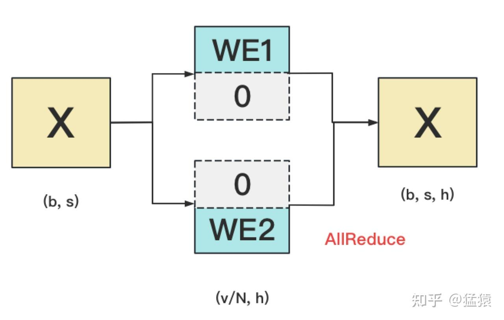

WE1和WE2间需要采用不同的随机种子。因为若采用相同的随机种子，则WE1和WE2的结果完全一样，这不等价于先随机初始化WE，再将它进行切割。

**例2: dropout**

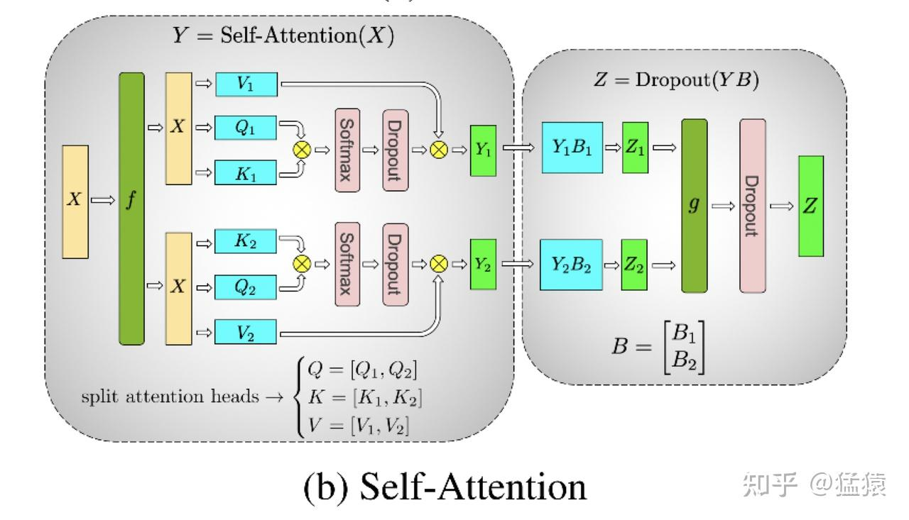

左侧方框中的2个dropout，在初始化时需要用不同的随机种子。因为这样才等价于对完整的dropout做初始化，然后再切割。右侧方框中的dropout，需要用相同的随机种子（虽然右边只画了1个dropout，但其实是2个dropout，每块GPU上各一个，因为此时两块GPU上的输出已经AllReduce，是完全一致的。做完AllReduce后，两块GPU继续独立计算，因此实际上有两个dropout）。

**关于随机种子设定的一般结论**

从例子中，我们可以得出一个结论：**一般在TP/PP组内，设定不同的随机种子。而在DP组内，设定相同的随机种子**。这只是一个一般结论，我们可以根据实际情况去调整。
最后，回到模型切割上，方案1（先做整体初始化再切割）在代码里被称为“CPU上的初始化”（`_initialize_affine_weight_cpu`），方案2（直接对局部初始化）被称为“在GPU上的初始化”(`_initialize_affine_weight_gpu`)。我们会在切割部分的代码里经常看见它们。

## 三、模型并行框架

现在，我们可以来看具体的代码了

### 3.1 模型并行入口函数

模型并行部分的代码入口依然在`megatron/training.py`的`pretrain` 函数下，代码如下：

```python
def pretrain(
    train_valid_test_dataset_provider,
    model_provider,
    forward_step_func,
    valid_forward_step_func=None,
    extra_args_provider=None,
    args_defaults={},
):
    # 1.初始化分布式环境(源码解读1内容)
    initialize_megatron(
        extra_args_provider=extra_args_provider, args_defaults=args_defaults
    )
    ...
    # 2、模型并行：定义模型架构，并切割模型（本文重点）
    model, optimizer, lr_scheduler = setup_model_and_optimizer(model_provider)
    ...

    # 3、构造train/val/test数据集（下一篇将讲述）
    ... (
            train_data_iterator,
            valid_data_iterator,
            test_data_iterator,
        ) = build_train_valid_test_data_iterators(train_valid_test_dataset_provider)

    ...
    # 4、训练（下下一篇将讲述）
    iteration = train(
            forward_step_func,
            valid_forward_step_func,
            model,
            optimizer,
            lr_scheduler,
            train_data_iterator,
            valid_data_iterator,
        )

    ...
```

由代码可知，`setup_model_and_optimizer`是整个模型并行的入口函数，如下图，它主要由“**定义模型架构并切割模型**”、“**设置optimizer**”和“**设置学习率**”三部分组成。我们 **关注的重点在第一部分上(get\_model)**。

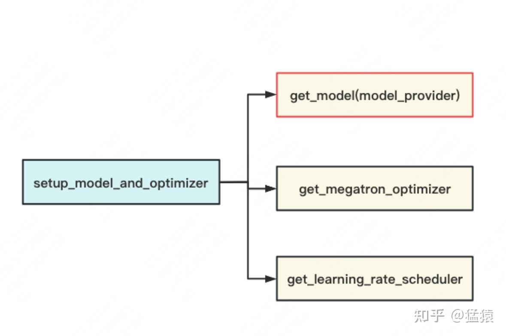

### 3.2 定义并搬运模型

`get_model` 的内容可简化成下图：

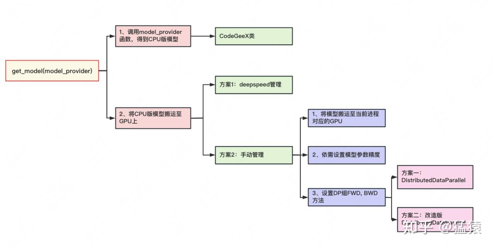

`get_model` 函数主要做了两件事：

-   在CPU上定义模型。pytorch默认在CPU上定义模型(nn.Module)。`model_provider` 是一个函数，调用它即可返回CPU版的模型，也就是一个 **CodeGeeX类，这个将是下文要介绍的重点**。
-   把模型从CPU搬运至GPU上。这里有两种方法可供选择：
    -   **方案一：借助deepspeed进行管理。** 在源码解读1中我们提过，秉持着万物皆可wrap的原则，按照[deepspeed官网教程](https://link.zhihu.com/?target=https%3A//www.deepspeed.ai/tutorials/megatron/)，只需要在Megatron的某些文件中插入相应代码，就可以让deepspeed来管理模型的分布式、DP组间的显存优化等，这里同理。
    -   **方案二：手动搬运管理。** 这里需要我们以下事情：
        -   **显式搬运。** 即手动将模型搬运到当前进程所对应的GPU上
        -   **权重精度设定。** 由ZeRO的思想可知，在模型训练中，把权重精度从fp32降至fp16，是一种节省显存的好办法。如果确定使用这种优化办法，将模型搬运到GPU上后，我们需要修改精度。
        -   **初始化DP组。** 这里指的是 **定义DP组间forward、backward和梯度计算与通讯等方法**。在Megatron中，**TP和PP组的这些方法是人为定义的**（在定义CPU模型时已设置好，我们将在下文讲`CodeGeeX`细节时看到），**而DP组则是可以用现成的**（torch的DistributedDataParallel）。在具体使用时，我们可以：（1）直接调用DistributedDataParallel。或（2）在DistributedDataParallel这个类的基础上做一些改进，例如增加对碎片化内存的管理，对计算梯度时的精度控制等。

`get_model` 函数的核心代码如下（一切尽在注释中）：

```python
def get_model(model_provider_func):
    """Build the model."""
    args = get_args()

    # 1、定义并构建CPU版模型
    if ( # 1.1、当分布式进行框架采用virtual pipeline (是NVDIA后续提出的对Megatron的优化方法，可先忽略不看)
        mpu.get_pipeline_model_parallel_world_size() > 1
        and args.virtual_pipeline_model_parallel_size is not None
    ):
        model = []
        for i in range(args.virtual_pipeline_model_parallel_size):
            mpu.set_virtual_pipeline_model_parallel_rank(i)
            # Set pre_process and post_process only after virtual rank is set.
            pre_process = mpu.is_pipeline_first_stage()
            post_process = mpu.is_pipeline_last_stage()
            this_model = model_provider_func(
                pre_process=pre_process, post_process=post_process
            )
            model.append(this_model)
    else: # 1.2 其余情况
        # 判断当前进程是否是PP组的第一个进程（例如第一部分图例中PP组的g0）
        pre_process = mpu.is_pipeline_first_stage()
        # 判断当前进程是否是PP组的最后一个进程（例如第一部分图例中PP组的g12）
        post_process = mpu.is_pipeline_last_stage()
        # 构建CPU版CodeGeeX模型
        model = model_provider_func(pre_process=pre_process, post_process=post_process)

    ...

    # 2、将模型从CPU搬运到GPU上
    # 2.1 如果采用Megatron-DeepSpeed的方式，则直接返回模型，后面的搬运，数据并行等工作将由deepspeed来完成
    # ref：https://www.deepspeed.ai/tutorials/megatron/
    if args.deepspeed:
        return model

    # 将当前进程所维护的模型，从CPU搬运到GPU上（GPU即为在初始化时为当前进程分配的那块GPU）
    print(f" > moving model to GPU ...", flush=True)
    for model_module in model:
        model_module.cuda(torch.cuda.current_device())
    print(f" > moving to GPU done", flush=True)

    # fp16转换（pytorch默认模型参数精度为fp32，依需决定计算过程中是否要转成fp16，节省显存）
    if args.fp16 or args.bf16:
        print(f" > converting model to fp16 ...", flush=True)
        model = [Float16Module(model_module, args) for model_module in model]
        print(f" > converting to fp16 done", flush=True)

    # 采用pytorch定义的DistributedDataParallel管理数据并行
    if args.DDP_impl == "torch":
        i = torch.cuda.current_device()
        model = [
            torchDDP(
                model_module,
                device_ids=[i],
                output_device=i,
                process_group=mpu.get_data_parallel_group(), # 数据并行的组
            )
            for model_module in model
        ]
        return model

    # 采用自定义的DistributedDataParallel管理数据并行
    # 即在pytorch的DistributedDataParallel的基础上，自己再定义内存管理、梯度精度等计算方式，更有效利用显存
    if args.DDP_impl == "local": # 自定义的数据并行类在megatron/model/distributed.py下
        print(f" > creating DDP model ...", flush=True)
        model = [
            LocalDDP(
                model_module,
                args.accumulate_allreduce_grads_in_fp32,
                args.use_contiguous_buffers_in_ddp,
            )
            for model_module in model
        ]
        print(f" > creating DDP model done", flush=True)
        return model

    raise NotImplementedError(
        "Unknown DDP implementation specified: {}. " "Exiting.".format(args.DDP_impl)
    )
```

特别说明的是，前文提过模型的首尾两层和中间层的架构可能不一样，因此我们通过 `pre_process` 和 `post_process` 来做区分。（当然你也能选择用进程序id，只是首尾两层经常被Q到，所以这里单独明确了下）。
对CodeGeeX来说，由它预训练配置可知，它的PP并行度为1，也就是1块GPU上涵盖了模型的第一层至最后一层，所以pre\_process和post\_process实际上没有用到。感兴趣的朋友可以阅读[NVIDIA Megatron源码](https://link.zhihu.com/?target=https%3A//github.com/NVIDIA/Megatron-LM/tree/2c493fb3fd37e5ecac068607b408ed5724d80fcc)下关于bert、gpt2的预训练代码，具体了解pre\_process和post\_process在定义模型时起的作用。

### 3.3 分布式模型：CodeGeeX

现在，我们来看 **最核心的分布式模型：CodeGeeX类**。
前文说过，**1个脚本处理的是1个进程上发生的事情，而1个进程对应的是模型的一部分**。单进程的架构如下：

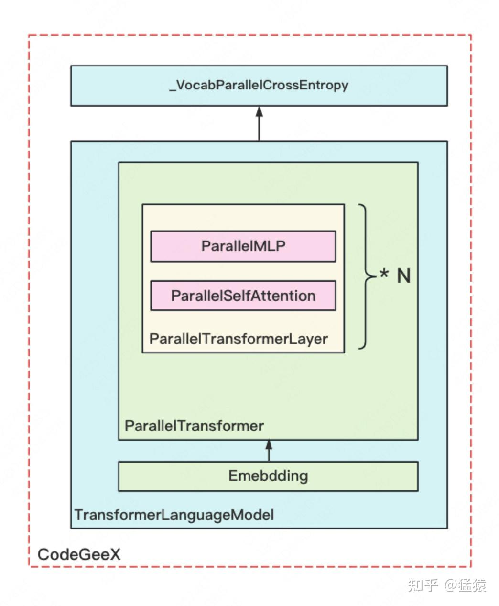

图中每个方框都表示源码里定义的一个 `nn.Module` 类（除了最上的方框外）具体定义为：

-   **`CodeGeeX`：** 定义一块GPU上的模型。它由 `TransformerLanguageModel` 和 `_VocabParallelCrossEntropy` 这两个核心类组成。
-   **`TransformerLanguageModel`：** 定义每块GPU上 **输入层embedding** 和 **中间block层** 的结构
-   **`Embedding`：** 定义每块GPU上输入层embedding结构及相关计算，输出结果已AllReduce（TP组间）
-   **`ParallelTransformer`：** 定义每块GPU上所有中间blocks的结构及相关计算，输出结果已AllReduce（TP组间）
-   **`ParallelTransformerLayer`：** 定义每块GPU上单个block的结构及相关计算，输出结果已AllReduce（TP组间）
-   **`ParallelSelfAttention`：** 定义每块GPU上单个block中，attention的结构及相关计算，输出结果已AllReduce（TP组间）
-   **`ParallelMLP`：** 定义每块GPU上单个block中，mlp层的结构及相关计算，输出结果已AllReduce（TP组间）。
-   **`_VocabParallelCrossEntropy`：** 定义每块GPU上输出层embedding、softmax和loss等结构及相关计算，它是一个 `torch.autograd.Function`。

**为什么需要对输出做AllReduce**？回顾Megtron理论部分的讲解，在纵向切割模型时，Megatron是在输入X完整的情况下，设计模型切割的方式的。因此，对于模型的每一层输出，我们都要在TP组间做AllReduce，来保证下一层拿到的输入也是完整的。**类名字中的"Parallel"，也是指在TP组中做并行**，如下图所示：


到这一步，我们终于把模型切割部分的整体流程讲完了。**虽然我们是以CodeGeeX为例，但这个流程图可以看作是通用的**。不同模型间只有模型具体结构、DP/TP/PP组设置这些方面的差别，整个并行框架是通用的。
下面，我们来探究图中所绘的各个类的细节。

## 四、MegatronModule

上面所绘制的几类，并不是直接继承自 `nn.Module`，而是皆继承于自定义的 `class MegatronModule(torch.nn.Module)`。我们说过，gpt类模型，输入和输出层共用一个word embedding。因此，这个类的主要作用，就是令PP组的第一个进程和最后一个进程满足这个条件（不过我不懂为什么要把这个限制放在一个大母类中去做，设计上感觉有点奇怪）。MegatronModule类的整体架构如下：

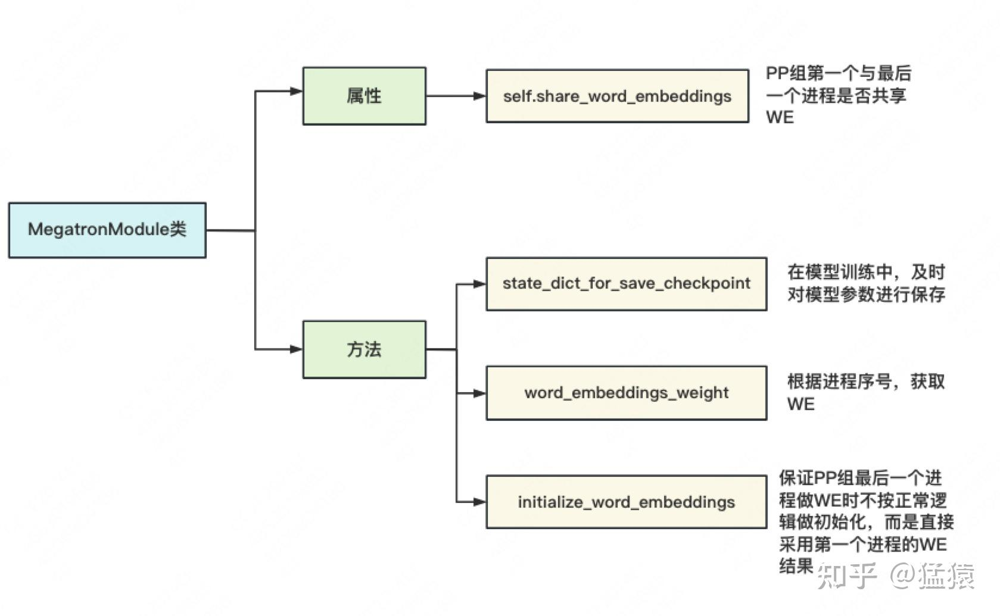

特别说明，**`initialize_word_embedding` 并不是某一具体的初始化WE方法，它只是起到如图所说的强制作用**。
`MegatronModule` 的代码如下（一切尽在注释中）：

```python
class MegatronModule(torch.nn.Module):
    """Megatron specific extensions of torch Module with support
    for pipelining."""

    def __init__(self, share_word_embeddings=True):
        super(MegatronModule, self).__init__()
        # input和output是否要共享一套WE
        self.share_word_embeddings = share_word_embeddings

    def state_dict_for_save_checkpoint(
        self, destination=None, prefix="", keep_vars=False
    ):
        """Use this function to override the state dict for
        saving checkpoints."""
        # 模型训练中，及时将参数保存到指定位置（设置checkpoint），
        # 这样在训练出问题时，可以从checkpoint点重新load参数，继续训练
        return self.state_dict(destination, prefix, keep_vars)

    def word_embeddings_weight(self):
        """获取word_embedding"""
        if mpu.is_pipeline_first_stage(ignore_virtual=True):
            return self.language_model.embedding.word_embeddings.weight
        if mpu.is_pipeline_last_stage(ignore_virtual=True):
            if not self.share_word_embeddings:
                raise Exception( # 强制要求共享一套embedding
                    "word_embeddings_weight() called for last "
                    "stage, but share_word_embeddings is false"
                )
            return self.word_embeddings.weight # 参见initialize_word_embeddings中WE的定义
        raise Exception( # 如果当前进程是PP组的中间进程，则其上未维护WE，因此当然获取不到
            "word_embeddings_weight() should be " "called for first and last stage only"
        )

    def initialize_word_embeddings(self, init_method_normal):
        """强制PP组最后一个进程初始化WE时，直接使用PP组第一个进程的WE"""
        args = get_args()
        if not self.share_word_embeddings: # 强制share embeddingg
            raise Exception(
                "initialize_word_embeddings() was called but "
                "share_word_embeddings is false"
            )

        # PP组并行度为1时，第一层和最后一层都在一块GPU上，天然共享WE，无需做强制
        if args.pipeline_model_parallel_size == 1:
            return

        # ---------------------------------------------------
        # 如果流水线并行的度不为1时，依次做三件事：
        # 【初始化时】：
        # 1、在PP组最后一个进程上初始化一个WE，令其取值全为0
        # 2、在PP组第一个进程与最后一个进程间做一次AllReduce，保证两者的WE完全一致
        # 【训练时】：
        # 3、每次想在PP组第一个/最后一个进程上使用WE时，要做一次通信，保证两者用的WE完全一致

        if mpu.is_pipeline_last_stage(): # 若当前进程是PP组最后一个进程
            assert not mpu.is_pipeline_first_stage()
            self._word_embeddings_for_head_key = "word_embeddings_for_head"
            # 初始化一个WE（已按vocab_size维度切割，可参见Megatron原理篇对WE的讲解）
            # VocabParallelEmbedding将在下文详细讲解
            self.word_embeddings = mpu.VocabParallelEmbedding(
                args.padded_vocab_size, # vocab_size
                args.hidden_size, # embed_dim
                init_method=init_method_normal(args.init_method_std), # 初始化方法（在model/utils.py下）
            )
            # 用0填充WE（等待下面做AllReduce后取得第一个进程上的WE）
            self.word_embeddings.weight.data.fill_(0)
            self.word_embeddings.weight.shared = True

        if torch.distributed.is_initialized():
            if mpu.is_pipeline_first_stage() or mpu.is_pipeline_last_stage(): # 若当前进程是PP组第一个或最后一个进程
                # 在两进程间做AllReduce，保证它们使用的WE完全一致
                # mpu.get_embedding_group：在源码解读1中讲过，是除DP/TP/PP之外设置的又一进程组，
                # 主要就是用来做关于WE的通讯
                torch.distributed.all_reduce(
                    self.word_embeddings_weight().data, group=mpu.get_embedding_group()
                )
        else:
            print(
                "WARNING! Distributed processes aren't initialized, so "
                "word embeddings in the last layer are not initialized. "
                "If you are just manipulating a model this is fine, but "
                "this needs to be handled manually. If you are training "
                "something is definitely wrong."
            )
```

## 五、Embedding

**Emebdding类定义了word/position/segment embedding，并定义输入X过embedding层的计算方法**。关键属性和方法如下图：

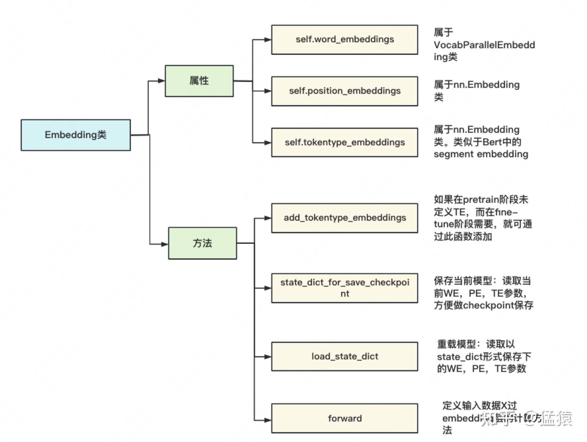

-   `self.word_embeddings`：来自自定义的 `VocabParallelEmbedding`（下面会详述）。**含“Parallel”则意味着参数在TP组间做了切割。** 因此 `self.word_embeddings` 是切割好的WE。每个进程上维护根据自己进程序号所取下的那块WE（例如下图中的WE1，WE2，图片来自Megatron原理篇）：


-   `self.position_embeddings` 和 `self.tokentype_embeddings` 这两者都和输入X相关，而输入X是不做切割的，因此这两者也无需切割。
-   `state_dict_for_save_checkpoint` 和 `load_state_dict`。在源码注解里，这两个函数分别给出了"easy load" 和"customize load"的注释，这个注释不是很贴切。实际上，前者用于在模型训练过程中及时读取当前参数，及时保存（做checkpoint）；后者则一般用于模型的重载，例如训到一半挂掉了，我们就重新初始化一个新模型，重载上个checkpoint保存下的权重。

Embedding层代码如下（一切尽在注释中）：

```python
class Embedding(MegatronModule):
    """Language model embeddings.

    Arguments:
        hidden_size: hidden size
        vocab_size: vocabulary size
        max_sequence_length: maximum size of sequence. This
                             is used for positional embedding
        embedding_dropout_prob: dropout probability for embeddings
        init_method: weight initialization method
        num_tokentypes: size of the token-type embeddings. 0 value
                        will ignore this embedding
    """

    def __init__(
        self,
        hidden_size, # 每个token的向量维度
        vocab_size, # 词表大小
        max_sequence_length, # 最长序列长度
        embedding_dropout_prob, # dropout probability for embeddings
        init_method, # 初始化权重的方法
        num_tokentypes=0, # 类似于Bert中的segment type
    ):
        super(Embedding, self).__init__()

        args = get_args()

        self.hidden_size = hidden_size
        self.init_method = init_method
        self.num_tokentypes = num_tokentypes
        self.max_sequence_length = max_sequence_length

        # WE size: (vocab_size//TP_N, hidden_size)
        # TP_N表示TP组模型并行度
        self.word_embeddings = mpu.VocabParallelEmbedding(
            vocab_size, self.hidden_size, init_method=self.init_method)
        self._word_embeddings_key = 'word_embeddings'

        self.vocab_size = vocab_size

        # PE size: (max_seq_len, hidden_size)
        self.position_embeddings = torch.nn.Embedding(
            max_sequence_length, self.hidden_size)
        self.position_embeddings = self.position_embeddings.half()
        self._position_embeddings_key = 'position_embeddings'
        # Initialize the position embeddings.
        self.init_method(self.position_embeddings.weight)

        # TE_size:(num_tokentypes, hidden_size)
        # TE类似于Bert中的segment embedding
        self._tokentype_embeddings_key = 'tokentype_embeddings'
        if self.num_tokentypes > 0:
            self.tokentype_embeddings = torch.nn.Embedding(self.num_tokentypes,
                                                           self.hidden_size)
            # Initialize the token-type embeddings.
            self.init_method(self.tokentype_embeddings.weight)
        else:
            self.tokentype_embeddings = None

        # Embeddings dropout
        self.embedding_dropout = torch.nn.Dropout(embedding_dropout_prob)

    def add_tokentype_embeddings(self, num_tokentypes):
        """如果在pretrain阶段未定义TE，而在fine-tune阶段TE，则可通过此函数添加
        """
        if self.tokentype_embeddings is not None:
            raise Exception('tokentype embeddings is already initialized')
        if torch.distributed.get_rank() == 0:
            print('adding embedding for {} tokentypes'.format(num_tokentypes),
                  flush=True)
        self.num_tokentypes = num_tokentypes
        self.tokentype_embeddings = torch.nn.Embedding(num_tokentypes,
                                                       self.hidden_size)
        # Initialize the token-type embeddings.
        self.init_method(self.tokentype_embeddings.weight)

    def forward(self, input_ids, position_ids, tokentype_ids=None):
        """定义输入X过embedding层的计算方法
        """

        # words_embeddings size = (b, seq_len, hidden_size)
        # 再次注意：self.word_embeddings做forward时，最终的输出结果时AllReduce的（见上图）
        words_embeddings = self.word_embeddings(input_ids)
        # position_embeddings size = （b, seq_len, hidden_size）
        position_embeddings = self.position_embeddings(position_ids)
        # embedding = WE + PE
        # embedding size = (b, seq_len, hidden_size)
        embeddings = words_embeddings + position_embeddings
        # 依需要决定是否增加TE
        if tokentype_ids is not None:
            assert self.tokentype_embeddings is not None
            embeddings = embeddings + self.tokentype_embeddings(tokentype_ids)
        else:
            assert self.tokentype_embeddings is None

        # Dropout.
        embeddings = self.embedding_dropout(embeddings)

        return embeddings

    def state_dict_for_save_checkpoint(
        self, destination=None, prefix='', keep_vars=False,
    ):
        """For easy load.
        在模型训练过程中及时读取当前参数，方便及时保存（做checkpoint）
        篇幅限制，这里不展示细节
        """
        ...

    def load_state_dict(self, state_dict, strict=True):
        """Customized load.
        用于模型的重载。例如训到一半挂掉了，我们就重新初始化一个新模型，
        重载上个checkpoint保存下的权重。
        篇幅限制，这里不展示细节
        """
        ...
```

## 六、VocabParallelEmbedding

该类用于定义分布式的word embedding，整体架构如下，同样只列举了核心属性和方法：

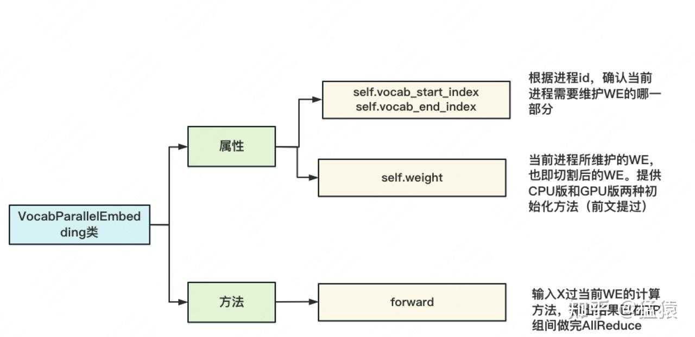

具体代码如下，**可以特别关注初始化和forward部分**，同时建议大家阅读理论篇中关于这一过程的详细讲解（一切尽在注释中）：

```python
class VocabParallelEmbedding(torch.nn.Module):
    """Embedding parallelized in the vocabulary dimension.

    This is mainly adapted from torch.nn.Embedding and all the default
    values are kept.
    Arguments:
        num_embeddings: vocabulary size.
        embedding_dim: size of hidden state.
        init_method: method to initialize weights.
    """

    def __init__(self, num_embeddings, embedding_dim, init_method=init.xavier_normal_):
        super(VocabParallelEmbedding, self).__init__()
        # Keep the input dimensions.
        self.num_embeddings = num_embeddings # vocab_size
        self.embedding_dim = embedding_dim # hidden_state.
        # Set the detauls for compatibility.
        self.padding_idx = None
        self.max_norm = None
        self.norm_type = 2.0
        self.scale_grad_by_freq = False
        self.sparse = False
        self._weight = None
        # 当前进程所在TP组进程总数
        self.tensor_model_parallel_size = get_tensor_model_parallel_world_size()
        # 根据当前进程在TP组中的序号，确定其所需维护的WE部分，沿着vocab维度对WE进行切割
        # 例如，进程id=0, 维护词表序号[0,5)范围内的数据；进程id=1，维护[5,10)
        (
            self.vocab_start_index,
            self.vocab_end_index,
        ) = VocabUtility.vocab_range_from_global_vocab_size(
            self.num_embeddings,
            get_tensor_model_parallel_rank(),
            self.tensor_model_parallel_size,
        )
        # 计算当前进程维护的词表大小
        self.num_embeddings_per_partition = (
            self.vocab_end_index - self.vocab_start_index
        )

        # 对WE做初始化
        args = get_args() # 读取预训练参数配置
        if args.use_cpu_initialization: # CPU上做初始化
            self.weight = Parameter( # 在CPU上先生成一个完整的WE
                torch.empty(
                    self.num_embeddings_per_partition,
                    self.embedding_dim,
                    dtype=args.params_dtype,
                    # dtype=torch.float32,
                )
            )
            # 对CPU上的WE做切割（随机种子在初始化分布式中已设定好，不用变）
            _initialize_affine_weight_cpu(
                self.weight,
                self.num_embeddings,
                self.embedding_dim,
                self.num_embeddings_per_partition,
                0,
                init_method, # 初始化权重的方法，例如xavier之类
            )
        else: # 在GPU上做初始化
            self.weight = Parameter( # 生成一个切割好的WE
                torch.empty(
                    self.num_embeddings_per_partition,
                    self.embedding_dim,
                    device=torch.cuda.current_device(),
                    dtype=args.params_dtype,
                    # dtype=torch.float32,
                )
            )
            # 在GPU上做初始化，注意TP组内不同进程采用不同的随机种子
            _initialize_affine_weight_gpu(
                self.weight, init_method, partition_dim=0, stride=1
            )

    def forward(self, input_):
        """定义输入X过WE的计算方法，输出结果已经过AllReduce"""
        if self.tensor_model_parallel_size > 1: # 如果使用TP
            # 如果在当前进程维护的WE上，找不到对应的单词，那么对应位置就赋0
            # 例如当前的数据的tokenid是：[2,7,1,5]，当前维护的词表是[0,1,2](start_index=0, end_index = 3)，
            # 则mask之后的数据为[2,0,1,0]
            # Build the mask.
            input_mask = (input_ < self.vocab_start_index) | (
                input_ >= self.vocab_end_index
            )
            # Mask the input.
            masked_input = input_.clone() - self.vocab_start_index
            masked_input[input_mask] = 0
        else:
            masked_input = input_

        # 输入X，过当前进程维护的部分WE的结果
        output_parallel = F.embedding(
            masked_input, # tensor containing indices into the embedding matrix
            self.weight, # 切割好的word embedding的权重
            self.padding_idx,
            self.max_norm,
            self.norm_type,
            self.scale_grad_by_freq,
            self.sparse,
        )
        # 当前词表不维护的部分，都设为0
        if self.tensor_model_parallel_size > 1:
            output_parallel[input_mask, :] = 0.0 #

        # 将TP组各GPU上的结果做AllReduce
        output = reduce_from_tensor_model_parallel_region(output_parallel)
        return output

def _initialize_affine_weight_cpu(...):
    """CPU版权重初始化。这个不难，大家可以自己阅读"""
    ...

def _initialize_affine_weight_gpu(...):
    """GPU版权重初始化。特别关注设置随机种子部分"""
    ...
    # 借助deepspeed或自定义的get_cuda_rng_tracker方法，对随机种子进行操作
    # get_cuda_rng_tracker细节，大家可自行阅读源码
    if ds_checkpointing.is_configured():
        global get_cuda_rng_tracker
        get_cuda_rng_tracker = ds_checkpointing.get_cuda_rng_tracker

    with get_cuda_rng_tracker().fork():
        init_method(weight)
```

## 七、ParallelSelfAttention：分布式block的一般套路

【阅读提示】：阅读本节时可：

-   对照第一部分CodeGeeX框架图
-   对照Megatron理论篇对矩阵切分的讲解

首先来看切割Attention的示意图，由图可知，**对QKV矩阵，采用“列切割”，对线性矩阵B，采用“行切割”。** 这样设计的好处是，在经过QKV的计算后，各进程在不用通讯的前提下，继续做线性计算，直到最后一步才AllReduce，起到降低通讯成本的作用：


我们先单独来看“列切割”与“行切割”的实现代码。Megatron将它们定义成了两个nn.Module类。

### 7.1 列切割：ColumnParallelLinear

列切割示意图如下：

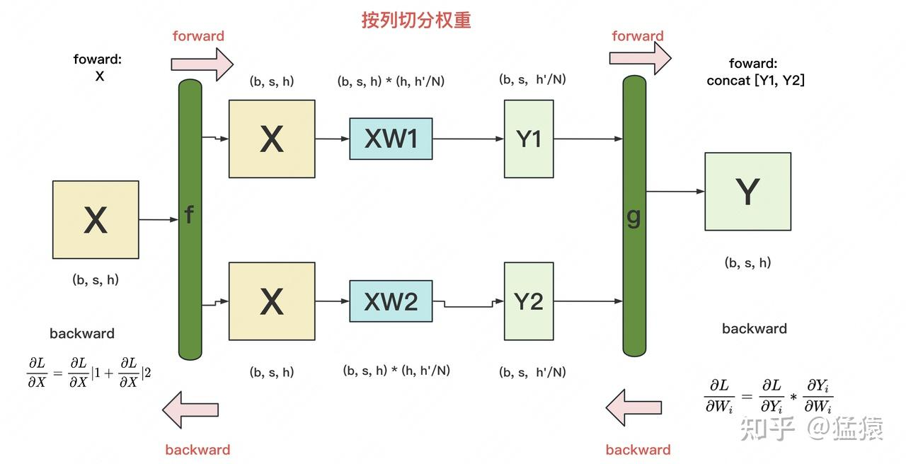

-   `f` 和 `g` **是两个共轭算子**，可理解为两个 `torch.autograd.Function` 类。在这个类下，我们可以 **根据需要重写forward和backward方法**。
-   `f`：**forward中，直接copy输入；backward中，对梯度做AllReduce**。在代码里定义为 `class _CopyToModelParallelRegion(torch.autograd.Function)`。
-   `g`：**forward中，all-gather输出；backward中，对梯度做split**（每张卡经过all-gather已有完整的Y了，因此以Y为起点计算梯度后，沿着列做split就可得到Y1和Y2的梯度）。在代码里定义为 `class _GatherFromModelParallelRegion(torch.autograd.Function)`。

代码如下：

```python
class ColumnParallelLinear(torch.nn.Module):
    """Linear layer with column parallelism.

    The linear layer is defined as Y = XA + b. A is parallelized along
    its second dimension as A = [A_1, ..., A_p].

    Arguments:
        input_size: first dimension of matrix A.
        output_size: second dimension of matrix A.
        bias: If true, add bias
        gather_output: If true, call all-gether on output and make Y avaiable
                       to all GPUs, otherwise, every GPU will have its output
                       which is Y_i = XA_i
        init_method: method to initialize weights. Note that bias is always set
                     to zero.
        stride: For the strided linear layers.
        keep_master_weight_for_test: This was added for testing and should be
                                     set to False. It returns the master weights
                                     used for initialization.
        skip_bias_add: This was added to enable performance optimations where bias
                       can be fused with other elementwise operations. we skip
                       adding bias but instead return it.
    """
    # 该类定义了切割后的权重W，例如对上图来说，W1和W2都可分别视为该类的一个实例

    def __init__(
        self,
        input_size, # W的第一个维度
        output_size, # W的第二个维度
        bias=True, # 是否需要引入bias
        gather_output=True, # 决定是否要将Y1和Y2做all-gather
        init_method=init.xavier_normal_,
        stride=1,
        keep_master_weight_for_test=False,
        skip_bias_add=False,
        params_dtype=None,
        skip_init=False,
        device=None,
    ):
        super(ColumnParallelLinear, self).__init__()

        # Keep input parameters
        self.input_size = input_size
        self.output_size = output_size
        self.gather_output = gather_output
        # Divide the weight matrix along the last dimension.
        # 当前进程所在TP组的总进程数
        world_size = get_tensor_model_parallel_world_size()
        # 每块GPU上维护的hidden_size的大小，等于 原hidden_zize // TP组总进程数
        self.output_size_per_partition = divide(output_size, world_size)
        self.skip_bias_add = skip_bias_add
        self.params_dtype = params_dtype
        self.device = device
        # Parameters.
        # Note: torch.nn.functional.linear performs XA^T + b and as a result
        # Initialize weight.
        args = get_args() # 取得命令行所有的参数
        if not skip_init:
            if args.use_cpu_initialization: # CPU上初始化
                self.weight = Parameter(
                    torch.empty(
                        self.output_size_per_partition,
                        self.input_size,
                        dtype=self.params_dtype if self.params_dtype is not None else args.params_dtype,
                    )
                )
                self.master_weight = _initialize_affine_weight_cpu( #
                    self.weight,
                    self.output_size,
                    self.input_size,
                    self.output_size_per_partition,
                    0,
                    init_method,
                    stride=stride,
                    return_master_weight=keep_master_weight_for_test,
                )
            else: # GPU上初始化
                self.weight = Parameter(
                    torch.empty(
                        self.output_size_per_partition,
                        self.input_size,
                        device=self.device if self.device is not None else torch.cuda.current_device(),
                        dtype=self.params_dtype if self.params_dtype is not None else args.params_dtype,
                    )
                )
                _initialize_affine_weight_gpu(
                    self.weight, init_method, partition_dim=0, stride=stride
                )
        else:
            self.register_parameter("weight", None)

        # 对bias做处理，道理同weight
        if bias and not skip_init:
            if args.use_cpu_initialization: # CPU上初始化
                self.bias = Parameter(
                    torch.empty(self.output_size_per_partition,
                                dtype=self.params_dtype if self.params_dtype is not None else args.params_dtype)
                )
            else:
                self.bias = Parameter( # GPU上初始化
                    torch.empty(
                        self.output_size_per_partition,
                        device=self.device if self.device is not None else torch.cuda.current_device(),
                        dtype=self.params_dtype if self.params_dtype is not None else args.params_dtype,
                    )
                )

            set_tensor_model_parallel_attributes(self.bias, True, 0, stride)
            # Always initialize bias to zero.
            with torch.no_grad():
                self.bias.zero_()
        else:
            self.register_parameter("bias", None)

    def forward(self, input_):
        # 定义列切割中的f算子
        # 调用copy_to_tensor_model_parallel_region则新建一个_CopyToModelParallelRegion实例（见下）
        input_parallel = copy_to_tensor_model_parallel_region(input_)

        bias = self.bias if not self.skip_bias_add else None # 定义bias
        output_parallel = F.linear(input_parallel, self.weight, bias) # X * 切割好的权重
        # 决定是否要对每个进程上的输出结果做All-Reduce
        if self.gather_output:
            # 定义列切割中的g算子
            # 调用gather_from_tensor_model_parallel_region则新建一个_GatherFromModelParallelRegion实例（见下）
            output = gather_from_tensor_model_parallel_region(output_parallel) # 把各GPU上的输出按照列gather起来后，作为最终输出
        else:
            output = output_parallel # 否则最终输出还是自己算的那块GPU
        output_bias = self.bias if self.skip_bias_add else None
        return output, output_bias

# 列切割中的f与g
class _CopyToModelParallelRegion(torch.autograd.Function):
    """Pass the input to the model parallel region."""
    # 列切割下的f算子
    # forward：copy输入
    # backward：对梯度做AllReduce

    @staticmethod
    def symbolic(graph, input_):
        return input_

    @staticmethod
    def forward(ctx, input_):
        return input_

    @staticmethod
    def backward(ctx, grad_output):
        return _reduce(grad_output)

class _GatherFromModelParallelRegion(torch.autograd.Function):
    """Gather the input from model parallel region and concatinate."""
    # 列切割中的g算子
    # forward：All-Gather输出
    # backward：对梯度，沿着列方向做split

    @staticmethod
    def symbolic(graph, input_):
        return _gather(input_)

    @staticmethod
    def forward(ctx, input_):
        return _gather(input_)

    @staticmethod
    def backward(ctx, grad_output):
        return _split(grad_output)
```

### 7.2 行切割：RowParallelLinear

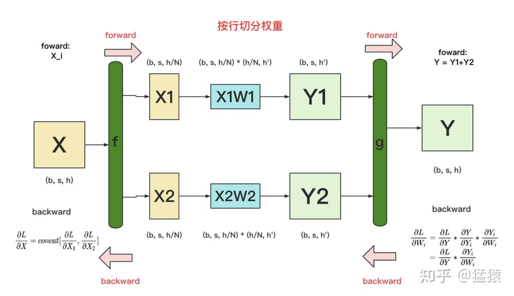

-   `f`：forward中，按列split输入；backward中，all-gather梯度
-   `g`：forward中，AllReduce输出；backward中，直接输出梯度，无需做任何通讯（因为经过g的foward，每块GPU上已拥有了Yi和Y，则根据图中g的backward公式可知，每块GPU可独立计算梯度）

代码如下：

```python
class RowParallelLinear(torch.nn.Module):
    """Linear layer with row parallelism.

    The linear layer is defined as Y = XA + b. A is parallelized along
    its first dimension and X along its second dimension as:
               -   -
              | A_1 |
              | .   |
          A = | .   |        X = [X_1, ..., X_p]
              | .   |
              | A_p |
               -   -
    Arguments:
        input_size: first dimension of matrix A.
        output_size: second dimension of matrix A.
        bias: If true, add bias. Note that bias is not parallelized.
        input_is_parallel: If true, we assume that the input is already
                           split across the GPUs and we do not split
                           again.
        init_method: method to initialize weights. Note that bias is always set
                     to zero.
        stride: For the strided linear layers.
        keep_master_weight_for_test: This was added for testing and should be
                                     set to False. It returns the master weights
                                     used for initialization.
        skip_bias_add: This was added to enable performance optimations where bias
                       can be fused with other elementwise operations. we skip
                       adding bias but instead return it.
    """

    def __init__(
        self,
        input_size,
        output_size,
        bias=True,
        input_is_parallel=False,
        init_method=init.xavier_normal_,
        stride=1,
        keep_master_weight_for_test=False,
        skip_bias_add=False,
        params_dtype=None,
        skip_init=False,
        device=None,
    ):
        super(RowParallelLinear, self).__init__()

        # Keep input parameters
        self.input_size = input_size
        self.output_size = output_size
        self.input_is_parallel = input_is_parallel
        # Divide the weight matrix along the last dimension.
        world_size = get_tensor_model_parallel_world_size()
        self.input_size_per_partition = divide(input_size, world_size)
        self.skip_bias_add = skip_bias_add
        self.params_dtype = params_dtype
        self.device = device

        # Parameters.
        # Note: torch.nn.functional.linear performs XA^T + b and as a result
        # we allocate the transpose.
        # Initialize weight.
        args = get_args()
        if not skip_init:
            if args.use_cpu_initialization:
                self.weight = Parameter(
                    torch.empty(
                        self.output_size,
                        self.input_size_per_partition,
                        dtype=self.params_dtype if self.params_dtype is not None else args.params_dtype,
                    )
                )
                self.master_weight = _initialize_affine_weight_cpu(
                    self.weight,
                    self.output_size,
                    self.input_size,
                    self.input_size_per_partition,
                    1,
                    init_method,
                    stride=stride,
                    return_master_weight=keep_master_weight_for_test,
                )
            else:
                self.weight = Parameter(
                    torch.empty(
                        self.output_size,
                        self.input_size_per_partition,
                        device=self.device if self.device is not None else torch.cuda.current_device(),
                        dtype=self.params_dtype if self.params_dtype is not None else args.params_dtype,
                    )
                )
                _initialize_affine_weight_gpu(
                    self.weight, init_method, partition_dim=1, stride=stride
                )
        else:
            self.register_parameter("weight", None)

        if bias and not skip_init:
            if args.use_cpu_initialization:
                self.bias = Parameter(
                    torch.empty(self.output_size,
                                dtype=self.params_dtype if self.params_dtype is not None else args.params_dtype)
                )
            else:
                self.bias = Parameter(
                    torch.empty(
                        self.output_size,
                        device=self.device if self.device is not None else torch.cuda.current_device(),
                        dtype=self.params_dtype if self.params_dtype is not None else args.params_dtype,
                    )
                )
            # Always initialize bias to zero.
            with torch.no_grad():
                self.bias.zero_()
        else:
            self.register_parameter("bias", None)

    def forward(self, input_):
        # Set up backprop all-reduce.
        if self.input_is_parallel:
            input_parallel = input_
        else:
            input_parallel = scatter_to_tensor_model_parallel_region(input_)
        # Matrix multiply.
        output_parallel = F.linear(input_parallel, self.weight)
        # All-reduce across all the partitions.
        output_ = reduce_from_tensor_model_parallel_region(output_parallel)
        if not self.skip_bias_add:
            output = output_ + self.bias if self.bias is not None else output_
            output_bias = None
        else:
            output = output_
            output_bias = self.bias
        return output, output_bias

# 行切割中的f和g算子
class _ScatterToModelParallelRegion(torch.autograd.Function):
    """Split the input and keep only the corresponding chuck to the rank."""
    # 行切割中的f算子
    # forward：沿列split输入
    # backward：all-gather梯度
    @staticmethod
    def symbolic(graph, input_):
        return _split(input_)

    @staticmethod
    def forward(ctx, input_):
        return _split(input_)

    @staticmethod
    def backward(ctx, grad_output):
        return _gather(grad_output)

class _ReduceFromModelParallelRegion(torch.autograd.Function):
    """All-reduce the input from the model parallel region."""
    # 行切割中的g算子
    # forward：AllReduce输出
    # backward：正常计算梯度，GPU间无需做任何通讯
    @staticmethod
    def symbolic(graph, input_):
        return _reduce(input_)

    @staticmethod
    def forward(ctx, input_):
        return _reduce(input_)

    @staticmethod
    def backward(ctx, grad_output):
        return grad_output
```

### 7.3 ParallelSelfAttention

该类的构造如下图：

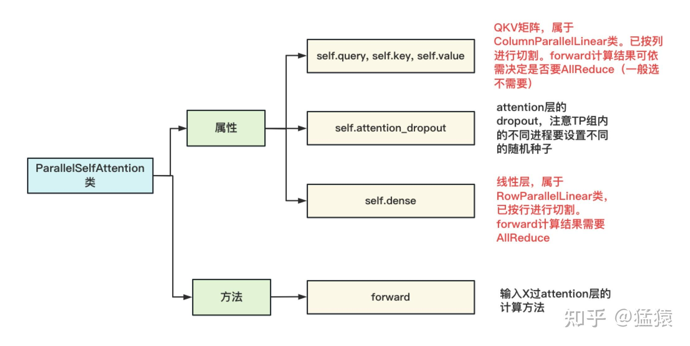

这张图中透露的核心含义是，**每个进程上维护的都是按列切割完的QKV矩阵**，进程间独立计算，QKV矩阵的输出结果一般不做AllReduce。同时，**每个进程上维护的是按行切割完的dense（线型层）矩阵**，Attention输出过线性层后的结果，做AllReduce。另外，在设置 **attention\_dropout** 时，同样调用了`get_cuda_rng_tracker` 方法，令TP组内的进程拥有不同的随机种子。最后，你可能想问，**dense后的dropout去哪里了**？代码里把它定义到了`ParallelTransformerLayer` 下（等于attention + mlp）。

相信有了上面的说明，看这块代码就不难了。篇幅限制，这里不展示代码了。大家可以对照着CodeGeeX架构图，来看这里multi-head attention的计算方式。
**ParallelMLP，ParallelTransformerLayer和ParallelTransformer都采用的是一样的套路，也略过不言**。

## 八、CrossEntropy

现在，终于可以来看模型的最后一层：交叉熵的平行计算。核心类为`_VocabParallelCrossEntropy`。
我们在原理篇中讲过交叉熵的并行计算，其优化核心是将通讯量从b\*s\*v降至b\*s。**但是Megatron代码中定义的交叉熵计算方式，稍微复杂一些，也和我们一般理解的交叉熵有些许差异**。所以我们先用图解，来看下代码定义的交叉熵计算流程：
【注】：

-   对X和Y\_i来说，(b, s, h)维度下应该画成一个立方体，为了表达简练，这里将b拍平了。
-   对其余维度中含b的矩阵，b正常表示，即row=b

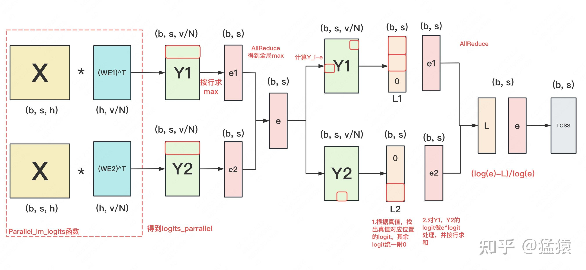

### 8.1 计算logit

首先，在使用`_VocabParallelCrossEntropy` 计算交叉熵前，我们需要计算logit。这时我们调用`parallel_lm_logits` 函数，将模型最后一层的输出X（复习一下，这个X已经在TP组内AllReduce了），乘上当前进程上维护的输入层WE的转置（复习一下，输入层和输出层共用一套embedding），得到当前进程的logit Y\_i，**同时我们选择不对输出logit做AllReduce。**

你可能会有一个疑惑：**在Transformer中，输出层会额外训练一个线性矩阵，来计算logit；为什么在gpt中，可以用输入层WE的转置来代替这个线性矩阵？**

这个问题的答案，对理解Megatron交叉熵计算也至关重要。我们可将 **X\*WE^T结果理解成“X与WE间的相似度”，** 例如对Y1来说，它的第一行中的每个logit，表示第一个token与词表里每个词的相似度。

注意到每个进程上只维护部分WE。例如，假设词表共有10个单词，WE1维护前5个单词，WE2维护后5个单词。因此再严格来说：**对Y1，它的第一行中的每个logit，表示第一个token与词表中前5个词的相似度；对Y2，它的第一行中的每个logit，表示第一个token与词表中后5个词的相似度。我们要记住这个含义**。

### 8.2 计算交叉熵

知道了logit的含义，我们来看交叉熵计算。
首先做了一系列求max的计算，得到基于全局的max(logit)，再将orig\_logit - max(logit)，得到处理后的结果。这步理解起来不难，主要目的是为了防止计算溢出。
**接下来，就是基于logit算loss了**。

-   每个进程上都有一份(b, s)维度的真值，它表示每个token的真值是哪个词（词用id表示）。我们基于这份真值，在Y\_i上找出真值位置的logit。例如：seq\_length = 3，即我们需要对3个token去做预测，假设前两个token的真值在第1个进程所维护的WE1中，最后一个token的真值在第2个进程所维护的WE2中。那么我们去Y1的前两行里，取出真值位置的logit，这个logit表示“token与真值的相似度”，去Y2的最后一行里做同样操作。
-   这样，我们就能得到L1和L2，和真值位置不对应的地方，统一填充0。随后对L1和L2做AllReduce，得到L。**L中的每行表示“token与真值间的相似度”**
-   现在，我们回来对Y1和Y2的每一行求sum(e^logit)，得到e1和e2。将e1和e2做AllReduce，得到e。**e中的每行表示“token和词表中所有词相似度的总和”**
-   我们希望（**token和词表中所有词相似度的总和-token与真值间的相似度) /token和词表中所有词相似度的总和** 这个值最小，这个差值就是最终的loss。

### 8.3 代码

理清了这点，现在可以来看代码了（一切尽在注释中），建议对这块还有疑问的朋友，可以写个test脚本把中间结果打印出来，方便理解：

```python
class _VocabParallelCrossEntropy(torch.autograd.Function):
    """
    分布式计算Loss
    """
    @staticmethod
    def forward(ctx, vocab_parallel_logits, target):
        # 1. logit - global max(logit)操作，主要目的是防溢出
        logits_max = torch.max(vocab_parallel_logits, dim=-1)[0] # (b, s, 1)
        torch.distributed.all_reduce( # (b, s, 1)
            logits_max,
            op=torch.distributed.ReduceOp.MAX, # 找全局最大值
            group=get_tensor_model_parallel_group(),
        )
        # Subtract the maximum value.
        vocab_parallel_logits.sub_(logits_max.unsqueeze(dim=-1)) # 原始GPU上维护的logits减去每行最大值（防止溢出）

        # 2、根据当前进程id，取出当前进程所维护词表序号等信息
        # 函数，能够获取当前进程所维护词表的start_index和end_index
        get_vocab_range = VocabUtility.vocab_range_from_per_partition_vocab_size
        # 这块GPU上logits最后一维的大小，等于所维护的词表的大小（v/N）
        partition_vocab_size = vocab_parallel_logits.size()[-1]
        # 取得当前进程所在TP组中的序号
        rank = get_tensor_model_parallel_rank()
        # 取得当前进程所在TP组的总进程数
        world_size = get_tensor_model_parallel_world_size()
        # 取得当前进程所维护的词表的start_index和end_index
        vocab_start_index, vocab_end_index = get_vocab_range(
            partition_vocab_size, rank, world_size
        )

        # 3. 基于真值，取出每个token在真值位置上的logit（即和真值的相似度）
        # Create a mask of valid vocab ids (1 means it needs to be masked)
        target_mask = (target < vocab_start_index) | (target >= vocab_end_index) # target = (b, s)
        masked_target = target.clone() - vocab_start_index
        masked_target[target_mask] = 0

        # Get predicted-logits = logits[target].
        # For Simplicity, we convert logits to a 2-D tensor with size
        # [*, partition-vocab-size] and target to a 1-D tensor of size [*].
        logits_2d = vocab_parallel_logits.view(-1, partition_vocab_size) # (b*s, v/N)
        masked_target_1d = masked_target.view(-1) # (b*s)
        arange_1d = torch.arange( # [b*s]
            start=0, end=logits_2d.size()[0], device=logits_2d.device
        )
        # logits_2d[arange_1d, masked_target_1d]:
        # tensor的切片操作。arange_1d：取出所有的行。masked_target_1d：取出logit
        predicted_logits_1d = logits_2d[arange_1d, masked_target_1d] # (b*s)
        predicted_logits_1d = predicted_logits_1d.clone().contiguous()
        predicted_logits = predicted_logits_1d.view_as(target) # (b, s)
        predicted_logits[target_mask] = 0.0
        # All reduce is needed to get the chunks from other GPUs.
        torch.distributed.all_reduce( # allreduce之后得到的logit矩阵为(b, s)，每一个位置表示对应真值位置的预测logit
            predicted_logits,
            op=torch.distributed.ReduceOp.SUM,
            group=get_tensor_model_parallel_group(),
        )

        # Sum of exponential of logits along vocab dimension across all GPUs.
        exp_logits = vocab_parallel_logits # （b, s, v/N）
        torch.exp(vocab_parallel_logits, out=exp_logits)
        sum_exp_logits = exp_logits.sum(dim=-1) # (b, s)
        torch.distributed.all_reduce(
            sum_exp_logits,
            op=torch.distributed.ReduceOp.SUM,
            group=get_tensor_model_parallel_group(),
        )

        # 4. 计算Loss = log(sum(exp(logits))) - predicted-logit.
        loss = torch.log(sum_exp_logits) - predicted_logits # (b, s)

        # Store softmax, target-mask and masked-target for backward pass.
        exp_logits.div_(sum_exp_logits.unsqueeze(dim=-1))
        ctx.save_for_backward(exp_logits, target_mask, masked_target_1d)

        return loss

    @staticmethod
    def backward(ctx, grad_output):

        # Retreive tensors from the forward path.
        softmax, target_mask, masked_target_1d = ctx.saved_tensors

        # All the inputs have softmax as their gradient.
        grad_input = softmax
        # For simplicity, work with the 2D gradient.
        partition_vocab_size = softmax.size()[-1]
        grad_2d = grad_input.view(-1, partition_vocab_size)

        # Add the gradient from matching classes.
        arange_1d = torch.arange(start=0, end=grad_2d.size()[0], device=grad_2d.device)
        grad_2d[arange_1d, masked_target_1d] -= 1.0 - target_mask.view(-1).float()

        # Finally elementwise multiplication with the output gradients.
        grad_input.mul_(grad_output.unsqueeze(dim=-1))

        return grad_input, None
```

## 九、总结

啊这总结怎么写呢，呕心沥血终于写完了。希望能给到大家帮助！

## 十、参考

1. **codegeex github:** [https://github.com/THUDM/CodeGeeX/tree/7365d9df242d87a5583d3f203e4b6c547dc6240e](https://link.zhihu.com/?target=https%3A//github.com/THUDM/CodeGeeX/tree/7365d9df242d87a5583d3f203e4b6c547dc6240e)

2. **NVIDIA Megatron github:** [https://github.com/NVIDIA/Megatron-LM/tree/2c493fb3fd37e5ecac068607b408ed5724d80fcc](https://link.zhihu.com/?target=https%3A//github.com/NVIDIA/Megatron-LM/tree/2c493fb3fd37e5ecac068607b408ed5724d80fcc)

3. **torch distributed tutorial:** [https://pytorch.org/docs/stable/distributed.html](https://link.zhihu.com/?target=https%3A//pytorch.org/docs/stable/distributed.html)

4. **init\_process\_group:** [https://www.cnblogs.com/rossixyz/p/15553670.html](https://link.zhihu.com/?target=https%3A//www.cnblogs.com/rossixyz/p/15553670.html)

5. **DeepSpeed Megatron tutorial:** [https://www.deepspeed.ai/tutorials/megatron/](https://link.zhihu.com/?target=https%3A//www.deepspeed.ai/tutorials/megatron/)

6. **codegeex paper:** [https://arxiv.org/abs/2303.17568](https://link.zhihu.com/?target=https%3A//arxiv.org/abs/2303.17568)
