写在最前面：我知道Megatron这个系列我delay了太久，但是，虽鸽但到嘛（狗头）。这篇文章比较长，代码注释也比较多，推荐大家可以pc端阅读。最后，附上一张上周我在动物园拍到的猴长老，希望我们读源码时永远都能保持平心静气。

源码解读系列将和大家一起来读Megatron的pretrain部分代码。

在本系列之前的文章中，我们介绍过Megatron pretrain部分的代码可分为四块：

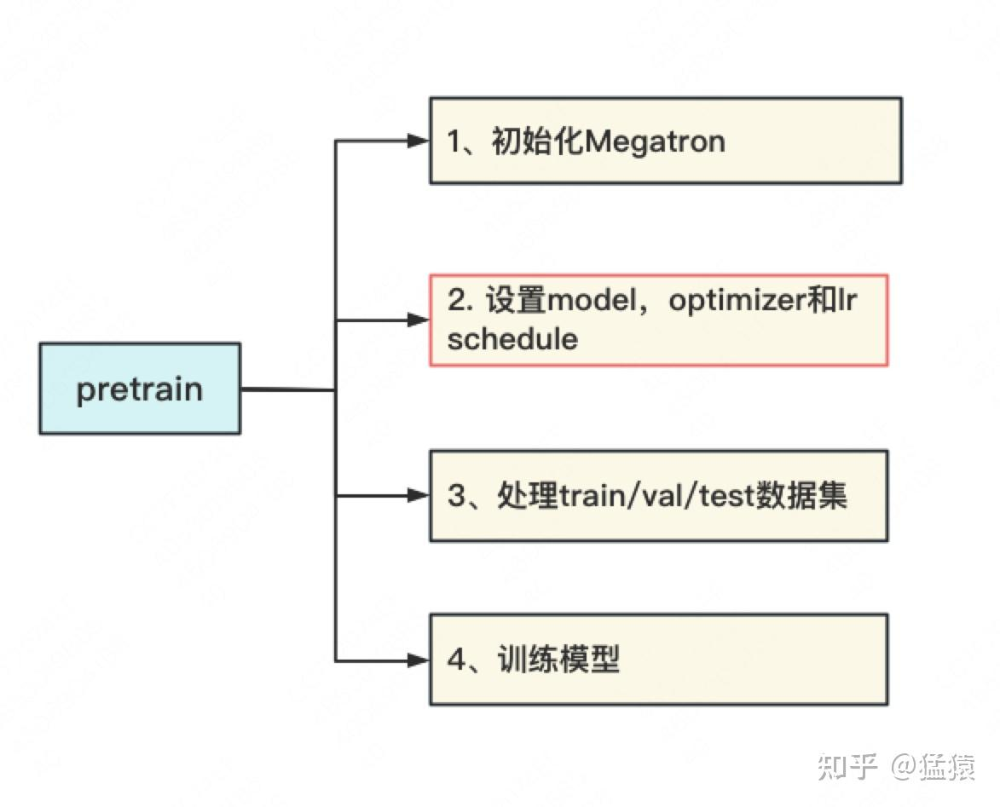

按这个划分，我们本预计出4篇介绍文章（截止到本文完成前，第1、2部分文章已出，链接见下）。但是当我开始整理剩余文章时，发现第2部分中关于optimizer的细节非常值得一读，同时它也和第4部分“训练模型”密切相关。**所以我决定加更一篇文章，详细介绍一下混合精度训练的原理，以及Megatron是如何做分布式混合精度训练的。**

**【大模型预训练系列文章】**

**[猛猿：图解大模型训练之：流水线并行（Pipeline Parallelism），以Gpipe为例](https://zhuanlan.zhihu.com/p/613196255)**

**[猛猿：图解大模型训练之：数据并行上篇(DP, DDP与ZeRO)](https://zhuanlan.zhihu.com/p/617133971)**

**[猛猿：图解大模型训练之：数据并行下篇(ZeRO，零冗余优化)](https://zhuanlan.zhihu.com/p/618865052)**

**[猛猿：图解大模型系列之：张量模型并行，Megatron-LM](https://zhuanlan.zhihu.com/p/622212228)**

**[猛猿：图解大模型系列之：Megatron源码解读1，分布式环境初始化](https://zhuanlan.zhihu.com/p/629121480)**

**[猛猿：图解大模型训练之：Megatron源码解读2，模型并行](https://zhuanlan.zhihu.com/p/634377071)**

**[猛猿：图解大模型训练系列之：Megatron源码解读3，分布式混合精度训练](https://zhuanlan.zhihu.com/p/662700424)**

[猛猿：图解大模型训练系列之：DeepSpeed-Megatron MoE并行训练（原理篇）](https://zhuanlan.zhihu.com/p/681154742)

[猛猿：图解大模型训练系列之：DeepSpeed-Megatron MoE并行训练（源码解读篇）](https://zhuanlan.zhihu.com/p/681692152)

**【全文目录如下】**：

**一、谁在占用存储**

**二、占用了多少存储**
2.1 fp16
2.2 fp32
2.3 bf16
2.4 总结

**三、混合精度训练**
3.1 图解混合精度训练总体流程
3.2 混合精度训练的存储计算
3.3 Loss Scale
\- (1) 到底为什么要“混合”
\- (2) 常量损失放大
\- (3) 动量损失放大
\- (4) Megatron中的动量损失放大
3.4 Clip Gradients

**四、Megatron代码解读**
4.1 入口函数
3.2 动态损失放大实现
3.3 混合精度训练实现
\- (1) **init**()
\- (2) step()

**五、参考**

**【敲公式与码字不易，点赞和喜欢，也是持续更新的动力～❤️❤️】**

## 一、谁在占用存储

**我们先把一个重要结论摆在前面：混合精度训练的主要目的之一是为了节省显存消耗。** 所以在开启混合精度训练的介绍前，我们需要了解两个问题：
（1）训练过程中，模型的哪些部分产生了显存消耗？
（2）具体消耗的显存大小，要如何计算？

我们先来看问题（1）。

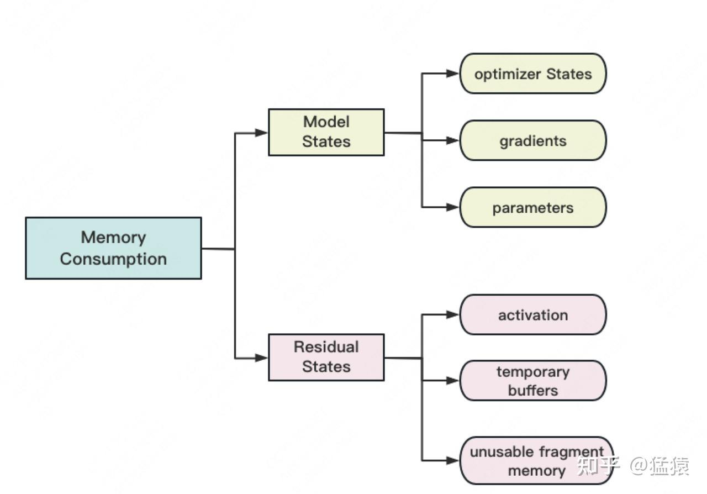

如图，**存储主要分为两大块：Model States和Residual States**。（以上分类标准参照DeepSpeed ZeRO论文）

**Model States** 指和模型本身息息相关的，必须存储的内容，具体包括：

-   **optimizer states**：Adam优化算法中的momentum和variance
-   **gradients**：模型梯度
-   **parameters**：模型参数W

**Residual States** 指并非模型必须的，但在训练过程中会额外产生的内容，具体包括：

-   **activation**：激活值。在流水线并行中（TODO）我们曾详细介绍过。在backward过程中使用链式法则计算梯度时会用到。有了它算梯度会更快，但它不是必须存储的，因为可以通过重新做Forward来算它。
-   **temporary buffers:** 临时存储。例如把梯度发送到某块GPU上做加总聚合时产生的存储。
-   **unusable fragment memory**：碎片化的存储空间。虽然总存储空间是够的，但是如果取不到连续的存储空间，相关的请求也会被fail掉。对这类空间浪费可以通过内存整理来解决。

通过这个图，你应该也发现了一个重要结论：**模型训练过程中，占用存储的不仅是模型本身（parameter），还有诸如梯度、激活值这样的中间结果。**

## 二、占用了多少存储

解决了问题（1），我们现在可以来看问题（2）了：到底占用了多少存储呢？举个例子，我们常说GPT3的参数量（paramter）有1750亿个，那如果换算成GB，它应该是多少呢？

其实，**参数占用存储的大小，与参数数值的表达精度密切相关**。所以，我们先来看深度学习中三种常用的精度表达：fp16、fp32与bf16。

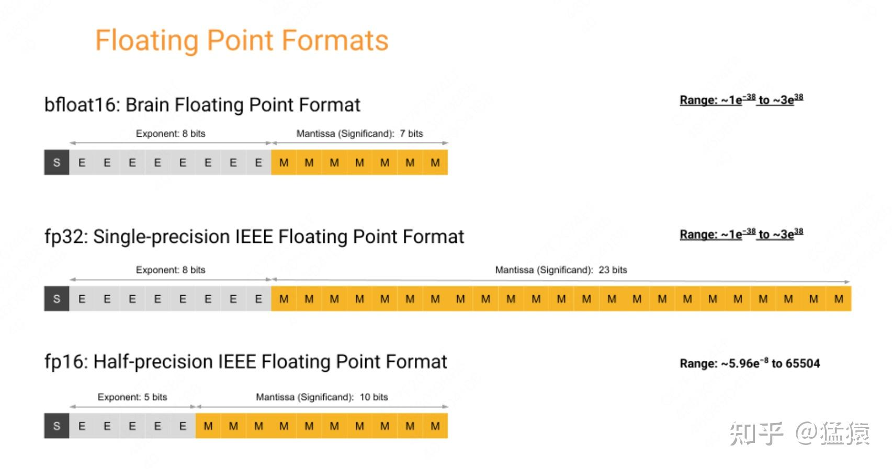

### 2.1 fp16

如图所示，**fp16又被称为半精度(half-precision)浮点表示。它一共由16个bit组成（2 bytes），这些bit又可以被拆成3部分**：

-   `sign位`：符号表示位，占1 bit
-   `exponent位`：指数表示位，占5 bit
-   `fraction位`：小数表示位，占10 bit

从这三部分的命名，不难发现，sign位控制正负，exponent位主导数值表达范围（例如-1024～1024，-65504～65504这种），fraction位控制的是表达精度（例如是0.009还是0.0091）。

我们来看下 **fp16从bitmap转换成数值的公式**：

-   **如果exponent位全为0**（回想一下exponent位对数值表达范围的主导性，此时意味着表达的数值非常小）:

-   如果fraction位全为0，则表示数字0
-   如果fraction位不全位0，则此时表示一个非常小的数字，换算公式为： $(-1)^{signbit} * 2^{-14} * (0 + \frac{fraction}{1024})$ ，其中fraction表示由fraction位的bitmap换算成十进制后的结果。

-   **如果exponent位全位1**（此时意味着表达的数值可能非常大）:

-   如果fraction位全为0，则表示 $\pm inf$ （表示超过了fp16的表达范围）
-   如果fracton位不全为0，则表示NAN

-   **exponent位的其他情况**：

-   计算公式为： $(-1)^{signbit} * 2^{(exponent - 15)} * (1 + \frac{fraction}{1024})$ ，其中，公式里的exponent和fraction表示由对应位的bitmap换算成十进制的结果。

如果看到这里你还觉得迷惑的话，没事，我们来看几个具体的计算例子：

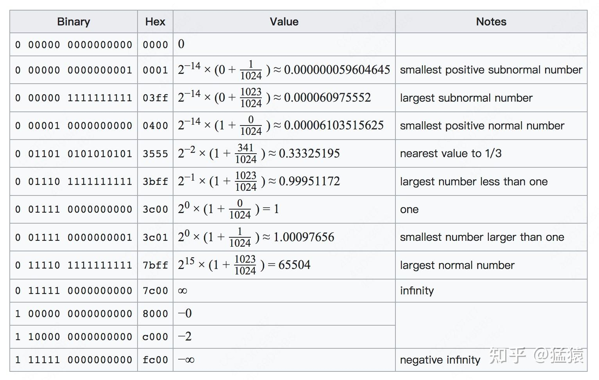

第三行的计算方式：
$(-1)^{0} * 2^{14} * (0 + \frac{1*2^{0} + 1 * 2^{1} + ... + 1*2^{9}}{1024}) = (-1)^{0} * 2^{14} * (0 + \frac{1023}{1024})$

第五行的计算方式（偷个懒，fraction部分的换算没有敲出来）：
$(-1)^{0} * 2^{1*2^{0} + 0 * 2^{1} + ... + 0 * 2^{4} - 15} * (1 + \frac{314}{1024}) = (-1)^{0} * 2^{-2} * (1 + \frac{314}{1024})$

在理解了以上表达方式的基础上，**我们易知，fp16的表达范围是：** $5.95e^{-8} \sim 65504$ **（取的是绝对值的表达范围，负向同理），超过这个表达范围，则会发生数据的上溢和下溢情况（记住这一点，后文的介绍中，我们会重点来看混合精度训练是如何处理这种溢出情况的）。**

### 2.2 fp32

fp32又被称为 **单精度(single-precision)浮点表示，是深度学习中标准的精度表示**。如2.1的图中所示，**它由32 bit组成（4 bytes）**，这些bit又可被拆为3部分：

-   `sign位`：符号表示位，占1 bit
-   `exponent位`：指数表示位，占8 bit
-   `fraction位`：小数表示位，占23 bit

不难理解，**fp32无论是从数值表示范围，还是从数值表示精度上来看，都要比fp16要宽广和精准**。**其数值表示范围约为** $1e^{-38} \sim 3e^{38}$ **。**

### 2.3 bf16

bf16又被称为 **brain浮点表示**，它是由Google Brain团队研发制定的精度表示方法。从2·1的图中可以发现，**bf16拥有和fp16一样的表示为（16bit，共2 bytes），但其数值表达范围却和fp32一致（** $1e^{-38} \sim 3e^{38}$ **），这是怎么回事呢？**

其实bf16相当于从fp32中对fraction部分做截取而来，因此它的exponent部分和fp32是一致的。我们之前说过exponent部分决定了数值的表达范围，这也就意味着bf16的表达范围和fp32一致。

我们再来对比bf16和fp16，**bf16的exponent位更多了，fraction位更少了，这意味着bf16表达的数值范围比fp16更宽广，但其表达精度却不如fp16**。下图总结了fp16，bf16和fp32在近1端的表达精度：

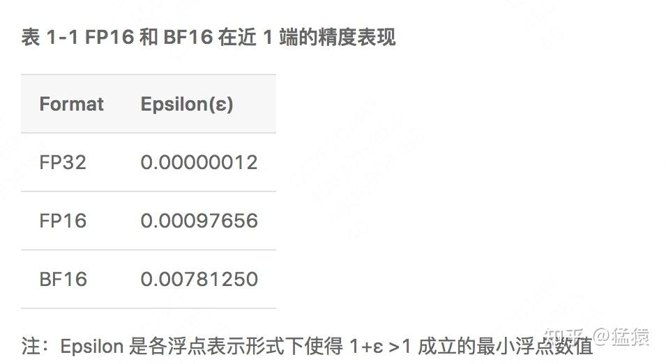

**bf16的表达精度不如fp16和fp32，那会出现什么问题呢**？理论上来说，它可能会对模型的收敛有一定影响，但实际操作中，大家发现bf16其实work得挺好。主要原因在于，**对于模型的训练过程来说，数据范围的宽广其实比数据精度更重要一些**。数据范围不足时即引发上溢和下溢问题，此时相关step等同于白训练了，我们也不会用存在inf/nan情况的梯度去更新权重。**用大白话来说，你得先到了对的范围，再去谈精度问题。**

### 2.4 总结

我们来对不同精度的表达方式做一个总结：

-   从占用存储角度看，**fp16占据2 bytes，bf16占据2 bytes，fp32占据4 bytes**
-   从数值表达范围来看：fp32 = bf16 > fp16
-   从数值表达精度来看：fp32 > fp16 > bf16
-   深度学习训练中，一般采用fp32，但出于节省存储，加快训练的目的，我们也会采用混合精度训练，即fp32 + fp16/bf16，这块细节将在下文说明。

## 三、混合精度训练

了解了fp16/fp32/bf16的表达方式后，我们就可以来看混合精度训练的原理了；而在了解原理之后，我们就能具体计算模型训练中占用的存储大小了。

### 3.1 混合精度训练总体流程

根据Megatron的源码，混合精度训练流程如下图所示：

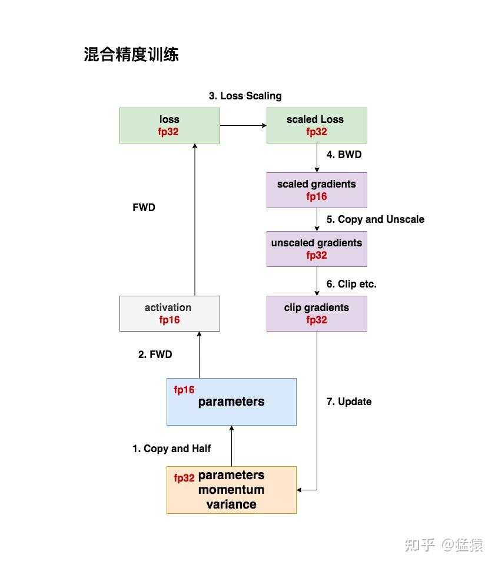

（1）**计算准备**：我们存储一份fp32的parameter，momentum和variance。然后，我们将parameter复制一份，再将其精度减半，得到一份fp16的parameter。

-   **fp32的parameter相当于“主权重”(在Megatron源码中被称为main\_param)。** 在模型训练的过程中，我们执行`optimizer.step()`更新的就应该是这份权重。当模型训练完毕后，我们保存的也是它。取得高精度的权重是我们的最终目标。
-   **fp16的parameter相当于“训练权重”（在Megatron源码中被称为model\_param）**，也就是在训练过程中实际参与前向传播过程的权重。**混合精度训练的核心思想也体现在这**：在整个训练过程里，我们不需要维持单精权重，通过半精权重+一些策略，我们依然也能顺利训练，还能达到节省显存和加速训练的目的。

（2）**FWD：使用fp16的parameter做前向计算**，在这过程中我们会得到fp16的activation（将在反向传播过程中被使用）。特别注意的是，如果没有采取重计算等操作，activation占据的存储会非常大（可能大过模型本身）。
**计算出来的loss我们用fp32精度来表示**，这样做是为了保证反向传播计算梯度的精确性。

（3）**Loss计算：为了防止梯度溢出（主要是下溢情况）**，我们对loss做scale处理，得到fp32的scaled loss。我们会在后文详细阐述loss scale的原理。

（4）**BWD：利用fp32的scaled loss做反向传播计算梯度**。因为loss做过scale了，那自然得到的也是scaled gradients，为了节省显存，**scaled gradients以fp16的形式存储**。

（5）**Unscaled gradients**：梯度以fp16的形式存储，但等到需要用梯度去更新模型权重时，就必须转换成fp32的形式了。在转换的同时，我们需要对梯度做unscale操作，让其恢复到原始值。（4）和（5）的步骤可以总结为：**在混合精度训练中，我们用fp16的形式存储梯度，等到实际更新模型时，再将其转换成fp32的梯度。**

这里需要特别强调一点，**就是我在图中写的“5、Copy and Unscale"中的Copy**。理论上说，当梯度从fp16转变为fp32时，fp16的梯度已经没用了，因此可以将其从存储中移除。但我看Megatron源码中没有相关操作（一会我们就来看相关代码），所以这时fp16和fp32的梯度是共存的。不知道我是否有看遗漏，有了解的朋友可以和我交流下。

**（6）Clip gradients**：在转换为fp32的梯度后，我们还可以执行clip等操作，来进一步预防梯度爆炸/消失。相关的细节我们会在后文详述。

好，以上就是混合精度训练的整体流程了，我总结下当前遗留的问题：

-   **知道混合精度训练的整体流程后，要怎么计算模型各部分占据的存储大小？**
-   **Loss Scale的原理是什么样的？这些数值的精度为什么要转来转去的，好头疼啊！**
-   **Clip Gradient的原理是什么样的？**
-   **Megratron是分布式的，那么分布式混合精度训练会有什么不同吗？**

接下来，我们就来逐一看这些细节。

### 3.2 混合精度训练下的存储计算

我们先忽略fp16的activation（因为正如前文所说，它是个不稳定因素，由于它总可以通过重新做前向计算得到，因此你可以视情况决定要不要保存它，而保存它的目的是为了让BWD过程计算更快），只看其余更必要的部分，则它们占据的显存大小如下（ $\Phi$ **表示模型参数量，表格中的显存大小的单位是byte**），计算方式来自DeepSpeed ZeRO原始论文：

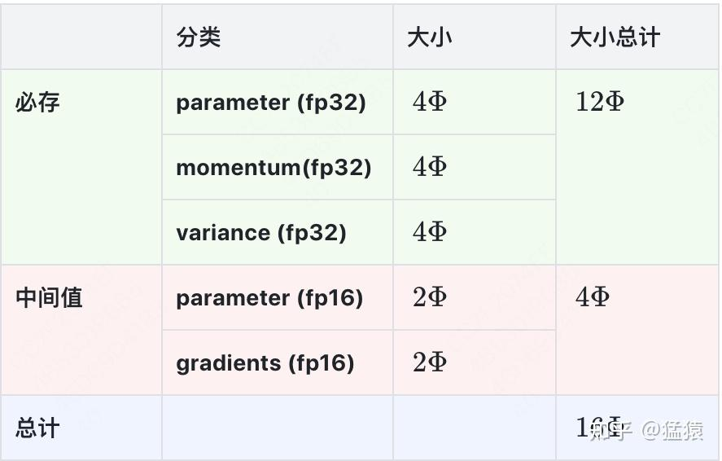

**这里我再特别说明下fp16的梯度。**

正如3.1中（5）所提，当fp16的梯度转变为fp32的梯度时，理论上fp16的梯度是可以删除的（或者inplace替换）。

-   如果代码中做了这个操作，那么秉持“以最高占用存储作为计算标准”的规则，我们可以将表格中fp16的梯度替换成fp32的梯度，则此时占用的总存储为 $18\Phi$ 。
-   如果代码中没做这个操作，让fp16和fp32的梯度共存了，那么此时占用的总存储为 $20\Phi$ 。

如果大家对更细维度的存储量计算（比如activation部分要怎么算）感兴趣，强烈推荐大家阅读[这篇好文](https://zhuanlan.zhihu.com/p/624740065)

### 3.3 Loss Scale

现在，我们来看混合精度训练的核心技术：Loss Scale。

如果你是第一次了解混合精度训练，在看完3.1的流程图后，你可能会发出一个人生疑问：**这些东西的精度为什么要转来转去的，烦死啦！如果只是为了节省显存，那我就直接用fp16的精度做完整个训练就行啦，难道会有什么问题吗？**

为了解决这个烦死了的问题，我们先来研究下“到底为什么要做混合精度训练。”

**（1）到底为什么要做混合精度训练**

**原因一：舍入误差**

在第二部分我们说过，一般模型训练的标准精度是fp32，如果现在我们为了节省显存，从头到尾都用fp16来做训练，会发生什么呢？

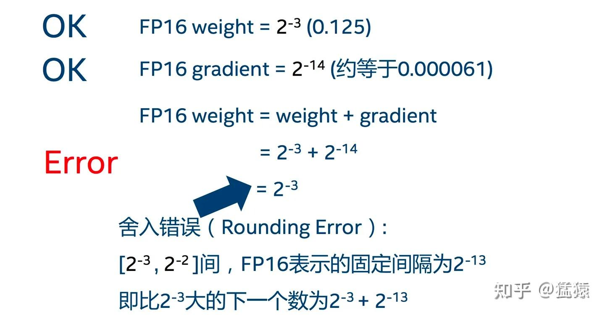

假设在fp16的条件下，我们当前某个权重为 $2^{-3}$ ，对应梯度为 $2^{-14}$ ，那么执行梯度更新时（忽略学习率），我们得到的更新结果是： $2^{-3} + 2^{-14} = 2^{-3}$

**嗯？怎么回事，这权重怎么没更新呢？主要原因就是fp16下会产生舍入错误**（详情见图），这就导致你这轮训练白做了，对权重没有丝毫影响。

fp16的各个区间的舍入误差如下：

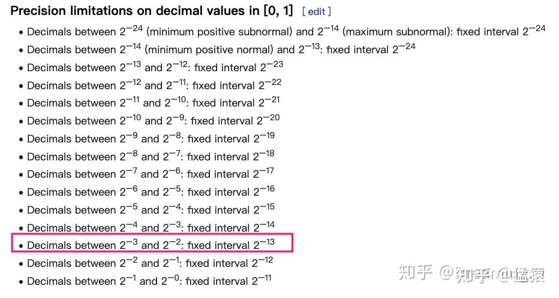

**原因二：梯度下溢**

那你可能会问：“那在训练中，梯度会一直这么小吗？”，我们来看一组训练后期激活函数梯度分布的情况：

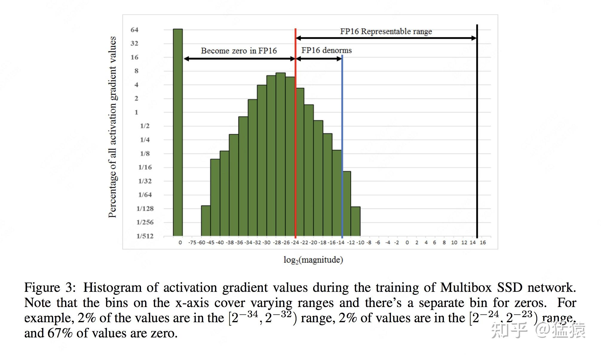

可以发现，在训练后期，有67%的梯度的值会小于 $2^{-24}$ （复习一下，这是fp16所表示的数值范围的下界，也就是梯度可能比你想得还要小），**也就是说，如果全程用fp16做训练，在训练后期就会频繁出现梯度下溢的问题，使得整个训练过程不能正常进行。**

对于 **舍入误差** 问题，我们可以选择在更新模型权重时，将梯度从fp16转成fp32进行更新，而转变后的fp16权重可做存储释放，这样既满足我们在计算过程中节省显存、加速计算的目的，又能解决舍入误差造成的模型权重无法正常更新的问题。

而对于 **梯度下溢** 问题，常用的办法是 **loss scale**。**Loss Scale的核心就在于：如果我把Loss放大N倍，那这样计算出来的梯度就能放大N倍，自然而然就不会发生梯度下溢的问题了。**

基于此，混合精度训练诞生了。**另外需要再说明的一点是，混合精度训练并不意味着所有的模型参数都是以fp16的形式参与训练的，例如做LN/BN时的参数一般就保持fp32的形式，Loss也保持fp32的形式**，主要原因还是这些数值的精度对模型训练过程影响较大，同时它们占据的存储也不大，因此维持原始形式，越高精越好。

好，那现在再举一反三一下：**如果我们把fp16替换成bf16，还需要做Loss Scale吗？** 复习一下第二部分，我们介绍过bf16和fp32的数值表达范围是一致的，只是表达精度有所欠缺。**由于不存在梯度下溢问题**，**因此如果你使用bf16，可以不采取loss scale，或者可以用一个常量loss scale**（Megatron也是这么做的）。

关于做混合精度训练的原因，我们就介绍到这。接下来，我们来看两种做Loss Scale的方法：**常量损失放大和动量损失放大**。

**（2）常量损失放大**

在3.3中的（1）里我们介绍过：**Loss Scale的核心是将Loss放大N倍，使得计算出来的梯度也放大N倍，进而解决fp16精度表示下的梯度下溢问题。**

**如果我们训练全程，我们只采用一个固定的缩放因子loss\_scale来缩放loss的话，就被称为“常量损失放大”**，其流程如下：

-   **Scale up阶段**：在backward阶段，将loss值放大2^(loss\_scale)倍，用放大后的loss计算梯度，然后正常用fp16存储梯度
-   **Scale down阶段**：在我们需要用梯度进行更新时，

-   先检查 **放大后的梯度值是否出现上溢(inf/nan)的情况**（毕竟放大loss后下溢问题是解决了，但副作用是可能出现上溢），**如果有，则跳过本step权重更新**
-   如果不存在梯度上溢情况，则将fp16的梯度unscale，即将梯度值缩小2^(loss\_scale)倍，并恢复成fp32的梯度，用于做本step权重更新。

这方法听着不错，但它有个显而易见的问题：这个loss\_scale我该设成多少合适呢？太小了，解决不了梯度下溢问题；太大了，又容易发生梯度上溢的情况。**有没有一种办法，让模型探索性地去寻找和更新这个loss\_scale？**

**（3）动量损失放大**

该方法的总体目标是，**动态地找到一个尽可能大的loss\_scale，使得其在解决梯度下溢的同时，尽可能避开梯度上溢情况**。
（a）首先，先用一个非常大的loss\_scale，比如2^24，然后用放大后的loss计算梯度
（b）检查放大后的梯度是否出现上溢（inf/nan）：

-   没有出现上溢，则把梯度unscale成fp32，正常做本step权重更新
-   **出现上溢，则跳过本step权重更新**，同时将loss\_scale缩小F倍（F的默认值为2）
-   在训练后期，梯度的波动幅度逐步稳定，此时可以尝试放大loss scale，例如每N次iteration就放大F倍（N默认为2000）。如果放大loss scale后再次出现梯度上溢情况，可以将梯度回退成放大前的结果，以此类推

**以上步骤的核心就是，遇到梯度上溢，就缩小loss scale并跳过相关step更新；连续若干次没有遇到梯度上溢，就尝试增大loss\_scale。**

所以，如果你在训练初期发现模型偶尔出现inf/nan的情况，其实这是正常的，因为动量策略本身就是一个探索性的策略。

**（4）Megatron中的损失放大**

Megatron同样提供了常量和动态两种损失放大方法。常量方法我们就不说了，着重来介绍下动态方法。**Megatron基本维持了（3）中动态方法的核心思想，在此基础做了一些变种：**

-   `self._scale`：表示初始化loss scale
-   `self.min_scale`：表示loss scale的最小值
-   `self.growth_interval`：表示连续无梯度上溢的迭代次数
-   `self.growth_factor`：当 **连续**`self.growth_interval`次未出现梯度上溢时，就将loss scale扩大`self.growth_factor`倍
-   `self.hysteresis`：表示最多允许出现梯度上溢的迭代次数
-   `self.backoff_factor`：当 **累计** 出现`self.hysteresis`次梯度上溢的情况时（注意是累计不是连续），则将loss scale缩小`self.backoff_factor`倍。缩小公式为self.\_scale = torch.max(self.\_scale \* self.backoff\_factor, self.min\_scale)。缩小后重新开始计算梯度上溢的次数。‘

后文我们会看到具体的代码片段，这里大家通过变量含义，了解一下大致策略流程即可。

### 3.4 Clip gradients

梯度剪裁相信大家都很熟悉了，这里我们简单介绍下两种剪裁方法，方便大家读代码时对照着看：
（1）**对单个梯度，固定阈值剪裁。** 比如阈值设定成min=-1，max=1，那么对于某个梯度值，如果小于这个范围，就置为-1，大于这个范围，就置为1。这个做法的难点是阈值难定。

（2）**根据全量梯度组成的梯度向量的范数来剪裁**。

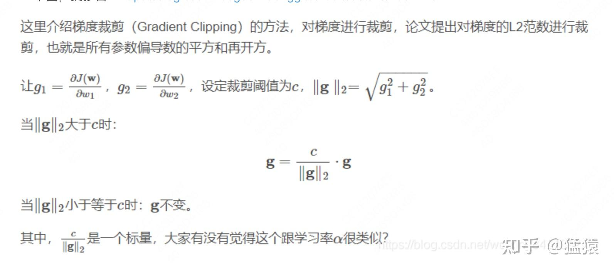

## 四、Megatron代码解读

好的，我们终于进入到Megatron混合精度代码解读的部分了 。
由于鸽了大家太久（已经在深刻自我反省了），所以我们再来回顾一下pretrain入口函数的4个组成部分（路径：`megatron/training.py`的`pretrain` 函数）:

```python
def pretrain(
    train_valid_test_dataset_provider,
    model_provider,
    forward_step_func,
    valid_forward_step_func=None,
    extra_args_provider=None,
    args_defaults={},
):
    # 1.初始化分布式环境
    initialize_megatron(
        extra_args_provider=extra_args_provider, args_defaults=args_defaults
    )
    ...
    # 2、模型并行：定义模型架构，并切割模型
    model, optimizer, lr_scheduler = setup_model_and_optimizer(model_provider)
    ...

    # 3、构造train/val/test数据集
    ... (
            train_data_iterator,
            valid_data_iterator,
            test_data_iterator,
        ) = build_train_valid_test_data_iterators(train_valid_test_dataset_provider)

    ...
    # 4、训练
    iteration = train(
            forward_step_func,
            valid_forward_step_func,
            model,
            optimizer,
            lr_scheduler,
            train_data_iterator,
            valid_data_iterator,
        )

    ...
```

其中，函数`setup_model_and_optimizer`调用了`optimizer/__init__.py/`下的`get_megatron_optimizer`，因此它就是混合精度训练的入口函数。

### 4.1 入口函数

调用`optimizer/__init__.py/get_megatron_optimizer`，将返回一个能够做分布式混合精度训练的optimizer。我们来具体看下这个函数的代码实现，一切尽在注释中：

```python
def get_megatron_optimizer(model):
    args = get_args()

    # ---------------------------------------------------------------
    # 不对CPU做分布式optimizer
    # ---------------------------------------------------------------
    if args.cpu_optimizer:
        raise NotImplementedError("need to add cpu adam")

    # ------------------------------------------------------------------
    # 将模型权重分为“需要做衰减/不需要做衰减”两部分。
    # LN和bias不做权重衰减，其余系数正常做衰减
    # param_groups = (weight_decay_params, no_weight_decay_params)
    # 复习一下模型并行代码篇讲过的内容：这里的param不是全量param，是根据当前进程id
    # 切割好的param
    # 权重衰减的本质是为了防止过拟合，对权重衰减不了解的朋友，可参考：
    # https://blog.csdn.net/program_developer/article/details/80867468
    # ------------------------------------------------------------------
    param_groups = _get_params_for_weight_decay_optimization(model)

    # ------------------------------------------------------------------
    # 根据需求，设定adam/sgd优化器
    # ------------------------------------------------------------------
    if args.optimizer == "adam":
        optimizer = Adam(
            param_groups,
            lr=args.lr,
            weight_decay=args.weight_decay,
            betas=(args.adam_beta1, args.adam_beta2),
            eps=args.adam_eps,
        )
    elif args.optimizer == "sgd":
        optimizer = SGD(
            param_groups,
            lr=args.lr,
            weight_decay=args.weight_decay,
            momentum=args.sgd_momentum,
        )
    else:
        raise Exception("{} optimizer is not supported.".format(args.optimizer))

    # ------------------------------------------------------------------
    # 如果使用了deepspeed，那optimizer就交给它做后续处理
    # ------------------------------------------------------------------
    if args.deepspeed:
        return optimizer

    # ------------------------------------------------------------------
    # 如果未使用deepspeed，就手动写后续混合精度处理代码
    # params_have_main_grad表示在使用torch DDP的过程中，是否曾通过连续buffer
    # 来存储数值。
    # 如果否，则梯度照常存在tensor.grad下
    # 如果是，则梯度存在tensor.main_grad下
    # 我们在下文会更详细介绍这块
    # ------------------------------------------------------------------
    params_have_main_grad = False
    if args.DDP_impl == "local":
        params_have_main_grad = True

    # ------------------------------------------------------------------
    # 如果我们使用混合精度训练，即训练过程中用fp16/bf16
    # ------------------------------------------------------------------
    if args.fp16 or args.bf16:

        # ---------------------------------------------------------------------------------------
        # 设置grad scaler（即本文3.3中所说的loss scale策略）
        # 1、如果我们提供了loss_scale(args.loss_scale)，我们就用它初始化一个常量scaler
        # 2、如果我们没有提供loss_scale, 且我们在使用fp16，就用一个动态的scaler
        # 4、如果我们在使用bf16，就不需要loss_scale（原因参见3.3（1））
        # ---------------------------------------------------------------------------------------
        grad_scaler = None
        # Constant loss scale.
        if args.loss_scale:
            grad_scaler = ConstantGradScaler(args.loss_scale)
        # Dynamic loss scale.
        else:
            if args.fp16:
                grad_scaler = DynamicGradScaler(
                    initial_scale=args.initial_loss_scale,
                    min_scale=args.min_loss_scale,
                    growth_factor=2.0,
                    backoff_factor=0.5,
                    growth_interval=args.loss_scale_window,
                    hysteresis=args.hysteresis,
                )

        # 用于做混合精度训练的optimizer
        return Float16OptimizerWithFloat16Params(
            optimizer,
            args.clip_grad,
            args.log_num_zeros_in_grad, # 值为0的梯度数量
            params_have_main_grad,
            args.bf16,
            grad_scaler,
        )
    # ---------------------------------------------------------------------------------------
    # 不使用混合精度训练，全程都用fp32
    # ---------------------------------------------------------------------------------------
    # FP32.
    return FP32Optimizer(
        optimizer, args.clip_grad, args.log_num_zeros_in_grad, params_have_main_grad
    )
```

其余部分我们都说的比较清楚了，这里着重看一下`params_have_main_grad`这个变量。
我们在注释里说过：

-   params\_have\_main\_grad = False，则梯度在tensor.grad下，这也是我们一般读取梯度的方式。
-   params\_have\_main\_grad = True，则梯度在tensor.main\_grad下，这是我们手动创建的读取梯度的方式。‘

main\_grad来自在`model/distribued.py`脚本中我们对pytorch DDP的重定义。在原始DDP的基础上，我 **们希望通过连续buffer来存储数据（就是dtype相同的参数放在同一块buffer下，连续存储，避免离散存储时因内存空间不够而造成的存储fail）**。那这个时候梯度不存在tensor.grad下，存在优化后我们指定的属性tensor.main\_grad下。**本质是为了更好利用存储空间**。

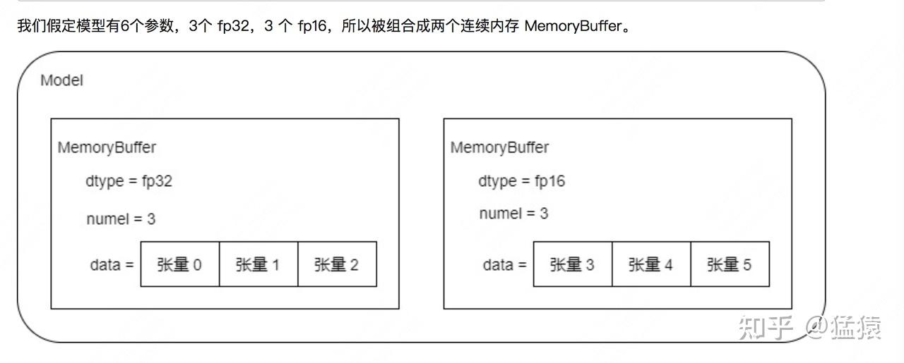

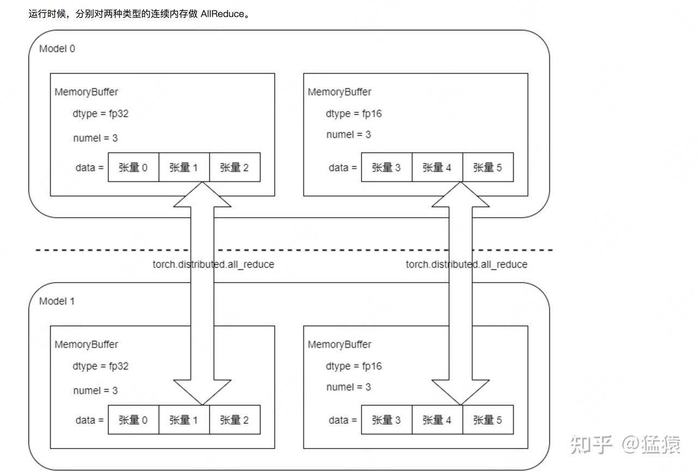

之所以把这一块单独拿出来说明，是因为它取的名字比较有迷惑性，会让人觉得既然叫main\_grad，那是不是对应着混合精度训练中fp32的梯度呢？其实不是的，它只是和存储优化相关的一个定义。

看完这个入口函数，接下来我们要关注两块细节：

-   **DynamicGradScaler：动态损失放大怎么实现？**
-   **Float16OptimizerWithFloat16Params：分布式混合精度训练的optimizer怎么实现？**

### 4.2 动态损失放大实现方法：DynamicGradScaler

DynamicGradScaler这个类在`optimizer/grad_scaler.py`这一脚本下。大家可以配合3.3的（3）进行阅读，我们直接看代码（一切尽在注释中）

```python
class MegatronGradScaler(ABC):
    def __init__(self, initial_scale):
        """Initialize scale value with the input initial scale.
        初始化loss_scale，同时规定loss_scale必须大于0
        """
        assert initial_scale > 0.0
        self._scale = torch.cuda.FloatTensor([initial_scale])

    @property
    def scale(self):
        return self._scale

    @property
    def inv_scale(self):
        return self._scale.double().reciprocal().float()

    @abstractmethod
    def update(self, found_inf):
        pass

    @abstractmethod
    def state_dict(self):
        pass

    @abstractmethod
    def load_state_dict(self, state_dict):
        pass


class DynamicGradScaler(MegatronGradScaler):
    def __init__(
        self,
        initial_scale,
        min_scale,
        growth_factor,
        backoff_factor,
        growth_interval,
        hysteresis,
    ):
        """ "Grad scaler with dynamic scale that gets adjusted
        during training.
        Params:
            self._scale：表示初始化loss scale
            self.min_scale：表示loss scale的最小值
            self.growth_interval：表示连续无梯度上溢的迭代次数
            self.growth_factor：当连续self.growth_interval次未出现梯度上溢时，
                               就将loss scale扩大self.growth_factor倍
            self.hysteresis：表示最多允许出现梯度上溢的迭代次数
            self.backoff_factor：当累计出现self.hysteresis次梯度上溢的情况时（注意是累计不是连续），
                                 则将loss scale缩小self.backoff_factor倍。
                                 缩小公式为self._scale = torch.max(self._scale * self.backoff_factor, self.min_scale)。
                                 缩小后重新开始计算梯度上溢的次数。
        """
        super(DynamicGradScaler, self).__init__(initial_scale)

        # Lower bound on the scale.
        assert min_scale > 0.0
        assert min_scale <= initial_scale
        self.min_scale = torch.cuda.FloatTensor([min_scale])

        # Growth and backoff factors for the scale.
        assert growth_factor > 1.0
        self.growth_factor = torch.cuda.FloatTensor([growth_factor])

        assert backoff_factor < 1.0
        assert backoff_factor > 0.0
        self.backoff_factor = torch.cuda.FloatTensor([backoff_factor])

        # Interval over which if we don't see any inf/nan,
        # we will scale the grad scale by the growth factor.
        assert growth_interval > 0
        self.growth_interval = growth_interval

        # Number of inf/nans we should see before scaling down
        # the grad scale by the backoff factor.
        assert hysteresis > 0
        self.hysteresis = hysteresis

        # Trackers.
        self._growth_tracker = 0
        self._hysteresis_tracker = self.hysteresis

    def update(self, found_inf):
        """
        更新loss scale
        """
        # -------------------------------------------------------------
        # 一旦发现梯度溢出（inf/nan）的情况
        # -------------------------------------------------------------
        if found_inf:
            self._growth_tracker = 0
            self._hysteresis_tracker -= 1
            # 如果_hysteresis_tracker变成<=0了，
            # 说明梯度溢出的次数已经超过了我们设定的阈值，
            # 这时就要惩罚性地缩小loss_scale
            我们就要减少loss_scale
            if self._hysteresis_tracker <= 0:
                self._scale = torch.max(
                    self._scale * self.backoff_factor, self.min_scale
                )
        # -------------------------------------------------------------
        # 如果没有发现梯度inf/nan
        # -------------------------------------------------------------
        else:
            # If there is no nan/inf, increment the growth tracker.
            self._growth_tracker += 1
            # 如果我们已经连续多次没有出现inf/nan，我们就可以增大loss scale
            if self._growth_tracker == self.growth_interval:
                # Reset the tracker and hysteresis trackers,
                self._growth_tracker = 0
                self._hysteresis_tracker = self.hysteresis
                # and scale up the loss scale.
                self._scale = self._scale * self.growth_factor

    def state_dict(self):
        state_dict = {}
        state_dict["scale"] = self._scale
        state_dict["growth_tracker"] = self._growth_tracker
        state_dict["hysteresis_tracker"] = self._hysteresis_tracker
        return state_dict

    def load_state_dict(self, state_dict):
        self._scale = state_dict["scale"].cuda(torch.cuda.current_device())
        self._growth_tracker = state_dict["growth_tracker"]
        self._hysteresis_tracker = state_dict["hysteresis_tracker"]


```

### 4.3 混合精度训练实现：Float16OptimizerWithFloat16Params

Float16OptimizerWithFloat16Params的定义在`optimizer/__init__.py`脚本下，我们来看代码（建议大家按照本段代码下面的文字指引进行阅读）：

```python
class Float16OptimizerWithFloat16Params(MegatronOptimizer):
    """Float16 optimizer for fp16 and bf16 data types.

    Arguments:
        optimizer: base optimizer such as Adam or SGD

        clip_grad: clip gradeints with this global L2 norm. Note
            that clipping is ignored if clip_grad == 0
            梯度剪裁的阈值(也就是3.4中说的常量c)，如果等于0说明我们不做梯度剪裁

        log_num_zeros_in_grad: return number of zeros in the gradients.

        params_have_main_grad: flag indicating if parameters have
            a `main_grad` field. If this is set, we are assuming
            that the model parameters are store in the `main_grad`
            field instead of the typical `grad` field. This happens
            for the DDP cases where there is a contihuous buffer
            holding the gradients. For example for bfloat16, we want
            to do gradient accumulation and all-reduces in float32
            and as a result we store those gradients in the main_grad.
            Note that main grad is not necessarily in float32.
            相关说明见4.1中的解释，注意main_grad并不一定是fp32的

        bf16: if true, the model is running in bfloat16.

        grad_scaler: used for scaling gradients. Note that this can be
            None. This case happens when `bf16 = True` and we don't
            use any loss scale. Note that for `bf16 = True`, we can have
            a constnat gradient scaler. Also for `bf16 = False`, we
            always require a grad scaler.
            当模型是用bf16跑的时候，我们要么用一个常数的loss scale，要么不用loss scale（原因见3.3（1）），
            不用的话grad_scaler = None

            当模型不是bf16跑的时候，我们一般要用一个loss scale，至于是常数的，还是动态的，就靠自己决定了
    """

    def __init__(
        self,
        optimizer,
        clip_grad,
        log_num_zeros_in_grad,
        params_have_main_grad,
        bf16,
        grad_scaler,
    ):

        super(Float16OptimizerWithFloat16Params, self).__init__(
            optimizer, clip_grad, log_num_zeros_in_grad, params_have_main_grad
        )

        self.bf16 = bf16
        self.grad_scaler = grad_scaler
        # -------------------------------------------------------------------
        # None grad scaler is only supported for bf16.
        # 用fp16跑模型时，一定要用loss scale
        # -------------------------------------------------------------------
        if self.grad_scaler is None:
            assert self.bf16, "fp16 expects a grad scaler."

        # ---------------------------------------------------------------------
        # Tensor used to determine if a nan/if has happend.
        # Any non-zero value indicates inf/nan.
        # Note that we keep this for the cases that grad scaler is none.
        # We still record nan/inf if we have a bfloat16 with a grad scaler.
        # 用于记录【所有gpu上】是否发生了梯度溢出的情况，
        # 值为0时表示所有gpu上都没有梯度溢出情况；值不为0时表示至少1块gpu上出现梯度溢出情况
        # ---------------------------------------------------------------------
        if self.grad_scaler:
            self.found_inf = torch.cuda.FloatTensor([0.0])

        # ---------------------------------------------------------------------
        # Dummy tensor needed for apex multi-apply tensor.
        # For bfloat, we don't have multi-tensor apply and for now
        # we set it to none so the multi-tensor apply gets ignored.
        # 这是在定义apex的multi_tensor_applier函数的其中一个参数，
        # 该函数的目的是在fp16的精度下让数据复制更有效率（在一个kernel内完成复制）
        # bf16下还没有相关的优化操作。
        # 如果不使用该函数，则正常用tensor.copy_(src)的方式做复制
        # ---------------------------------------------------------------------
        if bf16:
            self._dummy_overflow_buf = None
        else:
            self._dummy_overflow_buf = torch.cuda.IntTensor([0])

        # In case grad scaler is not passed, define the unity scale.
        if self.grad_scaler is None:
            self._scale_one = torch.cuda.FloatTensor([1.0])

        # ======================
        # main parameter stuff
        # ======================

        # ---------------------------------------------------------------------
        # Three groups of parameters:
        #   float16_groups: original float16 parameters
        #   fp32_from_float16_groups: fp32 copy of float16 parameters
        #   fp32_from_fp32_groups: original fp32 parameters
        # ---------------------------------------------------------------------
        self.float16_groups = [] # 装原始就是fp16/bf16的权重
        self.fp32_from_float16_groups = [] # 装从fp16拷贝并转换而来的fp32权重
        self.fp32_from_fp32_groups = [] # 装原始就是fp32的权重

        # For all the groups in the original optimizer:
        for param_group in self.optimizer.param_groups:
            float16_params_this_group = []
            fp32_params_this_group = []
            fp32_from_float16_params_this_group = []
            # For all the parameters in this group:
            for i, param in enumerate(param_group["params"]):
                if param.requires_grad:

                    # float16 params:
                    if param.type() in [
                        "torch.cuda.HalfTensor",
                        "torch.cuda.BFloat16Tensor",
                    ]:
                        # 原始就是fp16/bf16的权重
                        float16_params_this_group.append(param)
                        # ---------------------------------------------------------------------
                        # Create a copy
                        # 将原始就是fp16/bf16的权重转变为fp32的形式
                        # detach：新的权重脱离了计算图(requires_grad = False)，但是和旧权重共享内存
                        # clone：开辟了新的内存
                        # float：转成fp32
                        # 最终实现：从fp16/bf16转成fp32，同时脱离计算图，同时开辟新内存的目的。
                        # 单独用detach无法开辟新内存，单独用clone无法脱离计算图
                        # ref：https://blog.csdn.net/winycg/article/details/100813519
                        # ---------------------------------------------------------------------
                        main_param = param.detach().clone().float()
                        # ---------------------------------------------------------------------
                        # Copy tensor model parallel attributes.
                        # 将tp并行相关的tensor属性拷贝到这些转换而来的fp32上
                        # 对此有疑惑的，可以参考Megatron源码解读第一篇：分布式环境初始化
                        # ---------------------------------------------------------------------
                        mpu.copy_tensor_model_parallel_attributes(main_param, param)
                        # ---------------------------------------------------------------------
                        # 另外，将是否是输出层WE的情况拷贝到转换而来的fp32上
                        #（复习一下，shared这个属性只在pp度非0时的输出层WE才有）
                        # 参考Megatron源码解读第二篇：模型并行，Word Embedding相关代码
                        # ---------------------------------------------------------------------
                        if hasattr(param, "shared"):
                            main_param.shared = param.shared
                        # ---------------------------------------------------------------------
                        # Replace the optimizer params with the new fp32 copy.
                        # 将optimizer中的参数用fp32代替
                        # ---------------------------------------------------------------------
                        param_group["params"][i] = main_param
                        fp32_from_float16_params_this_group.append(main_param)
                        # Reset existing state dict key to the new main param.
                        if param in self.optimizer.state:
                            self.optimizer.state[main_param] = self.optimizer.state.pop(
                                param
                            )

                    # ---------------------------------------------------------------------
                    # fp32 params.
                    # 原始是fp32的权重
                    # ---------------------------------------------------------------------
                    elif param.type() == "torch.cuda.FloatTensor":
                        fp32_params_this_group.append(param)
                        param_group["params"][i] = param

                    else:
                        raise TypeError(
                            "Wrapped parameters must be one of "
                            "torch.cuda.FloatTensor,  "
                            "torch.cuda.HalfTensor, or "
                            "torch.cuda.BFloat16Tensor. "
                            "Received {}".format(param.type())
                        )

            self.float16_groups.append(float16_params_this_group)
            self.fp32_from_float16_groups.append(fp32_from_float16_params_this_group)
            self.fp32_from_fp32_groups.append(fp32_params_this_group)

        # Leverage state_dict() and load_state_dict() to
        # recast preexisting per-param state tensors
        self.optimizer.load_state_dict(self.optimizer.state_dict())

    def zero_grad(self, set_to_none=True):
        """We only need to zero the model related parameters, i.e.,
        float16_groups & fp32_from_fp32_groups.
        我们只对参与模型训练的那部分参数做梯度计算（同理做梯度清0），
        对optimizer中存储的fp32的states不做梯度计算/清理处理，这部分states只用于做更新
        """
        for group in self.float16_groups:
            _zero_grad_group_helper(group, set_to_none)
        for group in self.fp32_from_fp32_groups:
            _zero_grad_group_helper(group, set_to_none)

    def get_loss_scale(self):
        if self.grad_scaler is None:
            return self._scale_one
        return self.grad_scaler.scale

    def _copy_model_grads_to_main_grads(self):
        """
        将model grads拷贝到main grads上去
        """
        # This only needs to be done for the float16 group.
        for model_group, main_group in zip(
            self.float16_groups, self.fp32_from_float16_groups
        ):
            for model_param, main_param in zip(model_group, main_group):
                if self.params_have_main_grad: # 相关定义见4.1
                    # 将梯度从fp16转为fp32
                    main_param.grad = model_param.main_grad.float()
                else:
                    if model_param.grad is not None:
                        main_param.grad = model_param.grad.float()
        # For fp32 grads, we need to reset the grads to main grad.
        if self.params_have_main_grad:
            for model_group in self.fp32_from_fp32_groups:
                for model_param in model_group:
                    model_param.grad = model_param.main_grad

    def _unscale_main_grads_and_check_for_nan(self):
        main_grads = []
        # fp32 params fromm float16 ones.
        for main_group in self.fp32_from_float16_groups:
            for main_param in main_group:
                if main_param.grad is not None:
                    main_grads.append(main_param.grad.data)

        # Append fp32 parameters.
        for main_group in self.fp32_from_fp32_groups:
            for main_param in main_group:
                if main_param.grad is not None:
                    main_grads.append(main_param.grad.data)
        # ---------------------------------------------------------------------
        # Reset found inf.
        # 用于记录全局（所有的gpu上）是否存在梯度溢出的情况
        # self.found_inf为0，则不存在梯度溢出；否则至少1块gpu存在梯度溢出情况
        # 如果存在梯度溢出，将会跳过该轮step()更新
        # ---------------------------------------------------------------------
        self.found_inf.fill_(0.0)
        # ---------------------------------------------------------------------
        # Unscale and set found inf/nan
        # 这里做两件事：
        # 1、判断scale后是否存在梯度溢出
        # 2、unscale梯度，将梯度恢复正常值，为更新做准备
        # ---------------------------------------------------------------------
        torch._amp_foreach_non_finite_check_and_unscale_(
            main_grads, self.found_inf, self.grad_scaler.inv_scale
        )
        # ---------------------------------------------------------------------
        # Update across all model parallel instances.
        # 检查全局上是否有梯度溢出情况
        # ---------------------------------------------------------------------
        torch.distributed.all_reduce(
            self.found_inf,
            op=torch.distributed.ReduceOp.MAX,
            group=mpu.get_model_parallel_group(),
        )

        # Check for nan.
        found_inf_flag = self.found_inf.item() > 0
        return found_inf_flag

    def _get_model_and_main_params_data_float16(self):
        """
        得到原始fp16的权重和由fp16转变而来的fp32的权重
        """
        model_data = []
        main_data = []
        for model_group, main_group in zip(
            self.float16_groups, self.fp32_from_float16_groups
        ):
            for model_param, main_param in zip(model_group, main_group):
                model_data.append(model_param.data)
                main_data.append(main_param.data)
        return model_data, main_data

    def _copy_main_params_to_model_params(self):
        # Only needed for the float16 params.
        model_data, main_data = self._get_model_and_main_params_data_float16()
        _multi_tensor_copy_this_to_that(
            this=main_data, that=model_data, overflow_buf=self._dummy_overflow_buf
        )

    def _copy_model_params_to_main_params(self):
        # Only needed for the float16 params.
        model_data, main_data = self._get_model_and_main_params_data_float16()
        _multi_tensor_copy_this_to_that(
            this=model_data, that=main_data, overflow_buf=self._dummy_overflow_buf
        )

    def reload_model_params(self):
        self._copy_model_params_to_main_params()

    @torch.no_grad()
    def step(self):
        """
        重写optimizer中的step()操作，也就是用梯度更新权重这一部分
        """

        timers = get_timers()

        # ---------------------------------------------------------------------
        # Copy gradients from model params to main params.
        # 1、首先，把model grads转变成fp32的形式，并拷贝到main_grads上
        # ---------------------------------------------------------------------
        timers("optimizer-copy-to-main-grad").start()
        self._copy_model_grads_to_main_grads()
        timers("optimizer-copy-to-main-grad").stop()

        # ---------------------------------------------------------------------
        # Do unscale, check for inf, and update grad scaler only for
        # the case that grad scaler is provided.
        # 2、如果我们做过loss scale
        # ---------------------------------------------------------------------
        if self.grad_scaler:

            # ---------------------------------------------------------------------
            # Unscale and check for inf/nan.
            # 遍历【每块】GPU，检查是否存在梯度溢出情况，并将main_grads还原成未scale的值
            # ---------------------------------------------------------------------
            timers("optimizer-unscale-and-check-inf").start()
            found_inf_flag = self._unscale_main_grads_and_check_for_nan()
            timers("optimizer-unscale-and-check-inf").stop()

            # ---------------------------------------------------------------------
            # We are done with scaling gradients
            # so we can update the loss scale.
            # 根据溢出的检查结果，动量更新loss scale，原理见3.3（3）
            # 如果是常数scaler，则update后scale不变；
            # 如果是动态scaler，则会根据scale前梯度是否存在nan/inf来动态调整scale的大小
            # ---------------------------------------------------------------------
            self.grad_scaler.update(found_inf_flag)

            # ---------------------------------------------------------------------
            # If we found inf/nan, skip the update.
            # 一旦存在梯度nan/inf的情况，则跳过这个step，不做权重更新
            # return的三个值分别表示：是否更新成功，clip中的total_norm（见3.4），值为0的梯度数
            # ---------------------------------------------------------------------
            if found_inf_flag:
                return False, None, None

        # ---------------------------------------------------------------------
        # Clip the main gradients.
        # 3、梯度剪裁
        # ---------------------------------------------------------------------
        timers("optimizer-clip-main-grad").start()
        grad_norm = None
        if self.clip_grad > 0.0:
            # ---------------------------------------------------------------------
            # 这是对main grad做inplace的剪裁，grad_norm返回的是total_norm
            # clip_grad_norm的实现就不细讲啦，大家自己看代码细节即可
            # ---------------------------------------------------------------------
            grad_norm = self.clip_grad_norm(self.clip_grad)
        timers("optimizer-clip-main-grad").stop()

        # ---------------------------------------------------------------------
        # count the zeros in the grads
        # 4、统计为0的梯度数
        # ---------------------------------------------------------------------
        num_zeros_in_grad = self.count_zeros() if self.log_num_zeros_in_grad else None

        # ---------------------------------------------------------------------
        # Step the optimizer.
        # 5、正常更新optimizer，
        # 由于我们在__init__中就将optimizer的param从fp16指向了fp32，
        # 所以这里更新的是fp32（main_param）的结果
        # ---------------------------------------------------------------------
        self.optimizer.step()

        # ---------------------------------------------------------------------
        # Update params from main params.
        # 6、将main_param拷贝给model_param
        # 有了更新完的fp32权重，就能做下一轮训练了，所以这时我们需要用新的fp32权重
        # 去更新一次fp16权重
        # ---------------------------------------------------------------------
        timers("optimizer-copy-main-to-model-params").start()
        self._copy_main_params_to_model_params()
        timers("optimizer-copy-main-to-model-params").stop()

        # ---------------------------------------------------------------------
        # Successful update.
        # 是否成功update、total_norm，值为0的梯度个数
        # ---------------------------------------------------------------------
        return True, grad_norm, num_zeros_in_grad

    def state_dict(self):
        state_dict = {}
        state_dict["optimizer"] = self.optimizer.state_dict()
        if self.grad_scaler:
            state_dict["grad_scaler"] = self.grad_scaler.state_dict()
        state_dict["fp32_from_fp16_params"] = self.fp32_from_float16_groups
        return state_dict

    def load_state_dict(self, state_dict):
        # Optimizer.
        optimizer_key = "optimizer"
        if optimizer_key not in state_dict:
            optimizer_key = "optimizer_state_dict"
            print_rank_0(
                "***WARNING*** loading optimizer from " "an old checkpoint ..."
            )
        self.optimizer.load_state_dict(state_dict[optimizer_key])

        # Grad scaler.
        if "grad_scaler" not in state_dict:
            print_rank_0(
                "***WARNING*** found an old checkpoint, will not "
                "load grad scaler ..."
            )
        else:
            if self.grad_scaler:
                self.grad_scaler.load_state_dict(state_dict["grad_scaler"])
            else:
                print_rank_0(
                    "***WARNING*** fould the grad scaler in the "
                    "checkpoint but it is None in the class. "
                    "Skipping loading grad scaler ..."
                )

        # Copy data for the main params.
        fp32_from_float16_params_key = "fp32_from_fp16_params"
        if fp32_from_float16_params_key not in state_dict:
            fp32_from_float16_params_key = "fp32_from_fp16"
        for current_group, saved_group in zip(
            self.fp32_from_float16_groups, state_dict[fp32_from_float16_params_key]
        ):
            for current_param, saved_param in zip(current_group, saved_group):
                current_param.data.copy_(saved_param.data)
```

**4.3.1 \_\_init\_\_()**

我们先来看\_\_init\_\_()方法，这个方法可以理解成混合精度训练的准备步骤：即如何从fp16/bf16的模型下拷贝出一份fp32的模型。

原始`self.optimizer.param_groups`中装的就是fp16/bf16的模型权重，我们要做以下三件事：

（1）从`self.optimizer.param_groups`中找出fp16/bf16的权重，装入列表`self.float16_groups`中；找出fp32的权重，装入列表`self.fp32_from_fp32_groups`。**你可能想问：这里为什么会出现fp32的权重呢？原始不应该都是fp16/bf16的权重吗？** 不要忘记我们在第三部分中说过，对于 **BN/LN这些部分相关的权重**，在训练过程中如果使用fp16，会引起较大的精度损失，造成训练的不稳定，因此一般这些部分的权重我们从头到尾都用fp32来表示。

（2）然后，我们将fp16的权重拷贝一份，并存成fp32的形式。**fp16** 的权重在Megatron代码中被称作 **model\_param（意思是用来训练模型的）**，**fp32** 的权重被称作 **main\_param（意思是真正用于做梯度更新的，并且是我们最终要的结果）**。我们将fp32的权重装入列表`self.fp32_from_float16_groups`中。
做完这些后，**我们再将`self.optimizer.param_groups`指向的权重从原来的fp16，转而指向fp32**，这样我们调用`step()`方法时，更新的就是fp32的权重啦。

这里需要再强调一个细节，那就是从fp16复制一份fp32的权重时，我们用到的操作：
`main_param = param.detach().clone().float()`
**你可能想问：这里为什么又detach()又clone()呢？我直接clone()会有什么问题吗？**

-   如果我们直接clone()，那确实开辟了一块新的存储空间，存放了fp32的权重。但此时fp32的权重仍在计算图内，这意味着其requires\_grad= True，也就是做反向传播时，我们会对它计算梯度。但这样是不对的，**fp32的权重只负责更新而不负责计算**。参考一下3.1中混合精度流程图，我们是用fp16的权重计算出来的梯度，经过各种转换后再给fp32的。
-   所以，我们需要在前面加入detach()，使得fp32的权重脱离计算图，令requires\_grad = False。但是如果只用detach()而不用clone()，它就和fp16是共享内存的，这也和我们的目的不符合。

**在Megatron混合精度这块代码中，我们会经常看到detach这样的操作，大家记住它的关键作用。**

**4.3.2 step()**

现在，我们直接来看step()方法，它定义了当fp16的权重计算出梯度后，要如何用其更新fp32的权重。这也是混合精度训练的核心。详细的说明已写在代码注释中，**需要额外强调的一点是，对于Megatron这样的分布式混合精度训练，我们需要通过all\_reduce遍历每块gpu，检查在做loss scale后是否存在梯度溢出（主要是上溢）的情况，只要任何一块卡发生了溢出，这轮step都是作废的，即我们不会用这轮step计算出的梯度去更新权重。**

另外，在正式更新权重前，记得把梯度unscale回正常值～

## 五、参考

1. codegeex github: [https://github.com/THUDM/CodeGeeX/tree/7365d9df242d87a5583d3f203e4b6c547dc6240e](https://link.zhihu.com/?target=https%3A//github.com/THUDM/CodeGeeX/tree/7365d9df242d87a5583d3f203e4b6c547dc6240e)
2. NVIDIA Megatron github: [https://github.com/NVIDIA/Megatron-LM/tree/2c493fb3fd37e5ecac068607b408ed5724d80fcc](https://link.zhihu.com/?target=https%3A//github.com/NVIDIA/Megatron-LM/tree/2c493fb3fd37e5ecac068607b408ed5724d80fcc)
3. [https://www.paddlepaddle.org.cn/documentation/docs/zh/dev\_guides/amp\_precision/amp\_op\_dev\_guide\_cn.html](https://link.zhihu.com/?target=https%3A//www.paddlepaddle.org.cn/documentation/docs/zh/dev_guides/amp_precision/amp_op_dev_guide_cn.html)
4. [https://zhuanlan.zhihu.com/p/103685761](https://zhuanlan.zhihu.com/p/103685761)
5. [https://zhuanlan.zhihu.com/p/79887894](https://zhuanlan.zhihu.com/p/79887894)
6. [https://www.51cto.com/article/746136.html](https://link.zhihu.com/?target=https%3A//www.51cto.com/article/746136.html)
7. [https://www.cnblogs.com/rossiXYZ/p/15868988.html](https://link.zhihu.com/?target=https%3A//www.cnblogs.com/rossiXYZ/p/15868988.html)
