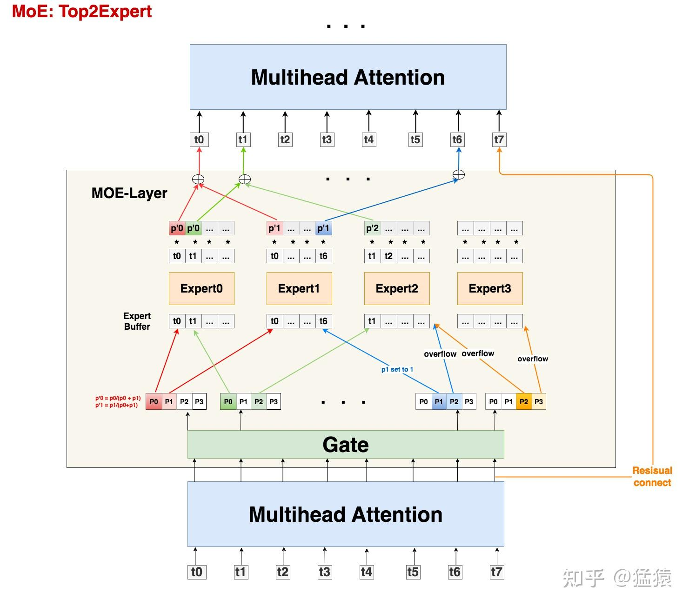
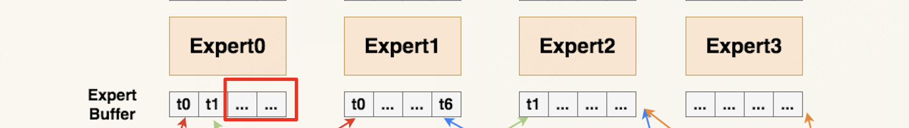
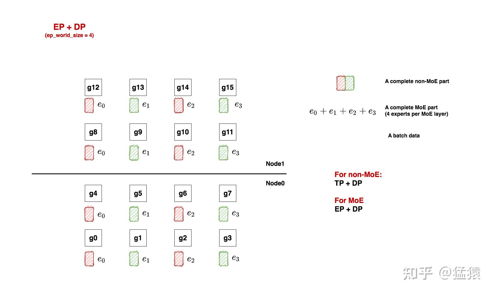
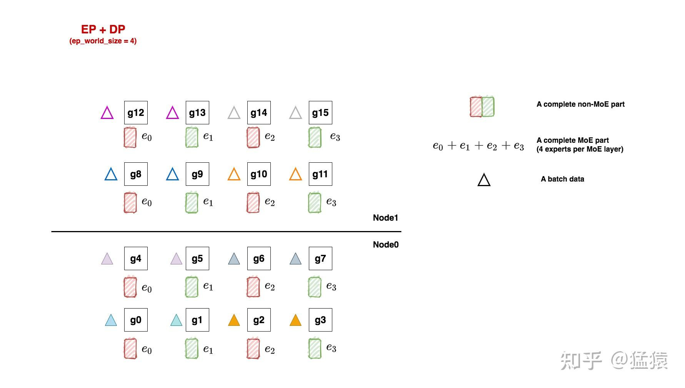
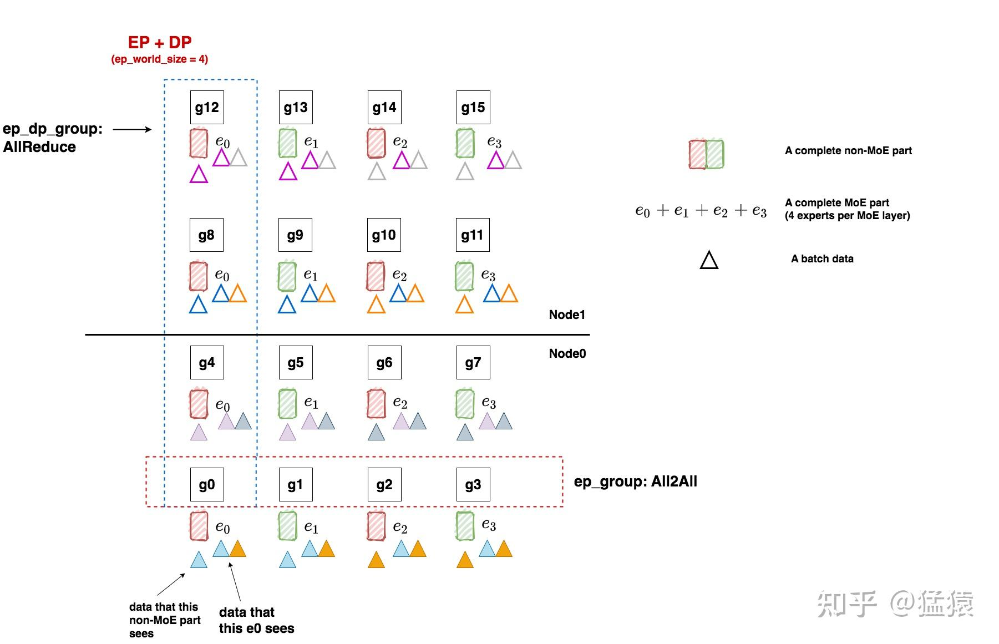
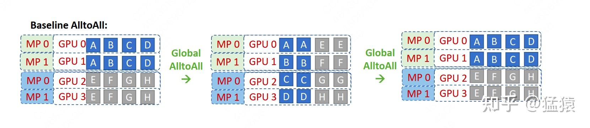
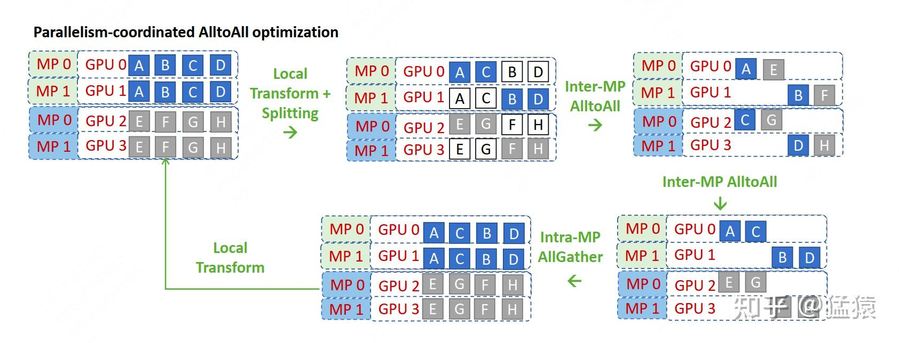
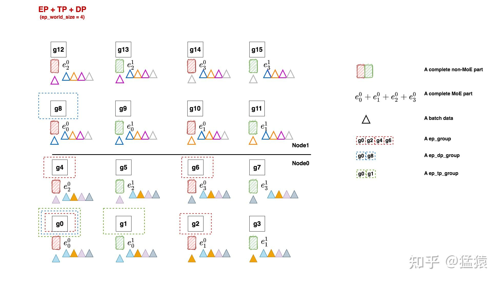
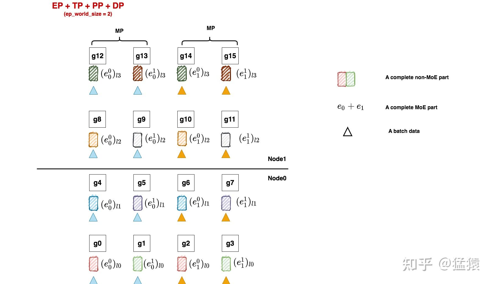

大家好，时隔不知多少月，LLM并行训练系列终于又有更新了（抱头防打），这一章我们来讲MoE并行， **同样分为原理篇和源码篇做讲解**（本来想合在一起的，但是MoE的细节太多实在写不完，所以还是分成两篇）。

**关于MoE并行，我体感最深的一点是，它的定义不像tp/dp/pp这类典型的并行方式那样清晰明确**，表现在：

-   对MoE并行相关的术语定义，各个论文/代码鱼龙混杂，有时根本不给定义直接甩出名词，有时相同的名词甚至代表不同的含义，给人造成极大困扰（举个最简单的例子，说说什么叫EP？）
-   对MoE并行的代码实现，不同框架间存在较多差异，有些框架还做了前提假设，导致在阅读源码过程中难以做知识迁移。

总结起来，MoE相关的开源资料，都透露着一股浓浓的禅意，这就好像你和老板的日常对话：
你：“老板，这事急吗？”
老板：“如急，懂否？”
你：“如懂。”
所以参悟的最好办法，就是去看源码实践了。

本文是在阅读DeepSpeed-Megatron / Megatron / Fairscale / Tutel等开源框架代码后总结而成，最终选择以DeepSpeed实现原理为主线，其余框架实现原理为辅线进行讲解，全文架构如下：

-   第一部分，介绍选择DeepSpeed实现方式的原因
-   第二部分，介绍以Gshard为代表的MoE模型架构。如果你不想了解MoE分布式训练，只想知道MoE模型长什么样，是如何运作的，可以只看这部分
-   第三部分，介绍MoE并行训练中的分布式初始化。阅读本章需要对Megatron混合并行原理和Megatron源码架构有了解。
-   第四部分，源码解读。 **这个放在下篇中做讲解（[猛猿：图解大模型训练系列之：DeepSpeed-Megatron MoE并行训练（源码解读篇）](https://zhuanlan.zhihu.com/p/681692152)）**

【Megatron系列文章参考】：

[猛猿：图解大模型系列之：张量模型并行，Megatron-LM](https://zhuanlan.zhihu.com/p/622212228)

[猛猿：图解大模型系列之：Megatron源码解读1，分布式环境初始化](https://zhuanlan.zhihu.com/p/629121480)

[猛猿：图解大模型训练之：Megatron源码解读2，模型并行](https://zhuanlan.zhihu.com/p/634377071)

[猛猿：图解大模型训练系列之：Megatron源码解读3，分布式混合精度训练](https://zhuanlan.zhihu.com/p/662700424)

【历史文章汇总参考】：

[猛猿：【必看】历史技术文章导航](https://zhuanlan.zhihu.com/p/654910335)

**【❤️❤️如果觉得本文有帮助，欢迎点赞在看和喜欢～】**

---

## 一、为什么选择DeepSpeed-Megatron

引入MoE并行训练的框架有很多， **为什么这篇文章选择用DeepSpeed来做讲解呢**？主要原因如下：

-   **使用DeepSpeed做讲解时，可将其MoE实现作为主线，其余框架MoE实现作为分支，这样方便在讲解主线的同时，引入分支进行对比。** 之所以DeepSpeed能成为主线，是因为它的MoE代码是一个“大杂汇”，例如，它的MoE初始化设置借鉴了Megatron，它的MoE-Layer架构借鉴了Fairscale，它的MoE优化方式借鉴了Tutel等，在这些借鉴之上，它引入了自己的一些改进。所以 **使用DeepSpeed，更方便我们做对比讲解**。

-   **DeepSpeed的MoE模型架构是Gshard。** 作为最早将MoE应用在Transformer上的模型，Gshard提出的框架和思想一直影响至今。后续我们看到的很多LLM MoE的架构改进，其实都是在Gshard的这一套逻辑上做的迭代，比如loss改造、topKexpert的选择，稀疏矩阵计算优化等等。所以 **从Gshard入手，更利于我们对基础的把握**。

## 二、Gshard架构



### 2.1 直觉上理解MoE设计

从架构图中我们可以发现，MoE其实就是将Transformer中的FFN层替换成了MoE-layer，其中每个MoE-Layer由一个gate和若干个experts组成。 **这里gate和每个expert都可以理解成是`nn.linear`形式的神经网络**。

**这样设计的直觉是什么呢？**

-   **`expert`：术业有专攻。** 假设我的输入数据是“我爱吃炸鸡”，在原始的Transformer中，我们把这5个token送去一个FFN层做处理。但是现在我们发现这句话从结构上可以拆成“主语-我”，“谓语-爱吃”，“宾语-炸鸡”，**秉持着术业有专攻的原则，我把原来的1个FFN拆分成若干个expert**，分别用来单独解析“主语”，“谓语”，“宾语”，这样可能会达到更好的效果。
-   **`gate`：** 那么我怎么知道要把哪个token送去哪个expert呢？很简单，我再训练一个gate神经网络，让它帮我判断就好了。

当然，这里并不是说expert就是用来解析主谓宾，只是举一个例子说明： **不同token代表的含义不一样，因此我们可以用不同expert来对它们做解析。除了训练上也许能达到更好的效果外，MoE还能帮助我们在扩大模型规模的同时保证计算量是非线性增加的**（因为每个token只用过topK个expert，不用过全量expert），这也是我们说MoE-layer是稀疏层的原因。

最后需要注意的是， **在之前的表述中，我们说expert是从FFN层转变而来的，这很容易让人错理解成expert就是对FFN的平均切分，实际上你可以任意指定每个expert的大小**，每个expert甚至可以>=原来单个FFN层，这并不会改变MoE的核心思想：token只发去部分expert时的计算量会小于它发去所有expert的计算量。

接下来，我们来看上图中MoE的各部分细节，下文中所有的符号遵从Gshard论文表示。

### 2.2 输入数据

首先，所有tokens正常过Attention层得到MoE-layer的输入，我们记输入数据的尺寸为`(S, M)`，其中:

-   **S : 输入batch中的token数量，例如图中S=8**
-   **M: token\_embedding维度**

需要注意的是，我们一般是 **以batch的形式组织** 输入数据的（图中batch\_size = 1），假设Attention层输入数据的维度是`(batch_size, seq_len, M)`，那么有 **`S = batch_size * seq_len`**

### 2.3 Gate

接下来，我们就要使用线形层Gate帮助我们判断token应该送去哪个expert了。 **在别的MoE架构中，Gate有时也被称为Router（路由）**。Gate的尺寸大小为`(M, E)`，其中E表示expert的数量。

输入数据`(S, M)`过Gate`(M, E)`后，得到 **prob数据`(S, E)`，它的含义是：每个token去向每个expert的概率**。
**由于在Gshard中我们使用的是top2Expert，因此对每个token，我们只关心它概率最大的两个expert**。在图中，我们用深色表示最大概率，浅色表示次大概率。例如对token0来说，它被送去expert0的概率最大，被送去expert1的概率次大。

好，现在既然知道每个token的top2Expert了，是不是就可以直接发送了呢？别急，我们先来看看Expert的架构

### 2.4 Expert与溢出处理

我们知道，token发去expert的概率不是我们能控制的，在实际操作中， **可能某些expert接收到了好多token，而某些expert接收的token寥寥无几**，我们管这种现象叫 **expert负载不均**。这种情况不仅不符合我们MoE的设计初衷（术业有专攻），还影响计算效率（例如引起分布式训练中各卡通讯时的负载不均），所以我们急需想办法 **缓解** 这种问题，Gshard就提出了以下几种解决办法：

**（1） capacity和capacity factor**

在图中，你会看到一个叫 **Expert buffer** 的东西，这是什么呢？

在上文中我们提到，有些expert可能接收到非常多的token，为了缓解这个问题，我们可以给每个expert设置一个 **容量值（capacity）**，如果当前这个expert接收到的token数已经超过了容量，那么它就不再接收token了，此时我们称这个多出来的token为 **溢出(overflow)**。

**那么容量应该怎么设置呢？** 在我们的例子中，一共有8个token和4个expert，在理想的负载均衡的情况下，每个expert应该接收8/4 = 2个token，考虑到这里采用的是top2Expert，因此最终每个expert接收的token上限最好是(8/4)\*2 = 4，这也 **是我们图中expert buffer的长度**。

但这并不说明capacity一定要是 $\frac{S}{E} * K$。我们可以在此基础上使用capacity factor，根据需要让每个expert多处理或少处理一些token；你甚至还能设置一个容量下界(min\_capacity)， **所以最终capacity可以按如下式子定义：**

$capacity = max(\frac{S}{E} * K * capacity\_factor, min\_capacity)$

回到图中的例子上来，我们发现t0和t1都正常发去top2Expert上了。但是对于t6，它的2nd expert已经装满了；对于t7，它的1st和2nd expert都满了。 **所以t6和t7都发生了溢出**。那么我们要怎么处理溢出的情况？别着急，我们马上来看。

**（2） Random Routing**

对于一个token，我们一定要把它发到top2Expert上吗？
**从直觉上对于每个token，我们最好将其以100%的概率发去1st expert；但是对于它的2nd expert，我们可以不100%发送，而是以一定的概率（例如从uniform(0,1)中随机抽取一个数p，将其作为概率）发送**，这样不就能节省对expert capacity的消耗，从而更好利用每个expert吗？这也是Gshard论文中提出的方法。

**而我们下文要讲的DeepSpeed代码，在这一块又做了稍微不同的处理：** 以图中t0为例，1st expert它是肯定要发去的。但是在选择2nd expert时，它做了一些加噪处理：对产出的每个概率（更确切地说是logit），它从某种分布中采样4个噪声，加在这4个logit上，然后mask掉1st expert位置的logit，再从剩下3个logit中找到最大的作为其2nd Expert。

现在我们已经选出最终的top2Expert，我们再回到没有加噪时的4个概率上，取出相应位置的概率，做normalize计算：
$P'_{0} =\frac{P_{0}}{P_{0} + P{1}},  P'_{1} =\frac{P_{1}}{P_{0} + P{1}}$

$P'_{0}, P'_{1}$ **是一种权重（weight），该token过expert0和expert1后会分别得到一个输出token，我们可以对2个输出token做加权计算，得到最终的输出token。**

**回到上面的问题，token发生溢出时，要怎么办呢？**

-   **如果只有单个expert溢出**，那么就把另一个expert的权重值为1，然后正常参与加权计算（如图中t6）
-   **如果2个expert都溢出**，那么该token就不经过任何expert，直接通过 **残差连接** 的方式，原样发去下一层的Attention上（如图中t7）

**（3） Auxiliary Loss**

除了capacity和random routing外，Gshard还通过增加一项 **辅助损失函数(Auxiliary Loss)** 来尽量保证Expert的负载均衡，其定义如下：
$l_{aux} = \frac{1}{E}\sum_{e=1}^E \frac{c_{e}}{S} * m_{e}$

其中：

-   $E$ ：专家数量
-   $c_{e}$ ：某个专家的buffer中已经存下的token数量（一般指该专家作为1st专家时接收到的token数）
-   $S$ ：总token数量
-   $m_{e}$ ：某个专家的buffer中已经存下的token在该专家上的avg(weight)（token考虑范围也是那些将该专家作为1st专家的token）

**我们将这个辅助损失添加在正常loss之后，我们的目标也是最小化这个辅助损失**。**【那么为什么最小化辅助损失，可以帮助我们实现专家的负载均衡呢？】**

-   首先，理想情况下我们希望 $\frac{c_e}{s} \approx \frac{1}{E}$ ，也就是每个专家上分到的token数量是均衡的
-   假设 $\frac{1}{E}$ 是一条均值线，而 $\frac{c_e}{S}$ 是分布在这条均值线附近的点，那么我们的目标就是尽量使得这些点紧挨着均值线分布，也就是我们的目标是最小化 $Var(p) = \frac{1}{E}\sum_{e=1}^{E}(p_e - \mu)^{2}，其中p_e = \frac{c_e}{S}, \mu = \frac{1}{E}$
-   而由于 $\frac{1}{E}$ 是一个常数，所以我们的优化目标可进一步改写成最小化 $Var(p) = \frac{1}{E}\sum_{e=1}^{E}(p_e )^{2} = \frac{1}{E}\sum_{e=1}^{E}(\frac{c_e}{S})^{2}$
-   辅助损失函数从负载均衡的目的上看，设计到这一步其实就可以了。但是你会发现，如果只考虑$\frac{c_{e}}{S}$ 这项，它受制于argmax，是不可求导的。所以这里我们才引入$m_{e}$ 项，让辅助损失函数可以通过bwd过程传导到gate层上。

### 2.5 Zero Padding和Drop tokens

**写到这里，我们稍微总结下：**

-   首先，我们有一串过Attention层后的token序列
-   我们通过Gate，计算每个token去往每个expert的概率
-   我们希望不同expert处理的token数尽量均衡，所以我们同时采取三方面优化：

-   **Capacity:** 为每个expert设置capacity（expert buffer），限制它能处理的最大token数量，多出来的token算为溢出，在top2Expert都溢出的情况下，该token会被直接发去下一层attention。
-   **Random Routing:** 每个token一定会被发去1st Expert，在此基础上我们通过random routing加噪的方式，重新选出2nd expert。**在做完capacity + random routing后，我们最终确认了每个token要发去的top2expert和其对应的权重，通过加权计算的方式，确认Moe-Layer最终的输出结果。**
-   **Auxiliary Loss：** 添加辅助损失函数，对expert负载不均的情况做进一步惩罚。

到这里，Gshard MoE的核心架构内容我们就说完了，最后再提2点：

**（1）Zero padding**



**我们上述的优化方法，只能“缓解”负载不均，而不能保证解决负载不均。** 也就是说，存在一些Expert，它的Expert buffer没有填满，这可怎么办呢？

**最直接的方法，就是在没有buffer中空出来的位置，用0向量填充，我们称为Zero padding。** 更具体地说，最终每个expert上的输入数据维度为`(E, C, M)`，其中C表示capacity。0填充的好处是，我们保证每个expert上要处理的输入数据维度是一样的，这有利于硬件层面的后续处理（例如多卡通讯间的负载均衡等）。

**（2）Drop tokens**
我们知道，当发生溢出情况时，不是所有token都会被expert正常处理的， **我们称这种对溢出的操作为drop tokens**。如果被drop掉的tokens数量太多，也是一种信息损失（它们都没经过任何expert解析），我们当然可以通过调整capacity来缓解这个问题，但过大的capacity会引起更严重的zero padding问题（影响到矩阵的稀疏程度），所以这也是后续一些MoE模型架构侧重的优化。

### 2.6 伪代码

现在我们将整个过程以伪代码的形式写出（大家注意看注释细节）。这里在Gshard论文提供的伪代码上，按照deepspeed的实现方式做了些修正。

```python
# -------------------------------------------------------------------------------------
# 1.通过gate，计算每个token去到每个expert的概率
#
# 【input】：Attention层输出的一整个batch的token，其尺寸为(seq_len, batch_size, M),
#             其中M表示token_embedding
# 【reshaped_input】：由input做reshape而来，尺寸为(S, M), 其中S = seq_len * batch_size
# 【Wg】: gate的权重，尺寸为(M, E)，其中E表示MoE-layer层的专家总数
# 【gates】: 每个token去到每个expert的概率，尺寸为(S, E)
# -------------------------------------------------------------------------------------
M = input.shape[-1]
reshape_input = input.reshape(-1, M)

gates = softmax(enisum("SM, ME -> SE"), reshape_input, Wg)

# -------------------------------------------------------------------------------------
# 2. 确定每个token最终要去的top2Expert，并返回对应的weight和mask
#
# 【combine_weights】：尺寸为(S, E, C)，其中C表示capacity（Expert buffer）。
#                     表示对每个token（S）而言，它对每个专家（E）的weight，而这个weight按照
#                     该token在buffer中的位置（C）存放，不是目标位置的地方则用0填充
#                     例如图中token1，它将被发送到expert0和expert2，且它在expert0的buffer中排在
#                     1号位置，在expert2中排在0号位置，那么token1的combine_weights就是：
#                     [[0., p0, 0., 0.],
#                     [0. , 0.,  0., 0.],
#                     [p2, 0.,  0., 0.],
#                     [0.,  0.,  0., 0.]]
#                     最后再复习一下weight和gates所表示的prob的区别：前者是在后者基础上，
#                     做了random + normalize，确定最终的top2Expert后返回的对应结果
#
# 【dispatch_mask】：  尺寸为（S，E，C），它等于combine_weights.bool(), 也就是对combine_weights
#                     为0的地方设为False，为1的地方设为True。
#                     dispatch_mask后续将被用在zero padding上
# -------------------------------------------------------------------------------------
# (S, E, C)      (S, E, C)
combine_weights, dispatch_mask = Top2Gating(gates)


# -------------------------------------------------------------------------------------
# 3. 将输入数据按照expert的顺序排好，为下一步送去expert计算做准备（很重要）
#
# 【dispatch_mask】：尺寸为（S, E, C），定义参见2
# 【reshape_input】：尺寸为(S, M)，定义参见1
# 【dispatched_expert_input】：本步的输出结果，表示按专家排序好的输入数据，尺寸为(E, C, M)
#  这个结果表示，每个专家（E）的buffer（C）下要处理的token_embedding（M），
#  例如dispatched_expert_input[0]就表示expert0 buffer中的情况
#  注意：
#  （1）每个专家buffer中的token是按顺序排列好的，
#       回到图中的例子，expert0 buffer下0号位置排的是token0，
#       3号位置排的是token6，以此类推。dispatch_mask就起到了维护这种顺序的作用
#  （2）当对应专家接收的token数不足buffer长度C时，不足的地方用0向量填充。
# -------------------------------------------------------------------------------------
dispatched_expert_input = einsum("SEC, SM -> ECM", dispatched_mask, reshape_input)

# -------------------------------------------------------------------------------------
# 4. 将排序好的input送入expert进行计算。
#    同正常的FFN层一样，每个expert也由2个线形层Wi, Wo组成
# 【dispatched_expert_input】：按专家顺序和专家buffer中的token顺序排好的输入数据，
#                             尺寸为(E, C, M)，具体定义见3
# 【Wi】：experts的Wi层，尺寸为(E，M, H)，
# 【Wo】：experts的Wo层，尺寸为(E, H, M)
# 【expert_outputs】：experts的输出结果，不含加权处理，尺寸为（E, C, M）
# -------------------------------------------------------------------------------------
h = enisum("ECM, EMH -> ECH", dispatched_expert_input, Wi)
h = relu(h)
expert_outputs = enisum("ECH, EHM -> ECM", h, Wo)

# -------------------------------------------------------------------------------------
# 5. 最后，进行加权计算，得到最终MoE-layer层的输出
# -------------------------------------------------------------------------------------
outputs = enisum("SEC, ECM -> SM", combine_weights, expert_outputs)
outputs_reshape = outputs.reshape(input.shape) # 从(S, M)变成(seq_len, batch_size, M)


```

再特别说明几点

**（1）enisum的作用**

-   **enisum在这里泛指我们自定义的某几种矩阵计算方式**，enisum中诸如`"SEC, SM -> ECM"`只是用来表示输入数据和输出数据的维度，并不表示两个输入矩阵就一定是按照`SEC`和`SM`这样的尺寸直接相乘（我们肯定要对输入数据做些例如unsqeeze()，reshape()之类的操作才能把它们正确乘起来，得到想要的结果）。
-   **enisum使得我们在矩阵计算的同时，能维持token和expert的顺序**。你可能在阅读伪代码的过程中已经感受到，维持“顺序”是一件很重要的事，例如token在专家buffer中的顺序，各个专家间的排序等。为什么维持顺序很重要呢？**因为一个batch里有很多token，我们将其发往不同的expert做计算后，输出结果的顺序肯定是打乱的，所以需要通过一种方式追踪顺序，把token permute回正常的位置再输入下一层Attention。在这里我们通过自定义的矩阵计算方式，巧妙维护住这种顺序，这样我们就不需要额外建索引表之类的来查找了。**

在后文对deepspeed的源码解读中，我们会看到enisum的具体定义。不过这块不是源码解读的讲述重点（毕竟也只是矩阵计算而已）。对这块有兴趣的朋友，可以自己攥一些数据跑跑代码，研究它的运作原理。不感兴趣的朋友，只要记住输入输出的尺寸及各自含义即可。

**（2）将输入数据按照expert的顺序排好**
大家可以特别关注下伪代码步骤3中的操作，这个操作将有利于后续专家并行组之间的通讯。

## 三、MoE并行训练

正如前文所说， **阅读本章需要了解Megatron混合并行原理，并掌握其代码中“分布式初始化”部分的相关知识**。

当我刚开始研究MoE时，总会看到类似`EP + DP`，`EP + TP + DP`这样并行方式的缩写，例如[DeepSpeed官方文档](https://link.zhihu.com/?target=https%3A//www.deepspeed.ai/tutorials/mixture-of-experts/)中所描述的。最开始我对这个符号的理解是：非MoE层的部分采取DP或DP+TP的方式；而MoE层的部分采取一种叫EP的新方式。然而当我把这样的理解代入代码中时，却发现有些部分难以解释。

**摸索了一段时间后，我才发现不管是`EP + DP`，`EP + TP +DP`等等，它们都在特指MoE层的并行方式；而对non-MoE层，你采取什么样的并行方式，是不在这些并行符号的表示范围中的。**

我们以`EP + DP`，`EP + TP + DP`这两种方式为例，来看看如何对MoE模型做分布式初始化。

### 3.1 EP + DP



如上图，我们先来看一个例子。在本例中， **我们共有16块gpu：**

-   **对于non-moe的部分，采取tp + dp并行**
-   **对于moe部分，采取ep + dp并行。**

**（1）Non-MoE: tp + dp**

non-moe的部分指模型中Attention、word embedding层等。tp + pp 的并行方式我们也很熟悉了，根据图中所示，我们有：

```text
tp_world_size = 2
tp_groups = [
             [g0,  g1],[g2, g3], [g4, g5], [g6, g7],
             [g8,  g9],[g10, g11],[g12, g13],[g14, g15]
            ]

dp_world_size = 8
dp_groups = [
              [g0, g2, g4, g6, g8, g10, g12, g14],
              [g1, g3, g5, g7, g9, g11, g13, g15]
            ]

pp_world_size = 1
```

**（2）MoE: ep + dp**

当我们安顿好non-moe的部分后，我们就可以开始考虑要怎么安排MoE层了，这里我们先给出划分方法，然后再对其进行详细解释：

```text
ep_world_size = 4
ep_groups = [
             [g0,    g1,    g2,     g3 ],
             [g4,    g5,    g6,     g7],
             [g8,    g9,    g10,  g11],
             [g12,  g13,  g14,  g15]
            ]

ep_dp_world_size = 4
ep_dp_groups = [
                 [g0,   g4,   g8,   g12],
                 [g1,   g5,   g9,   g13],
                 [g2,   g6,   g10, g14],
                 [g3,   g7,   g11, g15]
                 ]

ep_tp_world_size = 1
```

还记得前面我们说MoE层采用的是`EP + DP`并行吗？那么这里的EP和DP的定义到底是什么呢？

**假设我们每个MoE层有若干个专家（我们统称其为一套专家），现在我们想把这一套专家分布排列到gpu上，最直觉的做法就是：我们先定好要用几块GPU装下一套专家（EP），进而我们就能确认全局上共有多少套专家副本在跑（DP）。** 通过这种简单的方式，我们就做好了EP + DP形式的MoE层初始化。

回到我们的例子中，一共16块GPU：

-   **ep\_world\_size = 4：** 表示我们希望用4块GPU装下一套完整的专家。确定这个数值后，我们就能确认ep\_groups
-   **local\_expert\_num：** expert\_num / ep\_world\_size，其中expert\_num表示每层专家的总数。假设每层专家数量是4，那么1块gpu上就放一个专家；假设每层专家数量是8，那么1块gpu上就放2个专家。所以图中的e0等符号并不绝对表示这里只有1个专家，只是对local\_expert的统称。
-   **ep\_dp\_world\_size：** 类比于non-MoE层，MoE层同样也有数据并行的概念。例如图中\[g0, g4, g8, g12\]上都维护着e0，所以它们构成一个 **ep\_dp\_group。这个group的作用是当我们在计算bwd时，它们之间是需要做梯度的allreduce通讯的**，我们会在下文详细图解这一点。 **另外需要注意的是，构成ep\_dp\_group的条件不仅是e相同，还需要每个e吃的batch的数据不同（类比于一个普通的dp\_group，组内的每张卡吃的是不同的小batch）。现在你可能无法具象化感受这点，我们在后文将ep+tp+dp并行的时候再细说**。
-   **ep\_tp\_world\_size：** 类比于non-MoE层，MoE层同样也有张量并行的概念，即一个专家可以纵向切割成若干份，本例中我们不对专家做tp操作，在后文我们会详细来看做了tp操作的相关例子。

额外再说明两点：

-   你可能发现上面诸如`ep_dp_world_size`这样的符号有点陌生，因为你并没有在相关论文/代码中看到过它。这是因为不同框架对MoE并行的相关概念定义鱼龙混杂，除了符号不一外，有时相同的符号甚至表示不同的含义，这也是最令我痛苦的点。 **所以这里我自定义了一套符号，不管是什么框架，我都会把它的定义映射到这套符号上来。**
-   **以图中的e0来举例，我们再强调两点：首先，如上文所说，它不绝对表示1个专家，只是对local\_expert的统称。其次，它不绝对表示1个MoE层的专家，它表示所有MoE层放在这块卡上的专家统称。**

**相信现在你对EP+DP的分布式设置有了初步认识了**（这里我们特意举了non-MoE是tp+dp，而不是单纯dp的例子，来说明ep+dp这个并行定义是专门针对MoE部分的），**但你可能对那些并行group的作用还不能有具象体会。现在让我们来给模型喂点数据，看看在1个FWD和BWD过程中，这些group都做了什么通讯吧！**

**（3）FWD与BWD过程**



如图，三角形表示1个batch的数据，这里我们 **共喂给模型8个batch**。每个tp组内的输入数据一致，所以它们对应的三角形颜色也相同。

好， **让我们牢记分布式并行的使命：** 分布式训练效果应与单卡（假设这个单卡能装下一个完整的模型）的训练效果一致。放到我们的例子里， **16卡吃8个小batch做完FWD+BWD后的结果，应该与单卡吃下由这8个小batch组成的大batch的结果一致。**

现在开始做FWD与BWD，过程如下图：



-   在FWD中，数据先过non-MoE（Attention）层，由于一个tp组内每块卡的输出也是一致的，因此三角形颜色的分布没有改变。 **我们把三角形移动到对应的non-MoE分块下，表示在整个FWD中对应的non-MoE分块见过的batch。**
-   继续做FWD，现在数据来到了MoE层，我们前面说过，每块卡上数据的维度是(E, C, M)， **即我们已经计算好token和专家的对应关系，我们只需在ep\_group内做all2all通讯，将token发送去对应的专家即可，这就是ep\_group的作用**。all2all通讯的细节我们放在后面说，**这里只需记住在all2all通讯后，ep\_group内每个专家见过的batch有了改变，例如对e0，现在它见过了蓝色和橘色两个batch的数据**。每个专家计算完自己的结果后，再通过all2all的方式，将对应的token计算结果还给ep\_group内的各gpu，然后继续mon-MoE->MoE的步骤，直到FWD完毕。
-   做完了FWD，进入BWD。我们首先来到MoE部分，以e0为例，根据分布式训练使命，我们应该allreduce 8个batch的梯度结果，用来更新e0。欸那这8个batch在哪里呢？当然是在图中的ep\_dp\_group内！ **所以在BWD过程中，我们对ep\_dp\_group中e0的梯度做allreduce，用来更新e0**。现在，你是不是更好理解ep\_group的作用了！
-   继续做BWD，数据来到了non-MoE部分，这块对梯度的通讯我们在Megatron解析中已经讲了很多，这里就不再说明了。

总结一下针对MoE部分的重点：

-   **在FWD中，ep\_group进行all2all通讯，将token发去对应的专家做计算，并将计算结果取回。**
-   **在BWD中，ep\_dp\_group进行AllReduce通讯梯度，用于更新对应的专家的参数。**

**对于这种在non-MoE部分采用tp，在MoE部分不采用tp的设计，在代码实现上有几个点要注意**。举例来说，对non-MoE来说，\[g0, g1\]是一个tp组，我们要对这两块卡的输出做AllReduce。但是对MoE部分而言，\[g0, g1\]的输出是不需要做AllReduce的。看过Megatron代码的朋友，应该能想起这块相关的操作在`RowParallelLinear/ColumnParallelLinear`模块下，所以在deepspeed中，通过传入一个enable\_expert\_tensor\_parallelism=True/False的参数来做相关调整，这点我们放在源码解读篇中说。

**在一些代码框架（例如Megatron）中，为了多复用已有的并行方式，少做修改，一般都会做些强硬限制：** 例如MoE的mp（tp与pp）层面的并行设置须与non-MoE的mp设置保持一致，即如果non-MoE做了tp切分，MoE也必须以同样的方式做tp切分，在此基础上再去安排MoE的ep/ep\_data等等并行。在这样的限制下，如果non-MoE采用dp，那么MoE只能用ep+dp；如果non-MoE采用tp+dp，那么MoE只能采用ep+tp+dp； **欸发现了没有！这是不是和你我对ep+tp+dp这个符号表示的初印象很像？即tp+dp是non-MoE的并行方式，ep是MoE的并行方式。所以这样的理解，在某些代码框架上是通的，但是到别的更为灵活的代码实现上，就产生矛盾了。这也为什么我在本章开头说明，最好统一把这个符号理解成是对MoE部分并行方式的描述。**

**对于non-MoE只采用dp，MoE采用ep+dp的设计，比较简单，这里我们就不多说了，大家可以自己画画。**

### 3.2 All2All通讯

在3.1中，我们说过每张卡进MoE前的输入数据尺寸为(E, C, M)，其中E表示expert\_num，C表示capacity，M表示token\_embedding。在每个ep\_group内，我们通过all2all通讯将token发去指定的expert做计算，再通过all2all通讯将计算结果返回。现在我们来介绍all2all的细节。

**（1）基础All2All**

我们先来看基础All2All是怎么做的，再来看deepspeed改进后的All2All是怎么做的。



图中的MP表示的就是TP（在deepspeed的语系中，MP=TP），图中相关的分布式group为：

-   tp\_group: \[\[g0, g1\], \[g2,g3\]\]
-   ep\_group: \[\[g0,g1,g2,g3\]\]，也就意味着 **四张卡上分别存着e0, e1, e2, e3**

我们先来看 **最左侧的图，它描绘了数据刚过完non-MoE(Attention)层后的结果**。因为tp组间做了AllReduce，所以g0和g1上存的数据完全一致（ABCD），g2和g3上存的数据完全一致(EFGH)。我们以\[g0,g1\]为例，因为有4个专家，所以图中将数据分为ABCD四份，每一份的维度为(C, M)，四份总维度为(E, C, M)。也就是说A的数据要发去e0，B的数据要发去e1，以此类推。

**我们再来看中间的图，它描绘了ep\_group内首次做all2all的过程，这个过程的目的是将token发去对应的expert上进行计算。** 你是否已经发现，**all2all就相当于做了一次矩阵转置**（对比一下左侧图和中间图的数据块排布）？因此通过All2All，我们就让数据块去到了它对应的位置：AE去e0，BF去e1，以此类推。而为了实现这种转置，我们必须提前对non-MoE做分块排序，让它按照要去的专家位置排好，现在你是不是能感受到排序的意义了？

**最后来看右侧的图，它描绘了ep\_group内第二次做all2all的过程，这个过程的目的是将MoE算完的token再返回给各卡**，原理和上述一致。

一切都进行地很顺利，但我们能不能再做些优化呢？ **例如，属于一个tp组的g0和g1上存着一模一样的数据，在all2all的过程中是会被重复发送和计算的，我们能不能减少这种重复？**

**（2）改进All2All，理论版**

为了避免tp组内的数据重复发送的问题，deepspeed在论文中提出了一种改进版的All2All算法，但值得一提的是，deepspeed在代码实现中可不是完全按照这种改进算法来的（手动狗头，虽然实现上还是借鉴了一些理论上的思路）。所以本节我们先来看deepspeed在理论上的改进，然后再来看它的实操。



咱们来看看这张图，确实是 **维持了deepspeed团队一贯的禅意风格：以培养读者悟性为宗旨，能不点破就不点破。** 所以我们也不要辜负他们的期望，努力地悟一悟吧！

**deepspeed改进版all2all的核心宗旨是：既然你说tp组间的数据重复，那么我就在tp组间砍一刀，让tp组内的每块卡都维护不同的数据，不就不行了么？** 于是我把g0上的CD砍掉，g1上的AB砍掉，以此类推。这下完美了吧，每块卡上只有2块数据且不重复了！
**但这样一来，all2all要怎么做呢？** 你现在每张卡上只有2个数据块，但是all2all group内一共4块卡，如果你想正常做all2all，必须卡上的数据块和卡数相同才行，否则就会出现问题。

**所以，我们再想另一个办法：如果现在卡上只有两块数据了，那我如果把all2all group也一分为二，每个group内2张卡，一共两个all2all group，不就能解决这个问题了吗？** 那这个新的all2all group要怎么设呢？最简单的方法就是，tp rank相同的卡组成一个新的all2all group。例如对g0和g2，它们的tp\_rank都是0，所以它们组成新的all2all组，g1和g3也是同理。所以现在，我们只需对\[g0, g2\] all2all，\[g1, g3\] all2all就可以了。这也是为什么在图中把CB和FG交换位置的原因。
那如果我想\[g0,g3\]all2all，\[g1,g2\]all2all，然后把CD, GH交换位置，那可以么？理论上是没问题的，但是代码上这样写就不太优雅了，比不上同一个tp rank间all2all来得简便。

**知道了这个流程，我们再来看上面的图，是不是一目了然了？** 图中local transform为改进版all2all作准备，交换了数据；两个all2all就是token发送和接受的过程；最后再加一个all-gather，因为tp组内每块卡的输出要保持一致，这样才能进入接下来的non-MoE层继续计算。

**（3）改进All2All，实操版**

好，理论我们已经知道了。但你从改进的过程中肯定也发现了：原来是4卡all2all，现在是2卡all2all，这不就把我辛苦设置好的ep\_group破坏掉了吗？如果真的这么操作，那对代码的改动肯定是比较大的

**所以，有没有办法还是4卡all2all，但是也避免发送重复数据呢？**

当然有，大家想想我们每张卡的输出数据维度(E, C, M)，同个tp组内的所有卡这个(E, C, M)是一致的，此时你的脑子是不是灵光一现： **如果我沿着C把数据切成tp\_world\_size份，每张卡只保留其中的一份，那么不就既能做到tp组内卡上的数据不重复的情况下复用原来的ep\_group做all2all吗？** 在两次all2all后，我依然通过一个all-gather操作还原tp组内的完整数据，这不就行了吗？这就是deepspeed在代码实操中使用的方法。

deepspeed在代码中管这样的操作叫drop\_tokens，大家注意和MoE理论部分所说的drop token区分开。

**（4）改进版All2All使用注意事项**

在上面改进版All2All的讲解中，你可能已发现一个重要的点：虽然non-MoE采取了tp，但是MoE却没有用tp。
如果现在我把MoE也改成tp呢？g0存放 $e_{0}^{0}$ ，g1存放 $e_{0}^{1}$ ，g2存放 $e_{1}^{0}$ ，g3存放 $e_{1}^{1}$ ，即这里共2个专家，每个专家纵向切开为2，这种时候我们还需要采取drop\_tokens的方式吗？

答案是否定的，因为对于g0和g1来说，MoE层也被切开了，因此按照tp的方式，g0和g1上的输入各自过切开的MoE层后AllReduce的结果，才是最终结果。这时g0和g1上重复的输入数据是有实质意义的，我们不能drop。

**deepspeed禅师，你看我们这样算悟了吗？**

### 3.3 EP + DP + TP

**（1）Non-MoE与MoE**

现在我们再回到ep并行设置的例子上来，我们考虑对专家也做tp切分。实现这一点最简单的逻辑是让专家的tp切分方式和非专家的tp切分方式一致，这样省得我们再去对MoE层多写一套tp组的分布式设置。



non-MoE组的并行设置和3.1一致，这里不再介绍，我们来看看MoE组的并行设置：

```text
ep_world_size = 4，保持和3.1一致
ep_groups = [
            [g0, g2, g4, g6],
            [g1, g3, g5, g7],
            [g8, g10, g12, g14],
            [g9, g11, g13, g15]
           ]

ep_dp_world_size = 2
ep_dp_groups = [
                [g0, g8],
                [g1, g9],
                [g2, g10],
                [g3, g11],
                [g4, g12],
                [g5, g13],
                [g6, g14],
                [g7, g15]

# 复用non-MoE tp相关的并行设置
ep_tp_world_size = 2
ep_tp_groups = [...]
```

-   **ep\_groups：** 在前面我们提过，**每个ep\_groups中的每个ep\_group装下一套“完整的”专家，但我们也留了个坑，说明“完整”的含义需要留后讨论。现在我们就来看看这个坑。**

-   **在deepspeed中，** 虽然每个ep\_group内的专家都是被纵向切开的，但只要它涉及到所有的专家，就认为它是“完整的”
-   **在Megatron中，** “完整”的含义就是参数完整，即g0~g7才被认为是一个ep\_group。

**定义不同，组内的通讯方式自然也不同。在deepspeed的定义下，ep\_group内做的是all2all；在megatron的定义下，做的是ReduceScatter和AllGather（事实上Megatron的MoE实现就没有用到all2all）**。这一点我们在源码讲解篇会来做比较。这里我先抛出我的结论：我认为deepspeed的ep\_group设计是较好的，不仅操作上更符合直觉认知，还能避免重复数据发送（Megatron的实现方法会发送大量重复数据）。

**（2）FWD与BWD**

同样，我们通过描述1次FWD与BWD的过程，来说明各个group间是怎么运作的。

-   **首先做FWD，数据过non-MoE层**，因为采用了tp，所以相同tp组内的各卡输出一致，因此我们在图中将相同颜色的三角形放到对应的non-MoE参数块下。
-   **继续做FWD，数据来到了MoE层**。在例子中：

-   **ep\_group \[g0, g2, g4, g6\]和ep\_group\[g1, g3, g5, g7\]内都各做1次all2all，将token发给对应的expert进行计算**。
-   计算完毕后，因为MoE层也是tp并行的，因此 **\[g0, g1\], \[g2, g3\], \[g4, g5\], \[g6, g7\]这几个tp组各自通过AllReduce取得完整的输出结果**。
-   然后 **ep\_group \[g0, g2, g4, g6\]和ep\_group\[g1, g3, g5, g7\]再做一次all2all，把计算完毕的数据发送回去**，以便进入下一个non-MoE->MoE操作。我们在图中把这一步骤里各卡维护的expert所见过的batch数据画在对应的expert下面。

-   **开始做BWD，数据来到MoE层。** 同一个ep\_dp\_group内的参数需要对梯度做AllReduce，例如图中\[g0, g8\]，这个group维护了相同的e，每个e都各自吃过4个batch的数据，联合起来刚好构成全局上的8个batch（牢记前文分布式训练的使命）.
-   **继续做BWD，数据来到non-MoE层**，来到大家熟悉的领域了，tp+dp模式下的BWD，就不需要多说了吧。

### 3.4 PP去哪里了

在上面的例子中，我们见过了 **ep+tp+dp 的混合**，你可能想问，pp也是一种常见的并行方式，它去哪里了呢？

在MoE中，PP这个维度比较特殊，大部分论文和开源代码实践中，一般不考虑/不讨论再对MoE部分做pp切分。deepspeed中更是强制把PP维度设为1，并在代码注释里表示不支持PP（我猜这可能和deepspeed的zero实现有关，体感上可能会加剧通讯量，但我没做仔细研究，给不出确切答案）。我个人认为，如果tp+dp已经能满足显存限制的话，就不需要再引入pp将模型切得更碎了。同时在MoE模型中，你会发现non-MoE的模型副本数和MoE的模型副本数是不一致的。例如3.2的例子中，non-MoE有8个模型副本，但是MoE只有两个模型副本（g0~g7, g8~g15），却也能实现8个完整的non-MoE + MoE模型副本的分布式训练效果。从这一点上看tp+dp形式的训练方式已经基本够用了。

但并不是说不能使用pp，Megatron中就支持pp的使用，我们来看下引入pp后的情况：



-   non-MoE层采用tp + dp +pp并行（就是我们在Megatron解读中举的例子，是我们熟悉的味道）
-   MoE层采用ep + tp +pp + dp，其中tp\_group和tp\_group直接复用non-MoE的设置

相信通过之前的讲解，大家已经能轻松看懂这张图了。这里只强调三点：

-   **ep\_dp\_groups** = \[\[g0\], \[g1\], \[g2\],...\]，也就是每张卡单独组成了一个ep\_dp\_group（如果你觉得难以理解，就用前面说的每个e见过的batch来分析看看）
-   **ep\_group** = \[\[g0, g1, g2, g3\], \[g4, g5, g6, g7\],...\]，这个不难理解，想想上文说的Megatron对“完整的一套专家“的定义。这里特别说明下，你可能已经发现ep\_world\_size = 2，但这里每个ep\_group占四块卡，这在Megatron中是正常的。在下篇源码解读中，我们会来看Megatron这样设计的意义。
-   **需要满足dp\_world\_size % ep\_world\_size == 0**，事实上这也是Megatron并行设置的前置条件（不管你有没有使用pp，因为Megatron强制MoE复用non-MoE的并行配制，在此基础上再引入和ep相关的并行）。一般而言，world\_size = tp\_world\_size \* pp\_world\_szie \* dp\_world\_szie，如果你的MoE层复用了non-MoE的tp和pp，那么ep\_world\_size只能在dp\_world\_size上做切割了。

好，关于MoE并行训练的模型架构和分布式配置，我们就介绍到这了。在下一篇中，我们通过源码讲解，和大家一起学习MoE并行训练的更多细节。
