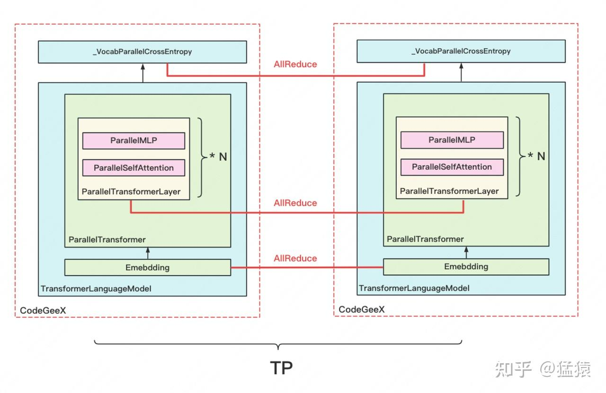
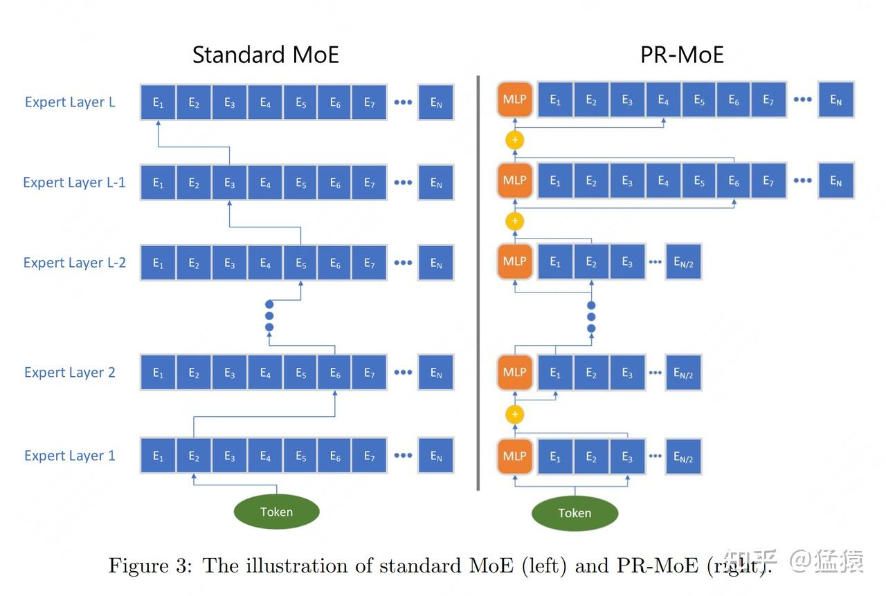
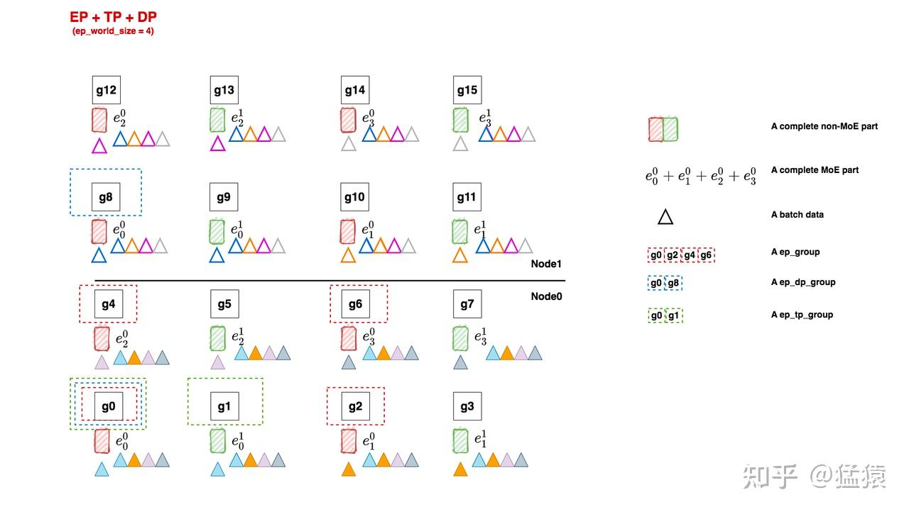
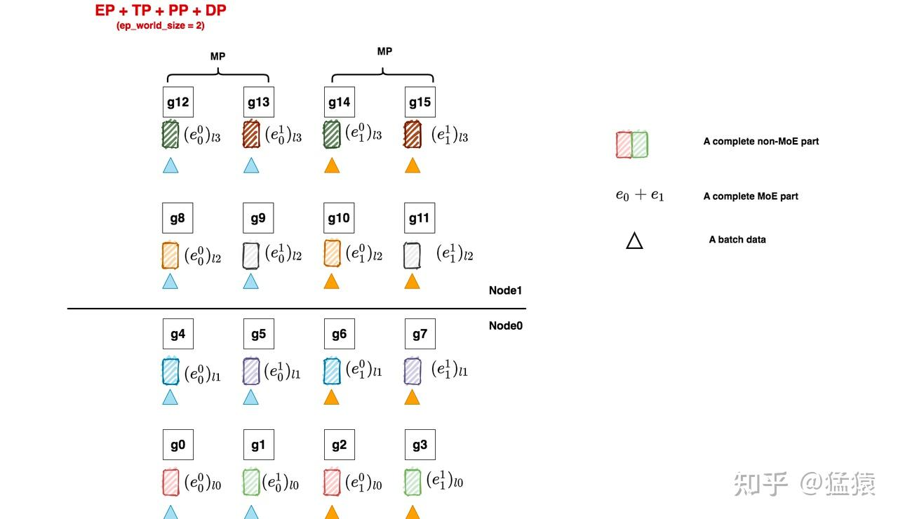
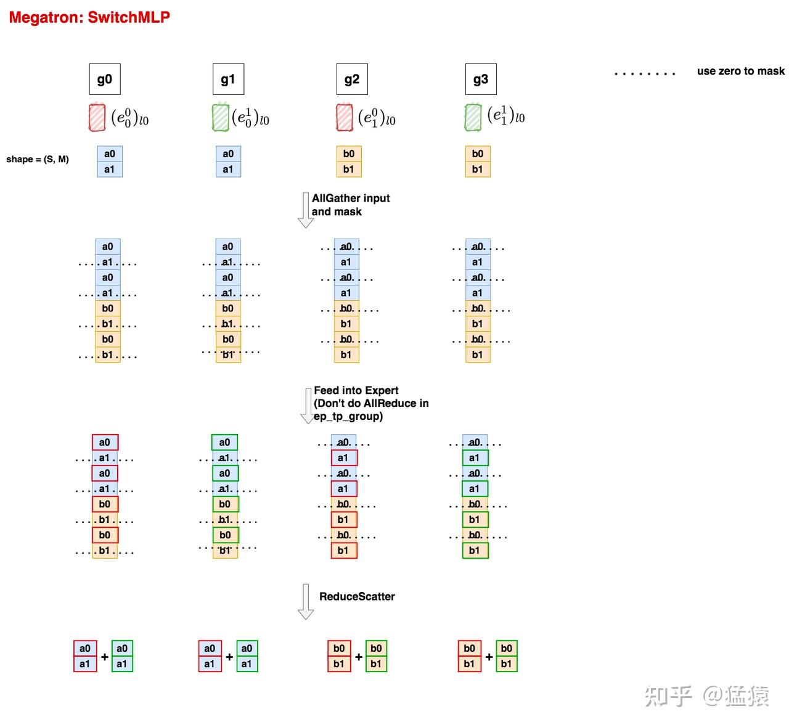

大家好，赶在节前把MoE的原理篇和源码篇一起出完，这次，没人能再喊我鸽王了吧！！

在这篇文章中，我们会先介绍deepspeed moe并行训练实现，然后引入Megatron moe并行训练做对比，涉及到的git仓库有：

-   **Megatron-DeepSpeed**: [https://github.com/microsoft/Megatron-DeepSpeed](https://link.zhihu.com/?target=https%3A//github.com/microsoft/Megatron-DeepSpeed)
-   **DeepSpeed**: [https://github.com/microsoft/DeepSpeed](https://link.zhihu.com/?target=https%3A//github.com/microsoft/DeepSpeed)
-   **Megatron-LM**: [https://github.com/NVIDIA/Megatron-LM](https://link.zhihu.com/?target=https%3A//github.com/NVIDIA/Megatron-LM)

本文会通过图解+代码细读的方式做分析

**【阅读本文需要先阅读】：**

[猛猿：图解大模型训练系列之：DeepSpeed-Megatron MoE并行训练（原理篇）](https://zhuanlan.zhihu.com/p/681154742)

[猛猿：图解大模型系列之：张量模型并行，Megatron-LM](https://zhuanlan.zhihu.com/p/622212228)

[猛猿：图解大模型系列之：Megatron源码解读1，分布式环境初始化](https://zhuanlan.zhihu.com/p/629121480)

[猛猿：图解大模型训练之：Megatron源码解读2，模型并行](https://zhuanlan.zhihu.com/p/634377071)

**【往期文章集合】**

[https://zhuanlan.zhihu.com/p/654910335](https://zhuanlan.zhihu.com/p/654910335)

**【❤️创作不易，如果觉得本文有帮助，欢迎点赞喜欢和在看～】**

---

## 一、DeepSpeed MoE

### 1.1 执行脚本

**执行脚本：Megatron-DeepSpeed/examples\_deepspeed/MoE/ds\_pretrain\_gpt\_1.3B\_MoE128.sh**
在deepspeed中，一共实现了两类MoE架构：

-   **普通MoE：** 每个MoE层的专家数相等。因此你传入的num\_expert可以是一个int
-   **PR-MoE：** 金字塔-残差连接型MoE（Pyramid-Residual MoE），这是deepspeed自己提出的创新模型，每个MoE层的专家数可以不等，因此你传入的应该是一个空格连接的字符串，即每层num\_expert个数用空格隔开

这里我们只关注普通MoE。
这份sh脚本主要用于做参数配置，例如模型结构参数、分布式训练参数等等。这里主要关注分布式配置相关参数，其余可自行阅读。

```python
megatron_options=" \
        --override-opt_param-scheduler \
        --adam-beta1 0.9 \
        --adam-beta2 0.95 \
        --tensor-model-parallel-size ${MP_SIZE} \
        --moe-expert-parallel-size ${EP_PARALLEL_SIZE} \
        --num-experts ${EP_SIZE} \
        --moe-loss-coeff ${MLC} \
        --moe-train-capacity-factor ${MOE_TRAIN_CAP_FACTOR} \
        --moe-eval-capacity-factor ${MOE_EVAL_CAP_FACTOR} \
        --moe-min-capacity ${MOE_MIN_CAP} \
        --......
```

-   **tensor-model-parallel-size：** tp\_world\_size。由于在deepspeed moe实现中，默认pp\_world\_size = 1，则对于non-moe部分有dp\_world\_size = world\_size / tp\_world\_size。
-   **moe-expert-parallel-size：** ep\_world\_size。
-   **num-experts：** 每个MoE层专家数量。在普通MoE中，这是一个int（如128）；在PR-MoE中，其形式如"64 64 64 64 64 64 64 64 128 128"，表示每层的专家数量。 **当num\_expert = 1时，说明不采用MoE架构（我们管这种叫dense model，同理采用MoE则称为sparse model）**

对这些术语定义有疑惑的朋友，可以先看原理篇。

### 1.2 入口函数

**入口函数：Megatron-DeepSpeed/pretrain\_gpt.py**

ds\_pretrain\_gpt\_1.3B\_MoE128.sh脚本启动的入口函数位于Megatron-DeepSpeed/pretrain\_gpt.py中， **从这一步开始，整体代码就基本复用我们之前介绍过的Megatron框架了，只是在分布式环境和模型架构设计上会做些deepspeed特有的更改**。所以再次建议大家在阅读本文前先了解Megatron源码。

### 1.3 分布式环境初始化

**相关脚本：Megatron-DeepSpeed/megatron/initialize.py**

在Megatron中我们讲过相关的内容，这里就不赘述了。 **这份代码的主要作用就是将gpu划分成我们原理篇中说的各类group**。

**这里只提一个重要的点：deepspeed在这份脚本中，只对tp/pp/dp等group做了设置，对ep相关的group（例如原理篇中说的ep\_group，ep\_dp\_group等）都没做相关设置。与之相反的是，Megatron在此处一次性把所有group都设置好了。**

**那么deepspeed在哪里设置ep相关的group呢？** 在“按分布式设置切割模型，并将模型搬运到gpu上”这一环节（我们马上就在1.4中说明）。 **为什么deepspeed要这么设计呢？** 如果你使用过deepspeed，你一定对`deepspeed.initialize()`这个api非常熟悉，它的作用是使用deepspeed的方式对传入的model做包装，以便在训练中能对model做各类我们所熟悉的deepspeed优化操作（例如zero显存优化技术等）。deepspeed moe也算是deepspeed特有的操作的一种，所以放在`deepspeed.initialize()`中做设置。我认为在初始化上，deepspeed和megatron的代码实现没有什么优劣之分，只是一种设计习惯而已。大家在读不同代码时能读懂相关内容即可。

### 1.4 模型切割

**相关脚本：Megatron-DeepSpeed/megatron/training.py**

熟悉Megatron的朋友应该能记起，在做完分布式初始化后，我们就按照初始化设计好的方式，切割我们的模型，并将其搬运到GPU上，我们来看这一步的核心函数`setup_model_and_optimizer`（只摘取关键代码做讲解）

```python
def setup_model_and_optimizer(model_provider_func,
                              model_type,
                              no_wd_decay_cond=None,
                              scale_lr_cond=None,
                              lr_mult=1.0,
                              teacher=False,
                              data_post_process=None,
                              build_train_valid_test_datasets_provider=None):
    """Setup model and optimizer."""

   args = get_args()

   # 根据当前rank，切割好的模型
   model = get_model(model_provider_func, model_type)

   ...
   if args.deepspeed:
       ....
           ....
              # 使用deepspeed做初始化
               model, optimizer, args.deepspeed_dataloader, opt_param_scheduler = deepspeed.initialize(
                model=model[0],
                optimizer=optimizer,
                args=args,
                lr_scheduler=opt_param_scheduler,
                training_data=train_ds,
                mpu=mpu if args.no_pipeline_parallel else None,
                config=args.deepspeed_config_dict,
            )
```

-   **`get_model`：** **定义当前进程所属的gpu所要维护的模型块**。我们在Megatron源码解读中专门写过一篇来介绍它，和MoE层相关的定义也由它来完成，下文我们会详细解读。
-   **`deepspeed.initialize()`：** 使用deepspeed来初始化定义好的模型，以便模型在训练中能使用deepspeed相关的优化操作。我们在1.3中说过， **deepspeed MoE实现中，对MoE层分布式设置的部分（即设置各种ep并行组）都由`deepspeed.initialize()`来完成**，我们详细来看下它是怎么做的，具体代码在DeepSpeed/deepspeed/runtime/engine.py，**注意这里换了一个仓库**，从Megatron-DeepSpeed仓库换到DeepSpeed仓库下，核心代码如下：

```python
        # Set deepspeed parallelism spec. for the model including expert parallelism
        for _, module in self.module.named_modules():
            if hasattr(module, 'set_deepspeed_parallelism'):
                module.set_deepspeed_parallelism(self._config.use_data_before_expert_parallel_)
```

这段代码的意思是， **如果当前你定义的模型（module）中含有属性`set_deepspeed_parallelism`，说明这个模型会用到deepspeed自定义的分布式设置方法**，这时我们对模型执行`set_deepspeed_parallelism()`方法就可以完成相关初始化设置了。现在看不懂也没关系，后文我们在介绍MoE层切块模型架构定义的时候，会同时介绍这个方法详细的代码实现。

好， **到这里我们稍微总结下deepspeed MoE的代码流程：**

-   **在分布式设置环节，deepspeed MoE基本复用了Megatron分布式设置逻辑，但并没有对ep相关的并行组做设置**
-   **在模型切割环节，deepspeed MoE自定义了MoE部分的模型架构，并通过deepspeed.initialize方法对模型设置ep相关的并行组。**

### 1.5 MoELayer

**（1）整体框架**

**相关脚本：Megatron-DeepSpeed/megatron/model/transformer.py**
现在，我们可以来看deepspeed是怎么定义它的MoE层了。
先简单回顾一下之前在Megatron源码解读时，画过的模型架构部分的层级关系：



**图中每个红虚线框表示一块gpu/一个进程定义的模型块**。我们知道MoE层其实是对原来MLP层的替换，所以主要改动应该在`ParallelMLP`相关的代码下。我们以`ParallelTransformerLayer`为入口，来看一步步看下细节。

```python
class ParallelTransformerLayer(MegatronModule):
    """A single transformer layer.

    Transformer layer takes input with size [s, b, h] and returns an
    output of the same size.
    """

    def __init__(self, config,
                 layer_number, layer_type=LayerType.encoder,
                 self_attn_mask_type=AttnMaskType.padding,
                 drop_path_rate=0., num_experts=1):
        ......
        # -------------------------------------------------------------------
        # Attention (non-MoE)部分
        # -------------------------------------------------------------------
        self.self_attention = ParallelAttention(
            config,
            layer_number,
            attention_type=AttnType.self_attn,
            attn_mask_type=self_attn_mask_type)

        ......

        # -------------------------------------------------------------------
        # MLP（MoE）部分，提供三种MLP定义方式
        # 1、SwitchMLP： Megatron设计的MoE架构
        # 2、普通MLP：当num_expert=1时，说明该模型不是MoE，只是一个普通的dense MLP层
        # 3、deepspeed MoE： deepspeed自定义的MoE架构
        # -------------------------------------------------------------------
        self.num_experts = num_experts
        if args.num_experts_switch is not None:
            self.mlp = SwitchMLP(config) # 1. Megatron-LM's MoE
        else:
            if self.num_experts <= 1: # 2. dense, not MoE
                self.mlp = ParallelMLP(config)
            else: # 3. DeepSpeed's MoE
                # enable_expert_tensor_parallelism：表示是否要对专家做tp切分
                enable_expert_tensor_parallelism = args.enable_expert_tensor_parallelism
                self.mlp = MoE(args.hidden_size, # token_embedding
                               # 定义单个专家
                               ParallelMLP(config,
                                            moe=True,
                                            enable_expert_tensor_parallelism=enable_expert_tensor_parallelism),
                                num_experts=self.num_experts, # 每层专家总数
                                ep_size=args.moe_expert_parallel_size, # ep_world_size
                                k=args.topk, # topKEpert中的K，deepspeed使用Gshard模型，一般而言K=2，但也提供了K=1时方法
                                use_residual=(args.mlp_type == 'residual'), # deepspeed自创的PR-MoE架构中提出的方法
                                capacity_factor=args.moe_train_capacity_factor, # train过程中expert的capacity factor
                                eval_capacity_factor=args.moe_eval_capacity_factor, # eval过程中expert的capacity factor
                                min_capacity=args.moe_min_capacity, # expert最少需要达到的capacity
                                drop_tokens=args.moe_token_dropping, # 是否需要对tokens做溢出处理
                                use_tutel=args.use_tutel, # 是否需要使用tutel路由优化方法
                                enable_expert_tensor_parallelism=enable_expert_tensor_parallelism # 是否需要对专家层做tp切分
                                )
        ......
```

我们重点关注由deepspeed实现的MoE（Megatron实现的MoE我们放在后文说）。详细的解释都在代码注释中了，这里再额外提几点：

-   **ParallelMLP()：定义单个expert的模型架构。** 我们知道1个expert其实也是1个mlp模块，一层MoE由若干个这样的expert/mlp组成。如果不对expert做tp切分，那么这里定义的就是完整的expert架构；如果对expert做tp切分，那么这里定义的就是对原始expert纵向切成tp\_world\_size块后某一块expert的架构。

**回到上图中，你将图中的ParallelMLP层替换成一个MoE层，再在其中装入若干块ParallelMLP，就能将其改装成MoE模型下的分布式架构。**

-   **use\_residual：** 前文说过， **deepspeed提出了一种叫PR-MoE的模型架构，这个函数就是指代其中的“R”**。PR-MoE架构图见下，首先，**Pyramid（P）允许为每层设置不同数量的专家。Residual（R）则表示一个固定的mlp模块（也可以理解成一个固定的专家）**，即所有的token都一定会经过这个mlp模块解析，除此以外再为每个token在剩下的专家中选出top1。deepspeed这样做的原因是：他们认为在top2Expert策略中，2nd expert是对1st expert的纠偏，也就是1st expert选得不一定正确，我们需要用2nd expert弥补一些信息回来。 **那既然总要做纠偏，为何我不干脆把1st expert固定下来，然后只对2nd expert做选择呢？这就是R的意义。**



-   **drop\_tokens：** 是否需要做溢出处理。在原理篇中我们讲过溢出的定义和溢出的处理方式，这里就不多说了。注意，这需要与all2all通讯中在同一个tp组内对输入做drop tokens的操作区分开。
-   **use\_tutel：** 是否需要用tutel的路由优化方法。这个说来话长，可以单开一篇文章来讲了。在本文中可以暂时不关心，感兴趣的朋友可以自行阅读。

    **下面，我们先来看单个expert(ParallelMLP)如何定义，再来看如何将其组装为一个MoE层。**

**（2）定义单个expert模型架构**

单个expert模型架构的入口为`ParallelMLP()`，我们来看看它的代码。

```python
class ParallelMLP(MegatronModule):
    """MLP.

    MLP will take the input with h hidden state, project it to 4*h
    hidden dimension, perform nonlinear transformation, and project the
    state back into h hidden dimension.
    """

    def __init__(self, config, moe=False, enable_expert_tensor_parallelism=False):
        ......
        # --------------------------------------------------------------------
        # self.dense_h_to_4h：Wi，尺寸大小(h, 4h/tp_world_size)
        # --------------------------------------------------------------------
        self.dense_h_to_4h = tensor_parallel.ColumnParallelLinear(
            config.hidden_size,
            ffn_hidden_size,
            config=config,
            init_method=config.init_method,
            bias=self.add_bias,
            gather_output=False,
            skip_bias_add=True,
            moe=moe,
            enable_expert_tensor_parallelism=enable_expert_tensor_parallelism
        )
        ......
        # --------------------------------------------------------------------
        # self.dense_4h_to_h, Wo, 尺寸大小为(4h/tp_world_size, h)
        # --------------------------------------------------------------------
        self.dense_4h_to_h = tensor_parallel.RowParallelLinear(
            config.ffn_hidden_size,
            config.hidden_size,
            config=config,
            init_method=config.output_layer_init_method,
            bias=self.add_bias,
            input_is_parallel=True,
            moe=moe,
            enable_expert_tensor_parallelism=enable_expert_tensor_parallelism
        )

    def forward(self, hidden_states):
        # --------------------------------------------------------------------
        # 输入数据过Wi层
        # [s, b, 4h/tp_word_size]
        # --------------------------------------------------------------------
        intermediate_parallel, bias_parallel = self.dense_h_to_4h(hidden_states)
        ......

        # --------------------------------------------------------------------
        # Wi层输出数据过Wo层
        # 在对expert采取tp切分的情况下，这里的输出需要在tp_group内做AllReduce
        # [s, b, h]
        # --------------------------------------------------------------------
        output, output_bias = self.dense_4h_to_h(intermediate_parallel)
        return output, output_bias
```

在原理篇我们说过， **和普通MLP层一样，每个expert也是由Wi和Wo两个`nn.linear`层组成。其中Wi采用`ColumnParallelLinear`，Wo采用`RowParallelLinear`**。如果每个专家是按tp维度切开的，那么数据过Wo层后的输出需要在对应tp\_group内做AllReduce。

乍看之下这段代码似乎和没有MoE时长得差不多，这是因为入参`moe`和`enable_expert_tensor_parallelism`都是在 **`ColumnParallelLinear`和`RowParallelLinear`** 中起作用的，现在我们马上来看这两块的细节。

**（a）ColumnParallelLinear**

**相关脚本：Megatron-DeepSpeed/megatron/core/tensor\_parallel/layers.py**
这里把列切割的原理再写一遍，方便大家对照着看：


-   `f和g` **是两个共轭算子**，可理解为两个`torch.autograd.Function`类。在这个类下，我们可以 **根据需要重写forward和backward方法**。
-   `f`：**forward中，直接copy输入；backward中，对梯度做AllReduce**。在代码里定义为`class _CopyToModelParallelRegion(torch.autograd.Function)`
-   `g`: **forward中，all-gather输出；backward中，对梯度做split**（每张卡经过all-gather已有完整的Y了，因此以Y为起点计算梯度后，沿着列做split就可得到Y1和Y2的梯度）。在代码里定义为`class _GatherFromModelParallelRegion(torch.autograd.Function)`

```python
class ColumnParallelLinear(torch.nn.Module):
    """Linear layer with column parallelism.
    ......
    """

    def __init__(self, input_size, output_size, *,
                 config: ModelParallelConfig,
                 init_method: Callable,
                 bias=True, gather_output=False, stride=1,
                 keep_master_weight_for_test=False,
                 skip_bias_add=False,
                 skip_weight_param_allocation: bool=False,
                 moe=False, enable_expert_tensor_parallelism=False):
        torch.nn.Module.__init__(self)

        # Keep input parameters
        self.input_size = input_size
        self.output_size = output_size
        self.gather_output = gather_output
        # ---------------------------------------------------------------
        # 判断相关module是否表expert
        # 1、如果是moe，但不希望对expert做tp处理，则强制设tp_world_size = 1
        # 2、其余情况（非moe，或者是moe且希望对expert做tp处理），则复用non-Moe
        #    的tp_world_size
        # ---------------------------------------------------------------
        if moe and (not enable_expert_tensor_parallelism):
            world_size = 1
            self.is_expert_without_slicing = True
        else:
            world_size = get_tensor_model_parallel_world_size()
            self.is_expert_without_slicing = False

        self.output_size_per_partition = divide(output_size, world_size)
        self.skip_bias_add = skip_bias_add
        self.config = config
        ......

    def forward(self,
                input_: torch.Tensor,
                weight: Optional[torch.Tensor] = None):
        """Forward of ColumnParallelLinear
        ......
        """
        ......

        # ------------------------------------------------------------------------
        # 定义f算子
        # 1、如果expert未采用tp切分，则对expert的forward和backward方法不需要做任何修改
        # 2、如果expert采用tp切分，则需要对expert的forward和backward方法做修改
        #    具体为forward时直接copy input，backward时allreduce梯度
        #    可参考下放示意图
        # ------------------------------------------------------------------------
        if self.async_tensor_model_parallel_allreduce or \
                self.sequence_parallel or \
                self.is_expert_without_slicing: # non-expert only tensor parallelism
            input_parallel = input_
        else:
            input_parallel = copy_to_tensor_model_parallel_region(input_)

        # Matrix multiply.
        output_parallel = linear_with_grad_accumulation_and_async_allreduce(
            input=input_parallel,
            weight=weight,
            bias=bias,
            gradient_accumulation_fusion=self.gradient_accumulation_fusion,
            async_grad_allreduce=self.async_tensor_model_parallel_allreduce,
            sequence_parallel=self.sequence_parallel
        )

        # ------------------------------------------------------------------------
        # 定义g算子
        # 同理根据expert是否做了tp切分，决定要不要更改forward和backward方法
        # 需要注意，当你对单个expert做tp切分时，不管你的gather_output是True/False,
        # 单个expert的输出结果一定会在同个tp组内强制做allReduce
        # ------------------------------------------------------------------------
        if self.gather_output and not self.is_expert_without_slicing:
            # All-gather across the partitions.
            assert not self.sequence_parallel
            output = gather_from_tensor_model_parallel_region(output_parallel)
        else:
            output = output_parallel
        output_bias = self.bias if self.skip_bias_add else None
        return output, output_bias
```

**（b）RowParallelLinear**

这块关于expert的相关操作和ColumnParallelLinear差不多，也是针对“单个expert是否做了tp”这个条件做分类处理，具体代码留给读者自行阅读。

**好，到这里我们对单个expert的模型架构简单总结下：**

-   **单个expert模型架构复用ParallelMLP定义，同时我们可根据需要决定单个expert是否要做tp切割**
-   **单个expert不做tp切割，则不需要重写它的forward和backward方法**
-   **单个expert做tp切割，则需要重写它的forward和backward方法，这和之前Megatron中做列切割和行切割的相关操作一致。**
-   **单个expert做tp切割时，数据过单个expert后的输出结果一定会在同个tp\_group内做AllReduce**

关于总结的第4点，我们再额外提几点：



在之前原理篇的介绍中，我们提过FWD中数据过MoE层时各个group的通讯情况，具体如下：
**数据来到了MoE层**。在例子中：

1.  **ep\_group \[g0, g2, g4, g6\]和ep\_group\[g1, g3, g5, g7\]内都各做1次all2all，将token发给对应的expert进行计算**。
2.  计算完毕后，因为MoE层也是tp并行的，因此 **\[g0, g1\], \[g2, g3\], \[g4, g5\], \[g6, g7\]这几个tp组各自通过AllReduce取得完整的输出结果**。
3.  然后 **ep\_group \[g0, g2, g4, g6\]和ep\_group\[g1, g3, g5, g7\]再做一次all2all，把计算完毕的数据发送回去**，以便进入下一个non-MoE->MoE操作。我们在图中把这一步骤里各卡维护的expert所见过的batch数据画在对应的expert下面。

**有朋友问：第2步和第3步可以换下顺序吗？即我先完成所有All2All的步骤，然后再对结果做AllReduce行不行呢？** 从逻辑上来说是没问题的，但是从我们代码实现上来说，由于单个expert也是一个ParallelMLP模块，因此在expert也采用tp的情况下，做完FWD后数据一定是AllReduce的，因为这是定义在ParallelMLP的forward方法中的。这就是上面总结中强调第4点的含义。

**（3）定义MoE层整体架构**

**相关脚本：DeepSpeed/deepspeed/moe/layer.py**
我们已经知道了单个expert的定义，现在我们来看如何用单个expert组装起完整的MoE层。

```python
class MoE(torch.nn.Module):
    """Initialize an MoE layer.

    Arguments:
        - 【hidden_size】 (int): token_embedding
        - 【expert】 (torch.nn.Module): 单个expert架构，属于ParallMLP类
        - 【num_experts】: 每层expert总数
        - 【ep_size】 (int, optional): default=1, ep_world_size
        - 【k】 (int, optional): default=1, topKexpert中的K，只支持K=1或2
        - 【capacity_factor】 (float, optional): default=1.0, train步骤的容量因子
        - 【eval_capacity_factor】 (float, optional): default=1.0, eval步骤的容量因子
        - 【min_capacity】 (int, optional): default=4, 每个专家最小的容量值
        - 【use_residual】 (bool, optional): default=False, 用于表示该层是否是一个residual expert层 (https://arxiv.org/abs/2201.05596) layer.
        - 【noisy_gate_policy】 (str, optional): default=None, noisy gate policy（加噪策略）, valid options are 'Jitter', 'RSample' or 'None'.
        - 【drop_tokens】 (bool, optional): default=True, whether to drop tokens - (setting to False is equivalent to infinite capacity).
        - 【use_rts】 (bool, optional): default=True, whether to use Random Token Selection.
        - 【use_tutel】 (bool, optional): default=False, whether to use Tutel optimizations (if installed).
        - 【enable_expert_tensor_parallelism】 (bool, optional): default=False, 是否对expert做tp切分
    """

    def __init__(self,
                 hidden_size,
                 expert,
                 num_experts=1,
                 ep_size=1,
                 k=1,
                 capacity_factor=1.,
                 eval_capacity_factor=1.,
                 min_capacity=4,
                 use_residual=False,
                 noisy_gate_policy: typing.Optional[str] = None,
                 drop_tokens: bool = True,
                 use_rts=True,
                 use_tutel: bool = False,
                 enable_expert_tensor_parallelism: bool = False):

        super(MoE, self).__init__()

        self.use_residual = use_residual
        self.enable_expert_tensor_parallelism = enable_expert_tensor_parallelism
        assert num_experts % ep_size == 0, f"Number of experts ({num_experts}) should be divisible by expert parallel size ({ep_size})"
        self.ep_size = ep_size
        self.expert_group_name = f"ep_size_{self.ep_size}"
        self.num_experts = num_experts
        # 单块gpu上需要存放的expert数量
        self.num_local_experts = num_experts // self.ep_size

        log_dist(
            f'Creating MoE layer with num_experts: {num_experts} | num_local_experts: {self.num_local_experts} | expert_parallel_size: {self.ep_size}',
            [0])

        assert noisy_gate_policy is None or noisy_gate_policy in ['None', 'Jitter', 'RSample'], \
            'Unsupported noisy_gate_policy: ' + noisy_gate_policy

        # -------------------------------------------------------------------------
        # 定义一个MoE层上所有的expert。见下面Experts类定义（很重要）
        # -------------------------------------------------------------------------
        experts = Experts(expert, self.num_local_experts, self.expert_group_name)

        # -------------------------------------------------------------------------
        # 定义MoE层
        # -------------------------------------------------------------------------
        self.deepspeed_moe = MOELayer(TopKGate(hidden_size, num_experts, k, capacity_factor, eval_capacity_factor,
                                               min_capacity, noisy_gate_policy, drop_tokens, use_rts),
                                      experts,
                                      self.expert_group_name,
                                      self.ep_size,
                                      self.num_local_experts,
                                      use_tutel=use_tutel)
        if self.use_residual:
            self.mlp = expert
            # coefficient is used for weighted sum of the output of expert and mlp
            self.coefficient = torch.nn.Linear(hidden_size, 2)

    def set_deepspeed_parallelism(self, use_data_before_expert_parallel_=False):
        """
        ep相关分布式设置。
        如前文所说，我们在deepspeed.initialize()中，如果检测到一个module拥有
        set_deepspeed_parallelism属性，则我们就对它执行相关的分布式设置操作
        """
        self._create_process_groups(use_data_before_expert_parallel_=use_data_before_expert_parallel_)

    def _create_process_groups(self, use_data_before_expert_parallel_=False):
        """
        ep相关分布式设置
        """
        # ----------------------------------------------------------------------------
        # 如果当前还未做ep相关分布式设置，那么就先做设置
        # ----------------------------------------------------------------------------
        if self.expert_group_name not in groups._get_expert_parallel_group_dict():
            print(f"No existing process group found, creating a new group named: {self.expert_group_name}")
            # ----------------------------------------------------------------------------
            # 1、当你没使用Megatron分布式并行，或者你使用了Megatron但又不想对expert组tp切分
            #    那么你就按EP + DP的方式设置ep相关group
            # ----------------------------------------------------------------------------
            if (groups.mpu is None) or (not self.enable_expert_tensor_parallelism):
                # Condition 1 - no groups.mpu means no tensor parallelism
                # Condition 2 - disabling expert tensor parallelism on purpose
                groups._create_expert_and_data_parallel(
                    self.ep_size, use_data_before_expert_parallel_=use_data_before_expert_parallel_)
            # ----------------------------------------------------------------------------
            # 2、其余情况则使用EP + DP + TP方式
            # ----------------------------------------------------------------------------
            else:
                # expert tensor parallelism is enabled
                groups._create_expert_data_and_model_parallel(
                    self.ep_size, mpu=groups.mpu, use_data_before_expert_parallel_=use_data_before_expert_parallel_)

        # ----------------------------------------------------------------------------
        # 在做完ep相关分布式设置的情况下，为当前进程所属的MoE层显示设置ep_group
        # 这样就可以在ep_group内做all2all通讯
        # 如果不显示设置ep_group，则默认是对所有gpu卡（world_size）做all2all
        # ----------------------------------------------------------------------------
        self.deepspeed_moe._set_ep_group(groups._get_expert_parallel_group(self.expert_group_name))

    def forward(self, hidden_states, used_token=None):
        """ MoE forward

        Arguments:
            hidden_states (Tensor): input to the layer
            used_token (Tensor, optional): default: None, mask only used tokens

        Returns:
            A tuple including output, gate loss, and expert count.

            * output (Tensor): output of the model

            * l_aux (Tensor): gate loss value

            * exp_counts (int): expert count
        """
        output = self.deepspeed_moe(hidden_states, used_token)
        if self.use_residual:
            # Residual MoE
            output_mlp = self.mlp(hidden_states)
            if type(output_mlp) is tuple:
                output_mlp = output_mlp[0]  # Ignore the bias term for now
            coef = self.coefficient(hidden_states)
            coef = torch.nn.functional.softmax(coef, dim=-1)
            output = output * coef[..., 0:1] + output_mlp * coef[..., 1:]
        return output, self.deepspeed_moe.l_aux, self.deepspeed_moe.exp_counts


class Experts(nn.Module):
    """
    相关脚本：DeepSpeed/deepspeed/moe/experts.py
    定义一个MoE层上所有的Expert
    """

    def __init__(self, expert: nn.Module, num_local_experts: int = 1, expert_group_name: Optional[str] = None) -> None:
        super(Experts, self).__init__()

        # ----------------------------------------------------------------------------
        # 每块gpu上共num_local_experts个expert
        # ----------------------------------------------------------------------------
        self.deepspeed_experts = nn.ModuleList([copy.deepcopy(expert) for _ in range(num_local_experts)])

        self.num_local_experts = num_local_experts

        # TODO: revisit allreduce for moe.gate...
        for expert in self.deepspeed_experts:
            # TODO: Create param groups to handle expert + data case (e.g. param.group = moe_group)
            for param in expert.parameters():
                param.allreduce = False
                param.group_name = expert_group_name

    def forward(self, inputs: torch.Tensor) -> torch.Tensor:
        """
        我们知道，在分发去experts前，每张卡上的输出结果为(E, C, M)，其中E=该MoE层专家总数，
        C = capacity，M = token embedding。

        设ep_world_size = G, num_local_experts = e, 则易知E = G * e

        对于All2All通讯，你可以理解成对于ep_group内的每张卡，都将数据沿着E维度切成G块后，再进行通讯。
        （保证每张卡上的数据块数量 = ep_world_size，这样All2All通讯才不会出错）

        因此发送完毕后，每张卡上的数据可以又表示为(G*e, C, M)

        进一步在正式把数据喂给这张卡上维护的experts前，我们可以把数据reshape成(G, e, C, M)的形式。

        此时如果我们沿着e维度将数据切分为e个chunck，则一个chunk对应一个local_expert，再次实现了token
        和local expert间一一对应的关系

        """
        # -------------------------------------------------------------------
        # 将input做切分后，将分块分别喂给该gpu上维护的若干个expert
        # inputs尺寸：(G, e, C, M)，
        #           G = ep_world_size
        #           e = num_local_experts，满足G*e = E，E为该层expert总数
        #           C = expert capacity,
        #           M = token embedding
        # chunk_input: 沿着e维度切分inputs，方便各块input喂给该gpu上对应的各个expert
        # -------------------------------------------------------------------
        chunks = inputs.chunk(self.num_local_experts, dim=1)
        expert_outputs: List[torch.Tensor] = []

        for chunk, expert in zip(chunks, self.deepspeed_experts):
            # out尺寸：（G, C, M）
            out = expert(chunk)
            if isinstance(out, tuple):
                out = out[0]  # Ignore the bias term for now
            expert_outputs += [out]

        # concat后最终out尺寸: (G, e, C, M)
        return torch.cat(expert_outputs, dim=1)
```

**细节都在注释中，我们不再赘述。这里只整理一下定义一个MoE层的整体流程**

-   **首先，我们定义好了单个expert模型架构（ParallelMLP）**
-   **然后，鉴于一张卡上可能不止维护1个expert（num\_local\_experts = num\_experts // ep\_world\_size），我们需要定义这张卡上expert的集合Experts（nn.ModuleList，见代码细节）**
-   **最后，我们需要一个TopKGate策略，来帮助token选择expert（我们马上就来解读它）**
-   **将以上内容组装成一个MOELayer**

**（4）MOELayer与TopKGate**

**MOELayer**

**相关脚本：DeepSpeed/deepspeed/moe/sharded\_moe.py**
阅读本节时可以配合原理篇2.6部分的伪代码进行阅读，deepspeed在MOELayer的实现上基本完全照搬了fairscale的实现方式，细节都在注释中，这里不赘述。

```python
class MOELayer(Base):
    """MOELayer module which implements MixtureOfExperts as described in Gshard_.
    ::

        gate = TopKGate(model_dim, num_experts)
        moe = MOELayer(gate, expert)
        output = moe(input)
        l_aux = moe.l_aux

    .. Gshard_: https://arxiv.org/pdf/2006.16668.pdf

    Args:
        gate (torch.nn.Module):
            gate network
        expert (torch.nn.Module):
            expert network
    """

    def __init__(self,
                 gate: Module,
                 experts: Module,
                 ep_group_name,
                 ep_size,
                 num_local_experts: int,
                 use_tutel: bool = False) -> None:
        super().__init__()
        # -------------------------------------------------------------------------
        # TopKGate类，用来决定token的分法策略（细节见下文代码解读）
        # -------------------------------------------------------------------------
        self.gate = gate
        # -------------------------------------------------------------------------
        # 当前进程所属的gpu上维护的所有experts，nn.ModuleList[ParallelMLP()]
        # -------------------------------------------------------------------------
        self.experts = experts
        # -------------------------------------------------------------------------
        # 当前进程所属的ep_group，为None时表示所有的gpu构成一个ep_group
        # 当执行_set_ep_group方法时，可以自定义ep_group(参见MoE类下_create_process_groups方法)
        # -------------------------------------------------------------------------
        self.ep_group = None
        # -------------------------------------------------------------------------
        # 当前进程所属的ep_group的ep_world_size
        # -------------------------------------------------------------------------
        self.ep_size = ep_size
        # -------------------------------------------------------------------------
        # 当前进程所属的ep_group的名字
        # -------------------------------------------------------------------------
        self.ep_group_name = ep_group_name
        # -------------------------------------------------------------------------
        # 当前进程所属的gpu上所维护的experts数量，它即为self.experts中维护的experts数量
        # -------------------------------------------------------------------------
        self.num_local_experts = num_local_experts
        # -------------------------------------------------------------------------
        # 一些用于衡量MoE计算过程的时间技术器，可以忽略不看（后面代码中我都用省略号替换了）
        # -------------------------------------------------------------------------
        self.time_falltoall = 0.0
        self.time_salltoall = 0.0
        self.time_moe = 0.0
        self.timers = SynchronizedWallClockTimer()
        self.wall_clock_breakdown = False
        # 是否使用tutel做路由优化（tutel的实现细节我们不在本文中分析）
        self.use_tutel = use_tutel and TUTEL_INSTALLED and gate.k == 1

        if self.use_tutel:
            logger.info('Using Tutel optimizations.')
        elif use_tutel and not TUTEL_INSTALLED:
            logger.warning("Tutel optimization requested but not installed. "
                           "Proceeding without Tutel.")
        elif use_tutel and TUTEL_INSTALLED and gate.k != 1:
            logger.warning("To enable Tutel optimization, use top-1 instead of top-2 gate. "
                           "Proceeding without Tutel.")

    def _set_ep_group(self, ep_group):
        self.ep_group = ep_group

    def forward(self, *input: Tensor, **kwargs: Any) -> Tensor:

        ......
        # -------------------------------------------------------------------------
        # 1. 对input做reshape
        # 注意入参中input前面带*号，意味着传入的input是一个tuple，一般是一个二元组
        # input[0]是我们真正要做计算的batch数据，其尺寸为(seq_len, batch_size, M)
        # input[1]是掩码数据，其尺寸为(seq_len*batch_size)，有时在计算MoE结果时，我们相对
        #         某些token做mask，使其不参与计算，就可以把mask数据装在这里。由于这一策略不常用，
        #         因此在本文中我们不关注这块
        #
        # reshaped_input尺寸为(S, M)，其中S = seq_len * batch_size
        # -------------------------------------------------------------------------
        d_model = input[0].shape[-1]

        # Initial implementation -> Reshape into S tokens by dropping sequence dimension.
        # Reshape into G groups so that each group can distribute tokens equally
        # group_size = kwargs['group_size'] if 'group_size' in kwargs.keys() else 1
        reshaped_input = input[0].reshape(-1, d_model)

        # -------------------------------------------------------------------------
        # 是否使用Tutel做路由优化（不是本文讲解内容）
        # -------------------------------------------------------------------------
        if self.use_tutel:
            self.l_aux, C, E, indices_, locations_, gates_, self.exp_counts = self.gate(reshaped_input, input[1], True)
            S, M = reshaped_input.size(0), reshaped_input.size(1)

            if not hasattr(self, '_tutel_dispatcher'):
                self._tutel_dispatcher = tutel_moe.fast_dispatcher(E, C, M, dispatch_dtype=reshaped_input.dtype)
            self._tutel_dispatcher.update(indices_, locations_, gates_, capacity=C)
            dispatched_input = self._tutel_dispatcher.encode(reshaped_input)

        # -------------------------------------------------------------------------
        # 2. 使用自定义的Gshard gate，确定token的分法策略
        # （对以下输出结果解释有疑惑的，都可以参考原理篇2.6节伪代码讲解，有详细的图例）
        # gate：TopKGate类，后文做解读
        # l_aux: 辅助损失函数值
        # combine_weights: 尺寸为(S, E, C)，表示对每个token（S）而言，它对每个专家（E）的weight，
        #                  而这个weight按照该token在buffer中的位置（C）存放，不是目标位置的地方则用0填充
        # dispatch_mask：  它等于combine_weights.bool(), 也就是对combine_weights
        #                  为0的地方设为False，为1的地方设为True。
        #                   dispatch_mask后续将被用在zero padding上
        # -------------------------------------------------------------------------
        else:
            # 确认token分法策略
            self.l_aux, combine_weights, dispatch_mask, self.exp_counts = self.gate(reshaped_input, input[1])
            # -------------------------------------------------------------------------
            # 3. 将输入数据按照expert的顺序排好，并做zero padding,
            #    为下一步送去expert计算做准备（很重要）
            # dispatched_input: 尺寸为(E, C, M)，
            #                   表示每个专家（E）的buffer（C）下要处理的token_embedding（M），
            #                   当对应专家接收的token数不足buffer长度C时，不足的地方用0向量填充。
            # -------------------------------------------------------------------------
            dispatched_input = einsum("sec,sm->ecm", dispatch_mask.type_as(input[0]), reshaped_input)

        ......

        # -------------------------------------------------------------------------
        # 4. 当expert不采用tp切分，而non-MoE部分采用tp切分时，为避免数据重复发送，需要对
        #     同一个tp组内的tokens做去重（见原理篇3.2节）
        # -------------------------------------------------------------------------
        if groups._get_expert_model_parallel_world_size() == 1:
            # If the non-expert is tensor-parallel, it will create
            # duplicate tokens on the tensor-parallel ranks.
            # Since our experts are not tensor-parallel, these duplicates
            # need to be dropped to ensure correctness.
            # this also doubles up as a communication optimization as we are
            # reducing the all-to-all communication volume.
            dispatched_input = drop_tokens(dispatched_input, dim=1)

        # -------------------------------------------------------------------------
        # 5. 第一次All2All：将token发给对应的expert
        # dispatched_input尺寸为(E, C, M)，又可以写成(G*e, C, M)，
        # 其中G=ep_world_size, e = num_local_experts
        # 在将它正式喂给expert前，把它reshape成(G, e, C, M)
        # (参见1.5(3) Experts类注释)
        # -------------------------------------------------------------------------
        dispatched_input = _AllToAll.apply(self.ep_group, dispatched_input)
        ......
        # Re-shape after all-to-all: ECM -> GeCM
        dispatched_input = dispatched_input.reshape(self.ep_size, self.num_local_experts, -1, d_model)

        # -------------------------------------------------------------------------
        # 6. 将token喂给expert计算
        # expert_output尺寸为(G, e, C, M)
        # -------------------------------------------------------------------------
        expert_output = self.experts(dispatched_input)
        ......

        # -------------------------------------------------------------------------
        # 7. 第二次All2All：将算好的token返回给产出它的gpu
        # expert_output为(G, e, C, M)，即此时这张卡上维护的token过MoE的结果，
        # 是由它从ep_group（G）内所有expert(e)的结果汇总而来的
        # -------------------------------------------------------------------------
        expert_output = _AllToAll.apply(self.ep_group, expert_output)
        ......
        # Re-shape back: GeCM -> ECM
        expert_output = expert_output.reshape(self.ep_size * self.num_local_experts, -1, d_model)

        # -------------------------------------------------------------------------
        # 8. 如果之前在tp组内做过数据去重处理，这里要把数据all-gather回来
        #    （参见原理篇3.2）
        # -------------------------------------------------------------------------
        if groups._get_expert_model_parallel_world_size() == 1:
            # the dropped duplicate tokens need to be gathered on each
            # tensor parallel rank again for the tensor-parallel
            # non-expert of the next layer.
            expert_output = gather_tokens(expert_output, dim=1)

        # -------------------------------------------------------------------------
        # 9. 使用combine_weights进行加权计算
        # combined_output尺寸为(S, M），其中S = seq_len * batch_size
        # -------------------------------------------------------------------------
        if self.use_tutel:
            combined_output = self._tutel_dispatcher.decode(expert_output.view(E * C, M))
        else:
            combined_output = einsum("sec,ecm->sm", combine_weights.type_as(input[0]), expert_output)

        # 最终输出a尺寸为：(seq_len, batch_size, M)
        a = combined_output.reshape(input[0].shape)
        ......

        return a
```

**TopKGate**

TopKGate可以理解成是token的分发策略，它决定每个token要发去哪些expert，以及每个token在这些expert上的weight。

TopKGate实际其实就是一堆矩阵计算（包括在原理篇中我们提过的一些enisum算法），没有太多内容可写，大家可以对照着原理篇第二部分Gshard的架构解读（TODO：插入链接）来阅读代码。 **这里有一个经验之谈：虽然TopKGate的主要思想不复杂，但是实现起来有些弯弯绕绕的，建议大家直接捏一些假数据，跑一遍相关代码，把一些关键变量打印出来，这样更有利于解读。**

**这里只额外提一点，是我认为deepspeed在实践中可能有点问题的地方，那就是对gate模块的初始化**，我们先来看下相关代码实践：

```python
class TopKGate(Module):
    wg: torch.nn.Linear

    def __init__(self,
                 model_dim: int,
                 num_experts: int,
                 k: int = 1,
                 capacity_factor: float = 1.0,
                 eval_capacity_factor: float = 1.0,
                 min_capacity: int = 8,
                 noisy_gate_policy: Optional[str] = None,
                 drop_tokens: bool = True,
                 use_rts: bool = True) -> None:
        super().__init__()
        # Only top-1 and top-2 are supported at the moment.
        if k != 1 and k != 2:
            raise ValueError('Only top-1 and top-2 gatings are supported.')
        # 定义gate层架构
        self.wg = torch.nn.Linear(model_dim, num_experts, bias=False).float()
```

我们知道，gate的作用是计算每个token分发去各个expert上的prob，在deepspeed的设计中，每张卡上都会有一个gate模块。不难理解这个所有卡上这个gate模块应该是一模一样的，否则算法就会出现逻辑上的问题。

**而为了保证每卡上的gate一模一样，它们应该采取同样的初始化方式（例如采用相同初始化方法和初始化种子）**，但是但看deepspeed的这行代码实现，似乎并没有保障这一点。由于我没有完整阅读过deepspeed初始化的全部代码，不确定deepspeed是否在后续的包装过程中保证了这一点，因此觉得这里“可能”有些问题。

好！到这里为止，deepspeed moe实现的核心代码部分我们就讲完了，建议大家按这个流程将源码串起来读一遍，加深理解。 **接下来我们讲解Megatron moe的核心实现。**

## 二、Megatron MoE

### 2.1 分布式环境初始化

**相关脚本：Megatron-LM/megatron/core/parallel\_state.py**
在1.3中我们说过，deepspeed把ep相关的初始化设置放到模型切割之后，megatron则在模型切割之前一次性把包括ep在内的初始化都做完。
我们先来回顾下原理篇中给出的一个megatron分布式设置的方式：



-   non-MoE层采用tp + dp +pp并行
-   MoE层采用ep + tp +pp + dp，其中tp\_group和tp\_group直接复用non-MoE的设置

对照着这张图，我们来看代码：

```python
......
# -------------------------------------------------------------------------------
# ep_group
#  [[g0, g1, g2, g3], [g4, g5, g6, g7],[g8, g9, g10, g11], [g12, g13, g14, g15]]
# 假设当前进程为0，同样都是ep_world_size = 2的情况下：
# - 在Megatron中，当前进程对应的ep_group为[g0, g1, g2, g3]，
#                ep_group内通讯为ReduceScatter/AllGather(下文会细说)
# - 在deepspeed中，当前进程对应的ep_group为[g0, g2],
#                 ep_group内通讯为All2All
# -------------------------------------------------------------------------------
_TENSOR_AND_EXPERT_PARALLEL_GROUP = None

# -------------------------------------------------------------------------------
# ep_dp_group
# [[g0], [g1], [g2],...], 每张卡单独组成1个ep_dp_group
# 对ep_dp_group定义有疑问的朋友，可先阅读原理篇第三部分
# deepspeed和megatron对ep_dp_group的定义是一致的
# -------------------------------------------------------------------------------
_DATA_MODULO_EXPERT_PARALLEL_GROUP = None # ep_dp_group
......

# -------------------------------------------------------------------------------
# 在megatron中，强制MoE部分复用non-MoE部分的tp和pp group，那么ep部分的划分就只能在
# dp维度上进行，所以需要强制data_parallel_size % expert_model_parallel_size == 0，
# 这里expert_model_parallel_size就是ep_world_size（注意在图例中ep_world_size是2不是4！）
# -------------------------------------------------------------------------------
if data_parallel_size % expert_model_parallel_size != 0:
raise RuntimeError(
            f"data_parallel_size ({data_parallel_size}) is not divisible by expert_model_parallel_size "
        )

# -------------------------------------------------------------------------------
# 具体划分_TENSOR_AND_EXPERT_PARALLEL_GROUP和_TENSOR_AND_EXPERT_PARALLEL_GROUP的代码
# 我们就不特别列出了，大家知道了这些group的定义后阅读起来应该不困难，
# 大家可以多尝试一些切分方式，跑一跑看看megatron会给出什么样的group，哪些组合是被megatron禁止的，
# 加深对代码理解
# -------------------------------------------------------------------------------
......
```

### 2.2 Megatron SwitchMLP

**相关脚本：Megatron-LM/megatron/model/transformer.py**
Megatron将其MOELayer的实现命名为`SwitchMLP`，与deepspeed的MOELayer相比主要有以下不同：

-   **Megatron采取的是top1Expert策略**
-   **Megatron是token dropless的，也就意味着所有的token都会被发送到其对应的1st expert上，不存在任何溢出问题**

第1点我们比较好理解，但是对于第2点我们就有困惑了： **在token dropless的情况下，megatron怎么解决expert间token负载不均的问题呢？这会影响它ep\_group内的通讯吗？**

为了解答这些困惑，我们来详细画出Megatron SwitchMLP的流程图：



这里我们只取pp切分后的某一layer来看，其余layer同理可推。

（1）首先，non-moe层的输出结果尺寸为`(seq_len, batch_size, M)`，我们将其reshape为`(S, M)`，其中S = seq\_len \* batch\_size。同一个tp组内的输出因为经过了AllReduce所以完全一致。以g0这块卡上的数据来说，我们假设a0是要送往e0的tokens，a2是要送往e1的tokens，其余gpu上也是类推，这样我们就得到了图例中的第一行。

（2） **在ep\_group内，对所有数据做AllGather，然后再把不是这块卡的expert维护的token给mask掉**。从这一步开始你就能发现Megatron和deepspeed的不同了：

-   **deepspeed中，在对ep\_group做All2All通讯时，token是定向发送到它对应的expert所在的卡上的。** 因为不同expert维护的token数量不同，因此通讯时肯定有负载不均问题。为了解决这个问题，deepspeed对expert引入了capacity机制，可以理解成token是装在一个固定容量的容器（buffer）中发送的，容器中没装满的地方就用0填充。通过这种方式deepspeed解决了通讯时负载不均的问题。
-   **Megatron中，对ep\_group采用的是AllGather通讯，它才不管token对应的expert是哪个，它直接把数据全量发送到各卡上，然后再在各卡上mask掉不是这张卡的expert维护的token**，这样就能保证ep\_group在通讯时负载均衡，缺点就是会发送大量的重复数据。

通过这一步，大家是不是能更好理解deepspeed和Megatron中ep\_group定义不同的原因了？

（3） **在各卡上，当我们将不是这块卡expert维护的token mask掉后，我们就能把其余的token喂给expert了（见图中第三行）。** 和deepspeed一样，**Megatron的单个expert也是ParallelMLP**。但与deepspeed不同的是，**在Megatron中，如果一个expert采用了tp切分，那么在同一个tp组内，我们不对expert的输出结果做AllReduce**，这样做是因为我们马上就要在ep\_group内做ReduceScatter操作，这个操作自然会把expert不同tp组的结果相加起来。

（4） **数据在MoE层计算完毕后，我们将数据每张卡上的数据划分为ep\_world\_size份**（注意，**这里ep\_world\_size是指Megatron ep\_group内的卡数，其值为4。而我们分布式设置group组时这个ep\_world\_size为2。** 大家阅读代码时可特别注意这一点），然后将卡上的数据做ReduceScatter，就能得到最终的结果了（图例中最后一行）。 **大家可以发现现在同个tp组内的数据又完全一致了**，就可以将其当作输入喂给下一层non-MoE层了。

不难发现：

-   **在ep\_group内，Megatron通过AllGather + ReduceScatter的方式，替换掉了deepspeed All2All + expert buffer的形式，保持了ep\_group内各卡通讯时的负载均衡**，但Megatron这样做的缺点就是发送了大量的重复数据
-   **不管是deepspeed还是Megatron，它们只是解决了ep\_group内通讯时的负载不均问题，但是实际计算时，每个expert拿到的有效token（即非zero padding的token）数量还是不一样的**，这一块我们一般通过辅助损失函数（原理篇中讲过）等方式来解决。

相信有了上面图例讲解，大家阅读Megatron SwitchMLP的代码就不困难了。这里我们不再把代码细节贴出（其实除了通讯外，就是一堆矩阵计算），留给大家自行阅读。

恭喜你竟然读完了这篇文章！现在你是不是能感受到我曾经说的：MoE并行训练开源资料有一种鱼龙混杂，难成体系的感觉？在原理篇和源码篇中，我尽量统一各种符号表达，明确定义，并努力将这个脉络理出来，希望对大家学习MoE并行能有所帮助。这里还遗留了一个坑，就是对Tutel优化的分析。这个就留到后续看看能不能出篇文章吧～
