大家好，最近在抽空整理之前“序列并行”相关的学习笔记，想着之前dp，pp，tp，ep都已经写过了，漏了一个sp总是有点遗憾，所以趁着最近有热情，赶紧补上来，也算是我对这一块的一些总结。

其实，序列并行是个很宽泛的概念，虽然本质上都在seq维度做了切分，但各家解决问题的出发点和实际的操作方法都是不一样的，例如我们常见的序列并行框架/方法有：

-   **Megatron Sequence Parallelism**：本质是想通过降低单卡激活值大小的方式，尽可能多保存激活值，少做重计算，以此提升整体训练速度，一般和它家的tp配套使用。
-   **DeepSpeed Ulysses**：我们知道ds家的zero是模型并行的形式，数据并行的本质。在这个情况下，单张卡是完整地做一条序列的MHA过程的，序列长度较长时，就会对单卡显存产生压力。**所以Ulysses的解决办法是，让单张卡只算部分head的结果**，具体实践起来就是先通过按seq维度切割卡的输入，再通过all2all通讯来做。
-   **Ring-Attention**：相当于分布式的Flash Attention V2（我个人的理解），它最终的效果是让每张卡只算自己所维护的那部分seq\_chunk的MHA。
-   **Megatron Context Parallelism**：可以看成是增强版的sp，引入了类ring-attention的技术（在tp-pp-dp rank相同的位置做ring-attention），联合Megatron的各种混合并行方式进行训练。

【历史文章汇总】

[猛猿：【必看】历史技术文章导航](https://zhuanlan.zhihu.com/p/654910335) 文章

---

## 一、张量并行（Tensor Parallelism）

阅读本节前，对张量并行完全不了解的朋友，请先看[这篇文章](https://zhuanlan.zhihu.com/p/622212228)。已经了解的朋友可进入下面的快速回顾。
下图展示了张量并行的整体框架：

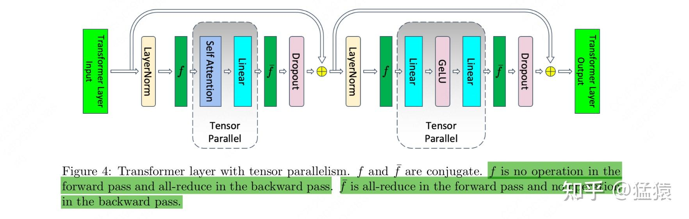

**从图中可以发现，megatron只在【attention】和【mlp】层的计算中使用了张量并行：**

-   当每块卡做attention/mlp前，每块卡上的input完全一致。
-   接着每块卡可以独立计算各自的attention/mlp部分。
-   当每块卡做完attention/mlp后，会对output进行通讯，最终保证每块卡上的output一致。这也确保了下一个block的attention/mlp的input一致。

我们来更仔细地探讨【attention】和【mlp】层在计算时发生了什么。

### 1.1 MLP层的张量并行

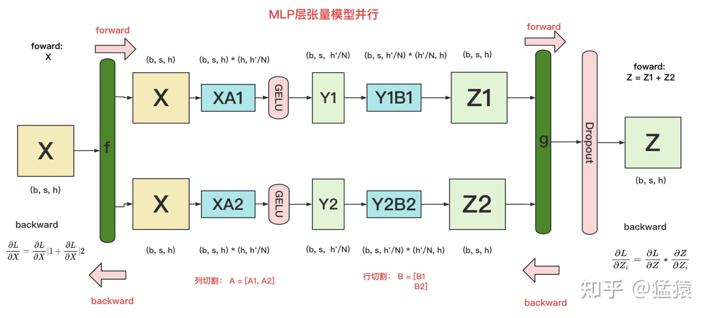

我们知道，通常MLP层主要由两个linear projection组成，我们在这里记其为A，B。同时我们假设把模型切割到了2块gpu上（tp\_size = 2）。

在MLP层中，**对A采用“列切割”，对B采用“行切割”**。

-   `f` 的forward计算：每块GPU上都拥有一个完整的输入X，每块GPU可以独立做forward计算。**这里的X即对应着figure4中做完layernorm模块后的结果。**
-   `g` 的forward计算：每块GPU上的forward的计算完毕，取得Z1和Z2后，GPU间做一次 **AllReduce**，相加结果产生Z。
-   `g` 的backward计算：由于此时每块卡上拥有了完整的Z，那么我们可以正常计算出 $\frac{\partial L}{\partial Z}$ （其中L=Loss），然后两块GPU就能各自独立做梯度计算。
-   `f` 的backward计算：当当前层的梯度计算完毕，需要传递到下一层继续做梯度计算时，我们需要求得 $\frac{\partial L}{\partial X}$。则此时两块GPU做一次 **AllReduce**，把各自的梯度 $\frac{\partial L}{\partial X}|1$ 和 $\frac{\partial L}{\partial X}|2$ 相加即可。

（这里的f就对应着figure4中的f，而g对应着figure4中的 $\bar{f}$ ）

### 1.2 Attention层的张量并行

对三个参数矩阵Q，K，V，**按照“列切割”**，**也即每块gpu负责1个/若干个head的计算**。对线性层B，**按照“行切割”**。切割的方式和MLP层基本一致，其forward与backward原理也一致，这里不再赘述。

## 二、Attention和MLP的激活值大小

我们知道，gpu的显存大小是模型训练的瓶颈之一。模型权重、梯度、优化器和激活值等都会占用显存。**其中，当我们在bwd的过程中使用链式法则层层向下计算梯度时，激活值（activation）就成为了传导的中间媒介（例如1.1图中，X，Y1，Z1等就属于激活值）**。由于激活值对显存的占据也是显著的，因此，我们有必要对激活值的存储做优化。

在以往的做法中，为了降低激活值占据的显存，我们会采用 **重计算（recomputation）技术**，还是以1.1图为例：

-   在fwd的过程中，我们算出了Y1。这时为了节省显存，我们选择不保存Y1
-   在bwd的过程中，当梯度计算传导到Y1时，我们重新做fwd过程，把Y1算出来，然后再做bwd
-   采用重计算方法，**我们可以避免那些暂时用不到激活值长久地占据着显存**，导致其他计算过程因为申请不到充足的存储资源而陷入等待。
-   **但是重计算也增加了模型的计算时长（多做了fwd），从而影响了模型的吞吐**。

所以，我们自然而然想到：**如果我不采用重计算，依然让暂时用不到的激活值保存在gpu上，但是我却能通过某种办法，降低每张gpu上保存的激活值大小，这样不就能避免额外做fwd了吗**？回归到我们的张量并行上，此时模型权重已经被切开放到各块卡上，**那么我们也想个办法，把激活值也切开放到各块卡上，不就行了吗？**

**围绕着这个想法，接下来我们就要依次解决3个问题：**

1.  Attention和MLP层会产出哪些激活值，它们会占据多少的显存大小？
2.  在这些激活值中，有哪些可以被切开存放，又是在什么维度上切割的？
3.  切割过后，整个Attention和MLP层是如何进行fwd和bwd计算的？

我们来依次回答这3个问题，在本节中我们先回答问题1。**在以下的讲解中，我们都假设是采用fp16进行训练的，也就意味着每个矩阵元素占据2bytes的显存。**

### 2.1 MLP层的激活值大小

我们先忽略任何切割方式，来看一个完整的mlp层的激活值大小计算。

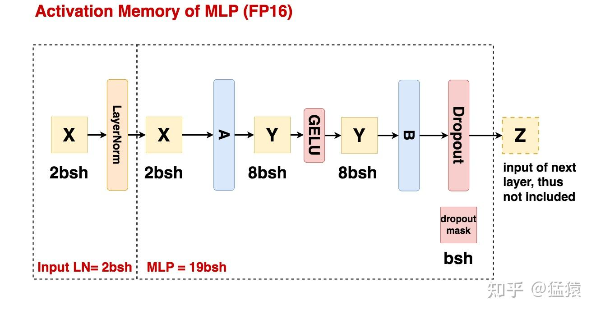

**设`b=batch_size，s=seq_len，h=hidden_size`。**

-   **Input LN：** 数据进过layernorm前的结果将会被用在bwd的计算中，因此会被作为激活值存储下来，其占据的存储大小为 **`2bsh`**，**单位为bytes**。
-   **MLP过程：**
    -   线性矩阵A(h, 4h)的输入被作为激活值保存，大小为2bsh
    -   线性矩阵B(4h, h)的输入被作为激活值保存，大小为8bsh
    -   GELU函数的输入被作为激活值保存，大小为8bsh
    -   Dropout mask矩阵（用于记录B的输出结果中，hidden\_size维度上有哪些元素被随机mask掉）会被作为激活值保存，大小为bsh。（因为只是一个简单的0/1 mask矩阵，所以一个元素用1 byte就可以保存下来）
    -   总结来看，**MLP过程的激活值大小 = 19bsh**

当你读完MLP过程的相关介绍后，你可能有这么一个疑惑：看起来似乎每一个操作（例如linear、gelu等）的输入就是一个激活值，我们只需要把它保存下来就可以了。但如果是这样的话，为什么我们不保存dropout的输入呢？

所以接下来，为了帮助大家更好理解什么样的数据才算激活值，我们举几个具体的例子。

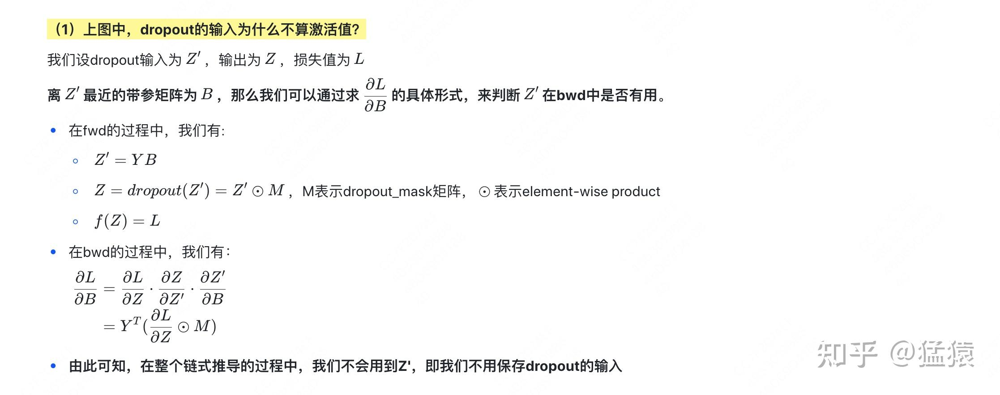

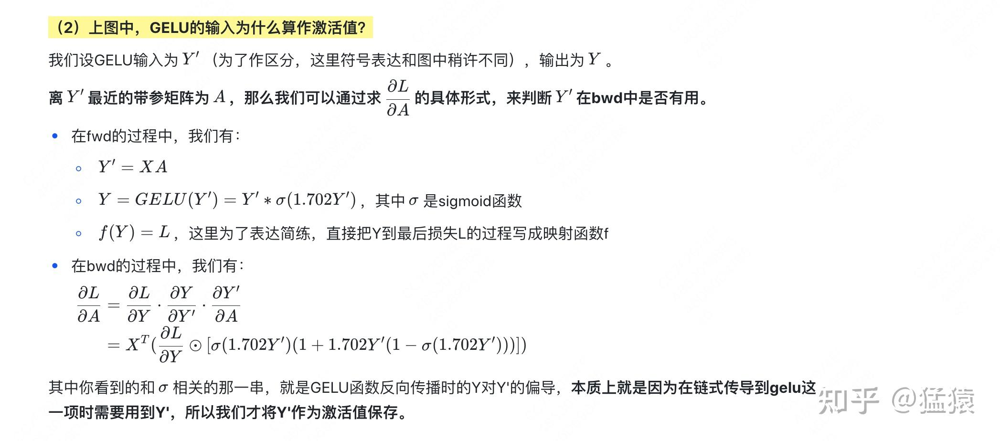

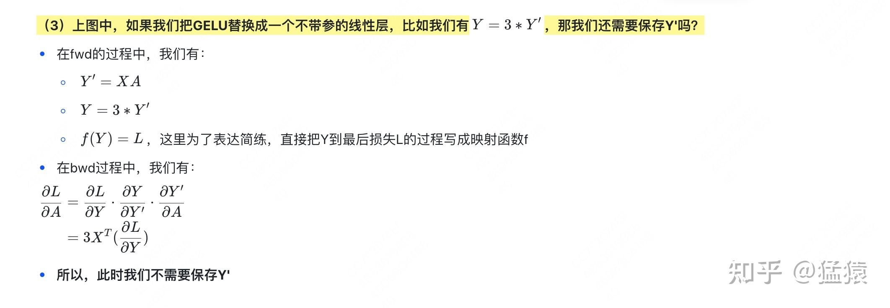

**上面这3个例子在告诉我们，决定一份数据是否能作为激活值保存下来的要点就在于它会不会在bwd的链式传导过程中被使用。所以大家不要凭主观去判定“一个带参矩阵的输入输出一定就是激活值”**，一定要自己动手推一下。当然，只要看得多了，在不用手动推导的情况下，也能快速知道哪些数据是激活值了。

### 2.2 Attention层的激活值大小

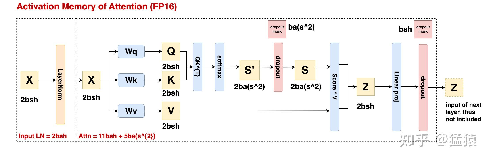

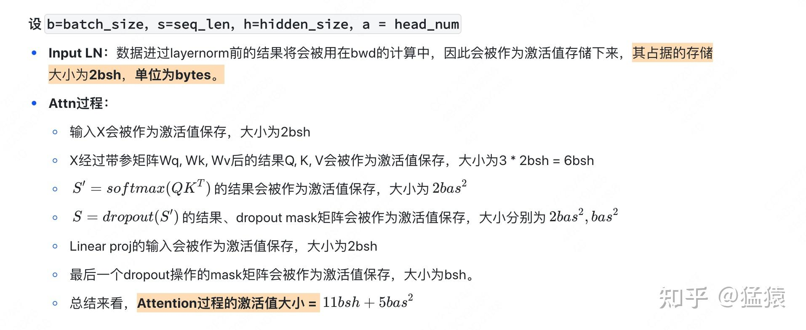

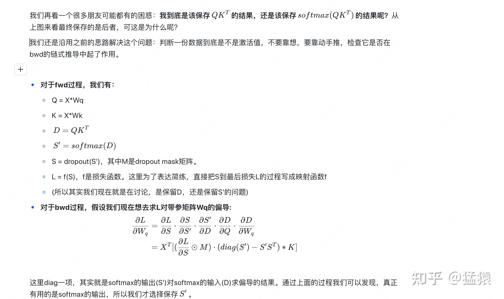

### 2.3 小结

-   MLP层的激活值大小为： $19bsh$
-   Attention层的激活值大小为： $11bsh + 5bas^{2}$
-   MLP层和Attention层的输入数据都首先经过了layernorm处理，和layernorm相关的激活值大小为 $2 * 2bsh = 4bs$
-   **所以一个Attention + MLP组成的block中，总激活值大小为** $34bsh +5bas^{2}$

## 三、Megatron SP

目前为止，我们已经知道哪些数据是激活值，以及它们占用的显存大小。**那么既然megatron sp的核心思想是借鉴tp把模型权重切分到多卡上的方式，把激活值也切分到各张卡上，那么现在我们就来讨论：哪些激活值可以被切开，又是怎么被切开的。**

### 3.1 总体实现一览

我们先来看最终megatron sp的实现方案，先有个整体的印象，然后再做详细介绍。
**首先，下图是改造前（仅有tp）的情况：**

**然后，下图是改造后（tp+sp的情况）：**

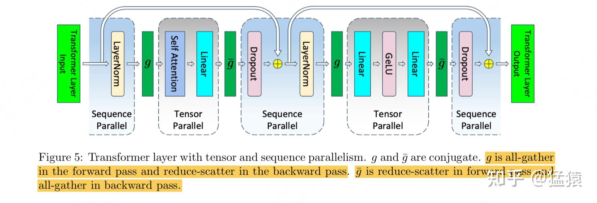

**不难发现，相比于tp，tp+sp保持了原始tp并行模块不变，只是针对Attn和MLP的输入/输出部分做了sp（序列并行处理）。接下来我们就具体来看sp是如何拆分的。**

### 3.2 MLP层的tp+sp

### （1）纯tp下的单卡激活值大小分析

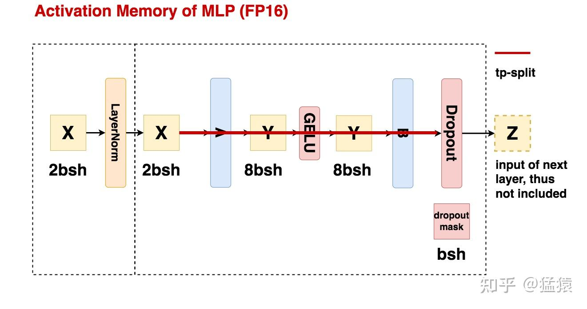

对比以上两张图，**我们可以计算纯tp下单张卡维护的激活值大小：**

-   首先，对于layernorm前、后的激活值X，每张卡都是重复保存的，这里占存储 $2*2bsh = 4bs$
-   接着，进入mlp的tp计算，每张卡上单独计算一部分结果，这里激活值天然就是切开保存的，占存储 $\frac{8bsh+8bsh}{t} = \frac{16bsh}{t}$
-   最终，计算完毕，由于tp会对输出结果先做allreduce，让每张卡上拿到完整的输出Z后再做dropout，所以dropout mask相关的激活值也是重复存储的，占大小 $bsh$
-   **综上，纯tp情况下单卡的激活值大小** $5bsh + \frac{16bsh}{t}$
-   **所以，为了降低单卡的激活值大小，我们的目标就是把这冗余的5bsh切分到多卡上。**

### （2）tp+sp下的单卡激活值大小分析

我们直接来看megatron sp是怎么解决这5bsh冗余的问题的：

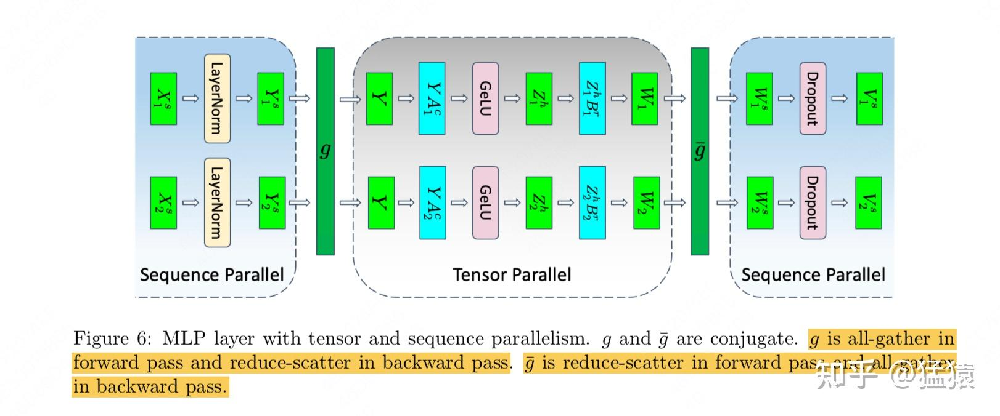

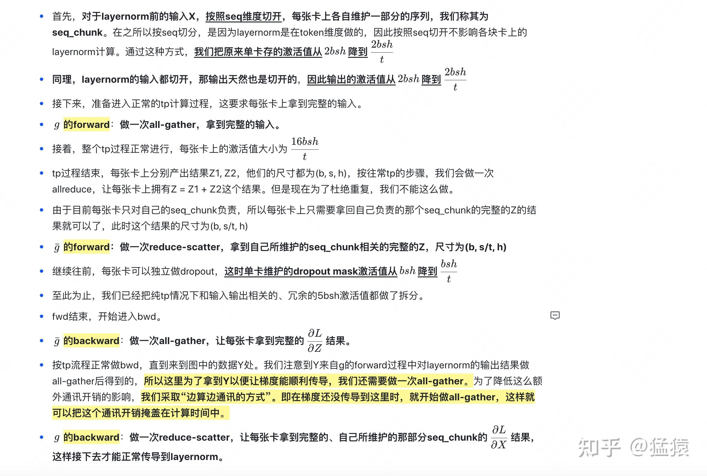

（建议大家在阅读本节时，可以对照3.2（1）中mlp tp流程图来看，帮组大家更好理解为什么这里做all-gather，而那里又用reduce-scatter）

**在tp+sp的加持下，我们把单卡上mlp层维护的激活值大小从** $5bsh + \frac{16bsh}{t}$ 降到了 $\frac{21bsh}{t}$，**同时共做了2次all-gather和2次reduce-scatter，和纯tp下mlp层做2次allreduce（假设采用了ring allreduce这类的优化办法）的通讯量一致。**

### 3.3 Attention层的tp+sp

**这里我就不赘述了，基本流程和mlp一样，最终单卡激活值大小降为** $\frac{(5bas^{2}+8bsh) + 5bsh}{t}$ **(括号内表示纯tp情况下就已经切分开的激活值，括号外表示引入sp后额外切分开的激活值，依然也是layernorm的输入输出和最后一个dropout mask矩阵)**，**通讯量也是和纯tp维持一致**。

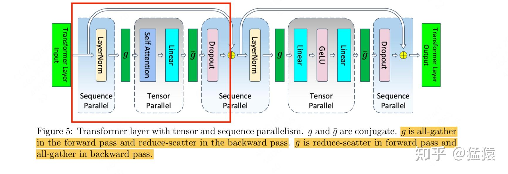

### 3.4 总结

-   **不做任何并行处理时**，单卡上attn+mlp层的激活值大小 $sbh(34 + 5\frac{as}{h})$
-   **假设有t块卡，纯tp处理时**，单卡上attn+mlp层的激活值大小 $sbh(10 + \frac{24}{t} + 5\frac{as}{ht})$，这里唯一没有被t除的10表示attn和mlp中和layernorm输入、输出以及最后一个dropout mask相关的部分。这一部分也是sp关注的优化点。
-   **假设有t块卡，做tp+sp处理时**，单卡上attn+mlp层的激活值大小为 $sbh(\frac{34}{t} + 5\frac{as}{ht})$

## 四、Selective Activation Recomputation

目前为止，**megatron通过tp+sp的方式，在tp的基础上，进一步按照seq维度拆分了Attn和MLP的输入、输出结果**，使得在通讯量维持和纯tp一致的情况下，单卡所维护的激活值大小得到进一步下降。**通过这种方式为单卡尽量腾出显存空间，使得我们可以存下所有的激活值。如此一来在bwd的过程中就不需要做重计算了，可以加快bwd的过程，提升模型整体的训练速度。**

但是有时，即使用了sp+tp，我们的显存可能也存不下全部的激活值。同时，由于我们总是可以边算边通讯，因此可能没有必要一下子把全部的激活值都保存下来，例如通过一些优化，让模型还在上一层做通讯时，下一层就开始重计算（这里的层不是指模型的layer，是指bwd的时间轴，这里只是大概举个例子）。**因此一种折衷的办法是：在使用tp+sp的前提下，只保留部分激活值，另一部分留做重计算。那什么样的激活值是我们不想保留的呢？自然是那些占显存大，但是本身计算量不大的激活值（例如Attention score相关的计算，softmax这种操作比起矩阵乘法来说就更快）。megatron管这种办法叫selective activation recomputation。**

我们来看具体的操作方法：

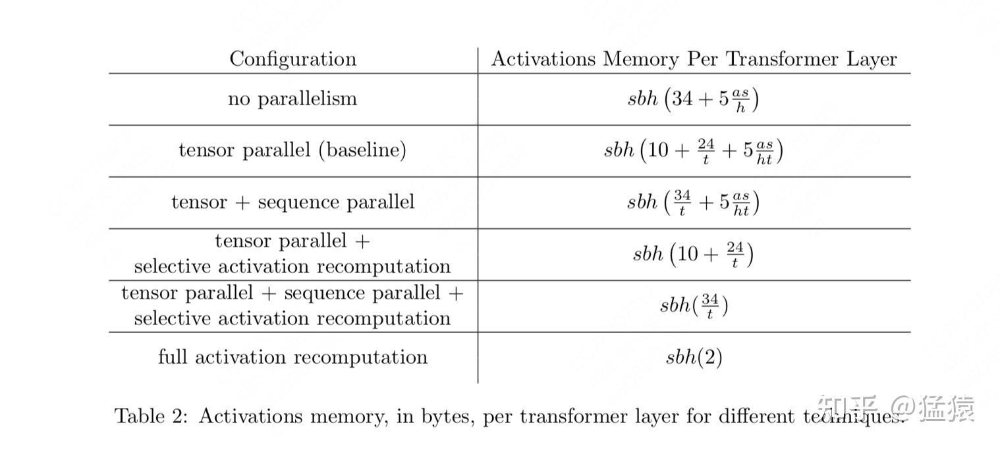

-   **tp + selective activation recomputation**：只使用tp和选择性重计算，这里只保留attention和mlp输入、输出相关的部分（也就是sp着重优化的部分），而把中间计算结果的全部激活值都舍弃了，到时候重计算。
-   **tp + sp + selective activation recomputation**：这里选择把attention score softmax（占存储大，计算量小）相关的激活值舍弃掉，其余激活值全部保存
-   **Full activation recomputation**：就是我们说的朴素的重计算，只保留一个最开始的输入。

几种方法的实验效果如下，可以发现tp+sp+选择重计算这种方案的整体表现最好：

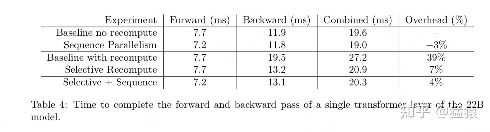

**【大模型预训练系列】**
-   **[猛猿：图解大模型训练之：流水线并行（Pipeline Parallelism），以Gpipe为例](https://zhuanlan.zhihu.com/p/613196255)**
-   **[猛猿：图解大模型训练之：数据并行上篇(DP, DDP与ZeRO)](https://zhuanlan.zhihu.com/p/617133971)**
-   **[猛猿：图解大模型训练之：数据并行下篇(ZeRO，零冗余优化)](https://zhuanlan.zhihu.com/p/618865052)**
-   **[猛猿：图解大模型系列之：张量模型并行，Megatron-LM](https://zhuanlan.zhihu.com/p/622212228)**
-   **[猛猿：图解大模型系列之：Megatron源码解读1，分布式环境初始化](https://zhuanlan.zhihu.com/p/629121480)**
-   **[猛猿：图解大模型训练之：Megatron源码解读2，模型并行](https://zhuanlan.zhihu.com/p/634377071)**
-   **[猛猿：图解大模型训练系列之：Megatron源码解读3，分布式混合精度训练](https://zhuanlan.zhihu.com/p/662700424)**
-   **[猛猿：图解大模型训练系列之：DeepSpeed-Megatron MoE并行训练（原理篇）](https://zhuanlan.zhihu.com/p/681154742)**
-   **[猛猿：图解大模型训练系列之：DeepSpeed-Megatron MoE并行训练（源码解读篇）](https://zhuanlan.zhihu.com/p/681692152)**
-   **[猛猿：图解大模型训练系列：序列并行1，Megatron SP](https://zhuanlan.zhihu.com/p/4083427292)**
-   **[猛猿：图解大模型训练系列：序列并行2，DeepSpeed Ulysses](https://zhuanlan.zhihu.com/p/4496065391)**
-   **[猛猿：图解大模型训练系列：序列并行3，Ring Attention](https://zhuanlan.zhihu.com/p/4963530231)**
-   **[猛猿：图解大模型训练系列：序列并行4，Megatron Context Parallel](https://zhuanlan.zhihu.com/p/5502876106)**
