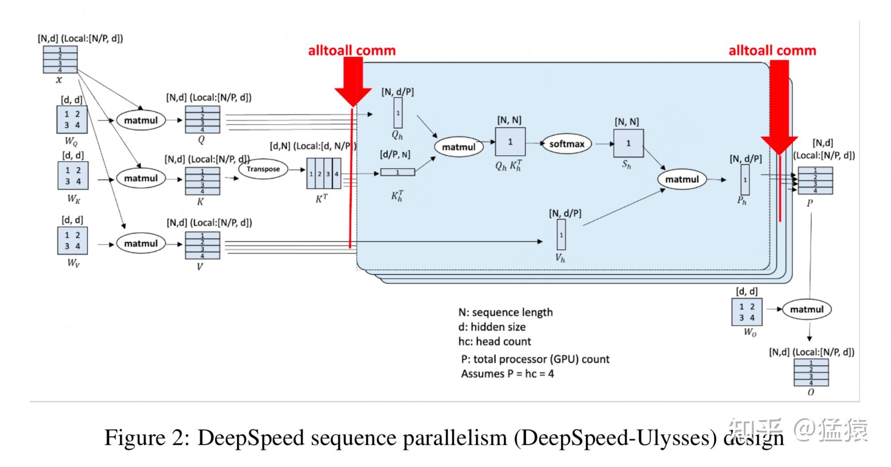
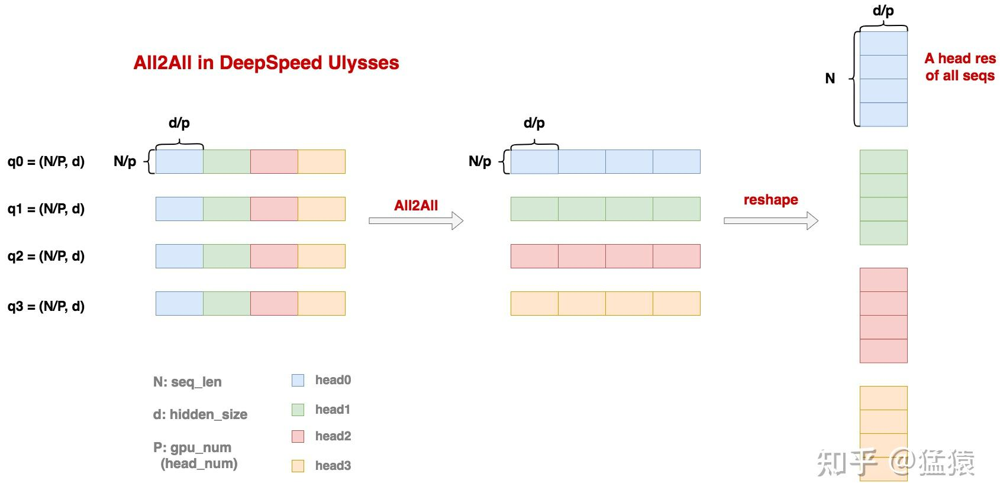
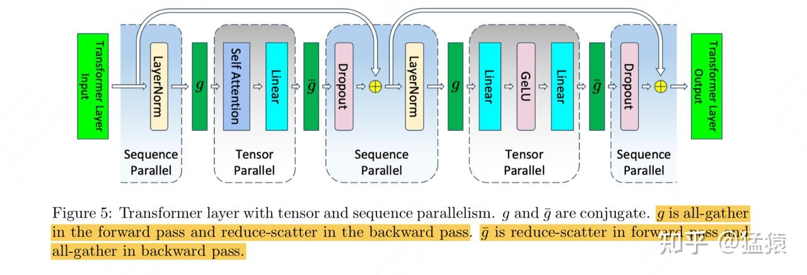
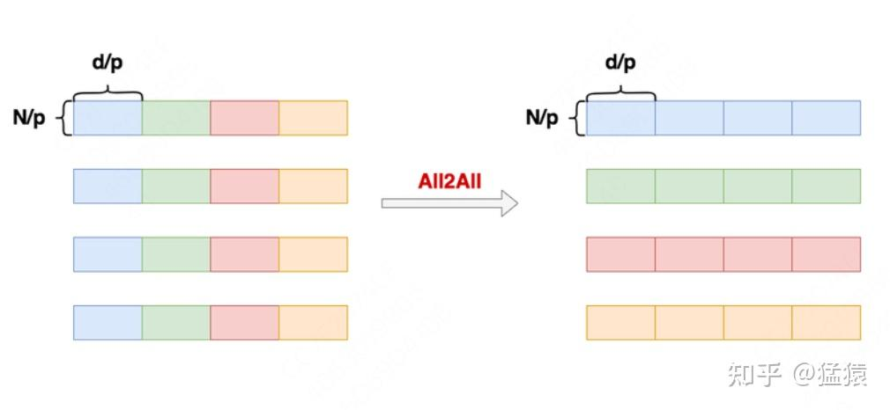
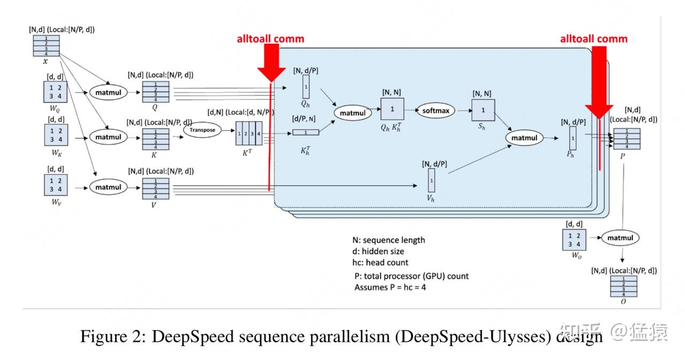
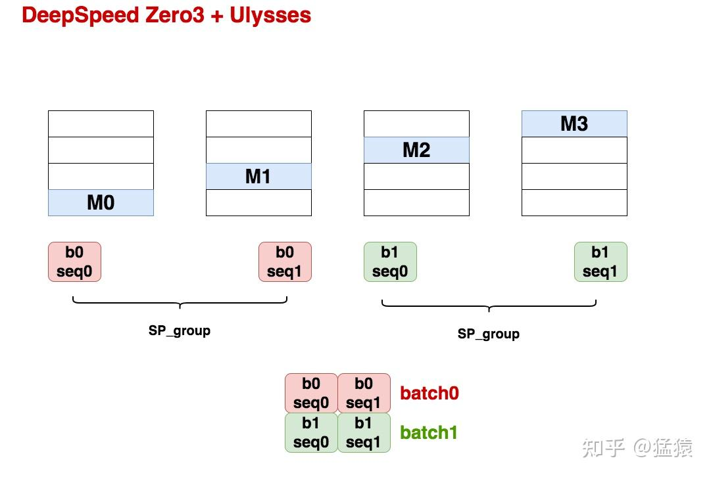

大家好，在序列并行系列中，我们已经介绍过了[Megatron SP](https://zhuanlan.zhihu.com/p/4083427292)，今天这篇文章我们来看DeepSpeed Ulysses。
在正文开始前，请允许我吐槽一下，**DeepSpeed Ulysses继承了DS家一如既往的写作和coding风格：云里雾里，梦里心里，就是走不进你的脑子里**。所以虽然paper短小，coding改动也小，**一切都慷慨地开源了，但一切又好像没有开源**，使得整个理解的过程变得过于眼鼻酸涩。举些例子来说：

-   Ulysses的卖点之一【通讯量】竟然用一两句话就写过去了 。
-   Ulysses SP的核心操作All2All过程，竟然用一个标着All2All的红箭头就概括过去了 。
-   Ulysses + zero3这种官方安利的训练方法，竟然没有一个图例 。
-   诸如此类。

所以本来想偷懒不看源码，最终又要从源码开始看起。那既然说起了代码，如果你也看过ds家的代码风格的话，那你应该懂我接下来没有记录下的这些眼泪（不过ulysses其实还好）。

不过虽然如此，当真正了解了Ulysses的设计思想时，就不得不佩服它的简便和轻巧，如果我有做序列并行的实际需求，我大概率会从Ulysses开始尝试改起。话不多说，进入正文～

**【历史文章汇总】**

[https://zhuanlan.zhihu.com/p/654910335](https://zhuanlan.zhihu.com/p/654910335)

---

## 一、Ulysses整体运作流程

Ulysses的整体运作流程如下图，我们来详细解释下。

设：

-   **N = seq\_len**
-   **d = hidden\_size**
-   **P = gpu\_num**，在后文的解读中，我们可以发现ulysses在实际操作中，其实是1张卡算1个/若干个head的结果，所以这里还应该满足head\_num是P的整数倍，**不过接下来我们为了表达简便，统一把这个P直接理解成head\_num。**

我们来跟着这张图，走一遍ulysses的fwd过程。

**（1）按seq维度切分输入数据。**
对于输入`X =（N, d）`，我们将其切分成若干个seq\_chunk，作为各自gpu的输入，**每个seq\_chunk的尺寸为`(N/P, d)`。**

**（2）每张卡计算自己维护的seq\_chunk的qkv值。**

-   **由于ulysses本身不对模型做任何切割，所以每块gpu上保存有完整的模型，也就是完整的** $W_Q, W_K, W_V$ 矩阵，尺寸都为`(d, d)`
-   这里额外提一点，我们经常会听到ulysses可以配合zero3进行使用。在这种情况下，在进入正式计算前，每块gpu确实只保存部分模型（模型并行的形式），但实际计算时会做all-gather让每张卡拿回完整的模型再计算（数据并行的实质），所以我们依然可以理解成gpu上保存完整的模型。
-   **每块gpu上的seq\_chunk正常和** $W_Q, W_K, W_V$ **相乘，得到`q/k/v_chunk = (N/p, d)`**

**（3）针对q/k/v\_chunk，所有卡间做一次All2All通讯，使得每张卡拿到所有seq的某1个head的q/k/v\_chunk**

-   做这个All2All通讯前，每张卡上维护的 **`q/k/v_chunk = (N/p, d)`，** 可以理解成某个seq\_chunk所有head的qkv值
-   做这个All2All通讯后，每张卡上维护的 **`q/k/v_chunk = (N, d/P)`，** 可以理解成所有seq的某个head的qkv值。

**我们以q\_chunk为例**，来具体看All2All是怎么实现这一点的（**下图根据ulysses源码进行绘制，做了一点简化**）

-   如上图所示，这里我们假设有4块卡（4个head），则最终我们希望gpu0算head0的结果，gpu1算head1的结果...以此类推。我们用不同颜色的矩形表示计算不同head需要用到的q数据。
-   我们从上图的最左侧位于gpu0上的q0看起，它表示seq\_chunk0的q结果，尺寸为`(N/P, d)`。不难理解，如果我们将q0沿着d维度切成P块，那么每一块就表示为了计算出对应的head所需要的q结果。其余gpu上的q\_chunk也是类推。
-   **现在我们执行All2All算法，你可以将它理解成是一种“转置式”地通信方法**：结合上图我们可以发现，各块卡第1列蓝色块现在都跑去gpu0，第2列绿色块现在都跑去gpu1...这就是我们说的“转置”的含义。
-   All2All结束后，我们还以gpu0为例，**它上面拥有P块`(N/P, d/P)`数据，表示所有seq在head0上的q结果**，**我们将其稍作reshape后，每块卡上最终维护的q\_chunk就变成`(N, d/P)`**。每块卡上的k/v\_chunk也是同理进行All2All通讯。

**（4）每张卡拿到所有seq的某1个head的q/k/v\_chunk后，我们正常执行Attention计算，最终每张卡上产出结果** $P_{h}$ **chunk，尺寸为`(N, d/P)`**

**（5）针对** $P_{h}$ **chunk，所有卡间再做1次All2All通讯，最终单卡上维护的P chunk尺寸又变回`(N/P, d)`**。这个All2All过程可以理解成是先前描述的All2All的反操作，作用过程相似，这里不再赘述。

**（6）单张卡上拥有完整的** $W_{O}$ **矩阵，我们将P chunk和它相乘，得到最后的输出O chunk，尺寸为`(N/P, d)`**

**（7）进入MLP层，由于在MLP层中，不涉及token和token之间的相关性计算，所以各seq\_chunk块可以独自计算。**

**（8）重复上述过程，直到算到Loss 为止。**

-   这里我初步判定，每张卡上算出的Loss应该就是这块卡所维护的那个seq\_chunk的Loss。因为我粗看了一遍ulysses的代码，发现目前它的核心是单独设计了一个能实现sp并行的DistributionAttention的模块，然后用这个模块替换掉之前的Attention Module，通过这样一个简单的替换实现了ulysses的基本功能。再考虑到seq\_chunk在MLP计算时的独立性和数据并行的特性，最终单卡Loss应该就是seq\_chunk Loss，这也意味着sp组的梯度需要做AllReduce通讯，这个我们放在后面对ulysses的通讯量分析中再说。

## 二、Megatron VS Ulysses

不难发现，Ulysses和Megatron在分布式计算attention上有某些相似之处：

-   **Megatron通过tp，显式地把Wq, Wk, Wv切分开**，然后每张卡上计算 **所有seq的某个head的结果**。
-   **Ulysses通过sp+all2all，在每张卡完整保存Wq, Wk, Wv的前提下**，让每张卡上计算 **所有seq的某个head的结果。**

那么在实现相似功能的情况下，**Ulysses提出的一个重要卖点是：我的通讯量低**。所以接下来，就让我们来详细分析这一点。
**（⚠️⚠️⚠️：如果看到下文时，发现对通讯量、激活值等等计算有疑问的朋友，可以先看这篇写**[Megatron SP](https://zhuanlan.zhihu.com/p/4083427292)**的文章。）**

### 2.1 Megatron通讯量

上图展示了megatron tp + sp下的整体运作流程。

**对于Attention部分：**

-   **在fwd的过程中，做了1次all-gather，1次reduce-scatter**
-   **在bwd的过程中，做了1次reduce-scatter，1次all-gather**（其实在bwd反向传播到g前，还需要做1次all-gather，只是这个通讯量可以被计算掩盖掉，也就是还在传播到g前还在做上层的链式推导计算时，就可以开始all-gather了，所以我们这边先忽略这个额外的all-gather，但是如果你想算进去也没事）
-   **1个all-gather/1个reduce-scatter的通讯量约为Nd（忽略batch\_size），所以Megatron Attn部分的通讯量约为4Nd**

**对于MLP部分：**

-   同样是2次all-gather + 2次reduce-scatter，同理还有1次额外的all-gather可以被bwd过程中的计算时间覆盖掉，所以我们还是不计算它。

**综合Attention和MLP：**

-   最终在Megatron中，**Attention + MLP的通讯量为4 all-gather + 4 reduce-scatter（额外还有2次可以被bwd计算覆盖掉的all-gather不算在这里），1个all-gather/1个reduce-scatter的通讯量约为Nd（忽略batch\_size），所以Megatron Attn部分的通讯量约为8Nd**

### 2.2 Ulysses通讯量

（1）All2All操作的通讯量

-   All2All操作前，每张卡上保存的数据大小为(N\*d)/P，每个小数据块的大小为(N\*d)/(P\*P)
-   虽然对于单卡来说，它的通讯量涉及send和accept，但整个系统的通讯量可以理解成是每张卡的send总和（因为你的accept总来自别人的send，反之亦然），所以对于单卡通讯量我们也只看send就行。
-   **对于单卡来说，它的send量 = \[(N\*d)/(P\*P)\]\*(P-1)，约为(N\*d)/P，也就是单卡1次All2All的通讯量约是(N\*d)/P【回顾一下，单卡做1次all-gather或reduce-scatter的通讯量是N\*d】。**

（2）Ulysses fwd通讯量
回顾第一部分Ulysses的fwd过程：

-   q/k/v\_chunk各自做1次All2All通讯，则这里合起来做了3次All2All通讯
-   各卡上原始的Attention结果 $P_h$ 做了1次All2All通讯
-   **综上，Ulysses fwd过程一共做了4次All2All通讯**

（注意，如果配套使用了zero操作，fwd过程还会涉及模型权重的all-gather，不过这里我们不考虑这一点，我们就假设是最朴素的ulysses，单卡上有完整的模型）

（3）Ulysses bwd通讯量
这块也是我觉得比较重要，但是论文里没有展开的地方（抹泪），所以我翻了翻源码（又抹泪），根据自己的理解大致描述下bwd的过程。

**对于ulysses bwd的过程，对于以下两类通讯，由于理论上它们可以被bwd的计算时间覆盖，所以不计入总通讯量中：**

-   **激活值的重计算**：我们知道链式推导的过程中我们会用到一些激活值（比如上图中的P），而为了节省显存，大部分框架都不会把这些激活值保存下来，只有在链式传导块传递到这个激活值上时，重新做fwd算出这个激活值。比如链式传导快到上图中的P上时，我们就需要重做fwd的All2All把P算出来。我们可以在用到P前做这件事，因此重算P的All2All通讯是可以被覆盖的。图中的 $S_h, V_h, Q_h, K_h$ 等等也是同理。
-   **梯度的AllReduce**：

-   假设我们现在要对 $W_{O}$ 计算梯度，这里假设我们有两张卡，每张卡上维护某个seq\_chunk的P\_chunk结果，P\_chunk的尺寸为(N/2, d)，则我们有：
-   $O_0 = P_0 * W_O$
-   $O_1 = P_1 * W_O$
-   每张卡上所维护的seq\_chunk最终的loss为： $L_0 = f(O_0), L_1 = f(O_1)$ ，完整序列的Loss为 $L = L_0 + L_1$ 。这里为了表达简便，把计算出O以后所有的操作都用函数f来表示。
-   所以易知： $\frac{\partial L}{\partial W_{O}} = \frac{\partial L_1}{\partial W_O} + \frac{\partial L_2}{\partial W_O}$ ，也就是 $W_{O}$ 的总梯度需要各块卡算出来的梯度做AllReduce。
-   回到图中，当各卡算完各自对 $W_O$ 的梯度后，它们可以一边继续做链式传导，一边把梯度发出去做AllReduce（因为梯度是否AllReduce完并不影响接下去的链式传导的过程），所以梯度的AllReduce也算被bwd的计算时间覆盖了，因此不纳入ulysses bwd的通讯量计算中。

明确了这两点，**我们现在来分析ulysses bwd中真正有影响的通讯操作**（配合上图进行阅读）：

-   首先，当我们的梯度传导到P上后，我们需要对dP做1次All2All操作，这样才算恢复fwd的路径。
-   同理，当我们的梯度传导到V, Q, K上后，我们也需要对他们进行All2All操作，这里一共进行了3次All2All操作。
-   你可以理解成bwd过程的All2All和fwd过程的All2All是在一样的位置做相反的操作，**所以整个bwd过程也做了4次All2All操作。**

**这里再额外提一点，其实这4次All2All操作间也是可以覆盖的**，举个例子，链式传导到V后，我们就可以对dV做All2All了，而此时我们可以继续在单卡上计算dQ和dK，所以dV的All2All操作可以被覆盖。同理dQ和dK谁先算完，谁就可以被覆盖。**不过在ulysses的源码中，似乎只有dQ和dK做了这个覆盖操作的处理。Anyway，我们这边暂时不考虑bwd这4次All2All的相互覆盖。**

所以：

-   **ulysses的fwd做了4次All2All，bwd做了4次All2All，一共是8次All2All**
-   **每次All2All的通讯量约为(N\*d)/P，所以ulysses总通讯量为(8Nd)/P**

### 2.3 通讯量的比较

回顾一下，如上文所言，在不考虑一些可以被覆盖的通讯的情况下，单卡上每个layer(mlp+attn)的通讯量为：

-   **Megatron tp+sp**：**4 all-gather + 4 reduce-scatter，总通讯量为8Nd**
-   **DeepSpeed Ulysses**：**8 All2All，总通讯量为(8Nd)/P**

仔细端详这2个通讯量，我们可以发现：

-   **对于Megatron，不管你用了多少张卡，它的单卡总通讯量都是8Nd**。这意味着如果我的序列长度变长（N变大），这时你无法通过扩张卡的数量来减少单卡通讯量，那么单卡花在通讯上的时间就可能更多，进而降低了训练速度。
-   **对于DeepSpeed Ulysses，它的单卡通讯量为(8Nd)/P，这也意味着当N变大时，只要你能同倍数地调整gpu的数量（P），那么你就可能让单卡通讯量维持在一个不变的常数，使得其不随N增加而变大。** 不过我们要注意，**P的数量其实是被head\_num限制住的（ulysses源码里也做了限制）**，所以其实你并不能无限扩张P，**因此朴素的Ulysses在实现【单卡通讯量随P scaling维持在一个不变的常数】的这个卖点上并不完美**。所以我们可以对ulysses做一些改造，这里就不展开了，在后面的系列里慢慢引入吧。

## 三、Ulysses + Zero3

针对论文和官方tutorial里提的ulysses + zero3的方法（同样也是一个卖点，但ds又没展开，抹泪），我这边大概画了一下框架：

-   我们假设sp\_size = 2, dp\_size = 2。则需要的gpu数量为world\_size = sp\_size \* dp\_size = 4
-   按照zero3的原则，我们把模型权重分成M0~M3这样的4块，分布在不同的gpu上。
-   在开始fwd计算前，按照zero3的原则，所有卡上的权重做一次通讯，使得每块卡都拿到完整的M0，然后正常做ulysses的过程，以此类推。

关于ulysses的基本介绍就到这里了，下次我们一起来看看序列并行的第三篇，ring attention吧！

## 四、参考

1. [https://arxiv.org/pdf/2309.14509](https://link.zhihu.com/?target=https%3A//arxiv.org/pdf/2309.14509)
2. [https://github.com/microsoft/DeepSpeed/blob/master/deepspeed/sequence/layer.py](https://link.zhihu.com/?target=https%3A//github.com/microsoft/DeepSpeed/blob/master/deepspeed/sequence/layer.py)
3. [https://github.com/microsoft/Megatron-DeepSpeed/blob/main/megatron/model/transformer.py](https://link.zhihu.com/?target=https%3A//github.com/microsoft/Megatron-DeepSpeed/blob/main/megatron/model/transformer.py)
4. [https://www.deepspeed.ai/tutorials/ds-sequence/](https://link.zhihu.com/?target=https%3A//www.deepspeed.ai/tutorials/ds-sequence/)

---

**【大模型预训练系列】**
-   **[猛猿：图解大模型训练之：流水线并行（Pipeline Parallelism），以Gpipe为例](https://zhuanlan.zhihu.com/p/613196255)**
-   **[猛猿：图解大模型训练之：数据并行上篇(DP, DDP与ZeRO)](https://zhuanlan.zhihu.com/p/617133971)**
-   **[猛猿：图解大模型训练之：数据并行下篇(ZeRO，零冗余优化)](https://zhuanlan.zhihu.com/p/618865052)**
-   **[猛猿：图解大模型系列之：张量模型并行，Megatron-LM](https://zhuanlan.zhihu.com/p/622212228)**
-   **[猛猿：图解大模型系列之：Megatron源码解读1，分布式环境初始化](https://zhuanlan.zhihu.com/p/629121480)**
-   **[猛猿：图解大模型训练之：Megatron源码解读2，模型并行](https://zhuanlan.zhihu.com/p/634377071)**
-   **[猛猿：图解大模型训练系列之：Megatron源码解读3，分布式混合精度训练](https://zhuanlan.zhihu.com/p/662700424)**
-   **[猛猿：图解大模型训练系列之：DeepSpeed-Megatron MoE并行训练（原理篇）](https://zhuanlan.zhihu.com/p/681154742)**
-   **[猛猿：图解大模型训练系列之：DeepSpeed-Megatron MoE并行训练（源码解读篇）](https://zhuanlan.zhihu.com/p/681692152)**
-   **[猛猿：图解大模型训练系列：序列并行1，Megatron SP](https://zhuanlan.zhihu.com/p/4083427292)**
-   **[猛猿：图解大模型训练系列：序列并行2，DeepSpeed Ulysses](https://zhuanlan.zhihu.com/p/4496065391)**
-   **[猛猿：图解大模型训练系列：序列并行3，Ring Attention](https://zhuanlan.zhihu.com/p/4963530231)**
-   **[猛猿：图解大模型训练系列：序列并行4，Megatron Context Parallel](https://zhuanlan.zhihu.com/p/5502876106)**
