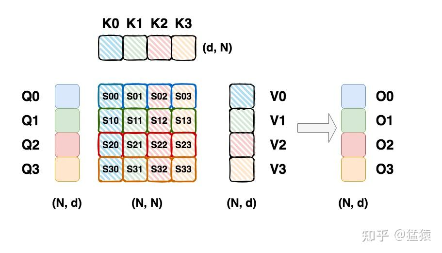
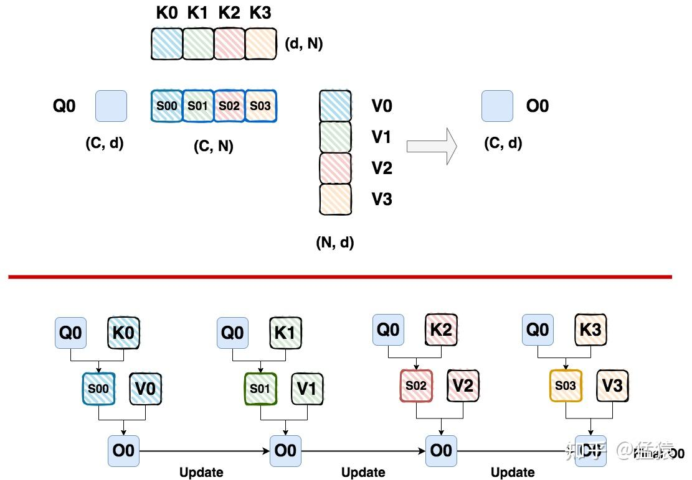
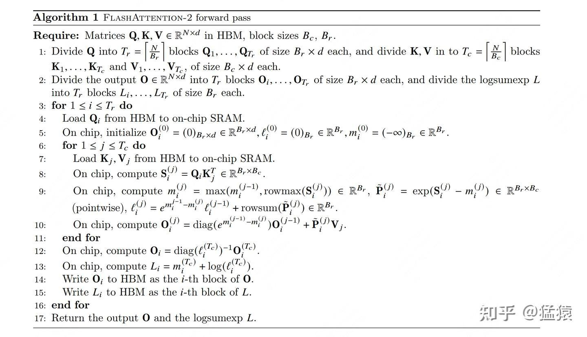
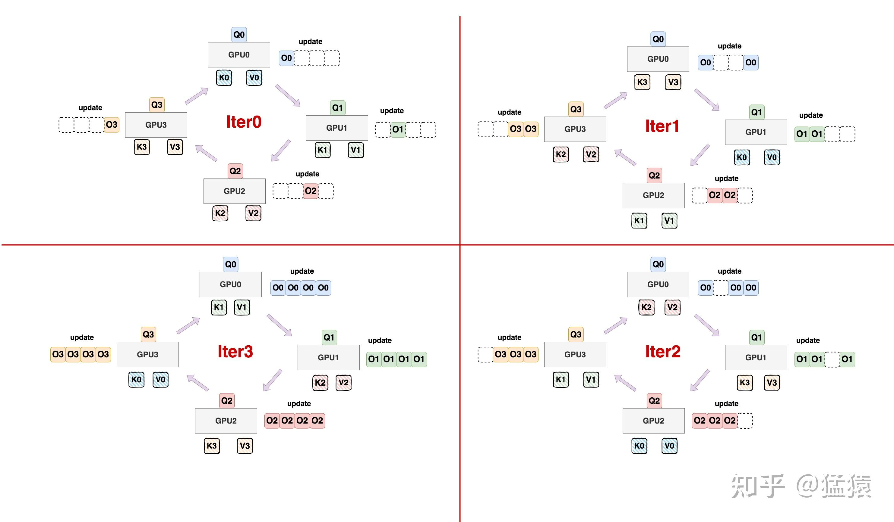

在序列并行系列中，我们将详细介绍下面四种常用的框架/方法：

1.  **[Megatron Sequence Parallelism](https://zhuanlan.zhihu.com/p/4083427292)**：本质是想通过降低单卡激活值大小的方式，尽可能多保存激活值，少做重计算，以此提升整体训练速度，一般和它家的tp配套使用。
2.  **[DeepSpeed Ulysses](https://zhuanlan.zhihu.com/p/4496065391)**：我们知道ds家的zero是模型并行的形式，数据并行的本质。在这个情况下，单张卡是完整地做一条序列的MHA过程的，序列长度较长时，就会对单卡显存产生压力。**所以Ulysses的解决办法是，让单张卡只算全部seq的某个/某些head的结果**，具体实践起来就是先通过按seq维度切割卡的输入，再通过all2all通讯来做。
3.  **Ring Attention**：相当于分布式的Flash Attention V2（我个人的理解），**它最终的效果是让每张卡只算自己所维护的那部分seq\_chunk的MHA。**
4.  **Megatron Context Parallelism**：可以看成是增强版的sp，引入了类ring-attention的技术（在tp-pp-dp rank相同的位置做ring-attention），联合Megatron的各种混合并行方式进行训练。

其中1和2我们已经在前面的系列中讲过，今天我们来看【3. Ring attention】，阅读本文前，最好对[Flash Attention V2](https://zhuanlan.zhihu.com/p/691067658)和[Flash attention V1](https://zhuanlan.zhihu.com/p/669926191)的分块计算过程有初步了解。

**【历史文章汇总】**

[https://zhuanlan.zhihu.com/p/654910335](https://zhuanlan.zhihu.com/p/654910335)

---

## 一、单gpu：朴素attention及safe softmax

##

一个朴素attention的计算过程如上图所示。这里我们设Q,K,V的尺寸都为`(N, d)`，其中N=seq\_len，d = hidden\_size。为了接下来更好表示ring attention的切块计算法，上图中把Q,K,V都切分成了4块，每块大小为`(C, d)`。但这依然不妨碍以不切块的视角阅读上面这张图。**特别注意，图中尺寸为`(N, N)`的attention矩阵要做完softmax后才能和V矩阵相乘，为了表达简便图中没有画出softmax过程，但我们一定要记得有这个过程，这非常重要。**

正常来说，我们计算softmax的方式为：
$softmax(x_{i}) = \frac{e^{x_{i}}}{\sum_{j=1}^{d}e^{x_{j}}}$
**而如果** $X_i$ **过大，那么在计算softmax的过程中，就可能出现数据上溢的情况**。为了解决这个问题，我们可以采用 **safe softmax方法**：
$m(x) = \mathop{max}\limits_{i}x_{i}\\  softmax(x_{i}) = \frac{e^{x_{i}-m(x)}}{\sum_{j=1}^{d}e^{x_{j}-m(x)}}$

## 二、单gpu：分块计算

在分块的情况下，基本思路是：

-   固定住某个Qi，它的尺寸为`(C, d)`
-   给这个Qi分别传入不同的Kj, Vj数据块，计算对应的Oij
-   **通过某种方式**，每传入一份(Kj, Vj)，就更新一次Oij。这样知道最后一份(Kj, Vj)传入并计算完毕后，我们就得到了最终的Oi。你可以把这个过程理解为，**我们维护的始终只有一个尺寸为`(C, d)`的Oi，我们在每次计算完毕后都更新这种Oi。到这里为止我们先不纠结Oi具体的更新方式，只要知道它是【滚动更新】的即可。**
-   **不难理解，在写成代码的情况下，遍历Q分块的过程可以表示成outer loop，遍历KV分块的过程可以表示成inner loop。**

整个计算过程如下图所示：

不难得知：

-   **如果我们不对Attention score做softmax，那么O0的更新方式就可以变成简单的累加形式**，即本次计算出的 $O_{0}$ + 上一步骤后 $O_{0}$ 的结果。
-   **但当我们对Attention score做softmax（默认都指safe softmax时），情况就大不相同了，举例来说：**

-   计算safe softmax，我们需要知道分数矩阵每行的max和每行的sum，我们记其为 **global max和global sum。**
-   当我们使用 $S_{00}$ 的结果计算 $O_{0}$ 时，我们用的是 $S_{00}$ 这个矩阵的 **local max和global sum。**
-   **所以，在使用softmax的情况下，我们无法对** $O_0$ **做简单的累加**。

那么，在分块的情况下，我们到底要采取什么方式更新 $O_{i}$ 呢？**本质上来说，ring attention采用的是和flash attention V2非常相近的** $O_{i}$ **更新方式**，具体可以参见我之前对Flash Attention V2的解读：

-   [Flash Attention V2](https://zhuanlan.zhihu.com/p/691067658)：这篇文章的1.2（1）部分详细介绍了 $O_{i}$ 的更新方式
-   [Flash Attention V1](https://zhuanlan.zhihu.com/p/669926191)：这篇文章第四部分详细介绍了朴素attention->safe softmax -> 分块safe softmax的整个过程，并用递归法证明了 $O_{i}$ 的更新方式，这个证明方法同样可以类推到V2的 $O_{i}$ 上。

所以，本文不再对 $O_{i}$ 的更新细节和数学推导做更多论述。

但这里我们额外再关注一点：**Ring Attention和Flash Attention V2的** $O_{i}$ **的更新方式非常相近，但不完全相同**。为了更好阐述这一点，我们先来看Flash Attention V2中 $O_{i}$ 的更新方式：

上图展示的是Flash Attention V2的fwd算法过程，第10行展示了 $O_{i}$ 的更新方式。同时注意到，当我们把outer loop和inner loop全部做完后，在第12行我们又对 $O_{i}$ 做了一次更新，且这个更新是一次性的，同时更新公式中的 $l$ 和global sum相关。Flash Attention V2为什么要这么做呢？因为：

-   **首先，你当然可以把第12行的更新放到第10行中去做**。也就是对于某个分块 $Q_{i}$，我们在逐步更新它对应的 $O_{i}$ 时，我们要考虑到目前为止得到的global sum信息。**什么叫“目前为止得到global sum”信息呢？** 例如，当你计算出 $S_{00}$ 时，你会根据它得到一个sum；当你算出 $S_{01}$ 时，你会根据它和 $S_{00}$ 再次得到一个sum；当你算完全部的S分块时，你得到的sum就是真正的global sum了。**所以尽管在这里我们没有给出详细的数学推导，从直觉上也不难理解，我们可以选择在第10行内用“目前为止得到的global sum”做迭代更新，也可以选择在第12行用最终的global sum做一个一次性的更新。Flash Attention V1和ring Attention选择把第12行放入第10行中做，而Flash Attention V2选择把两者拆开。**
-   **而把第12行更新从第10行中拆出来的主要原因，是为了在gpu中尽量减少非矩阵乘法的计算量**。这是因为在现代gpu中（比如NV GPU）非矩阵乘法的计算比矩阵乘法慢约16倍。以NV A100来说，fp16/bf16的矩阵乘法计算理论上的最大吞吐是312 TFLOPs/s，但是非矩阵乘法运算仅为19.5TFLOPs/s

**好，到目前为止，我们已经知道在分块的情况下，如何在单GPU上进行Attention计算了，接下来，我们就把这个计算过程拆分到多gpu上，来看看ring attention中的ring是如何运作的。**

## 三、多gpu：环状通信

让我们先来重新端详一下 $Q_{0}$ 的分块计算流程：

从这个计算流程中，我们不难看出下面这几点：

-   $(Q_0, K_j, V_j)$ **的计算顺序不重要**。在上图中，我们是依次算出 $S_{00}, S_{01}, S_{02}, S_{03}$，然后也按照这个顺序更新每次算出来的 $O_{0}$。但实际上，只要大家看过前文给的Flash Attention V2的计算逻辑，就可以发现这个计算顺序不重要，即我们如果是按照 $S_{01}, S_{00}, S_{03}, S_{02}$ 类似这样任意的顺序来做更新计算，也不影响最终的结果。因为核心是，**只要每次计算时我们都能拿到当前的** $O_{0}$ **，当前的max和当前的sum相关的信息，我们就可以正常做更新**。
-   **没有用到的** $(Kj, Vj)$ **块有浪费显存之嫌**。例如我们在计算 $S_{00}$ 时，K1~K3，V1~V3可能是暂时用不上的，可是它们却依然存在于显存中，造成了浪费。

受到这两点的启发，Ring Attention就诞生了，它的整体运作如下：

-   **首先，我们把Q分块放到各卡上，然后固定住**。也就是各卡上保存的Q分块始终不变。
-   **接着，每块卡上只放一块（K，V）对**。也就是每次计算时，哪个(K, V)对需要被这块卡用到，哪个（K, V）对就在这块卡上放着。初始化的状态如图iter0所示。
-   **接着，在每块卡使用当前（K, V）对做Attention计算时**:

-   **它接收来自前一块卡的（K，V）对**
-   **它把自己当前维护的（K，V）对发给下一张卡**
-   例如，当gpu0正在使用(K0, V0)进行计算时，它接收来自gpu3的（K3, V3），同时把自己的(K0, V0)发送给gpu1。**其余卡也是类推，整体形成一个环状的通信拓扑**。
-   由于在传输(K, V)对的同时，每张卡也在进行Attention计算，**因此只要我们设计得当，让【传输时间<=计算时间】，那传输数据带来的额外开销就可以被计算时间覆盖住**，进而不影响整个系统的计算效率，还能帮助单卡节省显存。至于如何才算“设计得当”，我们将在后文给出分析。
-   在我们的图中，为了更好表示这一个更新过程，对于某个 $Q_{i}$ 我们画出了若干个$O_{i}$，**但正如上文所说，实际运行时我们只维护一个**$O_{i}$**并不断更新它**。这里画出多个 $O_i$ 只是更好帮助大家理解。

-   **所以，当每张卡在做attention的过程中，它的显存占用是**：

-   1个q block（2cd bytes）
-   1个k block + 1个v block用于计算当前的attention（4cd bytes）
-   1个k block + 1个v block来自环状通讯拓扑中的前一张卡（4cd bytes）
-   1个o block用于存储和更新最终output（2cd bytes）

现在，我们应该能更好理解为什么在文章开头中说“**ring attention其实约等于分布式版本的flash attention2**”了：

-   **在Flash Attention V2中**，outer loop(Q分块)和inner loop(KV分块)都在单卡上进行。
-   **在Ring Attention中**，outer loop(Q分块)首先被分配到若干张卡上，然后inner loop(KV分块)通过环状通讯的方式轮流被发送到各块卡上进行计算。每个Q分块更新对应O分块的方法和Flash Attention V2基本一致。

## 四、最佳chunk\_size

在第三部分中，我们提到一个很重要的点：ring attention是会带来额外的(K, V)对传输时间开销的，因此我们需要让 **【传输时间 <= 计算时间】**，这样才可以让这部分开销被计算覆盖住，进而不影响整个系统的计算效率。**而要做到这一点，就需要我们根据所使用的卡的配置，设计好最优的分块大小，也就是上图中所说的C（chunk\_size），用于表示一个分块中包含多长的序列。**

我们假设：

-   **硬件（例如单张gpu）的算力上限是F**，它表示这个硬件倾尽全力每秒所能完成的浮点运算数，单位是`FLOPS`或者`FLOP/s`。
-   **硬件的带宽上限是B**，它表示这个硬件倾尽全力每秒所能完成的内存交换量，单位是`Byte/s`。

接下来为了表达简便，我们在做各种指标计算时忽略掉batch\_size维度。

**我们知道在单卡上当我们对某个QKV chunk计算attention时**，有：

-   $Q*K^{T} =(c, d) * (d, c)$ ，因此Attention score的计算量为 $2dc^{2}$ FLOPs。（对矩阵乘FLOPs计算不了解的朋友，可以看[这篇文章](https://zhuanlan.zhihu.com/p/669926191)的6.1节）。
-   $Score * V = (c, c) * (c, d)$ ，因此score\*v的计算量为 $2dc^{2}$ FLOPs。
-   **总结来看，单卡chunk在计算attention时的总计算量为** $4dc^{2}$ **FLOPs。**

**假设我们用bf16/fp16进行训练，则传输的KV数据量大小（单位bytes）为：**

-   K chunk大小 $2dc$ bytes。
-   V chunk大小为 $2dc$ bytes。
-   **总结来看，每次传输的KV数据量大小为** $4dc$ **bytes**。

**那么基于【传输时间<=计算时间】的基本要求**，我们有：
$\frac{4dc}{B} <= \frac{4dc^{2}}{F}$
进一步有：
$c >= \frac{F}{B}$ **，也即我们可以根据硬件的F和B，来计算最优的切块大小c。**

注意到在上文统计计算量的过程中，我们并没有把数据过 $W_{Q}, W_{K}, W_{V}$ 的计算过程、数据过 $W_{0}$ 的计算过程包括进去，而是只侧重于attention score部分的计算量。因为这些计算过程不涉及通讯，只是单纯增加计算量而已。**同时，在排除掉这些计算过程的情况下，我们对c的要求其实是更严格了**（想想现在只允许c在attn score的计算时间内通讯完毕，而不排除的情况下允许c在proj + attn + proj的计算时间内通讯），**所以这并不会影响到我们上面对最优c的求解。**

---

**【大模型预训练系列】**
-   **[猛猿：图解大模型训练之：流水线并行（Pipeline Parallelism），以Gpipe为例](https://zhuanlan.zhihu.com/p/613196255)**
-   **[猛猿：图解大模型训练之：数据并行上篇(DP, DDP与ZeRO)](https://zhuanlan.zhihu.com/p/617133971)**
-   **[猛猿：图解大模型训练之：数据并行下篇(ZeRO，零冗余优化)](https://zhuanlan.zhihu.com/p/618865052)**
-   **[猛猿：图解大模型系列之：张量模型并行，Megatron-LM](https://zhuanlan.zhihu.com/p/622212228)**
-   **[猛猿：图解大模型系列之：Megatron源码解读1，分布式环境初始化](https://zhuanlan.zhihu.com/p/629121480)**
-   **[猛猿：图解大模型训练之：Megatron源码解读2，模型并行](https://zhuanlan.zhihu.com/p/634377071)**
-   **[猛猿：图解大模型训练系列之：Megatron源码解读3，分布式混合精度训练](https://zhuanlan.zhihu.com/p/662700424)**
-   **[猛猿：图解大模型训练系列之：DeepSpeed-Megatron MoE并行训练（原理篇）](https://zhuanlan.zhihu.com/p/681154742)**
-   **[猛猿：图解大模型训练系列之：DeepSpeed-Megatron MoE并行训练（源码解读篇）](https://zhuanlan.zhihu.com/p/681692152)**
-   **[猛猿：图解大模型训练系列：序列并行1，Megatron SP](https://zhuanlan.zhihu.com/p/4083427292)**
-   **[猛猿：图解大模型训练系列：序列并行2，DeepSpeed Ulysses](https://zhuanlan.zhihu.com/p/4496065391)**
-   **[猛猿：图解大模型训练系列：序列并行3，Ring Attention](https://zhuanlan.zhihu.com/p/4963530231)**
-   **[猛猿：图解大模型训练系列：序列并行4，Megatron Context Parallel](https://zhuanlan.zhihu.com/p/5502876106)**
