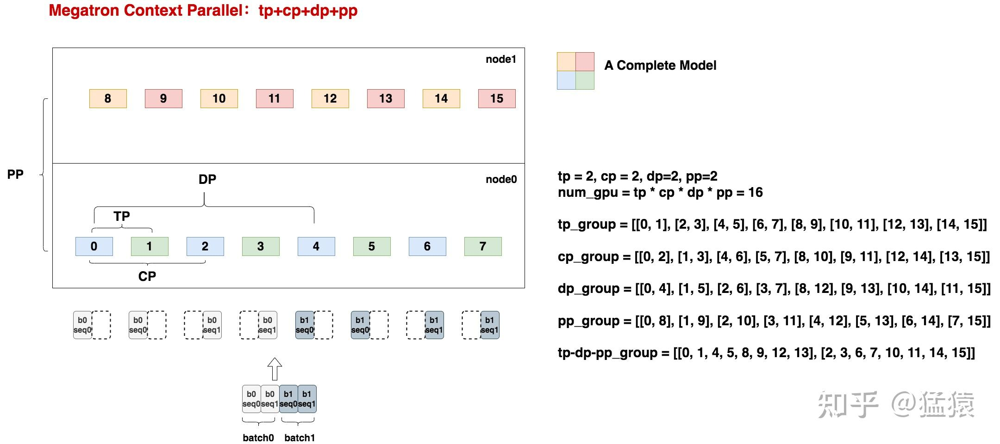
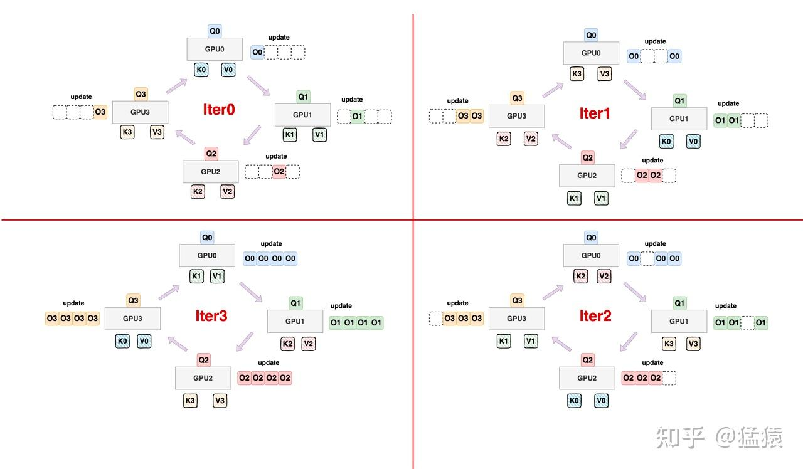
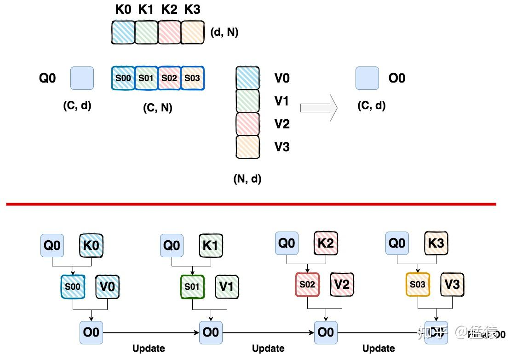
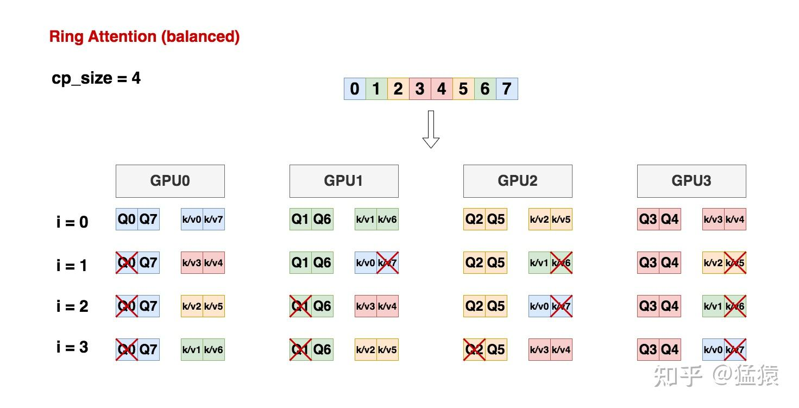
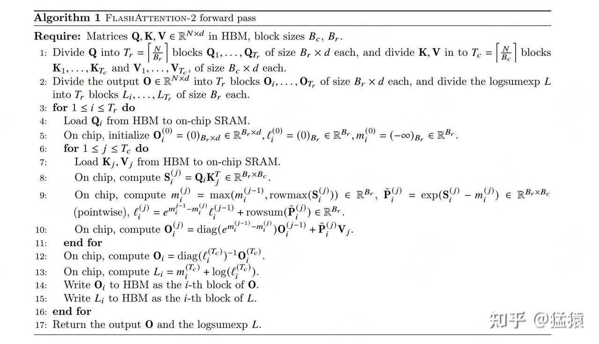
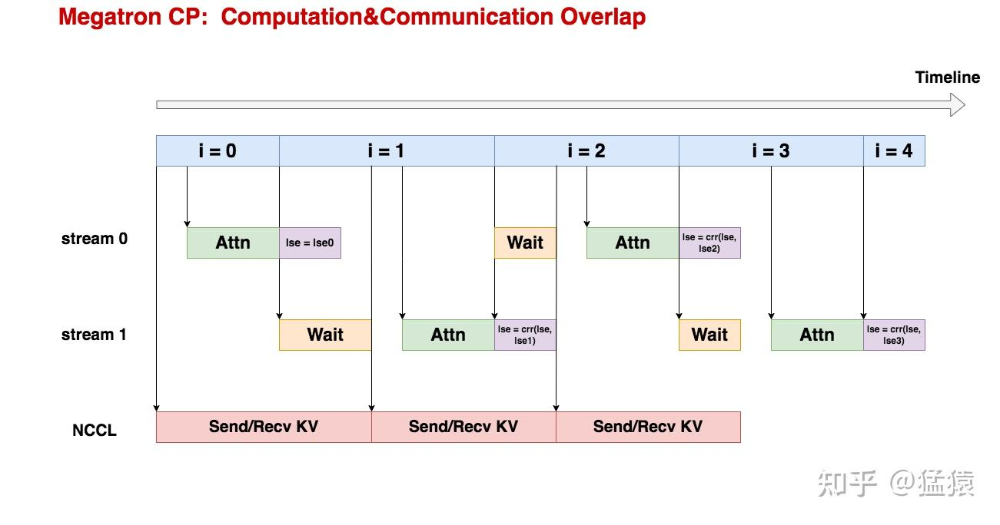

在序列并行系列中，我们将详细介绍下面四种常用的框架/方法：

1.  **[Megatron Sequence Parallelism](https://zhuanlan.zhihu.com/p/4083427292)**：本质是想通过降低单卡激活值大小的方式，尽可能多保存激活值，少做重计算，以此提升整体训练速度，一般和它家的tp配套使用。
2.  **[DeepSpeed Ulysses](https://zhuanlan.zhihu.com/p/4496065391)**：我们知道ds家的zero是模型并行的形式，数据并行的本质。在这个情况下，单张卡是完整地做一条序列的MHA过程的，序列长度较长时，就会对单卡显存产生压力。**所以Ulysses的解决办法是，让单张卡只算全部seq的某个/某些head的结果**，具体实践起来就是先通过按seq维度切割卡的输入，再通过all2all通讯来做。
3.  **[Ring Attention](https://zhuanlan.zhihu.com/p/4963530231)**：相当于分布式的Flash Attention V2（我个人的理解），**它最终的效果是让每张卡只算自己所维护的那部分seq\_chunk的MHA。**
4.  **Megatron Context Parallelism**：可以看成是增强版的sp，引入了类ring-attention的技术（在tp-pp-dp rank相同的位置做ring-attention），联合Megatron的各种混合并行方式进行训练。

今天，我们来讲最后一部分 **Megatron Context Parallelism，** 把它放在最后的原因是：

-   **Megatron cp可以看成是在保持megatron sp混合并行框架的基础上，引入cp维度的并行**。而cp并行的本质其实是做attention部分的优化。所以你可以把megatron sp混合并行理解成整体框架，cp理解成局部优化。
-   **Megatron cp在实践上和朴素的ring attention非常相似，但是它做了计算上的负载均衡处理**，我们在本文中会详细讲解这一点。
-   Megatron cp也有尝试做deepspeed ulysses + ring attention的结合，这一点也写在cp的核心逻辑中，但这不是本文讲解的重点。
-   **综合来看，本文要讲解的重点是megatron tp + cp + dp + pp的混合并行，同时重点关注纯cp部分的实践方法。**

关于megatron cp，算是一个比较新的还在持续发展的项目，目前官方没有给出具体的论文，只有一个很简短的[官网介绍](https://link.zhihu.com/?target=https%3A//docs.nvidia.com/megatron-core/developer-guide/latest/api-guide/context_parallel.html)，从官网介绍中我们可以大致理解上面说的“在保持megatron sp混合并行框架的基础上，引入cp维度并行”的大致含义。但是这篇文章真得太短了（苦笑），所以cp的细节只能从源码层面来解读。（然而，请让我再次吐槽一次 ，cp的实践横跨了megatron-lm和TranformerEngine两个仓库，代码真得写得太冗余、太杂、太混乱了...所以这真是一篇暗含泪水的解读）。

**虽然是从源码的阅读中推测出了cp的核心技术，但是本文不打算写成一篇源码解读的文章**。本文将把源码运作流程抽象成一张张具体的图例，来说明cp主要做了什么事，在每一节的最后配上相关的代码链接，大家可以配合着图例自行阅读。**如此一来，尽量让这篇文章变成纯原理式的文章，不让大家被冗长的代码分心。**

**【历史文章汇总】**

[https://zhuanlan.zhihu.com/p/654910335](https://zhuanlan.zhihu.com/p/654910335)

---

## 一、分布式环境初始化

首先，我们来看在引入cp的前提下，megatron是如何做混合并行的，具体情况如下：

-   **`tp = 2, cp = 2, dp = 2, pp = 2`**。那么有`num_gpu = tp * cp * dp * pp = 2*2*2*2 = 16`。也就是我们需要16张卡。假设我们的一台机器内有8张卡，则我们需要2台机器。
-   我们不考虑ep维度（即ep=1），因为本质上它不影响cp维度的并行（cp维度是对attention做优化，ep可以理解成是mlp层的操作）
-   **在考虑如何设置并行group时，我们采用的顺序是`tp-cp-ep-dp-pp`，我们认为越靠前的并行组，通讯量越大，所以尽量安排在一台机器内**。例如对于tp group，它的每一个sub-tp group关联的2张卡都位于同一台机器中。`tp-cp-ep-dp-pp`是megatron代码默认的顺序，我们当然可以根据实际情况做修改，但前提就是要考虑通讯量。
-   由于dp=2，所以我们假设有2个micro-batch，分别是batch0和batch1。由于cp=2，每个batch都被从seq维度上切成两份。

在这些前置条件下，我们绘制出了上面的分布式配置图片，我们以gpu0为例：

-   首先，对于一个模型，它沿着layer层被横向切成2份（pp=2），沿着权重被纵向切成2份（tp=2）。对应到我们的图里，就是4个不同颜色的色块组成一个完整的模型。
-   对于gpu0来说，\[0,1,8,9\]组成了一个mp group，拥有一个完整的模型
-   对于gpu0来说，\[0,1\]组成了tp组，这意味着0和1将吃相同的输入X，然后分别计算X的不同head的结果
-   对于gpu0来说，\[0,8\]组成了pp组，这意味着0和8之间会做层间激活值的传递
-   **对于gpu0来说，\[0,2\]组成了cp组，0和2上维护着相同的模型权重，但是分别维护着同一个batch的seq\_chunk0，seq\_chunk1**
-   对于gpu0来说，\[0,4\]组成了dp组，0和4上维护着相同的模型权重，但是分别维护着不同batch的seq\_chunk0。

**总结来看，引入megatron cp，其实就是：**

-   我们先假设不对输入X做任何序列维度的切分，这时我们就得到了原始的megatron tp-dp-pp组。
-   **现在引入cp，意味着我们要把输入X切分成cp\_size份，所以我们只需要把原始的tp-dp-pp组拷贝cp\_size份，就得到了最终的分布式配置。**
-   **所以我们在前文中才说，相同的tp-dp-pp rank位置就是新的cp组**。例如图中所展示的tp-dp-pp group中，0和2都是各自group内的local rank = 0的元素，所以他们组成一个的cp组；1和3都是各自group内local rank = 1的元素，所以他们组成一个cp组，以此类推。

**好，现在我们已经知道了如下内容：**

-   **cp组的设置方式**
-   **同一个cp\_group内的各张卡维护着：【相同的模型权重】、【相同batch的不同seq\_chunk】**
-   **一个cp组的最终目标是：通过类ring attention的方式，计算出自己所维护的这个seq\_chunk在自己所负责的这个head上的结果**。

所以接下来，我们马上来看计算细节。
分布式初始化的代码在[https://github.com/NVIDIA/Megatron-LM/blob/main/megatron/core/parallel\_state.py](https://link.zhihu.com/?target=https%3A//github.com/NVIDIA/Megatron-LM/blob/main/megatron/core/parallel_state.py)中，大家可以配合上述讲解自行阅读。

## 二、负载均衡的Ring Attention

### 2.1 朴素Ring Attention

如上图所示，我们在[ring attention篇](https://zhuanlan.zhihu.com/p/4963530231)中讲过一个朴素ring attention的运作流程：

-   每张卡上固定维护着某个seq\_chunk的Q
-   每张卡上轮转不同seq\_chunk的KV值
-   每张卡上，Q和当前轮转到的(K, V)数据做attention计算，然后通过类似Flash Attention V2的方式更新output（细节这里不赘述，大家可以去看上面链接中的文章）
-   当所有的KV值轮转完毕后，每张卡上就得到了最终的output。

例如以Q0为例，整个计算过程如下：

**但是，朴素ring attention存在一个较大的问题：计算负载不均衡**。
假设我们使用的是causal mask，也就是在attention计算对于某个token，它只和自己及之前的tokens做attn，而不关心后面的token。但是在当前ring attention的划分下：

-   对于gpu0，它维护着Q0，这也意味着后面流转过来的(K1, V1)(K2, V2)(K3, V3)都是位于它之后的tokens产出的结果，它根本不需要和它们做attn，这时gpu0的计算就被浪费了。
-   对于其余gpu也是同理。只有维护着最后一块Q分块的gpu3能在每次流转中都做好计算，没有浪费计算资源。
-   **这就是我们所说的，causal mask下朴素ring attention的计算负载不均问题。**

### 2.2 负载均衡版Ring Attention

在之前的[ring attention篇](https://zhuanlan.zhihu.com/p/4963530231)和[Flash Attention V1](https://zhuanlan.zhihu.com/p/669926191) / [Flash Attntion V2](https://zhuanlan.zhihu.com/p/691067658)中我们讲过，分块attention的计算其实是和计算顺序无关的，核心是 **只要每次计算时我们都能拿到当前分块的output，当前未做softmax前attention score矩阵的max和sum相关信息，我们就能正常更新最终的output。（如果对这句话不太理解，可以看下上面链接里给的文章，这里不再展开了）**

在理解了这一点的基础上，我们重新设计Ring Attention中每块卡上存放的seq\_chunk：

如上图所示，假设cp\_size = 4，也就是我们打算在4块gpu上做ring attention。

-   首先，对于原始输入数据X，我们将其切分为2\*cp\_size = 8块，也就是上图的0～7 chunk
-   \[0,7\]，\[1, 6\]，\[2, 5\], \[3, 4\]分别组成4个seq\_chunk，安放在gpu0~gpu3上。
-   则在ring attention下，每块gpu上计算cp\_size次后，就能得到最终的output。例如对于gpu0，计算4次后，就能得到\[0, 7\]这两个位置最终的attention结果。
-   图中接着展示了在不同的iteration中，每块卡上的计算情况，可以发现：

-   i = 0时，每张卡上都是4个小方块在做attn计算
-   i = 1/2/3时，每张卡上都是3个小方块在做attn计算
-   **总结来看，每个iteration中，各卡的计算量是相同的。不存在朴素ring attention上某些卡空转的情况。**

同时注意到，当i = 1/2/3时，总有Q或者KV块不参与计算，如果我们用rank表示这是cp\_group内的第几块gpu（例如rank=0就是上面cp\_group中的第0块gpu），**则对于某张卡，我们有如下规律**：

-   **`i = 0`，该卡上所有的QKV块参与计算**
-   **`i <= rank`时，该卡上第2个KV块不参与计算**
-   **`i > rank`时，该卡上第1个Q块不参与计算**

-   用于分配哪张卡上应该维护哪些Q块的代码在：[https://github.com/NVIDIA/Megatron-LM/blob/main/megatron/training/utils.py#L233](https://link.zhihu.com/?target=https%3A//github.com/NVIDIA/Megatron-LM/blob/main/megatron/training/utils.py%23L233)
-   用于处理实际QKV计算时应该保留哪些数据块，去掉哪些数据块的代码在：[https://github.com/NVIDIA/TransformerEngine/blob/main/transformer\_engine/pytorch/attention.py#L1901](https://link.zhihu.com/?target=https%3A//github.com/NVIDIA/TransformerEngine/blob/main/transformer_engine/pytorch/attention.py%23L1901)

大家可以自行阅读

## 三、计算和通讯的overlap

在ring attention中我们讲解过，对于一张卡，如果我们能让它在计算attn的同时，把自己的KV发送给下一张卡，同时从上一张卡中获取新的KV，**这样我们就能实现【计算】和【通讯】的并行，以此来掩盖通讯要带来的额外时间开销。**

具体到代码的时间上，我们可以创建不同的cuda流（`torch.cuda.Stream()`）来实现这一目标。对于cuda流的作用你可以简单理解成：**一个cuda流中可能包含若干串行的操作，而不同的cuda流是可以并行执行的。这样，我们就可以定义一个cuda流用于计算attn，再定义一个cuda流用于做通讯。**

**但在megatron cp中，其实一共包含3个cuda流**，我们来简单认识一下它们：

-   **NCCL stream**：定义在cp\_group内，是用于做KV发送和接收的cuda流
-   **Stream0和Stream1：** 都是用于做计算的cuda流，这两个流的作用是可以并行执行attn的计算和softmax\_lse的更新。
-   **也就是说，megatron cp中，除了对【计算】和【通讯】做了并行，还对计算中的【attn】和【softmax\_lse更新】做了并行。**

【计算】和【通讯】的并行好理解，我们现在来快速解释下【attn】和【softmax\_lse更新】的并行是什么意思。
在之前的系列中，我们已经讲过ring attention更新output的方式非常近似于Flash Attention V2，所以我们贴出Flash Attention V2的fwd过程，来看下output是如何更新的：

-   图中第10行展示了每次output的更新过程
-   图中第12行是，对于一块Q，当我们轮转了所有的(K, V)后，我们使用第12行的公式对output再做一次性的更新，这才得到了这块Q最终的output。而第12行的结果，就是我们说的softmax\_lse。
-   **但是，另一种做法是，我们可以把第12行的结果放进第10行做**，**也就是对于一块Q，每轮转1次(K,V)，计算attn时，我们就可以这次轮转算出的attn score矩阵算出max和sum，进而更新softmax\_lse，然后用于更新本次轮转的output，这就是ring attention采用的做法**，目的应该是尽量减少精度损失。至于FA2中为什么把第10行和第12行拆开做，本质是为了减少非矩阵乘法的计算量，以此提升计算速度（之前的文章讲过，这里不再赘述。）
-   **所以，对于ring attention，总结来看它的每次计算都分成两块：**

-   **【attn：算出本次轮转的output】**
-   **【softmax\_lse更新：基于本次轮转的结果更新softmax\_lse，用于修正output】**

现在我们已经基本了解【attn】和【softmax\_lse更新】的定义了，那么现在我们就直接来看megatron cp中这3个cuda流的运行过程，然后来解释什么叫【attn】和【softmax\_lse更新】的并行：

上图刻画了在cp\_size = 4的情况下，某张卡上的流转过程，具体而言：

-   `i = 0`时

-   切换到stream0上开始执行
-   在stream0上开启发送/接收KV数据的流程，而这个流程则实际由NCCL stream开始执行
-   在stream0上做attn计算。attn计算结束后，会得到output和softmax\_lse0。由于这是i=0阶段，所以我们不用做softmax\_lse的更新
-   **我们要注意区分“算出softmax\_lse\_i"和“更新softmax\_lse”的区别**。

-   `i = 1`时：

-   同时开启stream0和stream1流程
-   在stream0流程中，我们令`softmax_lse = softmax_lse0`，这时我们先不做任何softmax\_lse的更新。
-   在stream1流程中：

-   我们需要等待（wait）本次计算需要的KV值到位，这里我特意假设计算无法完美覆盖通讯，所以我们多了等待时间。
-   等数据到位后，我们就开启新的发送/接收KV数据的流程，这个这个流程则实际由NCCL stream执行。
-   接着我们正常做attn计算，得到本次的output和softmax\_lse1。

-   **不难发现，此时我们在stream0和stream1中已经实现了【attn】和【softmax\_lse更新】的并行，只是这里不是严格的softmax\_lse更新**

-   `i= 2`时：

-   同时开启stream0和stream1流程。
-   在stream1流程中，我们开始做真正意义上的【softmax\_lse更新】，即`softmax_lse = correction(softmax_lse, softmax_lse1)`
-   在stream0流程中，我们做【attn】计算，得到新的output和softmax\_lse2。同时开启NCCL stream做数据发送

-   `i = 3`时：

-   同时开启stream0和stream1流程。
-   在stream0流程中，我们做【softmax\_lse更新】，即`softmax_lse = correction(softmax_lse, softmax_lse2)`
-   在stream1流程中，我们做【attn】计算，得到新的output和softmax\_lse3。此时我们已经无需再做数据通讯了，因为这是最后一轮流转。

-   `i = 4`时：

-   只需要启动stream1，做最后一次【softmax\_lse更新】，即`softmax_lse = correction(softmax_lse, softmax_lse3)`即可。

**这张通讯图我们还做了一些简化，例如当我们每次做【softmax\_lse更新】时，我们都需要保证上一次更新的结果已经计算完毕，所以这里可能也是需要做wait的，为了表达简便，这边略去。**

本节以及整个cp核心代码在[https://github.com/NVIDIA/TransformerEngine/blob/main/transformer\_engine/pytorch/attention.py#L1867](https://link.zhihu.com/?target=https%3A//github.com/NVIDIA/TransformerEngine/blob/main/transformer_engine/pytorch/attention.py%23L1867)中，大家可以配合上面的图例更好阅读代码。

---

**【大模型预训练系列】**
-   **[猛猿：图解大模型训练之：流水线并行（Pipeline Parallelism），以Gpipe为例](https://zhuanlan.zhihu.com/p/613196255)**
-   **[猛猿：图解大模型训练之：数据并行上篇(DP, DDP与ZeRO)](https://zhuanlan.zhihu.com/p/617133971)**
-   **[猛猿：图解大模型训练之：数据并行下篇(ZeRO，零冗余优化)](https://zhuanlan.zhihu.com/p/618865052)**
-   **[猛猿：图解大模型系列之：张量模型并行，Megatron-LM](https://zhuanlan.zhihu.com/p/622212228)**
-   **[猛猿：图解大模型系列之：Megatron源码解读1，分布式环境初始化](https://zhuanlan.zhihu.com/p/629121480)**
-   **[猛猿：图解大模型训练之：Megatron源码解读2，模型并行](https://zhuanlan.zhihu.com/p/634377071)**
-   **[猛猿：图解大模型训练系列之：Megatron源码解读3，分布式混合精度训练](https://zhuanlan.zhihu.com/p/662700424)**
-   **[猛猿：图解大模型训练系列之：DeepSpeed-Megatron MoE并行训练（原理篇）](https://zhuanlan.zhihu.com/p/681154742)**
-   **[猛猿：图解大模型训练系列之：DeepSpeed-Megatron MoE并行训练（源码解读篇）](https://zhuanlan.zhihu.com/p/681692152)**
-   **[猛猿：图解大模型训练系列：序列并行1，Megatron SP](https://zhuanlan.zhihu.com/p/4083427292)**
-   **[猛猿：图解大模型训练系列：序列并行2，DeepSpeed Ulysses](https://zhuanlan.zhihu.com/p/4496065391)**
-   **[猛猿：图解大模型训练系列：序列并行3，Ring Attention](https://zhuanlan.zhihu.com/p/4963530231)**
-   **[猛猿：图解大模型训练系列：序列并行4，Megatron Context Parallel](https://zhuanlan.zhihu.com/p/5502876106)**
