这篇文章想来探索Megatron中实现计算通信overlap的方法。

**具体来说，Megatron的dp、tp和pp部分，都有可以做overlap的地方，本文探索的是tp部分（更准确地说是megatron sp-tp）。做这个探索的主要目的是：了解在哪些位置有做overlap的潜能，以及当前一些可行的实现思路。**

最后，特别感谢overlap大师，megatron特级学者：[浴火而王](https://www.zhihu.com/people/yu-huo-er-wang) 为本文提供的各类参考资料。

**【历史文章汇总】**

[https://zhuanlan.zhihu.com/p/654910335](https://zhuanlan.zhihu.com/p/654910335)

## 一、TP中哪些地方做了overlap

我们说的tp，是指“开启megatron sp做了activation显存优化”的tp，下图绘制了在megatron sp中单卡上Attn + MLP的运作流程（更多详细解读请参见[这里](https://zhuanlan.zhihu.com/p/4083427292)）

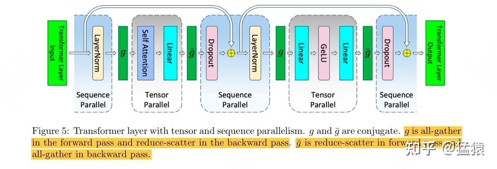

由此我们知道，在megatron sp中，tp部分的通讯被拆成若干个`all-gather`和`reduce-scatter`，在下文中我们会用`AG`和`RS`来简称它。**现在我们对tp中的fwd和bwd过程再做一个重新绘制，更清晰地展示通信步骤（绿色）和计算步骤（蓝色）：**

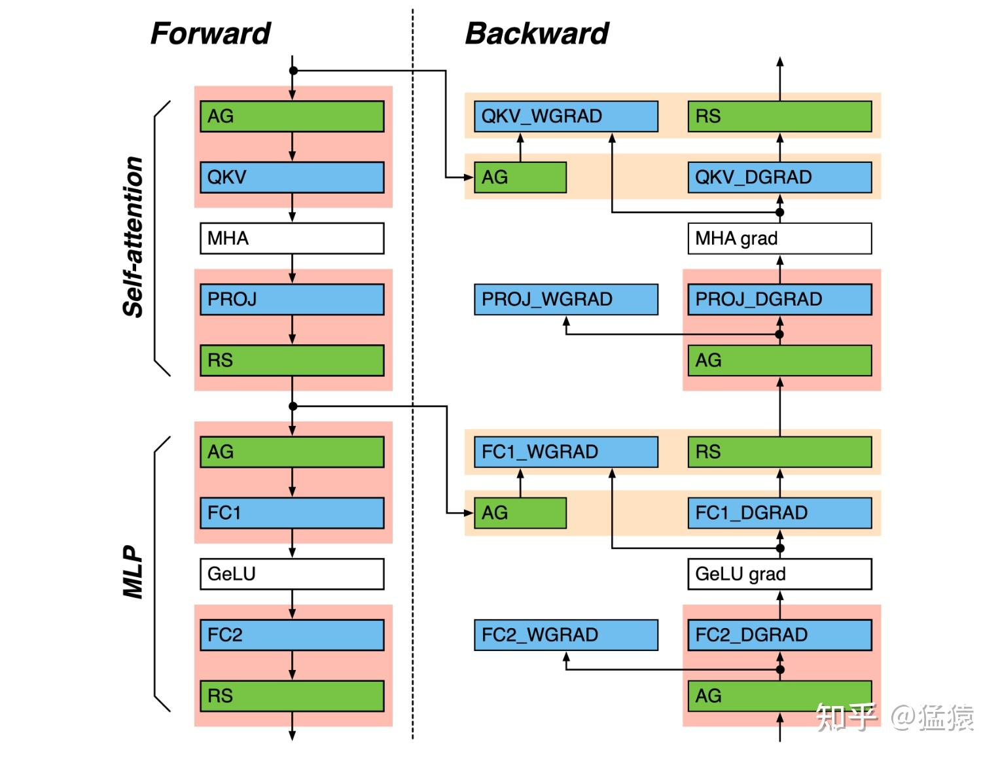

**图中的红/黄框则分别展示了计算和通信之间的依赖关系，具体来说：**

-   红色：通信和相关的计算有依赖关系，需要串行。但是可以通过优化使得计算通信能overlap。
-   黄色：通信和相关的计算没有依赖关系，可以并行。dgrad表示算的是input grad；wgrad表示算的是weight grad。

**在Megatron-LM中，以下参数将控制是否开启红/黄框中的计算通信overlap:**

-   `tp_comm_overlap_ag`：开启红框中ag相关的overlap
-   `tp_comm_overlap_rs`：开启红框中rs相关的overlap
-   `tp_comm_bulk_dgrad`：开启黄框中dgrad + ag的overlap
-   `tp_comm_bulk_wgrad`：开启黄框中wgrad + ag的overlap
-   `tp_comm_overlap_rs_dgrad`：黄框中的dgrad计算出来后会做rs，这里控制的就是这两者间的overlap。需要注意的是，如果此项为True，则会关闭 tp\_comm\_bulk\_dgrad 和 tp\_comm\_bulk\_wgrad（参见[代码](https://link.zhihu.com/?target=https%3A//github.com/NVIDIA/TransformerEngine/blob/838345eba4fdd2a169dd9e087d39c30a360e684a/transformer_engine/pytorch/module/layernorm_mlp.py%23L592)），猜测可能是因为同时开启时，存在对缓冲区资源的竞争及复杂管理等问题，会造成整体性能下降。
-   `tp_comm_overlap`：应该是一个总开关。只有当它为True时，才可以根据需要自动开关以上5项。否则是不开启tp部分的计算通讯overlap的（参考这份[代码](https://link.zhihu.com/?target=https%3A//github.com/NVIDIA/Megatron-LM/blob/076972e37420b5325c5fe06e7131be7d96f05b53/megatron/core/extensions/transformer_engine.py)）

我们在Megatron-LM中设置这些参数，进而更改Transformer Engine（以下简称TE）的相关配置，最终的overlap是在TE中实现的。下面我们就来详细介绍这几个overlap技术。

## 二、tp\_comm\_overlap\_ag

我们以下图圈出来的部分为例：

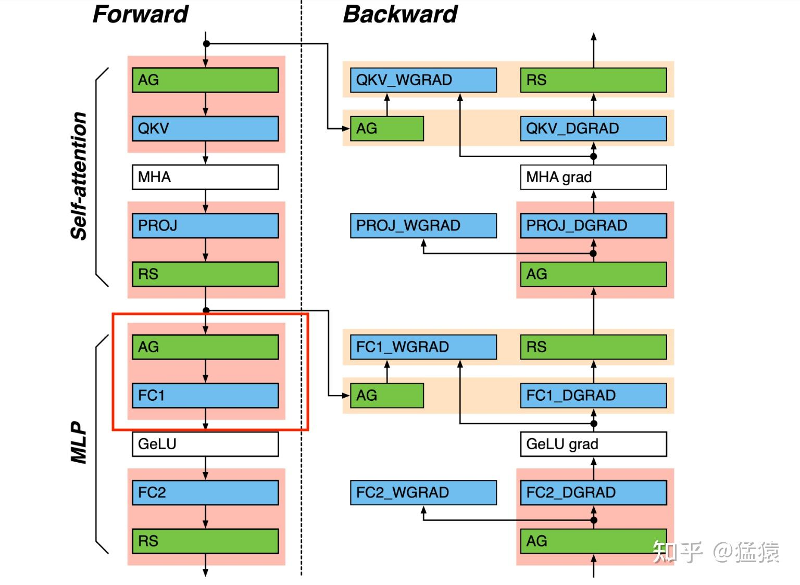

### 2.1 朴素all-gather

假设我们采取的是最朴素的，没有任何overlap的策略，那么红框中的计算流程应该是下图这样的，这里假设tp\_size = 2：

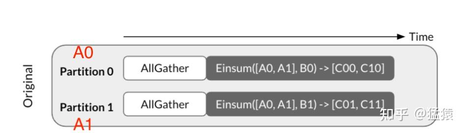

如上图所示，我们有2张gpu（tp\_szie = 2）：

-   在all-gather开始前，gpu0上存储着输入A0和模型分块B0，gpu1上存储着输入A1和模型分块B1。这里的B就对应着上图中的fc1。
-   在朴素的all-gather中，我们先对输入A矩阵做all-gather，之后两张卡上的数据都变成\[A0, A1\]
-   然后再各自个和B矩阵（fc1）相乘，得到最终的结果。

不难发现，这里我们需要先等输入数据A到齐，然后才可以开始计算，也就是没有实现任何的计算通信overlap。

**针对这张图，我们额外说明一点：例如\[A0, A1\]这样的形式，不代表A一定就是按照列切割的，只代表我们以分块的视角看待A。而Enisum可理解为一种自适应式的矩阵乘。因此我们要根据实际应用的场景来理解这张图，后文同理。**

### 2.2 all-gather overlap p2p

现在我们引入计算通信overlap，流程如下图所示：

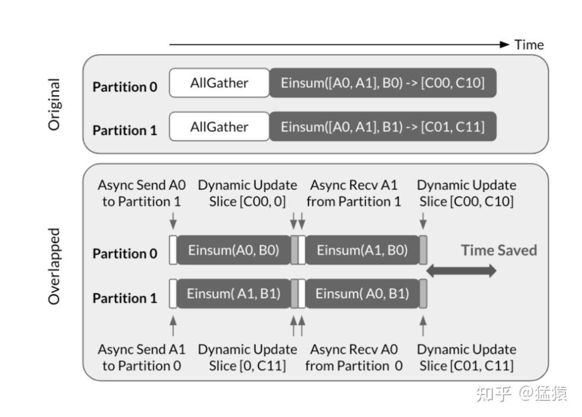

-   在最开始阶段，gpu0上存放着输入A0和模型分块B0，gpu1上存放着输入A1和模型分块B1。
-   现在开始操作：

-   在gpu0上，我们先把A0发送到gpu1，于此同时开始做gemm(A0, B0)，以便得到C00，实现计算通讯overlap
-   在gpu1上，我们先把A1发送到gpu0，于此同时开始做gemm(A1, B1)，以便得到C11，实现计算通讯overlap
-   等gpu0计算完C00，并收到A1后，它就可以继续gemm(A1, B0)，以便得到C10；gpu1也是同理

-   **在overlap下，我们无需等到输入数据all-gather到齐后再进行计算，这样就可以减少整体的运行时间。**

以上展示了2卡情况下的all-gather overlap，在多卡情况下也是同理，整体流程如下图所示：

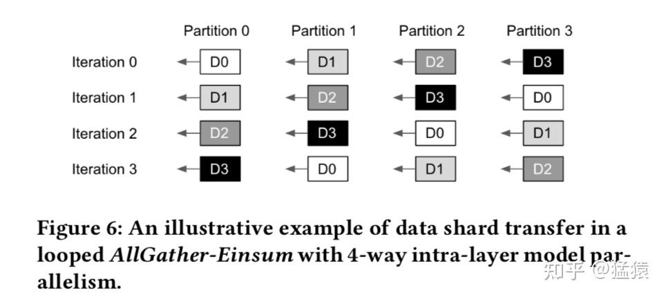

-   partition即为卡，iteration则为每轮迭代，每轮迭代里包含了计算-通信的overlap。partition中的Di表示目前正在使用哪块输入做计算。
-   **从图中我们可以发现，这里采取的是`p2p ring exchange`的方式，也就是每张卡只和自己相邻的2张卡做数据的收-发。**
-   例如，在iteration0上时，每张卡做计算时，都用自己维护的那份数据做计算，所以这里Di和partition\_i的下标是一一对应的。同时，每张卡会和相邻的2张卡做数据收发。例如partition2会把自己的数据D2发送给partition1，并从partition3上接受D3。
-   再如，在iteration1上时，partition2就用自己收到的D3做计算了，同时它准备把D3发送给partition1，并从partition3上接收D0。以此类推。

相关的代码实践在TE仓库的[CommOverlapP2PBase类下](https://link.zhihu.com/?target=https%3A//github.com/NVIDIA/TransformerEngine/blob/c9ea6be92948e1ec553037f1a04900617b9f7f6b/transformer_engine/common/comm_gemm_overlap/comm_gemm_overlap.cpp%23L561)，大家可以自行阅读。注意代码里的A=weight, B=input，后文也是同理。

## 三、tp\_comm\_overlap\_rs

我们以下图圈出来的部分为例：

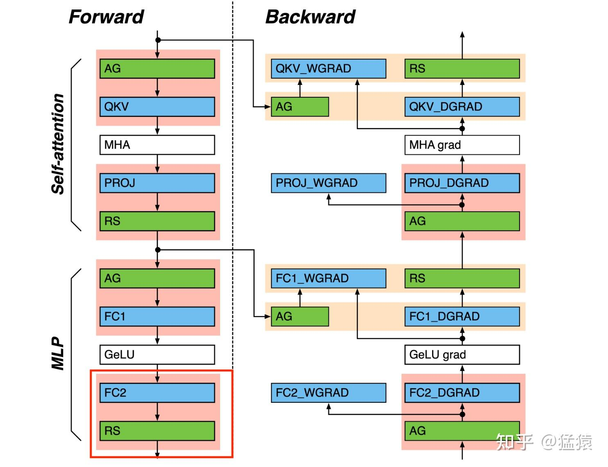

（备注：`tp_comm_overlap_rs_dgrad`，也就是右侧bwd中fc1\_dgrad和下一个黄框中的RS做overlap的本质也是如此，所以后文不会再单独介绍它了）

### 3.1 朴素reduce-scatter

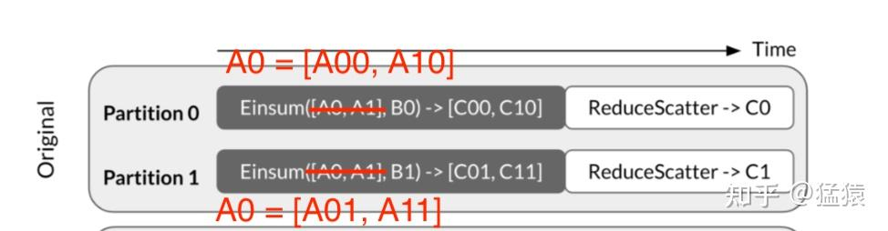

假设我们有2张gpu（tp\_size = 2）

-   B0和B1即为fc2，也就是按行切割的模型权重
-   A0和A1理解成fc2的输入。这里A0 = \[A00, A10\]，A1 = \[A10, A11\]
-   我们需要对B矩阵（fc2）的输出结果做reduce-scatter，而两张卡上的这个输出结果分别为C0 = \[C00, C10\], C1 = \[C01, C11\]。
-   不难知道，做完reduce-scatter后：

-   gpu0上，C0 = C00 + C01
-   gpu1上，C1 = C10 + C11

-   同样，在朴素reduce-scatter中，我们也需要等到\[C00, C10\]和\[C01, C11\]这个结果计算出来后，再做reduce-scatter，即计算通信没有overlap

**针对这张图，我们额外说明一点：之所以要修改原始图片中的\[A0, A1\]，是因为在tp mlp的fc2中，每张卡上的输入是不一样的，所以这里特别针对这个场景做了修改。**

### 3.2 reduce-scatter overlap p2p

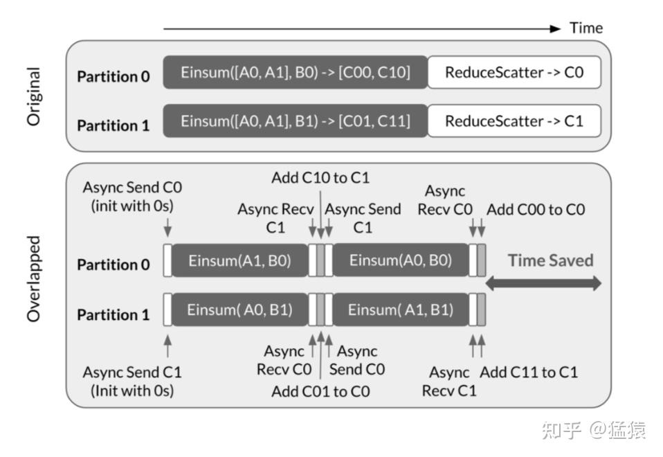

上图直接理解起来可能会有点头晕，我们不妨从一个更形象的视角理解一下：

-   还是和all-gather overlap一样，这里采用的是p2p ring exchange的通信方式。
-   **在初始阶段，每个 gpu\_i 都会发送出一个“碗C\_i”，这个“碗C\_i”的意思是，请把和我（gpu\_i）相关的计算结果装在这个碗里。**
-   **那么接下来，哪个gpu接收到这个碗C\_i，它就要负责计算和这个 C\_i 相关的结果，并把结果更新在 C\_i里**
-   **假设我们共有 n 块gpu，那么 n-1 轮后，C\_i又流转回 gpu\_i 手里，这时轮到gpu\_i做和C\_i相关的计算，这次计算结束后，就得到了最终的C\_i**

基于此解读以上2卡的情况就不难了。那我们顺水推舟到多卡的情况：

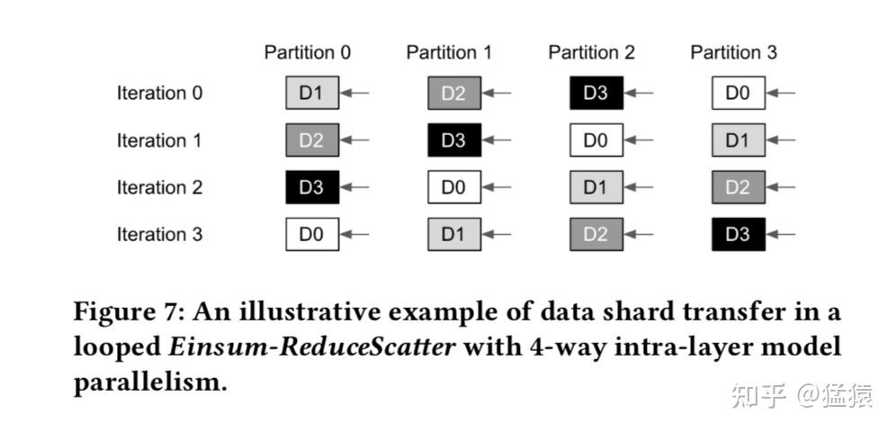

-   在iteration0里，由于p2p ring exchange机制的影响：

-   对于partition0，它接收到来自partition1的碗C1，所以它只能做和C1相关的计算，也就是利用D1进行计算，然后把计算结果更新到C1中。
-   其余partition也是同理

-   在iteration1里：

-   对于partition0，此时它接收的是来自partition1的碗C2（因为在上一次迭代中，partition1就是接收的partition2的C2，所以现在继续击鼓传花式地传递），因此partition0只能做C2相关的计算，也就是利用D2来计算。
-   其余partition也是同理。

-   在iteration3里：

-   对于partition0，它终于接到了在iteration0里它传出去的碗C0，此时C0已经装满了其余partition上和partiton0相关的计算结果了，现在只要partition0把自己的这份结果更新进去，就大功告成了。

相关的代码实践可以参考[这里](https://link.zhihu.com/?target=https%3A//github.com/NVIDIA/TransformerEngine/blob/c9ea6be92948e1ec553037f1a04900617b9f7f6b/transformer_engine/common/comm_gemm_overlap/comm_gemm_overlap.cpp%23L924)。注意代码里的A=weight, B=input。这个过程理解起来有点绕，大家可以多体会

### 3.3 reduce-scatter overlap pipeline chunk

对于像fc2这种需要对输出结果做reduce-scatter的情况，**除了p2p形式的overlap，megatron还提供了另外一种overlap的方法：pipeline chunk**。

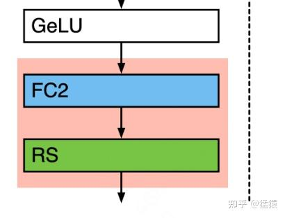

Pipeline chunk的思想是：假设原来是做完gemm(A, B)后再对结果reduce-scatter，那么现在我可以把矩阵（比如A）拆分成若干chunk，每次等gemm(chunk\_i, B)的结果出来后，把这个结果发出去做reduce-scatter的同时，再继续做下一个chunk的计算，以此实现overlap。当然chunk的数量也不能太多（也就是不能把矩阵切得太小），否则反而会降低整体性能。在代码中默认chunk数量 = 4 （\_num\_splits = 4）。

代码详情可以参见[这里](https://link.zhihu.com/?target=https%3A//github.com/NVIDIA/TransformerEngine/blob/c9ea6be92948e1ec553037f1a04900617b9f7f6b/transformer_engine/common/comm_gemm_overlap/comm_gemm_overlap.cpp%23L324)。

## 四、 tp\_comm\_bulk\_ag 和 tp\_comm\_bulk\_rs

我们先来看下面框中 fc1\_dgrad 和 AG的overlap

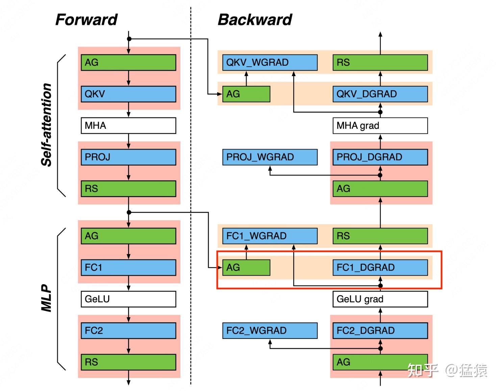

这个过程对应到megatron sp的的架构图里如下：

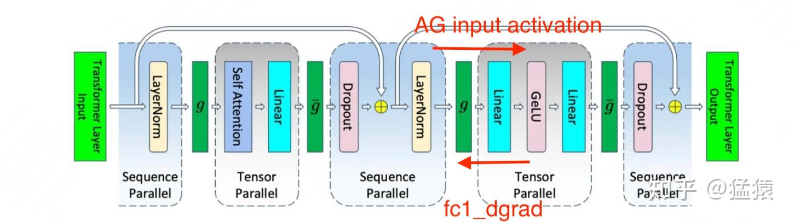

之所以 fc1\_dgrad和 AG 可以并行操作，是因为当前进程上做 fc1\_dgrad只依赖上层传导过来的链式结果和fc1\_weight。但是计算 fc1\_wgrad却要依赖 AG 后的完整data（input activation）。fc1\_dgrad 和 fc1\_wgrad 计算完毕之后，前者做 RS 后继续向下层传导，后者用于更新 fc1\_weight。

在[代码](https://link.zhihu.com/?target=https%3A//github.com/NVIDIA/TransformerEngine/blob/c9ea6be92948e1ec553037f1a04900617b9f7f6b/transformer_engine/common/comm_gemm_overlap/comm_gemm_overlap.cpp%23L171)中，管黄框中的overlap叫 **bulk overlap**，**并通过设置主流(stream\_main)和通信流(stream\_comm)来实现这个overlap**，我们直接来看代码细节：

```cpp
/*
** Bulk GEMM + COMM
** This function assumes the communication input is pre-copied to _ubuf
*/
void CommOverlapBase::bulk_overlap(TensorWrapper &A, bool transa, TensorWrapper &B, bool transb,
                                   TensorWrapper &D, TensorWrapper &bias,
                                   TensorWrapper &pre_gelu_out, TensorWrapper &workspace, bool grad,
                                   bool accumulate, bool use_split_accumulator,
                                   CommOverlapType comm_type, TensorWrapper &rs_output,
                                   cudaStream_t stream_main) {
  // 设置通信的上下文参数_ub_comm
  int ori_sms = _ub_comm->sms;
  _ub_comm->use_ce = _use_ce;
  _ub_comm->sms = _num_comm_sm;
  _ub_comm->cga_size = _cga_size;

  // Catch up the default torch stream
  // 同步主流(用以计算，stream_main)和通信流（用以通信，_stream_comm）
  NVTE_CHECK_CUDA(cudaEventRecord(_start_comm, stream_main)); // 在主流中记录事件_start_comm
  NVTE_CHECK_CUDA(cudaStreamWaitEvent(_stream_comm, _start_comm, 0));// 让通信流等待该时间完成，这样可以确保通信流在正确时间启动

  // Communication: AG and RS
  // 通信流执行通信：根据入参comm_type选择不同的通信类型（AG或RS）
  int comm_elements = (_ubuf.numel() / 2) * _ubuf.element_size();  // UBUF uses 2Byte element size
  if (comm_type == CommOverlapType::AG) {
    allgather2_userbuff_inplace(_ub_reg, 0, comm_elements, _ub_comm, _stream_comm,
                                (cudaEvent_t)_comm_launch_event);
  } else {
    if (_ubuf.element_size() == 1) {
      assert(_ubuf_scale_inv_initialized);
      comm_elements *= 2;
      assert(rs_output.numel() == _ubuf.numel() / _tp_size);
      assert(rs_output.size(0) == _ubuf.size(0) / _tp_size);
      assert(rs_output.element_size() == 2);
      char *rs_output_ptr = reinterpret_cast<char *>(rs_output.dptr());
      reducescatter2_userbuff_fp8<__nv_fp8_e5m2>(rs_output_ptr, _ubuf_scale_inv, _ub_reg, 0,
                                                 comm_elements, _ub_comm, _stream_comm,
                                                 (cudaEvent_t)_comm_launch_event);
    } else {
      reducescatter2_userbuff_inplace(_ub_reg, 0, comm_elements, _ub_comm, _stream_comm,
                                      (cudaEvent_t)_comm_launch_event);
    }
  }

  //  主流执行gemm计算：
  assert(pre_gelu_out.numel() == 0);
  // When the kernel launch order is defined, enforce the GEMM kernel launch to wait for the communication kernel launch
  if (_comm_launch_event)
    NVTE_CHECK_CUDA(cudaStreamWaitEvent((cudaStream_t)stream_main, _comm_launch_event, 0));
  nvte_cublas_gemm(A.data(), B.data(), D.data(), bias.data(), pre_gelu_out.data(), transa, transb,
                   grad, workspace.data(), accumulate, use_split_accumulator, _math_sms,
                   stream_main);

  // 让主流等待通信流完成，这样接下来才可以继续做后续的计算流程
  _ub_comm->sms = ori_sms;
  NVTE_CHECK_CUDA(cudaEventRecord(_stop_comm, _stream_comm));
  NVTE_CHECK_CUDA(cudaStreamWaitEvent(stream_main, _stop_comm, 0));
}  // CommOverlapBase::bulk_overlap
```

fc1\_wgrad 和 RS 的overlap也是用这个函数实现的，这里不再赘述。

## 五、小结

本文第一节中，展示了在megatron sp-tp中，一个decoder layer做fwd和bwd时需要做的计算与通信，其中：

**对于红框部分，理论上计算和通信是有串行依赖的关系，但是可以通过一些优化办法做成overlap**。具体来说TE实现了以下2种办法，它们本质上都是通过把计算拆分成更小的若干算子，从而实现边算边通信的目的：

-   **串行场景下的overlap方法一：p2p ring exchange，参见2.1(2), 2.2(2)**
-   **串行场景下的overlap方法二：pipeline chunk，参见2.2(3)**

**对于黄框部分，理论上计算和通信没有依赖关系，所以天然可以做成overlap**。TE提供了一种bulk overlap的方法，通过设置计算流和通信流，完成两者间的交叠：

-   **并行场景下的overlap方法：bulk overlap，参见第四节**

## 六、参考

1. [https://docs.nvidia.com/nemo-framework/user-guide/latest/nemotoolkit/features/optimizations/communication\_overlap.html](https://link.zhihu.com/?target=https%3A//docs.nvidia.com/nemo-framework/user-guide/latest/nemotoolkit/features/optimizations/communication_overlap.html)
2. [https://dl.acm.org/doi/10.1145/3567955.3567959](https://link.zhihu.com/?target=https%3A//dl.acm.org/doi/10.1145/3567955.3567959)
3. [https://github.com/NVIDIA/TransformerEngine](https://link.zhihu.com/?target=https%3A//github.com/NVIDIA/TransformerEngine)
4. [https://github.com/NVIDIA/Megatron-LM](https://link.zhihu.com/?target=https%3A//github.com/NVIDIA/Megatron-LM)
