【本文是图解大模型训练第2篇，持续更新中，欢迎关注】：

[猛猿：图解大模型训练之：流水线并行（Pipeline Parallelism），以Gpipe为例](https://zhuanlan.zhihu.com/p/613196255)

[猛猿：图解大模型训练之：数据并行上篇(DP, DDP与ZeRO)](https://zhuanlan.zhihu.com/p/617133971)

[猛猿：图解大模型训练之：数据并行下篇(ZeRO，零冗余优化)](https://zhuanlan.zhihu.com/p/618865052)

[猛猿：图解大模型系列之：张量模型并行，Megatron-LM](https://zhuanlan.zhihu.com/p/622212228)

[猛猿：图解大模型系列之：Megatron源码解读1，分布式环境初始化](https://zhuanlan.zhihu.com/p/629121480)

[猛猿：图解大模型训练之：Megatron源码解读2，模型并行](https://zhuanlan.zhihu.com/p/634377071)

【ChatGPT算法解析系列，可见】

[猛猿：ChatGPT技术解析系列之：训练框架InstructGPT](https://zhuanlan.zhihu.com/p/605516116)

[猛猿：ChatGPT技术解析系列之：GPT1、GPT2与GPT3](https://zhuanlan.zhihu.com/p/609367098)

[猛猿：ChatGPT技术解析系列之：赋予GPT写代码能力的Codex](https://zhuanlan.zhihu.com/p/611313567)

---

在上一篇的介绍中，我们介绍了以Google GPipe为代表的流水线并行范式。当模型太大，一块GPU放不下时，流水线并行将模型的不同层放到不同的GPU上，通过切割mini-batch实现对训练数据的流水线处理，提升GPU计算通讯比。同时通过re-materialization机制降低显存消耗。
但在实际应用中，流水线并行并不特别流行，主要原因是模型能否均匀切割，影响了整体计算效率，这就需要算法工程师做手调。**因此，今天我们来介绍一种应用最广泛，最易于理解的并行范式：数据并行。**
数据并行的核心思想是：**在各个GPU上都拷贝一份完整模型，各自吃一份数据，算一份梯度，最后对梯度进行累加来更新整体模型**。理念不复杂，但到了大模型场景，**巨大的存储和GPU间的通讯量，** 就是系统设计要考虑的重点了。在本文中，我们将递进介绍三种主流数据并行的实现方式：

-   **DP（Data Parallelism）**：最早的数据并行模式，一般采用参数服务器(Parameters Server)这一编程框架。实际中多用于单机多卡
-   **DDP（Distributed Data Parallelism）**：分布式数据并行，采用Ring AllReduce的通讯方式，实际中多用于多机场景
-   **ZeRO：** 零冗余优化器。由微软推出并应用于其DeepSpeed框架中。严格来讲ZeRO采用数据并行+张量并行的方式，旨在降低存储。

**本文将首先介绍DP和DDP，在下一篇文章里，介绍ZeRO**。
**本文是大模型训练系列的第二篇，持续更新中，推荐阅读：**

[猛猿：图解大模型训练之：流水线并行（Pipeline Parallelism），以Gpipe为例](https://zhuanlan.zhihu.com/p/613196255)

## 一、数据并行（DP）

### 1.1 整体架构

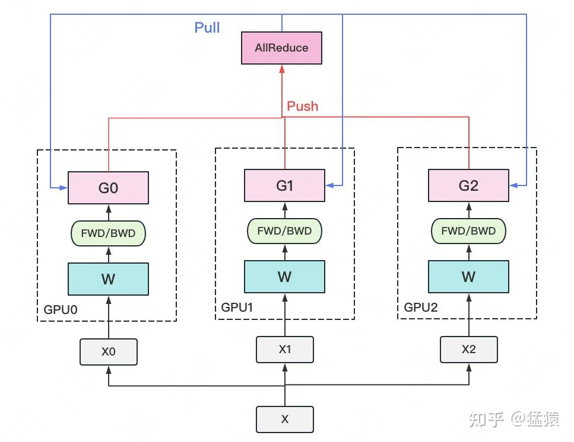

一个经典数据并行的过程如下：

-   若干块 **计算GPU**，如图中GPU0~GPU2；1块 **梯度收集GPU**，如图中AllReduce操作所在GPU。
-   在每块计算GPU上都拷贝一份完整的模型参数。
-   把一份数据X（例如一个batch）均匀分给不同的计算GPU。
-   每块计算GPU做一轮FWD和BWD后，算得一份梯度G。
-   每块计算GPU将自己的梯度 **push** 给梯度收集GPU，做聚合操作。这里的聚合操作一般指 **梯度累加**。当然也支持用户自定义。
-   梯度收集GPU聚合完毕后，计算GPU从它那 **pull** 下完整的梯度结果，用于更新模型参数W。更新完毕后，计算GPU上的模型参数依然保持一致。
-   **聚合再下发梯度的操作，称为AllReduce**。

前文说过，实现DP的一种经典编程框架叫“参数服务器”，在这个框架里，**计算GPU称为Worker**，**梯度聚合GPU称为Server。** 在实际应用中，为了尽量减少通讯量，一般可选择一个Worker同时作为Server。比如可把梯度全发到GPU0上做聚合。需要再额外说明几点：

-   1个Worker或者Server下可以不止1块GPU。
-   Server可以只做梯度聚合，也可以梯度聚合+全量参数更新一起做

在参数服务器的语言体系下，DP的过程又可以被描述下图：

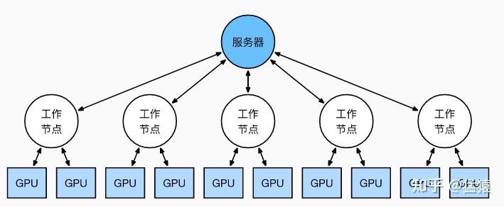

### 1.2 通讯瓶颈与梯度异步更新

DP的框架理解起来不难，但实战中确有两个主要问题：

-   **存储开销大**。每块GPU上都存了一份完整的模型，造成冗余。关于这一点的优化，我们将在后文ZeRO部分做讲解。
-   **通讯开销大**。Server需要和每一个Worker进行梯度传输。当Server和Worker不在一台机器上时，Server的带宽将会成为整个系统的计算效率瓶颈。

我们对通讯开销再做详细说明。如果将传输比作一条马路，带宽就是马路的宽度，它决定每次并排行驶的数据量。例如带宽是100G/s，但每秒却推给Server 1000G的数据，消化肯定需要时间。那么当Server在搬运数据，计算梯度的时候，Worker们在干嘛呢？当然是在：

人类老板不愿意了：“打工系统里不允许有串行存在的任务！”，于是 **梯度异步更新** 这一管理层略诞生了。

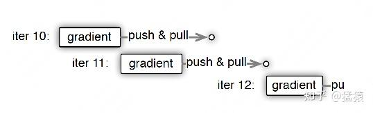

上图刻画了在 **梯度异步更新** 的场景下，某个Worker的计算顺序为：

-   在第10轮计算中，该Worker正常计算梯度，并向Server发送push&pull梯度请求。
-   但是，该Worker并不会实际等到把聚合梯度拿回来，更新完参数W后再做计算。而是直接拿旧的W，吃新的数据，继续第11轮的计算。**这样就保证在通讯的时间里，Worker也在马不停蹄做计算，提升计算通讯比。**
-   当然，异步也不能太过份。只计算梯度，不更新权重，那模型就无法收敛。图中刻画的是 **延迟为1** 的异步更新，也就是在开始第12轮对的计算时，必须保证W已经用第10、11轮的梯度做完2次更新了。

参数服务器的框架下，延迟的步数也可以由用户自己决定，下图分别刻划了几种延迟情况：

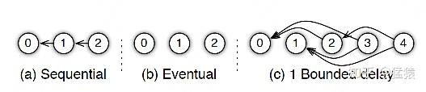

-   **(a) 无延迟**
-   **(b) 延迟但不指定延迟步数**。也即在迭代2时，用的可能是老权重，也可能是新权重，听天由命。
-   **(c) 延迟且指定延迟步数为1**。例如做迭代3时，可以不拿回迭代2的梯度，但必须保证迭代0、1的梯度都已拿回且用于参数更新。

总结一下，**异步很香，但对一个Worker来说，只是等于W不变，batch的数量增加了而已，在SGD下，会减慢模型的整体收敛速度**。异步的整体思想是，比起让Worker闲着，倒不如让它多吃点数据，虽然反馈延迟了，但只要它在干活在学习就行。
batch就像活，异步就像画出去的饼，且往往不指定延迟步数，每个Worker干越来越多的活，但模型却没收敛取效，这又是刺伤了哪些打工仔们的心（狗头

## 二、分布式数据并行(DDP)

受通讯负载不均的影响，**DP一般用于单机多卡场景**。因此，DDP作为一种更通用的解决方案出现了，既能多机，也能单机。**DDP首先要解决的就是通讯问题：将Server上的通讯压力均衡转到各个Worker上。实现这一点后，可以进一步去Server，留Worker。**
前文我们说过，聚合梯度 + 下发梯度这一轮操作，称为AllReduce。**接下来我们介绍目前最通用的AllReduce方法：Ring-AllReduce**。它由百度最先提出，非常有效地解决了数据并行中通讯负载不均的问题，使得DDP得以实现。

### 2.1 Ring-AllReduce

如下图，假设有4块GPU，每块GPU上的数据也对应被切成4份。AllReduce的最终目标，就是让每块GPU上的数据都变成箭头右边汇总的样子。

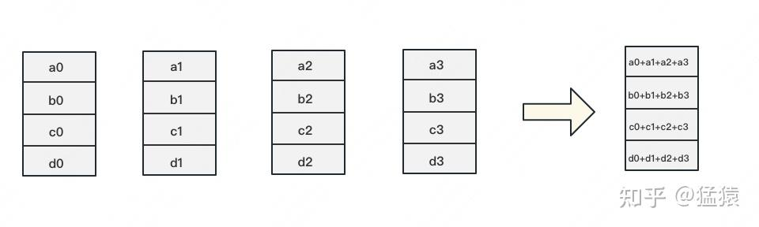

Ring-ALLReduce则分两大步骤实现该目标：**Reduce-Scatter** 和 **All-Gather。**

**Reduce-Scatter**
定义网络拓扑关系，使得每个GPU只和其相邻的两块GPU通讯。每次发送对应位置的数据进行 **累加**。每一次累加更新都形成一个拓扑环，因此被称为Ring。看到这觉得困惑不要紧，我们用图例把详细步骤画出来。

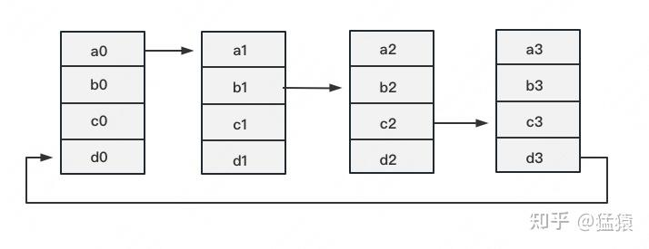

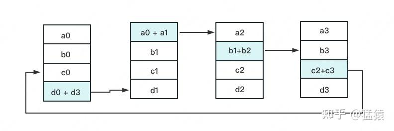

一次累加完毕后，蓝色位置的数据块被更新，被更新的数据块将成为下一次更新的起点，继续做累加操作。

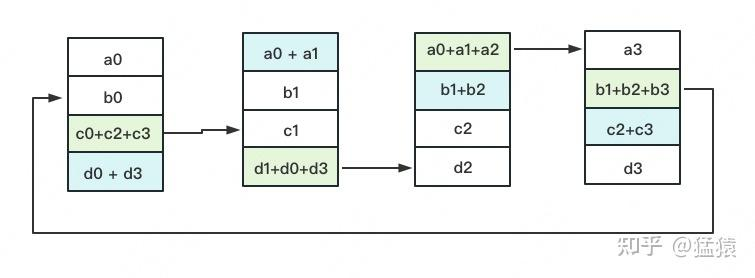

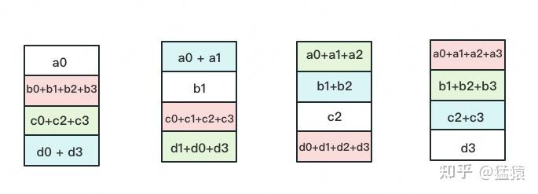

**3次** 更新之后，每块GPU上都有一块数据拥有了对应位置完整的聚合（图中红色）。此时，Reduce-Scatter阶段结束。进入All-Gather阶段。目标是把红色块的数据广播到其余GPU对应的位置上。

**All-Gather**
如名字里Gather所述的一样，这操作里依然按照“相邻GPU对应位置进行通讯”的原则，但对应位置数据不再做相加，而是直接替换。All-Gather以红色块作为起点。

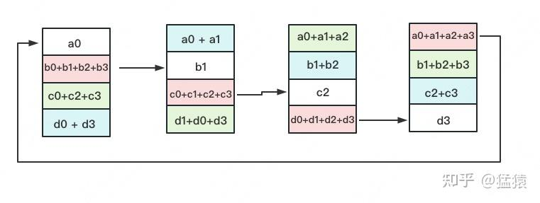

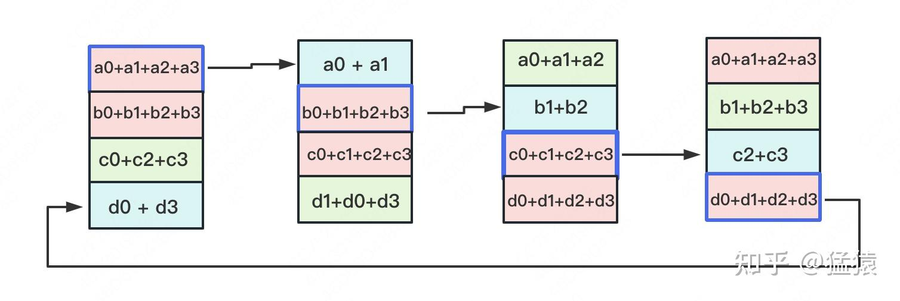

以此类推，同样经过 **3轮迭代后**，使得每块GPU上都汇总到了完整的数据，变成如下形式：

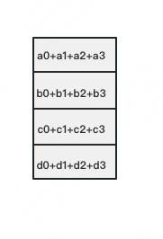

建议读者们手动推一次，加深理解。

### 2.2 Ring-AllReduce通讯量分析

假设模型参数W的大小为 $\Phi$ ，GPU个数为 $N$ 。则梯度大小也为 $\Phi$ ，每个梯度块的大小为 $\frac{\Phi}{N}$
对单卡GPU来说（只算其send通讯量）：

-   Reduce-Scatter阶段，通讯量为 $(N-1)\frac{\Phi}{N}$
-   All-Gather阶段，通讯量为 $(N-1)\frac{\Phi}{N}$

**单卡总通讯量为** $2(N-1)\frac{\Phi}{N}$ **，随着N的增大，可以近似为** $2\Phi$。**全卡总通讯量为** $2N\Phi$

而对前文的DP来说，它的Server承载的通讯量是 $N\Phi$，Workers为 $N\Phi$，全卡总通讯量依然为 $2N\Phi$。**虽然通讯量相同，但搬运相同数据量的时间却不一定相同**。DDP把通讯量均衡负载到了每一时刻的每个Worker上，而DP仅让Server做勤劳的搬运工。当越来越多的GPU分布在距离较远的机器上时，DP的通讯时间是会增加的。

但这并不说明参数服务器不能打（有很多文章将参数服务器当作old dinosaur来看）。事实上，参数服务器也提供了多Server方法，如下图：

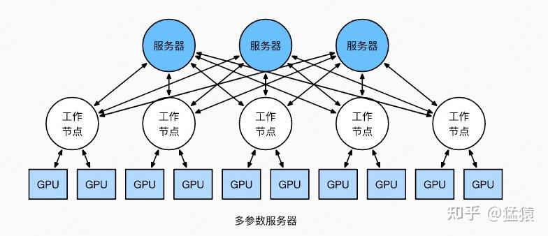

在多Server的模式下，进一步，每个Server可以只负责维护和更新某一块梯度（也可以某块梯度+参数一起维护），此时虽然每个Server仍然需要和所有Worker通讯，但它的带宽压力会小非常多。经过调整设计后，依然可以用来做DDP。虽然这篇文章是用递进式的方式来介绍两者，但不代表两者间一定要决出优劣。**我想表达的观点是，方法是多样性的。** 对参数服务器有兴趣的朋友，可以阅读参考的第1个链接。
最后，**请大家记住Ring-AllReduce的方法，因为在之后的ZeRO，Megatron-LM中，它将频繁地出现，是分布式训练系统中重要的算子。**

## 三、总结

1. 在DP中，每个GPU上都拷贝一份完整的模型，每个GPU上处理batch的一部分数据，所有GPU算出来的梯度进行累加后，再传回各GPU用于更新参数
2. DP多采用参数服务器这一编程框架，一般由若个计算Worker和1个梯度聚合Server组成。Server与每个Worker通讯，Worker间并不通讯。因此Server承担了系统所有的通讯压力。基于此DP常用于单机多卡场景。
3. 异步梯度更新是提升计算通讯比的一种方法，延迟更新的步数大小决定了模型的收敛速度。
4. Ring-AllReduce通过定义网络环拓扑的方式，将通讯压力均衡地分到每个GPU上，使得跨机器的数据并行（DDP）得以高效实现。
5. DP和DDP的总通讯量相同，但因负载不均的原因，DP需要耗费更多的时间搬运数据

## 四、参考

1. [https://web.eecs.umich.edu/~mosharaf/Readings/Parameter-Server.pdf](https://link.zhihu.com/?target=https%3A//web.eecs.umich.edu/~mosharaf/Readings/Parameter-Server.pdf)
2. [https://zh.d2l.ai/chapter\_computational-performance/parameterserver.html](https://link.zhihu.com/?target=https%3A//zh.d2l.ai/chapter_computational-performance/parameterserver.html)
3. [https://blog.csdn.net/dpppBR/article/details/80445569](https://link.zhihu.com/?target=https%3A//blog.csdn.net/dpppBR/article/details/80445569)
4. [https://arxiv.org/abs/1910.02054](https://link.zhihu.com/?target=https%3A//arxiv.org/abs/1910.02054)
5. [https://blog.51cto.com/u\_14691718/5631471](https://link.zhihu.com/?target=https%3A//blog.51cto.com/u_14691718/5631471)
