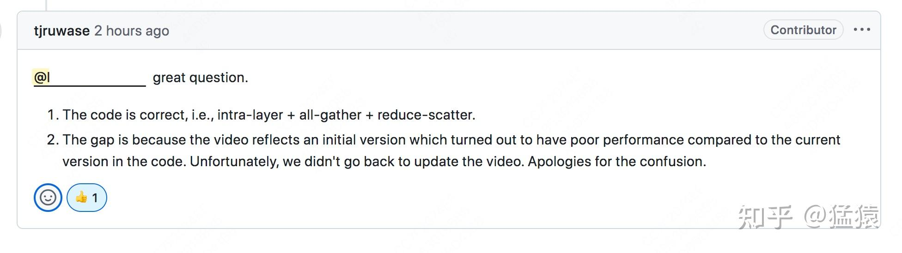
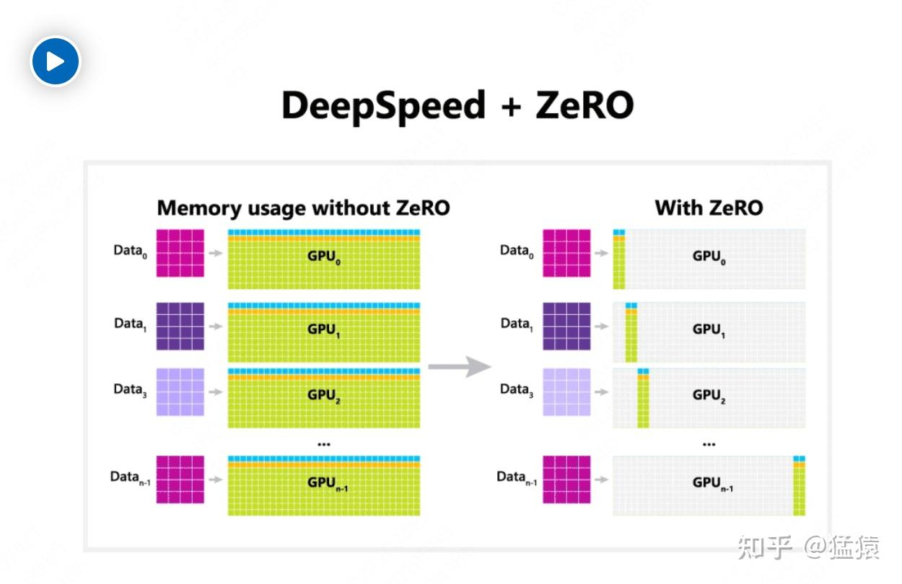
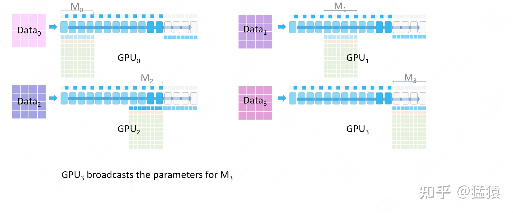
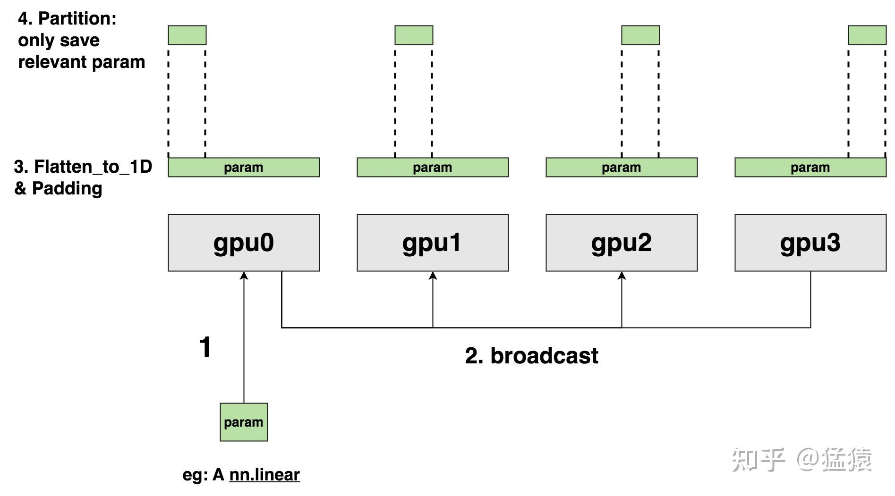
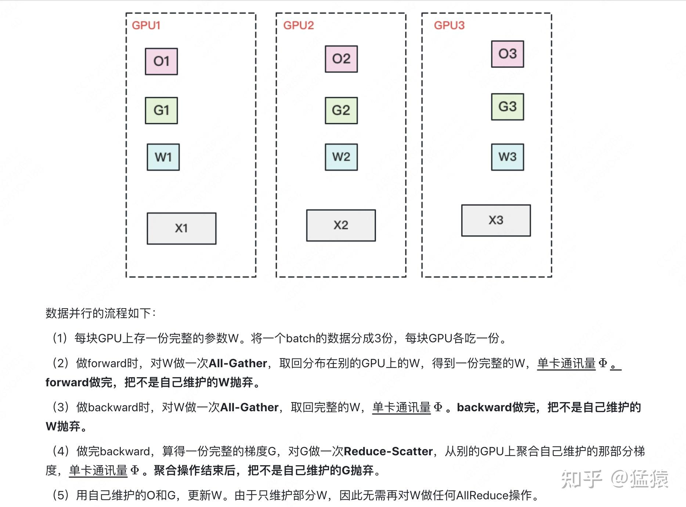

**大家好，今天想来看一个和zero3权重切分方式相关的问题。之所以想来谈这个问题，是因为当前一个由deepspeed team官方给出的、传播度非常广的zero3运作流程视频解说，和它实际的代码实现间存在显著差异**

---

**【更新在开头】：今天我收到了deepspeed的回复，证实了这种差异的存在：**

-   **证实了目前zero3的实现方案是 intra-layer + all-gather + reduce-scatter，而不是文档里说的 inter-layer + broadcast + reduce-scatter形式。**
-   **造成官方文档和代码间gap的原因是，文档给出的是zero3的早期实现，后来zero3迭代了，文档却没有及时更新，造成了困惑。**

所以，如果大家都曾经从上面那份文档相关的内容了解zero3，或者曾经看到下面这样的介绍图：

**就可以认为它们都已经outdated了**，可以不用看了。

**让我们直接从代码里重新认识zero3吧！！！！！！**

---

## 一、ds官方给出的zero3运作流程原理

我相信很多朋友，应该是通过这个官方[视频介绍](https://link.zhihu.com/?target=https%3A//www.microsoft.com/en-us/research/blog/zero-deepspeed-new-system-optimizations-enable-training-models-with-over-100-billion-parameters/)来入门zero的。这个链接里涵盖了一条视频，介绍了zero3整个fwd和bwd的过程，截图如下：

这里我们以上图为例，稍微解释下视频的内容：

-   一共有4张gpu，每张gpu吃一个micro batch的数据，它们共同构成一个dp组。
-   图中的M0, M1, M2, M3分别表示一个完整模型的4个部分，**按照视频里的说法，这里对模型执行的是inter-layer（层间切割）**。举例来说，假设模型一共有16层，那么M0 = layer0~3，M1 = layer4~7，M2 = layer8~11，M3= layer12~15。
-   图中刻画的是zero3 fwd的某一阶段，在这个阶段中，维护着M3的gpu3将把M3 **broadcast** 到其余gpu上，然后各张卡利用M3做fwd。
-   更多的细节，请大家观看完整视频

## 二、zero3实际的代码实践

而在zero3的代码实践中，**模型权重其实是通过intra-layer（层内切割）的方式被放到各个gpu上的，换了一种切割方法，就会引起整个运作流程和通信方式上的极大不同。**

**zero3做partition\_param的核心代码在[这里](https://link.zhihu.com/?target=https%3A//github.com/microsoft/DeepSpeed/blob/master/deepspeed/runtime/zero/partition_parameters.py%23L1551)**。这里提一句，zero的代码写得非常复杂缠绕，从zero3的入口一直到这段切割的核心代码，我经历了漫长的阅读和跳转旅程。所以这里只放出核心代码，如果大家有阅读上下文的需求，需要耐心点从入口处开始慢慢读起。

**我把整个zero3 param初始化和切割的过程大致抽象成下面这张图：**

1.  首先，某一块param(比如一个nn.linear层)先传送到rank0上
2.  接着，这块param被从rank0广播到各个gpu上。此时每张gpu都拥有完整的rank0。
3.  接着，把param展平成1D张量，同时做padding。padding的意思就是，如果一个param中所含的元素数量不能被dp\_group内的gpu数量整除，那么就需要做padding对齐。
4.  计算每一块gpu上所维护的1D param的范围（即start\_index, end\_index），然后按照这个范围取出每块gpu上应该维护的param chunk，接着就可以释放不是自己所维护的param chunk了。

**在这个intra-layer形式的zero3权重切分下，fwd和bwd中涉及的关键通信应该是：**

-   fwd时，**dp\_group内做1次all-gather**，取回完整的权重。
-   bwd时，**dp\_group内做1次all-gather**，取回完整的权重，以便做梯度计算。
-   bwd时，**dp\_group内对梯度做1次reduce-scatter**，让每张卡拿回属于自己的梯度，以便做权重更新。

**当然，这里还有weight prefetch，释放时机等细节操作，大家可以自行去看代码。**

如果按照第一部分ds官方给出的流程图，zero3的在fwd和bwd过程中主要通信方式应该是broadcast，事实上它也是这么注明的。而除了通信方式外，如果真的按照官方流程图的方式来写zero3，那么实践上将会大有不同。**总结来说，一个小小的参数partition方式的变化，可能造成对整个zero3的认知变化。**

## 三、自我鞭尸及差异分析

**在开始写这节前，我先鞭尸我自己。**

我在23年年初写过一篇关于[deepspeed zero的介绍](https://zhuanlan.zhihu.com/p/618865052)，但我对deepspeed的第一次了解要追溯到20年左右，那时还不是LLM的时代。我首次了解zero时，它只实现出了zero1/2，还没有做出zero3，也即zero3当时应该是存在于zero论文中的一个demo概念。当年我没有养成看代码的习惯，非常依赖官网的教程和各类blog的理论解读。

所以上文里提供的这份官方视频，就是我zero3的入门教程，事实上直到今年，它应该还是很多人入门zero会看到的东西，在B站或者各类blog上，有无数对它直接搬运或者重制的介绍。

在我23年年初开始写zero介绍时，我依然没有看代码，头脑里也还是官网介绍的那套模式。**但是，误打误撞地，当我准备画图时，我发现画不同layer的broadcast实在太麻烦了，所以我把整个模型抽象成一个整体（one layer），然后用all-gather和reduce-scatter的方式替换掉原来的broadcast，替换的原因是我觉得在不影响对整体通信量分析的情况下，前两者表达起来更加合乎逻辑和直观。然后又误打误撞的，我随手把切割化成了intra-layer（毕竟抽象成one layer了）。最终，虽然头脑里对zero3的认知还是错误的，但是各种机缘巧合竟然画成了代码实际实践的样子：**

这篇文章写在LLM初期，热度比较高 **，所以再次误打误撞的，把intra-layer后all-gather这一套方式传播了出去。以至于当我第一次看完代码，问一个朋友，你当初是怎么知道是intra-layer形式切的？他回答那不是你自己写的吗？让我简直羞愧得想钻地缝.......**

**这篇文章写出来后，在评论区和私信里我被diss爆了，大家都抛出官网的教程让我去看。** 由于我也是从官网教程里学习的，且对它深信不疑，所以我对自己擅自解读、造成误导的行为深感抱歉，在评论区做了很长的说明，乃至今后很长的时间里我对zero3的印象都是如此，直到后来看到了代码。

**所以在这里我必须在这里先鞭尸我自己：理论上的解读都是虚的，代码才是唯一的答案。有代码的情况下，不管是做解读、批判还是赞赏，都应该面向代码，而不是浮于paper或者blog的理论。其实各位看今天这篇文章也是如此，这里是我个人对代码的理解，不是标准答案，zero3的真实运作也许还不是像第二部分说的那样，所以也欢迎大家给出更多的讨论。**

鞭尸完自己，回归正题，为什么ds官方视频和代码实践上差异这么大呢？

我看了一下官方视频发出的时间，大概是20年初，这个时候zero3可能还没完全开源，所以给了一个可能基于他们当时正在开发的zero3版本的介绍。由于zero那篇论文写得比较差，而视频做得非常详细，所以大家都把它当成标准，这样就传播开了。同时，也不排除视频本身做的不完善，例如可能把权重初始化过程和fwd、bwd过程融合表示在一起，造成误解。

**趁着年前有时间，写一下这篇文章，比起分享出这个可能的误区，更重要的是由此产生的反思。**
