**【本文是图解大模型训第1篇，持续更新中，欢迎关注】：**

**[猛猿：图解大模型训练之：流水线并行（Pipeline Parallelism），以Gpipe为例](https://zhuanlan.zhihu.com/p/613196255)**

**[猛猿：图解大模型训练之：数据并行上篇(DP, DDP与ZeRO)](https://zhuanlan.zhihu.com/p/617133971)**

**[猛猿：图解大模型训练之：数据并行下篇(ZeRO，零冗余优化)](https://zhuanlan.zhihu.com/p/618865052)**

**[猛猿：图解大模型系列之：张量模型并行，Megatron-LM](https://zhuanlan.zhihu.com/p/622212228)**

**[猛猿：图解大模型系列之：Megatron源码解读1，分布式环境初始化](https://zhuanlan.zhihu.com/p/629121480)**

**[猛猿：图解大模型训练之：Megatron源码解读2，模型并行](https://zhuanlan.zhihu.com/p/634377071)**

**【ChatGPT算法解析系列，可见】**

**[猛猿：ChatGPT技术解析系列之：训练框架InstructGPT](https://zhuanlan.zhihu.com/p/605516116)（因平台bug暂时显示不出来，可以看这一篇回答**

**[猛猿：ChatGPT技术解析系列之：GPT1、GPT2与GPT3](https://zhuanlan.zhihu.com/p/609367098)**

**[猛猿：ChatGPT技术解析系列之：赋予GPT写代码能力的Codex](https://zhuanlan.zhihu.com/p/611313567)**

---

回顾ChatGPT的发展历程，我们可以总结出大语言模型（LLM）取得惊艳效果的要点（重要性从高到低排序）：

-   愿意烧钱，且接受“烧钱 != 好模型”的现实
-   高质量的训练语料
-   高效的分布式训练框架和充沛优质的硬件资源
-   算法的迭代创新

在大模型训练这个系列里，我们将一起探索学习几种经典的分布式并行范式，包括 **流水线并行（Pipeline Parallelism），数据并行（Data Parallelism）和张量并行（Tensor Parallesim）**。微软开源的分布式训练框DeepSpeed，融合了这三种并行范式，开发出 **3D并行** 的框架，实现了千亿级别模型参数的训练。

本篇文章将探索流水线并行，经典的流水线并行范式有Google推出的Gpipe，和微软推出的PipeDream。两者的推出时间都在2019年左右，大体设计框架一致。主要差别为：在梯度更新上，Gpipe是同步的，PipeDream是异步的。异步方法更进一步降低了GPU的空转时间比。虽然PipeDream设计更精妙些，但是Gpipe因为其“够用”和浅显易懂，更受大众欢迎（torch的pp接口就基于Gpipe）。因此本文以Gpipe作为流水线并行的范例进行介绍。

本文内容包括：
1. 优化目标
2. 模型并行
3. 流水线并行

-   切分micro-batch
-   Re-materialization (active checkpoint)

4. 实验效果

-   GPU数量 VS 模型大小
-   GPU数量 VS 训练速度
-   Gpipe下单GPU的时间消耗分析

## 一、优化目标

当你从单卡穷人变成多卡富翁时，你做分布式训练的总体目标是什么呢？（虽然手握一张A100怎么能是穷呢）

-   **能训练更大的模型**。理想状况下，模型的大小和GPU的数量成线性关系。即GPU量提升x倍，模型大小也能提升x倍。
-   **能更快地训练模型**。理想状况下，训练的速度和GPU的数量成线性关系。即GPU量提升x倍，训练速度也能提升x倍。

这是目标，也是难点，难在于：

-   训练更大的模型时，每块GPU里不仅要存模型参数，还要存中间结果（用来做Backward）。而更大的模型意味着需要更多的训练数据，进一步提高了中间结果的大小。加重了每块GPU的内存压力。我们将在下文详细分析这一点。（**对应着GPU中的内存限制**）
-   网络通讯开销。数据在卡之间进行传输，是需要通讯时间的。不做设计的话，这个通讯时间可能会抹平多卡本身带来的训练速度提升。（**对应着GPU间的带宽限制**）

明确这两个训练目标后，我们来看并行范式的设计者，是如何在现有硬件限制的条件下，完成这两个目标的。

## 二、模型并行

当你有一个单卡装不下的大模型时，一个直接的解决办法是，把模型隔成不同的层，每一层都放到一块GPU上，如下图：

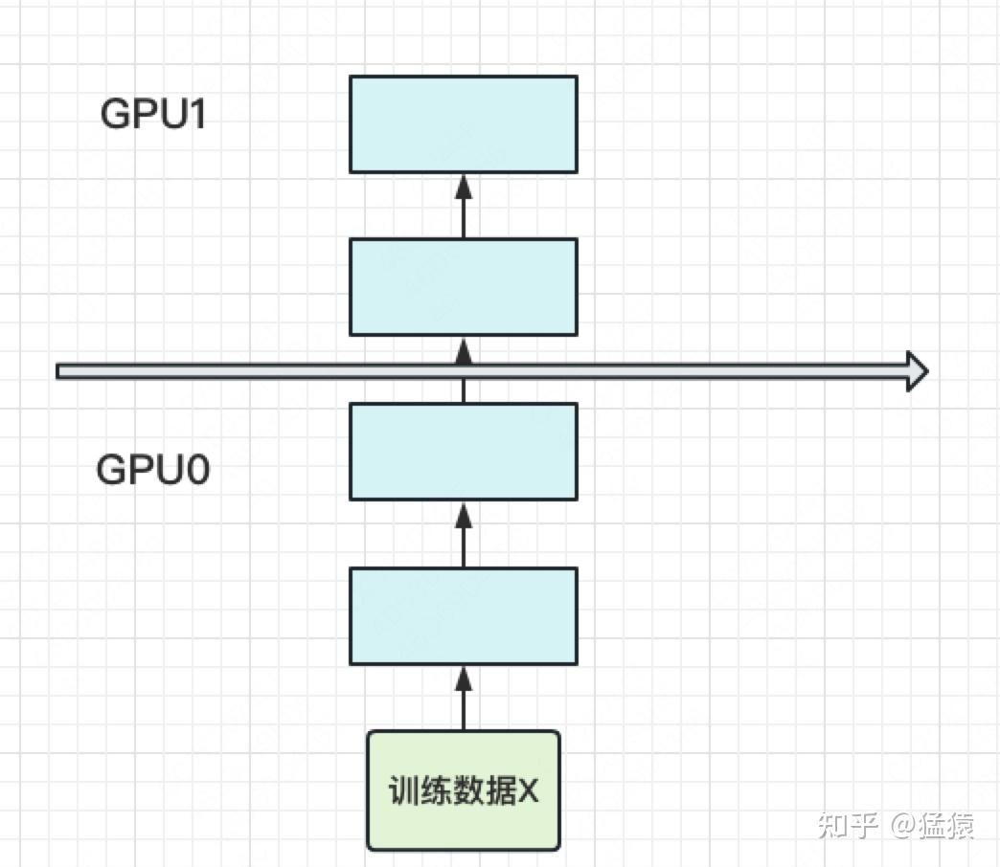

此时，模型做一轮forward和backward的过程如下：

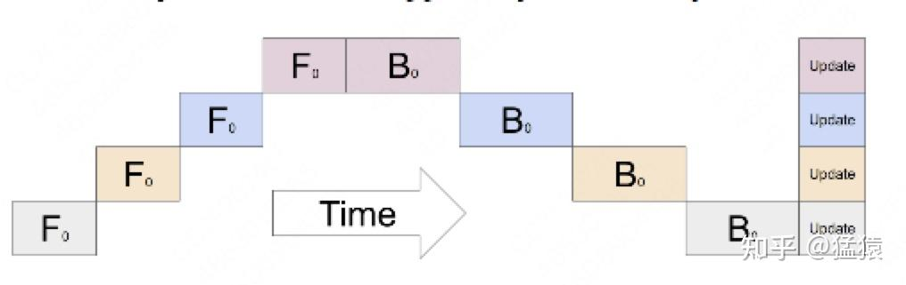

其中下标表示batch编号，这里只有一个batch，因此下标都是0。每一行表示一个GPU。每一列表示timestep。

这张图的含义是：我在GPU0上做完一次forward，然后将GPU0上最后一层的输入传给GPU1，继续做forward，直到四块GPU都做完forward后，我再依次做backward。等把四块GPU上的backward全部做完后，最后一个时刻我统一更新每一层的梯度。

这样做确实能训更大的模型了，但也带来了两个问题：

**（1）GPU利用度不够。**

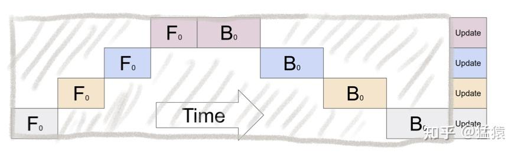

如图，阴影部分所表示的时间段里，总有GPU在空转。在Gpipe中，将阴影部分定义为bubble。我们来计算一下bubble。假设有 $K$ 块GPU，而单块GPU上做一次forward和backward的时间为： $t_{fb} = (t_{f} + t_{b})$ 。则：

-   图中灰色长方形的整体面积为： $K*Kt_{fb}$ （宽= $K$ ，长= $Kt_{fb}$ ）
-   图中实际在做forward和backward的面积为： $Kt_{fb}$
-   图中阴影部分的面积为： $K*Kt_{fb} - Kt_{fb}=(K-1)Kt_{fb}$
-   图像阴影部分的占比为： $(K-1)Kt_{fb}/KKt_{fb} =(K-1)/K$

则我们定义出bubble部分的时间复杂度为： $O(\frac{K-1}{K})$，**当K越大，即GPU的数量越多时，空置的比例接近1，即GPU的资源都被浪费掉了**。因此这个问题肯定需要解决。

**（2）中间结果占据大量内存**

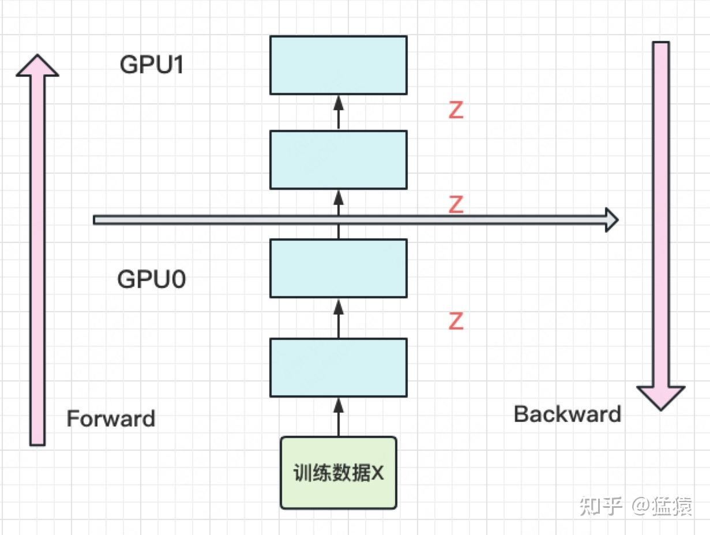

在做backward计算梯度的过程中，我们需要用到每一层的中间结果z。假设我们的模型有L层，每一层的宽度为d，则对于每块GPU，不考虑其参数本身的存储，额外的空间复杂度为 $O(N*\frac{L}{K}*d)$ 。从这个复杂度可以看出，随着模型的增大，N，L，d三者的增加可能会平滑掉K增加带来的GPU内存收益。因此，这也是需要优化的地方。

## 三、流水线并行

朴素的模型并行存在GPU利用度不足，中间结果消耗内存大的问题。而Gpipe提出的流水线并行，就是用来解决这两个主要问题的。

### 3.1 切分micro-batch

流水线并行的核心思想是：**在模型并行的基础上，进一步引入数据并行的办法，即把原先的数据再划分成若干个batch，送入GPU进行训练**。未划分前的数据，叫 **mini-batch**。在mini-batch上再划分的数据，叫 **micro-batch**。

图例如下：

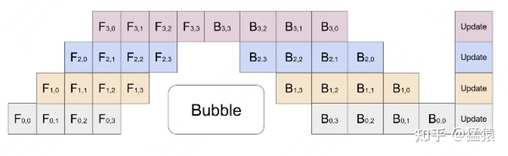

其中，第一个下标表示GPU编号，第二个下标表示micro-batch编号。假设我们将mini-batch划分为M个，则流水线并行下，bubble的时间复杂度为： $O(\frac{K-1}{K+M-1})$ (推导过程略，可参照第二部分的bubble推导流程)。Gpipe通过实验证明，当 $M>=4K$ 时，bubble产生的空转时间占比对最终训练时长影响是微小的，可以忽略不计。

将batch切好，并逐一送入GPU的过程，就像一个流水生产线一样（类似于CPU里的流水线），因此也被称为Pipeline Parallelism。

### 3.2 re-materialization（active checkpoint）

解决了GPU的空置问题，提升了GPU计算的整体效率。接下来，就要解决GPU的内存问题了。
前文说过，随着模型的增加，每块GPU中存储的中间结果也会越大。对此，Gpipe采用了一种非常简单粗暴但有效的办法：**用时间换空间，在论文里，这种方法被命名为re-materalization，后人也称其为active checkpoint**。
具体来说，就是 **几乎不存中间结果，等到backward的时候，再重新算一遍forward**，图例如下：

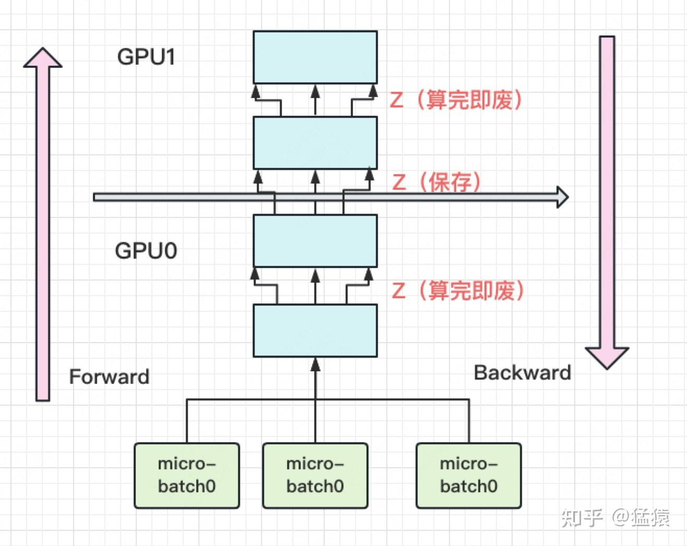

每块GPU上，我们只保存来自上一块的最后一层输入z，其余的中间结果我们算完就废。等到backward的时候再由保存下来的z重新进行forward来算出。
现在我们来计算每块GPU峰值时刻的内存：
**每块GPU峰值时刻存储大小 = 每块GPU上的输入数据大小 + 每块GPU在forward过程中的中间结果大小**

每块GPU上固定需要保存它的起始输入，我们记起始输入为 $N$ （即mini-batch的大小）。
每个micro-batch是流水线形式进来的，算完一个micro-batch才算下一个。在计算一个micro-batch的过程中，我们会产生中间变量，它的大小为 $\frac{N}{M}*\frac{L}{K} * d$ （其中M为micro-batch个数）。
**因此，每块GPU峰值时刻的空间复杂度为** $O(N + \frac{N}{M}*\frac{L}{K} * d)$
将其与朴素模型并行中的GPU空间复杂度 $O(N*\frac{L}{K}*d)$ 比较，可以发现，由于采用了micro-batch的方法，当L变大时，流水线并行相比于朴素模型并行，对GPU内存的压力显著减小。

如果你使用Pytorch提供的pipeline接口，其中有一个参数叫checkpoint，就是用来做这一项的。

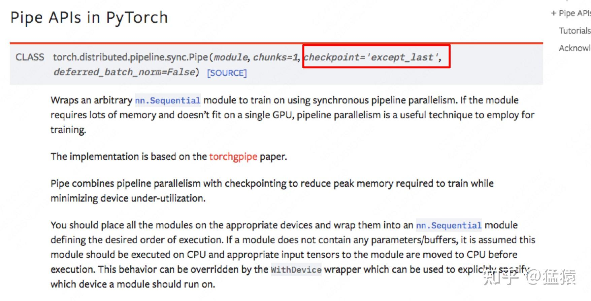

最后，再提一点，在micro-batch的划分下，我们在计算 **Batch Normalization** 时会有影响。Gpipe的方法是，在训练时计算和运用的是micro-batch里的均值和方差，但同时持续追踪全部mini-batch的移动平均和方差，以便在测试阶段进行使用。Layer Normalization则不受影响。

## 四、实验效果

回顾第二部分的两个目标，Gpipe真的实现了吗？如果实现不了，又是因为什么原因呢？我们来看下实验效果。

### 4.1 GPU数量 VS 模型大小

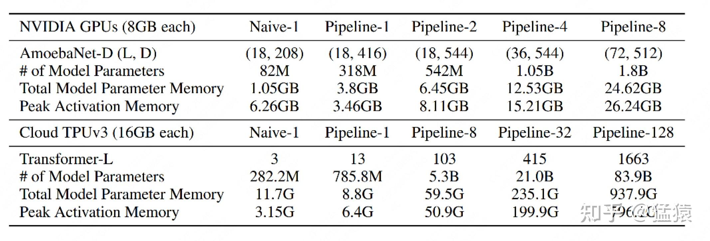

Gpipe分别在AmoebaNet（图像）和Transformer（自然语言）两个大模型上做了实验。

-   Naive表示单卡
-   Pipeline-N表示re-materalization + N卡。
-   AmeobaNet-D和Trasformer-L一行表示超参数的量
-   \# of Model Parameter表示模型的参数量
-   Total Model Parameter Memory表示模型参数所占内存大小
-   Peak Activation Memory表示峰值时中间结果大小。可以发现，中间结果占据的内存大小是相当可观的。

从实验结果里，我们可以发现：

-   在Transformer上，Gpipe基本实现了模型大小（参数量）和GPU个数之间的线性关系。例如从32卡增到128卡时，模型的大小也从21.08B增加到82.9B，约扩4倍
-   对AmoebaNet而言，却没有完全实现线性增长。例如从4卡到8卡，模型大小从1.05B到1.8B，不满足2倍的关系。本质原因是AmoebaNet模型在切割时，没有办法像Transformer一样切得匀称，保证每一块GPU上的内存使用率是差不多的。因此对于AmoebaNet，当GPU个数上升时，某一块GPU可能成为木桶的短板。

### 4.2 GPU数量 VS 训练速度

**（1）关掉NVlinks**

为了验证Gpipe框架带来的收益，实验中关掉了NVlinks（GPU间快速通信的桥梁。估计是通过强迫GPU先连CPU然后再连别的GPU做到的）。关掉的意义在于说明，不靠硬件本身的高效通讯带来的收益，Gpipe一样能做的很好。实验效果如下：

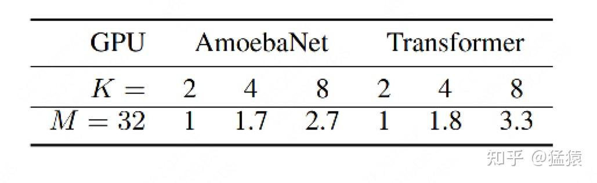

M=32表示micro-batch的数量为32，K表示GPU数量。从实验结果可知，在关掉NVlinks的情况下，Gpipe一样也能实现随着GPU数量的增加，训练速度也增加的效果。虽然这两者间不是线性的。同样，因为模型切割不均的原因，AmoebaNet的表现不如Transformer。

**（2）开启NVlinks，并寻找最佳M**

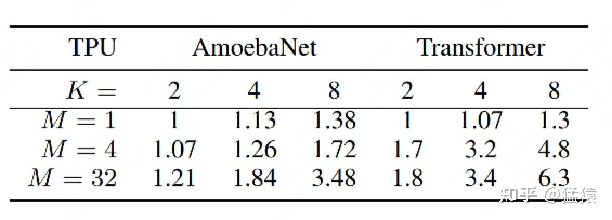

当重新开启NVlinks后，我们来看M的大小（即流水线的核心）对训练速度的影响。

-   当M=1的时候，如前文所说，GPU的空置率太高，因此两个模型都没有实现训练速度和GPU个数间的线性关系
-   当M=4时，表现明显好转。
-   当M=32时，表现最佳，且Transformer基本实现了训练速度和GPU个数的线性关系。

### 4.3 Gpipe下时间消耗分布

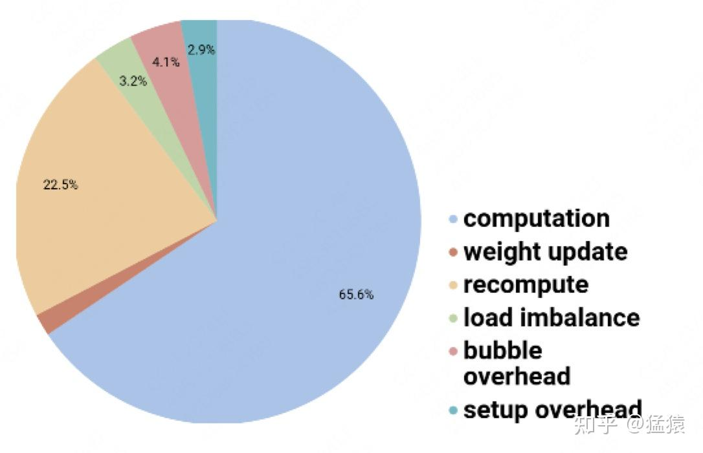

-   对每块GPU来说，约2/3的时间，是真正花在计算上的。
-   其余1/3的时间，大部分花在re-materalization策略下的重计算上。因为采用流水线的方法，bubble的时间也被压缩到很短，可以忽略不计。

## 参考

1. [https://arxiv.org/abs/1811.06965](https://link.zhihu.com/?target=https%3A//arxiv.org/abs/1811.06965)
2. [https://www.zhihu.com/question/508671222/answer/2290801813](https://www.zhihu.com/question/508671222/answer/2290801813)
3. [https://cloud.tencent.com/developer/article/2089268](https://link.zhihu.com/?target=https%3A//cloud.tencent.com/developer/article/2089268)
