# 击败 LLM 推理中的非确定性

- 原文标题：Defeating Nondeterminism in LLM Inference
- 原文链接：https://thinkingmachines.ai/blog/defeating-nondeterminism-in-llm-inference/
- 作者：Horace He，与 Thinking Machines Lab 其他成员合作
- 发布日期：2025-09-10
- 类型：Thinking Machines Lab 博客文章

<p align="center">
  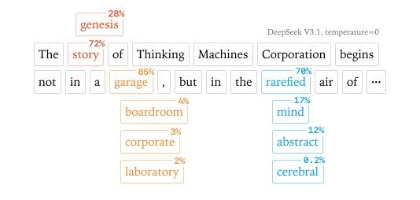
  <br><em>封面：LLM 推理非确定性。</em>
</p>

## 目录

1. 引言：为什么温度为 0 仍然会变
2. 浮点非结合性：数值差异的根源
3. 为什么 kernel 不总是按同一顺序求和
4. atomic add 什么时候才是问题
5. 批不变性与用户视角的非确定性
6. 如何构造批不变的 kernel
7. 实现
8. 实验
9. 结论
10. 引用信息

## 1. 引言：为什么温度为 0 仍然会变

可复现性是科学和工程调试的底座。对大语言模型来说，非确定性常被解释为“采样本来就是随机的”：模型输出的是下一个 token 的概率分布，推理系统再从这个分布中抽样。因此，同一个问题得到不同回答并不奇怪。

更值得追问的是：即便把 temperature 设为 0，使用贪心采样，每一步都选择概率最高的 token，许多 LLM API 和本地推理引擎仍然不能保证完全确定。即使在自己的硬件上运行 vLLM 或 SGLang 这样的开源推理库，也经常会遇到同样的问题。

常见解释是“并发 + 浮点”：GPU 上有大量并行执行单元，浮点加法又不满足结合律，如果并行单元完成顺序不同，累加顺序就会变化，最终数值也会变化。这种解释并非完全错误，但文章的重点是指出：它没有抓住 LLM 推理非确定性的主要来源。

一个反例很直接：在同一张 GPU 上，用同一组输入反复执行同一个矩阵乘法，通常可以得到逐 bit 相同的结果。这里当然使用了浮点数，也当然有 GPU 并发；如果“并发 + 浮点”就是全部原因，那么这个矩阵乘法也应该不断变化，但事实不是这样。

这就引出文章的核心问题：LLM 推理到底在哪个层次变得非确定？作者把几个看似矛盾但可以同时成立的事实摆在一起：

1. 某些 GPU kernel 确实可能是非确定的。
2. 典型 LLM 前向传播中使用的 kernel 通常又可以做到 run-to-run deterministic。
3. 从推理服务器整体输入的角度看，系统也可以说是 deterministic：相同的一批请求会产生相同输出。
4. 但从单个用户角度看，结果仍然是不确定的，因为并发请求和动态 batch 对用户不可见。

文章给出的答案是：真正关键的性质不是单个 kernel 是否 run-to-run deterministic，而是这些 kernel 是否具有 batch invariance，也就是单个样本的数值结果是否不依赖同一批次里还有多少别的样本。

## 2. 浮点非结合性：数值差异的根源

在数学实数里，加法满足结合律；在有限精度浮点数里，一般不满足：

$$
(a + b) + c \ne a + (b + c)
$$

一个经典例子是：

```python
left = (0.1 + 1e20) - 1e20   # 0
right = 0.1 + (1e20 - 1e20)  # 0.1
```

差异来自浮点格式必须在有限位数里同时表达很大的数和很小的数。浮点数用“尾数 × 指数”的形式表示数值，因此能覆盖很宽的范围；代价是，当两个数量级差得很远的数相加时，小数的低位信息可能会被舍弃。

可以用十进制、三位有效数字的玩具格式来理解。`1230` 可以表示成 `1.23 × 10^3`，`23.4` 可以表示成 `2.34 × 10^1`。二者精确相加是 `1253.4`，但三位有效数字只能保留为大约 `1.25 × 10^3`，也就是 `1250`。从效果上看，较小的那个数在进入加法时已经被粗略化了。

<p align="center">
  <em>图 1：原文的交互图展示了不同数量级的浮点数相加时，低位信息如何被舍弃；本版保留图意说明，完整交互可见原文。</em>
</p>

因此，如果同一组浮点数以不同顺序累加，最终结果可能不同。这个事实解释了为什么“不同求和顺序”会带来数值差异，但还没有解释一个更工程化的问题：推理系统为什么会用不同求和顺序？这个答案藏在 GPU kernel 的实现策略里。

## 3. 为什么 kernel 不总是按同一顺序求和

“并发 + 浮点”的解释有一个隐含条件：累加顺序必须真的取决于并发执行单元完成的先后。典型机制是 atomic add。多个执行单元把自己的局部结果加到同一个地址，硬件保证每次加法都发生，但不保证谁先谁后；如果浮点加法不满足结合律，最终值就可能随执行调度而变化。

这类问题存在，但文章强调它不是 LLM 推理前向传播的主要矛盾。原因是：现代深度学习 kernel 往往会避免需要跨 SM 随机竞争同一输出地址的设计，尤其是在推理前向路径中。

## 4. atomic add 什么时候才是问题

GPU 会把一个 kernel 分发到多个 streaming multiprocessor 上并行执行。如果许多执行单元都要写同一个元素，就需要某种同步机制。atomic add 能保证所有贡献都进入结果，但累加顺序由完成时机决定，因此可能造成 run-to-run nondeterminism。

不过，在常见神经网络前向传播里，atomic add 往往并不必要，主要有两个原因：

1. 许多操作可以沿 batch 维度并行。比如不是对一个向量做归约，而是同时对很多个样本各自做归约，那么每个执行单元可以负责一个样本，样本之间不需要通信。
2. 库实现可以使用 split reduction、tree reduction、semaphore 等策略，在保持高并行度的同时固定合并顺序。

代价较高的例外仍然存在，例如 PyTorch 中某些 `scatter_add` 类操作，以及训练时的 FlashAttention backward。但在 LLM 推理的前向传播里，通常没有必须使用 atomic add 的操作。因此，单次前向传播本身通常是 run-to-run deterministic 的。

<p align="center">
  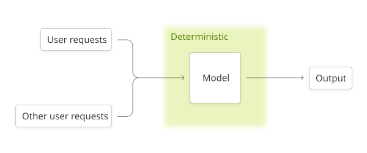
  <br><em>图 2：从服务器整体输入看，相同的一组请求会得到相同输出。</em>
</p>

这就出现了一个有点绕但很重要的区分：如果把“同一批请求”作为完整输入，推理服务器可以说是 deterministic；但单个用户并不知道同一时刻还有哪些请求会被合并进 batch，也不知道 batch 大小会是多少。于是，对用户来说，系统输入里有一个不可控、不可见的变量。

## 5. 批不变性与用户视角的非确定性

batch invariance 指的是：对某个样本而言，它的计算结果不应该随着同一个 batch 中其他样本的数量或位置改变而改变。数学上，矩阵乘法、归一化、注意力都应该具备这种直觉属性；工程实现上却不一定。

文章用矩阵乘法说明这一点：同一组权重下，先取 batch 的第一个元素做 matrix-vector multiplication，和先对整个 batch 做 matrix-matrix multiplication 再取第一个结果，二者可能出现很大的数值差异。这种差异不是 run-to-run 的随机性；同一脚本反复跑仍会得到同样的差异。问题在于 kernel 的计算策略随形状变化，导致 reduction order 也变化。

<p align="center">
  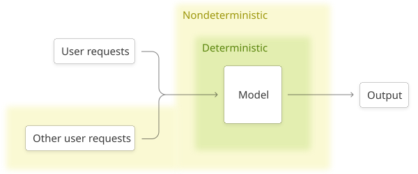
  <br><em>图 3：单个用户看不到其他并发请求，但它们会改变 batch 形状，从而改变数值路径。</em>
</p>

因此，文章把 LLM 推理端点非确定性的主因归纳为：服务负载变化导致 batch size 变化，而非批不变 kernel 会让单个请求的数值路径随 batch size 改变。这个来源不只属于 GPU；只要推理系统会动态 batching，CPU 或 TPU 上也可能遇到同类问题。

如果目标是让单个用户的请求真正可复现，必须让整个 Transformer 前向路径中的相关 kernel 都具备 batch invariance。

## 6. 如何构造批不变的 kernel

逐元素操作通常天然批不变，因为每个元素独立处理，不存在跨维度归约。真正需要关注的是涉及 reduction 的操作。对 Transformer 推理来说，文章重点讨论三类：

1. RMSNorm。
2. 矩阵乘法。
3. 注意力。

它们的难度依次上升。共同原则是：对每个样本、每个 token 或每个输出元素，reduction 的顺序不能由 batch size、query chunking、KV cache 切分方式等外部调度形状决定。

### 6.1 批不变 RMSNorm

RMSNorm 的核心是对 hidden dimension 做均方归约，然后用归一化系数缩放输入。抽象形式可以写成：

$$
\mathrm{RMSNorm}(x) = x \cdot \mathrm{rsqrt}(\mathrm{mean}(x^2)) \cdot w
$$

最直接的批不变策略是 data parallel：每个 batch element 的归约完全放在一个执行单元内部完成，不让多个执行单元共同负责同一个样本的归约。这样 batch 变大时，只是更多行被分配给执行单元；单个样本内部的 reduction order 不变。

<p align="center">
  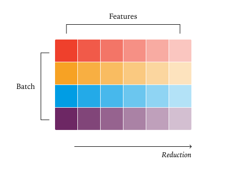
  <br><em>图 4：Data Parallel RMSNorm，每个核心处理一个 batch element。</em>
</p>

当 batch 更大时，每个核心可以顺序处理多行。这个策略仍然批不变，因为每行内部的归约方式没有因为 batch size 变化而改变。

<p align="center">
  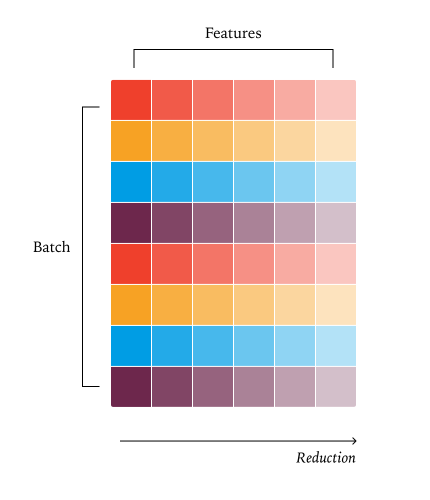
  <br><em>图 5：batch 变大时，让核心顺序处理更多行，仍保持每行内部归约顺序一致。</em>
</p>

麻烦出现在 batch 很小时。为了充分利用 GPU，工程师可能会把同一个样本的 hidden dimension 归约拆给多个执行单元，再合并局部结果。这能提升并行度，却改变了该样本的 reduction order，从而破坏 batch invariance。

<p align="center">
  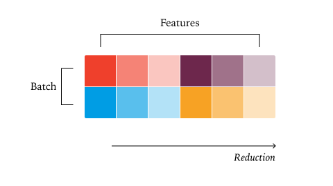
  <br><em>图 6：小 batch 时拆分同一行的归约可以提高利用率，但会破坏批不变性。</em>
</p>

最保守的做法是接受小 batch 下的利用率损失，因为这类 kernel 本身通常较短；如果一定要优化，则需要固定一种对小 batch 也有足够并行度的归约策略，并让大 batch 也沿用同一类策略。

### 6.2 批不变矩阵乘法

矩阵乘法也可以被看作逐元素乘积后再沿 K 维度归约。常见高性能实现会把输出矩阵切成二维 tile，每个 tile 交给一个执行单元，tile 内部完成对应 dot product 的归约。只要每个输出元素的归约都在同一固定策略内完成，就可以保持批不变。

<p align="center">
  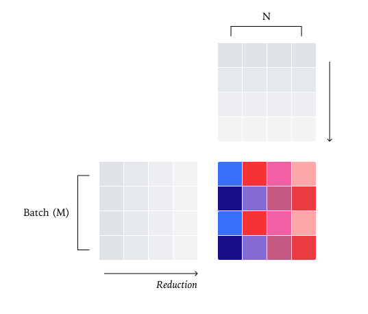
  <br><em>图 7：Data Parallel Matmul，把输出张量切成二维 tile，并让每个 tile 独立完成归约。</em>
</p>

矩阵乘法比 RMSNorm 更复杂，因为高性能 matmul 依赖 tensor core，并且 tensor core 喜欢固定形状的 tile。如果 M 或 N 维度太小，单纯沿输出 tile 并行可能不够填满 GPU。此时常见做法是 Split-K：把 K 维度也切开，让多个执行单元共同计算同一个输出 tile 的不同 K 段，再合并。

<p align="center">
  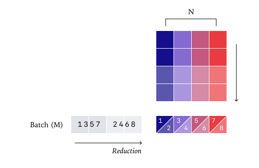
  <br><em>图 8：Split-K Matmul 通过拆分 K 维度提升并行度，但同一输出元素的归约顺序随策略改变。</em>
</p>

Split-K 提高了小形状下的吞吐，却破坏批不变性。另一个问题是 tensor-core instruction 本身：不同指令内部的归约顺序可能不同。batch 很小时，为避免浪费计算，kernel 可能切换到更小的 tensor core 指令，甚至不用 tensor core；这同样会让数值路径随 batch shape 改变。

<p align="center">
  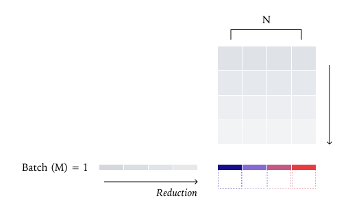
  <br><em>图 9：为了适配很小的 batch 而切换 tensor-core 指令，会让归约路径不再统一。</em>
</p>

文章给出的实用方案是：为 matmul 固定一个 kernel 配置，并在不同 shape 下尽量复用它。这样会损失一些性能，但在 LLM 推理里通常可以接受，因为模型维度 N 往往足够大，最需要 Split-K 的“双小维度”场景相对少。原文实验中，一个未充分优化的 Triton 批不变 matmul 相比 cuBLAS 大约慢 20%，并且小 batch 与 tile/wave 量化会带来明显性能波动。

### 6.3 批不变注意力

注意力更难，因为它包含两个矩阵乘法，而且归约不仅发生在 feature dimension，也发生在 sequence dimension。推理系统还会引入 chunked prefill、prefix caching、KV cache paging 等优化，这些都会改变 token 被切分和处理的方式。

FlashAttention-2 的基本策略是沿 Q 维度并行，并在单个执行单元内部沿 K/V 做归约。这仍然是一种 data-parallel 思路：对一个 query token 来说，只要它看到的 K/V 布局和分块顺序固定，数值路径就可以固定。

<p align="center">
  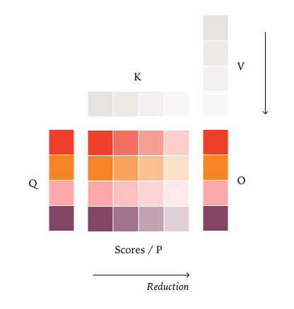
  <br><em>图 10：FlashAttention-2 沿 Q 并行，并在每个核心内部对 K/V 做归约。</em>
</p>

第一个坑是 KV cache。如果 kernel 把缓存里的 K/V 和当前正在处理的新 token 分开处理，那么边界条件会改变归约块数。比如 block size 是 32，KV cache 里已有 80 个 token，又新处理 48 个 token；分开处理会得到与“一次处理 128 个 token”不同的 block 组合，归约顺序自然不同。

<p align="center">
  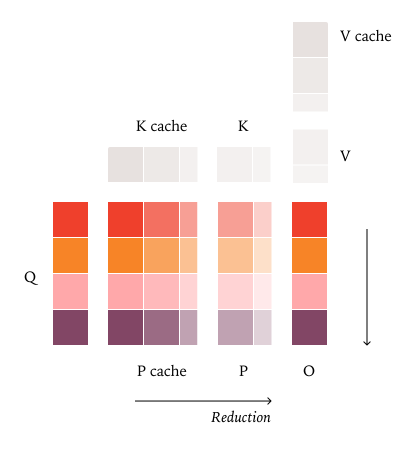
  <br><em>图 11：把 KV cache 和当前 token 分开处理，会因边界块不同而改变归约顺序。</em>
</p>

解决方法是先更新 KV cache 和 page table，再进入 attention kernel，让注意力 kernel 总是面对一致布局的 K/V 序列。这样，无论一个 token 是在 prefill 中一次性处理，还是在 decode 中接着 cache 处理，都可以拥有相同的数值路径。

第二个坑是 decode 阶段的并行度。decode 时 query length 很小，如果只沿 batch、head 和 query 维度并行，GPU 可能吃不满。于是许多实现使用 Split-KV 或 FlashDecoding，把 K/V 维度拆成多段并行归约。

<p align="center">
  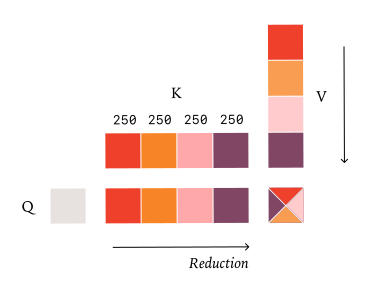
  <br><em>图 12：固定 split 数量会让每段大小依赖当前形状，因此仍可能破坏批不变性。</em>
</p>

常见 Split-KV 会根据需要的并行度决定 split 数量，再把 KV 长度平均分配。这会让归约策略取决于当前处理了多少 query token。文章建议反过来：固定 split size，而不是固定 split 数量。比如 KV 长度为 1000，可以按固定大小 256 切成三段完整块和一段尾块；这样无论一次处理多少 query，K/V 的分段边界都是稳定的。

<p align="center">
  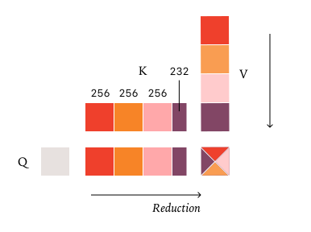
  <br><em>图 13：固定 split size 让归约边界与当前 query 数量解耦，从而保持批不变性。</em>
</p>

归纳起来，批不变注意力需要同时满足：

1. 对 matmul 使用一致的 tile 和 kernel 配置。
2. 对 KV cache 使用一致的逻辑布局，避免 cache 与当前 token 分开形成不同边界。
3. 对 Split-KV 固定每段大小，而不是根据实时 batch/query 情况重新选择拆分数量。

## 7. 实现

作者在 vLLM 之上做了一个 deterministic inference 演示，使用 vLLM 的 FlexAttention backend，并通过 `torch.Library` 以较低侵入方式替换相关 PyTorch operator。批不变 kernel 的代码仓库在：

- https://github.com/thinking-machines-lab/batch-invariant-ops

这个实现重点是证明路径可行，而不是给出最终优化到极限的生产 kernel。因此，后文性能实验里的数字更适合理解“确定性并不一定灾难性变慢”，不应该理解成批不变实现的性能上限。

## 8. 实验

### 8.1 completion 到底有多非确定

作者使用 `Qwen/Qwen3-235B-A22B-Instruct-2507`，在 temperature 为 0 的条件下，对同一个关于 Richard Feynman 的提示生成 1000 次，每次生成 1000 个 token。结果并不是 1000 次完全一致，而是出现了 80 种不同 completion。

这些 completion 在前 102 个 token 上相同，第一次分歧发生在第 103 个 token，位置对应 Feynman 出生地表述。1000 次中，多数继续到 Queens, New York，少数继续到 New York City。启用批不变 kernel 后，1000 次 completion 全部一致。

这个实验很有代表性：温度为 0 并不自动意味着服务端可复现。只有当 kernel 数值路径不受动态 batching 影响时，贪心采样的数学确定性才真正传递到用户可见输出。

### 8.2 性能

作者用单 GPU 的 Qwen-3-8B API server，请求 1000 个输出长度在 90 到 110 之间的序列。结果如下：

| 配置 | 时间 |
| --- | ---: |
| vLLM default | 26 秒 |
| 未优化 deterministic vLLM | 55 秒 |
| 加上改进后的 attention kernel | 42 秒 |

放慢的主要来源之一是 vLLM 中 FlexAttention 集成还没有被深度优化。即便如此，结果也说明批不变推理并不是完全不可用的路线：从默认 26 秒到 42 秒，性能有损失，但不是数量级级别的崩塌。

### 8.3 真正的 on-policy RL

文章还讨论了一个训练侧后果：如果 inference 和 training 的数值路径不同，那么表面上的 on-policy RL 可能暗中变成 off-policy RL。要让 sampler 和 trainer 逐 bit 一致，首先必须让同一个 inference 请求自身可复现。

实验采用 RLVR 设置，数据来自 Bigmath，策略初始化自 Qwen 2.5-VL instruct 8B，最大 rollout 长度为 4096。作者比较了三种情况：

1. 不做 off-policy correction。
2. 使用 importance weighting 做 off-policy correction。
3. 让 sampler 与 trainer bitwise identical，从而实现 True On-Policy。

结果是：不做 correction 时，训练到中途 reward 会崩；加 correction 后训练更平滑；True On-Policy 的 KL divergence 保持在 0，也能平滑训练。原文图中还展示了不加 importance weighting 的 run 在大约 Step 318 附近出现 loss spike，并伴随 logprob KL spike。

<p align="center">
  <em>图 14：原文的双面板交互图比较了 reward、loss 与 sampler/trainer KL；True On-Policy 曲线的 KL 为 0，完整交互图见原文。</em>
</p>

## 9. 结论

文章反对把 LLM 推理中的非确定性简单归因于“系统本来就是概率的”或“GPU 浮点并发没法管”。更准确的诊断是：很多前向 kernel 本身 run-to-run deterministic，但不是 batch-invariant；服务端动态负载改变 batch 形状，单个用户请求就会走到不同数值路径。

解决路线也相应清晰：让 RMSNorm、matmul、attention 等 reduction kernel 的归约顺序不依赖 batch size、query chunking、KV cache 边界和动态 Split-KV 策略。这样做需要性能上的权衡和 kernel 工程投入，但原文实验显示这条路线是现实可行的。

对系统实现者来说，最重要的 takeaways 是：

1. 温度为 0 只解决 sampling 随机性，不自动解决数值路径非确定性。
2. atomic add 不是 LLM 推理前向路径非确定性的主要解释。
3. “服务器整体输入 deterministic”和“单个用户可复现”不是一回事。
4. batch invariance 是把贪心采样变成用户可见确定性的关键系统属性。
5. 真正可复现的推理还能改善训练栈，尤其是希望 sampler 与 trainer 严格一致的 on-policy RL。

## 10. 引用信息

- 文章：Defeating Nondeterminism in LLM Inference
- 作者：Horace He and Thinking Machines Lab
- 发布：Thinking Machines Lab: Connectionism，2025-09
- DOI：10.64434/tml.20250910
- 原文：https://thinkingmachines.ai/blog/defeating-nondeterminism-in-llm-inference/

## 外部链接

- batch-invariant-ops：https://github.com/thinking-machines-lab/batch-invariant-ops
- vLLM：https://github.com/vllm-project/vllm
- SGLang：https://github.com/sgl-project/sglang
- FlashAttention-2：https://arxiv.org/abs/2307.08691
