# 跨张量并行规模的确定性推理：消除训练-推理不匹配

原题：Deterministic Inference across Tensor Parallel Sizes That Eliminates Training-Inference Mismatch

年份：2026

会议/状态：ICML 2026

作者：

- Independent Researcher：Ziyang Zhang
- University of Minnesota, Minneapolis, Minnesota, USA：Xinheng Ding、Zirui Liu
- Rice University, Houston, Texas, USA：Jiayi Yuan、Rixin Liu、Jiarong Xing
- NVIDIA Corp., Santa Clara, California, USA：Huizi Mao

通信作者：Zirui Liu（zrliu@umn.edu）

## 摘要

对于 LLM-as-a-judge 评测、多智能体系统和强化学习（RL）等大型语言模型（LLM）应用，确定性推理正变得越来越关键。然而，现有 LLM 服务框架在张量并行（TP）规模或 batch size 变化时，即使使用贪心解码，也可能对相同输入产生不同输出。这源于浮点算术的非结合性，以及跨 GPU reduction 顺序的不一致。已有工作通过 batch-invariant kernels 解决了与 batch size 相关的非确定性，但跨不同 TP 规模的确定性仍是一个未解决问题，尤其是在 RL 场景中更为突出：训练引擎通常使用 Fully Sharded Data Parallel（FSDP，也就是 TP = 1），而 rollout 引擎为了最大化推理吞吐，会依赖多 GPU TP，由此产生的概率不匹配可能降低训练效果，甚至导致训练崩溃。

本文识别并分析 TP 引起不一致的根因，并提出 **Tree-Based Invariant Kernels（TBIK）**，这是一组自定义矩阵乘法和 reduction kernel，可保证不同 TP 规模下的结果逐比特一致。我们的关键洞察是，在 GPU 内部和 GPU 之间强制采用一致的 reduction 顺序。我们用 Triton 实现 TBIK，并将其集成进 vLLM 与 FSDP，在不同 TP 规模下实现 **逐比特确定性推理**，并在 RL pipeline 的 rollout 与训练引擎之间实现 **零概率偏差**。通过消除不同并行化策略造成的不匹配，TBIK 首次在大规模上支持 **真正的 on-policy RL**，带来更好的模型性能和更快的收敛。

## 1. 引言

大型语言模型（LLM）正越来越多地支撑各种真实世界应用 [1, 2, 3]。在其中许多场景中，可复现性至关重要，这意味着生成过程必须是确定性的：给定固定随机种子和相同输入，模型在不同系统配置和不同运行之间都应产生相同输出。

我们强调，确定性在三类场景中尤其关键。**(1) 使用 LLM-as-a-judge 进行评测** [4, 5, 6, 7, 8]，此时 LLM 被用作评估器来判断其他模型的质量。如果 judge 模型对相同输入给出不一致评估，比较就会变得不可靠。**(2) 多智能体系统**，多个 LLM 协作完成同一任务 [9, 10]。一个模型的非确定性会沿整个系统级联，产生分叉的执行轨迹，并让调试变得困难 [11]。**(3) 使用 LLM 的强化学习（RL）** [12, 13, 14]，训练和 rollout 通常使用不同框架，例如 Fully Sharded Data Parallel（FSDP）[15] 与 vLLM [16]，也使用不同配置，例如不同的张量并行（TP）规模。如图 1 所示，训练引擎和 rollout 引擎计算出的概率存在很大差距，这会显著影响学习过程，并使一个 on-policy RL 过程表现得更像 off-policy [17]。

<p align="center">
  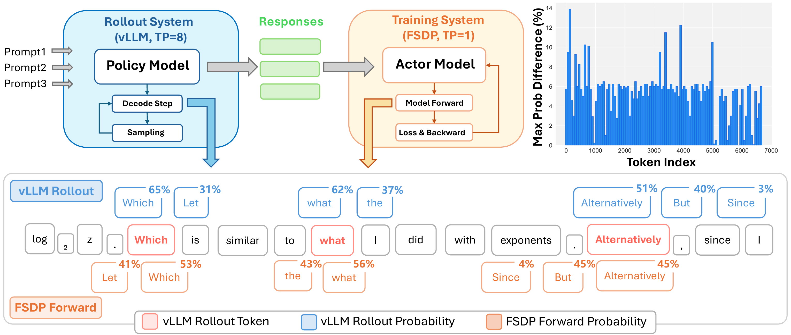
  <br><em>图 1：RL 训练中的概率差异示意。不同框架和 TP 规模会对同一响应产生明显概率差距，阻碍稳定且真正 on-policy 的 RL。</em>
</p>

不幸的是，已有研究表明，确定性是当今 LLM 系统中一种“缺失”的属性。即使在贪心解码下，改变 batch size 和 TP size 等系统配置 [18, 19] 也会让相同输入产生不同输出，并在 AIME 数据集上造成最高 9% 的准确率波动 [18]。

根本原因在于浮点（FP）算术不满足结合律，因此不同计算顺序可能因为舍入误差而产生不同结果。在 LLM 服务系统中，这类变化来自多种来源，包括 continuous batching [20]、张量并行等并行策略，以及不同 kernel 实现等。

为解决这一问题，[19] 提出了 **batch-invariant operations**，包括 batch-invariant FlexAttention [21]、RMSNorm 和矩阵乘法（MatMul）kernel，可保证推理结果不随 batch size 变化而改变。但顾名思义，这项技术目前只消除了 batch size 带来的方差。正如上文所讨论的，很多其他因素也会导致非确定性，而且这些因素往往更难控制。

在本文中，我们的目标是实现 **完全确定性** 的 LLM 推理，并保证 RL pipeline 中 rollout 与训练的逐比特对齐。我们发现，张量并行是最关键且在实践中尚未解决的非确定性来源之一，它也是走向完全确定性推理时缺失的最后一块拼图。

为应对这一挑战，我们的核心思想是对齐跨 GPU 的累加顺序，确保矩阵乘法和 GPU 间 reduction 不论 TP 规模如何，都遵循一致的算术序列。基于这一思想，我们提出 **Tree-Based Invariant Kernels（TBIK）**，用于实现完全确定性推理，并在 RL pipeline 中实现 vLLM 与 FSDP 之间的逐比特对齐。

总之，本文贡献有三点：

- 识别不同 TP 规模下由张量并行引入的非确定性，并分析它对 benchmark 评测和 RL 训练的影响。
- 提出 Tree-Based Invariant Kernels，对 GPU 内矩阵乘法和 GPU 间 All-Reduce 操作都强制采用固定且一致的计算顺序，从而消除 TP 引起的非确定性。
- 通过将 TBIK 集成到 vLLM 与 FSDP 中，实现完全确定性推理，并解决 RL pipeline 中的概率差异问题，从而实现真正的 on-policy RL 训练。

## 2. 背景

### 2.1 IEEE 754 浮点操作不满足结合律

IEEE 754 浮点操作的一个广为人知的问题是它们 **不满足结合律**，即 $(a+b)+c\neq a+(b+c)$ [18]。这意味着数字相加的顺序会因为累计舍入误差而影响最终结果。

许多算法级和系统级工作都试图缓解这一问题。Fused Multiply-Add（FMA）[22] 用于计算 $x * y + z$，它先得到精确的双倍长度乘积，再通过一次舍入完成加法。在 MatMul 和 Flash-Attention [23] kernel 中，常见做法是使用 FP32 accumulator 来 reduce 中间结果。Softmax、RMSNorm 和 RoPE 等其他常用操作也默认设置为 FP32。

### 2.2 非确定性的来源

在现代服务系统中，有多种因素会改变 FP 操作的顺序，从而影响最终结果。**(1) Continuous batching** [20] 会动态改变一个 batch 中的请求集合和 batch size。**(2) 不同操作实现**，例如 Split-K 与 Non-Split-K MatMul [24]，会产生非确定性结果，因为 Split-K 需要累加 partial sum，而这些 partial sum 的组合顺序会随线程调度变化。**(3) 操作超参数**，例如 MatMul 和 Flash-Attention 的 block size，也会改变 kernel 内部具体的累加步骤序列。**(4) 并行系统中的 collective operation**，例如 All-Reduce，通常也是非确定性的，会导致最终聚合值不同。**(5) TP 等并行策略** 会跨 GPU 切分工作负载。**(6) 不同 GPU 架构** 可能依赖不同的 MatMul 底层指令集，例如 Hopper 上的 `wgmma`。

由于这些因素，已有工作 [18] 表明，即使在贪心解码下，推理输出也可能在不同 batch size、GPU 架构和 TP 配置之间显著分叉。

## 3. 动机与挑战

### 3.1 动机：非确定性对 RL 的影响

如第 1 节所述，非确定性会影响许多场景。这里我们以最流行的领域之一，即基于 LLM 的强化学习（RL）为例，展示它的影响。为便于说明，按照 [25]，我们以 REINFORCE 算法为例。它通过如下方式更新策略 $\pi_\theta$：

$$
\theta \leftarrow \theta + \mu \cdot 
\mathbb{E}_{\underbrace{a \sim \pi(\theta)}_{\text{rollout}}}
\!\left[ R(a) \cdot 
\underbrace{\nabla_{\theta} \log \pi(a, \theta)}_{\text{training}} \right],
$$

其中 $a$ 是策略网络 $\pi_\theta$ 生成的 token，$R(a)$ 是 reward。在实践中，rollout 生成由 vLLM 和 SGLang [26] 等推理引擎执行，而模型训练使用另一个后端，例如 FSDP。这种混合设计按如下方式更新参数：

$$
\theta \leftarrow \theta + \mu \cdot 
\mathbb{E}_{a \sim \pi_{\text{rollout}}(\theta)} 
\left[ R(a) \cdot \nabla_{\theta} \log \pi_{\text{learner}}(a, \theta) \right].
$$

即使 $\pi_\text{sampler}$ 和 $\pi_\text{learner}$ 共享完全相同的参数 $\theta$，kernel 实现和框架设置，例如 TP size，之间的差异也可能导致概率计算出现很大差距，如图 1 所示。这会隐式地把 on-policy 更新转化为 off-policy 更新 [25, 27]，从而破坏训练稳定性，并对收敛和策略性能产生负面影响。需要注意，这一问题在 Mixture-of-Experts（MoE）模型 [28, 29] 中比 dense model 更严重，因为概率中的微小扰动就可能让 router 选择完全不同的 expert。关于 RL mismatch 相关工作的扩展讨论见附录 A。

### 3.2 Batch-Invariant Operations 与系统并行性

为解决这一问题，[19] 提出了 **batch-invariant operations（BIO）**，包括 batch-invariant FlexAttention、RMSNorm 和 MatMul kernel，可保证推理结果不随 batch size 改变而变化。具体来说，BIO 通过沿 batch 维度并行化计算，并让每个 batch element 独立计算，从而保证无论 batch size 如何，reduction 顺序都固定。例如在 RMSNorm 中，每个 batch element 都在单个 compute core 上处理，消除了特征维度 reduction 所需的跨 core 通信。在 MatMul 中，每个 core 计算一个 2D tile 的 dot product，并按照 Non-Split-K 策略在本地完成完整 reduction。BIO 对 RMSNorm 与 MatMul 的示意图见附录 B。

然而，“batch-invariant”只是迈向完全确定性推理的第一步。如第 2.2 节所述，仍有许多其他因素会造成非确定性。其中最重要的是与并行性相关的因素。为了理解这一问题，我们先简要概述服务系统中最常用的三种并行策略，并讨论 BIO 在每种策略下的表现。

**数据并行（DP）**。每个 GPU 持有一份完整模型副本，但处理 batch sample 的不同子集，本质上是沿 batch-size 维度切分工作负载。因此，改变 DP 并行度等价于改变 batch size，而 BIO 可以保证结果保持一致。

**流水线并行（PP）**。模型的不同层分布在多个 GPU 或节点上，**这是默认的跨节点并行化策略**。中间 activation 会顺序传给下一 stage，以完成 forward 计算。因此，改变 PP degree 不会影响确定性。

**张量并行（TP）**。每层的权重矩阵被切分到多个 GPU 上，并通过聚合不同 GPU 计算出的 partial result 得到该层完整输出。**TP 是默认的节点内并行化策略**。如第 3.3 节所分析的，改变 TP 配置会改变模型输出，batch-invariant kernels 无法有效处理这种变化。我们在四种 TP 设置（1/2/4/8）下评估 AIME24 数据集中的相同 prompt，发现这些配置产生的输出全部不同。此外，仅改变 TP size 就会让 Qwen3-8B 在 AIME24 数据集上的准确率产生超过 4% 的波动，如图 2 所示。

<p align="center">
  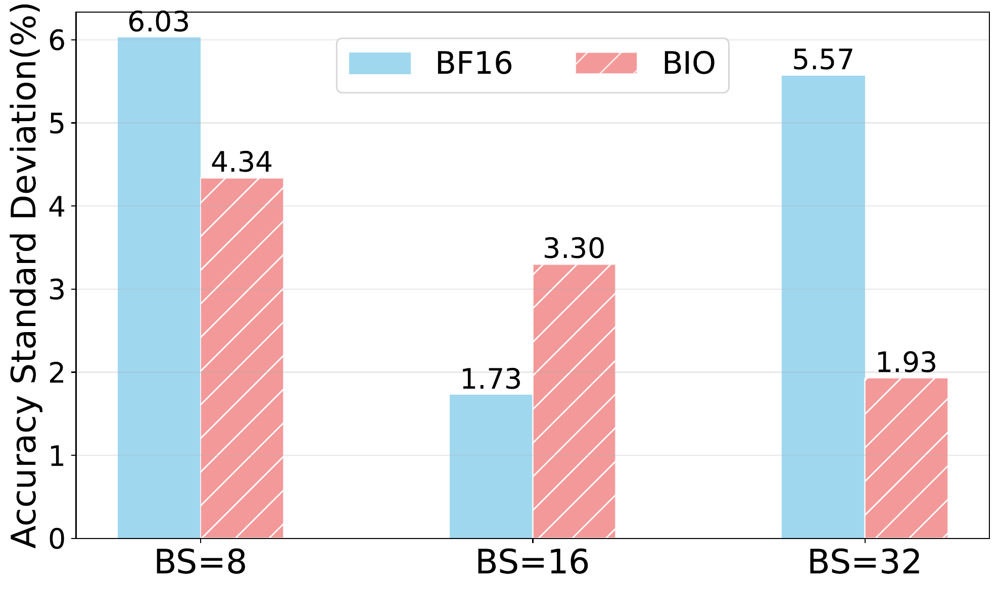
  <br><em>图 2：Qwen3-8B 在 AIME24 数据集上、不同 TP 规模下的准确率标准差，TP = 1/2/4/8。</em>
</p>

值得注意的是，TP 被广泛用于 LLM 服务系统，其规模通常会根据不同环境下的性能需求进行调优。TP size mismatch 在 RL pipeline 中尤其难以避免，因为 rollout 引擎通常使用较大的 TP size 来最大化推理吞吐，而训练引擎往往采用不同策略，例如使用 TP=1 的 FSDP，以提高内存效率。

### 3.3 为什么 BIO 在不同 TP 规模下会失败？

本节先解释张量并行使用的权重切分策略，再识别 batch-invariant operations 无法保证 TP invariance 的底层原因。

图 3 展示了 vLLM 中 Transformer 模型权重在张量并行下如何被切分。总体而言，TP 以两种互补方式分发工作负载：**列并行（Column Parallel）** 和 **行并行（Row Parallel）**。具体来说，self-attention 中的 *QKV proj*，以及 feed-forward network（FFN）中的 *up proj* 和 *gate proj* 被实现为 **列并行** 操作。

<p align="center">
  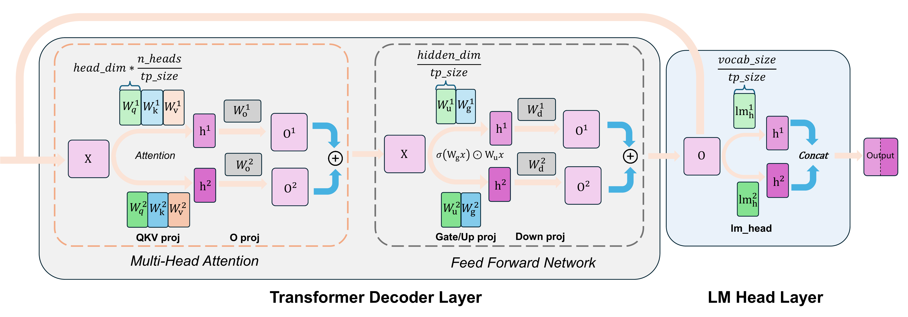
  <br><em>图 3：vLLM 中 Transformer 模型架构的张量并行权重划分示意，例如 Qwen3 Dense。QKV proj、gate proj、up proj 和 lm head 层是列并行，o proj 和 down proj 层是行并行。RMSNorm 和 RoPE 等非 MatMul 操作没有跨 GPU 切分参数和计算，因此为清晰起见未画出。</em>
</p>

在列并行模式下（图 4a），权重矩阵 $W \in \mathbb{R}^{K \times N}$ 沿输出维度切成 $C$ 个 block，其中 $C$ 是 GPU 数量：

$$
W_i \in \mathbb{R}^{K \times \frac{N}{C}}, \quad i = 1, \dots, C.
$$

每个 GPU 计算一个 partial result：

$$
O_i = X W_i, \quad O_i \in \mathbb{R}^{M \times \frac{N}{C}},
$$

输出通过拼接所有 partial result 得到：

$$
O = X W = \big[\, X W_1 \;\; X W_2 \;\; \cdots \;\; X W_C \,\big].
$$

相比之下，attention 中的 *o proj* 和 FFN 中的 *down proj* 是 **行并行**。在行并行模式下（图 4b），输入矩阵 $X$ 沿列切分，而权重矩阵 $W$ 沿行切分，因此每个 GPU 持有一个 slice：

$$
X_i \in \mathbb{R}^{M \times \frac{K}{C}}, \quad
W_i \in \mathbb{R}^{\frac{K}{C} \times N}, \quad i = 1, \dots, C.
$$

每个 GPU 计算 partial product $X_i W_i$，最终输出矩阵通过跨 GPU 对所有 partial result 求和得到：

$$
X W = \sum_{i=1}^{C} X_i W_i.
$$

这一设计需要 collective `all-reduce` 操作来合并 partial result，使输出对求和顺序敏感。

<table align="center">
  <tr>
    <td align="center" width="50%">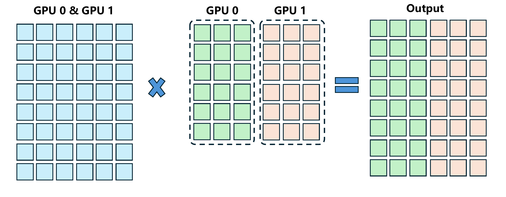<br><em>图 4a：列并行矩阵乘法。</em></td>
    <td align="center" width="50%">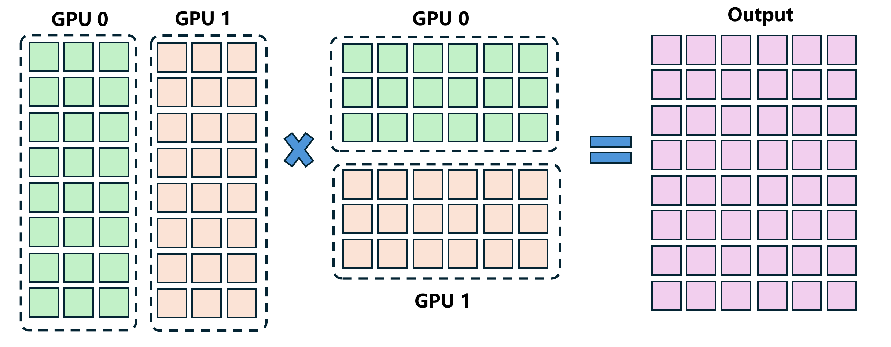<br><em>图 4b：行并行矩阵乘法。</em></td>
  </tr>
</table>

<p align="center"><em>图 4：列并行和行并行 MatMul 示意。</em></p>

这一设计的理由来自 Transformer 层中的数据流。列并行层，例如 *up proj*，的输出会作为后续行并行层，例如 *down proj*，的输入。由于列并行层天然沿 feature 维度切分输出，这些 partition 可以被行并行层直接消费，无需额外同步。然而，行并行 linear layer 是 self-attention 和 FFN 模块中的最后一层，必须通过 `all-reduce` 操作聚合来自所有 GPU 的结果，才能得到当前模块的完整输出。

**改变 TP size 会改变行并行层的计算顺序。** 对于列并行层，改变 TP size 不会影响输出，因为每个 GPU 的输出彼此独立，且没有沿共享维度进行累加。但对于行并行层，输入 $X$ 和权重 $W$ 都沿 $K$ 维度跨 GPU 切分。每个 GPU 计算一个大小为 $M \times N$ 的 partial result，各层再通过逐元素 reduction 聚合所有 GPU 的 partial result。即使 reduction 算法本身是确定性的，参与设备数量也会改变每个元素的计算顺序。如图 5 所示，在使用标准 cuBLAS GEMM 做矩阵乘法时，每个 GPU 先沿 $K$ 维度顺序执行本地 reduction，之后 partial result 再通过 NCCL 沿相同维度跨 GPU reduction。因此，不同 TP size 会改变 reduction 顺序，进而导致输出分叉。也就是说，仅靠 BIO 无法保证跨不同 TP 配置的可复现性。

<p align="center">
  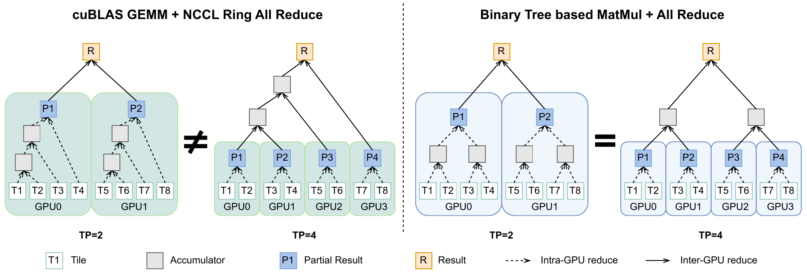
  <br><em>图 5：cuBLAS GEMM 加 NCCL Ring Reduce 与 TBIK 的对比。Ring Reduce 中，GPU 间通信遵循 ring pattern，GPU 内 reduction 顺序执行。TBIK 对 GPU 内和 GPU 间 reduction 都采用层次化树结构，确保不同 TP 规模下的 reduction 顺序一致。</em>
</p>

## 4. Tree-Based Invariant Kernels

本节介绍 **Tree-Based Invariant Kernels（TBIK）** 的设计与实现。TBIK 能够在变化的 TP size 下实现逐比特确定性推理。

### 4.1 总览与设计原则

为了在不同 TP size 下实现完全确定性推理，GPU 内 MatMul 和 GPU 间 reduction 必须协同设计，以保证浮点操作的全局累加顺序保持不变。基于这一洞察，我们提出 **TBIK**，它强制采用一种跨越 GPU 内部与 GPU 间计算的固定层次化 reduction 结构。

TBIK 的核心原则是让累加顺序独立于 TP size。具体而言，我们对本地 MatMul 和分布式 collective operation 施加同一个固定的 full binary-tree reduction topology。每个 partial MatMul result 对应一个叶节点，内部节点执行确定性的成对累加。由于 reduction tree 是固定的，且不依赖 GPU 数量，所有 TP 配置都会遵循相同的累加路径，从而保证确定性结果。理论证明见附录 C。

### 4.2 TBIK 的组成

TBIK 的整体工作流如图 5 所示，包含两个阶段：(i) 在 Tree-Based MatMul kernel 内执行 GPU 内 reduction，如图 11 所示；(ii) 使用遵循相同 tree topology 的自定义 Tree-Based All-Reduce kernel 执行 GPU 间 reduction。

**GPU 内 reduction。** 我们使用 `Triton` [30] 实现 GPU 内 reduction，其中 MatMul 按 tile 计算。具体而言，输入矩阵沿 $K$ 维度划分为多个 tile，并用 $T_K$ 表示这类 tile 的总数。在使用 $C$ 个 GPU 的张量并行下，每个 GPU 处理 $\frac{T_K}{C}$ 个 tile。

为保证确定性的本地累加顺序，我们把 GPU 内 reduction 组织为固定二叉树，而不是顺序累加。中间 partial result 存放在树的不同层级，树深度为 $L = \log_2 \frac{T_K}{C}$。每个 partial MatMul result 对应一个叶节点，内部节点按照预定义 tree topology 执行成对累加。

由于 reduction tree 固定且独立于 TP size，每个 GPU 内的累加顺序在所有 TP 配置下都保持一致。详细 kernel 实现见附录 D.1。

**GPU 间 reduction。** 本地累加之后，每个 GPU 的 partial result 通过 Tree-Based All-Reduce 操作同步。关键在于，GPU 间 reduction 遵循与 GPU 内 reduction 相同的 binary-tree topology，从而保持全局累加顺序。Tree All-Reduce 的实现见附录 D.2。

## 5. 评估

我们的实验主要回答三个研究问题：**RQ1.** 所提出方法是否能在不同 TP size 下实现逐比特一致的结果？**RQ2.** 我们的方法引入了多少开销？**RQ3.** 我们的方法能否从根本上解决 RL 训练中的 precision mismatch 问题？

### 5.1 评估指标

我们使用两个指标评估模型输出的可复现性：**Count of Unique Outputs** 和 **Maximum Probability Divergence**。

**Count of Unique Outputs。** 我们统计同一个 prompt 在 $K$ 次运行中生成的不同 token 序列数量：

$$
U = |\text{unique}(\{y_1, y_2, \ldots, y_K\})|.
$$

$U=1$ 表示不同设置下的输出完全相同。

**Maximum Probability Divergence。** 为评估逐比特可复现性，我们计算 $\Delta_i$，即位置 $i \in \{1,\dots,L\}$ 上 top-5 预测概率在 $K$ 个实验设置之间的最大差异，并报告所有位置上的平均差异。逐比特一致的输出会得到零值。

### 5.2 实验设置

我们在四个来自不同模型家族的模型上做实验：`Qwen3-8B`、`Qwen3-32B` [29]、`Mistral-7B-Instruct-v0.3` [31] 和 `Llama-3.1-8B-Instruct` [32]。Qwen 模型在 thinking mode 下评估，最大输出长度为 8192；instruct 模型的最大输出长度为 2048。

我们在两个常用 benchmark 上评估模型：AIME24 [33] 和 AMC23 [34]，它们测试数值推理和数学问题求解能力。我们在固定随机种子和解码参数的 random sampling 下评估 LLM 可复现性，这更能反映真实使用场景。

实验比较三种方法：(1) vanilla BF16 inference；(2) 只使用 **Batch-Invariant Operations（BIO）** 的推理；(3) 将我们的 **Tree-Based Invariant Kernels** 与 **Batch-Invariant Operations** 结合的推理，即 **BIO+TBIK**。对于 **BIO**，我们使用 [19] 的实现。对于每个 model-dataset pair，我们在 12 种不同 runtime configuration 下评估，即 4 种 TP size（1/2/4/8）与 3 种 batch size（8/16/32）的所有组合，以模拟真实推理部署中常见的多样环境。对于 Qwen3-32B，由于 GPU 内存限制，我们采用 9 种 runtime configuration，即 3 种 TP 设置（2/4/8）与 3 种 BS 设置（8/16/32）。

我们在两种不同 GPU 类型上重复上述实验，即 NVIDIA RTX PRO 6000 和 NVIDIA L40S，以验证结果在异构硬件环境中的一致性。实验使用 `vLLM` [16] 作为推理后端。更多实验设置细节见附录 E 和附录 F。

### 5.3 可复现性评估

如表 1 所示，在 vanilla BF16 inference 下，平均 Count of Unique Outputs 接近不同 runtime configuration 的数量，说明改变任意单个系统配置都会导致不同输出。当只应用 BIO 时，平均 Count of Unique Outputs 下降，因为当 TP 等于 1 或 2 时，不同 batch size 可以得到一致输出，体现出“batch invariance”属性。这里需要澄清，BIO 保证在 TP=1 或 TP=2 运行时，不同 batch size 下结果一致，但 TP=1 和 TP=2 下产生的输出彼此并不相同。然而，当 $TP > 2$ 或使用不同 TP size 时，BIO 不能维持一致性。相比之下，BIO+TBIK 设置在所有系统配置下都持续产生相同推理输出。

表 1：AIME24 和 AMC23 上的 Average Count of Unique Outputs。对每个 prompt，在 12 个 runtime configuration 下生成输出（BS=8/16/32；TP=1/2/4/8）。Qwen3-32B 在 9 个 configuration 下评估（BS=8/16/32；TP=2/4/8）。“1” 表示所有配置下输出相同。

| Model | Method | AIME'24 | AMC'23 |
| --- | --- | ---: | ---: |
| Qwen3-8B | BF16 | 12.00 | 10.85 |
| Qwen3-8B | BIO | 7.87 | 7.78 |
| Qwen3-8B | BIO+TBIK | **<u>1</u>** | **<u>1</u>** |
| Mistral-7B-Instruct | BF16 | 12.00 | 11.08 |
| Mistral-7B-Instruct | BIO | 7.97 | 7.75 |
| Mistral-7B-Instruct | BIO+TBIK | **<u>1</u>** | **<u>1</u>** |
| Llama-3.1-8B-Instruct | BF16 | 9.60 | 9.85 |
| Llama-3.1-8B-Instruct | BIO | 7.20 | 7.13 |
| Llama-3.1-8B-Instruct | BIO+TBIK | **<u>1</u>** | **<u>1</u>** |
| Qwen3-32B | BF16 | 9.00 | 8.00 |
| Qwen3-32B | BIO | 6.90 | 6.75 |
| Qwen3-32B | BIO+TBIK | **<u>1</u>** | **<u>1</u>** |

表 2 报告两个数据集上的平均 Maximum Probability Divergence。与 vanilla BF16 inference 相比，BIO 略微降低概率差异，但仍存在不可忽略的偏差。相比之下，BIO+TBIK 在所有实验设置下都实现严格为零的 Maximum Probability Divergence，说明 LLM 推理达到逐比特确定性。上述结果在 NVIDIA L40S 上得到，NVIDIA RTX PRO 6000 上的更多实验结果见附录 G。

表 2：AIME24 和 AMC23 上的 Average Maximum Probability Divergence（×10^-3）。更大的值表示更大的数值差异，0 表示输出逐比特一致。

| Model | Method | AIME'24 | AMC'23 |
| --- | --- | ---: | ---: |
| Qwen3-8B | BF16 | 10.01 | 6.79 |
| Qwen3-8B | BIO | 9.10 | 6.90 |
| Qwen3-8B | BIO+TBIK | **<u>0</u>** | **<u>0</u>** |
| Mistral-7B-Instruct | BF16 | 17.37 | 19.88 |
| Mistral-7B-Instruct | BIO | 14.10 | 15.87 |
| Mistral-7B-Instruct | BIO+TBIK | **<u>0</u>** | **<u>0</u>** |
| Llama-3.1-8B-Instruct | BF16 | 26.48 | 31.09 |
| Llama-3.1-8B-Instruct | BIO | 27.54 | 21.06 |
| Llama-3.1-8B-Instruct | BIO+TBIK | **<u>0</u>** | **<u>0</u>** |
| Qwen3-32B | BF16 | 8.01 | 9.80 |
| Qwen3-32B | BIO | 7.79 | 8.97 |
| Qwen3-32B | BIO+TBIK | **<u>0</u>** | **<u>0</u>** |

### 5.4 性能评估

本节展示 Tree-Based MatMul Kernel 的性能评估，以及将 TBIK 集成进 SGLang [26] 后的端到端延迟。

**Kernel 级比较。** 对于图 6 所示的 kernel throughput 分析，我们观察到，在较小 $M$ 下，我们的 MatMul kernel 比 cuBLAS 慢，原因是固定 block-size 约束引入了明显计算开销。随着 batch size 增大，我们的 kernel 达到 cuBLAS 性能的 63%，BF16 下约为 120 TFLOPS，而 cuBLAS 约为 190 TFLOPS。这一开销主要来自 tree-reduction 操作需要额外临时 accumulator，从而增加 I/O 和算术操作。在 FP32 设置下，这些开销的影响得到缓解，两种 kernel 达到相近性能。**我们强调，当前 Tree-Based MatMul kernel 实现主要用于证明 TP-Invariant deterministic inference 是可实现的。** 通过引入 block size tuning 和 warp specialization 等高级优化，性能还可以进一步提升，这些技术已被证明能显著增强性能 [35]。

<p align="center">
  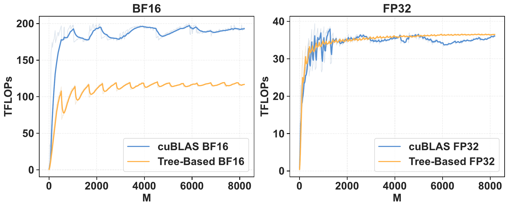
  <br><em>图 6：在 M 变化且 K=6144、N=2048 时，Tree-Based MatMul kernel 与 cuBLAS MatMul kernel 在 BF16 和 FP32 上的吞吐对比。</em>
</p>

**端到端延迟比较。** 我们使用四张带 NVLink 的 NVIDIA H20（TP=4）测量 Qwen3-8B 模型在不同输入和输出长度下的端到端延迟，batch size 为 64。对于 BIO，我们使用 SGLang 的实现。如图 7 所示，与 vanilla BF16 inference 相比，使用 BIO+TBIK 的完全确定性推理会引入显著开销。该开销可以清晰归因于两个部分：BIO 模块本身相对于 BF16 带来约 $10\sim33\%$ 的开销，而 pure TBIK，也就是 BIO 之上的额外成本，相对于 BF16 又带来 $5\sim30\%$。综合来看，相比 vanilla BF16 baseline，BIO+TBIK 的总开销范围为 $22\%$ 到 $63\%$。对于 TBIK，这些成本来自未优化 Tree-Based MatMul 相比 cuBLAS BF16 更低的吞吐，以及我们采用的次优 deterministic Tree-Based All-Reduce 操作。TBIK 计算成本的细粒度分解见附录 H。该分解显示，MatMul kernel 占 $2\sim25\%$ 的开销，All-Reduce 操作最多引入 $10\%$ 开销。

<p align="center">
  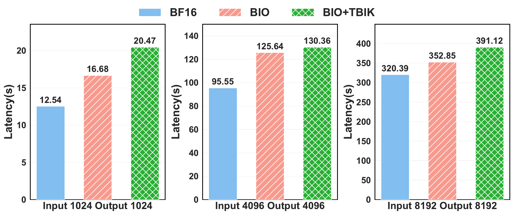
  <br><em>图 7：Qwen3-8B 模型在四张带 NVLink 的 NVIDIA H20 GPU 上的端到端延迟，batch size 为 64，并改变输入和输出长度。</em>
</p>

总之，我们展示了确定性推理的性能是可以接受的。尽管与 normal-mode execution 相比，确定性推理会引入较大开销，但对于需要可靠调试和可复现结果的场景而言，这一权衡不可或缺。通过对 TBIK 的 Tree-Based MatMul kernel 和 Tree-Based All-Reduce 组件应用高级优化，并改进 vLLM 和 SGLang 中 BIO 模块的集成和综合优化，性能还可以进一步提升。

### 5.5 弥合 RL 中 vLLM 与 FSDP 之间的概率差距

这里我们将 TBIK 集成到 RL 训练 pipeline 中，以解决训练和 rollout 引擎之间的概率不匹配问题。具体来说，我们把 kernel patch 到 vLLM 和 FSDP 中。实现细节见附录 I.1。

结果是，我们成功在 **vLLM** 和 **FSDP** 之间实现完全确定性。我们首先检查两个引擎在 AIME prompt 上的逐 token 概率差异。如图 9 所示，BIO 略微降低两个引擎之间的概率差异，但仍存在明显 gap。相比之下，TBIK 完全 **消除了概率 gap**，在所有 token 上产生逐比特一致的概率。

<p align="center">
  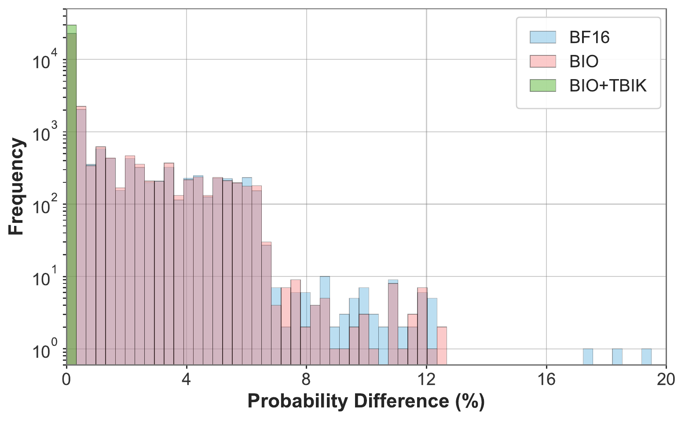
  <br><em>图 9：四张 NVIDIA L40S GPU 上，Qwen3-8B 中 vLLM（TP = 4）与 FSDP（TP = 1）之间逐 token 概率差异的统计。本文方法消除了所有概率差距。</em>
</p>

随后，我们使用 GSM8K 数据集 [36] 和四张 L40S GPU 评估本文方法在 RL 训练中的效果，其中 vLLM 使用 TP size 4 执行 rollout。详细训练配置见附录 I.2。我们测量关键 RL 指标，包括 **Entropy**、rollout 与训练引擎之间的 **KL Divergence**、**Reward** 和 **Pass@1**。如图 8 所示，vanilla BF16 设置在 rollout 与训练引擎之间存在持续 mismatch，导致整个训练过程中 KL divergence 始终非零。BIO 提升了稳定性并降低 divergence，但仍存在明显 gap。相比之下，TBIK 实现零 KL divergence，说明 **rollout 与训练之间的结果逐比特一致**，从而支持更快收敛、持续更高的 reward，以及更好的 Pass@1 性能。尤其值得注意的是，TBIK 在前 20 个训练 step 内 Pass@1 就超过 0.6，最终达到 0.73，而 BIO 为 0.68，BF16 为 0.60。

<p align="center">
  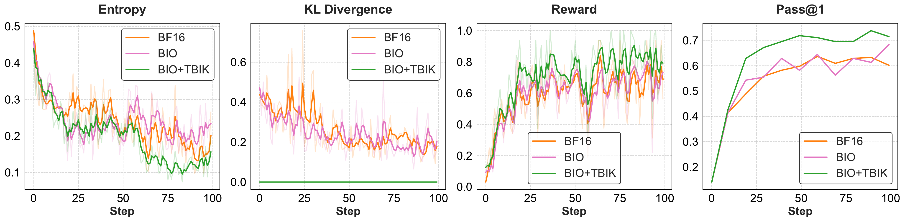
  <br><em>图 8：使用 Qwen3-1.7B 和四张 L40S GPU 在 GSM8K 上进行 RL 训练（GRPO）的指标。</em>
</p>

## 6. 结论与未来工作

本文提出 TBIK，这是一个能够在不同 TP size 下实现确定性 LLM 推理的框架。通过对 GPU 内和 GPU 间计算都强制采用统一的二叉树 reduction 顺序，TBIK 消除了张量并行引入的非确定性。当集成到 vLLM 和 FSDP 中时，TBIK 在不同 TP 配置和不同框架之间产生逐比特一致的输出。更重要的是，通过消除 rollout 与训练引擎之间的概率不匹配，TBIK 在实际多 GPU 设置中支持真正的 on-policy RL。我们的 RL 实验展示了更快收敛和更强最终性能，说明弥合这一数值 gap 对稳定且有效的 RL 训练至关重要。

展望未来，一个自然扩展方向是支持高效 LLM 中常用的量化数据类型 [37, 38, 39, 40]。通过把相同的确定性保证带到量化设置中，我们希望将确定性推理从一种“good-to-have”属性提升为可靠评测和 on-policy RL 训练中的“must-have”要求。

## 影响声明

本文工作的目标是通过改善大型语言模型推理和强化学习 pipeline 的确定性与可复现性，推动机器学习领域发展。这项工作的主要影响是技术性的，旨在提升实验可靠性、公平 benchmark 和稳定的 on-policy 强化学习。

我们没有预见到这项工作会直接带来即时的负面伦理影响。更确定、更可复现的系统实际上可能支持更负责任的研究实践，使结果更容易验证和比较。与大多数大规模机器学习系统进展一样，更广泛的社会后果取决于模型本身的下游应用，而这些超出了本文范围。

## 附录 A. RL mismatch 相关工作

除了本文特定的 kernel 级解决方案，社区还提出了若干有效的算法级修复方法来稳定 RL 训练，尤其是在存在 Training-Inference Mismatch 时。这些方法包括：采用 FP16 作为模型 dtype，以减少 BF16 精度误差造成的数值分叉 [41]；应用 Sequence-level Importance Sampling（SIS）[27]，在整条生成序列上计算 importance weight，并使用 sequence-level reweighting 或 masked IS 来校正跨 trajectory 的分布偏移；使用 Truncated Importance Sampling（TIS）[42]，计算 token-level importance ratio 并截断它们，以稳定方式校正概率差异；以及使用 Group Sequence Policy Optimization（GSPO）[43]，它在序列层面而非 token 层面执行优化，从而降低方差并稳定训练。尽管如此，这些方法只能部分缓解 mismatch，并不能实现逐比特一致、真正 on-policy 的强化学习。

## 附录 B. Batch Invariant Operations

Batch Invariant Operations 通过实现 kernel，让每个 sample 遵循固定计算路径，并且不依赖 batch size。对于 RMSNorm，每个 token 被独立处理，hidden dimension 上的 reduction 以固定累加顺序执行。对于 MatMul，每个输入行都使用固定 tiling 策略独立计算，并沿 $K$ 维度使用固定 reduction 顺序。因此，改变 batch size 只会改变启动多少行，而不会改变任何单个行的计算顺序。图 10 展示 BIO 对 RMSNorm 和 MatMul 的实现。

<p align="center">
  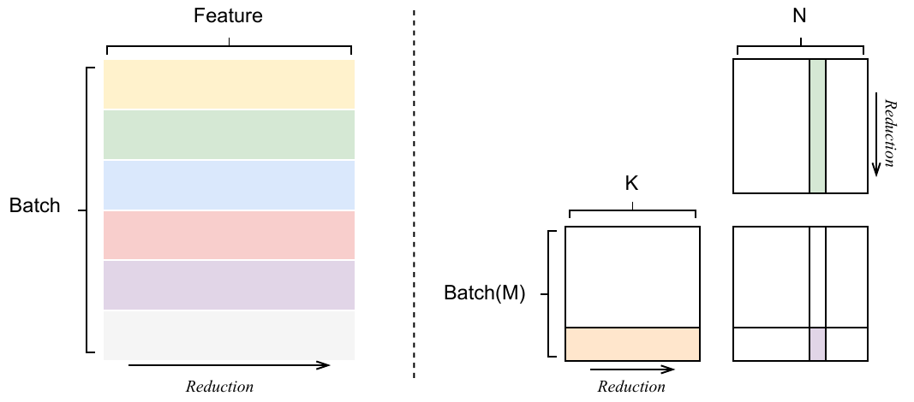
  <br><em>图 10：Batch Invariant Operations 的实现。左：RMSNorm。右：MatMul。</em>
</p>

## 附录 C. 理论证明

这里给出 TBIK 正确性的理论证明。

**算子定义。** 在 full binary-tree topology 上，通过递归定义序列上的 $T(\cdot)$：

$$
T(k_1,\dots,k_{2^t})
= 
\begin{cases}
k_1, & t = 0, \\
k_1 \oplus k_2, & t = 1, \\
T\big( \, T(k_1,\dots,k_{2^{t-1}}),\; T(k_{2^{t-1}+1},\dots,k_{2^t}) \, \big), & t > 1.
\end{cases}
$$

也就是说，$T(\cdot)$ 按照 $\mathcal{T}^\ast$ 的 parent-child 结构执行 pairwise reduction，其中每个内部节点将算子 $\oplus$ 作用于两个 child subtree 的输出。

**定理 1。** 设 $N$ 为 tile 总数，$C$ 为 TP size，且 $C$ 是 2 的幂。如果 $N$ 个 tile 被均匀划分到 $C$ 个 GPU 上，那么在上面定义的算子 $T(\cdot)$ 下，层次化 reduction 顺序不随 TP size 改变。

**证明概要。** 定义 $M = N / C$ 为每个 GPU 上的 tile 数量，并给每个 GPU $d=1,\dots,C$ 分配连续 tile：

$$
\mathcal L_d = \{ k_{(d-1)M+1}, \dots, k_{dM} \}.
$$

我们证明：

$$
T(k_1,\dots,k_N) = T\big( T(\mathcal L_1), \dots, T(\mathcal L_C) \big),
$$

其中 $T(\cdot)$ 是上面定义的 binary-tree operator。

**Base case（$C=1$）。** 当只有一个 GPU 时，$\mathcal L_1$ 包含所有 tile，因此

$$
T(k_1,\dots,k_N) = T(\mathcal L_1),
$$

结论显然成立。

**Inductive step。** 假设等式对 $C/2$ 个 GPU 成立。对于 $C$ 个 GPU，将 GPU 分成前一半（block $\mathcal L_1,\dots,\mathcal L_{C/2}$）和后一半（block $\mathcal L_{C/2+1},\dots,\mathcal L_C$）。根据归纳假设，每一半内部的 reduction 满足：

$$
\begin{aligned}
&T(k_1,\dots,k_{N/2}) = T(T(\mathcal L_1),\dots,T(\mathcal L_{C/2})) \\
&T(k_{N/2+1},\dots,k_N) = T(T(\mathcal L_{C/2+1}),\dots,T(\mathcal L_C)).
\end{aligned}
$$

全局 reduction 对这两半应用 $T$：

$$
T(k_1,\dots,k_N) = T\big( T(k_1,\dots,k_{N/2}), T(k_{N/2+1},\dots,k_N) \big),
$$

根据归纳假设，这等于：

$$
T\big( T(\mathcal L_1),\dots,T(\mathcal L_C) \big).
$$

因此，通过递归，层次化 reduction 执行了与全局 reduction 完全相同的 pairwise $\oplus$ 操作序列，所以结果逐比特一致。证毕。

## 附录 D. TBIK 实现细节

### D.1 Tree-Based MatMul Kernel

为了以固定 reduction 顺序实现树结构累加，中间 partial result 必须临时存储。在 TBIK 中，每个 GPU 负责处理 reduction 维度上的 $\frac{T_K}{C}$ 个 tile，其中 $T_K$ 是 tile 总数，$C$ 表示 GPU 数量。我们证明至少需要 $L$ 个 accumulator，其中

$$
L = \log_2 \frac{T_K}{C}
$$

对应 binary reduction tree 的深度。因此，为计算每个输出 tile，我们分配形状为 $[L, \texttt{Block}_M, \texttt{Block}_N]$ 的 accumulator buffer $S$。

在计算过程中，从 $A$ 中顺序加载形状为 $[\texttt{Block}_M, \texttt{Block}_K]$ 的 tile，并从 $B$ 中顺序加载形状为 $[\texttt{Block}_K, \texttt{Block}_N]$ 的 tile。每个 partial product 首先累加到 $S$ 的 level-0 buffer。为跟踪 reduction 状态，我们维护长度为 $L$ 的 counter tensor $\texttt{Count}$，其中 $\texttt{Count}[l]$ 记录当前存放在 level $l$ 的 partial sum 数量。当 $\texttt{Count}[l]$ 达到 2 时，触发 **carry-over** 操作：level $l$ 上的两个 partial sum 被 reduce，并通过以下方式传播到 level $l+1$：

$$
S[l+1] = S[l+1] + S[l],
$$

随后 level $l$ 上的值和 counter 都被清空。这个层次化 reduction 会持续到沿 $K$ 维度的所有 tile 都处理完毕，最终输出存放在 $S[L]$ 中。

当 $T_K$ 不是 2 的幂时，例如 Qwen3-1.7B 的 `down_proj` 层中 $K=6144$ 且 $\texttt{Block}_K$ 是 2 的幂，我们引入自适应参数 $K_{\text{first}}$，用于控制在第一次 carry-over 之前累加多少个 tile。尽管这放宽了第一层 reduction 中严格的二叉模式，但只要满足

$$
\frac{T_K}{C \times K_{\text{first}}} \geq TP_{\max},
$$

整体累加顺序仍保持不变。

图 11 展示 TBIK 中 Tree-Based MatMul kernel 的整体工作流，算法 1 给出其实现细节。

<p align="center">
  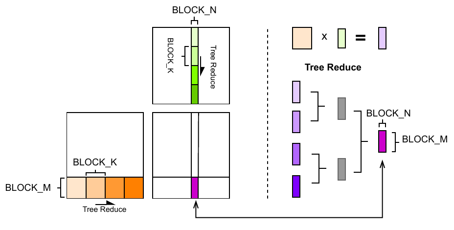
  <br><em>图 11：Tree-Based MatMul kernel 示意。</em>
</p>

算法 1：Tree-Based MatMul Kernel

```text
Require:
  矩阵 A in R^{M x K}，B in R^{K x N}
  block sizes B_M, B_N, B_K
  total tiles T = K / B_K
  first level tile count K_first
  reduction depth L = log2(T / K_first) + 1

Ensure:
  输出矩阵 C in R^{M x N}

For all blocks (m,n) in grid (ceil(M/B_M), ceil(N/B_N)) in parallel:
  初始化本地 accumulator: acc[B_M][B_N] <- 0
  初始化 scratch buffers: S[L][B_M][B_N] <- 0
  初始化 counters: Count[L] <- 0

  For t = 0 to T-1:
    加载 tile A_t = A[m:m+B_M, tB_K:(t+1)B_K]
    加载 tile B_t = B[tB_K:(t+1)B_K, n:n+B_N]
    acc <- acc + A_t B_t

    level <- 0
    While level < L:
      If (level = 0 and Count[level] + 1 = K_first)
         or (level > 0 and Count[level] + 1 = 2):
        acc <- acc + S[level]
        S[level] <- 0
        Count[level] <- 0
        level <- level + 1
      Else:
        S[level] <- acc
        Count[level] <- Count[level] + 1
        break

  C[m:m+B_M, n:n+B_N] <- acc
```

### D.2 Tree-Based All-Reduce

算法 2：Tree-Based All-Reduce

```text
Require:
  rank r 上的本地 tensor x
  world size W = 2^q

Ensure:
  all-reduced tensor x

buf <- x

// Reduce phase
For ell = 0 to q-1:
  s <- 2^ell
  If r mod 2s = 0:
    buf <- buf + Recv(r+s)
  Else if r mod 2s = s:
    Send(buf, r-s)
    break

// Broadcast phase
For ell = q-1 down to 0:
  s <- 2^ell
  If r mod 2s = 0:
    Send(buf, r+s)
  Else if r mod 2s = s:
    buf <- Recv(r-s)

return buf
```

我们没有直接采用 NCCL 内置的 tree all-reduce 算法，因为 NCCL 只允许用户指定 **跨节点** 的 tree topology，而 **在每个节点内部** 仍默认采用 chain-based reduction。在典型部署场景中，张量并行应用在同一节点内的多个 GPU 上。因此，为确保节点内 reduction 也严格遵循 tree-structured topology，我们实现了算法 2 所示的自定义 tree all-reduce 算法。

## 附录 E. 实验设置补充细节

### E.1 Random Sampling 的解码参数

解码参数按照 Qwen3 Technical Report [29] 提供的官方最佳实践设置：对于 reasoning model，temperature = 0.6、top-p = 0.95、top-k = 20；对于 non-reasoning model，temperature = 0.7、top-p = 0.8、top-k = 20。

### E.2 vLLM 中的确定性推理

为在 vLLM 中启用确定性推理，我们的所有实验都在 eager mode 下进行，此时 CUDA Graphs 被禁用，prefix caching 也被关闭。我们将随机种子固定为 42。

然而，vLLM v1 engine 默认启用 chunked prefill，且不允许用户禁用 [44]。这种 chunking 策略可能与确定性推理需求冲突 [45]。为了在有限 GPU 内存下高效处理长 prompt，vLLM 会把一个序列的 prefill 过程划分为多个 chunk。即使底层计算 kernel 是确定性的，这种 chunked execution 也会改变计算和调度顺序。此外，这个过程对用户不可见，也不能被显式控制。

我们观察到，这些隐式优化确实会在实践中影响模型输出。当模型规模或 batch size 较大时，GPU 内存受限。在这些条件下，推理过程无法做到 run-to-run deterministic，即使在 TP=1 下，batch-invariant operations（BIO）也不能在 batch size 改变时完全保证可复现输出。为消除这类服务系统调度行为对本文方法评估的影响，我们在 NVIDIA L40S 上的 Qwen3-32B、TP=2 实验中设置 `max_num_seqs=1`。

## 附录 F. TBIK Block Size 选择

本节给出 TBIK 中使用的 block size，即 $Block_M$、$Block_N$ 和 $Block_K$。为达到最优吞吐，我们对不同数据类型采用不同配置，如表 5 所示。Block size 通过在 NVIDIA L40S GPU 上对 16、32、64、128、256 这些值进行 grid search 得到，并为每种数据类型选择吞吐最高的配置。

表 5：TBIK 的 block size 设置。

| Dtype | BLOCK_M | BLOCK_K | BLOCK_N |
| --- | ---: | ---: | ---: |
| BF16 | 64 | 256 | 128 |
| FP16 | 64 | 256 | 128 |
| FP32 | 32 | 128 | 64 |

## 附录 G. 可复现性评估补充结果

### G.1 NVIDIA RTX PRO 6000 GPU 上的 Average Count of Unique Outputs

表 3：AIME24 和 AMC23 上的 Average Count of Unique Outputs。对每个 prompt，在 12 个 runtime configuration 下生成输出（BS=8/16/32；TP=1/2/4/8）。Qwen3-32B 在 9 个 configuration 下评估（BS=8/16/32；TP=2/4/8）。“1” 表示所有配置下输出相同。

| Model | Method | AIME'24 | AMC'23 |
| --- | --- | ---: | ---: |
| Qwen3-8B | BF16 | 12.00 | 11.20 |
| Qwen3-8B | BIO | 7.87 | 7.53 |
| Qwen3-8B | BIO+TBIK | **<u>1</u>** | **<u>1</u>** |
| Mistral-7B-Instruct | BF16 | 11.97 | 11.13 |
| Mistral-7B-Instruct | BIO | 7.97 | 7.58 |
| Mistral-7B-Instruct | BIO+TBIK | **<u>1</u>** | **<u>1</u>** |
| Llama-3.1-8B-Instruct | BF16 | 9.37 | 9.55 |
| Llama-3.1-8B-Instruct | BIO | 7.00 | 6.80 |
| Llama-3.1-8B-Instruct | BIO+TBIK | **<u>1</u>** | **<u>1</u>** |
| Qwen3-32B | BF16 | 9.00 | 8.20 |
| Qwen3-32B | BIO | 6.87 | 6.73 |
| Qwen3-32B | BIO+TBIK | **<u>1</u>** | **<u>1</u>** |

如表 3 所示，在系统配置变化时，vanilla BF16 inference 呈现出很高非确定性。BIO 可以部分缓解这一问题，因为当 TP size 为 1 或 2 时，在不同 batch size 下可以得到一致结果。将 BIO 与 TBIK 结合后，所有模型在 AIME24 和 AMC23 数据集上的 average number of unique outputs 都下降到 1，说明在所有测试配置下都实现了完全确定性输出。这一观察与我们在 NVIDIA L40S GPU 上得到的实验结果一致。

### G.2 NVIDIA RTX PRO 6000 GPU 上的 Average Maximum Probability Divergence

表 4：AIME24 和 AMC23 上的 Average Maximum Probability Divergence（×10^-3）。更大的值表示更大的数值差异，0 表示预测 token 概率分布在所有被评估 runtime configuration 下逐比特一致。

| Model | Method | AIME'24 | AMC'23 |
| --- | --- | ---: | ---: |
| Qwen3-8B | BF16 | 9.72 | 7.63 |
| Qwen3-8B | BIO | 8.35 | 7.14 |
| Qwen3-8B | BIO+TBIK | **<u>0</u>** | **<u>0</u>** |
| Mistral-7B-Instruct | BF16 | 15.58 | 19.48 |
| Mistral-7B-Instruct | BIO | 14.85 | 17.44 |
| Mistral-7B-Instruct | BIO+TBIK | **<u>0</u>** | **<u>0</u>** |
| Llama-3.1-8B-Instruct | BF16 | 31.84 | 27.04 |
| Llama-3.1-8B-Instruct | BIO | 31.65 | 25.95 |
| Llama-3.1-8B-Instruct | BIO+TBIK | **<u>0</u>** | **<u>0</u>** |
| Qwen3-32B | BF16 | 9.84 | 9.34 |
| Qwen3-32B | BIO | 8.32 | 8.57 |
| Qwen3-32B | BIO+TBIK | **<u>0</u>** | **<u>0</u>** |

表 4 展示两个数据集上的 average Maximum Probability Divergence。与 vanilla BF16 inference 相比，BIO 由于其并行策略和对 reduction 操作的控制，略微减少了 token 预测概率的波动。然而，它仍无法处理 TP 变化造成的差异。相比之下，BIO+TBIK 在所有实验设置下都实现严格为零的 Maximum Probability Divergence，说明 LLM 推理逐比特确定。这一观察与我们在 NVIDIA L40S GPU 上得到的实验结果一致。

## 附录 H. 性能评估补充结果

### H.1 TBIK 的细粒度延迟分解

为更好理解 TBIK 的两个核心组件，即 Tree-Based MatMul kernel 和 Tree-Based All-Reduce 操作，对整体端到端性能的贡献，我们评估五种配置：(1) vanilla BF16 inference；(2) 启用 BIO；(3) BIO 加仅 Tree-Based All-Reduce，不包含 Tree-Based MatMul；(4) BIO 加仅 Tree-Based MatMul，不包含 Tree-Based All-Reduce；(5) BIO 同时启用两个组件。

图 12 展示不同输入/输出长度下的延迟分解。尽管 Tree-Based MatMul 相比 cuBLAS BF16 实现吞吐更低，它只引入 2-25% 的开销。影响有限的原因是，row-split linear layer 只占模型总计算的一小部分，因此它的低效率对端到端延迟影响很小。

相比之下，Tree-Based All-Reduce 操作最多引入约 10% 的开销。该开销是在配备 NVLink 的 GPU 上评估的，主要来自我们当前自定义实现缺乏低层 kernel 优化，而不是 tree-based 设计本身的固有限制。

<p align="center">
  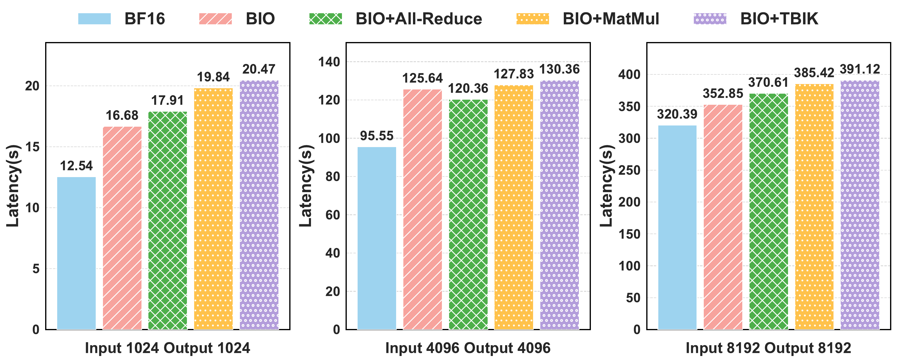
  <br><em>图 12：Qwen3-8B 模型在四张 NVIDIA H20 GPU 上的细粒度端到端延迟分解，batch size 为 64，并改变输入和输出长度。</em>
</p>

## 附录 I. On-Policy RL 的实现与训练细节

### I.1 vLLM 和 FSDP 的框架修改

下面介绍除本文 kernel 之外，为确保 vLLM 和 FSDP 对齐所做的实现细节。为消除这些差异，我们对 vLLM 和 FSDP 都引入以下框架级修改：

1. **Linear Layers。** 我们用自定义 kernel 替换标准 linear layer，以保证 batch invariance 和 TP invariance。具体来说，在 vLLM 中，我们对列并行层（`qkv_proj`、`up_proj`、`gate_proj` 和 `lm_head`）使用 BIO，对行并行层（`down_proj` 和 `o_proj`）使用 Tree-Based MatMul kernel。

2. **Attention。** 为保证确定性，我们固定 TritonAttention 中的 tile size，以启用 batch invariance。此外，我们禁用 vLLM 中的 chunked prefill，并强制 prefill 和 decode 阶段使用相同 attention kernel。这一调整是必要的，因为 FSDP 训练只涉及 prefill 阶段；因此，我们禁用 vLLM 中这些 decode-side 优化。同一个修改后的 attention backend 也应用到 FSDP。

3. **Other Kernels。** 对于 RMSNorm、RoPE embedding 和 SiLU activation 等其他 kernel，我们在 FSDP 中使用与 vLLM 相同的 kernel 实现，以保证一致性。

### I.2 RL 训练细节

我们在 online RL 设置下使用 GSM8K 数据集上的 GRPO 评估 TBIK。所有实验都在四张 NVIDIA L40S GPU 上进行，其中 vLLM 使用 TP size 4，FSDP 使用 TP size 1。

我们抽取 256 个 GSM8K 问题用于训练，64 个问题用于评估。最大 new token 数设置为 512。我们使用 group size 8、rollout batch size 64 和 training batch size 32。学习率在整个训练过程中固定为 $1\times10^{-5}$。

## 参考文献

[1] Chang, Yupeng, Wang, Xu, Wang, Jindong, Wu, Yuan, Yang, Linyi, Zhu, Kaijie, et al.。A survey on evaluation of large language models。ACM transactions on intelligent systems and technology。2024。

[2] Yuan, Jiayi, Zhang, Jiamu, Wen, Andrew, Hu, Xia。The Science of Evaluating Foundation Models。arXiv preprint arXiv:2502.09670。2025。

[3] Yan, Shuo, Li, Ruochen, Luo, Ziming, Wang, Zimu, Li, Daoyang, Jing, Liqiang, et al.。LMR-BENCH: Evaluating LLM Agent's Ability on Reproducing Language Modeling Research。Proceedings of the 2025 Conference on Empirical Methods in Natural Language Processing。2025。https://aclanthology.org/2025.emnlp-main.314/。

[4] Zheng, Lianmin, Chiang, Wei-Lin, Sheng, Ying, Zhuang, Siyuan, Wu, Zhanghao, Zhuang, Yonghao, et al.。Judging llm-as-a-judge with mt-bench and chatbot arena。Advances in neural information processing systems。2023。

[5] Haitao Li, Qian Dong, Junjie Chen, Huixue Su, Yujia Zhou, Qingyao Ai, et al.。LLMs-as-Judges: A Comprehensive Survey on LLM-based Evaluation Methods。CoRR。2024。https://doi.org/10.48550/arXiv.2412.05579。

[6] Thakur, Aman Singh, Choudhary, Kartik, Ramayapally, Venkat Srinik, Vaidyanathan, Sankaran, Hupkes, Dieuwke。Judging the Judges: Evaluating Alignment and Vulnerabilities in LLMs-as-Judges。Proceedings of the Fourth Workshop on Generation, Evaluation and Metrics。2025。https://aclanthology.org/2025.gem-1.33/。

[7] Shuang Zhou, Wenya Xie, Jiaxi Li, Zaifu Zhan, Meijia Song, Han Yang, et al.。Automating expert-level medical reasoning evaluation of large language models。npj Digital Medicine。2025。https://doi.org/10.1038/s41746-025-02208-7。

[8] Zhang, Ziyang, Jing, Liqiang。User-Level Safety Alignment。ICASSP 2026 - 2026 IEEE International Conference on Acoustics, Speech and Signal Processing。2026。10.1109/ICASSP55912.2026.11461922。

[9] Taicheng Guo, Xiuying Chen, Yaqi Wang, Ruidi Chang, Shichao Pei, Nitesh V. Chawla, et al.。Large Language Model Based Multi-agents: A Survey of Progress and Challenges。Proceedings of the Thirty-Third International Joint Conference on Artificial Intelligence, IJCAI 2024。2024。https://www.ijcai.org/proceedings/2024/890。

[10] Fangqiao Tian, An Luo, Jin Du, Xun Xian, Robert Specht, Ganghua Wang, et al.。An Outlook on the Opportunities and Challenges of Multi-Agent AI Systems。CoRR。2025。https://doi.org/10.48550/arXiv.2505.18397。

[11] Huang, Jen-tse, Zhou, Jiaxu, Jin, Tailin, Zhou, Xuhui, Chen, Zixi, Wang, Wenxuan, et al.。On the resilience of LLM-based multi-agent collaboration with faulty agents。Proceedings of the 42nd International Conference on Machine Learning。2025。

[12] Zhihong Shao, Peiyi Wang, Qihao Zhu, Runxin Xu, Junxiao Song, Mingchuan Zhang, et al.。DeepSeekMath: Pushing the Limits of Mathematical Reasoning in Open Language Models。CoRR。2024。https://doi.org/10.48550/arXiv.2402.03300。

[13] Sheng, Guangming, Zhang, Chi, Ye, Zilingfeng, Wu, Xibin, Zhang, Wang, Zhang, Ru, et al.。Hybridflow: A flexible and efficient rlhf framework。Proceedings of the Twentieth European Conference on Computer Systems。2025。

[14] DeepSeek-AI。DeepSeek-R1: Incentivizing Reasoning Capability in LLMs via Reinforcement Learning。CoRR。2025。https://doi.org/10.48550/arXiv.2501.12948。

[15] Yanli Zhao, Andrew Gu, Rohan Varma, Liang Luo, Chien-Chin Huang, Min Xu, et al.。PyTorch FSDP: Experiences on Scaling Fully Sharded Data Parallel。Proc. VLDB Endowment。2023。https://www.vldb.org/pvldb/vol16/p3848-huang.pdf。

[16] Woosuk Kwon, Zhuohan Li, Siyuan Zhuang, Ying Sheng, Lianmin Zheng, Cody Hao Yu, et al.。Efficient Memory Management for Large Language Model Serving with PagedAttention。Proceedings of the 29th Symposium on Operating Systems Principles。2023。https://doi.org/10.1145/3600006.3613165。

[17] Yao, Feng, Liu, Liyuan, Zhang, Dinghuai, Dong, Chengyu, Shang, Jingbo, Gao, Jianfeng。Your Efficient RL Framework Secretly Brings You Off-Policy RL Training。Feng Yao's Notion。2025。https://fengyao.notion.site/off-policy-rl。

[18] Yuan, Jiayi, Li, Hao, Ding, Xinheng, Xie, Wenya, Li, Yu-Jhe, Zhao, Wentian, et al.。Understanding and Mitigating Numerical Sources of Nondeterminism in LLM Inference。Advances in Neural Information Processing Systems。2025。https://proceedings.neurips.cc/paper_files/paper/2025/file/f80094a824ba5912d4a2de169c404a40-Paper-Conference.pdf。

[19] Horace He, Thinking Machines Lab。Defeating Nondeterminism in LLM Inference。Thinking Machines Lab: Connectionism。2025。10.64434/tml.20250910。

[20] Yu, Gyeong-In, Jeong, Joo Seong, Kim, Geon-Woo, Kim, Soojeong, Chun, Byung-Gon。Orca: A distributed serving system for Transformer-based generative models。16th USENIX Symposium on Operating Systems Design and Implementation。2022。

[21] Juechu Dong, Boyuan Feng, Driss Guessous, Yanbo Liang, Horace He。Flex Attention: A Programming Model for Generating Optimized Attention Kernels。CoRR。2024。https://doi.org/10.48550/arXiv.2412.05496。

[22] NVIDIA Corporation。Floating Point and IEEE 754。NVIDIA CUDA Documentation。2025。https://docs.nvidia.com/cuda/floating-point/index.html。

[23] Dao, Tri, Fu, Dan, Ermon, Stefano, Rudra, Atri, Re, Christopher。FlashAttention: Fast and memory-efficient exact attention with IO-awareness。Advances in Neural Information Processing Systems。2022。

[24] NVIDIA Corporation。Efficient GEMM in CUTLASS。NVIDIA Developer Documentation。https://docs.nvidia.com/cutlass/media/docs/cpp/efficient_gemm.html。

[25] Yao, Feng, Liu, Liyuan, Zhang, Dinghuai, Dong, Chengyu, Shang, Jingbo, Gao, Jianfeng。Your Efficient RL Framework Secretly Brings You Off-Policy RL Training。Feng Yao's Notion。2025。https://fengyao.notion.site/off-policy-rl。

[26] Lianmin Zheng, Liangsheng Yin, Zhiqiang Xie, Chuyue Sun, Jeff Huang, Cody Hao Yu, et al.。SGLang: Efficient Execution of Structured Language Model Programs。Advances in Neural Information Processing Systems。2024。http://papers.nips.cc/paper_files/paper/2024/hash/724be4472168f31ba1c9ac630f15dec8-Abstract-Conference.html。

[27] Li, Yingru, Liu, Jiacai, Xu, Jiawei, Tong, Yuxuan, Li, Ziniu, Liu, Qian, et al.。Trust Region Masking for Long-Horizon LLM Reinforcement Learning。arXiv preprint arXiv:2512.23075。2025。

[28] William Fedus, Barret Zoph, Noam Shazeer。Switch Transformers: Scaling to Trillion Parameter Models with Simple and Efficient Sparsity。Journal of Machine Learning Research。2022。https://jmlr.org/papers/v23/21-0998.html。

[29] An Yang, Anfeng Li, Baosong Yang, Beichen Zhang, Binyuan Hui, Bo Zheng, et al.。Qwen3 Technical Report。CoRR。2025。https://doi.org/10.48550/arXiv.2505.09388。

[30] Philippe Tillet, Hsiang-Tsung Kung, David D. Cox。Triton: an intermediate language and compiler for tiled neural network computations。Proceedings of the 3rd ACM SIGPLAN International Workshop on Machine Learning and Programming Languages。2019。https://doi.org/10.1145/3315508.3329973。

[31] Mistral AI。Mistral 7B Instruct v0.3: Open-weight Instruction-tuned Model。2024。https://mistral.ai/news/mistral-7b/。

[32] Meta AI。The Llama 3 Herd of Models。arXiv preprint arXiv:2407.21783。2024。https://arxiv.org/abs/2407.21783。

[33] Jia, Minghui。AIME2024。Hugging Face。2024。https://huggingface.co/datasets/Maxwell-Jia/AIME_2024。

[34] AI-MO。AIMO Validation AMC。Hugging Face Datasets。2024。https://huggingface.co/datasets/AI-MO/aimo-validation-amc。

[35] Yu, Hongtao, Ren, Manman, Maher, Bert, Nay, Shane, Zhu, Gustav, Jiang, Shuhao。Enabling Advanced GPU Features in PyTorch: Warp Specialization。PyTorch Blog。2025。https://pytorch.org/blog/warp-specialization/。

[36] Karl Cobbe, Vineet Kosaraju, Mohammad Bavarian, Mark Chen, Heewoo Jun, Lukasz Kaiser, et al.。Training Verifiers to Solve Math Word Problems。CoRR。2021。https://arxiv.org/abs/2110.14168。

[37] Lin, Ji, Tang, Jiaming, Tang, Haotian, Yang, Shang, Chen, Wei-Ming, Wang, Wei-Chen, et al.。AWQ: Activation-aware Weight Quantization for On-device LLM Compression and Acceleration。Proceedings of Machine Learning and Systems。2024。

[38] Frantar, Elias, Ashkboos, Saleh, Hoefler, Torsten, Alistarh, Dan。GPTQ: Accurate Post-training Quantization for Generative Pre-trained Transformers。arXiv preprint arXiv:2210.17323。2022。

[39] Liu, Zirui, Yuan, Jiayi, Jin, Hongye, Zhong, Shaochen, Xu, Zhaozhuo, Braverman, Vladimir, et al.。KIVI: A Tuning-free Asymmetric 2bit Quantization for KV Cache。arXiv preprint arXiv:2402.02750。2024。

[40] Yuan, Jiayi, Liu, Hongyi, Zhong, Shaochen, Chuang, Yu-Neng, Li, Songchen, Wang, Guanchu, et al.。KV Cache Compression, But What Must We Give in Return? A Comprehensive Benchmark of Long Context Capable Approaches。arXiv preprint arXiv:2407.01527。2024。

[41] Qi, Penghui, Liu, Zichen, Zhou, Xiangxin, Pang, Tianyu, Du, Chao, Lee, Wee Sun, et al.。Defeating the Training-Inference Mismatch via FP16。arXiv preprint arXiv:2510.26788。2025。

[42] Yao, Feng, Liu, Liyuan, Zhang, Dinghuai, Dong, Chengyu, Shang, Jingbo, Gao, Jianfeng。On the Rollout-Training Mismatch in Modern RL Systems。NeurIPS 2025 Workshop on Efficient Reasoning。

[43] Zheng, Chujie, Liu, Shixuan, Li, Mingze, Chen, Xiong-Hui, Yu, Bowen, Gao, Chang, et al.。Group Sequence Policy Optimization。arXiv preprint arXiv:2507.18071。2025。

[44] vLLM Project。Issue #18547: Discussion on Deterministic Inference and Chunked Prefill in vLLM。2025。https://github.com/vllm-project/vllm/issues/18547。

[45] LMSYS Organization。SGLang: Deterministic Inference in Large Language Model Serving。2025。https://lmsys.org/blog/2025-09-22-sglang-deterministic/。
